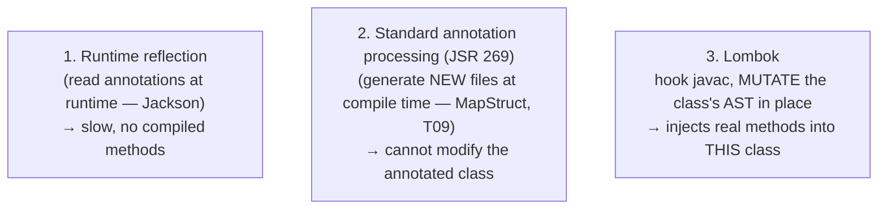
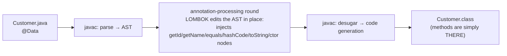

# Lombok

A typical Java "data class" — a handful of fields plus getters, setters, `equals`, `hashCode`, `toString`, and a constructor or two — is 80% **boilerplate**. Your IDE can *generate* it, but you still have to *read* it, *maintain* it, and keep it in sync (add a field, and `equals`/`hashCode`/`toString`/the constructor all silently drift unless you remember to update them). **Lombok** makes the class **declarative**: you write `@Data` and the getters/setters/`equals`/`hashCode`/`toString` simply exist. The remarkable part — and the reason this topic sits in a *build-tools* chapter — is **how**: Lombok is **not** runtime reflection and **not** a normal annotation processor. It hooks into `javac` and **mutates the compiler's syntax tree in place**, injecting *real* methods that become *real* bytecode. The generated `getName()` is byte-for-byte what you'd have hand-written, with **zero runtime cost** and **no runtime dependency**.

The depth-bar: at the **language** layer, the annotation catalogue (`@Getter`/`@Setter`, `@ToString`, `@EqualsAndHashCode`, the constructor annotations, the `@Data`/`@Value` bundles, `@Builder`, `@Slf4j`, `@NonNull`, `@SneakyThrows`, `@With`), and the modern question of **records vs Lombok**. At the **architecture** layer — the heart of the topic — *how* Lombok works: it runs during `javac`'s annotation-processing round but, instead of generating new files like a standard processor, it **edits the existing class's AST** through **internal `com.sun.tools.javac` APIs** (a "benevolent hack"); the consequences (zero runtime cost — the methods are compiled in, [T06](./T06-code-formatters-and-linters-checkstyle-spotless.md)/[T07](./T07-static-analysis-pmd-spotbugs-sonarqube.md) zero-runtime-footprint echo, but Lombok *adds* bytecode rather than merely checking it; `compileOnly` scope; `--add-opens` on JPMS; the IDE plugin requirement; `delombok`); and the contrast with a *standard* processor like MapStruct ([T09](./T09-mapstruct.md)) that can only **generate new files**, never modify the annotated class — which [T10](./T10-annotation-processing.md) then explains in full.

> [!NOTE]
> Prerequisites: [Static analysis](./T07-static-analysis-pmd-spotbugs-sonarqube.md) (L2/C02/T07) — the **compile-time, zero-runtime-footprint** tooling context; [Record types](../../L1-core-java/C01-oop/T14-record-types.md) (L1/C01/T14) — the **native immutable carrier** Lombok's `@Value` competes with; [`equals`/`hashCode`/`toString` contracts](../../L1-core-java/C01-oop/T10-equals-hashcode-tostring-contracts.md) (L1/C01/T10) — **what `@EqualsAndHashCode`/`@ToString` generate and the contracts they must honour**; [Source → bytecode → JVM → machine code](../../L0-foundations/C01-cs-foundations/T04-source-to-bytecode-to-jvm-to-machine-code.md) (L0/C01/T04) — the **`javac` pipeline and `.class` output** Lombok hooks into.

## The Boilerplate Problem

A six-field value class, written by hand (or IDE-generated), is roughly 150 lines: a field, a getter and setter each, an all-args constructor, `equals` comparing all six fields, a matching `hashCode`, and a `toString`. None of it is interesting, all of it must be *read* by the next person, and all of it **drifts**: add a seventh field and `equals`/`hashCode`/`toString`/the constructor are now silently wrong until someone regenerates them. The cost was never the typing — it's the **reading and the maintenance**. Lombok collapses the class to its essence:

```java
// Hand-written: ~150 lines of getters/setters/equals/hashCode/toString/ctor
// With Lombok:
@Data
@Builder
public class Customer {
    private Long id;
    private String name;
    private String email;
}
// @Data → getters + setters + equals + hashCode + toString + a required-args ctor.
// @Builder → Customer.builder().id(1L).name("Ada").email("a@x.io").build()
```

## The Core Annotations

| Annotation | Generates |
|------------|-----------|
| `@Getter` / `@Setter` | accessors (class- or field-level; respects `AccessLevel`) |
| `@ToString` | `toString()` (with `of`/`exclude`, `callSuper`) |
| `@EqualsAndHashCode` | `equals` + `hashCode` (honouring the contract — [L1/C01/T10](../../L1-core-java/C01-oop/T10-equals-hashcode-tostring-contracts.md)) |
| `@NoArgsConstructor` / `@AllArgsConstructor` / `@RequiredArgsConstructor` | constructors (`Required` = `final` + `@NonNull` fields) |
| **`@Data`** | the mutable-bundle: `@Getter`+`@Setter`+`@ToString`+`@EqualsAndHashCode`+`@RequiredArgsConstructor` |
| **`@Value`** | the **immutable** bundle: `final` class, `private final` fields, getters, no setters, all-args ctor, `@ToString`/`@EqualsAndHashCode` |
| **`@Builder`** | the fluent builder pattern (`@Builder.Default`, `toBuilder`, `@Singular` for collections) |
| `@Slf4j` / `@Log4j2` / `@Log` | a `private static final Logger log` field |
| `@NonNull` | a null-check (throws `NullPointerException`) on a parameter/field at entry — the thrown type is configurable project-wide via `lombok.config` (`lombok.nonNull.exceptionType=IllegalArgumentException`) |
| `@SneakyThrows` | throw a checked exception **without declaring** `throws` |
| `@Cleanup` | auto-close a resource (a `try/finally` around it) |
| `@With` | a copy-with-one-field-changed method (`withName(x)` returns a new instance) — an immutability helper |

`@Data` is the everyday workhorse for a mutable DTO; `@Value` for an immutable one; `@Builder` whenever a constructor would have many parameters (especially with optional ones). `@Slf4j` removes the ritual `private static final Logger log = LoggerFactory.getLogger(Foo.class);` line.

## Records vs Lombok

Since Java 16, **records** ([L1/C01/T14](../../L1-core-java/C01-oop/T14-record-types.md)) give you — *in the language, with no dependency* — a `final` class with `private final` components, a canonical constructor, accessors, and `equals`/`hashCode`/`toString`. That's exactly the `@Value` case. So the decision has shifted:

| Need | Prefer |
|------|--------|
| New **immutable** DTO / value object (Java 16+) | **record** — native, no dep, pattern-matching-friendly ([L1/C01/T14](../../L1-core-java/C01-oop/T14-record-types.md)) |
| **Mutable** class (e.g. a JPA entity — records can't be entities) | Lombok `@Getter`/`@Setter` |
| A **builder** with many/optional params | Lombok `@Builder` (records can use it too, but it's Lombok's) |
| A **logger** field | Lombok `@Slf4j` |
| `@With` / `@SneakyThrows` / `@Cleanup` conveniences | Lombok |
| **Pre-record** codebase (Java 8–15) | Lombok |

> [!TIP]
> For a **new immutable carrier on Java 16+, reach for a record first** ([L1/C01/T14](../../L1-core-java/C01-oop/T14-record-types.md)) — it's native, dependency-free, and works with pattern matching. Keep Lombok for **mutable** classes, **entities**, **builders**, **loggers**, and the conveniences records don't cover. Records and Lombok coexist happily in one codebase.

## Memory & Architecture Layer — How Lombok Actually Works

A library that wants to "add behaviour from an annotation" has three options, and Lombok's choice is the unusual one:



Lombok takes door #3. It registers as an annotation processor so `javac` invokes it during the **annotation-processing round**, but instead of *generating a new file* it reaches into the compiler's own data structures and **edits the abstract syntax tree of your class**, adding the getter/`equals`/builder method nodes *before* code generation runs:



### Consequence 1 — Zero Runtime Cost, Real Bytecode

Because the methods are injected into the AST *before* code generation, the emitted `Customer.class` contains `getName()`, `equals`, `hashCode`, etc. as **ordinary compiled methods** — **byte-identical** to hand-written ones. There is **no reflection, no proxy, no runtime library**: Lombok is declared `compileOnly` (Gradle) / `provided` (Maven) — needed only by the compiler ([T01](./T01-maven-lifecycle-pom-dependencies-plugins.md)/[T02](./T02-gradle-tasks-build-scripts-dependencies.md)), never on the runtime classpath. Run `javap -p Customer.class` and the generated methods are right there. This is the same **compile-time, zero-runtime-footprint** property as formatting and static analysis ([T06](./T06-code-formatters-and-linters-checkstyle-spotless.md)/[T07](./T07-static-analysis-pmd-spotbugs-sonarqube.md)) — with one difference: those tools only *read/check* your code, whereas Lombok *adds* to the bytecode. It's a code **generator**, not a checker.

### Consequence 2 — It's an Internal-API "Hack"

The catch is that the public annotation-processing API (**JSR 269**) deliberately **forbids modifying existing classes** — a standard processor may only create *new* files ([T10](./T10-annotation-processing.md)). To edit your class in place, Lombok uses **unofficial internal APIs** (`com.sun.tools.javac.tree.JCTree`, …). That has real consequences:

- **JPMS lockdown (Java 9+).** Those internals are encapsulated, so Lombok needs `--add-opens jdk.compiler/...` exports to reach them. Build plugins usually wire this for you, but it's why Lombok occasionally needs config the moment you cross a JDK boundary.
- **JDK-upgrade fragility.** A new JDK can change those internals and **break Lombok** until a new Lombok release catches up. Pin and upgrade Lombok *together with* your JDK.
- **IDE support needs the Lombok plugin.** The IDE compiles/indexes your code separately, so it must run the **same AST trick** to *see* the generated members — without the plugin the IDE reports "cannot find symbol `getName()`" even though `javac` is perfectly happy.

**`delombok`** is the escape hatch: it runs Lombok and emits the **expanded source** — exactly what the AST became — so you can inspect what was generated or remove Lombok from a project entirely.

> [!IMPORTANT]
> Contrast with the rest of the C02 annotation trio. **MapStruct ([T09](./T09-mapstruct.md))** is a *standard* JSR 269 processor: it **generates a new mapper implementation class** and never touches your code. **Lombok modifies your class** via internal APIs. Same trigger (annotations at compile time), opposite mechanism — *generate a sibling* vs *mutate in place*. [T10](./T10-annotation-processing.md) explains the standard, sanctioned mechanism in depth; Lombok is the famous exception that bends the rules.

> [!WARNING]
> **Do not put `@Data` (or `@EqualsAndHashCode` over all fields) on a JPA entity.** Auto-generating `equals`/`hashCode`/`toString` over *all* fields breaks entities three ways: (1) a field used in `hashCode` that **mutates** after the entity is in a `HashSet`/`HashMap` makes it unfindable ([L1/C01/T10](../../L1-core-java/C01-oop/T10-equals-hashcode-tostring-contracts.md)); (2) `equals`/`hashCode`/`toString` touching **lazy associations** triggers extra queries or a `LazyInitializationException`; (3) JPA identity should be by `@Id`, not by all fields. Use `@Getter`/`@Setter` plus a **hand-written `equals`/`hashCode` on the `@Id`** (or a stable business key). A bidirectional association in `@ToString` also causes **infinite recursion** — exclude the back-reference.

## Common Mistakes

### `@Data` on JPA Entities

The single most common Lombok bug — see the warning above. `@Data`'s all-field `equals`/`hashCode`/`toString` is wrong for entities (identity, lazy loading, mutation-as-key). Use `@Getter`/`@Setter` + `@Id`-based `equals`.

### `@EqualsAndHashCode` Over Mutable Keys

Including a field that later changes means an object placed in a `HashSet`/`HashMap` is **lost** (its bucket no longer matches its `hashCode` — [L1/C01/T10](../../L1-core-java/C01-oop/T10-equals-hashcode-tostring-contracts.md)). Include only **stable** fields (`@EqualsAndHashCode.Include` on a key, or `onlyExplicitlyIncluded`).

### `@Builder` Without `@Builder.Default`

A field initializer (`private int size = 10;`) is **silently ignored** by the generated builder unless you add `@Builder.Default` — the builder leaves it at the type default (`0`). Easy to miss; add defaults explicitly and validate required fields.

### `@SneakyThrows` to Dodge Checked Exceptions

It throws a checked exception **without declaring** it, so callers can't see or handle it. Occasionally justified (lambdas, truly-can't-happen), but routine use hides the real failure surface. Prefer declaring or wrapping.

### Lombok Version vs JDK Mismatch

Because Lombok rides internal `javac` APIs, a JDK upgrade can break it. Symptom: cryptic compiler crashes after bumping the JDK. **Upgrade Lombok alongside the JDK.**

### Missing IDE Plugin / `--add-opens`

Without the IDE Lombok plugin (or the JPMS opens on newer setups), the IDE can't see generated members → a sea of false "cannot find symbol" errors even though the build succeeds.

### Reaching for Lombok Where a Record Fits

A new immutable carrier on Java 16+ is a **record** ([L1/C01/T14](../../L1-core-java/C01-oop/T14-record-types.md)) — native, no dependency, pattern-matchable. Don't add a Lombok `@Value` out of habit.

### Treating Lombok as Runtime Magic

Lombok is **compile-time**; the methods are baked into your bytecode and there is **no runtime dependency**. Declaring it `implementation`/runtime scope (or expecting reflection-like behaviour) misunderstands it — keep it `compileOnly`/`provided`. A repo-root **`lombok.config`** file tunes behavior project-wide — `lombok.addLombokGeneratedAnnotation = true` makes generated methods `@lombok.Generated` so coverage tools (JaCoCo) skip them, `config.stopBubbling = true` marks the project root, and per-feature flags (like the `@NonNull` exception type above) live here too.

> [!INTERVIEW]
> Lombok questions almost always pivot to "how does it *work*" — the AST-mutation answer is what separates a user from someone who understands the toolchain.
>
> 1. **What is Lombok?** A compile-time code generator driven by annotations (`@Data`/`@Value`/`@Builder`/`@Getter`…) that injects boilerplate (accessors, `equals`/`hashCode`/`toString`, constructors, builders, loggers) into your class.
> 2. **Is it runtime reflection?** **No** — it generates *real methods into the bytecode at compile time*; zero runtime cost, no runtime dependency (`compileOnly`/`provided`).
> 3. **How does it work internally?** It hooks `javac`'s annotation-processing round but **mutates the compiler's AST in place** (via internal `com.sun.tools.javac` APIs), adding the methods before code generation.
> 4. **Why does it need `--add-opens` on newer JDKs?** It reaches into `javac` internals (not the public processing API), which JPMS (Java 9+) encapsulates — so those packages must be opened.
> 5. **Lombok vs a standard annotation processor (MapStruct)?** A standard JSR 269 processor can only **generate new files**, never modify the annotated class; Lombok **modifies the class's AST in place** — an unofficial trick. ([T09](./T09-mapstruct.md)/[T10](./T10-annotation-processing.md).)
> 6. **What does `@Data` bundle?** `@Getter` + `@Setter` + `@ToString` + `@EqualsAndHashCode` + `@RequiredArgsConstructor`.
> 7. **`@Data` vs `@Value`?** `@Data` = mutable data class; `@Value` = immutable (`final` class/fields, no setters).
> 8. **Records vs Lombok?** Records (Java 16+) natively cover immutable carriers (no dep, pattern matching — [L1/C01/T14](../../L1-core-java/C01-oop/T14-record-types.md)); Lombok covers mutable classes, entities, builders, loggers, and pre-record code.
> 9. **Why is `@Data` dangerous on a JPA entity?** All-field `equals`/`hashCode`/`toString` breaks identity, triggers lazy loads / `LazyInitializationException`, and loses mutated keys — use `@Id`-based `equals` ([L1/C01/T10](../../L1-core-java/C01-oop/T10-equals-hashcode-tostring-contracts.md)).
> 10. **What scope should Lombok have?** `compileOnly` / `provided` — it's not needed at runtime.
> 11. **What is `delombok`?** A tool that emits the expanded source (what Lombok generated) — to inspect it or to remove Lombok.
> 12. **Why does the IDE need a plugin?** So it runs the same AST trick and recognizes the generated members; otherwise it reports "cannot find symbol" for `getX()`.

## Practice

1. **Add Lombok.** Wire it as `compileOnly` + `annotationProcessor` (Gradle) / `provided` (Maven); annotate a class `@Getter`/`@Setter`; call the generated accessors.
2. **`@Data`.** Put `@Data` on a five-field class; compare the source length to the hand-written equivalent.
3. **`@Builder`.** Build an object via the fluent builder; add `@Builder.Default` and observe a default that was previously dropped; use `@Singular` for a list field.
4. **`@Value` vs record.** Write the same immutable carrier as a Lombok `@Value` and as a record ([L1/C01/T14](../../L1-core-java/C01-oop/T14-record-types.md)); compare.
5. **delombok.** Run `delombok` on the class and read the expanded source — see exactly what was injected.
6. **Prove it's real bytecode.** `javap -p` the compiled `.class`; confirm `getName()`/`equals`/`hashCode` are **real methods** (not reflection).
7. **No runtime dep.** Inspect the built JAR / runtime classpath; confirm `lombok.jar` is **not** shipped.
8. **Entity pitfall.** Put `@Data` on a JPA-style entity with a bidirectional association; reproduce the `@ToString` recursion and the all-field `equals`; fix with `@Getter`/`@Setter` + `@Id`-based `equals` ([L1/C01/T10](../../L1-core-java/C01-oop/T10-equals-hashcode-tostring-contracts.md)).
9. **Mutable-key bug.** Put an `@EqualsAndHashCode` object in a `HashSet`, mutate an included field, confirm it's "lost"; fix by including only a stable key.
10. **`@Slf4j`.** Use `log.info(...)` with no declared logger; `javap` the `private static final` logger field.
11. **`@NonNull` / `@SneakyThrows`.** Pass `null` to a `@NonNull` param and observe the NPE; use `@SneakyThrows` and observe a checked exception thrown with no `throws` clause.
12. **Break it on purpose.** Disable the IDE Lombok plugin (or drop the `--add-opens`) and watch the IDE flood with "cannot find symbol" while the build still passes — understanding why.
13. **Records-vs-Lombok decision.** For three real classes (a mutable entity, an immutable DTO, a many-field config), decide record vs `@Value` vs `@Data` and justify each.
14. **Explain it back.** For `@Data` on a class, trace (a) *where* Lombok runs in the `javac` pipeline, (b) that it **mutates the AST in place** rather than generating a new file, (c) why the result is **zero-runtime-cost real bytecode**, (d) why a **record** might be better for an immutable version, and (e) why `@Data` is wrong on an entity.

## Recap

You should now be able to:

- Use Lombok's core annotations — `@Getter`/`@Setter`, `@ToString`, `@EqualsAndHashCode`, the constructor annotations, the **`@Data`** (mutable) and **`@Value`** (immutable) bundles, **`@Builder`**, `@Slf4j`, `@NonNull`, `@SneakyThrows`, `@With` — to eliminate boilerplate.
- Decide **records vs Lombok**: records ([L1/C01/T14](../../L1-core-java/C01-oop/T14-record-types.md)) for new immutable carriers on Java 16+; Lombok for mutable classes, entities, builders, loggers, and pre-record code.
- Explain the **architecture**: Lombok is neither reflection nor a standard processor — it hooks `javac` and **mutates the class's AST in place** via internal `com.sun.tools.javac` APIs, so the generated methods are **real, byte-identical bytecode** ([L0/C01/T04](../../L0-foundations/C01-cs-foundations/T04-source-to-bytecode-to-jvm-to-machine-code.md)) with **zero runtime cost** and **no runtime dependency** (`compileOnly`/`provided`).
- State the consequences of the internal-API approach: `--add-opens` on JPMS, JDK-upgrade fragility, the IDE-plugin requirement, and `delombok` to inspect/remove — and contrast it with a *standard* processor (MapStruct, [T09](./T09-mapstruct.md)) that only **generates new files**, the mechanism [T10](./T10-annotation-processing.md) details.
- Avoid the traps — especially **`@Data` on JPA entities** (use `@Id`-based `equals`), mutable `@EqualsAndHashCode` keys, `@Builder` without `@Builder.Default`, `@SneakyThrows` overuse, JDK/Lombok version mismatch, missing IDE plugin, choosing Lombok where a record fits, and treating it as runtime magic.

## Next

Continue to [MapStruct](./T09-mapstruct.md).
