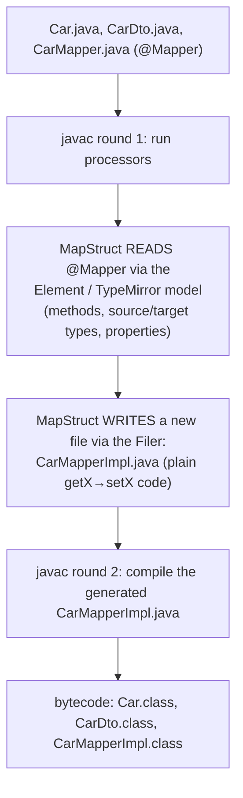
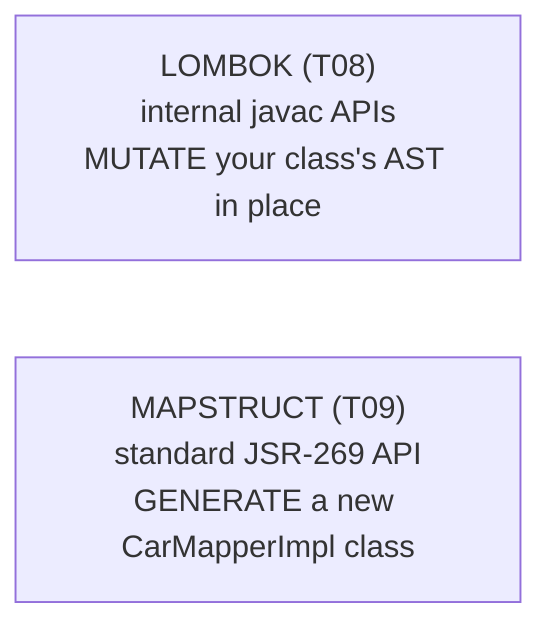

# MapStruct

Real applications carry the *same* data in several shapes: a JPA **entity** (the database row), a **domain** model, a **DTO** at the service boundary, an **API** request/response. Moving a value from one shape to another means endless hand-written `dto.setName(entity.getName())` copying — tedious, slow to maintain as models evolve, and quietly dangerous: forget one field and it's silently `null`, with **no error at all**. **MapStruct** removes the drudgery: you declare a `@Mapper` **interface** with abstract methods (`CarDto toDto(Car car);`) and MapStruct **generates the implementation at compile time** — plain, readable getter/setter code. And it's the perfect sequel to Lombok ([T08](./T08-lombok.md)), because it works the **opposite** way: where Lombok *mutates your class's AST in place* via internal APIs, MapStruct is the **textbook standard annotation processor** — it **generates a brand-new class** (`CarMapperImpl`) and never touches yours. That contrast is the bridge into the full annotation-processing mechanism ([T10](./T10-annotation-processing.md)).

The depth-bar: at the **language** layer, the mapping model (`@Mapper`, `@Mapping`, automatic/nested/collection mapping, custom logic via `@Named`/`uses`, `@MappingTarget` updates, the all-important `unmappedTargetPolicy = ERROR`, `componentModel = "spring"`), and **why MapStruct beats reflection-based mappers** (ModelMapper/Dozer). At the **architecture** layer — the heart — *how* it works: a **standard JSR-269 processor** that reads your `@Mapper` through the **`Element`/`TypeMirror`** model (the compiler's read-only program API), **writes a new source file** through the **`Filer`**, and lets `javac` compile it in a later **round**; why that produces **real, reflection-free bytecode** with **zero runtime cost** ([T06](./T06-code-formatters-and-linters-checkstyle-spotless.md)/[T07](./T07-static-analysis-pmd-spotbugs-sonarqube.md)/[T08](./T08-lombok.md) echo); and the precise reason it **generates a sibling** instead of editing your type — the standard API *forbids* modifying existing classes, which is exactly the rule Lombok had to break.

> [!NOTE]
> Prerequisites: [Lombok](./T08-lombok.md) (L2/C02/T08) — **the in-place-AST-mutation mechanism MapStruct contrasts with, and the annotation trio**; [Source → bytecode → JVM → machine code](../../L0-foundations/C01-cs-foundations/T04-source-to-bytecode-to-jvm-to-machine-code.md) (L0/C01/T04) — the **`javac` pipeline and processing rounds**; [Record types](../../L1-core-java/C01-oop/T14-record-types.md) (L1/C01/T14) — **records as immutable mapping targets** (constructor-based mapping); [Interfaces](../../L1-core-java/C01-oop/T08-interfaces-default-static-private-methods.md) (L1/C01/T08) — a `@Mapper` is an **interface** whose implementation is generated.

## The Mapping Problem

A layered architecture deliberately keeps representations separate — the entity knows about the database, the DTO knows about the API contract, and you don't want either leaking into the other. The price is **translation code**. A thirty-field object needs thirty assignments, and the failure mode is insidious: a missing assignment doesn't throw — the target field just stays at its default, so a real value silently vanishes between layers. Multiply by every model pair, keep it in sync as fields come and go, and bean-mapping becomes a genuine maintenance tax:

```java
// Hand-written: dozens of setX(getX()) lines, drift-prone, silent on omissions.
// MapStruct: declare the contract, the implementation is generated.
@Mapper(componentModel = "spring", unmappedTargetPolicy = ReportingPolicy.ERROR)
public interface CarMapper {
    @Mapping(source = "make", target = "manufacturer")
    @Mapping(source = "engine.power", target = "horsepower")  // nested
    CarDto toDto(Car car);

    List<CarDto> toDtos(List<Car> cars);                       // collection
}
```

## Core — `@Mapper` and `@Mapping`

Put **`@Mapper`** on an interface (or abstract class) and declare abstract mapping methods; MapStruct generates `CarMapperImpl implements CarMapper`. You obtain it via `Mappers.getMapper(CarMapper.class)` or, with `componentModel = "spring"`, as an injectable `@Component`. The generator's behaviour:

- **Automatic mapping** — properties with the **same name and a compatible type** are mapped with no configuration; built-in type conversions (e.g. `int`↔`String`, `LocalDate`↔`String` with a format) apply implicitly.
- **`@Mapping`** handles the rest — `source`/`target` to **rename**, `expression = "java(...)"` for inline logic, `constant`, `defaultValue`, `ignore = true`, `dateFormat`/`numberFormat`.
- **Nested/deep mapping** — `source = "engine.power"` navigates the graph (null-safely, in the generated code).
- **Collections & maps** — declare `List<CarDto> toDtos(List<Car>)` and MapStruct generates the loop, reusing the element mapper.
- **Custom logic** — `qualifiedByName` + an `@Named` method to disambiguate; `uses = { OtherMapper.class }` to compose mappers; plain `default` methods in the interface for anything hand-written.
- **Update mapping** — `void update(CarDto src, @MappingTarget Car target)` maps *into* an existing object rather than creating one.
- **`unmappedTargetPolicy = ReportingPolicy.ERROR`** — make any **unmapped target field a build failure**. This is the feature that turns the silent-data-loss problem into a compile error — the single most valuable setting.
- **`@ValueMapping`** (enum-to-enum), **`@InheritConfiguration`**/`@InheritInverseConfiguration` (reuse a mapping for the reverse direction).

## Why MapStruct Beats Reflection-Based Mappers

The older alternatives — **ModelMapper**, **Dozer** — map at **runtime** by reflecting over getters/setters and matching by name. That choice costs on every axis:

| | **MapStruct** (compile-time codegen) | **Reflection mapper** (ModelMapper/Dozer) |
|---|---|---|
| **Speed** | plain getter/setter calls — as fast as hand-written | reflection per field per call — slow |
| **Type safety** | a mismatch is a **compile error** | a mismatch is a runtime surprise or **silent skip** |
| **Debuggability** | read/step the generated `*Impl` | opaque runtime magic |
| **Startup** | nothing to do | reflective configuration cost |
| **Runtime deps** | tiny annotations jar, no reflection | a reflection framework on the classpath |

MapStruct moves the work from *runtime* to *compile time* — exactly the chapter's recurring theme ([T06](./T06-code-formatters-and-linters-checkstyle-spotless.md)/[T07](./T07-static-analysis-pmd-spotbugs-sonarqube.md)/[T08](./T08-lombok.md)). You pay a few milliseconds at build and gain speed, type-safety, and a mapper you can actually read.

## Memory & Architecture Layer — How MapStruct Works

MapStruct is a **standard annotation processor**: a class implementing `javax.annotation.processing.Processor` (**JSR 269**), shipped on the **processor path** (the `annotationProcessor` configuration — [T01](./T01-maven-lifecycle-pom-dependencies-plugins.md)/[T02](./T02-gradle-tasks-build-scripts-dependencies.md)) and discovered by `javac` via `META-INF/services`. During compilation, `javac` runs it in the **annotation-processing rounds**:



- **It reads via the `Element` / `TypeMirror` model** — the compiler's **read-only** API for inspecting program structure (types, methods, parameters, properties). MapStruct examines each `@Mapper` method's source and target types and their accessors. This is the *public, sanctioned* API — the contrast with Lombok's internal `JCTree`.
- **It writes via the `Filer`** — the official way a processor *creates new files*. MapStruct emits `CarMapperImpl.java`, which `javac` then compiles in a **subsequent round** (generated code can itself be processed — the multi-round model).

### The Critical Contrast With Lombok

This is the payoff of putting the two topics back to back:



A **standard processor can only create new files — it cannot modify the annotated type** (the `Element` API is read-only on existing code). That is *precisely why* MapStruct produces a separate `CarMapperImpl` while Lombok had to reach into `javac` internals to edit your class in place. **Same trigger** (annotations, compile time, the processing round); **opposite mechanism** (generate-a-sibling vs mutate-in-place). MapStruct is the clean, by-the-book example; Lombok is the famous rule-bender. [T10](./T10-annotation-processing.md) generalizes this into the full processing model.

### Zero Runtime Cost, Readable Output

The generated `CarMapperImpl` is **real compiled bytecode** — plain `getX()`/`setX()` calls ([L0/C01/T04](../../L0-foundations/C01-cs-foundations/T04-source-to-bytecode-to-jvm-to-machine-code.md)), **no reflection**, near-zero overhead. MapStruct's runtime jar is tiny (just annotations + a few helpers); the processor itself is `annotationProcessor`/`provided` scope. And crucially the output is **readable**: it lives in `build/generated/sources/annotationProcessor/` (Gradle) / `target/generated-sources/annotations/` (Maven), so you can open it, review it, and step through it in a debugger — the debuggability that reflection mappers can't offer.

**Records as targets** ([L1/C01/T14](../../L1-core-java/C01-oop/T14-record-types.md)): a record has no setters, so MapStruct maps through the **canonical constructor** instead — it adapts the generation strategy to the target's shape.

> [!IMPORTANT]
> Set **`unmappedTargetPolicy = ReportingPolicy.ERROR`** on every mapper. It makes an unmapped target field **fail the build** instead of silently shipping a `null`. This single setting converts MapStruct from "convenient" to "safe" — it's the compile-time guarantee that you didn't drop a field when a model grew.

> [!WARNING]
> **Lombok + MapStruct ordering.** If your source/target types use Lombok `@Getter`/`@Setter`/`@Data` ([T08](./T08-lombok.md)), MapStruct must see those accessors when it inspects the `@Mapper` — but Lombok generates them in the *same* compile. If Lombok hasn't run first, MapStruct finds **no properties** and silently generates **empty mappings**. The fix is the **`lombok-mapstruct-binding`** artifact (or correct `annotationProcessor` ordering), which guarantees Lombok runs first. A neat demonstration that processors compose and **order matters** ([T10](./T10-annotation-processing.md)).

> [!TIP]
> **Read the generated `*Impl`.** Unlike a reflection mapper, MapStruct's output is plain Java in `build/generated/` — review it to confirm the mapping is exactly what you intended, to debug a surprising result, and to *learn* what each annotation actually does. "Trust but verify" is cheap here because the code is right there.

## Common Mistakes

### Not Setting `unmappedTargetPolicy = ERROR`

The default just *warns* (or is silent) on unmapped target fields, so a forgotten mapping = silent data loss. Always make it an **error**. (See the callout above.)

### Name Mismatch Without a `@Mapping`

If `make` should map to `manufacturer`, MapStruct won't guess — without an explicit `@Mapping`, the target is unmapped (and, without the ERROR policy, you won't even hear about it).

### Lombok/MapStruct Processor Ordering

No `lombok-mapstruct-binding` → MapStruct can't see Lombok-generated accessors → **empty mappings**. The bug looks like "MapStruct does nothing." Add the binding.

### Reaching for a Reflection Mapper "to Avoid Config"

ModelMapper/Dozer feel like less setup, but you trade away compile-time safety, speed, and debuggability — and a silent mis-map is far costlier than a `@Mapping` line.

### Not Reading the Generated Code

The `*Impl` is right there in `build/generated/`. Assuming the mapping instead of reading it hides exactly the surprises (a default conversion, a skipped field) you'd want to catch.

### Forgetting `componentModel` for DI

Want an injectable Spring bean but used `Mappers.getMapper(...)` (or vice versa)? Set `componentModel = "spring"` (or `cdi`/`jsr330`) to generate a managed component.

### Ambiguous Mapping Methods

Two candidate methods can map the same type → MapStruct can't choose. Disambiguate with `@Named` + `qualifiedByName`.

### Heavy Logic in `expression = "java(...)"`

String-embedded Java is unchecked, unformatted, and ugly. Put real logic in a `@Named`/`default` method and reference it.

> [!INTERVIEW]
> MapStruct interview questions hinge on the *mechanism* — "it generates a class" — and the contrast with reflection mappers and with Lombok.
>
> 1. **What is MapStruct?** A compile-time bean-mapping code generator: declare a `@Mapper` interface, and it generates the implementation (plain getter/setter calls).
> 2. **MapStruct vs reflection mappers (ModelMapper/Dozer)?** MapStruct generates code at **compile time** → fast (no reflection), **type-safe** (mismatch = compile error), debuggable; reflection mappers map at runtime → slower, error-prone, opaque.
> 3. **How does MapStruct work internally?** It's a **standard JSR-269 processor**: it reads the `@Mapper` via the **`Element`/`TypeMirror`** model and **generates a new `*Impl` source file** via the **`Filer`**, which `javac` compiles in a later round.
> 4. **MapStruct vs Lombok — the mechanism difference?** MapStruct (standard processor) **generates a new class** and can't modify yours; Lombok **mutates your class's AST** via internal APIs. Same trigger, opposite mechanism ([T10](./T10-annotation-processing.md)).
> 5. **What does `unmappedTargetPolicy = ERROR` do?** Fails the build if any target field is unmapped — turns silent data loss into a compile error.
> 6. **How do you customise a mapping?** `@Mapping` (`source`/`target`/`expression`/`constant`/`ignore`), `qualifiedByName` + `@Named`, `uses =`, and `default` interface methods.
> 7. **How do you get a Spring bean?** `componentModel = "spring"` → an `@Component` you can inject.
> 8. **Where does the generated code live?** `build/generated/...` (Gradle) / `target/generated-sources/...` (Maven) — readable and debuggable.
> 9. **How does MapStruct map to a record?** Through the **canonical constructor** (records have no setters — [L1/C01/T14](../../L1-core-java/C01-oop/T14-record-types.md)).
> 10. **What's the Lombok + MapStruct gotcha?** MapStruct must see Lombok-generated accessors → it needs **`lombok-mapstruct-binding`** / correct processor ordering, else empty mappings.
> 11. **Runtime overhead?** Essentially none — plain getter/setter calls, no reflection; tiny runtime jar.
> 12. **Why is MapStruct the "textbook" annotation processor?** It only **generates new files** — the sanctioned JSR-269 model — unlike Lombok's in-place hack; the clean example [T10](./T10-annotation-processing.md) generalizes.

## Practice

1. **First mapper.** Define a `@Mapper` interface with `toDto`/`toEntity`; generate; use it via `Mappers.getMapper(...)`.
2. **Read the output.** Open the generated `*Impl` in `build/generated/`; read the plain getter/setter code.
3. **Catch a dropped field.** Turn on `unmappedTargetPolicy = ERROR`; add a target field with no mapping; watch the **build fail** (and confirm it was *silent* before).
4. **Rename + nested.** Use `@Mapping(source=, target=)` to rename, and `source = "a.b.c"` for a nested path.
5. **Collections.** Declare `List<CarDto> toDtos(List<Car>)`; read the generated loop reusing the element mapper.
6. **Custom logic.** Disambiguate with `qualifiedByName` + `@Named`; compose with `uses = {...}`.
7. **Update mapping.** Use `@MappingTarget` to map into an existing object.
8. **Spring DI.** Set `componentModel = "spring"`; `@Autowired` the mapper into a service.
9. **Record target.** Map to a **record** ([L1/C01/T14](../../L1-core-java/C01-oop/T14-record-types.md)); confirm the generated code uses the **constructor**, not setters.
10. **Lombok ordering.** Make source/target `@Data`; reproduce **empty mappings** without `lombok-mapstruct-binding`, then fix by adding it.
11. **Versus reflection.** Map the same objects with ModelMapper; introduce a name mismatch and observe **no compile error** (vs MapStruct's) and the perf/debuggability gap.
12. **No reflection.** Inspect the generated `*Impl` and the runtime classpath; confirm there's no reflection and only the small MapStruct jar.
13. **Trace the rounds.** Enable processor logging; observe MapStruct read `@Mapper` (round 1) and `javac` compile the `*Impl` (round 2).
14. **Explain it back.** For `CarDto toDto(Car)`, trace (a) MapStruct reading the `@Mapper` via the **Element model**, (b) generating `CarMapperImpl` via the **Filer**, (c) `javac` compiling it in a later round, (d) why this is the **opposite** of Lombok's in-place mutation, and (e) why it beats a reflection mapper.

## Recap

You should now be able to:

- Use MapStruct to eliminate bean-mapping boilerplate — `@Mapper` interfaces, `@Mapping` (rename/nested/expression/constant/ignore), automatic + collection mapping, `qualifiedByName`/`@Named`/`uses` for custom logic, `@MappingTarget` updates, `componentModel = "spring"`, and especially **`unmappedTargetPolicy = ERROR`** to make dropped fields a build failure.
- Explain **why MapStruct beats reflection-based mappers** (ModelMapper/Dozer): compile-time generated plain getter/setter calls → fast, **type-safe** (mismatch = compile error), debuggable, no runtime reflection.
- Describe the **architecture**: MapStruct is a **standard JSR-269 annotation processor** that **reads** your `@Mapper` via the **`Element`/`TypeMirror`** model and **writes a new `*Impl` file** via the **`Filer`**, which `javac` compiles in a later **round** — producing **real, reflection-free bytecode** ([L0/C01/T04](../../L0-foundations/C01-cs-foundations/T04-source-to-bytecode-to-jvm-to-machine-code.md)) at **zero runtime cost**.
- State the **critical contrast** with [Lombok](./T08-lombok.md): a standard processor can only **generate new files**, never modify the annotated type — which is exactly why MapStruct emits a sibling while Lombok mutates your AST in place; same trigger, opposite mechanism (the bridge to [T10](./T10-annotation-processing.md)).
- Handle the real-world details: **records as targets** map via the constructor; the **Lombok + MapStruct ordering** gotcha needs `lombok-mapstruct-binding`; and the generated code is **readable** in `build/generated/`.
- Avoid the traps — no `unmappedTargetPolicy = ERROR`, unguarded name mismatches, processor ordering, defaulting to a reflection mapper, never reading the generated code, missing `componentModel`, ambiguous methods, and heavy `expression` strings.

## Next

Continue to [Annotation processing](./T10-annotation-processing.md).
