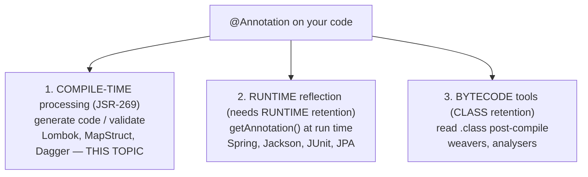
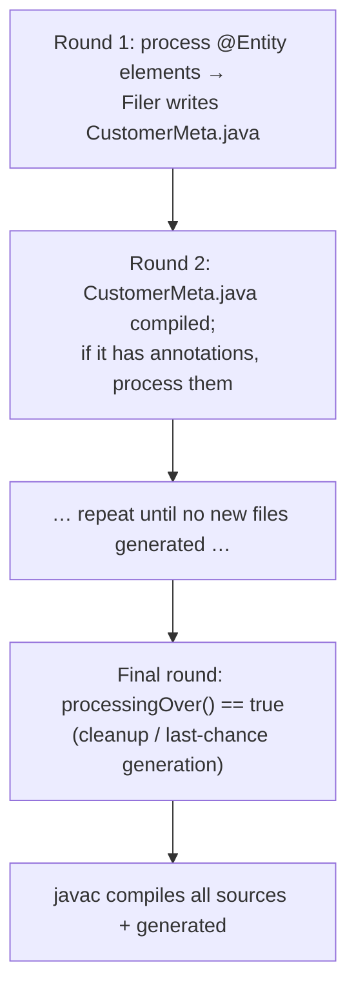
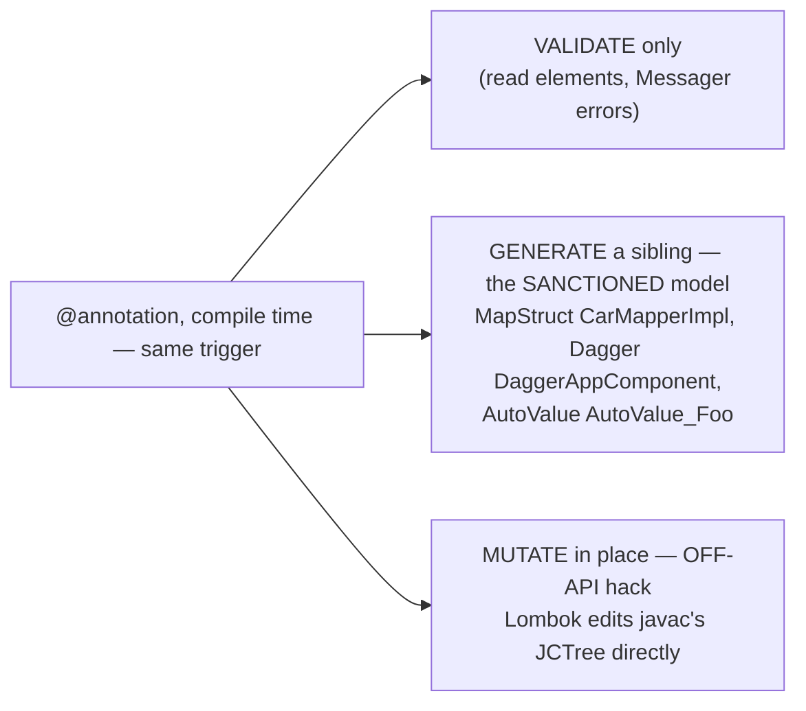

# Annotation processing

The last two topics showed two tools that do magic at compile time from an annotation: **Lombok** ([T08](./T08-lombok.md)) *mutates your class's AST in place*; **MapStruct** ([T09](./T09-mapstruct.md)) *generates a brand-new `*Impl` class*. This topic is the **capstone** — the general mechanism underneath both: **annotation processing**, standardized as **JSR 269** (`javax.annotation.processing`). It's a hook where `javac` hands your **annotated code** to plugins called **processors**, which **inspect** the program and **generate new source/class files** — all before a single line runs. By the end you'll understand *why* MapStruct must generate a sibling while Lombok had to break the rules, and you'll be able to **write a processor yourself**.

The depth-bar: at the **language** layer, what annotations actually are (metadata, custom `@interface` declarations, the **meta-annotations** — especially **`@Retention`**, the axis that decides whether an annotation survives to the bytecode and to runtime), and the **three ways annotations are consumed** (compile-time processing, runtime reflection, bytecode tools). At the **architecture** layer — the heart — the processor API (`AbstractProcessor`, `process()`, registration), the **round model** (`javac` runs processors repeatedly until no new files are generated), the **`Element`/`TypeMirror`** read-only program model, the **`Filer`** (write new files) and **`Messager`** (report errors on an element); the deep reason a processor can **only add, never modify** an existing class — the constraint that *forces* the MapStruct/Dagger generated-sibling pattern and that **Lombok deliberately bypasses**; where each retention physically lives in the **`.class`** ([L0/C01/T04](../../L0-foundations/C01-cs-foundations/T04-source-to-bytecode-to-jvm-to-machine-code.md)); and the build-time cost (incremental processors). It's all compile-time — **zero runtime footprint** ([T06](./T06-code-formatters-and-linters-checkstyle-spotless.md)/[T07](./T07-static-analysis-pmd-spotbugs-sonarqube.md)).

> [!NOTE]
> Prerequisites: [Lombok](./T08-lombok.md) (L2/C02/T08) — the **mutate-in-place** user (and why it's a "hack"); [MapStruct](./T09-mapstruct.md) (L2/C02/T09) — the **textbook generate-a-class** processor (`Element` model + `Filer`); [Source → bytecode → JVM → machine code](../../L0-foundations/C01-cs-foundations/T04-source-to-bytecode-to-jvm-to-machine-code.md) (L0/C01/T04) — the **`javac` pipeline, `.class` constant pool, and bytecode attributes** where retained annotations live.

## Annotations — Metadata on Code

An **annotation** is structured **metadata** attached to a declaration (a class, method, field, parameter, …) that a tool, the compiler, or the runtime can read. You've met the built-ins — `@Override` (a compiler check), `@Deprecated`, `@SuppressWarnings`, `@FunctionalInterface`. You declare your own with `@interface`:

```java
@Retention(RetentionPolicy.RUNTIME)
@Target(ElementType.TYPE)
public @interface Entity {
    String table() default "";   // an "element": looks like a method, has a default
}

@Entity(table = "customers")     // usage
public class Customer { /* ... */ }
```

Elements look like methods and may have defaults; their types are restricted to primitives, `String`, `Class`, enums, other annotations, and arrays of those. A single-element annotation named `value()` allows the shorthand `@Foo("x")`; an all-defaults annotation is just `@Foo`.

## Meta-Annotations — the Rules About an Annotation

Annotations *on* an annotation declaration configure how it behaves. The most important by far is **`@Retention`**:

| `@Retention` | In the `.class`? | Readable at runtime? | Used by | Example |
|--------------|:---:|:---:|---------|---------|
| **`SOURCE`** | no — discarded after compile | no | compile-time processors | `@Override`, Lombok `@Getter` |
| **`CLASS`** (default) | yes (`RuntimeInvisibleAnnotations`) | no | bytecode tools | most legacy annotations |
| **`RUNTIME`** | yes (`RuntimeVisibleAnnotations`) | **yes** (reflection) | runtime frameworks | Spring `@Component`, JUnit `@Test`, JPA `@Entity` |

This single choice decides *which consumption mode is even possible*. The other meta-annotations:

- **`@Target({ElementType.METHOD, …})`** — where the annotation may legally appear (`TYPE`, `METHOD`, `FIELD`, `PARAMETER`, `CONSTRUCTOR`, `TYPE_USE`, …). Misplacement is a compile error.
- **`@Documented`** — include it in Javadoc. **`@Inherited`** — a subclass inherits a class-level annotation. **`@Repeatable`** — apply the same annotation twice (via a generated container).

## Three Ways Annotations Are Consumed



1. **Compile-time annotation processing** — a processor reads annotated elements during compilation and **generates code or validates**. SOURCE retention is enough (the annotation has done its job by the time the build finishes). *This topic.*
2. **Runtime reflection** — the program reads its own annotations *while running* via `Class.getAnnotation(...)`. Requires **RUNTIME** retention. Flexible and dynamic, but pays a reflection cost and fails *late* (at startup/first-use, not at build).
3. **Bytecode tools** — external tools read the `.class` files. CLASS retention suffices.

> The modern trend is to **move work from #2 to #1**: frameworks like **Micronaut**, **Quarkus**, and **Dagger** do at *compile time* what Spring classically did with *runtime reflection* — yielding faster startup, build-time error detection, and GraalVM native-image compatibility (no runtime reflection metadata needed).

## The Processor API (JSR 269)

A processor implements `javax.annotation.processing.Processor`; you normally extend **`AbstractProcessor`** and override `process()`:

```java
@SupportedAnnotationTypes("com.acme.Entity")
@SupportedSourceVersion(SourceVersion.RELEASE_17)
public class EntityProcessor extends AbstractProcessor {
    @Override
    public boolean process(Set<? extends TypeElement> annotations, RoundEnvironment roundEnv) {
        for (Element e : roundEnv.getElementsAnnotatedWith(Entity.class)) {
            TypeElement type = (TypeElement) e;             // READ via the Element model
            // ... generate a companion class via the Filer ...
        }
        return true;   // true = "claimed"; other processors won't see these annotations
    }
}
```

**Registration** tells `javac` the processor exists: a line with its fully-qualified name in `META-INF/services/javax.annotation.processing.Processor` (or generate that file with Google's `@AutoService(Processor.class)`). It runs on the **processor path** — `javac -processor`/`-processorpath`, or the build tool's **`annotationProcessor`** configuration ([T01](./T01-maven-lifecycle-pom-dependencies-plugins.md)/[T02](./T02-gradle-tasks-build-scripts-dependencies.md)). (`-proc:none` disables processing; `-proc:only` runs processors without compiling.)

## Architecture — How Processing Actually Runs

### The Round Model

`javac` runs processors in **rounds**. In each round it gives a processor the elements annotated with its supported annotations; the processor inspects them and may **generate new files**. Crucially, **generated source files become input to the *next* round** — so generated code can itself carry annotations that trigger further processing — until a round produces **no new files**, followed by a final round where `roundEnv.processingOver()` is true:



### Reading the Program — `Element` vs `TypeMirror`

A processor inspects code through the compiler's **read-only** model:

- **`Element`** = a **declaration**: `TypeElement` (a class/interface), `ExecutableElement` (a method/constructor), `VariableElement` (a field/parameter), `PackageElement`. You navigate with `getEnclosedElements()`/`getEnclosingElement()`, and dispatch type-safely with an `ElementVisitor`.
- **`TypeMirror`** = a **use of a type** (the type itself): `DeclaredType`, `PrimitiveType`, `ArrayType`, with type arguments. A field's `Element` *has* a `TypeMirror` for its declared type.

The distinction is **declaration vs type-usage**. Both are strictly **read-only** — you can inspect every detail of the program but **cannot change** an existing element. The `Elements` and `Types` utilities (from `processingEnv`) answer richer queries.

### Writing & Reporting — `Filer` and `Messager`

- **`Filer`** (`processingEnv.getFiler()`) is the **sanctioned way to create new files** — `createSourceFile` / `createClassFile` / `createResource`. You emit Java source (best via **JavaPoet** for readable code rather than string concatenation), and `javac` compiles it. The Filer **only creates new files**; it cannot open an existing class for editing.
- **`Messager`** (`processingEnv.getMessager()`) emits diagnostics — `ERROR`/`WARNING`/`NOTE` — **tied to a specific `Element`**, so the message points at the user's code (this is how MapStruct says "no property `foo` on the target", underlining the offending method). Always report via the Messager; **throwing** from `process()` is an ugly crash with no element pointer.

### Why a Processor Can Only ADD, Never MODIFY — the Trio Resolved

Put the two facts together: the `Element` model is **read-only**, and the `Filer` **only creates new files**. By deliberate design, a JSR-269 processor **cannot alter an existing class** — it can only **augment** the program with new siblings.



This is *exactly why* MapStruct ([T09](./T09-mapstruct.md)) emits a separate `CarMapperImpl` instead of filling in your interface, why Dagger generates `DaggerAppComponent`, and why AutoValue generates `AutoValue_Foo` — the **generated-sibling pattern is forced by the API**. And it's why Lombok ([T08](./T08-lombok.md)) had to go **off-API**: to add getters *to your class*, it bypasses JSR-269 and reaches into `javac`'s internal `JCTree` to mutate the AST in place. Same trigger, three behaviours — **validate / generate-a-sibling (sanctioned) / mutate-in-place (the hack)**.

### Where Retention Lives in the Bytecode

Retention is, physically, **which attribute the annotation becomes in the `.class`** ([L0/C01/T04](../../L0-foundations/C01-cs-foundations/T04-source-to-bytecode-to-jvm-to-machine-code.md)):

- **SOURCE** → nothing. The compiler consumes and discards it; `javap` shows no trace.
- **CLASS** → a **`RuntimeInvisibleAnnotations`** attribute (constant-pool entries), present in the file but not exposed to reflection by the classloader.
- **RUNTIME** → a **`RuntimeVisibleAnnotations`** attribute, loaded with the class so `Class.getAnnotation(...)` can read it.

`javap -v` makes this concrete — a RUNTIME annotation appears as `RuntimeVisibleAnnotations`, a SOURCE one is simply absent. This is the mechanical reason a Spring `@Component` **must** be RUNTIME (reflection reads it at startup) while a Lombok `@Getter` is **SOURCE** (consumed at compile, never needed again).

### Build Cost & Incremental Processing

Processors run **inside `javac`** → strictly **build-time**, with **zero runtime footprint** ([T06](./T06-code-formatters-and-linters-checkstyle-spotless.md)/[T07](./T07-static-analysis-pmd-spotbugs-sonarqube.md)/[T08](./T08-lombok.md)/[T09](./T09-mapstruct.md) echo). But they cost *build* time, and a careless one wrecks incremental compilation. Gradle classifies processors as **isolating** (each generated file derives from one origin element — incremental-friendly), **aggregating** (derives from many elements — must re-run more broadly), or **non-incremental** (unknown — Gradle conservatively **recompiles everything** when any source changes, a real build-speed killer). Declaring incrementality (`META-INF/gradle/incremental.annotation.processors`) matters. The `annotationProcessor` scope also keeps the processor off consumers' runtime/compile classpath ([T01](./T01-maven-lifecycle-pom-dependencies-plugins.md)/[T02](./T02-gradle-tasks-build-scripts-dependencies.md)).

> [!IMPORTANT]
> **Retention is the first decision when you design an annotation.** Choose **RUNTIME** if a runtime framework reads it by reflection (Spring/Jackson/JUnit/JPA); **SOURCE** (or **CLASS**) if only a compile-time processor or bytecode tool consumes it. The wrong choice makes the annotation **silently invisible** to its intended consumer — a RUNTIME framework simply won't see a SOURCE-retained annotation.

> [!WARNING]
> A standard processor **cannot modify an existing class** — only generate new files. If you think you "need" to add a method to the annotated type, you must instead **generate a subclass/companion** (the MapStruct/AutoValue/Dagger way) or accept the Lombok-style **internal-API hack**. There is no `getAnnotatedClass().addMethod()` in JSR-269 — by design.

> [!TIP]
> Prefer **compile-time processing over runtime reflection** when you can (the Dagger/Micronaut/Quarkus philosophy): errors surface at **build** time, startup is faster (no reflective scanning), and it works under **GraalVM native image** without runtime-reflection metadata. Runtime reflection (classic Spring) is more dynamic but pays at startup and fails later.

## Real Processors in the Wild

The ecosystem is large, and the common thread is *moving work from runtime to compile time*: **Lombok** (the AST hack), **MapStruct** (mappers), **Dagger/Hilt** (compile-time DI graphs → `DaggerXComponent`), Google **AutoValue**/**AutoService**/**Immutables** (value classes, service registration), the **JPA static metamodel** (`Customer_` classes for type-safe Criteria queries), and **Micronaut**/**Quarkus** (compile-time DI + AOP + config for fast-startup, native-friendly apps).

## Common Mistakes

### Wrong `@Retention`

A RUNTIME framework can't see a SOURCE-retained annotation (it's gone from the bytecode); conversely, RUNTIME retention on an annotation only a processor reads just bloats the `.class`. Match retention to the consumer.

### Expecting a Processor to Modify the Annotated Class

JSR-269 is add-only. Generate a sibling, or use the Lombok hack — but don't expect to edit the class in a standard processor.

### Forgetting Registration

No `META-INF/services/javax.annotation.processing.Processor` entry (and not on the processor path) → the processor **silently never runs**, and nothing is generated. Use `@AutoService` to avoid hand-maintaining the file.

### Infinite Generation Loop

A processor that generates a file which re-triggers its own generation never reaches the no-new-files fixpoint. Guard with a "already generated?" check.

### Throwing Instead of Using `Messager`

A `RuntimeException` from `process()` is a compiler crash with a stack trace, not a helpful "error on line 12." Report via `Messager.printMessage(ERROR, msg, element)`.

### Non-Incremental Processor

An undeclared processor forces Gradle to recompile everything on any change. Declare it **isolating**/**aggregating** so incremental builds stay fast.

### Runtime Reflection Where Compile-Time Codegen Fits

Reaching for runtime reflection (slower startup, native-image-hostile) when a processor could generate the code at build time. Consider the Dagger/Micronaut approach.

### Over- or Under-Scoped `@Target`

Too broad and the annotation is usable in nonsensical places; too narrow and a legitimate use is a compile error. Pick the `ElementType`s deliberately.

> [!INTERVIEW]
> This is the topic that ties the trio together — interviewers probe the mechanism (rounds, `Element`/`Filer`) and the retention/consumption model.
>
> 1. **What is annotation processing?** A compile-time hook (JSR 269) where `javac` runs **processors** that read annotated elements and **generate new files / validate** — the mechanism behind Lombok, MapStruct, Dagger.
> 2. **The retention policies?** **SOURCE** (compile-only, discarded), **CLASS** (in bytecode, not loaded — the default), **RUNTIME** (in bytecode *and* reflectively readable). It decides the consumption mode.
> 3. **Three ways to consume annotations?** Compile-time processing, runtime reflection (RUNTIME retention), bytecode tools (CLASS).
> 4. **How do you write a processor?** Extend `AbstractProcessor`, declare `@SupportedAnnotationTypes`, implement `process()`, register via `META-INF/services` (or `@AutoService`).
> 5. **What are processing rounds?** `javac` runs processors repeatedly; generated files feed the next round until none are produced, then a final `processingOver()` round.
> 6. **`Element` vs `TypeMirror`?** `Element` = a declaration (`TypeElement`/`ExecutableElement`/`VariableElement`, read-only); `TypeMirror` = a type usage.
> 7. **What are the `Filer` and `Messager`?** `Filer` creates new source/class/resource files; `Messager` emits diagnostics tied to an `Element`.
> 8. **Why can't a processor modify an existing class?** The `Element` API is read-only and the `Filer` only creates new files — by design. So MapStruct generates a sibling; **Lombok bypasses the API** (internal `JCTree`) to do it anyway.
> 9. **Why must Spring `@Component` be RUNTIME?** Spring reads it by reflection at startup — SOURCE/CLASS would be invisible.
> 10. **Compile-time processing vs runtime reflection — trade-off?** Compile-time = build-time errors, fast startup, native-image-friendly (Dagger/Micronaut/Quarkus); runtime reflection = more dynamic but slower startup and later failures (classic Spring).
> 11. **Where do RUNTIME annotations live in the `.class`?** In a `RuntimeVisibleAnnotations` attribute (constant pool); `javap -v` shows it. CLASS → `RuntimeInvisibleAnnotations`; SOURCE → absent ([L0/C01/T04](../../L0-foundations/C01-cs-foundations/T04-source-to-bytecode-to-jvm-to-machine-code.md)).
> 12. **What's an incremental annotation processor?** One declared **isolating**/**aggregating** so Gradle avoids recompiling everything; non-incremental processors slow builds.

## Practice

1. **Retention in bytecode.** Declare a custom `@interface` with each retention (SOURCE/CLASS/RUNTIME); `javap -v` the annotated class and confirm SOURCE is absent, RUNTIME appears in `RuntimeVisibleAnnotations`.
2. **Reflect at runtime.** Read a RUNTIME annotation via `getAnnotation(...)`; confirm a SOURCE/CLASS one returns `null` at runtime.
3. **Write a processor.** Build a tiny `AbstractProcessor` that, for each `@Entity` class, generates a `<Name>Meta` companion via the `Filer` (use JavaPoet).
4. **Register & run.** Register it via `META-INF/services` (or `@AutoService`); compile a project; confirm the generated file appears.
5. **Report an error.** Use `Messager` to emit a compile `ERROR` tied to the element when `@Entity` is misused; watch `javac` fail pointing at the code.
6. **Observe rounds.** Generate a file that itself carries `@Entity`; watch it get processed in a later round; add a guard against an infinite loop.
7. **Walk elements.** Enumerate a class's methods/fields via `getEnclosedElements()`; print each `TypeMirror`.
8. **`@Target`.** Restrict a custom annotation to `METHOD`; try it on a field → compile error.
9. **`@Repeatable`.** Make an annotation repeatable with a container; apply it twice; read both occurrences.
10. **Two consumption modes.** Read the *same* annotation at runtime (reflection) and at compile time (processor); note the RUNTIME-vs-SOURCE retention requirement for each.
11. **Incrementality.** Make the processor non-incremental, then declare it **isolating**; measure the Gradle build-speed difference on a one-file change.
12. **Trace the trio.** For `@Data` (Lombok), `@Mapper` (MapStruct), and your `@Entity`, state for each whether it **modifies the class**, **generates a sibling**, or **only validates** — and which API each uses.
13. **Read generated code.** Inspect a Dagger/AutoValue/MapStruct generated class in `build/generated/`; identify the generate-a-sibling pattern.
14. **Explain it back.** For a custom `@Entity` processed at compile time, trace (a) the retention choice, (b) registration, (c) the round in which `process()` runs, (d) reading elements + generating a sibling via the `Filer`, (e) why you couldn't just add a method to the `@Entity` class, and (f) where (if RUNTIME) the annotation lives in the bytecode.

## Recap

You should now be able to:

- Define an **annotation** (metadata via `@interface`, elements with defaults) and the **meta-annotations** — especially **`@Retention`** (SOURCE/CLASS/RUNTIME), plus `@Target`, `@Documented`, `@Inherited`, `@Repeatable`.
- Distinguish the **three consumption modes** — compile-time processing, runtime reflection (needs RUNTIME retention), bytecode tools — and why the modern trend shifts work from runtime reflection to compile-time processing (Dagger/Micronaut/Quarkus: faster startup, native-image-friendly).
- Write a **JSR-269 processor**: extend `AbstractProcessor`, declare supported annotations, implement `process()`, and register via `META-INF/services`/`@AutoService` on the `annotationProcessor` path.
- Explain the **architecture**: the **round model** (generated files feed the next round to a fixpoint); the read-only **`Element`/`TypeMirror`** model; the **`Filer`** (create new files) and **`Messager`** (element-tied diagnostics).
- State the **key constraint and its consequence**: a processor can **only add files, never modify** an existing class — which **forces** MapStruct/Dagger/AutoValue to generate siblings and is exactly the rule **Lombok bypasses** with internal APIs (the trio resolved).
- Locate retention in the **bytecode** — `RuntimeVisibleAnnotations` (RUNTIME) vs `RuntimeInvisibleAnnotations` (CLASS) vs absent (SOURCE), via `javap -v` ([L0/C01/T04](../../L0-foundations/C01-cs-foundations/T04-source-to-bytecode-to-jvm-to-machine-code.md)) — and reason about **incremental** processors and the **zero runtime footprint**.
- Avoid the traps — wrong retention, expecting in-place modification, missing registration, infinite generation, throwing instead of `Messager`, non-incremental processors, and runtime reflection where codegen fits.

## Next

Continue to [Dependency vulnerability scanning](./T11-dependency-vulnerability-scanning.md).
