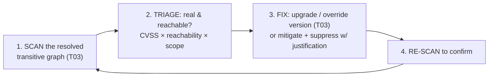
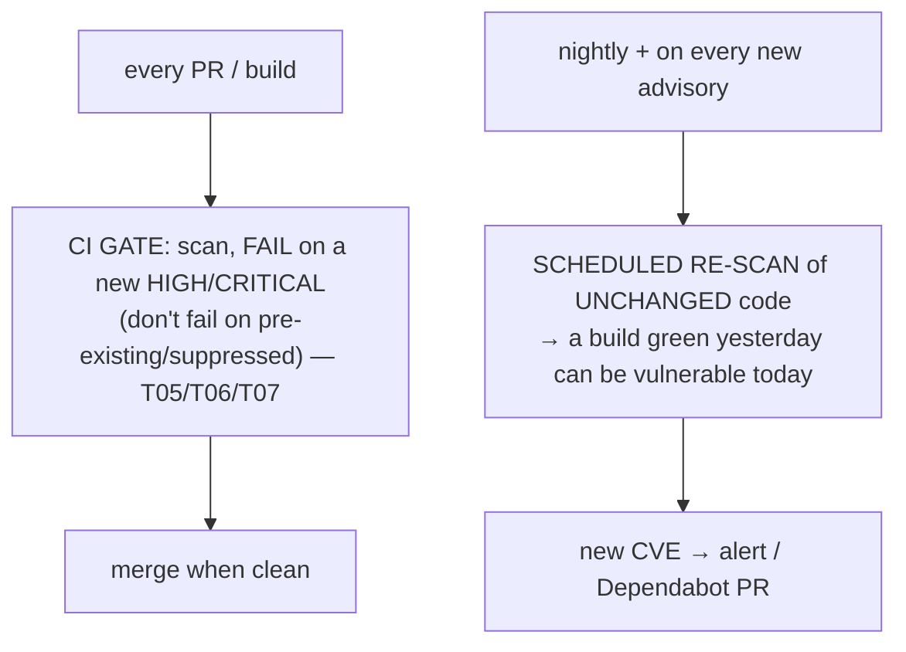
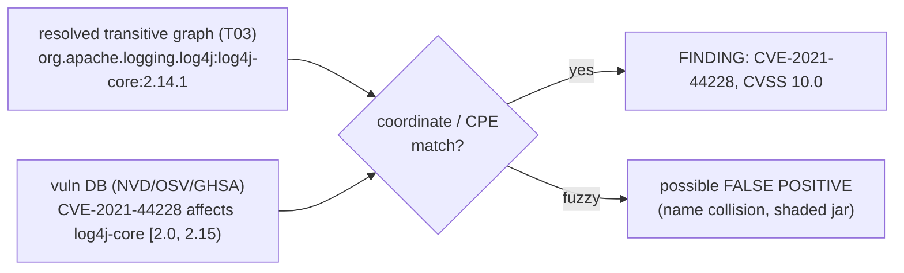

# Dependency vulnerability scanning

A modern application is mostly **other people's code**. Your `dependencies` block lists a few dozen libraries; dependency resolution pulls in *hundreds* of **transitive** ones you never chose ([T03](./T03-dependency-management-and-version-conflicts.md)). And here's the uncomfortable truth: a known security flaw — a **CVE** — in *any* of them, **direct or transitive**, is *your* vulnerability, exploitable in *your* running app. **Log4Shell** ([CVE-2021-44228](#)) is the canonical lesson: a CVSS-10 remote-code-execution flaw in `log4j2`, a library most teams had only **transitively** (via Spring Boot, Elasticsearch, dozens of others), that became a global emergency overnight. **Dependency vulnerability scanning** — **Software Composition Analysis (SCA)** — scans your dependency tree against vulnerability databases and flags the components with known flaws, so you find out from a build report, not from an incident.

This is the **counterpart to static analysis** ([T07](./T07-static-analysis-pmd-spotbugs-sonarqube.md)): T07 finds bugs in the code *you wrote*; SCA finds **known** flaws in the code *you depend on*. And it has a property nothing else in this chapter shares — a dependency that was clean yesterday can be vulnerable **today**, with **zero change to your code**, because a new CVE was published. The depth-bar: at the **language** layer, the vulnerability ecosystem (**CVE/NVD/CVSS/GHSA/OSV**), the **tools** (OWASP Dependency-Check, Snyk, Dependabot, Grype/Trivy), the **SBOM**, the **remediation flow**, and the **CI gate + scheduled re-scan**. At the **architecture** layer (lighter §4a, but anchored): how **coordinate/CPE matching** works and why it yields **false positives**, **reachability** analysis (a call-graph idea — [T07](./T07-static-analysis-pmd-spotbugs-sonarqube.md)), why the scan runs on the **resolved transitive graph** ([T03](./T03-dependency-management-and-version-conflicts.md)), the **database-changes-independently** property, and the broader **supply-chain** frontier.

> [!NOTE]
> Prerequisites: [Dependency management & version conflicts](./T03-dependency-management-and-version-conflicts.md) (L2/C02/T03) — **the transitive dependency graph where vulnerabilities hide, and version overrides to fix them**; [Static analysis](./T07-static-analysis-pmd-spotbugs-sonarqube.md) (L2/C02/T07) — **the contrast (your code vs your deps) and the reachability/suppression patterns**; [Git workflows](./T05-git-workflows-branching-prs-rebasing.md) (L2/C02/T05) — the **CI/PR gate** and **Dependabot** automated-bump PRs.

## The Problem — You Ship Your Dependencies' Bugs

A typical service has a few dozen *direct* dependencies and, once resolved, *hundreds* of transitive ones ([T03](./T03-dependency-management-and-version-conflicts.md)). At runtime, **you own the security of all of them** — the JVM doesn't care that you'd never heard of a five-levels-deep transitive jar; if it has an exploitable flaw and it's on your classpath, your app is exploitable.

**Log4Shell** made this visceral. CVE-2021-44228 (December 2021, CVSS **10.0**) was a remote-code-execution flaw in `log4j-core`'s JNDI message lookup. The overwhelming majority of affected teams had **never directly declared log4j** — it arrived transitively through frameworks. They couldn't patch what they didn't know they had. The lesson is twofold: **(1)** you must *inventory* everything you actually ship, and **(2)** you must *continuously* check that inventory against what the world now knows is dangerous.

## The Vulnerability Ecosystem

Scanning rests on a shared global vocabulary for "this thing is known to be broken":

| Term | What it is |
|------|------------|
| **CVE** (Common Vulnerabilities and Exposures) | the **public unique ID** of a specific vulnerability (e.g. `CVE-2021-44228`), assigned by a numbering authority |
| **NVD** (NIST National Vulnerability Database) | enriches each CVE with metadata — **CVSS** scores, affected-product (**CPE**) ranges |
| **CVSS** (Common Vulnerability Scoring System) | a **0–10 severity** score (Critical ≥ 9.0, High 7–8.9, …) from Base/Temporal/Environmental metrics — *severity, not your risk* |
| **GHSA** (GitHub Security Advisories) | GitHub's advisory DB, often faster and with better package-ecosystem mapping |
| **OSV** (Open Source Vulnerabilities) | Google's aggregator across ecosystems, designed for automated matching |
| vendor advisories | first-party notices (Spring, Apache, Oracle) — sometimes ahead of NVD |

The key nuance: a **CVSS score is severity, not the risk to *you*.** Risk ≈ severity × **reachability** × **exposure** × **scope** — a CVSS-10 in a test-only dependency you never ship is less urgent than a CVSS-6 on your public request path.

## The Tools (SCA)

| Tool | Notes |
|------|-------|
| **OWASP Dependency-Check** | free Maven/Gradle plugin; matches deps to CVEs via NVD (**CPE** matching) — noisier (false positives) |
| **OWASP Dependency-Track** | a platform that ingests **SBOMs** and continuously monitors |
| **Snyk** | commercial; curated DB, **reachability**, fix advice, automated fix PRs |
| **GitHub Dependabot** | free on GitHub: alerts + **automated dependency-bump PRs** ([T05](./T05-git-workflows-branching-prs-rebasing.md)) |
| **Grype / Trivy** | scan container images **and** dependencies — broader supply chain |
| **Sonatype OSS Index / Nexus IQ**, GitLab dep scanning | repository/CI-integrated alternatives |

> Don't confuse **vulnerability** scanning with **freshness** checks: Maven's `versions:display-dependency-updates` and Gradle's `dependencyUpdates` find *outdated* dependencies, not *vulnerable* ones. Related discipline, different question.

## SBOM — Software Bill of Materials

An **SBOM** is a machine-readable **inventory** of every component in your build — name, version, license, hashes. The two standard formats are **CycloneDX** (OWASP) and **SPDX** (Linux Foundation), generated as a build step (e.g. the CycloneDX plugin) and consumed by scanners/Dependency-Track. Why it matters: *you can't respond to what you can't enumerate.* With an SBOM per service, "are we affected by CVE-X?" is a database query answered in seconds across your whole estate — exactly the question every team scrambled to answer manually during Log4Shell. SBOMs are increasingly a **compliance requirement** (e.g. US Executive Order 14028 for software sold to the federal government).

## The Remediation Flow

1. **Scan** the **resolved** transitive graph ([T03](./T03-dependency-management-and-version-conflicts.md)) — the versions actually on the classpath.
2. **Triage** — is the finding real (not a [false positive](#memory--architecture-layer--how-matching-works)), is the vulnerable code path **reachable**, is it in a `runtime` scope or only `test`? Prioritise by **CVSS × reachability × exposure × scope**.
3. **Fix** — upgrade the dependency to a patched release. If it's **transitive**, you don't edit its POM — you **override the version** from your build: Maven `dependencyManagement`, Gradle `constraints`/`resolutionStrategy.force` ([T03](./T03-dependency-management-and-version-conflicts.md)) — pulling the patched version up. If no fix exists yet, mitigate (config/WAF) and **suppress with a justification and a review date** (the suppression-file pattern, [T07](./T07-static-analysis-pmd-spotbugs-sonarqube.md)).
4. **Re-scan** to confirm the finding is gone and nothing new arrived.

## The CI Gate + Scheduled Re-Scan

Two complementary triggers — and the second is what makes SCA unique:

- **CI gate** — run the scan on every PR and **fail the build on a *new* HIGH/CRITICAL** finding (policy by severity; don't fail on long-standing suppressed items). Same authoritative-CI-gate principle as formatting ([T06](./T06-code-formatters-and-linters-checkstyle-spotless.md)) and static analysis ([T07](./T07-static-analysis-pmd-spotbugs-sonarqube.md)).
- **Scheduled re-scan** — **the crucial difference from every other tool in this chapter.** A new CVE can be published against a dependency you **haven't touched**: your code is byte-identical, yesterday's build was green, and today you are vulnerable. So you must re-scan on a **schedule** (nightly) and react to the **advisory feed**, not only on code change. Dependabot/Snyk do this continuously and open a bump PR the moment an advisory lands.

## Memory & Architecture Layer — How Matching Works

### Coordinate / CPE Matching (and Its False Positives)

A scanner takes each **resolved artifact** — `groupId:artifactId:version` ([T03](./T03-dependency-management-and-version-conflicts.md)) — and matches it against database entries keyed by package coordinates or **CPE** (Common Platform Enumeration) strings. A hit means "this version is listed as affected by CVE-X."

This matching is inherently **fuzzy** — name collisions, **shaded/relocated** jars that hide the real coordinate, and repackaged libraries all cause **false positives** (OWASP Dependency-Check is well known for them). That's why a **suppression file** (confirmed false positives, with justification — the [T07](./T07-static-analysis-pmd-spotbugs-sonarqube.md) pattern) is part of the workflow, not an afterthought.

### Reachability Analysis

Advanced scanners (Snyk and others) go beyond "is the vulnerable version present?" to "does your code actually **call** the vulnerable code path?" — a **call-graph / data-flow** analysis, the same family of technique as [T07](./T07-static-analysis-pmd-spotbugs-sonarqube.md). Since most *present* vulnerabilities are never *reached*, reachability dramatically cuts the noise and sharpens triage.

### It Scans the *Resolved* Graph — and the DB Changes Independently

Two architectural facts define SCA:

- **It must run on the resolved graph.** Resolution ([T03](./T03-dependency-management-and-version-conflicts.md) nearest/highest-wins) decides which version is *actually* on the classpath — and that's the version that's vulnerable or not. A transitive bump can both *introduce* and *fix* a vuln, so you scan after resolution, not per-POM.
- **The artifact bytes are immutable, but the *knowledge* about them changes.** A scan result is a function of *(your dependency graph)* × *(the vulnerability DB at scan time)*. The graph can be frozen while the DB grows — which is the mechanical reason re-scanning unchanged code surfaces new findings. **Every other tool in this chapter changes its output only when *your code* changes; SCA changes when the *world's knowledge* changes.**

### The Supply-Chain Frontier

Known-CVE scanning is one slice of a bigger problem. Beyond published vulnerabilities lie **typosquatting** (a malicious package named like a real one), **compromised maintainer accounts / poisoned releases**, and **build-system attacks**. Defences include **provenance & signing** (Sigstore), the **SLSA** framework, **pinned/locked** dependencies and checksum verification ([T03](./T03-dependency-management-and-version-conflicts.md) lockfiles). SCA addresses *known* vulnerabilities; supply-chain security is the broader, active frontier.

> [!IMPORTANT]
> **Most vulnerabilities live in *transitive* dependencies** ([T03](./T03-dependency-management-and-version-conflicts.md)) — the libraries you never explicitly chose. Scanning only your *direct* dependencies misses the majority (Log4Shell would have been invisible). Always scan the **full resolved graph**.

> [!WARNING]
> **A CVSS score is severity, not your risk.** A CVSS-10 in a `test`-scope dependency, or in a code path you never call, can be lower priority than a CVSS-6 on your public request path. Triage by **reachability + exposure + scope**, not the raw number — while never ignoring a critical on a reachable, shipped path.

> [!TIP]
> **Re-scan on a schedule, not just on code change.** New CVEs are published daily against libraries you already ship; a build green yesterday can be vulnerable today with *zero* code change. Continuous monitoring (Dependabot/Snyk) plus a nightly CI scan covers the case that on-PR scanning alone cannot.

## Common Mistakes

### Scanning Only Direct Dependencies

Most vulnerabilities are **transitive** ([T03](./T03-dependency-management-and-version-conflicts.md)). Direct-only scanning gives false confidence — scan the whole resolved tree.

### No CI Gate

An advisory-only report nobody is forced to act on gets ignored ([T06](./T06-code-formatters-and-linters-checkstyle-spotless.md)/[T07](./T07-static-analysis-pmd-spotbugs-sonarqube.md) echo). **Fail the build** on a new HIGH/CRITICAL.

### No Scheduled Re-Scan

On-PR scanning alone never catches a CVE published against code you haven't changed. Without a nightly/continuous scan you learn about it **from the news**.

### Alert Fatigue / Ignoring Reachability

Treating every present-but-unreachable finding as urgent buries the real ones. Triage by **reachability + scope + exposure**.

### Blind Auto-Upgrade

Bumping straight to "latest" to clear a CVE can break the build or introduce a regression / version conflict ([T03](./T03-dependency-management-and-version-conflicts.md)). Upgrade to the **patched** version deliberately and run the tests.

### Suppressing Without Justification or Expiry

A permanently suppressed CVE is a hidden, forgotten risk. Require a **reason + review date** ([T07](./T07-static-analysis-pmd-spotbugs-sonarqube.md) pattern).

### Ignoring the SBOM

Without an inventory you can't answer "are we affected by CVE-X?" across services — and it's increasingly a **compliance** requirement.

### Treating SCA as All of Security

SCA covers **known** vulnerabilities in **dependencies** — not your own bugs ([T07](./T07-static-analysis-pmd-spotbugs-sonarqube.md)), not zero-days, not supply-chain compromise. It's one layer, not the whole.

> [!INTERVIEW]
> Dependency-scanning questions are increasingly standard — Log4Shell put SCA on every interviewer's list.
>
> 1. **What is dependency vulnerability scanning / SCA?** Scanning your (transitive) dependency tree against vulnerability databases to flag components with **known** flaws.
> 2. **CVE vs CVSS vs NVD?** CVE = the unique **ID** of a vulnerability; CVSS = its **0–10 severity** score; NVD = NIST's **database** enriching CVEs with CVSS + affected-product data.
> 3. **What was Log4Shell, and why did it hit everyone?** `CVE-2021-44228`, an RCE in `log4j2`; most victims had it **transitively** — you own your transitive deps' vulnerabilities.
> 4. **SCA vs static analysis ([T07](./T07-static-analysis-pmd-spotbugs-sonarqube.md))?** T07 finds bugs in **your** code; SCA finds known CVEs in your **dependencies** — and uniquely, re-scanning unchanged code can surface new findings.
> 5. **Why re-scan code that hasn't changed?** New CVEs are published against libraries you already ship — the **DB changes independently** of your code.
> 6. **Where do most vulnerabilities live?** In **transitive** dependencies ([T03](./T03-dependency-management-and-version-conflicts.md)) — scan the full resolved graph.
> 7. **How do you fix a vuln in a transitive dependency?** **Override the version** from your build (Maven `dependencyManagement` / Gradle constraints/force — [T03](./T03-dependency-management-and-version-conflicts.md)) to a patched release; or mitigate + suppress with justification if there's no fix.
> 8. **What is an SBOM?** A Bill of Materials — a component inventory (**CycloneDX**/**SPDX**) that lets you answer "are we affected" fast; increasingly required.
> 9. **What is Dependabot?** GitHub's tool that alerts on vulnerable deps and opens **automated bump PRs** ([T05](./T05-git-workflows-branching-prs-rebasing.md)).
> 10. **Why are there false positives?** **Coordinate/CPE matching** is fuzzy (name collisions, shaded jars) — confirm and suppress.
> 11. **What is reachability analysis?** Checking whether your code actually **calls** the vulnerable path (call-graph/data-flow, [T07](./T07-static-analysis-pmd-spotbugs-sonarqube.md)) — cuts noise from present-but-unused vulns.
> 12. **Is a CVSS-10 always top priority?** No — severity ≠ risk; weigh **reachability, scope, exposure**. But never ignore a critical on a reachable, shipped path.

## Practice

1. **Add a scanner.** Wire OWASP Dependency-Check (Gradle/Maven); run it; read the report.
2. **See a CVE.** Add a known-vulnerable dependency (e.g. an old `log4j-core` or `commons-collections`); re-scan; observe the CVE flagged with its CVSS.
3. **Find a transitive vuln.** Add a dependency that pulls a vulnerable transitive; use the dependency tree ([T03](./T03-dependency-management-and-version-conflicts.md)) to locate it; note you never declared it.
4. **Fix by override.** Override the transitive version ([T03](./T03-dependency-management-and-version-conflicts.md) `dependencyManagement`/constraints) to the patched release; re-scan to confirm it's gone.
5. **Suppress a false positive.** Confirm a false positive and suppress it with a **justification + review date** (suppression XML).
6. **CI gate.** Add a CI gate ([T05](./T05-git-workflows-branching-prs-rebasing.md)) that fails the build on a new CRITICAL; open a PR introducing one; watch it fail.
7. **Generate an SBOM.** Produce a CycloneDX SBOM as a build step; inspect its component list.
8. **Dependabot.** Enable Dependabot on a GitHub repo; observe an automated bump PR for a vulnerable dependency.
9. **Same code, new findings.** Scan a commit today, compare to a baseline scan of the *same* commit: observe identical code gaining new findings (the DB changed).
10. **Triage drill.** For three findings, classify by **CVSS × reachability × scope**; decide fix-now / fix-later / suppress.
11. **Reachability.** Identify a present-but-unreachable vuln (a vulnerable method you never call) and argue its lower priority.
12. **Vuln vs outdated.** Run `dependencyUpdates` / `versions:display-dependency-updates`; note it finds **stale**, not **vulnerable** — a different question.
13. **Explain it back.** Trace a transitive Log4Shell-style finding: (a) how the scanner **matched the coordinate** to the CVE, (b) why it's *your* problem though transitive, (c) how you'd **override the version** ([T03](./T03-dependency-management-and-version-conflicts.md)), (d) why you must also **re-scan unchanged code**, and (e) how **reachability** would change the priority.

## Recap

You should now be able to:

- Explain **SCA / dependency vulnerability scanning** — checking your **transitive** dependency graph ([T03](./T03-dependency-management-and-version-conflicts.md)) against vulnerability databases — and how it **contrasts with static analysis** ([T07](./T07-static-analysis-pmd-spotbugs-sonarqube.md)): your deps vs your code, and findings that change *without* a code change.
- Use the ecosystem vocabulary — **CVE** (the ID), **CVSS** (the 0–10 severity), **NVD/GHSA/OSV** (the databases) — and remember that **severity ≠ your risk**.
- Reach for the right **tools** (OWASP Dependency-Check, Snyk, **Dependabot**, Grype/Trivy), produce an **SBOM** (CycloneDX/SPDX) as an inventory, and run the **remediation flow** (scan → triage → fix/override/suppress → re-scan).
- Operate both triggers: a **CI gate** that fails on new HIGH/CRITICAL ([T05](./T05-git-workflows-branching-prs-rebasing.md)/[T06](./T06-code-formatters-and-linters-checkstyle-spotless.md)/[T07](./T07-static-analysis-pmd-spotbugs-sonarqube.md)) **and** a **scheduled re-scan** that catches new CVEs in unchanged code.
- Describe the **architecture**: **coordinate/CPE matching** (and its **false positives**), **reachability** analysis (a call-graph idea — [T07](./T07-static-analysis-pmd-spotbugs-sonarqube.md)), scanning the **resolved** graph ([T03](./T03-dependency-management-and-version-conflicts.md)), the **DB-changes-independently** property, and the broader **supply-chain** problem (typosquatting, signing, SLSA).
- Avoid the traps — direct-only scanning, no CI gate, no scheduled re-scan, alert fatigue, blind auto-upgrade, unjustified suppression, ignoring the SBOM, and mistaking SCA for all of security.

## Next

This is the last topic of the **Build Tools & Developer Workflow** chapter — which is now **complete (11/11)**. You've gone from the build tools themselves (Maven, Gradle, dependency management, multi-module) through the developer workflow (Git, formatters, static analysis), the annotation-processing trio (Lombok, MapStruct, the JSR-269 mechanism), and now securing the supply chain. Continue to the next chapter, [Networking & Web Fundamentals](../C03-networking-fundamentals/README.md).
