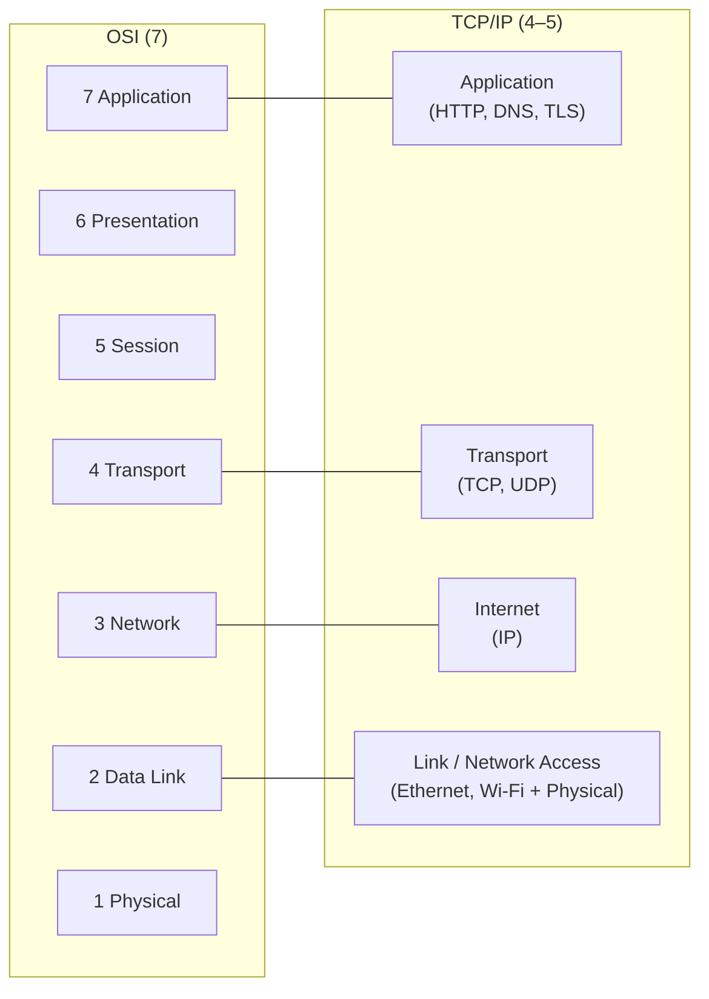
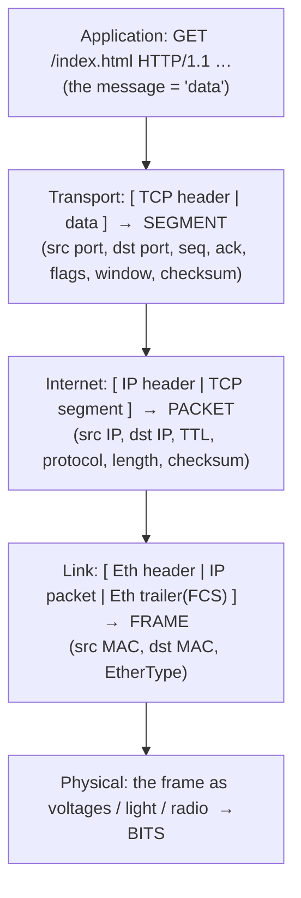
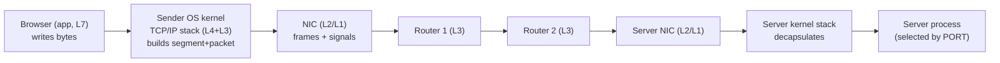

# OSI & TCP/IP models

When your Java program runs `socket.getOutputStream().write(bytes)`, those bytes may cross the planet — through copper, fibre, and radio, across a dozen routers, between machines that share almost nothing — and arrive intact at one specific *process* on the far side. That works because networking is built as a **stack of layers**, each solving exactly one problem (put bits on a wire; address a machine; deliver reliably to a process; speak a meaningful protocol) and each using the layer below without caring how it works. The **OSI model** (7 layers, the conceptual reference) and the **TCP/IP model** (4–5 layers, what the internet actually runs) are the two maps of that stack. They are the foundation for this entire chapter — TCP vs UDP ([T02](./T02-tcp-vs-udp.md)), sockets ([T03](./T03-ip-ports-and-sockets.md)), HTTP ([T05](./T05-http-https-lifecycle.md)), TLS ([T06](./T06-tls-ssl-and-certificates.md)).

The depth-bar here is *not* memorizing "Please Do Not Throw Sausage Pizza Away." It's three things. At the **conceptual** layer: the two models, what each layer does, and how they map. At the **wire** layer — the heart — **encapsulation**: how your bytes are physically wrapped, layer by layer, in nested headers until they're a **frame** on the wire (data → segment → packet → frame → bits), with real header sizes and the **MTU** that bounds them. At the **architecture** layer: the **physical journey** of a packet (your app → the OS kernel's TCP/IP stack → the NIC → router by router → the destination process), why the **MAC address changes at every hop while the IP address doesn't**, and exactly **where each layer lives** — and which ones the **JVM delegates to the operating system**.

> [!NOTE]
> Prerequisites: [Number systems — binary, hex & bit math](../../L0-foundations/C01-cs-foundations/T02-number-systems-binary-hex-and-basic-bit-math.md) (L0/C01/T02) — **IP addresses, MAC addresses, ports, and subnet masks are just numbers in binary/hex**; you'll read a hex MAC and a binary mask here. Otherwise this is a foundational topic with light prerequisites.

## Why Layers at All?

The problem networking solves is brutal when taken whole: get a *meaningful message* from one process to another, over *unreliable physical media*, across *many intermediate hops*, between machines that may differ in hardware, OS, and language. You cannot solve that in one piece. **Layering** splits it into independent concerns, stacked so each layer **uses the service of the layer below and provides a service to the layer above** — and, crucially, each can be **replaced without touching the others**. Swap Ethernet for Wi-Fi and HTTP doesn't notice; swap HTTP for SMTP and the wire doesn't notice.

The mechanism that makes this independence real is **encapsulation**: each layer treats the data handed down from above as an **opaque payload** and wraps it in its own **header** (metadata meant for its counterpart layer on the receiving machine). Lower layers never inspect the payload's meaning — they just carry it.

## The OSI Model (7 Layers)

The ISO **OSI** (Open Systems Interconnection) model, 1984, is the **conceptual reference** — the shared vocabulary everyone uses to talk about networking, even though the internet doesn't literally implement it. Top to bottom:

| # | Layer | Job | PDU | Addresses by | Examples |
|---|-------|-----|-----|--------------|----------|
| 7 | **Application** | the protocol the app speaks | data | — | HTTP, DNS, SMTP, FTP |
| 6 | **Presentation** | format, encoding, encryption, compression | data | — | TLS*, character sets, serialization |
| 5 | **Session** | open/manage/close a dialog | data | — | session setup, checkpointing |
| 4 | **Transport** | end-to-end delivery to a *process*; reliability | **segment** | **port** | TCP, UDP |
| 3 | **Network** | logical addressing + routing across networks | **packet** | **IP address** | IP, ICMP, routers |
| 2 | **Data Link** | node-to-node delivery on one physical network | **frame** | **MAC address** | Ethernet, Wi-Fi, switches |
| 1 | **Physical** | bits as signals on the medium | bits | — | cables, fibre, radio, NICs |

Mnemonics: top-down **A**ll **P**eople **S**eem **T**o **N**eed **D**ata **P**rocessing; bottom-up **P**lease **D**o **N**ot **T**hrow **S**ausage **P**izza **A**way. (*TLS is conventionally placed near layer 6 but is really an application-layer library over TCP — see the warning below.)

## The TCP/IP Model (What the Internet Runs)

The **TCP/IP model** (DARPA) is the practical one the internet is actually built on. It collapses OSI's seven into **four** (a common **five**-layer hybrid splits the bottom in two):

So OSI 5/6/7 fold into TCP/IP's **Application**; OSI 4 = **Transport**; OSI 3 = **Internet**; OSI 1/2 = **Link**. When people say "layer 4" they mean Transport (TCP/UDP); "layer 7" means Application (HTTP) — that OSI numbering is the lingua franca even when the stack is TCP/IP.

## Encapsulation — How Your Bytes Become a Frame

This is the mechanism everything rests on. As data travels **down** the sender's stack, each layer **prepends its header** (the data link layer also appends a trailer), wrapping the layer above as opaque payload. A single HTTP request becomes:

The result on the wire is a set of **nested envelopes** — `[ Ethernet [ IP [ TCP [ HTTP data ] ] ] FCS ]` — and the **PDU** (protocol data unit) has a precise, layer-specific name at each step: **data → segment → packet → frame → bits**. On the receiving machine the reverse happens — **decapsulation**: each layer reads and strips its own header, then hands the payload up. Each header is written by one layer and read **only** by its **peer** layer on the other side: receiver-TCP reads the TCP header, receiver-IP reads the IP header, and so on. Horizontal peer-to-peer conversations, carried by vertical wrapping.

### The Real Cost — Headers and MTU

These headers are concrete bytes: an **Ethernet** frame is 14 bytes of header + 4 bytes FCS trailer; a minimal **IPv4** header is 20 bytes; a minimal **TCP** header is 20 bytes. That's **~58 bytes of overhead before a single byte of your HTTP request**. And a frame can't be arbitrarily large — the **MTU** (Maximum Transmission Unit, ~1500 bytes on Ethernet) caps the payload, which is exactly why the transport layer **segments** a big stream and the network layer can **fragment** an oversized packet ([T02](./T02-tcp-vs-udp.md)). Overhead and the MTU are why a chatty protocol sending tiny messages wastes a large fraction of the wire on headers.

## The Physical Journey of a Packet

Follow one packet from a browser to a server, and the architecture snaps into focus:

The decisive insight: the **IP packet travels end-to-end** — the same source and destination **IP** addresses the whole way — but the **Ethernet frame is rebuilt at every hop**. A router (layer 3) receives a frame, **strips** the layer-2 Ethernet header, looks at the layer-3 **IP** destination, decides the next hop, **decrements the TTL** (time-to-live, which prevents packets looping forever), and **re-frames** the same IP packet in a *new* Ethernet header addressed to the next hop's MAC. So:

- **MAC address (L2)** = *local, per-hop* — meaningful only on one physical segment, **changes at every router**.
- **IP address (L3)** = *logical, end-to-end* — **constant** across the entire journey.

That is the concrete meaning of "L3 is end-to-end logical addressing" and "L2 is local physical delivery." Switches operate at L2 (forward frames by MAC within one network); routers at L3 (route packets by IP between networks).

### Where Each Layer Lives

| Layer | Implemented by |
|-------|----------------|
| Application (L7) | **your program** — the JVM, your Java code |
| Transport + Internet (L4/L3) | the **OS kernel's TCP/IP stack** — *not* the JVM |
| Data Link (L2) | the **NIC + its driver** |
| Physical (L1) | the **hardware / the wire** |

## How This Maps to Java

Your Java code lives at the **application layer**. The pivotal fact: **the JVM does not implement TCP or IP** — when you use `java.net.Socket`, `HttpClient` ([T05](./T05-http-https-lifecycle.md)), or `DatagramSocket` ([T02](./T02-tcp-vs-udp.md)), you hand bytes to the **operating system's kernel TCP/IP stack** through the **socket API** ([T03](./T03-ip-ports-and-sockets.md)), via a native call. The kernel builds the segments and packets; the NIC builds the frames. Roughly:

- `Socket` → **TCP** (reliable transport, L4); `DatagramSocket` → **UDP** (L4).
- `InetAddress` → the **IP** layer (L3 addresses, resolved by **DNS** — [T04](./T04-dns-resolution-records.md)).
- You essentially never touch L2/L1 from Java — the OS and hardware own them.

This makes the model a practical **diagnostic tool**, not trivia: each failure mode belongs to a layer. "Unknown host" = name resolution (DNS/app → L3). "No route to host" = network (L3). "Connection refused" = transport (L4 — nothing is listening on that port). A TLS handshake failure = presentation/app ([T06](./T06-tls-ssl-and-certificates.md)). An HTTP 404 = application (L7). Knowing the layer tells you which tool to reach for.

> [!IMPORTANT]
> **Encapsulation is the whole idea.** Each layer wraps the layer above as opaque payload and adds only its own header. That is *why* you can run HTTP over TCP over IP over **Ethernet or Wi-Fi** interchangeably — the upper layers neither know nor care what's below them. Layer independence, enforced by the encapsulation contract, is the internet's superpower: any layer can evolve or be swapped without rewriting the others.

> [!TIP]
> **Diagnose network problems by layer.** Map the symptom to a layer, then pick the tool that probes it: `dig`/`nslookup` (DNS name→IP, app), `ping` (reach the IP, **L3**), `traceroute`/`tracert` (the L3 hop path + TTL), `telnet host port` / `nc -vz host port` (is the port open/accepting, **L4**), `curl -v https://…` (the full L7 + TLS exchange). Isolating the failing layer turns flailing into a two-minute diagnosis.

> [!WARNING]
> **Don't over-literalize the 7-layer OSI model.** Layers 5 (Session) and 6 (Presentation) don't map cleanly onto the internet — their jobs are absorbed into the **Application** layer. **TLS** is the classic example: textbooks file it under "presentation (L6)," but in reality it's an application-layer library running over TCP ([T06](./T06-tls-ssl-and-certificates.md)). The internet runs the **4/5-layer TCP/IP model**; OSI is the shared *vocabulary*, not the implementation.

## Common Mistakes

### Memorizing the 7 Layers Without Encapsulation

The layer names are useless on their own. The thing that matters is the **wrapping mechanism** — each layer adding a header around the one above. Learn encapsulation and the layers explain themselves.

### Thinking the JVM Implements TCP/IP

It doesn't. `java.net.Socket` is a thin wrapper over the **OS kernel's** network stack; the JVM delegates transport and network layers to the OS. The socket API is the boundary between your app and the kernel.

### Confusing L2 (MAC) with L3 (IP) Addressing

MAC is **local and per-hop** (rewritten at every router); IP is **logical and end-to-end** (constant). Mixing them up makes routing impossible to reason about.

### Assuming OSI Is Reality

The internet runs **TCP/IP**. OSI 5/6 fold into the application layer; treating all seven as literally implemented layers leads you astray (especially with TLS).

### Conflating Segment / Packet / Frame

These are **layer-specific** PDU names: a TCP **segment** (has ports), an IP **packet** (has IP addresses), an Ethernet **frame** (has MACs). They're the same data in different envelopes — be precise.

### Forgetting Overhead and the MTU

Every layer adds header bytes (~58 before app data), and the ~1500-byte MTU caps the frame — which is why streams get segmented and packets fragmented ([T02](./T02-tcp-vs-udp.md)). Ignoring this hides real performance costs.

### Not Diagnosing by Layer

Flailing at a network bug instead of isolating the layer (DNS? L3 reachability? L4 port? TLS? L7 status?) wastes hours. Bisect by layer.

> [!INTERVIEW]
> Networking interviews almost always open here — and the strong answers are about **encapsulation** and the **per-hop vs end-to-end** distinction, not reciting layer names.
>
> 1. **Name the OSI layers, top to bottom.** Application, Presentation, Session, Transport, Network, Data Link, Physical (7→1).
> 2. **OSI vs the TCP/IP model?** OSI = 7-layer conceptual reference; TCP/IP = 4 (or 5) layers, what the internet runs. OSI 5/6/7 → TCP/IP Application; OSI 1/2 → Link.
> 3. **What is encapsulation?** Each layer wraps the data from above as payload and adds its own header: data → segment → packet → frame → bits going down; decapsulation reverses it going up.
> 4. **Segment vs packet vs frame?** Transport PDU (TCP **segment**, has ports), Network PDU (IP **packet**, has IP addresses), Data Link PDU (Ethernet **frame**, has MACs) — same data, different envelope.
> 5. **MAC vs IP addressing?** MAC = local, **per-hop**, rewritten at every router; IP = logical, **end-to-end**, constant across the journey.
> 6. **Which layer is TCP/UDP? IP? HTTP?** Transport (L4); Network (L3); Application (L7).
> 7. **Does the JVM implement TCP?** No — it delegates to the **OS kernel's** TCP/IP stack via the socket API; `java.net.Socket` is a wrapper.
> 8. **What's the MTU and why care?** Max frame payload (~1500 B Ethernet); larger data is segmented (TCP) / fragmented (IP), and ~58 B of headers eat into it.
> 9. **Router vs switch?** Router = **L3** (routes by IP across networks, decrements TTL, rebuilds the L2 frame each hop); switch = **L2** (forwards frames by MAC within one network).
> 10. **Where does TLS sit?** Conceptually ~presentation (L6); practically an **app-layer** library over TCP ([T06](./T06-tls-ssl-and-certificates.md)).
> 11. **How do you diagnose by layer?** `dig` (DNS), `ping`/`traceroute` (L3), `telnet`/`nc` to a port (L4), `curl -v` (L7/TLS) — isolate the failing layer.
> 12. **Why layer at all?** Independent, replaceable concerns — swap Wi-Fi for Ethernet (L1/2) without changing HTTP (L7); encapsulation decouples them.

## Practice

1. **Draw both models.** From memory, draw OSI's 7 layers and the TCP/IP 4/5 layers, with the mapping between them.
2. **PDU trace.** For an HTTP GET, list the PDU at each layer (HTTP data → TCP segment → IP packet → Ethernet frame → bits) and the header each layer adds.
3. **See encapsulation live.** Capture traffic with Wireshark/`tcpdump`; expand one packet and observe the **nested** Ethernet → IP → TCP → HTTP headers.
4. **Spot the addresses.** In a captured frame, find the src/dst **MAC**, **IP**, and **port**; mark which a router rewrites (MAC) and which it keeps (IP, port).
5. **Trace the hops.** `traceroute`/`tracert` a host; count the L3 hops; relate the count to TTL.
6. **Tool-to-layer.** Run `ping` (L3), `telnet host 80` / `nc -vz host 80` (L4), `dig`/`nslookup` (DNS), `curl -v https://…` (L7+TLS); map each to its layer.
7. **Overhead math.** Add Ethernet(18) + IPv4(20) + TCP(20); for a 100-byte HTTP request, what fraction of the frame (and of a 1500-byte MTU) is overhead?
8. **Diagnose by layer.** For "connection refused," "unknown host," "no route to host," "TLS handshake failed," and "HTTP 404," name the responsible layer.
9. **Find your layer in Java.** Write a `Socket` client; identify which layer your code is at (L7) and which the JVM delegates to the OS (L3/L4).
10. **Layer independence.** Explain why the same HTTP request runs unchanged over Wi-Fi or Ethernet (encapsulation / layer independence).
11. **Hop-by-hop.** Trace a packet browser→server; at each router state what **changes** (MAC, TTL) and what **doesn't** (IP, port, payload).
12. **Place the oddballs.** Locate TLS, DNS, and a VPN in the model and justify each placement.
13. **Explain it back.** For `socket.write("GET / HTTP/1.1")`, trace the bytes **down** the sender stack (each header added), across **one router hop** (what's rewritten vs kept), and **up** the receiver stack (each header stripped) to the server process selected by **port**.

## Recap

You should now be able to:

- Explain **why** networks are layered — independent, replaceable concerns, glued by the **encapsulation** contract (each layer wraps the one above as opaque payload).
- Name and describe the **OSI 7 layers** and the **TCP/IP 4/5-layer** model, and map between them (OSI 5/6/7 → Application; OSI 1/2 → Link).
- Trace **encapsulation/decapsulation** precisely — data → **segment** (TCP, ports) → **packet** (IP, addresses) → **frame** (Ethernet, MACs) → bits — and account for **header overhead** (~58 B) and the **MTU** (~1500 B) that drive segmentation/fragmentation.
- Describe a packet's **physical journey** and the key distinction: the **IP packet is end-to-end** (constant IP) while the **Ethernet frame is rebuilt at every hop** (MAC changes, TTL decrements); routers = L3, switches = L2.
- State **where each layer lives** — app in the **JVM**, transport/internet in the **OS kernel stack**, link in the **NIC**, physical on the **wire** — and that **Java delegates TCP/IP to the OS** via the socket API (`Socket`/`DatagramSocket`/`InetAddress`).
- **Diagnose by layer**, mapping a symptom (DNS / L3 reachability / L4 port / TLS / L7 status) to the right tool — and avoid the traps (name-memorizing without encapsulation, JVM-implements-TCP, MAC-vs-IP confusion, PDU conflation, ignoring MTU).

## Next

Continue to [TCP vs UDP](./T02-tcp-vs-udp.md).
