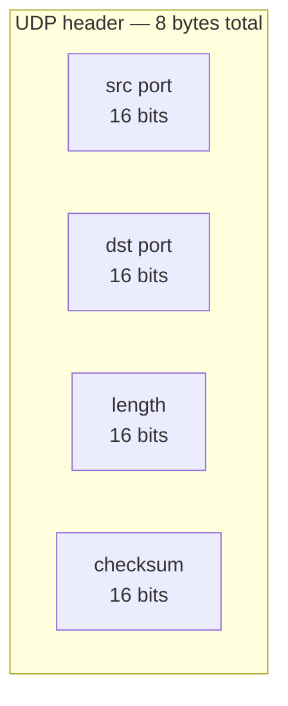
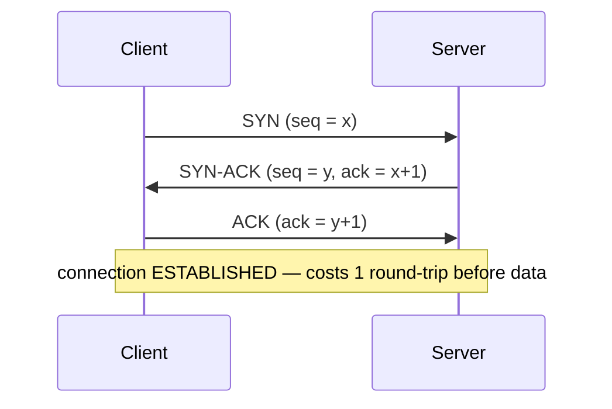
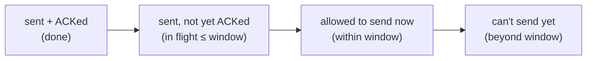

# TCP vs UDP

**TCP** and **UDP** are the two transport-layer (**L4** — [T01](./T01-osi-and-tcp-ip-models.md)) protocols that nearly all internet traffic runs on. Both ride on **IP** — a TCP **segment** or a UDP **datagram** nested inside an IP packet ([T01](./T01-osi-and-tcp-ip-models.md) encapsulation) — but they strike **opposite bargains**. **TCP** hands your application a **reliable, ordered, flow-controlled byte stream**: whatever you send arrives, intact and in order, even over a lossy, reordering network — at the cost of a connection handshake, acknowledgements, retransmissions, and buffering. **UDP** hands you bare, **fire-and-forget datagrams**: minimal, fast, stateless — but with *no* delivery guarantee, *no* ordering, and *no* congestion control. Choosing between them is one of the most consequential decisions in network programming, and "it depends on whether you can tolerate loss" is the heart of it.

The depth-bar: at the **language** layer, the precise contrast and **when to use each**. At the **wire** layer — the heart for a transport topic — the **header byte-layouts** (TCP 20–60 bytes vs UDP's 8), the **3-way handshake**, and TCP's **reliability / ordering / flow / congestion** machinery as state machines. At the **architecture** layer: the fact that the **OS kernel owns the TCP state machine** (a control block per connection) plus the **send/receive buffers** and retransmit timers — the JVM merely delegates ([T01](./T01-osi-and-tcp-ip-models.md)) — which drives connection-scaling (C10k), **head-of-line blocking**, why **UDP is lower latency**, and the `Socket` vs `DatagramSocket` mapping in Java.

> [!NOTE]
> Prerequisites: [OSI & TCP/IP models](./T01-osi-and-tcp-ip-models.md) (L2/C03/T01) — **L4 transport, encapsulation (segment/datagram inside an IP packet), header overhead, and the OS-kernel stack the JVM delegates to**; [Number systems — binary, hex & bit math](../../L0-foundations/C01-cs-foundations/T02-number-systems-binary-hex-and-basic-bit-math.md) (L0/C01/T02) — sequence numbers, header fields, and flag bits are just numbers.

## The Core Contrast

| | **TCP** | **UDP** |
|---|---------|---------|
| **Connection** | connection-oriented (handshake first) | connectionless (just send) |
| **Reliability** | guaranteed (ACK + retransmit) | best-effort (may drop) |
| **Ordering** | in-order (sequence numbers) | unordered (any order, may dup) |
| **Data model** | **byte stream** (no message boundaries) | **datagram** (preserves boundaries) |
| **Flow control** | yes (sliding window) | no |
| **Congestion control** | yes (slow start / AIMD) | no |
| **Header** | 20–60 bytes | **8 bytes** |
| **Latency/overhead** | higher (handshake, ACKs, ordering) | minimal |
| **Best for** | correctness-critical, must-arrive | latency-critical, loss-tolerant, 1-to-many |

The one-line mental model: **TCP is a reliable phone call** (you connect, everything you say arrives in order, you hang up); **UDP is postcards** (you drop them in the mailbox — most arrive, some don't, some out of order, and you'll never know which).

## UDP — the Minimal Datagram

UDP is the simpler protocol, so start there. You hand the kernel a **datagram**; it wraps it in an 8-byte header and an IP packet and sends it. It **may** arrive, may not, may arrive out of order, may be duplicated — there is **no connection, no state, no acknowledgement**. The entire header:



Two properties define it. **It preserves message boundaries** — one `send` is exactly one datagram is exactly one `receive` (unlike TCP). And **the application owns everything else** — if you need reliability or ordering, you build it yourself, or you don't need it. Why anyone chooses this: **no handshake** (save a round-trip), **no head-of-line blocking**, **no retransmit waits** → the **lowest possible latency**; support for **one-to-many** (broadcast/multicast); and tiny overhead. It's the base for **DNS** ([T04](./T04-dns-resolution-records.md)), DHCP, NTP, VoIP/video, gaming, and **QUIC/HTTP-3** ([T05](./T05-http-https-lifecycle.md)).

## TCP — the Reliable Stream

TCP is **connection-oriented**: both endpoints establish, maintain, and tear down a connection, each keeping state. Its guarantees are built from several cooperating mechanisms.

### The 3-Way Handshake

Before any data flows, the two sides synchronize sequence numbers:



After the handshake both sides agree on starting sequence numbers and the connection is `ESTABLISHED`. The cost: **one full round-trip (1 RTT) of latency before a single byte of data** — which is why connection reuse matters so much (see the tip).

### Reliability and Ordering

Every byte in the stream has a **sequence number**. The receiver **acknowledges** (ACKs) the bytes it has received; any data left unACKed is **retransmitted** after a timeout (RTO) or on duplicate ACKs (fast retransmit); the receiver **reorders** arriving segments by sequence number before delivering. The net effect: the application reads a **perfect, in-order byte stream** even though the underlying network lost, duplicated, and reordered packets.

### It's a Stream, Not Messages

This is the single most important practical fact about TCP: **it does not preserve your `write` boundaries.** Two `write`s may arrive as one `read`; one `write` may be split across two `read`s. TCP delivers an undifferentiated stream of bytes. **Your application must frame messages itself** — a length prefix or a delimiter — which is exactly why HTTP carries `Content-Length`/chunked encoding ([T05](./T05-http-https-lifecycle.md)).

### Flow Control — the Sliding Window

The receiver advertises a **window**: how much buffer space it has free. The sender may have at most that many unacknowledged bytes in flight, then must wait for ACKs that "slide" the window forward. This stops a fast sender from **overrunning a slow receiver**.



### Congestion Control

Distinct from flow control: don't overrun **the network** (not just the receiver). TCP keeps a **congestion window** (`cwnd`) that starts small and grows — **slow start** (exponential growth) then **congestion avoidance** (**AIMD**: additive increase, and *multiplicative decrease* — halve the window — when loss signals congestion). This collective back-off is what keeps the internet from collapsing under load.

### Teardown and Head-of-Line Blocking

Closing is a **4-way** exchange (FIN/ACK each direction), after which the initiator sits in **`TIME_WAIT`** for ~2×MSL so stray packets die before the port is reused — which under high connection churn can cause **port exhaustion**. And because TCP is an **ordered** stream, a single lost segment **stalls everything behind it** until it's retransmitted — **head-of-line (HOL) blocking** — even data that already arrived must wait. This is why HTTP/2 multiplexed over one TCP connection still suffers HOL blocking, and why HTTP/3 moved to **QUIC over UDP** ([T05](./T05-http-https-lifecycle.md)).

### The TCP Header

| Field | Size | Purpose |
|-------|------|---------|
| src port / dst port | 16 b each | the endpoints (with IP → the socket, [T03](./T03-ip-ports-and-sockets.md)) |
| **sequence number** | 32 b | byte offset in the stream (ordering + reliability) |
| **acknowledgement number** | 32 b | next byte expected (cumulative ACK) |
| data offset + **flags** | — | SYN, ACK, FIN, RST, PSH, URG |
| **window size** | 16 b | flow control (advertised receive buffer) |
| checksum, urgent pointer | 16 b each | integrity, urgent data |
| options | 0–40 b | MSS, window scale, SACK, timestamps |

That's **20 bytes minimum, up to 60** — versus UDP's **8** ([T01](./T01-osi-and-tcp-ip-models.md) header-overhead callback). The extra bytes (and the per-connection state) are the literal cost of TCP's guarantees.

## When to Use Which

- **TCP** — anything where correctness and order are non-negotiable: HTTP/1.1 & HTTP/2 ([T05](./T05-http-https-lifecycle.md)), databases, file transfer, email (SMTP), SSH, the vast majority of APIs.
- **UDP** — latency-critical, loss-tolerant, or one-to-many: **DNS** ([T04](./T04-dns-resolution-records.md) — a tiny request/response, retried by the app), VoIP/video (a dropped frame beats a late one), online gaming, DHCP, NTP, multicast/broadcast.
- **QUIC / HTTP-3** — the modern twist: reliability, ordering, and TLS **re-implemented in userspace over UDP**, per-stream, to get TCP-like guarantees **without** TCP's cross-stream HOL blocking and with a faster handshake ([T05](./T05-http-https-lifecycle.md)). "UDP speed with reliability you add back where you want it."

## Memory & Architecture Layer — the Kernel Owns It

The whole TCP **state machine** (`LISTEN` → `SYN_SENT`/`SYN_RCVD` → `ESTABLISHED` → `FIN_WAIT`/`TIME_WAIT` → `CLOSED`) lives in the **OS kernel**, per connection, as a **Transmission Control Block (TCB)** — the JVM implements none of it and simply delegates through the socket API ([T01](./T01-osi-and-tcp-ip-models.md)). Two consequences matter:

- **A connection is kernel state.** Each TCP connection costs a TCB **plus** a send buffer **plus** a receive buffer of kernel memory, **plus** a file descriptor. N connections = N×(TCB + 2 buffers + fd). This is the root of the **C10k / C10M** scaling problem — why a server holding a million mostly-idle connections needs careful tuning, and why thread-per-connection doesn't scale (you reach for NIO/async — forward to L3/L4).
- **`write()` ≠ delivered.** `write()` copies your bytes into the **kernel send buffer** and returns; the kernel transmits and retransmits asynchronously. Return means "buffered," not "arrived" — and it can still ultimately fail. Likewise `read()` copies from the kernel **receive buffer**. Buffer sizes (`SO_SNDBUF`/`SO_RCVBUF`) and the bandwidth-delay product govern throughput; oversized buffers cause **bufferbloat** (latency).

Two more architectural notes: **Nagle's algorithm** coalesces small writes into fewer packets (good for bulk, bad for latency); its interaction with **delayed ACK** causes latency spikes, so latency-sensitive apps set **`TCP_NODELAY`** to disable it. And **UDP is lower latency** precisely because it skips all of this — no handshake RTT, no retransmit waits, no HOL blocking, no Nagle, minimal per-packet state. (One UDP caveat: a datagram larger than the **MTU** is IP-**fragmented** ([T01](./T01-osi-and-tcp-ip-models.md)), and since there's no per-fragment retransmit, losing *one* fragment loses the *whole* datagram — keep UDP payloads small, ≲ 1400 bytes.)

### Java Mapping

```java
// TCP — a byte STREAM. You MUST frame messages yourself.
try (Socket sock = new Socket("example.com", 80)) {
    OutputStream out = sock.getOutputStream();   // stream, not messages
    InputStream  in  = sock.getInputStream();
}                                                // ServerSocket on the listen side

// UDP — discrete DATAGRAMS, boundaries preserved.
try (DatagramSocket ds = new DatagramSocket()) {
    byte[] buf = "ping".getBytes();
    ds.send(new DatagramPacket(buf, buf.length, addr, 9999));  // one send = one datagram
}
```

`Socket`/`ServerSocket` → **TCP**; `DatagramSocket`/`DatagramPacket` → **UDP**. The JVM classes are thin wrappers over the kernel sockets ([T01](./T01-osi-and-tcp-ip-models.md)), blocking by default; `SocketChannel`/NIO provide non-blocking I/O (forward to L3/L4). Note the API mirrors the model: TCP gives you `InputStream`/`OutputStream` (a **stream**), UDP gives you packets (**messages**).

> [!IMPORTANT]
> **TCP is a byte stream, not a message protocol.** Your `write` boundaries are **not** preserved — the receiver may read them merged or split. You **must frame messages yourself** (a length prefix or a delimiter). Assuming "one `write` = one `read`" is the #1 TCP beginner bug — and the reason HTTP needs `Content-Length`/chunked encoding ([T05](./T05-http-https-lifecycle.md)).

> [!WARNING]
> **UDP is not "broken TCP" — it's unreliable by *design*.** If you need reliability over UDP, you re-implement it in the application (ACKs, retransmit, ordering) — which is exactly what **QUIC** does. Choose UDP because loss is acceptable *or* because you will handle it, never by accident and then act surprised when packets vanish.

> [!TIP]
> The 3-way handshake costs **one round-trip before any data** — significant over high-latency links. This is why **connection reuse** matters (HTTP keep-alive, connection pools — [T05](./T05-http-https-lifecycle.md)/L4), and why **QUIC** and **TLS 1.3** work hard to cut handshake round-trips (even 0-RTT).

## Common Mistakes

### Expecting TCP to Preserve Message Boundaries

It's a **stream** — `write` boundaries vanish. Frame your messages (length prefix/delimiter). The most common TCP bug.

### Treating UDP's Unreliability as a Bug

It's **by design**. Add app-level reliability if you need it (or pick TCP) — don't assume datagrams always arrive.

### Ignoring `TIME_WAIT` Under High Churn

Many short-lived connections pile up sockets in `TIME_WAIT` and can exhaust ports. **Reuse** connections (keep-alive/pools) instead of churning new ones.

### Oversized UDP Datagrams

A datagram > MTU is fragmented ([T01](./T01-osi-and-tcp-ip-models.md)); losing one fragment loses the whole datagram. Keep UDP payloads small.

### Forgetting Nagle / `TCP_NODELAY`

For latency-sensitive small-message apps, Nagle's algorithm (and its delayed-ACK interaction) adds latency — set `TCP_NODELAY`. For bulk transfer, leave Nagle on.

### Thread-per-Connection at Scale

Each TCP connection is kernel state **and** (in that model) a thread — it doesn't scale to tens of thousands. Use NIO/async for high connection counts (C10k).

### Assuming `write()` Means Delivered

It only means "copied into the kernel send buffer." Transmission and retransmission are asynchronous and can still fail.

### Wrong Protocol for the Need

TCP where UDP's latency wins (real-time media/gaming), or UDP where you actually need reliability (and then bolt on a worse TCP). Match protocol to requirement.

> [!INTERVIEW]
> TCP/UDP is a networking-interview staple — strong answers explain the *mechanisms* (handshake, sequence/ACK, windows) and the *stream-vs-datagram* distinction, not just "TCP reliable, UDP fast."
>
> 1. **TCP vs UDP?** TCP = connection-oriented, reliable, ordered, flow-/congestion-controlled **byte stream**; UDP = connectionless, unreliable, unordered, minimal **datagrams**. TCP for correctness, UDP for latency/loss-tolerance.
> 2. **Explain the 3-way handshake.** SYN → SYN-ACK → ACK; synchronizes sequence numbers and establishes the connection; costs **1 RTT**.
> 3. **How does TCP guarantee reliability + ordering?** Sequence numbers + ACKs + retransmission on loss/timeout; the receiver reorders by sequence number.
> 4. **Flow vs congestion control?** Flow = don't overrun the **receiver** (sliding window from its advertised buffer); congestion = don't overrun the **network** (slow start / AIMD on the sender).
> 5. **Stream or message oriented?** TCP = **stream** (no boundaries — you must frame); UDP = **datagram** (1 send = 1 receive).
> 6. **What's in the TCP vs UDP header?** TCP 20–60 B (ports, **seq**, **ack**, flags, **window**, checksum, options); UDP **8 B** (ports, length, checksum).
> 7. **When choose UDP?** DNS, VoIP/video, gaming, DHCP, multicast — latency-critical, loss-tolerant, or one-to-many; and as QUIC's base.
> 8. **Head-of-line blocking?** An ordered stream stalls all data behind a lost segment until retransmit; why HTTP/2-over-TCP suffers it and HTTP/3 uses QUIC/UDP.
> 9. **What is QUIC / why HTTP-3 over UDP?** Reliability + ordering + TLS re-implemented per-stream in userspace over UDP — no cross-stream HOL blocking, faster handshake.
> 10. **Where does TCP state live?** In the OS kernel (a TCB per connection) + send/receive buffers — the JVM delegates; per-connection cost drives C10k scaling.
> 11. **What is `TIME_WAIT`?** The closer waits ~2×MSL before reusing the port (lets stray packets die); high churn → port exhaustion.
> 12. **Does `write()` mean delivered?** No — it copies into the kernel send buffer; transmission/retransmission is async and can still fail.

## Practice

1. **TCP echo.** Build an echo client/server with `Socket`/`ServerSocket`; exchange messages.
2. **UDP echo.** Build one with `DatagramSocket`/`DatagramPacket`; note the connectionless send/receive.
3. **See the handshake.** Capture a TCP connection in Wireshark/`tcpdump`; identify SYN / SYN-ACK / ACK and the FIN teardown.
4. **Stream vs message.** Send two TCP `write`s and show they can arrive merged in one `read`; fix it with length-prefix framing.
5. **Boundaries preserved.** Send two UDP datagrams; confirm two separate receives.
6. **Loss.** Simulate packet loss; observe TCP retransmit and recover while UDP simply loses data.
7. **Read the headers.** In a capture, find TCP `seq`/`ack`/`window`/flags, and a UDP header's length/checksum.
8. **Handshake cost.** Time a fresh connection vs a reused (keep-alive) one; quantify the RTT saved.
9. **Nagle.** Toggle `TCP_NODELAY`; measure small-message latency with and without Nagle.
10. **Big UDP.** Send a UDP datagram larger than the MTU; observe fragmentation (and total loss if a fragment drops).
11. **`TIME_WAIT`.** Open many short-lived TCP connections; watch `TIME_WAIT` accumulate (`netstat`/`ss`) and reason about the cost.
12. **Choose the protocol.** For a chat app, live video, a stock-price feed, a file upload, and DNS — pick TCP or UDP and justify.
13. **QUIC.** Explain how QUIC delivers "UDP speed + TCP reliability" and why HTTP/3 adopted it.
14. **Explain it back.** For a 10 KB HTTP response over TCP, trace (a) the handshake, (b) how the 10 KB stream is segmented, sequenced, ACKed, and reordered, (c) why you can't assume one `read` returns all 10 KB, (d) where the kernel buffers sit, and (e) how UDP would differ.

## Recap

You should now be able to:

- State the **TCP vs UDP** contrast precisely — connection/reliability/ordering/flow/congestion/header/latency — and pick the right one (TCP for correctness, UDP for latency/loss-tolerance/one-to-many, QUIC for both).
- Explain TCP's mechanisms: the **3-way handshake** (1 RTT), **sequence numbers + ACKs + retransmission** (reliability/ordering), the **sliding window** (flow control), and **slow start / AIMD** (congestion control), plus the **4-way close** and **`TIME_WAIT`**.
- Recognise that **TCP is a byte stream, not messages** — you must **frame** yourself (length prefix/delimiter, as HTTP does — [T05](./T05-http-https-lifecycle.md)) — while **UDP preserves message boundaries**.
- Read the **header layouts** (TCP 20–60 B with seq/ack/window/flags vs UDP 8 B) and connect the overhead to the guarantees ([T01](./T01-osi-and-tcp-ip-models.md)).
- Describe the **architecture**: the TCP state machine + buffers live in the **OS kernel** (TCB per connection — the JVM delegates), driving **C10k** scaling, **head-of-line blocking**, `write()`≠delivered, Nagle/`TCP_NODELAY`, and why **UDP is lower latency**; and the Java mapping (`Socket`/`ServerSocket` vs `DatagramSocket`/`DatagramPacket`).
- Avoid the traps — message-boundary assumptions, treating UDP unreliability as a bug, `TIME_WAIT` churn, oversized UDP, Nagle latency, thread-per-connection at scale, and `write()`-means-delivered.

## Next

Continue to [IP, ports & sockets](./T03-ip-ports-and-sockets.md).
