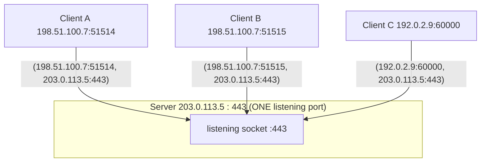
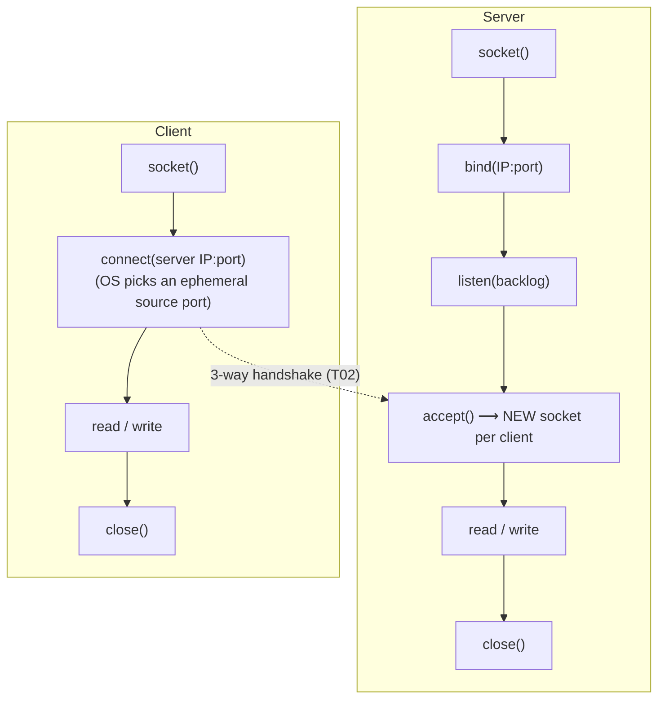
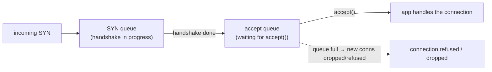

# IP, ports & sockets

[T01](./T01-osi-and-tcp-ip-models.md) gave you the layers; [T02](./T02-tcp-vs-udp.md) gave you the transport protocols. This topic is the **addressing** that makes them usable: how a packet finds the right **machine** (an **IP address**, L3), the right **process** on that machine (a **port**, L4), and how your Java code grabs an endpoint to actually read and write (a **socket**). The trio is tight and worth stating up front: an **IP address** identifies a *host*; a **port** identifies a *service/process* on that host; a **socket** is the programming endpoint = **(protocol, IP, port)**; and a live **connection** is the **4-tuple** *(source IP, source port, destination IP, destination port)* — the thing that lets a single server port serve thousands of clients at once. Get the 4-tuple and the socket-as-file-descriptor ideas, and the rest of network programming clicks into place.

The depth-bar: at the **language** layer, IP addressing (IPv4/IPv6, **CIDR**/subnets, private ranges), **ports** (well-known vs ephemeral), the **socket + 4-tuple** model, and the **socket API** lifecycle. At the **architecture** layer: a **socket is a file descriptor** indexing a kernel structure ([T02](./T02-tcp-vs-udp.md)'s TCB) — so fd limits bound your connections; the **listen backlog** queues; **ephemeral-port exhaustion** (why connection pooling exists); and an **IPv4 address is just a 32-bit integer** sent in **network byte order (big-endian)** ([L0/C01/T02](../../L0-foundations/C01-cs-foundations/T02-number-systems-binary-hex-and-basic-bit-math.md)). The payoff is concrete Java: `InetAddress`, `ServerSocket`/`Socket`, `DatagramSocket`, and the **accept-returns-a-new-socket** model.

> [!NOTE]
> Prerequisites: [OSI & TCP/IP models](./T01-osi-and-tcp-ip-models.md) (L2/C03/T01) — **L3 IP / L4 ports, and the socket API as the app↔kernel boundary**; [TCP vs UDP](./T02-tcp-vs-udp.md) (L2/C03/T02) — **the TCB per connection, `Socket`/`DatagramSocket`, and the 4-tuple idea**; [Number systems — binary, hex & bit math](../../L0-foundations/C01-cs-foundations/T02-number-systems-binary-hex-and-basic-bit-math.md) (L0/C01/T02) — **subnet masks, IPv4 as a 32-bit integer, byte order**.

## IP Addresses

An **IP address** identifies a host at the network layer (L3, [T01](./T01-osi-and-tcp-ip-models.md)).

- **IPv4** — a **32-bit** number written as a dotted quad, `192.168.1.10`; each octet is 8 bits (0–255, [L0/C01/T02](../../L0-foundations/C01-cs-foundations/T02-number-systems-binary-hex-and-basic-bit-math.md)). That's ~**4.3 billion** addresses — long since **exhausted**, which is why NAT and IPv6 exist.
- **IPv6** — a **128-bit** address in hex groups, `2001:db8::1` (`::` compresses a run of zero groups). Astronomically large; the long-term fix.
- **Subnets / CIDR** — an address splits into a **network** part and a **host** part. The **mask** says where: `192.168.1.0/24` means the first **24 bits are network**, leaving 8 bits (256 addresses) for hosts. Masking is a **bitwise AND** of the address with the mask ([L0/C01/T02](../../L0-foundations/C01-cs-foundations/T02-number-systems-binary-hex-and-basic-bit-math.md)) — `/24` of `192.168.1.10` gives network `192.168.1.0`.

| Range | Meaning |
|-------|---------|
| `127.0.0.1` / `::1` | **loopback** — this machine |
| `10.0.0.0/8`, `172.16.0.0/12`, `192.168.0.0/16` | **private** — not routable on the internet; behind **NAT** ([T11](./T11-firewalls-and-nat-basics.md)) |
| `0.0.0.0` | "any/unspecified" — bind to **all** interfaces |
| `169.254.0.0/16` | link-local (auto-config) |

## Ports

A **port** is a **16-bit** number (0–65535) identifying a *process/service* on a host (L4, [T02](./T02-tcp-vs-udp.md)). The IP gets a packet to the machine; the port gets it to the right program. Three ranges:

- **Well-known** (0–1023) — standard services: **80** HTTP, **443** HTTPS, **22** SSH, **53** DNS, **25** SMTP. Binding one typically needs **privilege** (root/capability).
- **Registered** (1024–49151) — assigned to specific applications.
- **Ephemeral/dynamic** (49152–65535) — the OS **auto-assigns** a source port for each *outbound* connection.

A server **listens** on an IP:port; a client **connects** to one.

## Sockets and the 4-Tuple

A **socket** is a communication endpoint — conceptually **(protocol, IP, port)**, and in code the object you read and write through. But the key insight is what identifies a *live connection*: the **4-tuple**.



All three clients connect to the **same** server port `:443`, yet each connection is a **distinct 4-tuple** — *(src IP, src port, dst IP, dst port)* — because the source IP and/or source port differ. The kernel uses the full 4-tuple to **demultiplex** incoming packets to the right connection, each backed by its own **TCB** ([T02](./T02-tcp-vs-udp.md)). **This is how one web-server port serves thousands of simultaneous users**: the port is shared; the 4-tuple is unique. (Note two clients from the same host still differ by source port; even the *same* source port from *different* hosts differs by source IP.)

## The Socket API

The BSD **socket API** is the boundary between your application and the kernel network stack ([T01](./T01-osi-and-tcp-ip-models.md)). The lifecycle:



The pivotal detail: **`accept()` returns a *new* socket** dedicated to that one client (its specific 4-tuple), while the **listening socket keeps listening**. You read/write the *accepted* socket; you never read/write the listening socket. That separation is what lets a server hold one listening port and many per-client connections at once.

## Java Mapping

```java
// TCP server: ServerSocket does bind+listen; accept() returns a per-client Socket.
try (ServerSocket server = new ServerSocket(8080)) {     // bind :8080 (all interfaces)
    while (true) {
        Socket client = server.accept();                 // NEW socket per client (its 4-tuple)
        // hand `client` to a worker thread / task — keep the accept loop free
        handle(client);                                   // uses client.getInputStream()/getOutputStream()
    }
}

// TCP client:
try (Socket sock = new Socket("example.com", 80)) {       // OS assigns an ephemeral source port
    sock.getOutputStream().write("GET / HTTP/1.1\r\n...".getBytes());
}

// UDP: no accept — connectionless (T02)
try (DatagramSocket ds = new DatagramSocket(9999)) { /* receive(DatagramPacket) */ }
```

- `InetAddress` = an IP (resolved via **DNS**, [T04](./T04-dns-resolution-records.md)); `InetSocketAddress` = IP + port.
- **TCP**: `ServerSocket` (bind + listen; `accept()` → `Socket`) and `Socket` (client; gives `InputStream`/`OutputStream`).
- **UDP**: `DatagramSocket` + `DatagramPacket` ([T02](./T02-tcp-vs-udp.md)).
- `new ServerSocket(8080)` binds **all interfaces** (`0.0.0.0`); pass a bind address to restrict it (e.g. `127.0.0.1`).

## Memory & Architecture Layer

### A Socket Is a File Descriptor

On Unix, "everything is a file" — `socket()` returns a **file descriptor** (a small integer) that indexes the process's **fd table**, pointing at the kernel socket structure (for TCP, the **TCB** — [T02](./T02-tcp-vs-udp.md)). So you read and write a socket with the **same `read()`/`write()` syscalls** as a file. Two consequences: each open connection consumes an **fd**, and a process has an **fd limit** (`ulimit -n`) — so the maximum number of simultaneous connections is bounded by fds, the concrete root of the **C10k** scaling problem ([T02](./T02-tcp-vs-udp.md)). A leaked (unclosed) accepted socket leaks an fd.

### The Listen Backlog

`listen(fd, backlog)` sizes the queue of **pending** connections. There are really two queues: the **SYN queue** (half-open, mid-handshake — [T02](./T02-tcp-vs-udp.md)) and the **accept queue** (handshake complete, waiting for the app to call `accept()`).



If the app calls `accept()` too slowly and the **accept queue fills**, new connections are dropped or refused — which is why you keep the accept loop free and hand work to other threads/tasks (see the tip).

### Ephemeral-Port Exhaustion → Pooling

A client making **many** connections to the **same** destination (same dst IP:port) varies only the **source port** — the other three of the four tuple fields are fixed. The ephemeral range is ~28,000 ports by default, so you can run out, getting "cannot assign requested address." This is the concrete reason for **connection pooling** ([T05](./T05-http-https-lifecycle.md)/L4 DB pools) and for `SO_REUSEADDR`/tuning — reuse connections instead of churning new 4-tuples.

### IPv4 Is a 32-Bit Integer, in Network Byte Order

A dotted quad is just **four bytes** / a 32-bit integer: `192.168.1.1` = `0xC0A80101`. Subnet masking is literally integer **bit-AND** ([L0/C01/T02](../../L0-foundations/C01-cs-foundations/T02-number-systems-binary-hex-and-basic-bit-math.md)). On the wire, multi-byte fields (addresses, ports) are sent in **network byte order = big-endian** (most-significant byte first), *regardless* of the host CPU's native endianness — which is why C code calls `htons`/`htonl` to convert. Java hides this for you (and the JVM is big-endian internally), but the rule is why a port like `443` (`0x01BB`) appears as bytes `01 BB` on the wire.

> [!IMPORTANT]
> **A port, a socket, and a connection are three different things.** A **port** is a 16-bit number; a **socket** is an endpoint = (protocol, IP, port); a **connection** is a **4-tuple** (src IP, src port, dst IP, dst port). One listening socket on `:443` backs thousands of connections — each a distinct 4-tuple → a distinct accepted socket and TCB ([T02](./T02-tcp-vs-udp.md)). Internalize this and "how does one port serve many clients?" answers itself.

> [!WARNING]
> **Binding to `127.0.0.1` makes the server reachable only from the *same machine*** — the classic "works on my laptop, unreachable from the container/network" bug. Bind to **`0.0.0.0`** (all interfaces) to accept external connections, or to a specific interface IP. Conversely, `0.0.0.0` exposes the service on **every** interface — a real security consideration (bind narrowly when you can).

> [!TIP]
> **`accept()` returns a new socket; keep the accept loop free.** Handle each accepted socket in its own thread/task (or via NIO) — if you do the client's work *inline* on the accept thread, you **serialize** all clients behind one and let the accept queue back up. The accept loop's only job is to accept and dispatch. (This is the entry point to the thread-per-connection-vs-NIO scaling story — [T02](./T02-tcp-vs-udp.md) C10k / L3.)

## Common Mistakes

### Confusing Port / Socket / Connection

The core conceptual error. Port = a number; socket = an endpoint; connection = a **4-tuple**. Mixing them up makes "one port, many clients" seem impossible.

### Binding `127.0.0.1` and Expecting External Access

Loopback is same-machine only. Use `0.0.0.0` (or a real interface IP) for external reachability — see the warning.

### fd / Port Exhaustion at Scale

Each connection is an **fd**, and same-destination connections are capped by the ephemeral-port range. At scale you hit `ulimit` or run out of ports — **pool/reuse** connections and raise limits deliberately.

### Binding a Privileged Port Without Privilege

Ports < 1024 need root or a granted capability; otherwise "permission denied." Run behind a reverse proxy or grant `CAP_NET_BIND_SERVICE` rather than running as root.

### Blocking the Accept Loop

Doing a client's work on the accept thread serializes everyone. Dispatch each accepted socket to a worker.

### Forgetting `accept()` Returns a New Socket

Reading the *listening* socket, or never closing *accepted* sockets (fd leak), both stem from missing the accept-returns-new-socket model.

### NAT / Private-IP Confusion

A `192.168.x.x` address isn't reachable from the internet; the public-facing address is the **NAT** gateway's ([T11](./T11-firewalls-and-nat-basics.md)). "Why can't anyone reach my private IP?" is a NAT question.

### Assuming an IP Identifies One Host

**NAT** (many hosts behind one public IP) and **multi-homing** (one host, many IPs) both break that assumption — which is exactly why the connection is keyed by the full 4-tuple, not just an IP.

> [!INTERVIEW]
> These questions test whether you truly understand the **4-tuple** and the **socket-as-fd** — the two ideas that explain how servers scale.
>
> 1. **IPv4 vs IPv6?** IPv4 = 32-bit (~4.3B, exhausted, dotted-quad); IPv6 = 128-bit (hex, vast — the fix).
> 2. **What is a socket?** A communication endpoint = (protocol, IP, port); in code, the object you read/write.
> 3. **What uniquely identifies a TCP connection?** The **4-tuple**: (src IP, src port, dst IP, dst port).
> 4. **How does one server port serve thousands of clients?** Each client forms a distinct **4-tuple** → a distinct accepted socket/TCB; the **port** is shared, the 4-tuple isn't.
> 5. **Well-known vs ephemeral ports?** Well-known 0–1023 (80/443/22/53, privileged); ephemeral 49152–65535 (OS-assigned source ports for outbound connections).
> 6. **Server-side socket API sequence?** `socket → bind → listen → accept` (returns a new socket) `→ read/write → close`. Client: `socket → connect`.
> 7. **What is a socket, physically?** A **file descriptor** indexing a kernel socket structure (the TCB) — read/write syscalls, fd limits apply.
> 8. **What is the listen backlog?** The queue(s) of pending connections (SYN queue + accept queue); overflow → dropped/refused connections.
> 9. **Why pool connections / what is ephemeral-port exhaustion?** Many connections to the **same** dst IP:port are limited by the source-port range (~28k) since the 4-tuple must be unique → reuse/pool.
> 10. **Bind `0.0.0.0` vs `127.0.0.1`?** `0.0.0.0` = all interfaces (externally reachable); `127.0.0.1` = loopback only (same machine).
> 11. **CIDR / subnet mask?** The network/host split; `/24` = 24 network bits; masking is a bitwise AND on the 32-bit address.
> 12. **Network byte order — what and does Java care?** Multi-byte fields are **big-endian** on the wire (`htons`/`htonl` in C); Java handles it and is big-endian internally.

## Practice

1. **Echo server.** Build a TCP echo server with `ServerSocket` (accept loop, a new `Socket` per client) and a `Socket` client; connect **two** clients at once.
2. **See the 4-tuples.** With the server running, `ss -tnp` / `netstat`; identify the listening socket vs the per-client sockets and their 4-tuples.
3. **Bind scope.** Bind to `127.0.0.1` vs `0.0.0.0`; test reachability from another machine/container; observe the difference.
4. **Ephemeral ports.** Make several outbound connections; note the distinct OS-assigned **source** ports.
5. **Socket = fd.** With the server running, `lsof -p <pid>` or `ls /proc/<pid>/fd`; see sockets as fds; watch the count grow per connection.
6. **Address-in-use.** Trigger "address already in use"; fix with `SO_REUSEADDR`; relate it to `TIME_WAIT` ([T02](./T02-tcp-vs-udp.md)).
7. **CIDR math.** For `192.168.10.0/26`, compute the network, broadcast, usable range, and host count (bit-AND, [L0/C01/T02](../../L0-foundations/C01-cs-foundations/T02-number-systems-binary-hex-and-basic-bit-math.md)).
8. **Privileged port.** Try binding port 80 as non-root (permission denied), then with privilege/capability (works).
9. **IPv4 as int.** Convert `192.168.1.1` to its 32-bit hex (`0xC0A80101`) and AND it with a `/24` mask.
10. **UDP.** Use `DatagramSocket` to bind and send/receive; note there's **no `accept()`** (connectionless — [T02](./T02-tcp-vs-udp.md)).
11. **IPv6.** Open a socket to `::1`; connect; observe the address format.
12. **New socket per accept.** Log the local/remote addresses of the `ServerSocket` vs each accepted `Socket`.
13. **Backlog.** Use a tiny backlog and a slow `accept()`; saturate the accept queue and observe refused/dropped connections.
14. **Explain it back.** For a browser hitting your `:8080` server, trace (a) the client's **ephemeral source port** and the resulting **4-tuple**, (b) `bind`/`listen`/`accept` on the server returning a **new socket**, (c) why 1000 browsers share `:8080` but get **distinct** sockets, (d) the socket as an **fd** in the kernel, and (e) what changes if you'd bound `127.0.0.1`.

## Recap

You should now be able to:

- Read and reason about **IP addresses** — IPv4 (32-bit, exhausted) vs IPv6 (128-bit), **CIDR**/subnet masks (a bitwise AND — [L0/C01/T02](../../L0-foundations/C01-cs-foundations/T02-number-systems-binary-hex-and-basic-bit-math.md)), private ranges + loopback + `0.0.0.0`, and where **NAT** ([T11](./T11-firewalls-and-nat-basics.md)) fits.
- Use **ports** correctly — well-known (privileged) vs registered vs ephemeral (OS-assigned source ports).
- Explain the **socket** (endpoint = protocol/IP/port) and, crucially, the **4-tuple** that identifies a connection — and thus **how one server port serves thousands of clients** (shared port, unique 4-tuples, one TCB each — [T02](./T02-tcp-vs-udp.md)).
- Walk the **socket API** lifecycle — `socket/bind/listen/accept/connect` — and the **accept-returns-a-new-socket** model, mapped to Java (`InetAddress`, `ServerSocket`/`Socket`, `DatagramSocket`).
- Describe the **architecture**: a **socket is a file descriptor** (fd limits → C10k), the **listen backlog** queues (overflow → refused), **ephemeral-port exhaustion** (→ connection pooling), and IPv4 as a **32-bit integer** in **network byte order (big-endian)**.
- Avoid the traps — port/socket/connection confusion, binding `127.0.0.1` for external access, fd/port exhaustion, privileged ports, blocking the accept loop, leaking accepted sockets, and NAT/private-IP confusion.

## Next

Continue to [DNS (resolution, records)](./T04-dns-resolution-records.md).
