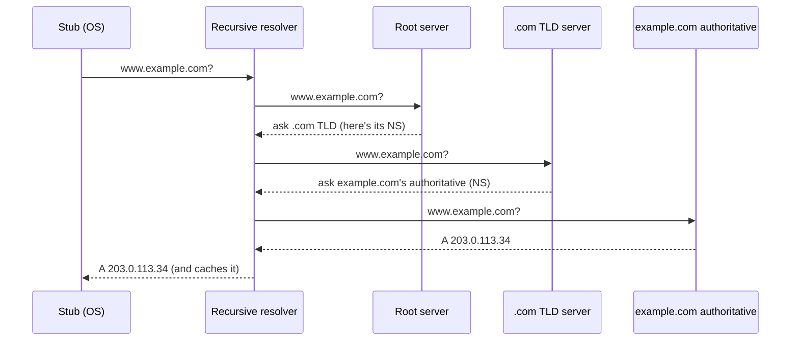
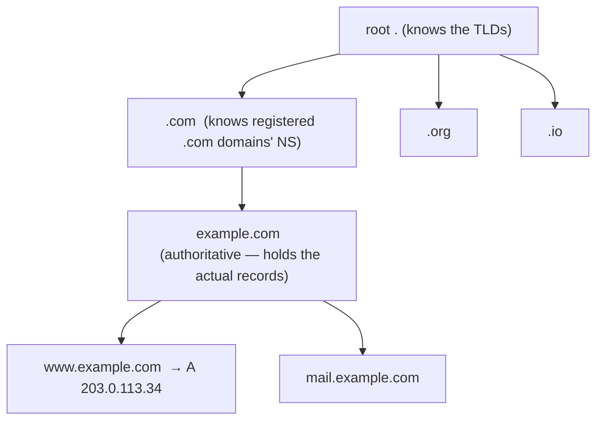

# DNS (resolution, records)

Before your Java code can `new Socket("example.com", 443)`, something has to turn `example.com` into an **IP address** ([T03](./T03-ip-ports-and-sockets.md)) — because packets are addressed by IP, never by name. That something is **DNS**, the Domain Name System: the internet's **distributed, hierarchical, cached** directory mapping names to IPs (and much more). It is one of the most elegant distributed systems ever built — *no single machine knows all the names*, yet any name resolves in milliseconds, billions of times a day, with no central bottleneck. It also explains a whole genre of production mysteries: "the DNS change hasn't propagated," "we failed over but the app still hits the dead node," "the first request is slow." Understanding DNS turns those from magic into mechanics.

The depth-bar: at the **language** layer, *why* DNS exists, the **resolution flow** (stub → recursive → root → TLD → authoritative), the **record types**, and **caching/TTL**. At the **architecture** layer: the **hierarchical distributed database** (a delegated tree — no owner of the whole), the message **wire format** ([T01](./T01-osi-and-tcp-ip-models.md)), why it runs on **UDP:53** ([T02](./T02-tcp-vs-udp.md)) with TCP fallback, **anycast**, and the security story (cache poisoning → DNSSEC, DoH/DoT). And the Java payoff: `InetAddress` plus the infamous **JVM DNS-cache TTL** gotcha.

> [!NOTE]
> Prerequisites: [IP, ports & sockets](./T03-ip-ports-and-sockets.md) (L2/C03/T03) — **what DNS resolves *to*, and `InetAddress`**; [TCP vs UDP](./T02-tcp-vs-udp.md) (L2/C03/T02) — **DNS rides UDP:53 with TCP fallback, and why UDP suits it**; [OSI & TCP/IP models](./T01-osi-and-tcp-ip-models.md) (L2/C03/T01) — the **wire/message format** idea.

## Why DNS?

Humans use memorable **names**; packets need **IPs** ([T03](./T03-ip-ports-and-sockets.md)). DNS is the **indirection layer** between them, and that indirection buys flexibility you'd lose with hardcoded IPs:

- The IP behind a name can **change** — a new server, a failover, a move to a CDN — without anyone updating a bookmark or recompiling.
- One name can map to **many IPs** — for load balancing ([T09](./T09-load-balancers.md)) or geographic steering ([T10](./T10-cdns.md)).
- Names are **stable, human-friendly identifiers** over a shifting substrate of addresses.

## The Resolution Flow

The cast: your OS's **stub resolver** (what `InetAddress`/`getaddrinfo` calls), a **recursive resolver** (your ISP's, or `8.8.8.8`/`1.1.1.1` — it does the legwork), and the **authoritative hierarchy** of **root**, **TLD**, and **authoritative** servers. Resolving `www.example.com`:



The recursive resolver answers you **recursively** (it returns the final answer); each step it makes to root/TLD/authoritative is **iterative** (each returns a **referral** — "I don't know, ask them" — not the answer). And the name is read **right to left**: `www.example.com.` (the trailing dot is the root) is a path *down* the tree **root → com → example → www**.

## Caching and TTL

Every answer carries a **TTL** (time-to-live, in seconds). Resolvers, the OS, and browsers **cache** the answer until the TTL expires — so the *overwhelming majority* of lookups never reach an authoritative server; they're served from a nearby cache in microseconds. **This caching is what makes DNS scale.**

It's also the source of the most common misconception: **"DNS propagation" is a myth.** DNS never *pushes* a change. When you edit a record, every cache still holding the old value keeps serving it **until its TTL expires** — then the next lookup fetches the new value. So "propagation delay" is just *the old record's TTL*. The practical rule: **lower the TTL well before a planned change**, so caches expire quickly when you cut over. (Failed lookups are cached too — **negative caching**, bounded by the zone's `SOA` minimum.) Caches stack: **browser → OS stub → recursive resolver → authoritative**.

## Record Types

A domain's records live in its **zone** (the authoritative dataset; a delegated subtree). The common types:

| Type | Maps / means |
|------|--------------|
| **A** | name → **IPv4** address |
| **AAAA** | name → **IPv6** address |
| **CNAME** | **alias** → another name (extra lookup; not allowed at the zone apex) |
| **MX** | **mail** exchangers (+ priority) |
| **NS** | **delegation** — which servers are authoritative for a zone |
| **TXT** | arbitrary text — **SPF/DKIM**, domain verification |
| **SOA** | zone metadata — primary NS, serial, refresh, negative-cache minimum |
| **PTR** | **reverse**: IP → name |
| **SRV** | **service** location — host + port for a service (used by Kubernetes, SIP) |
| **CAA** | which certificate authorities may issue certs for the domain ([T06](./T06-tls-ssl-and-certificates.md)) |

## DNS over UDP (and TCP)

DNS uses **port 53**, mostly over **UDP** ([T02](./T02-tcp-vs-udp.md)) — a query is tiny, the response usually fits in one packet, and UDP's **no-handshake low latency** is ideal for a lookup that blocks *every* outbound connection. The resolver handles retry/timeout itself. It **falls back to TCP** when the response exceeds the UDP size limit (historically **512 bytes**; **EDNS0** raised it) — a truncated UDP response sets the **TC** bit, prompting a retry over TCP — and for **zone transfers** (`AXFR`) between authoritative servers.

## Memory & Architecture Layer

### A Hierarchical Distributed Database

No machine holds the whole namespace. DNS is a **tree**, and each level **delegates** the next via `NS` records:



The root knows only the TLDs; a TLD knows only its registered domains' nameservers; the authoritative server holds the real records. Authority is **distributed and delegated**, which is exactly why DNS scales and has **no single owner or bottleneck**.

### The Wire Format

A DNS message ([T01](./T01-osi-and-tcp-ip-models.md) byte-layout angle) is a **12-byte header** followed by sections:

- **Header (12 bytes)** — a **transaction ID** (matches a response to its query — *essential* over connectionless UDP), **flags** (QR query/response, Opcode, **AA** authoritative, **TC** truncated, **RD** recursion-desired, **RA** recursion-available, **RCODE** result), and **counts** of the four sections.
- **Question** section — the name + type being asked.
- **Answer / Authority / Additional** sections — the records returned.

A neat trick: **name compression** — repeated domain suffixes are replaced by **pointers** to an earlier occurrence, saving bytes. And the **ID field** is how a stub matches an arriving UDP datagram to the query it sent — which is also a **security weakness** (guess the ID + port and you can forge a reply).

### Anycast

The "13 root servers" (and the TLD servers, and `8.8.8.8`) are not 13 machines — each is a single IP **announced from hundreds of physically distributed sites** via BGP routing (**anycast**). The network simply routes you to the *nearest* instance. Anycast is the **load-distribution + latency + DDoS-resilience** mechanism behind DNS (and CDNs — [T10](./T10-cdns.md)).

### Security

DNS was originally **unauthenticated**: a forged response with the right transaction ID and port **poisons the cache** (the Kaminsky attack). Defenses: **source-port randomization**, **DNSSEC** (cryptographic **signatures** on records, with a chain of trust from the root — authenticity, not privacy), and **encrypted DNS** — **DoH** (DNS-over-HTTPS) and **DoT** (DNS-over-TLS) — for **privacy**. DNS is also the steering layer for **CDNs** ([T10](./T10-cdns.md)) and for **service discovery** (`SRV` records, Kubernetes).

### Java Mapping

`InetAddress.getByName("example.com")` (and `getAllByName(...)` for all IPs) triggers resolution through the OS resolver ([T03](./T03-ip-ports-and-sockets.md)); it also happens implicitly inside `new Socket("name", port)`. The catch is the **JVM's own in-process DNS cache**, governed by the `networkaddress.cache.ttl` security property. Historically (with a `SecurityManager`) the default was **cache forever**; even otherwise it can cache longer than you expect. The result is a notorious failure: after a database or load-balancer **failover** changes the IP, a long-lived JVM keeps dialing the **old, dead** address. For failover-dependent services, set `networkaddress.cache.ttl` to something sane (30–60 s).

```java
InetAddress[] ips = InetAddress.getAllByName("example.com");   // all A/AAAA records
// java.security: networkaddress.cache.ttl=30   ← avoid the stale-IP-after-failover trap
```

> [!IMPORTANT]
> **"DNS propagation" isn't propagation.** DNS never pushes a change — a modified record is invisible to anyone still holding a cached copy **until its TTL expires**. To make a change cut over fast, **lower the record's TTL well in advance**; the old TTL is your worst-case delay.

> [!WARNING]
> **The JVM caches DNS in-process** (`networkaddress.cache.ttl`). A long-running JVM can keep using a **stale IP** after a failover (DB/load-balancer/RDS IP change) — the classic "everything failed over but my app still talks to the dead node." Set a sane cache TTL (≈30–60 s) for any service that relies on DNS failover.

> [!TIP]
> Watch resolution happen: **`dig +trace example.com`** shows the *full* root → TLD → authoritative walk, and **`dig example.com MX`** (or `A`, `NS`, `TXT`, …) queries a specific type. The **`TTL`** column shows how long each answer is cacheable — run `dig` twice and watch the TTL **count down** from a cache.

## Common Mistakes

### Assuming DNS Changes Are Instant

There's no push — old values live until their **TTL** expires. Lower the TTL *before* changing a record.

### The JVM DNS-Cache Gotcha

A long-lived JVM serving a **stale IP** after failover. Set `networkaddress.cache.ttl` (see the warning) — the #1 DNS surprise in Java services.

### CNAME at the Zone Apex

`example.com` itself can't be a `CNAME` (the apex needs `SOA`/`NS`, which a CNAME can't coexist with). Use the provider's `ALIAS`/`ANAME` flattening instead.

### Confusing A and CNAME

An **A** record points straight at an IP; a **CNAME** points at *another name* (costing an extra lookup to resolve). Don't chain CNAMEs needlessly.

### Treating DNS as Free and Always-Up

DNS is a **dependency**, a potential **SPOF**, and it adds latency to the **first** connection. Cache, pre-resolve hot names, and use redundant resolvers.

### Ignoring Negative Caching

An `NXDOMAIN` is cached too (the `SOA` minimum) — a just-created record can read as "missing" until the negative cache expires.

### Hardcoding IPs to "Skip DNS"

You lose failover, load balancing, and CDN steering — and you break the moment the IP changes. Resolve names; don't pin IPs.

### Absurdly Low TTLs Everywhere

TTL = 0/1 kills caching, hammers authoritative servers, and adds latency to every lookup. Balance change-agility against cache efficiency (low for things that move, higher for stable records).

> [!INTERVIEW]
> DNS is a backend/system-design staple — the strong answers cover the **resolution chain**, **TTL/caching** (not "propagation"), and the **JVM cache** trap.
>
> 1. **What is DNS?** The distributed, hierarchical, cached directory mapping names → IPs (and other records), consulted before any connection.
> 2. **Walk the resolution chain.** Stub → recursive resolver → root → TLD → authoritative; each upper level returns a **referral** (NS) to the next; the recursive resolver does the legwork and **caches**.
> 3. **Recursive vs iterative query?** The resolver answers *you* recursively (final answer); its queries to root/TLD/auth are iterative (referrals).
> 4. **What's a TTL — and what is "propagation"?** TTL = how long an answer is cacheable; "propagation" is just waiting for old cached copies' TTLs to expire (no push). Lower the TTL before changing a record.
> 5. **A vs AAAA vs CNAME vs MX vs NS vs TXT?** IPv4 / IPv6 / alias-to-name / mail servers / delegation / arbitrary text (SPF, DKIM).
> 6. **Why UDP (and when TCP)?** Tiny query/response + low latency ([T02](./T02-tcp-vs-udp.md)); TCP for responses > 512 B (pre-EDNS) and zone transfers; the **TC** bit triggers a TCP retry.
> 7. **How does a stub match a UDP response to its query?** The header **transaction ID** (+ source port) — also the cache-poisoning weakness.
> 8. **What is anycast in DNS?** One IP announced from many sites via BGP; routed to the nearest — how "13 root servers" are really hundreds, for load/latency/DDoS resilience.
> 9. **DNSSEC vs DoH/DoT?** DNSSEC = **signed** records (authenticity, chain of trust from the root); DoH/DoT = **encrypted** DNS (privacy).
> 10. **The JVM DNS-cache gotcha?** In-process caching via `networkaddress.cache.ttl` can serve stale IPs after failover — set a sane TTL.
> 11. **Why can't you CNAME the apex?** The apex needs `SOA`/`NS`, which can't coexist with a CNAME — use ALIAS/flattening.
> 12. **How does one name serve many IPs / steer by geo?** Multiple A records (round-robin/LB — [T09](./T09-load-balancers.md)) or geo-aware authoritative answers / anycast (CDN steering — [T10](./T10-cdns.md)).

## Practice

1. **Trace the walk.** `dig +trace example.com` — watch root → TLD → authoritative.
2. **Query record types.** `dig example.com A`, `AAAA`, `MX`, `NS`, `TXT`, `SOA`; `dig -x <ip>` for `PTR`.
3. **Watch the TTL.** `dig example.com` twice; see the TTL **count down** from a cache; flush the cache and watch it reset.
4. **UDP→TCP fallback.** Query a large response or force `dig +tcp`; observe the `TC` bit / TCP retry behaviour.
5. **Java resolution.** Use `InetAddress.getAllByName("example.com")`; print **all** IPs for a multi-A name.
6. **Reproduce the cache gotcha.** Set `networkaddress.cache.ttl`, resolve, change the host mapping (e.g. `/etc/hosts` or a test zone), and observe stale vs fresh behaviour.
7. **Compare resolvers.** `dig @8.8.8.8` vs `@1.1.1.1` vs your ISP; note latency and cache differences.
8. **Map the tree.** For `a.b.example.com`, identify the zones and the `NS` delegation at each level.
9. **Read the wire.** Capture a DNS query in Wireshark; find the **ID**, the flags, and the question/answer sections.
10. **TTL before a change.** In a sandbox zone, lower a TTL, then change the record; measure the actual cutover time vs the TTL.
11. **Negative caching.** Query a non-existent name (`NXDOMAIN`); query again; observe the cached negative answer.
12. **CDN steering.** Explain why a CDN ([T10](./T10-cdns.md)) returns **different** IPs for the same name from different locations (geo-aware answers / anycast).
13. **Explain it back.** For `new Socket("example.com", 443)`, trace (a) the stub → recursive → root → TLD → authoritative resolution, (b) the **TTL/caching** that usually short-circuits it, (c) why it's **UDP:53**, (d) the **JVM cache**'s role and the failover gotcha, and (e) how the result becomes the IP the socket connects to ([T03](./T03-ip-ports-and-sockets.md)).

## Recap

You should now be able to:

- Explain **why DNS exists** — a stable name→IP **indirection** ([T03](./T03-ip-ports-and-sockets.md)) enabling change, failover, and one-name-many-IPs (LB/CDN — [T09](./T09-load-balancers.md)/[T10](./T10-cdns.md)).
- Walk the **resolution chain** — stub → recursive resolver → root → TLD → authoritative (recursive vs iterative, the right-to-left tree path).
- Use **TTL/caching** correctly and explain that **"propagation" is just TTL expiry** (no push) — lower TTLs before changes; account for **negative caching**.
- Identify the **record types** (A/AAAA/CNAME/MX/NS/TXT/SOA/PTR/SRV/CAA) and the role of the **zone**.
- Describe the **architecture**: the **hierarchical distributed (delegated) tree**, the message **wire format** (12-byte header, transaction **ID**, name compression), **UDP:53 with TCP fallback** ([T02](./T02-tcp-vs-udp.md)), **anycast**, and security (**cache poisoning** → **DNSSEC**, **DoH/DoT**).
- Map DNS to Java — `InetAddress.getByName`/`getAllByName` — and avoid the **`networkaddress.cache.ttl`** stale-IP-after-failover trap; plus the other pitfalls (apex CNAME, A-vs-CNAME, DNS as a SPOF/latency, hardcoded IPs, over-low TTLs).

## Next

Continue to [HTTP/HTTPS lifecycle](./T05-http-https-lifecycle.md).
