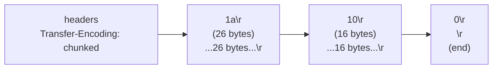
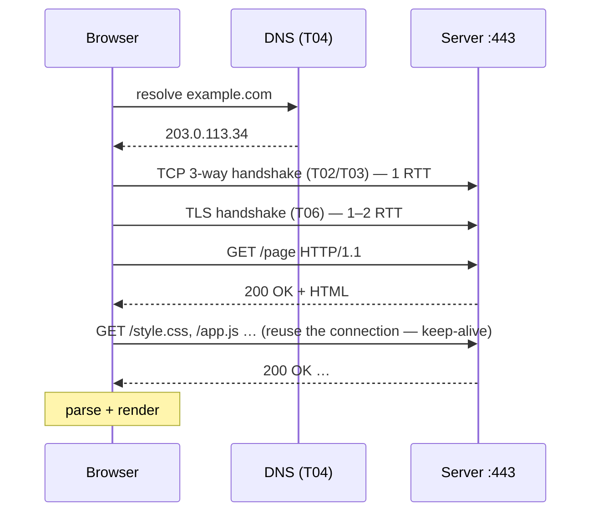
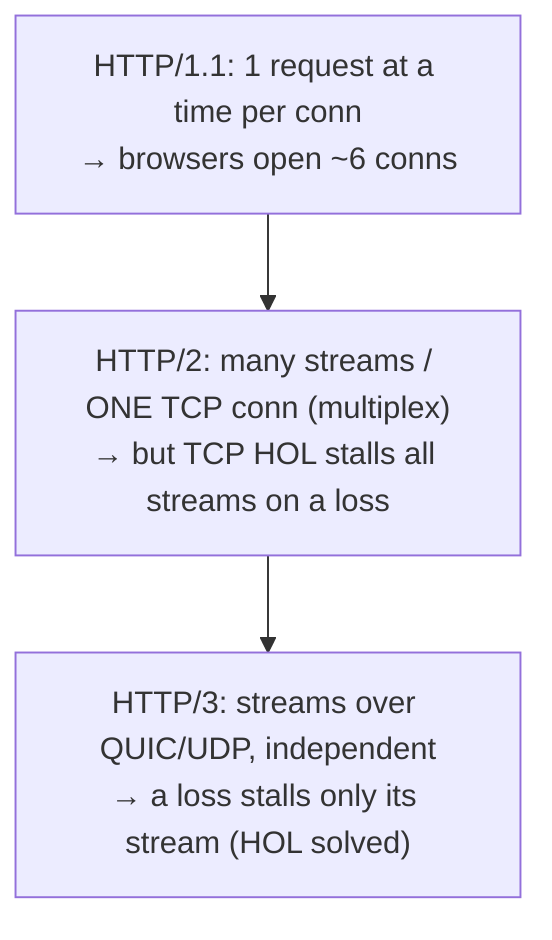
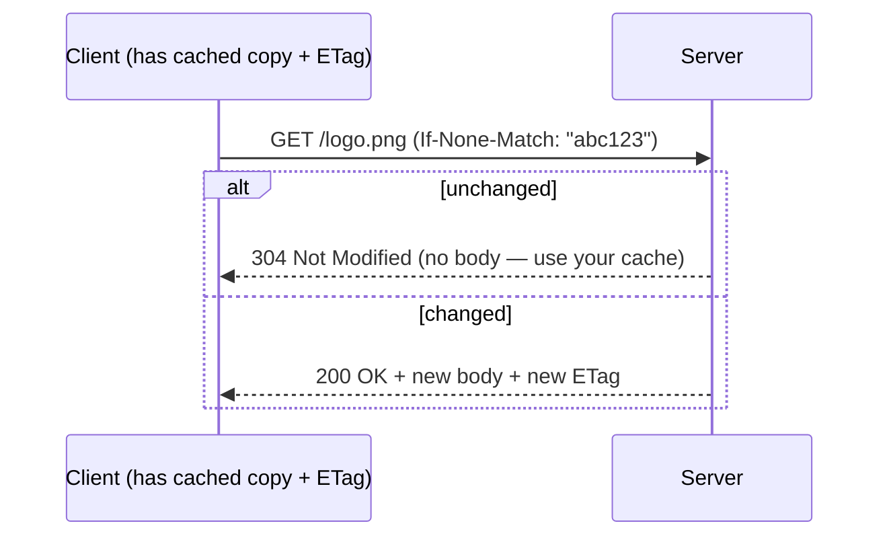

# HTTP/HTTPS lifecycle

HTTP is the application-layer (**L7** — [T01](./T01-osi-and-tcp-ip-models.md)) protocol the web runs on, and the one your backend services speak all day. It looks trivial — a text request, a text response — yet a single `https://example.com` pulls in **everything** in this chapter: it resolves a name via **DNS** ([T04](./T04-dns-resolution-records.md)), opens a **TCP** connection ([T02](./T02-tcp-vs-udp.md)/[T03](./T03-ip-ports-and-sockets.md)), negotiates **TLS** ([T06](./T06-tls-ssl-and-certificates.md)), and *then* exchanges HTTP. This is the chapter's **synthesis** topic: how HTTP is structured, how it **frames messages** over TCP's byte stream, the **end-to-end lifecycle**, how it **evolved** (1.0 → 1.1 → 2 → 3) to cut latency and beat head-of-line blocking, and how Java speaks it.

The depth-bar — and this is a big one: at the **language** layer, HTTP's **anatomy** (methods with safe/idempotent semantics, status codes, headers, body), **framing** (`Content-Length` vs chunked), **statelessness**, and the **version evolution**. At the **architecture** layer: HTTP as **text on the wire**, **chunked framing** as the concrete answer to TCP's "stream, not messages" ([T02](./T02-tcp-vs-udp.md)), the **RTT cost model** that every optimization targets, **head-of-line blocking** across versions, and **caching** (ETag/304). And the Java payoff: the modern `HttpClient`.

> [!NOTE]
> Prerequisites: [OSI & TCP/IP models](./T01-osi-and-tcp-ip-models.md) (L2/C03/T01) — **L7 application layer, wire format**; [TCP vs UDP](./T02-tcp-vs-udp.md) (L2/C03/T02) — **the TCP stream HTTP/1–2 ride, stream-not-messages framing, head-of-line blocking, QUIC**; [IP, ports & sockets](./T03-ip-ports-and-sockets.md) (L2/C03/T03) — **ports 80/443, and raw HTTP via `telnet`/`nc`**; [DNS](./T04-dns-resolution-records.md) (L2/C03/T04) — **the first step of the lifecycle**.

## HTTP Is Text-Based Request/Response

The model is simple: a client sends a **request**, the server returns one **response** — one exchange, then it's done. HTTP is **stateless** (the server remembers nothing between requests by default), historically **human-readable text** (you can type it by hand — [T03](./T03-ip-ports-and-sockets.md)), and it runs over **TCP** ([T02](./T02-tcp-vs-udp.md)/[T03](./T03-ip-ports-and-sockets.md)) on port **80** (HTTP) or **443** (HTTPS).

## Anatomy of a Request

```
GET /index.html HTTP/1.1        ← request line: METHOD path VERSION
Host: example.com               ← headers
Accept: text/html
User-Agent: curl/8.0
                                ← blank line ends headers
(body — for POST/PUT/PATCH)
```

**Methods** carry semantics that clients, proxies, and caches rely on:

| Method | Purpose | Safe? | Idempotent? |
|--------|---------|:-----:|:-----------:|
| **GET** | retrieve a resource | ✅ | ✅ |
| **HEAD** | GET without the body | ✅ | ✅ |
| **OPTIONS** | capabilities / CORS preflight | ✅ | ✅ |
| **POST** | create / submit | ❌ | ❌ |
| **PUT** | replace a resource | ❌ | ✅ |
| **PATCH** | partial update | ❌ | usually ❌ |
| **DELETE** | remove a resource | ❌ | ✅ |

**Safe** = no side effects (read-only). **Idempotent** = repeating it has the same effect as doing it once — which is what makes a request **safe to retry** (a key contract for clients, proxies, and load balancers — [T09](./T09-load-balancers.md)). Common **headers**: `Host` (required in 1.1 — virtual hosting), `Content-Type`, `Content-Length`, `Accept`, `Authorization`, `Cache-Control`, `Cookie` ([T07](./T07-cookies-sessions-and-tokens.md)), `Connection`.

## Anatomy of a Response

```
HTTP/1.1 200 OK                 ← status line: VERSION code reason
Content-Type: text/html
Content-Length: 1256

<html>…</html>                  ← body
```

**Status codes** group into five families:

| Family | Meaning | Examples |
|--------|---------|----------|
| **1xx** | informational | 100 Continue, 101 Switching Protocols |
| **2xx** | success | **200** OK, **201** Created, **204** No Content |
| **3xx** | redirection | **301** Moved Permanently, 302 Found, **304** Not Modified |
| **4xx** | client error | **400** Bad Request, **401** Unauthorized, **403** Forbidden, **404** Not Found, 409 Conflict, **429** Too Many Requests |
| **5xx** | server error | **500** Internal Server Error, **502** Bad Gateway, **503** Service Unavailable, 504 Gateway Timeout |

Returning the *right* code matters — monitoring, retries, caches, and clients all branch on it (a 500 *may* be retried for an **idempotent** method like GET/PUT/DELETE, but never blindly for a non-idempotent POST; a 400 should not be retried at all — fix the request first). Idempotency, not the status code alone, decides whether a retry is safe ([T02 REST principles in C04](../C04-web-and-rest-basics/T02-rest-principles-and-best-practices.md)).

## Framing — How HTTP Knows Where a Message Ends

TCP is a **byte stream with no message boundaries** ([T02](./T02-tcp-vs-udp.md)) — so how does the receiver know where one HTTP message ends and the next begins? HTTP **frames** the body explicitly, two ways:

- **`Content-Length: N`** — the header declares the exact body size; the receiver reads exactly N bytes.
- **`Transfer-Encoding: chunked`** — when the size isn't known up front (a generated/streamed response), the body is sent as **length-prefixed chunks**, ended by a zero-length chunk:



This **is** the concrete answer to T02's "TCP is a stream — you must frame yourself." HTTP's framing (length header or chunk markers) is exactly that mechanism, standardized.

## The Full Lifecycle

Tracing `https://example.com/page` ties the whole chapter together:



The lesson: a "simple" page load is a *stack of round-trips* — **DNS + TCP + TLS + request** before the first byte of content. Over a 100 ms link that's ~400 ms of pure latency. **Every** HTTP optimization (keep-alive, HTTP/2, HTTP/3, CDNs — [T10](./T10-cdns.md)) exists to **cut round-trips**.

## Connection Management & the Evolution

| Version | Connections | Concurrency | Head-of-line blocking |
|---------|-------------|-------------|------------------------|
| **HTTP/1.0** | one TCP **per request** | none | n/a — one request per connection (+ a new handshake each time) |
| **HTTP/1.1** | **persistent** (keep-alive) | one request at a time/conn | **app-level** (ordered responses) |
| **HTTP/2** | **one** TCP, **multiplexed** streams | many concurrent streams | **TCP-level** (one loss stalls all streams) |
| **HTTP/3** | **QUIC over UDP** | independent streams | **solved** (per-stream) + faster handshake |

- **HTTP/1.0** opened a fresh TCP connection (and handshake — [T02](./T02-tcp-vs-udp.md)) for *every* request — brutal for a page with dozens of resources.
- **HTTP/1.1** made connections **persistent (keep-alive)** by default — reuse one TCP connection for many requests, amortizing the handshake and avoiding ephemeral-port churn ([T03](./T03-ip-ports-and-sockets.md)). But it still serves **one request at a time per connection** (responses must come back in order), so browsers open ~6 parallel connections per host as a workaround.
- **HTTP/2** went **binary** and **multiplexed**: many concurrent **streams** over a **single** TCP connection (killing the 6-connection hack), plus **header compression (HPACK)**. (Server push also shipped but is effectively dead — Chrome removed it in 2022; **`103 Early Hints`** is the modern replacement.) But all streams share one TCP connection, so a single lost TCP segment stalls **every** stream — **TCP-level head-of-line blocking** ([T02](./T02-tcp-vs-udp.md)) remains.
- **HTTP/3** runs over **QUIC over UDP** ([T02](./T02-tcp-vs-udp.md)): streams are independent at the transport layer, so a lost packet stalls only **its own** stream — **HOL blocking solved** — and QUIC merges the transport + TLS handshake (even 0-RTT).



## Statelessness & HTTPS

**HTTP is stateless** — each request is independent; the server keeps no memory between them. State is layered *on top* via **cookies, sessions, and tokens** ([T07](./T07-cookies-sessions-and-tokens.md)). That statelessness is a feature: any server can handle any request, which is what makes horizontal scaling and load balancing ([T09](./T09-load-balancers.md)) work.

**HTTPS is just HTTP over TLS** ([T06](./T06-tls-ssl-and-certificates.md)) — the same HTTP messages, wrapped in a TLS channel that provides **confidentiality, integrity, and server authentication**. It is not "security magic"; it is specifically TLS (the handshake at step 3 of the lifecycle). Misconfigure TLS and HTTPS isn't secure.

## Memory & Architecture Layer

### Text on the Wire, and the RTT Cost Model

HTTP/1.x requests and responses are literally **ASCII bytes** you can type via `telnet`/`nc` ([T03](./T03-ip-ports-and-sockets.md)) — wonderful for debugging, but verbose, which is why HTTP/2+ went **binary**. The dominant performance fact is the **round-trip cost**:

> latency ≈ DNS ([T04](./T04-dns-resolution-records.md)) + TCP handshake (1 RTT, [T02](./T02-tcp-vs-udp.md)) + TLS handshake (1–2 RTT, [T06](./T06-tls-ssl-and-certificates.md)) + request/response (1 RTT)

Every optimization is an **RTT reduction**: **keep-alive** skips repeat handshakes; **HTTP/2 multiplexing** removes per-resource connection setup; **HTTP/3** merges the handshake and removes HOL waits; **CDNs** ([T10](./T10-cdns.md)) move the server physically closer (less RTT distance); **TLS 1.3 / 0-RTT** cut handshake round-trips. Read a request waterfall and you're reading this formula.

### Head-of-Line Blocking, Recapped

The throughline of the evolution is *where* HOL blocking lives: **HTTP/1.1** at the **application** level (one response at a time per connection), **HTTP/2** at the **transport** level (TCP order stalls all multiplexed streams on a single loss), **HTTP/3** **solved** (QUIC's independent streams). Each version moved the bottleneck down a layer until it was gone.

### Caching — Conditional Requests

HTTP's built-in **caching** is a first-class architecture tool. `Cache-Control` (`max-age`, `no-cache`, `private`/`public`) sets cacheability; **conditional requests** revalidate cheaply:



An **`ETag`** (a content fingerprint) plus **`If-None-Match`** lets the server answer **304 Not Modified** — "your cached copy is still good" — *without resending the body*. This conditional-revalidation mechanism is what makes browser caches and **CDNs** ([T10](./T10-cdns.md)) efficient.

### Idempotency as a Retry Contract

Safe/idempotent methods (GET/PUT/DELETE) can be **retried** without harm — a client, proxy, or load balancer can resend on a timeout. A **POST cannot** be blindly retried (you'd double-create / double-charge). This contract underpins resilient clients, retries, and load balancers ([T09](./T09-load-balancers.md)) — and is why APIs add idempotency keys to make POST safely retriable.

### Java Mapping

```java
// Modern: java.net.http.HttpClient (Java 11+), HTTP/2 by default
HttpClient client = HttpClient.newHttpClient();
HttpRequest req = HttpRequest.newBuilder(URI.create("https://api.example.com/users"))
        .header("Accept", "application/json").GET().build();

HttpResponse<String> res = client.send(req, HttpResponse.BodyHandlers.ofString());  // sync
int status = res.statusCode();                                                       // 200, 404, …

client.sendAsync(req, HttpResponse.BodyHandlers.ofString())                          // async
      .thenApply(HttpResponse::body)
      .thenAccept(System.out::println);          // returns a CompletableFuture
```

The modern **`java.net.http.HttpClient`** (Java 11+) speaks **HTTP/2**, offers **sync** (`send`) and **async** (`sendAsync` → `CompletableFuture`) APIs, and has pluggable body handlers. The legacy `HttpURLConnection` is clunky HTTP/1.1. Server-side, `com.sun.net.httpserver.HttpServer` is a toy; real servers use servlets/Spring (forward to L4). Under the hood it's still `Socket`s to the resolved IP:443 ([T03](./T03-ip-ports-and-sockets.md)/[T04](./T04-dns-resolution-records.md)).

> [!IMPORTANT]
> HTTP's **framing** (`Content-Length` or `Transfer-Encoding: chunked`) is the concrete solution to TCP's **"stream, not messages"** problem ([T02](./T02-tcp-vs-udp.md)). The receiver knows where a message ends because HTTP *tells* it — via the length header or chunk markers. This is the canonical real-world example of the framing you must **always** do over TCP.

> [!WARNING]
> **Respect method semantics.** **GET must be safe** (no side effects) and idempotent — using `GET /delete?id=5` for a mutation lets prefetchers, crawlers, and retries trigger it unexpectedly. Use **POST/PUT/DELETE** for changes, and rely on **idempotency** (GET/PUT/DELETE) when you need safe retries.

> [!TIP]
> `curl -v https://example.com` shows the exact request/response, headers, status, and TLS handshake; `telnet example.com 80` / `nc` shows **raw** HTTP/1.1 ([T03](./T03-ip-ports-and-sockets.md)). Browser **DevTools → Network** shows the full waterfall (DNS, connect, TLS, TTFB, download) — the **RTT cost model** made visible.

## Common Mistakes

### Using GET for Mutations / Non-Idempotent GET

Breaks caching, prefetching, and safe retries — and exposes mutations to crawlers. Use the right method (see the warning).

### Ignoring Status-Code Semantics

Returning `200` for an error (or `500` for a client mistake) misleads clients, proxies, monitoring, and retry logic. Use the correct family.

### Not Reusing Connections

A fresh TCP+TLS handshake per request is expensive ([T02](./T02-tcp-vs-udp.md)/[T03](./T03-ip-ports-and-sockets.md)). Use **keep-alive** / a pooled client.

### Confusing HTTP/2 Multiplexing with Solving HOL Blocking

HTTP/2 removes the 6-connection hack but **still suffers TCP-level HOL blocking** — only **HTTP/3 (QUIC)** truly solves it.

### Treating HTTPS as Magic

HTTPS is **HTTP + TLS** ([T06](./T06-tls-ssl-and-certificates.md)). Weak TLS config, expired certs, or downgrade attacks mean it isn't actually secure.

### Mishandling Framing

Assuming one `read` returns a whole message — it's a **TCP stream** ([T02](./T02-tcp-vs-udp.md)); honor `Content-Length`/chunked. (Most libraries do this for you — but know why.)

### Caching-Header Confusion

`Cache-Control` vs `ETag`/`If-None-Match` — caching too aggressively serves stale data; not at all wastes bandwidth. Use conditional requests (304).

### Assuming Stateless Means No Sessions

State is layered on via cookies/tokens ([T07](./T07-cookies-sessions-and-tokens.md)). "Stateless protocol" ≠ "stateless application."

### Blindly Retrying POST

Non-idempotent — a retry can double-create/charge. Use idempotency keys or only retry idempotent methods.

> [!INTERVIEW]
> HTTP is the most-asked backend networking topic — strong answers connect the **lifecycle** to DNS/TCP/TLS and explain the **version evolution** via head-of-line blocking.
>
> 1. **What is HTTP?** A **stateless**, text-based (1.x) request/response **application-layer** protocol over **TCP**; the web's protocol.
> 2. **Methods + safe/idempotent?** GET/HEAD/OPTIONS safe; GET/HEAD/PUT/DELETE/OPTIONS idempotent; POST neither; PATCH usually not. Drives caching and retries.
> 3. **Status-code families?** 1xx info, 2xx success, 3xx redirect, 4xx client error, 5xx server error (know 200/201/204/301/304/400/401/403/404/429/500/502/503).
> 4. **Walk the full HTTPS lifecycle.** DNS ([T04](./T04-dns-resolution-records.md)) → TCP handshake ([T02](./T02-tcp-vs-udp.md)) → TLS handshake ([T06](./T06-tls-ssl-and-certificates.md)) → HTTP request → response → render; sub-resources reuse the connection.
> 5. **How does HTTP frame messages over a TCP stream?** `Content-Length` (known size) or `Transfer-Encoding: chunked` (length-prefixed chunks) — the answer to TCP's stream-not-messages ([T02](./T02-tcp-vs-udp.md)).
> 6. **HTTP/1.1 vs 2 vs 3?** 1.1 keep-alive, one request at a time; 2 binary multiplexed streams over one TCP (but TCP HOL); 3 over QUIC/UDP (independent streams, no HOL, faster handshake).
> 7. **Head-of-line blocking in each version?** 1.1 app-level (ordered responses); 2 transport-level (TCP stalls all streams); 3 solved (QUIC).
> 8. **What is keep-alive and why does it matter?** Reusing one TCP connection for many requests — amortizes the handshake ([T02](./T02-tcp-vs-udp.md)) and avoids ephemeral-port churn ([T03](./T03-ip-ports-and-sockets.md)).
> 9. **What makes HTTP stateless, and how is state added?** Each request is independent; cookies/sessions/tokens ([T07](./T07-cookies-sessions-and-tokens.md)) layer state on top; statelessness enables scaling ([T09](./T09-load-balancers.md)).
> 10. **HTTPS = ?** HTTP over **TLS** ([T06](./T06-tls-ssl-and-certificates.md)) — confidentiality, integrity, server auth; not magic.
> 11. **How does HTTP caching work (ETag/304)?** `Cache-Control` sets cacheability; **ETag** + `If-None-Match` revalidates → **304 Not Modified** (use the cache, skip the body). Powers browser/CDN caching ([T10](./T10-cdns.md)).
> 12. **Idempotency and retries?** Safe/idempotent methods can be retried; POST can't (duplicates). Underpins resilient clients and load balancers ([T09](./T09-load-balancers.md)).
> 13. **Java HTTP client?** `HttpClient` (Java 11+, HTTP/2, sync `send` + async `sendAsync` → `CompletableFuture`); legacy `HttpURLConnection`.

## Practice

1. **Raw HTTP.** `telnet example.com 80` (or `nc`); type `GET / HTTP/1.1` + `Host:` + blank line; read the raw response ([T03](./T03-ip-ports-and-sockets.md)).
2. **Verbose curl.** `curl -v https://example.com` — observe DNS, TCP, the TLS handshake, request/response headers, and status.
3. **Methods.** GET/POST/PUT/DELETE against a test API with curl; read the status codes.
4. **Status codes.** Trigger 200/301/304/400/401/404/500 and read the responses.
5. **Keep-alive.** Compare `Connection: keep-alive` vs `close`; observe connection reuse (curl/Wireshark).
6. **Chunked.** Request a streamed/chunked response; observe `Transfer-Encoding: chunked` and the chunk framing.
7. **Length framing.** Send two requests on one keep-alive connection; see how `Content-Length` delimits the responses ([T02](./T02-tcp-vs-udp.md)).
8. **HttpClient sync.** `HttpClient.send(...)` a GET; read status/headers/body.
9. **HttpClient async.** `sendAsync(...)` returning a `CompletableFuture`; fire several concurrent requests and compose them.
10. **Caching.** Serve a resource with an `ETag`; re-request with `If-None-Match`; observe **304**.
11. **H2 vs H1.** Load a multi-resource page over each; in DevTools see HTTP/2 multiplexing (one connection) vs HTTP/1.1's parallel connections.
12. **HTTP/3.** Hit an H3 site (`curl --http3` / a browser); confirm QUIC/UDP in Wireshark.
13. **Idempotency.** Reason about retrying a GET vs a POST on timeout; design a safe retry (idempotency key).
14. **Waterfall.** In DevTools → Network, identify the DNS, connect, TLS, TTFB, and download phases (the RTT cost model).
15. **Explain it back.** For `https://api.example.com/users` via `HttpClient`, trace (a) DNS → TCP → TLS → request, (b) how the response body is **framed** (`Content-Length`/chunked) over the TCP stream, (c) why **keep-alive** helps the next call, (d) what **HTTP/2 vs /3** change about concurrency and HOL blocking, and (e) the role of the status code.

## Recap

You should now be able to:

- Describe HTTP as a **stateless, text-based request/response** protocol over TCP, and read its **anatomy** — methods (with **safe**/**idempotent** semantics), **status codes** (1xx–5xx), headers, body.
- Explain **framing** — `Content-Length` and **chunked** transfer encoding — as the concrete solution to TCP's **stream-not-messages** problem ([T02](./T02-tcp-vs-udp.md)).
- Trace the **full lifecycle** — URL → **DNS** ([T04](./T04-dns-resolution-records.md)) → **TCP** ([T02](./T02-tcp-vs-udp.md)/[T03](./T03-ip-ports-and-sockets.md)) → **TLS** ([T06](./T06-tls-ssl-and-certificates.md)) → request → response → render — and see latency as a **stack of round-trips**.
- Compare **HTTP/1.1 vs 2 vs 3** via **head-of-line blocking** (app-level → TCP-level → solved by QUIC) and **connection management** (keep-alive, multiplexing), and know **every optimization is an RTT reduction**.
- Understand **statelessness** (state layered on via cookies/tokens — [T07](./T07-cookies-sessions-and-tokens.md)) and that **HTTPS = HTTP + TLS** ([T06](./T06-tls-ssl-and-certificates.md)).
- Use HTTP **caching** (`Cache-Control`, **ETag**/`If-None-Match` → **304**) and **idempotency** as a retry contract, and speak HTTP from Java with **`HttpClient`** (sync + async).
- Avoid the traps — GET for mutations, wrong status codes, no connection reuse, HTTP/2≠HOL-solved, HTTPS-as-magic, framing mistakes, caching confusion, stateless≠sessionless, and blind POST retries.

## Next

Continue to [TLS/SSL & certificates](./T06-tls-ssl-and-certificates.md).
