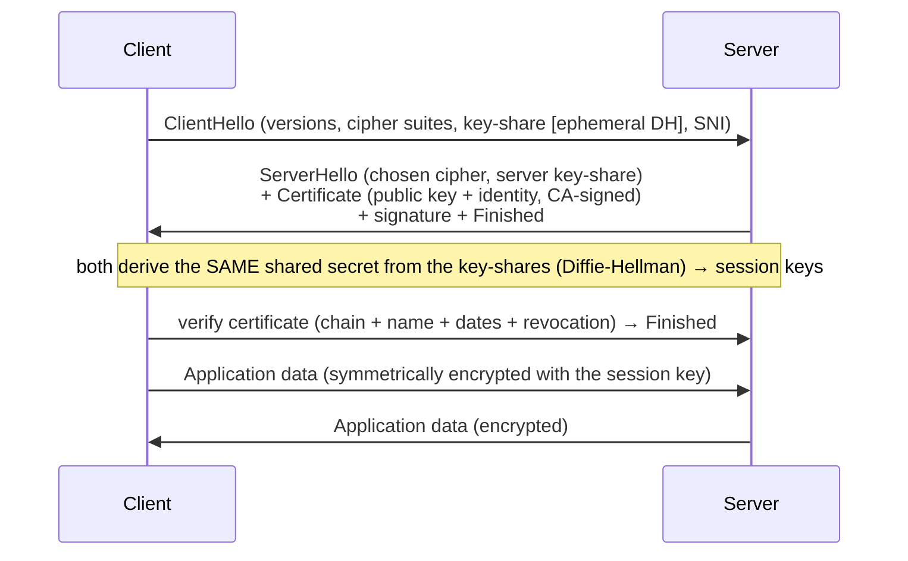
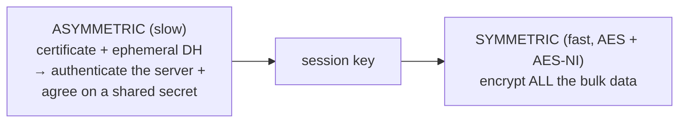
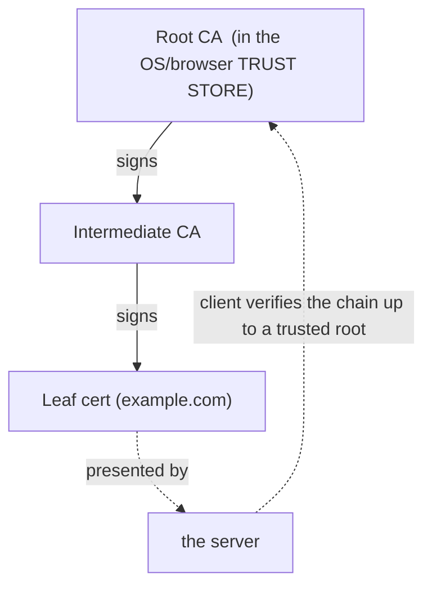

# TLS/SSL & certificates

[T05](./T05-http-https-lifecycle.md) said "HTTPS = HTTP + TLS." This topic is the **TLS**. **TLS** (Transport Layer Security; **SSL** is its deprecated ancestor) wraps a plain TCP connection ([T02](./T02-tcp-vs-udp.md)) in a channel with three guarantees: **confidentiality** (eavesdroppers see only ciphertext), **integrity** (tampering is detected), and **authentication** (the server really *is* `example.com` — proven by a certificate). Together they turn the open, hostile internet into something you can send a password over. The design is genuinely elegant: a short, expensive **asymmetric** handshake to authenticate the server and agree on a secret, then fast **symmetric** encryption for all the data — backed by a global trust system (**PKI**) that lets your browser verify a server it has never seen.

The depth-bar: at the **language** layer, what TLS provides, the **handshake**, **certificates/PKI**, and versions. At the **architecture** layer — the heart — the **hybrid-crypto cost model** (why asymmetric for setup, symmetric for bulk), the **RTT cost** of the handshake ([T05](./T05-http-https-lifecycle.md)), **forward secrecy**, the **trust store** as the root of trust, and **TLS termination** at the edge ([T08](./T08-proxies-and-reverse-proxies.md)/[T09](./T09-load-balancers.md)). And the Java payoff: `javax.net.ssl`, the `cacerts` trust store, and the one anti-pattern you must never ship.

> [!NOTE]
> Prerequisites: [HTTP/HTTPS lifecycle](./T05-http-https-lifecycle.md) (L2/C03/T05) — **"HTTPS = HTTP + TLS", the TLS step of the lifecycle, and the RTT cost model**; [TCP vs UDP](./T02-tcp-vs-udp.md) (L2/C03/T02) — **TLS rides on a TCP connection**; [DNS](./T04-dns-resolution-records.md) (L2/C03/T04) — **the name TLS authenticates, and the `CAA` record**.

## What TLS Provides

Three guarantees, and they're inseparable:

1. **Confidentiality** — the data is **symmetrically encrypted** (AES), so a sniffer on the wire sees only ciphertext.
2. **Integrity** — a MAC/AEAD tag means any **tampering** in transit is detected and rejected.
3. **Authentication** — a **certificate** proves the server is who it claims to be (and, with **mTLS**, the client too). This one is essential: encryption *without* authentication is worthless — you'd be encrypting a secret straight to an impostor.

**TLS vs SSL**: SSL (1.0–3.0) is the **deprecated** predecessor; people say "SSL" but mean TLS. TLS 1.0/1.1 are also deprecated — **1.2** and **1.3** are current (1.3, 2018, removed insecure ciphers and cut the handshake to one round-trip). TLS sits **between TCP ([T02](./T02-tcp-vs-udp.md)/[T03](./T03-ip-ports-and-sockets.md)) and the application (HTTP — [T05](./T05-http-https-lifecycle.md))** — a security wrapper ([T01](./T01-osi-and-tcp-ip-models.md) "presentation-ish"). HTTPS, SMTPS, and friends are just "protocol over TLS."

## The Handshake

Before any application data, the two sides run the TLS handshake (TLS 1.3, simplified):



TLS 1.3 completes in **1 RTT** (1.2 needed 2); **session resumption** and **0-RTT** let repeat visits skip most of it. The crucial idea is **hybrid crypto**:



**Asymmetric** crypto (the certificate's public/private key + ephemeral Diffie-Hellman) is used *only* in the handshake — to **authenticate** the server and let two strangers **agree on a shared secret**. **Symmetric** crypto (AES) — fast and hardware-accelerated — then encrypts *all* the actual data with that agreed session key. You get asymmetric's trust-bootstrapping **and** symmetric's speed.

## Certificates & PKI

An **X.509 certificate** binds a **public key** to an **identity** (a domain name), **signed by a Certificate Authority (CA)**. It carries the subject (domain, in the **SAN**), the public key, the issuer, validity dates, and the CA's signature. But why would your browser trust *that* CA? The **chain of trust**:



Your OS/browser ships a **trust store** of **root CA** certificates. A server presents a **leaf** cert signed by an **intermediate**, signed by a **root** in your store; the client verifies the **signature chain up to a trusted root**. Full verification = valid signature chain **+** the cert's SAN matches the domain ([T04](./T04-dns-resolution-records.md)) **+** within the validity dates **+** not revoked. Any failure → the browser warning. Related pieces:

- **CA-signed vs self-signed** — a self-signed cert isn't in anyone's trust store (warnings); fine for internal/dev with **manual** trust.
- **Let's Encrypt / ACME** — free, automated certs (90-day, auto-renewed) that democratized HTTPS.
- **Revocation** — CRLs / **OCSP** (online check) / **OCSP stapling** (the server attaches a fresh signed proof, sparing the client a round-trip).
- **SNI** (Server Name Indication) — the client sends the hostname in the ClientHello so **one IP can serve many domains' certs** (virtual hosting — [T05](./T05-http-https-lifecycle.md)).
- **CAA record** ([T04](./T04-dns-resolution-records.md)) — a DNS record naming **which CAs may issue** certs for a domain, guarding against mis-issuance.

## Memory & Architecture Layer

### The Asymmetric-vs-Symmetric Cost Model

Asymmetric operations (RSA/ECDHE) are **CPU-expensive**; symmetric **AES** is cheap and **hardware-accelerated** (the CPU's **AES-NI** instructions). So TLS spends asymmetric crypto *only* on the handshake (a few ops per connection) and symmetric crypto on the megabytes of data. The consequence: **the handshake is the cost, not the ongoing encryption** — which is exactly why connection reuse / keep-alive ([T05](./T05-http-https-lifecycle.md)) matters so much (amortize one handshake over many requests).

### The Handshake RTT Cost

TLS adds round-trips to connection setup, on top of TCP's ([T05](./T05-http-https-lifecycle.md) RTT cost model): **TLS 1.3 = 1 RTT** (1.2 was 2), and **resumption/0-RTT** cut repeat visits further. TLS is a real slice of the latency budget every HTTP optimization fights — which is why **HTTP/3 + QUIC** ([T02](./T02-tcp-vs-udp.md)) *merges* the TLS handshake into the transport handshake.

### Forward Secrecy

Modern TLS uses **ephemeral** Diffie-Hellman keys (**ECDHE**) that are generated per session and **discarded** afterward. The payoff: even if the server's long-term private key is **stolen later**, an attacker who *recorded* past traffic **still can't decrypt it** — each session used a unique ephemeral key that no longer exists. This **forward secrecy** is why old RSA key-transport (where the private key could decrypt everything) is deprecated.

### The Trust Store Is the Root of Trust

The entire system rests on the CAs in your trust store being honest. A **compromised or malicious CA** can issue a valid-looking cert for *any* domain → undetectable MITM (real incidents: **DigiNotar**, 2011). Mitigations: **Certificate Transparency** (public, auditable logs of every issued cert), **CAA** ([T04](./T04-dns-resolution-records.md)), and short-lived certs. This is why "just add it to the trust store" is a security decision, not a convenience.

### TLS Termination

In real deployments TLS is frequently **terminated at a load balancer or reverse proxy** ([T08](./T08-proxies-and-reverse-proxies.md)/[T09](./T09-load-balancers.md)): the edge does the handshake and decryption, then forwards **plain HTTP** to the backend over the trusted internal network (or re-encrypts for end-to-end). So **your Java service often sees HTTP, not HTTPS** — the TLS lived at the edge. Knowing where TLS terminates tells you where certs are managed and where traffic is in the clear.

### Java Mapping

```java
// HttpClient uses TLS automatically for https:// (T05)
HttpClient client = HttpClient.newHttpClient();
client.send(HttpRequest.newBuilder(URI.create("https://example.com")).build(),
            HttpResponse.BodyHandlers.ofString());

// Lower level: javax.net.ssl
SSLContext ctx = SSLContext.getDefault();          // uses the JVM trust store (cacerts)
SSLSocketFactory f = ctx.getSocketFactory();       // SSLSocket; SSLEngine for NIO/async
```

`javax.net.ssl` provides `SSLSocket`/`SSLServerSocket`, `SSLContext` (config), and `SSLEngine` (the protocol state machine for NIO/async — what Netty uses). `HttpsURLConnection`/`HttpClient` ([T05](./T05-http-https-lifecycle.md)) do TLS automatically for `https://`. The **JVM trust store** is `$JAVA_HOME/lib/security/cacerts` (bundled root CAs), managed with **`keytool`**; a `TrustManager` decides whom to trust and a `KeyManager` holds your own cert/key (for mTLS).

> [!IMPORTANT]
> The handshake's genius is **hybrid crypto**: slow **asymmetric** crypto (the certificate + ephemeral DH) is used *only* to **authenticate** the server and **agree on a session key**; fast **symmetric** crypto (AES) then encrypts all the data. You get trust-between-strangers *and* speed. The expensive part is the **handshake** — which is why connection reuse ([T05](./T05-http-https-lifecycle.md)) and TLS 1.3's 1-RTT matter.

> [!WARNING]
> **Never disable certificate validation** — a "trust-all" `TrustManager`, an empty `HostnameVerifier`, or shelling out to `curl -k` — to silence a cert error. It removes the **authentication** guarantee entirely, so anyone can MITM you with a self-signed cert (you're left with encryption to an *impostor*). Fix the root cause: add the missing CA to the trust store, correct the hostname, or renew the expired cert.

> [!TIP]
> Inspect any server's TLS with **`openssl s_client -connect example.com:443`** ([T03](./T03-ip-ports-and-sockets.md)) — it prints the negotiated version/cipher and the full certificate chain. In a browser, the padlock → certificate viewer shows the chain (leaf → intermediate → root), the SAN domains, and the validity dates. **`keytool -list -cacerts`** lists the JVM's trusted roots.

## Common Mistakes

### Disabling Certificate Validation

A "trust-all" `TrustManager` to "fix" a cert error is **catastrophic** — it enables trivial MITM (see the warning). Fix the trust/cert instead.

### Expired Certificates

Forgetting renewal takes a site down with browser warnings. Let's Encrypt certs are **90 days** — **automate** renewal (ACME/certbot).

### Hostname Mismatch Ignored

A cert for `a.com` used on `b.com` fails verification — the **SAN** must match the domain ([T04](./T04-dns-resolution-records.md)). Don't suppress it.

### Self-Signed Certs in Production

Users get warnings and learn to click through (training them to ignore *real* warnings). Use a CA-signed cert (Let's Encrypt is free).

### Allowing Old TLS / Weak Ciphers

Permitting TLS 1.0/1.1 or SSLv3 exposes you to known attacks (POODLE, BEAST). Require **TLS 1.2+** (ideally 1.3) and modern ciphers.

### Ignoring Revocation

Without OCSP/stapling, a **revoked** cert may still be accepted. Enable OCSP stapling.

### Assuming TLS Hides Everything

The **SNI hostname**, the **certificate**, and **traffic size/timing** still leak **metadata**. (Encrypted SNI / ECH addresses the hostname leak.)

### Committing the Private Key

The private key *is* the secret — a leaked key means anyone can impersonate you. Keep it out of the repo, and rotate immediately if exposed (secret scanning — [T11 in C02](../C02-build-tools-and-workflow/T11-dependency-vulnerability-scanning.md) family).

> [!INTERVIEW]
> TLS is a security/system-design staple — strong answers explain the **hybrid handshake** and the **chain of trust**, not just "it encrypts."
>
> 1. **What does TLS provide?** **Confidentiality** (encryption), **integrity** (tamper detection), **authentication** (certificates) — and optionally client auth (**mTLS**).
> 2. **TLS vs SSL?** SSL is the deprecated predecessor; "SSL" colloquially means TLS — use **1.2/1.3**.
> 3. **Walk the TLS handshake.** ClientHello (versions/ciphers/key-share/SNI) → ServerHello + **certificate** + server key-share → both derive a shared secret (DH) → client verifies the cert → Finished → symmetric application data.
> 4. **Why hybrid crypto?** **Asymmetric** authenticates + agrees a key (works between strangers, but slow); **symmetric** (AES) encrypts the bulk (fast, hardware-accelerated). Best of both.
> 5. **What's in a certificate and how is it trusted?** An X.509 cert binds a public key to a domain, signed by a CA; the client verifies the signature **chain** (leaf → intermediate → root in its trust store) + domain + dates + revocation.
> 6. **What is the chain of trust / a CA?** Roots in the trust store sign intermediates that sign leaf certs; trust flows down the chain.
> 7. **What is forward secrecy?** Ephemeral DH keys per session — stealing the server's long-term key later can't decrypt **past** recorded sessions.
> 8. **What did TLS 1.3 improve?** 1-RTT (vs 2) + 0-RTT resumption, removed insecure ciphers, mandatory forward secrecy.
> 9. **What is TLS termination?** Decrypting TLS at a load balancer/reverse proxy ([T08](./T08-proxies-and-reverse-proxies.md)/[T09](./T09-load-balancers.md)); the backend then receives plain HTTP.
> 10. **What is SNI?** The hostname in the ClientHello, so one IP serves many domains' certs (virtual hosting).
> 11. **What is mTLS?** Mutual TLS — the **client** also presents a certificate; both sides authenticate (service-to-service / zero-trust).
> 12. **The Java trust-all-certs anti-pattern?** A `TrustManager` accepting any cert disables authentication → MITM; never ship it — fix the trust store (`cacerts`/`keytool`).

## Practice

1. **Inspect a handshake.** `openssl s_client -connect example.com:443` — read the negotiated version/cipher and the certificate chain.
2. **Read a cert.** In a browser, view a site's cert: chain (leaf → intermediate → root), SAN domains, validity, issuer.
3. **Self-signed.** Generate a self-signed cert + keystore with `keytool`; serve HTTPS; observe the warning; add it to a trust store to clear it.
4. **Let's Encrypt.** Walk the ACME/certbot flow on a test domain; note the 90-day validity + auto-renew.
5. **Java over HTTPS.** Use `HttpClient` against an `https://` URL; confirm TLS is automatic; print the negotiated protocol.
6. **Trust a custom CA.** Import a CA/cert into the JVM `cacerts` with `keytool -importcert`; connect to a server that uses it.
7. **Watch the handshake.** In Wireshark, capture a TLS 1.3 handshake; identify ClientHello/ServerHello/Certificate; note the 1-RTT.
8. **The anti-pattern.** Implement (then **delete**) a trust-all `TrustManager`; with a MITM proxy, demonstrate exactly why it's dangerous.
9. **Weak version.** Force TLS 1.0 / a weak cipher and observe the rejection (or reason about the risk).
10. **CAA.** Check a domain's `CAA` record (`dig CAA`, [T04](./T04-dns-resolution-records.md)); explain what it restricts.
11. **Cert errors.** Trigger and read each: expired, hostname mismatch, untrusted issuer, self-signed.
12. **mTLS.** Set up mutual TLS between two services (client + server certs); verify both authenticate.
13. **Explain it back.** For `https://api.example.com`, trace (a) the handshake (ClientHello → cert → key agreement → session keys), (b) why it's **hybrid** (asymmetric for setup, symmetric for data), (c) how the **cert chain** is verified against the trust store, (d) what **forward secrecy** protects, and (e) where TLS might **terminate** ([T08](./T08-proxies-and-reverse-proxies.md)/[T09](./T09-load-balancers.md)) and what the backend then sees.

## Recap

You should now be able to:

- State what **TLS** provides — **confidentiality, integrity, authentication** (+ mTLS) — that **SSL** is its deprecated ancestor, and that it wraps a TCP connection between transport and HTTP ([T05](./T05-http-https-lifecycle.md)).
- Walk the **handshake** (ClientHello → ServerHello + certificate → Diffie-Hellman key agreement → verify → symmetric application data), and explain **hybrid crypto** (asymmetric to authenticate + agree a key, **symmetric** for the bulk).
- Explain **certificates & PKI** — an X.509 cert binds a public key to a domain, signed by a **CA**; the **chain of trust** (leaf → intermediate → **root** in the trust store); how a client verifies (chain + SAN + dates + revocation); Let's Encrypt/ACME, OCSP, **SNI**, and the **CAA** record ([T04](./T04-dns-resolution-records.md)).
- Describe the **architecture**: the **asymmetric-vs-symmetric cost model** (handshake is the cost, AES bulk is cheap), the **RTT cost** (TLS 1.3 1-RTT — [T05](./T05-http-https-lifecycle.md)), **forward secrecy** (ephemeral keys), the **trust store** as the root of trust (compromised-CA risk, Certificate Transparency), and **TLS termination** at the edge ([T08](./T08-proxies-and-reverse-proxies.md)/[T09](./T09-load-balancers.md)).
- Map TLS to Java — `javax.net.ssl` (`SSLContext`/`SSLSocket`/`SSLEngine`), `HttpClient` over `https://`, the **`cacerts`** trust store + **`keytool`** — and **never** disable certificate validation.
- Avoid the traps — trust-all certs, expired certs, hostname mismatch, self-signed in prod, old TLS/weak ciphers, ignored revocation, metadata leakage, and committed private keys.

## Next

Continue to [Cookies, sessions & tokens](./T07-cookies-sessions-and-tokens.md).
