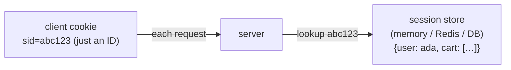
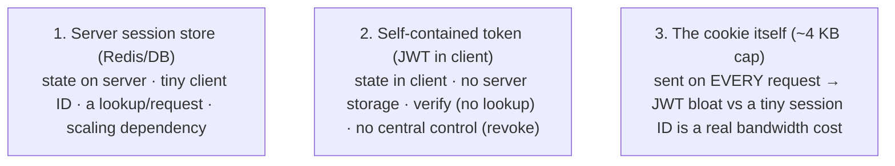

# Cookies, sessions & tokens

HTTP is **stateless** ([T05](./T05-http-https-lifecycle.md)) — each request stands alone, and the server remembers nothing between them. Yet every real application needs to answer "**who is this?**" on every request (you logged in three pages ago; the server has to know it's still you). The fix is to carry an identifier *with* each request, and there are two families of answer: **server-side sessions** (the client holds a small opaque ID; the *server* holds the state) and **stateless tokens** (the client holds a signed token; the server holds *nothing* and just verifies it). Both usually ride on **cookies** or the `Authorization` header. How you choose is one of the most consequential decisions in a web backend — it drives **security** (XSS, CSRF) and **scalability** (can any server handle any request?).

The depth-bar: at the **language** layer, **cookies** and their security attributes, **server-side sessions**, **tokens/JWT**, and the trade-off. At the **architecture** layer — the heart — **where the state physically lives**, the **stateless-scaling** payoff ([T09](./T09-load-balancers.md)), the **XSS-vs-CSRF storage dilemma**, and the **verify-vs-lookup** cost. And the Java payoff: `HttpSession`/`JSESSIONID` vs JWT.

> [!NOTE]
> Prerequisites: [HTTP/HTTPS lifecycle](./T05-http-https-lifecycle.md) (L2/C03/T05) — **HTTP is stateless; state is layered on; the `Set-Cookie`/`Cookie`/`Authorization` headers**; [TLS/SSL & certificates](./T06-tls-ssl-and-certificates.md) (L2/C03/T06) — **the `Secure` flag / HTTPS transport, and the HMAC/RSA signing that protects tokens**.

## The Problem — Stateless HTTP Needs Identity

Because HTTP keeps no memory ([T05](./T05-http-https-lifecycle.md)), the server can't tell that two requests come from the same user. So we must **send an identifier on every request**. The two storage models differ only in *where the actual state lives*: keep it **on the server** (a session) or **in the client** (a token). Either way, something small travels with each request — and that "something" is almost always a **cookie**.

## Cookies — the Transport

A cookie is a small key–value pair the server asks the browser to store and **send back automatically** on every subsequent request to the domain:

```mermaid
sequenceDiagram
  participant B as Browser
  participant S as Server
  B->>S: POST /login (credentials)
  S-->>B: 200 OK + Set-Cookie: sid=abc123; HttpOnly; Secure; SameSite=Lax
  Note over B: browser stores the cookie
  B->>S: GET /account  Cookie: sid=abc123   (auto-sent)
  S-->>B: 200 OK (knows it's you)
```

The power — and the danger — is that the browser sends it **automatically**. The **attributes** are the security knobs:

| Attribute | Effect |
|-----------|--------|
| `Domain` / `Path` | scope — which requests include the cookie |
| `Expires` / `Max-Age` | persistent vs **session** cookie (deleted on browser close) |
| **`Secure`** | sent **only over HTTPS** ([T06](./T06-tls-ssl-and-certificates.md)) — never in plaintext |
| **`HttpOnly`** | **JavaScript can't read it** (`document.cookie`) → **XSS** defense |
| **`SameSite`** (Strict/Lax/None) | controls sending on **cross-site** requests → **CSRF** defense |

Cookies are small (~4 KB) and sent on *every* request to the domain — so what you put in them costs bandwidth.

## Server-Side Sessions

The classic model: the cookie holds only an **opaque session ID** (a random token); the **server** stores the real state — user, cart, permissions — in a **session store** (in-memory, Redis, a DB) keyed by that ID.



**Pros**: sensitive state never leaves the server; the cookie stays tiny; and you can **revoke instantly** (delete the session = logged out). **Cons**: the server must **store** sessions, and scaling across many servers ([T09](./T09-load-balancers.md)) requires either **sticky sessions** (always route a user to the same server) or a **shared session store** (Redis) — a real scaling dependency.

## Tokens — Stateless Auth

The alternative: put a **signed token** in the client; the server **verifies the signature** and reads the claims — **no lookup, no server storage**. The dominant format is the **JWT** (JSON Web Token), three base64url parts:

```
header.payload.signature
  header    {"alg":"HS256","typ":"JWT"}
  payload   {"sub":"ada","exp":1735689600,"iss":"auth.example.com","role":"admin"}   ← "claims"
  signature HMAC-SHA256(header.payload, secret)   — or RSA/EC with a private key (T06)
```

The server verifies by recomputing/checking the **signature** (with the shared secret, or a public key — [T06](./T06-tls-ssl-and-certificates.md)) and checking `exp`/`iss`; if it's valid, it trusts the claims — **statelessly**, with no shared storage. Tokens are usually sent as `Authorization: Bearer <token>` ("bearer" = whoever holds it can use it → protect it).

> [!IMPORTANT]
> **A JWT is *signed*, not *encrypted*.** `base64url` is **encoding**, not secrecy — anyone holding the token can decode and **read** the payload (paste it into jwt.io and see). The signature only proves the token wasn't **tampered with**. So **never put secrets** (passwords, sensitive PII) in a JWT payload, and **always send it over HTTPS** ([T06](./T06-tls-ssl-and-certificates.md)).

## Sessions vs Tokens — the Trade-off

| | **Server-side session** | **JWT / stateless token** |
|---|---|---|
| **State lives** | on the server (store) | in the client (the token) |
| **Server storage** | yes (memory/Redis/DB) | **none** |
| **Revoke** | **easy** (delete the session) | **hard** (valid until `exp`) |
| **Horizontal scaling** | needs sticky sessions / shared store | **any server verifies** — frictionless |
| **Per-request size** | tiny (just an ID) | larger (the whole token, every request) |
| **Best for** | traditional web apps | APIs, microservices, SPAs |

The defining JWT gotcha is **revocation**: because the server holds no state, you can't simply "log someone out" — the token is valid until it expires. Mitigate with **short-lived access tokens** (minutes) + a **refresh token** (to mint new ones) + an optional **denylist** for emergencies. **OAuth2 / OIDC** generalize this: delegated auth ("Login with Google") issues an **access token** (short-lived) + **refresh token** via the **authorization-code flow**, and **OIDC** adds an **ID token** (a JWT identifying the user) — so you never handle the user's password yourself.

## Memory & Architecture Layer

### Where the State Physically Lives

Three models, one question — *who holds the truth?*



### The Stateless-Scaling Payoff

The deep reason tokens are popular: a stateless token lets **any server handle any request** — no sticky sessions, no shared session store — so you scale **horizontally** for free ([T09](./T09-load-balancers.md)). It's the *same* "statelessness enables scaling" theme as HTTP itself ([T05](./T05-http-https-lifecycle.md)). Server-side sessions reintroduce state, so as you add servers you must manage it (sticky or shared). This single property is why APIs and microservices lean toward tokens.

### The XSS-vs-CSRF Storage Dilemma

Where do you store a token in the **browser**? There's no free lunch — it's the crux of web-auth security:

| Storage | XSS (injected JS) | CSRF (auto-sent) |
|---------|-------------------|-------------------|
| **HttpOnly cookie** | ✅ safe (JS can't read it) | ❌ prone (auto-sent) → add **SameSite** + CSRF tokens |
| **localStorage** (JS-readable) | ❌ exposed (any script steals it) | ✅ safe (not auto-sent) |

The common modern answer is **`HttpOnly` + `Secure` + `SameSite` cookies**, and defending **XSS at the source** (Content-Security-Policy, output encoding) — because an XSS hole compromises *either* storage in practice.

### Verify vs Lookup

A **JWT verify** is **CPU** (a signature check) but **no I/O**; a **session lookup** is **I/O** (a Redis/DB round-trip) but trivial CPU. And the signature choice matters: **HMAC** (a shared secret) is cheap but every verifier must hold the secret; **RSA/EC** ([T06](./T06-tls-ssl-and-certificates.md)) lets many services **verify with a public key** without sharing the signing secret — ideal for microservices.

### Java Mapping

```java
// Classic server-side session — the servlet container manages a JSESSIONID cookie
HttpSession session = request.getSession();        // creates/loads server-side state
session.setAttribute("user", user);                // stored on the server (sticky/shared to scale)

// Stateless JWT (e.g. jjwt) — verify the signature, trust the claims, no lookup
Jws<Claims> jws = Jwts.parser().verifyWith(key).build().parseSignedClaims(token);
String user = jws.getPayload().getSubject();
```

Servlet **`HttpSession`** (`request.getSession()`) sets a **`JSESSIONID`** cookie and stores state server-side (in-memory by default — the sticky/shared-store issue; **Spring Session** externalizes it to Redis). **Spring Security** supports both session-based and token/JWT auth; JWT libraries (jjwt, nimbus-jose-jwt) sign/verify; cookies are read/written via `Cookie`/`Set-Cookie` ([T05](./T05-http-https-lifecycle.md)).

> [!WARNING]
> The browser-storage choice is a genuine trade-off with **no perfect answer**: an **`HttpOnly` cookie** resists **XSS** (JS can't read it) but is **CSRF**-prone (auto-sent) → add **`SameSite`** + CSRF tokens; **localStorage** resists CSRF but is **XSS**-exposed (any injected script steals it). Default to **`HttpOnly` + `Secure` + `SameSite`** cookies, and kill XSS at the source.

> [!TIP]
> JWTs shine for **stateless, horizontally-scaled APIs** — but you **cannot easily revoke** one before it expires. Use **short-lived access tokens** + a **refresh token**, with a **denylist** for emergency revocation. If you need instant, reliable logout, **server-side sessions** are simpler — pick the model from your real requirements (scale vs revocation), not fashion.

## Common Mistakes

### Putting Sensitive Data in a Cookie/JWT Payload

`base64` ≠ encryption — the JWT payload is **readable**. Never store secrets there (see the important callout).

### Missing `HttpOnly` / `Secure` / `SameSite`

Without them, auth cookies are exposed to **XSS** (JS theft), **plaintext** interception, and **CSRF**. Set all three.

### The JWT Can't-Revoke Surprise

Assuming "logout" invalidates a token — it doesn't. Use **short expiry + refresh + denylist**.

### Giant JWTs on Every Request

Stuffing claims bloats a token that's sent with *every* request (bandwidth). Keep claims minimal; if it bloats, use a session ID instead.

### In-Memory Sessions Breaking Horizontal Scaling

A user's session lives on **one** server, so the next request hitting another server has no session. Use **sticky sessions** or a **shared store** (Redis — [T09](./T09-load-balancers.md)).

### CSRF on Cookie Auth

The browser auto-sends cookies, so a malicious site can trigger authenticated requests. **`SameSite`** + CSRF tokens.

### Trusting an Unverified JWT / `alg: none`

Accepting a token without verifying the signature — or honoring `alg: none` — lets anyone forge claims (a classic JWT vuln). **Always verify** with the **expected** algorithm.

### Long-Lived Tokens / No Expiry

A stolen token with no/long expiry is valid forever. Use **short expiry** + rotation.

> [!INTERVIEW]
> Auth questions are universal in backend interviews — the strong answers cover the **sessions-vs-tokens trade-off** and the **XSS-vs-CSRF** storage dilemma.
>
> 1. **HTTP is stateless — how do you add state?** Carry an identifier per request (a cookie or `Authorization` header); store the state **server-side** (session) or **client-side** (token).
> 2. **Key cookie attributes?** `Secure` (HTTPS-only), `HttpOnly` (no JS → XSS defense), `SameSite` (cross-site control → CSRF defense), plus `Domain`/`Path`/`Expires`.
> 3. **Server-side session vs JWT?** Session: opaque ID + server storage, **easy revoke**, needs sticky/shared store to scale. JWT: signed self-contained token, **no server storage**, **scales horizontally**, but **hard to revoke**.
> 4. **What's in a JWT, and is it encrypted?** `header.payload.signature` (base64url); **signed** (HMAC/RSA), **not encrypted** — readable by anyone. The signature proves integrity, not secrecy.
> 5. **XSS vs CSRF, and how do cookie attributes defend?** XSS = injected JS steals data (`HttpOnly` stops cookie theft); CSRF = a malicious site rides your auto-sent cookie (`SameSite` + CSRF tokens stop it).
> 6. **Why do stateless tokens help horizontal scaling?** Any server verifies without a shared session store or sticky sessions ([T09](./T09-load-balancers.md)) — the statelessness-enables-scaling theme ([T05](./T05-http-https-lifecycle.md)).
> 7. **How do you revoke a JWT?** You can't easily before `exp` — short-lived access + refresh tokens + an optional denylist.
> 8. **Where should a token live in the browser?** `HttpOnly`+`Secure`+`SameSite` cookie (XSS-safe, CSRF-mitigated) vs `localStorage` (CSRF-safe, XSS-exposed) — the trade-off.
> 9. **What is OAuth2 / OIDC?** Delegated auth ("Login with Google"): access + refresh tokens via the authorization-code flow; OIDC adds an **ID token** (a JWT identifying the user).
> 10. **What is a Bearer token?** One where holding it grants access (`Authorization: Bearer`) — protect it; HTTPS only.
> 11. **HMAC vs RSA-signed JWT?** HMAC = shared secret (cheap, but every verifier knows it); RSA/EC = private-key sign + **public-key verify** (services verify without the secret — microservices).
> 12. **The `alg: none` vulnerability?** Accepting a token that declares no signature lets anyone forge it — always require and verify the expected algorithm.

## Practice

1. **Cookie round-trip.** A server sets a cookie; observe the browser echo it on the next request (DevTools / `curl -v`).
2. **Inspect attributes.** In DevTools (Application → Cookies), view `Secure`/`HttpOnly`/`SameSite`; toggle them and observe behaviour.
3. **Server-side session.** Use `HttpSession` (or any framework); observe the `JSESSIONID` cookie and the server-side lookup.
4. **Decode a JWT.** Paste a token into jwt.io (or base64-decode the payload yourself) — confirm it's **readable** (base64 ≠ encryption).
5. **Verify a JWT.** In Java (jjwt/nimbus), verify a signature; tamper with the payload and watch verification **fail**.
6. **SameSite CSRF.** Do a cross-site form POST with and without `SameSite`; observe the cookie sent or blocked.
7. **HttpOnly XSS.** Try `document.cookie` on an `HttpOnly` cookie — confirm JS can't read it.
8. **Sticky vs shared.** Reason about (or demo) an in-memory session breaking across two server instances; fix with Redis.
9. **Refresh flow.** Implement a short-lived access token + a refresh token that mints a new one.
10. **`alg: none`.** Craft a token with `alg: none`; confirm your verifier **rejects** it.
11. **OAuth2.** Walk the authorization-code flow (a "Login with Google" sandbox); identify the access / refresh / ID tokens.
12. **Storage decision.** For a given app, argue HttpOnly-cookie vs localStorage and justify it via XSS/CSRF.
13. **Explain it back.** For a logged-in user, trace (a) how the cookie/token rides each request, (b) **session-lookup vs JWT-verify**, (c) why a JWT scales horizontally without a shared store ([T09](./T09-load-balancers.md)), (d) the **XSS-vs-CSRF** trade-off of where it's stored, and (e) why you must use HTTPS ([T06](./T06-tls-ssl-and-certificates.md)) and can't put secrets in the payload.

## Recap

You should now be able to:

- Explain why **stateless HTTP** ([T05](./T05-http-https-lifecycle.md)) needs an identifier per request, and the two models — **server-side sessions** (opaque ID + server store) vs **client-side tokens** (signed, self-contained).
- Use **cookies** and their security attributes — **`Secure`** (HTTPS — [T06](./T06-tls-ssl-and-certificates.md)), **`HttpOnly`** (XSS defense), **`SameSite`** (CSRF defense), `Domain`/`Path`/`Expires`.
- Describe **JWTs** — `header.payload.signature`, claims, HMAC vs RSA signing ([T06](./T06-tls-ssl-and-certificates.md)) — and that they are **signed, not encrypted** (base64 ≠ secrecy; readable, never store secrets).
- Choose between **sessions and tokens** via the trade-off — **revocation** (easy vs hard) and **scaling** (sticky/shared store vs stateless-anywhere) — and know **OAuth2/OIDC** at a glance.
- Reason about the **architecture**: where state physically lives, the **stateless horizontal-scaling** payoff ([T09](./T09-load-balancers.md)), the **XSS-vs-CSRF storage dilemma**, and **verify-vs-lookup** cost.
- Map to Java — `HttpSession`/`JSESSIONID` vs JWT libraries — and avoid the traps (secrets in payloads, missing cookie flags, can't-revoke surprise, JWT bloat, in-memory-session scaling, CSRF, unverified/`alg:none` tokens, no expiry).

## Next

Continue to [Proxies & reverse proxies](./T08-proxies-and-reverse-proxies.md).
