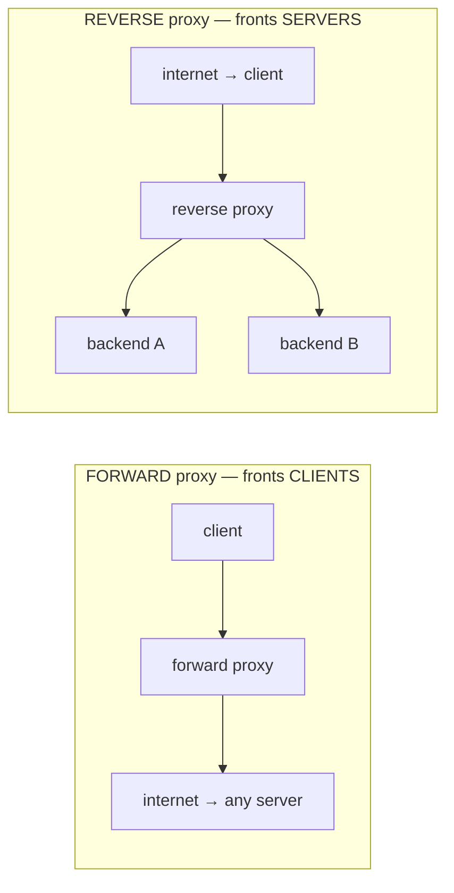
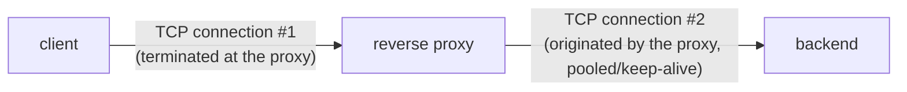

# Proxies & reverse proxies

So far the model has been *client talks directly to server*. In reality, requests pass through **intermediaries** — **proxies** — that sit in the middle and add value: terminating TLS, routing, caching, load balancing, filtering. The decisive distinction is **which side** the proxy fronts. A **forward proxy** acts on behalf of **clients** (it sits at the edge of the client's network — corporate egress, filtering, privacy). A **reverse proxy** acts on behalf of **servers** — the client thinks it *is* the origin, while **Nginx**, **HAProxy**, and **Envoy** quietly front nearly every production backend. The reverse proxy is one of the most important pieces of backend architecture: it's where **TLS terminates** ([T06](./T06-tls-ssl-and-certificates.md)), where **load balancing** happens ([T09](./T09-load-balancers.md)), and where **caching** and **routing** live.

The depth-bar: at the **language** layer, the forward-vs-reverse distinction and what each does. At the **architecture** layer — the heart — the proxy as an **L7 intermediary** (vs an L4 byte-forwarder — [T01](./T01-osi-and-tcp-ip-models.md)), the **two-connection model** (and why the backend needs `X-Forwarded-For` — [T03](./T03-ip-ports-and-sockets.md)), the **TLS-termination** architecture ([T06](./T06-tls-ssl-and-certificates.md)), and the **single-choke-point** trade-off. This topic bridges directly into **load balancers** ([T09](./T09-load-balancers.md)) and **CDNs** ([T10](./T10-cdns.md)).

> [!NOTE]
> Prerequisites: [HTTP/HTTPS lifecycle](./T05-http-https-lifecycle.md) (L2/C03/T05) — **the HTTP requests a proxy forwards, `Cache-Control`/`ETag`, and the `CONNECT` method**; [TLS/SSL & certificates](./T06-tls-ssl-and-certificates.md) (L2/C03/T06) — **TLS termination at the proxy**; [IP, ports & sockets](./T03-ip-ports-and-sockets.md) (L2/C03/T03) — **the client IP and why the backend sees the proxy's**.

## What Is a Proxy? Forward vs Reverse

A **proxy** is a middleman that forwards requests between client and server. The crucial split is *which side it represents*:

- **Forward proxy** — sits in front of **clients**, acts on the *client's* behalf. The **client** is configured to use it; the destination server sees the *proxy*, not the client. Uses: corporate **egress control**/content filtering, **caching** for a whole office, and **privacy/anonymity** (hide the client). It **hides the client**.
- **Reverse proxy** — sits in front of **servers**, acts on the *server's* behalf. The **client is unaware** — it believes the proxy *is* the origin server, while the real backends hide behind it. This is the production workhorse (Nginx/HAProxy/Envoy/Caddy). It **hides the server**.

Same "middleman" mechanism; opposite side. The mnemonic: **forward proxy hides who's *asking*; reverse proxy hides who's *answering*.**

## What a Reverse Proxy Does

The reverse proxy is where a backend's cross-cutting concerns live, so the app servers can stay simple:

| Job | What it means |
|-----|---------------|
| **TLS termination** | do the TLS handshake/decryption at the edge ([T06](./T06-tls-ssl-and-certificates.md)); forward plain HTTP to backends — centralizes certs |
| **Load balancing** | distribute requests across backend instances ([T09](./T09-load-balancers.md)) |
| **Caching** | serve cached responses without hitting the backend ([T05](./T05-http-https-lifecycle.md) `Cache-Control`/`ETag`; CDNs — [T10](./T10-cdns.md)) |
| **Compression** | gzip/brotli responses |
| **Request routing** | path-based (`/api` → service A, `/img` → B) or host-based — the **API-gateway** role |
| **Rate limiting / WAF** | throttle and filter malicious traffic, shielding backends |
| **Header manipulation** | add `X-Forwarded-For`/`-Proto`/`-Host` so the backend learns the real client ([T03](./T03-ip-ports-and-sockets.md)) |
| **Buffering** | absorb slow clients so backends aren't tied up |
| **Static files** | serve static content directly, offloading the app server |

## Forward Proxy Uses

Briefer, but real: **egress control / content filtering** (a corporate "you can't reach that site"), **shared caching**, and **privacy** (the server sees the proxy's IP, not the client's). The subtlety is HTTPS: a forward proxy can't see inside TLS ([T06](./T06-tls-ssl-and-certificates.md)), so it uses the **`CONNECT`** method ([T05](./T05-http-https-lifecycle.md)) — the client sends `CONNECT host:443`, the proxy opens a **raw TCP tunnel** and blindly relays the encrypted bytes. That's how a forward proxy carries traffic it cannot decrypt.

## API Gateway

An **API gateway** is a reverse proxy **specialized for microservices**: authentication ([T07](./T07-cookies-sessions-and-tokens.md)), routing to many services, rate limiting, request aggregation, and protocol translation — the single front door to a microservices backend (forward to L4/L5).

## Memory & Architecture Layer

### L7 Intermediary vs L4 Byte-Forwarder

A reverse proxy usually operates at **layer 7** ([T01](./T01-osi-and-tcp-ip-models.md)): it **reads and understands HTTP** — the method, path, and headers — so it can route by URL, cache responses, and rewrite headers. Contrast an **L4 (transport) proxy/load balancer**, which just forwards **TCP bytes** without understanding HTTP: faster and protocol-agnostic, but it *can't* route by path or cache content. This **L4-vs-L7** distinction is the fundamental axis of edge infrastructure — and the central theme of load balancers ([T09](./T09-load-balancers.md)).

### The Two-Connection Model

The mechanism that makes a proxy more than a wire: it does **not** relay a single connection. It **terminates** the client's TCP connection ([T02](./T02-tcp-vs-udp.md)/[T03](./T03-ip-ports-and-sockets.md)) and **originates a separate** connection to the backend.

Three consequences flow from this:

- The proxy can **pool and reuse** keep-alive connections to the backend ([T05](./T05-http-https-lifecycle.md)) — far fewer backend handshakes, a real C10k mitigation ([T02](./T02-tcp-vs-udp.md)/[T03](./T03-ip-ports-and-sockets.md)).
- The backend sees the **proxy's** IP as the source ([T03](./T03-ip-ports-and-sockets.md)), **not** the client's — which is exactly why **`X-Forwarded-For`** exists, to convey the real client IP.
- The proxy can **buffer, transform, and protect** — absorbing slow clients and shielding backends.

### TLS Termination Architecture

TLS typically **terminates at the reverse proxy** ([T06](./T06-tls-ssl-and-certificates.md)): the certs live there, the handshake happens there, and traffic to backends is **plain HTTP** over the trusted internal network (or re-encrypted for end-to-end). This is *why your Java service usually sees HTTP, not HTTPS* — the TLS lived at the edge. Knowing where TLS terminates tells you where certs are managed and where traffic is in the clear.

### The Single Choke-Point Trade-off

Every request flows through the reverse proxy, so it is simultaneously a **single point of failure** and a potential **bottleneck** — it needs its own redundancy (multiple proxies behind an upstream load balancer / DNS / anycast — [T09](./T09-load-balancers.md)/[T10](./T10-cdns.md)). But that choke point is *also the value*: it's the **one place** to enforce TLS, auth, rate limits, caching, and routing. The trade-off is **centralization** — power and a single control point, against risk and a bottleneck. (Proxies are also **explicit** — the client is configured to use it, as with forward proxies — or **transparent** — intercepting traffic inline with no client config.)

### Java Angle

In production a Java app almost always sits **behind** a reverse proxy (Nginx/Envoy/a cloud ALB). The practical implications: read the client IP from **`X-Forwarded-For`**, *not* the socket's remote address ([T03](./T03-ip-ports-and-sockets.md), which is the proxy); trust **`X-Forwarded-Proto`** to know whether the original request was HTTPS ([T06](./T06-tls-ssl-and-certificates.md)); and configure the framework to honor these (Spring's `ForwardedHeaderFilter` / `server.forward-headers-strategy`). You rarely *write* a proxy in Java (use Nginx/Envoy), though Netty / Spring Cloud Gateway can be one.

> [!IMPORTANT]
> **Forward proxy fronts the *client*** (hides who's asking — egress/filter/privacy); **reverse proxy fronts the *server*** (hides who's answering — TLS/routing/cache/LB). Same middleman mechanism, opposite side. Almost every production backend sits behind a **reverse proxy** — it's where TLS terminates, requests route, and cross-cutting concerns live.

> [!WARNING]
> The backend sees the **proxy's** IP, not the client's (the two-connection model — [T03](./T03-ip-ports-and-sockets.md)). The real client IP arrives in **`X-Forwarded-For`** — but it's a **spoofable header**: trust it **only** from *your* proxy (which must **strip any inbound** XFF and append the real client), and treat a client-supplied value with suspicion. Blindly trusting XFF for rate limits or allow-lists is a real vulnerability.

> [!TIP]
> Always know **where TLS terminates** and **what the backend sees**. If Nginx terminates TLS, your Java app receives plain HTTP and the socket source is Nginx's IP — so configure `X-Forwarded-For`/`-Proto` handling (e.g. Spring's `ForwardedHeaderFilter`), or your logs, redirects (http vs https), and client-IP logic will all be wrong.

## Common Mistakes

### Confusing Forward and Reverse

Which side it fronts is the whole point — forward = clients, reverse = servers. Mixing them up muddles every later decision.

### Trusting `X-Forwarded-For` Blindly

XFF is **spoofable**. Trust it only from your own proxy (which strips inbound XFF and sets the real value); never use a raw client-supplied XFF for security decisions.

### Forgetting the Proxy Terminates TLS

The backend then logs the proxy IP and may build `http://` redirects for an `https://` request. Configure forwarded-headers handling ([T06](./T06-tls-ssl-and-certificates.md)).

### Not Propagating the Real Client IP

Without XFF wired through, rate limiting, geo, and logging all see the **proxy** — useless. Propagate and read the real client IP.

### The Reverse Proxy as an Unmonitored SPOF

All traffic flows through it — an unmonitored, un-redundant proxy is a single point of failure and bottleneck. Add redundancy + monitoring ([T09](./T09-load-balancers.md)).

### Double-Caching / Stale Caches

A proxy cache, an app cache, and a CDN ([T10](./T10-cdns.md)) can disagree and serve stale data. Coordinate cache headers ([T05](./T05-http-https-lifecycle.md)).

### Proxy/Backend Mismatches

Different max header sizes, body-size limits, or timeouts between proxy and backend cause 413s, 502s, and truncation. Align them.

### Assuming a Reverse Proxy Load-Balances

It *can*, but **proxying** and **load balancing** are distinct roles ([T09](./T09-load-balancers.md)) — don't conflate the concept with the feature.

> [!INTERVIEW]
> Reverse proxies are everywhere in system design — strong answers nail the **forward-vs-reverse** split, the **two-connection model**, and **L4 vs L7**.
>
> 1. **Forward vs reverse proxy?** Forward fronts **clients** (egress/filter/privacy, client-configured); reverse fronts **servers** (the client thinks it's the origin — Nginx/HAProxy). Forward hides the client; reverse hides the server.
> 2. **What does a reverse proxy do?** TLS termination, load balancing, caching, compression, routing (API gateway), rate limiting/WAF, header manipulation (XFF), buffering, static files.
> 3. **What is TLS termination at a proxy?** The proxy does the TLS handshake/decryption ([T06](./T06-tls-ssl-and-certificates.md)); backends get plain HTTP over the internal network — centralizing certs.
> 4. **How does the backend learn the real client IP?** **`X-Forwarded-For`** (the proxy is the apparent source — the two-connection model, [T03](./T03-ip-ports-and-sockets.md)); it's spoofable, so trust it only from your proxy.
> 5. **L4 vs L7 proxy?** L4 forwards TCP **bytes** (fast, protocol-agnostic, no HTTP understanding); L7 reads HTTP (route by path, cache, rewrite) — the key axis ([T09](./T09-load-balancers.md)).
> 6. **What is the two-connection model?** The proxy **terminates** the client connection and **originates** a separate backend connection → pooling, buffering, and the XFF need.
> 7. **What is an API gateway?** A reverse proxy specialized for microservices — auth, routing, rate limiting, aggregation; the single front door.
> 8. **What is the `CONNECT` method?** A forward proxy tunnels HTTPS by opening a **raw TCP tunnel** and relaying encrypted bytes it can't see ([T05](./T05-http-https-lifecycle.md)/[T06](./T06-tls-ssl-and-certificates.md)).
> 9. **Why is a reverse proxy a SPOF, and how do you mitigate?** All traffic flows through it → redundancy (multiple proxies + an upstream LB/DNS/anycast — [T09](./T09-load-balancers.md)).
> 10. **Proxy vs load balancer vs CDN?** Overlapping: a reverse proxy can load-balance ([T09](./T09-load-balancers.md)) and cache; a CDN ([T10](./T10-cdns.md)) is a geo-distributed caching reverse proxy. Distinct roles, common implementations.
> 11. **Transparent vs explicit proxy?** Explicit = the client is configured to use it (forward); transparent = intercepts inline without client config.
> 12. **Why put a reverse proxy in front of a Java app?** Offload TLS, routing, caching, rate limiting, static files, and load balancing — keep the app simple; the app reads XFF for the real client.

## Practice

1. **Reverse proxy.** Put Nginx in front of a Java app (`proxy_pass http://localhost:8080`); hit Nginx and watch it forward.
2. **TLS termination.** Terminate TLS at Nginx (cert there) and forward plain HTTP to the backend ([T06](./T06-tls-ssl-and-certificates.md)); confirm the app sees HTTP.
3. **`X-Forwarded-For`.** Log the socket remote IP vs the `X-Forwarded-For` header in the Java app; see the proxy IP vs the real client.
4. **Path routing.** Route `/api` → service A and `/static` → service B from one reverse proxy.
5. **Caching + gzip.** Enable caching and gzip at the proxy; observe cached responses and compressed bodies ([T05](./T05-http-https-lifecycle.md)).
6. **Rate limiting.** Add a rate limit at the proxy; exceed it; observe `429` ([T05](./T05-http-https-lifecycle.md)).
7. **Forward proxy.** Set up Squid as a forward proxy; configure a client to use it; confirm the server sees the *proxy's* IP.
8. **`CONNECT`.** Make an HTTPS request through a forward proxy; observe the `CONNECT` then the opaque tunnel ([T06](./T06-tls-ssl-and-certificates.md)).
9. **L4 vs L7.** Reason about (or configure) an L4 TCP proxy vs an L7 HTTP proxy — what each can and can't do.
10. **XFF spoofing.** Send a forged `X-Forwarded-For` from a client; show why the proxy must **strip inbound** XFF; configure it to.
11. **Forwarded headers in Java.** Enable Spring's `ForwardedHeaderFilter`; confirm the app honors XFF/XFP for client IP and scheme.
12. **Redundancy.** Reason about removing the SPOF — multiple reverse proxies behind an upstream LB/DNS ([T09](./T09-load-balancers.md)).
13. **Explain it back.** For a request to your Nginx-fronted Java app, trace (a) the **two TCP connections** (client↔Nginx, Nginx↔app), (b) where **TLS terminates** ([T06](./T06-tls-ssl-and-certificates.md)), (c) how the app learns the real client IP (**XFF** — [T03](./T03-ip-ports-and-sockets.md)), (d) which cross-cutting concerns the proxy centralizes, and (e) the **SPOF** trade-off.

## Recap

You should now be able to:

- Distinguish a **forward proxy** (fronts clients — egress/filter/privacy, client-configured, `CONNECT` tunneling) from a **reverse proxy** (fronts servers — the client thinks it's the origin; Nginx/HAProxy/Envoy).
- List what a **reverse proxy does** — TLS termination ([T06](./T06-tls-ssl-and-certificates.md)), load balancing ([T09](./T09-load-balancers.md)), caching ([T05](./T05-http-https-lifecycle.md)/[T10](./T10-cdns.md)), compression, **routing** (API gateway), rate limiting/WAF, header manipulation (XFF), buffering, static files.
- Explain the **architecture**: an **L7 intermediary** (reads HTTP) vs an **L4 byte-forwarder** ([T01](./T01-osi-and-tcp-ip-models.md)/[T09](./T09-load-balancers.md)); the **two-connection model** (terminate + originate → pooling, buffering, and the **`X-Forwarded-For`** need — [T03](./T03-ip-ports-and-sockets.md)); **TLS termination** at the edge ([T06](./T06-tls-ssl-and-certificates.md)); and the **single-choke-point** trade-off (SPOF/bottleneck vs centralized control).
- Run a Java app **behind** a reverse proxy correctly — read the client IP and scheme from forwarded headers (Spring's `ForwardedHeaderFilter`), and know where TLS terminates.
- Avoid the traps — forward/reverse confusion, blind `X-Forwarded-For` trust, forgetting TLS termination, lost client IP, unmonitored SPOF, double-caching, proxy/backend mismatches, and conflating proxying with load balancing.

## Next

Continue to [Load balancers](./T09-load-balancers.md).
