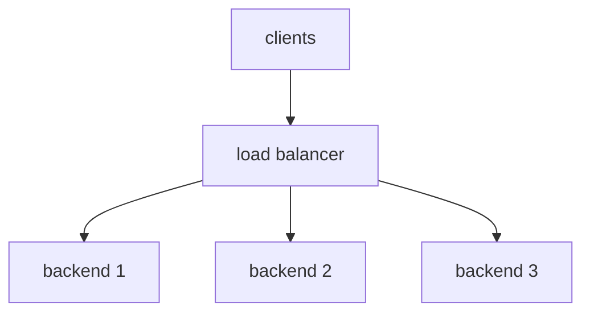
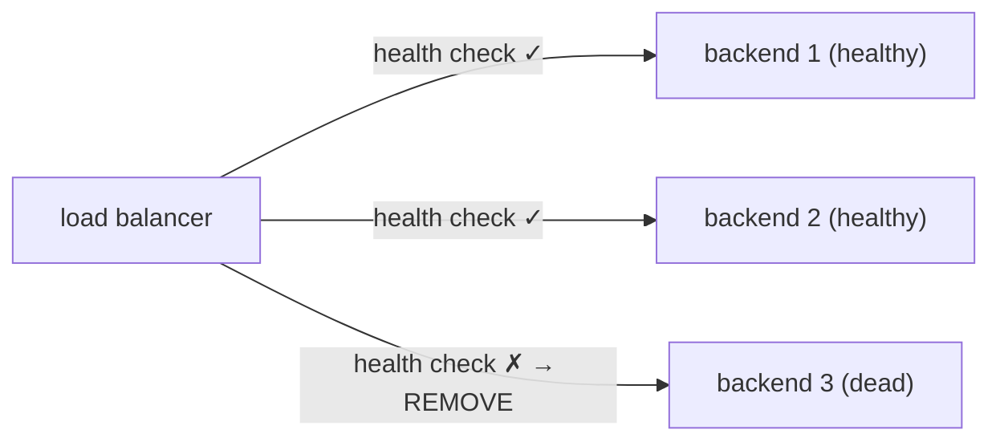
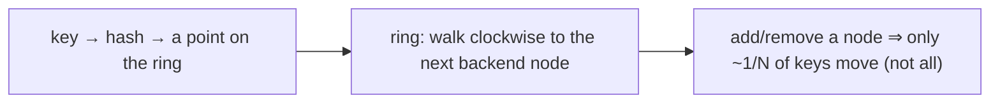

# Load balancers

One server can only handle so much load — and if it dies, your whole site goes with it. The fix is to run **many identical backend instances** and put a **load balancer (LB)** in front to spread requests across them, turning a single point of failure into a fault-tolerant, horizontally-scalable fleet. It's the reverse proxy's "load balancing" job ([T08](./T08-proxies-and-reverse-proxies.md)) examined in depth, and the enabler of the horizontal scaling that statelessness makes possible ([T07](./T07-cookies-sessions-and-tokens.md)). The design choices — **L4 vs L7**, the **balancing algorithm**, **sticky sessions**, **health checks** — shape the availability and scalability of essentially every production backend.

The depth-bar: at the **language** layer, *why* you balance, **L4 vs L7**, the **algorithms**, **sticky sessions**, **health checks**, and where LBs live. At the **architecture** layer — the heart — the **two-connection model & DSR** ([T08](./T08-proxies-and-reverse-proxies.md)), **connection-vs-request** balancing (with keep-alive / HTTP/2 — [T05](./T05-http-https-lifecycle.md)), the **stateless-backend requirement** ([T07](./T07-cookies-sessions-and-tokens.md)), the **LB as the new choke point**, and **consistent hashing**. This is the climax of the edge-infra arc that runs into CDNs ([T10](./T10-cdns.md)).

> [!NOTE]
> Prerequisites: [Proxies & reverse proxies](./T08-proxies-and-reverse-proxies.md) (L2/C03/T08) — **the LB is usually a reverse proxy; the two-connection model, L4-vs-L7, the choke-point**; [HTTP/HTTPS lifecycle](./T05-http-https-lifecycle.md) (L2/C03/T05) — **keep-alive, HTTP/2, routing**; [Cookies, sessions & tokens](./T07-cookies-sessions-and-tokens.md) (L2/C03/T07) — **sticky sessions and why statelessness matters**.

## Why a Load Balancer?

It solves two problems at once:

- **Scalability** — one server has finite capacity; run **N** instances and spread the load to handle ~N× traffic (**horizontal scaling** — [T07](./T07-cookies-sessions-and-tokens.md)).
- **Availability** — one server is a SPOF; with N instances plus **health checks**, a dying instance is simply removed from the pool — no outage. It also enables **zero-downtime deploys** (drain and replace instances one at a time).

## L4 vs L7 Load Balancing

The central axis ([T08](./T08-proxies-and-reverse-proxies.md)):

| | **L4 (transport)** | **L7 (application)** |
|---|---|---|
| **Operates on** | TCP/UDP, IP:port ([T02](./T02-tcp-vs-udp.md)) | HTTP — method, path, headers ([T05](./T05-http-https-lifecycle.md)) |
| **Inspects payload?** | no | yes |
| **Can route by** | IP:port only | path / host / header / **cookie** |
| **TLS** | passes through | can **terminate** ([T06](./T06-tls-ssl-and-certificates.md)) |
| **Balances** | a whole **connection** | each **request** |
| **Speed / cost** | very fast, cheap | more CPU, more features |
| **Example** | AWS **NLB** | AWS **ALB**, Nginx, Envoy |

The trade: **L4 = speed + simplicity + protocol-agnostic**; **L7 = intelligence + content routing + TLS + features**.

## Balancing Algorithms

How the LB picks a backend:

| Algorithm | How it chooses |
|-----------|----------------|
| **Round-robin** | rotate through backends in order (even, ignores load) |
| **Weighted round-robin** | proportional to each backend's capacity |
| **Least connections** | the backend with the fewest active connections (good for varying durations) |
| **Least response time** | the fastest-responding backend |
| **IP hash / consistent hash** | hash a key (client IP) → always the same backend (stickiness; minimal reshuffle — see architecture) |
| **Power-of-two-choices** | pick two at random, send to the less loaded (cheap, surprisingly good) |

## Sticky Sessions (Session Affinity)

The LB can route a given user to the **same** backend every time (via a cookie or IP hash), so an **in-memory session** ([T07](./T07-cookies-sessions-and-tokens.md)) on that backend stays reachable. But stickiness is a **crutch**: if that backend dies the session is gone, and you can't freely rebalance — both scaling and failover suffer. The better answer is **stateless backends** — keep session state in a **shared store** (Redis) or use **stateless tokens** (JWT — [T07](./T07-cookies-sessions-and-tokens.md)) — so **any backend can serve any request** and the LB routes freely. This is the deep tie to T07's "statelessness enables scaling."

## Health Checks & Failover

The LB continuously **probes** backends — **active** (a periodic request to `/health`) and/or **passive** (observing real request failures) — and **removes** unhealthy ones from the pool, re-adding them when they recover:

This is what turns N servers into high availability — a dead backend just stops receiving traffic, transparently to clients. **Graceful draining** on deploy (stop sending new requests, let in-flight finish, then replace) gives **zero-downtime deploys**.

## Where Load Balancers Live

- **Hardware** (F5 BIG-IP) — dedicated appliances.
- **Software** (HAProxy, Nginx, Envoy) — on commodity servers (often the same box as the reverse proxy — [T08](./T08-proxies-and-reverse-proxies.md)).
- **Cloud** (AWS ELB → **ALB** [L7], **NLB** [L4]; GCP/Azure) — managed.
- **DNS load balancing** ([T04](./T04-dns-resolution-records.md)) — multiple A records / geo-aware answers spread traffic across regions (coarse, TTL-limited, not health-aware by default).
- **Anycast** ([T04](./T04-dns-resolution-records.md)) — one IP announced from many sites; BGP routes to the nearest (global LB; CDNs use it — [T10](./T10-cdns.md)).

The real architecture is **layered**: anycast/DNS (global) → a regional LB → an L7 LB/reverse proxy → backends.

## Memory & Architecture Layer

### Two-Connection Model & DSR

An L7 LB **terminates and re-originates** connections (two connections — [T08](./T08-proxies-and-reverse-proxies.md)). An L4 LB can instead do **Direct Server Return (DSR)**: the **request** passes through the LB, but the **response goes straight from the backend to the client**, bypassing the LB. For high-throughput, asymmetric traffic (a small request, a huge download) this is a big win — the LB only handles the tiny inbound side.

### Connection vs Request Balancing

An **L4** LB pins a whole **TCP connection** to one backend; an **L7** LB can balance **each request**. This matters with **keep-alive** and **HTTP/2 multiplexing** ([T05](./T05-http-https-lifecycle.md)): under L4 + keep-alive, *all* requests on one long-lived connection land on the **same** backend (uneven load) — and HTTP/2's single connection makes this acute. If you need even per-request distribution or content routing, you need **L7**.

### The Stateless-Backend Requirement

The deep enabler: true horizontal scaling requires backends to be **stateless** (or to share state via Redis/tokens) so **any backend can serve any request** ([T07](./T07-cookies-sessions-and-tokens.md)). Sticky sessions are a workaround that re-couples a user to one backend, limiting both scaling and failover. It's the same statelessness-enables-scaling theme as HTTP ([T05](./T05-http-https-lifecycle.md)) and sessions ([T07](./T07-cookies-sessions-and-tokens.md)) — the property that makes the whole fleet elastic.

### The LB Is the New Choke Point

A load balancer **moves** the single point of failure from "the one server" to "the one LB" ([T08](./T08-proxies-and-reverse-proxies.md)). So the LB itself must be **redundant** (active-passive or active-active pairs) and scalable, usually fronted by **DNS/anycast** ([T04](./T04-dns-resolution-records.md)). You don't *remove* the choke point — you make it **highly available**.

### Consistent Hashing

The key distributed-systems idea. With plain `hash(key) % N`, adding or removing a backend (changing **N**) **reshuffles almost every key** → mass cache misses, lost sessions. **Consistent hashing** maps both keys and backends onto a ring; adding/removing a node only moves the keys **adjacent** to it (≈1/N of keys):

This is why it underpins **cache affinity** (route the same key to the same cache node — CDNs [T10](./T10-cdns.md), distributed caches) and **sharding** (forward to L4/L5). It's the difference between a node change being a blip and a node change being an outage.

### Java Angle

App instances behind an LB must be **stateless** ([T07](./T07-cookies-sessions-and-tokens.md)) — or share state (Redis) — which is the #1 requirement for them to scale. Read the **real client IP** via `X-Forwarded-For` ([T03](./T03-ip-ports-and-sockets.md)/[T08](./T08-proxies-and-reverse-proxies.md)), not the socket. Expose a **health endpoint** (Spring Boot **Actuator** `/actuator/health`) for active checks — and make it check real dependencies. And implement **graceful shutdown** (handle SIGTERM → stop accepting new requests via the readiness probe → finish in-flight → exit) so the LB drains cleanly for zero-downtime deploys.

> [!IMPORTANT]
> A load balancer makes backends **scalable** (spread load across N) and **available** (health-check out the dead) — but only if the backends are **stateless** ([T07](./T07-cookies-sessions-and-tokens.md)). **Sticky sessions are a crutch** that re-couple a user to one backend, breaking free rebalancing and failover. Make the app stateless (shared store / tokens) and the LB can route any request anywhere.

> [!WARNING]
> The load balancer is the **new single point of failure** ([T08](./T08-proxies-and-reverse-proxies.md)) — all traffic flows through it. Run it **redundantly** (active-active/active-passive, fronted by DNS/anycast — [T04](./T04-dns-resolution-records.md)); an un-redundant LB just **relocates** the outage. And make **health checks meaningful** — a `/health` that doesn't check real dependencies can mark a broken backend "healthy" and keep routing to it.

> [!TIP]
> With **L4 + keep-alive or HTTP/2** ([T05](./T05-http-https-lifecycle.md)), all requests on one long-lived connection pin to the **same** backend → uneven load. For even per-request balancing or content routing, use an **L7** LB. For high-throughput downloads, consider **DSR** (L4) so responses bypass the LB.

## Common Mistakes

### Sticky Sessions Masking Non-Stateless Backends

They hide the real problem and break on failover/scale. Make backends **stateless** ([T07](./T07-cookies-sessions-and-tokens.md)).

### No / Shallow Health Checks

No checks route traffic to dead backends; a `/health` that returns 200 without checking the DB/dependencies marks a broken instance "healthy." Probe **real** dependencies.

### The LB as an Unmonitored SPOF

All traffic flows through it — an un-redundant, unmonitored LB is a single point of failure. Make it HA ([T08](./T08-proxies-and-reverse-proxies.md)).

### Wrong Layer

L4 when you need path/cookie routing (you can't), or L7 when L4's raw speed would do. Match the layer to the need.

### Ignoring Connection-vs-Request Balancing

With keep-alive/HTTP/2 ([T05](./T05-http-https-lifecycle.md)), L4 pins the whole connection → uneven backend load. Use L7 for per-request distribution.

### No Connection Draining on Deploy

Replacing instances without draining drops in-flight requests. Use **graceful shutdown** + readiness probes.

### `hash % N` for Sharding/Cache

Changing N reshuffles everything → mass misses/loss. Use **consistent hashing**.

### Under-Provisioning / Thundering Herd

No N+1 headroom means one death overloads the rest; a cold backend after scale-up gets hammered. Provision headroom and use slow-start/warm-up.

> [!INTERVIEW]
> Load balancing is a system-design cornerstone — the strong answers nail **L4 vs L7**, the **stateless requirement**, and **consistent hashing**.
>
> 1. **Why a load balancer?** Scalability (spread load across N), availability (health-check out the dead), and zero-downtime deploys.
> 2. **L4 vs L7?** L4 forwards TCP/UDP by IP:port (fast, protocol-agnostic, pins a connection); L7 reads HTTP (route by path/host/cookie, TLS-terminate, per-request balance) — speed vs intelligence.
> 3. **Balancing algorithms?** Round-robin, weighted, least-connections, least-response-time, IP/consistent-hash, power-of-two-choices.
> 4. **Sticky sessions — what and why avoid?** The LB pins a user to one backend (for in-memory sessions — [T07](./T07-cookies-sessions-and-tokens.md)); it breaks failover/rebalancing — prefer stateless backends (shared store/tokens).
> 5. **How do health checks work?** The LB probes backends (active `/health`, passive failures) and removes unhealthy ones → failover; drain on deploy.
> 6. **What makes backends horizontally scalable?** **Statelessness** ([T07](./T07-cookies-sessions-and-tokens.md)) — any backend serves any request; sticky sessions limit it.
> 7. **Connection vs request balancing?** L4 pins a whole TCP connection (matters with keep-alive/HTTP-2 — same backend); L7 balances per request.
> 8. **What is DSR (Direct Server Return)?** An L4 technique where the **response bypasses the LB** straight to the client — for high-throughput/asymmetric traffic.
> 9. **What is consistent hashing and why?** Keys+nodes on a ring so adding/removing a node moves only ~1/N keys (vs `hash%N` reshuffling everything) — cache affinity, sharding.
> 10. **The LB as a SPOF — how to mitigate?** Redundant LBs (active-active/passive) fronted by DNS/anycast ([T04](./T04-dns-resolution-records.md)) — relocate and HA the choke point, don't pretend to remove it.
> 11. **DNS / anycast load balancing?** Multiple A records / geo answers (DNS, coarse), or one anycast IP routed to the nearest site ([T04](./T04-dns-resolution-records.md)) — global-scale LB.
> 12. **Zero-downtime deploy behind an LB?** Drain (stop new requests via readiness), finish in-flight, replace instances one at a time (graceful shutdown).

## Practice

1. **Balance across instances.** Set up HAProxy/Nginx to load-balance 2–3 Java instances; hit it and watch requests spread.
2. **Algorithms.** Compare round-robin vs least-connections under uneven load.
3. **Failover.** Kill a backend; watch the health check remove it and traffic continue.
4. **Sticky sessions.** Enable affinity with an in-memory session ([T07](./T07-cookies-sessions-and-tokens.md)); kill the sticky backend; observe the lost session — then fix with a shared store (Redis).
5. **L4 vs L7.** Configure each; show L7 routing by path and L4 just forwarding.
6. **Keep-alive pinning.** With L4 + keep-alive, observe all requests on one connection hitting the same backend.
7. **`X-Forwarded-For`.** Confirm the app reads the real client IP through the LB ([T03](./T03-ip-ports-and-sockets.md)/[T08](./T08-proxies-and-reverse-proxies.md)).
8. **Health endpoint.** Add Spring Actuator `/actuator/health`; point the LB at it; make it fail and watch removal.
9. **Graceful drain.** Send SIGTERM during load; confirm in-flight requests finish (no drops).
10. **Consistent hashing.** Implement `hash%N` vs a hash ring; add a node and count how many keys move in each.
11. **DNS LB.** Add multiple A records ([T04](./T04-dns-resolution-records.md)); observe clients spread across IPs.
12. **Power-of-two-choices.** Simulate it vs round-robin under skewed load.
13. **N+1 sizing.** Reason about capacity so one instance can die without overloading the rest.
14. **Explain it back.** For a request to your LB-fronted fleet, trace (a) **L4 vs L7** routing, (b) the **algorithm** picking a backend, (c) why the backend must be **stateless** ([T07](./T07-cookies-sessions-and-tokens.md)), (d) how a dead backend is **failed over** (health check), and (e) why the **LB itself** needs redundancy ([T08](./T08-proxies-and-reverse-proxies.md)).

## Recap

You should now be able to:

- Explain **why load balancers** exist — **scalability** (spread load across N), **availability** (health-check out the dead), and zero-downtime deploys.
- Distinguish **L4** (forwards TCP/UDP by IP:port — fast, protocol-agnostic, pins a connection) from **L7** (reads HTTP — route by path/host/cookie, TLS-terminate, balance per request) load balancing ([T08](./T08-proxies-and-reverse-proxies.md)).
- Choose a **balancing algorithm** (round-robin, weighted, least-connections, least-response-time, IP/consistent-hash, power-of-two) and understand **sticky sessions** as a crutch versus **stateless** backends ([T07](./T07-cookies-sessions-and-tokens.md)).
- Describe **health checks + failover + draining** as the availability mechanism, and where LBs live (hardware/software/cloud/**DNS**/**anycast** — [T04](./T04-dns-resolution-records.md)).
- Reason about the **architecture**: the **two-connection model & DSR**, **connection-vs-request** balancing (keep-alive/HTTP-2 — [T05](./T05-http-https-lifecycle.md)), the **stateless-backend requirement** ([T07](./T07-cookies-sessions-and-tokens.md)), the **LB as the new choke point** (redundancy + DNS/anycast), and **consistent hashing** (minimal reshuffle → cache affinity — [T10](./T10-cdns.md)).
- Run a Java fleet behind an LB — **stateless** apps, an Actuator **health** endpoint, `X-Forwarded-For` for the client IP, and **graceful shutdown** — and avoid the traps (sticky-session reliance, shallow health checks, unmonitored SPOF, wrong layer, connection pinning, no draining, `hash%N`, under-provisioning).

## Next

Continue to [CDNs](./T10-cdns.md).
