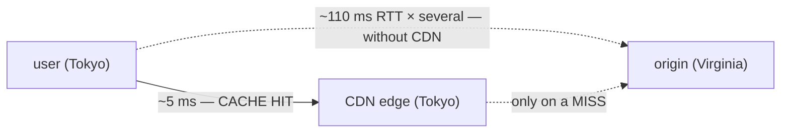
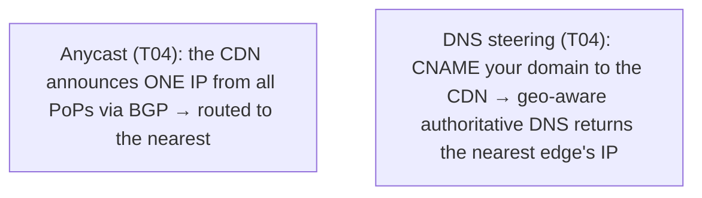
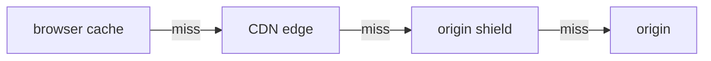

# CDNs

A user in Tokyo hitting a server in Virginia pays a brutal round-trip on *every* request — and the **speed of light** sets the floor. Distance is latency you cannot optimize away in software. A **CDN (Content Delivery Network)** is the answer: a globally-distributed network of **edge servers** that cache your content close to users, so a request is served from a nearby city instead of across an ocean. It is the **finale of the edge-infra arc** — a CDN is essentially a **globally-distributed caching reverse proxy** ([T08](./T08-proxies-and-reverse-proxies.md)) + an **anycast load balancer** ([T09](./T09-load-balancers.md)/[T04](./T04-dns-resolution-records.md)) — and it **synthesizes the whole chapter**: DNS/anycast steering ([T04](./T04-dns-resolution-records.md)), HTTP caching ([T05](./T05-http-https-lifecycle.md)), TLS termination ([T06](./T06-tls-ssl-and-certificates.md)), the reverse-proxy model ([T08](./T08-proxies-and-reverse-proxies.md)), and consistent hashing ([T09](./T09-load-balancers.md)).

The depth-bar: at the **language** layer, *why* a CDN (the latency physics), what it caches and does, how requests reach the nearest edge, and cache mechanics. At the **architecture** layer — the heart — **distance-is-latency**, the **cache hierarchy**, **cache-hit-ratio economics**, **consistent hashing** ([T09](./T09-load-balancers.md)), **push vs pull**, and **static vs dynamic**. And the Java payoff: cache headers, versioned URLs, and the one thing you must *never* cache.

> [!NOTE]
> Prerequisites: [Load balancers](./T09-load-balancers.md) (L2/C03/T09) — **anycast and consistent hashing; a CDN is a global LB + cache**; [HTTP/HTTPS lifecycle](./T05-http-https-lifecycle.md) (L2/C03/T05) — **HTTP caching (`Cache-Control`/`ETag`/304) and the RTT cost model**; [DNS](./T04-dns-resolution-records.md) (L2/C03/T04) — **anycast and geo steering route you to the nearest edge**.

## Why a CDN? Distance Is Latency

Latency is dominated by **round-trips** ([T05](./T05-http-https-lifecycle.md)), and each round-trip's floor is **distance ÷ speed of light**. Light in fibre travels ~200,000 km/s → roughly **5 ms per 1000 km** one-way, ~10 ms round-trip — and that's the *physical minimum*, before any processing. Tokyo↔Virginia is ~11,000 km → **~110 ms RTT minimum**, multiplied by the several round-trips a page needs (DNS + TCP + TLS + request — [T05](./T05-http-https-lifecycle.md)). No software trick beats it.

The *only* way to cut propagation delay is to **move the server closer**. A CDN does exactly that — **edge servers** (PoPs, Points of Presence) in hundreds of cities, serving cached content from the nearest one:

Three wins follow: **lower latency** (nearby edge), **origin offload** (the origin sees only cache misses), and **absorbing spikes/DDoS** (the distributed edge soaks up traffic).

## What a CDN Caches and Does

- **Static assets** — images, CSS, JS, video, fonts — the classic, trivially cacheable content.
- **Edge caching** of any cacheable response, honouring your HTTP cache headers ([T05](./T05-http-https-lifecycle.md) `Cache-Control`/`ETag`/`max-age`).
- **Origin offload** — the origin serves only **misses**; a 95% hit ratio means it sees 5% of traffic.
- **TLS termination at the edge** ([T06](./T06-tls-ssl-and-certificates.md)) — the handshake happens near the user, cutting the TLS round-trips too.
- **Compression / image optimization**.
- **Edge compute** — increasingly, run code at the edge (Cloudflare Workers, Lambda@Edge, Fastly Compute) for dynamic/personalized logic *without* an origin round-trip (forward to L4/L5).
- **DDoS protection + WAF** — the distributed edge absorbs attacks ([T11](./T11-firewalls-and-nat-basics.md)) and hides the origin.

## How Requests Reach the Nearest Edge

Two mechanisms ([T04](./T04-dns-resolution-records.md)), often combined:

- **Anycast** — one IP, announced everywhere, with BGP routing the user to the nearest PoP (Cloudflare's model).
- **DNS-based steering** — you `CNAME` `www.example.com` → `example.com.cdn.net`; the CDN's geo-aware DNS answers with the nearest edge's IP based on the resolver's location (Akamai's classic model).

Either way, the user transparently lands on a nearby edge.

## Cache Mechanics

- **Hit / miss / revalidation** — a **hit** serves from the edge; a **miss** fetches from the origin (and caches it); **revalidation** uses `ETag`/`If-None-Match` → **304** ([T05](./T05-http-https-lifecycle.md)) to refresh cheaply.
- **TTL** — how long the edge caches (from `Cache-Control: max-age`/`s-maxage`).
- **The cache key** — what identifies a cached object: usually the URL + a `Vary` set of headers. Varying on too many headers **fragments** the cache → a low hit ratio.
- **Invalidation** — "one of the two hard things":
  - **Purge** — explicitly evict an object. Works, but is slow, global, and rate-limited.
  - **Versioned URLs / cache-busting** — `app.[hash].js` — a new version is a **new URL** (guaranteed fresh), so the old URL can be cached **forever** (`immutable`). The preferred approach.
- **Origin shield** — a designated mid-tier cache all edges pull through, collapsing many edge misses into one origin fetch.

## Memory & Architecture Layer

### Distance Is Latency (the Physics)

To restate the core fact: **propagation delay = distance ÷ speed of light in fibre**, and you **cannot beat it in software**. You can only **shorten the distance** (a CDN) or **reduce round-trips** (keep-alive, HTTP/2-3, TLS 1.3 — [T05](./T05-http-https-lifecycle.md)/[T06](./T06-tls-ssl-and-certificates.md)). A CDN attacks the *distance* term head-on — that is the whole reason CDNs exist, and everything else (offload, DDoS absorption, edge TLS) follows from "put a caching reverse proxy near every user."

### The Cache Hierarchy

Caching is layered, and a request only falls to the next tier on a miss:

Each tier absorbs what it can ([T05](./T05-http-https-lifecycle.md)); the multi-tier hierarchy maximizes the hit ratio and minimizes origin load.

### Cache-Hit-Ratio Economics

The **hit ratio** — the fraction of requests served from the edge — is the **core CDN metric**. A higher ratio means **lower latency** (more served nearby), **less origin load** (fewer misses), and **lower cost** (less origin egress/compute). Driving it up — good cache headers, sensible cache keys, long TTLs + versioned URLs — is the central CDN optimization: going from a **95% to a 99%** hit ratio cuts origin traffic **5×** (from 5% of requests to 1%).

### Consistent Hashing

Within and across the CDN's cache nodes, objects are placed by **consistent hashing** ([T09](./T09-load-balancers.md)): a given URL maps to a specific cache node (cache **affinity**), and adding/removing a node reshuffles only ~1/N of keys rather than all of them. It's the same mechanism from load balancing, applied to **cache placement**.

### Push vs Pull, Static vs Dynamic

- **Pull** (lazy) — the edge fetches from the origin on the **first miss** and caches it. The common model: you just set headers. **Push** — you pre-upload content to the CDN (for large or predictably-hot files).
- **Static** content is trivially cacheable (long TTL + versioned URLs). **Dynamic/personalized** content (a logged-in dashboard — [T07](./T07-cookies-sessions-and-tokens.md)) is **not** cacheable at a shared edge — it needs a short TTL, a cache bypass (`private`), or **edge compute** to generate it near the user. Knowing *what is cacheable* is the key design skill.

### The Synthesis

A CDN is the convergence of the entire chapter: **anycast/DNS** ([T04](./T04-dns-resolution-records.md)) routes you to the nearest **reverse-proxy** edge ([T08](./T08-proxies-and-reverse-proxies.md)) that **load-balances** and **caches** ([T09](./T09-load-balancers.md)/[T05](./T05-http-https-lifecycle.md)) with **TLS terminated** at the edge ([T06](./T06-tls-ssl-and-certificates.md)). It is the capstone of edge infrastructure.

### Java Angle

Your origin (the Java app) controls cacheability through **HTTP headers** ([T05](./T05-http-https-lifecycle.md)): `Cache-Control: public, max-age=31536000, immutable` for versioned assets; `Cache-Control: no-store` / `private` for personalized or authenticated responses ([T07](./T07-cookies-sessions-and-tokens.md)); and `ETag` for revalidation. **Cache-bust** with versioned asset URLs (build-tool content hashing — `app.[contenthash].js`). The origin sees only **misses** and the CDN's IPs, so read the real client via **`X-Forwarded-For`** ([T08](./T08-proxies-and-reverse-proxies.md)). And the hard rule: **never** cache authenticated/personalized responses at a shared edge.

> [!IMPORTANT]
> A CDN exists to defeat **distance** — and distance is **latency you cannot optimize in software** (propagation delay = distance ÷ speed of light — [T05](./T05-http-https-lifecycle.md)). Moving cached content to an edge **near the user** is the only way to cut the propagation term. Everything else a CDN does — origin offload, DDoS absorption, TLS at the edge — follows from "put a caching reverse proxy close to every user."

> [!WARNING]
> **Never cache personalized or authenticated responses at a shared CDN edge.** A logged-in user's dashboard cached at the edge can be served to *another* user — a serious data leak. Mark such responses `Cache-Control: private` / `no-store` ([T07](./T07-cookies-sessions-and-tokens.md)) and cache only truly public, shared content. Caching personalization is the classic catastrophic CDN misconfiguration.

> [!TIP]
> Prefer **versioned URLs** (`app.[hash].js`) over **purging** for invalidation. A content hash in the filename makes a new version a *new URL* (guaranteed fresh) while the old URL can be cached **forever** (`immutable`) — no purge, no stale-asset risk. Purge is the slow, rate-limited fallback for evicting an existing URL.

## Common Mistakes

### Caching Personalized/Authenticated Content

A shared-edge cache can serve one user's private data to another — a real breach. Mark it `private`/`no-store` ([T07](./T07-cookies-sessions-and-tokens.md)).

### No Cache-Busting

Without versioned/hashed URLs, users get **stale assets** after a deploy. Hash your asset filenames.

### Wrong / Missing Cache Headers

If the origin's responses aren't cacheable, the CDN's hit ratio is ~0% and it does nothing. Set correct `Cache-Control`/`ETag` ([T05](./T05-http-https-lifecycle.md)).

### Cache-Key Explosion

Varying on too many headers (`User-Agent`, cookies) fragments the cache into near-unique keys → a low hit ratio. Vary minimally.

### Forgetting the Origin Still Needs Capacity

A CDN offloads cacheable traffic, but the origin still serves **misses** and **uncacheable/dynamic** requests. A CDN is not infinite origin protection.

### Purge as the Only Strategy

Purging is slow, global, and rate-limited. Prefer **versioned URLs**; keep purge for emergencies.

### Not Using the CDN for TLS / DDoS / Static

Leaving the origin directly exposed forgoes the edge's TLS termination, attack absorption, and static offload.

### Mis-classifying Static vs Dynamic

Treating dynamic content as cacheable (stale/leaky) — or failing to cache trivially-cacheable static. Know what's cacheable.

> [!INTERVIEW]
> CDNs are a system-design favourite — strong answers ground everything in **distance-is-latency** and the **hit ratio**, and tie it to DNS/caching/proxies.
>
> 1. **What is a CDN and why?** A geo-distributed network of edge caches serving content **near the user** → lower latency (defeat distance), origin offload, DDoS absorption.
> 2. **Why does distance matter — the physics?** Latency floor = distance ÷ speed of light (~5 ms/1000 km one-way); you can't beat propagation delay in software, only shorten distance ([T05](./T05-http-https-lifecycle.md)).
> 3. **How does a request reach the nearest edge?** **Anycast** (one IP, BGP to nearest) and/or **DNS geo-steering** (CNAME to the CDN, geo-aware answers) — [T04](./T04-dns-resolution-records.md).
> 4. **What's the cache hit ratio and why does it matter?** The fraction served from the edge; higher = lower latency + less origin load + lower cost — the core CDN metric.
> 5. **Push vs pull CDN?** Pull = edge lazily fetches from origin on first miss (common); push = pre-upload content.
> 6. **How do you invalidate CDN cache?** **Purge** (slow, explicit) or **versioned/hashed URLs** (preferred — new version = new URL, old cached forever).
> 7. **What can't you cache, and why?** Personalized/authenticated responses at a shared edge (data leak) — mark `private`/`no-store` ([T07](./T07-cookies-sessions-and-tokens.md)).
> 8. **What's the cache hierarchy?** Browser → CDN edge → origin shield → origin; each absorbs what it can, a miss falls through.
> 9. **A CDN is which pieces combined?** A globally-distributed **caching reverse proxy** ([T08](./T08-proxies-and-reverse-proxies.md)) + **anycast LB** ([T09](./T09-load-balancers.md)/[T04](./T04-dns-resolution-records.md)) with **TLS at the edge** ([T06](./T06-tls-ssl-and-certificates.md)) and **HTTP caching** ([T05](./T05-http-https-lifecycle.md)).
> 10. **How does a CDN use consistent hashing?** To map URLs to cache nodes with minimal reshuffle on node changes ([T09](./T09-load-balancers.md)) — cache affinity.
> 11. **What is edge compute?** Running code at the edge (Workers/Lambda@Edge) for dynamic/personalized logic without an origin round-trip.
> 12. **How do you make a Java app CDN-friendly?** Correct `Cache-Control`/`ETag` ([T05](./T05-http-https-lifecycle.md)), versioned asset URLs, never-cache personalized (`private`), read the client via `X-Forwarded-For` ([T08](./T08-proxies-and-reverse-proxies.md)).

## Practice

1. **Front a site.** Put a CDN (Cloudflare/Fastly free tier) in front of a site; observe the cache HIT/MISS header (`CF-Cache-Status`, `X-Cache`).
2. **Hit ratio.** Set `Cache-Control: max-age` on an asset; watch repeat requests turn into HITs.
3. **Cache-bust.** Change an asset, ship it with a new hashed URL; confirm a fresh fetch while the old URL stays cached.
4. **Distance.** Measure latency from a far-away location (a VPN / an online tool) with and without the CDN.
5. **Trace to the edge.** `traceroute`/`ping` the CDN IP; observe anycast routing you to a nearby PoP ([T04](./T04-dns-resolution-records.md)).
6. **Revalidation.** Re-request a cached object with `If-None-Match`; observe a **304** at the edge ([T05](./T05-http-https-lifecycle.md)).
7. **Never-cache personalized.** Set `Cache-Control: private`; confirm the edge doesn't cache it ([T07](./T07-cookies-sessions-and-tokens.md)).
8. **Cache key.** Add a `Vary` header; observe the hit ratio drop as the cache fragments.
9. **Origin offload.** Load-test through the CDN; confirm the origin sees only misses.
10. **Edge compute.** Deploy a hello-world Worker / Lambda@Edge that runs at the edge.
11. **Push vs pull.** Configure each for a large file; compare.
12. **Classify.** List your endpoints and decide which are cacheable (static/public) vs not (personalized/dynamic).
13. **Explain it back.** For a Tokyo user loading your Virginia-origin site via a CDN, trace (a) how **DNS/anycast** routes them to the Tokyo edge ([T04](./T04-dns-resolution-records.md)), (b) a cache **hit** served locally vs a **miss** to origin, (c) why this beats the speed-of-light RTT to Virginia ([T05](./T05-http-https-lifecycle.md)), (d) how the CDN = **reverse proxy + LB + cache** ([T08](./T08-proxies-and-reverse-proxies.md)/[T09](./T09-load-balancers.md)/[T05](./T05-http-https-lifecycle.md)), and (e) what you must **not** cache ([T07](./T07-cookies-sessions-and-tokens.md)).

## Recap

You should now be able to:

- Explain **why CDNs exist** — **distance is latency** (propagation delay = distance ÷ speed of light — [T05](./T05-http-https-lifecycle.md)); move cached content to an **edge** near the user to cut it, plus origin offload and DDoS absorption.
- Describe what a CDN **caches and does** — static assets, edge caching ([T05](./T05-http-https-lifecycle.md)), origin offload, TLS at the edge ([T06](./T06-tls-ssl-and-certificates.md)), edge compute, DDoS/WAF.
- Explain how requests reach the **nearest edge** — **anycast** and **DNS geo-steering** ([T04](./T04-dns-resolution-records.md)).
- Work the **cache mechanics** — hit/miss/revalidation (304 — [T05](./T05-http-https-lifecycle.md)), TTL, cache keys/`Vary`, and **invalidation** (purge vs **versioned URLs**), with an **origin shield**.
- Reason about the **architecture** — the **cache hierarchy** (browser → edge → shield → origin), **hit-ratio economics**, **consistent hashing** ([T09](./T09-load-balancers.md)), push vs pull, static vs dynamic, and the **CDN = reverse proxy + LB + anycast** synthesis ([T08](./T08-proxies-and-reverse-proxies.md)/[T09](./T09-load-balancers.md)/[T04](./T04-dns-resolution-records.md)).
- Make a Java app **CDN-friendly** — correct cache headers + versioned URLs + `X-Forwarded-For` — and **never** cache personalized content at a shared edge ([T07](./T07-cookies-sessions-and-tokens.md)); avoid the other traps (no cache-busting, wrong headers, cache-key explosion, purge-only, mis-classifying static/dynamic).

## Next

Continue to [Firewalls & NAT (basics)](./T11-firewalls-and-nat-basics.md).
