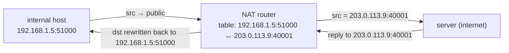

# Firewalls & NAT (basics)

Two mechanisms guard and reshape traffic at network boundaries, and you've been bumping into both all chapter without naming them. A **firewall** filters traffic by **rules** — deciding what may pass. **NAT** (Network Address Translation) rewrites **addresses** — letting many private hosts ([T03](./T03-ip-ports-and-sockets.md)) share one public IP, and, as a side effect, blocking unsolicited inbound traffic. Between them they explain a host of practical puzzles: why your app binds fine but is unreachable, why you can't connect to a private IP from outside ([T03](./T03-ip-ports-and-sockets.md)), why peer-to-peer is hard, and how a CDN absorbs a DDoS ([T10](./T10-cdns.md)). This topic **closes the networking chapter** by tying the addressing story ([T01](./T01-osi-and-tcp-ip-models.md)/[T02](./T02-tcp-vs-udp.md)/[T03](./T03-ip-ports-and-sockets.md)) to the boundary that sits between your service and the internet.

The depth-bar: at the **language** layer, firewall **types** and NAT's **what/why/how**. At the **architecture** layer — the heart — **stateful connection-tracking** (the same 4-tuple state as a TCP connection — [T02](./T02-tcp-vs-udp.md)), the **NAT table as connection state**, the **inbound-deny side effect**, and **NAT-as-accidental-firewall**. And the Java payoff: making a server reachable through NAT and a firewall.

> [!NOTE]
> Prerequisites: [IP, ports & sockets](./T03-ip-ports-and-sockets.md) (L2/C03/T03) — **private IP ranges (the NAT promised there), and `bind 0.0.0.0` vs the firewall**; [TCP vs UDP](./T02-tcp-vs-udp.md) (L2/C03/T02) — **the connection state / 4-tuple that stateful tracking and NAT use**; [Proxies & reverse proxies](./T08-proxies-and-reverse-proxies.md) (L2/C03/T08) — **the WAF as an L7 application firewall, and `X-Forwarded-For`**.

## Firewalls — Filtering Traffic

A firewall enforces **rules** that **allow** or **deny** traffic. The foundational policy choice is **default-deny** (block everything, allow only what you need — the secure posture) versus default-allow (the reverse, dangerous). Filtering applies to **ingress** (inbound) and **egress** (outbound) — egress matters too, so a compromised host can't exfiltrate freely. The types, by layer ([T01](./T01-osi-and-tcp-ip-models.md)):

| Type | Layer | How it decides |
|------|-------|----------------|
| **Packet filter / stateless** | L3/L4 | per-packet rules on IP/port/protocol, **no memory** — can't tell a reply from an unsolicited packet |
| **Stateful** | L3/L4 + tracking | tracks the **connection** (the 4-tuple / conntrack — [T02](./T02-tcp-vs-udp.md)) → **return traffic of established connections is auto-allowed** |
| **Application / L7 / WAF** | L7 | inspects the **HTTP** payload ([T05](./T05-http-https-lifecycle.md)) → blocks SQLi/XSS/malicious requests ([T08](./T08-proxies-and-reverse-proxies.md)/[T10](./T10-cdns.md)) |

Firewalls live on the **host** (iptables/nftables/ufw, Windows Firewall), as a **network** appliance, or in the cloud as **security groups** (stateful, instance-level) and **network ACLs** (stateless, subnet-level).

## NAT — Translating Addresses

**NAT** rewrites the source (and/or destination) IP:port of packets as they cross a boundary, mapping **private** addresses ([T03](./T03-ip-ports-and-sockets.md) — `10/8`, `172.16/12`, `192.168/16`) to a **public** one. It exists because of **IPv4 exhaustion** ([T03](./T03-ip-ports-and-sockets.md)): there aren't enough public IPv4 addresses for every device, so a whole network shares **one** public IP, with NAT multiplexing the hosts behind it. (IPv6's vast space largely removes the need.)

The mechanism is **PAT (Port Address Translation)**, aka "masquerading" — the NAT router keeps a **table** mapping each internal `(private IP:port)` to a `(public IP:port)`, per connection (distinguished by the **4-tuple** — [T02](./T02-tcp-vs-udp.md)):

Outbound, NAT rewrites the source to the public IP:port and **remembers** the mapping; the reply comes back to that public IP:port, the router looks up the table and rewrites the destination back to the private host.

## The Inbound Asymmetry & Its Consequences

Outbound connections work transparently (the host initiates → a table entry is created → replies flow back). But an **unsolicited inbound** packet has **no table entry**, so the router doesn't know which internal host it's for → it's **dropped**. NAT therefore **blocks inbound by default** — a firewall-*like* side effect. The consequences are everywhere:

- **Port forwarding** — to expose an internal service, you manually map a public port → an internal IP:port (a static NAT-table entry). It's why hosting a server behind a home router needs port forwarding.
- **You can't reach a private IP from outside** ([T03](./T03-ip-ports-and-sockets.md)) — the public-facing address is the NAT gateway's.
- **NAT breaks peer-to-peer** — two hosts both behind NAT can't directly connect (neither can initiate inbound to the other) → **STUN/TURN/ICE** and **hole punching** (what WebRTC/VoIP use to traverse NAT).
- **IPv6** (no NAT) restores end-to-end connectivity — but then a **real firewall** must do the inbound-blocking NAT was accidentally providing.

## Memory & Architecture Layer

### The NAT Table Is Connection State

A NAT mapping is **per-connection state** ([T02](./T02-tcp-vs-udp.md)/[T03](./T03-ip-ports-and-sockets.md)) — exactly like a stateful firewall's connection-tracking and like the TCP **TCB**: a 4-tuple entry held in the router's memory. Two architectural facts follow:

- **Entries time out.** Idle connections are evicted from the table — which is why a long-idle **keep-alive** connection ([T05](./T05-http-https-lifecycle.md)/[T02](./T02-tcp-vs-udp.md)) can silently die behind NAT unless you send **TCP keepalives** to refresh the mapping.
- **The table has a size limit.** A busy NAT gateway can run out of entries or public ports — a real scaling constraint (and the reason **CGNAT**, carrier-grade NAT, where an ISP NATs many customers behind shared IPs, is operationally painful).

A **stateful firewall** uses the *same* connection-tracking idea (Linux **conntrack**) — allowing return traffic requires remembering the connection. Many devices do both NAT and stateful filtering with one connection table.

### The Performance Cost

Every packet is checked against rules (firewall) and/or rewritten (NAT) — CPU per packet, mitigated by fast-path/hardware offload. At high throughput this is a genuine consideration (and another reason traffic is shaped at dedicated edge devices — [T08](./T08-proxies-and-reverse-proxies.md)/[T09](./T09-load-balancers.md)).

### NAT Is Not a Firewall

The most important security point: NAT's inbound-deny is a **side effect** of having no table entry, **not** a deliberate security control. NAT exists to *share an IPv4 address*; it blocks *unsolicited inbound* as a consequence, but does **nothing** about outbound threats, application-layer attacks ([T05](./T05-http-https-lifecycle.md) — that's the WAF's job), or a compromised internal host. **Don't treat "we're behind NAT" as security** — use a real firewall (default-deny) and defense in depth.

### The Synthesis

This closes the addressing story: filtering happens at **L3/L4/L7** ([T01](./T01-osi-and-tcp-ip-models.md)); NAT translates the **IPs and ports** ([T03](./T03-ip-ports-and-sockets.md)) of **private ranges**; and both stateful firewalls and NAT track the **connection-as-state** ([T02](./T02-tcp-vs-udp.md)) you met in TCP. Firewalls and NAT are the boundary between your service and the internet — the last piece of the networking picture.

### Java Angle

A server behind NAT/a firewall must be made **reachable**: **port forwarding** (home), or a **public IP** / **load balancer** ([T09](./T09-load-balancers.md)) / **reverse proxy** ([T08](./T08-proxies-and-reverse-proxies.md)) / tunnel (cloud). The two-part reachability rule ([T03](./T03-ip-ports-and-sockets.md)): the app must **bind `0.0.0.0`** (not `127.0.0.1`) **and** the firewall / security group must **allow the port** — *both* are required; binding alone is not enough. **Outbound** usually works (NAT + stateful firewalls allow established replies); **inbound** needs explicit opening. In the cloud, set the **security group** to allow the port from the right source (not `0.0.0.0/0` unless you mean it). And the real client IP behind NAT + a proxy arrives in **`X-Forwarded-For`** ([T08](./T08-proxies-and-reverse-proxies.md)).

> [!IMPORTANT]
> **NAT's inbound blocking is a side effect, not security.** NAT exists to *share an IPv4 address* ([T03](./T03-ip-ports-and-sockets.md)); dropping unsolicited inbound is a consequence of having no table entry, not a deliberate firewall. It does nothing about outbound threats, application attacks, or a compromised internal host. **Use a real firewall (default-deny) for security — never rely on "we're behind NAT."**

> [!WARNING]
> "The app is running but I can't connect" is almost always the **firewall or the bind address**, not the app ([T03](./T03-ip-ports-and-sockets.md)). Check **both**: the app must **bind `0.0.0.0`** (not loopback) **and** the firewall / cloud **security group must allow the port** from your source. Either one blocking it leaves the service unreachable while the process looks perfectly healthy.

> [!TIP]
> A **stateful** firewall (the norm) auto-allows the **return traffic** of connections *you* initiated — so **outbound** usually "just works" and only **inbound** needs explicit rules. That's why you open port 443 for an inbound web server but open nothing for the app's outbound API calls. (Tighten **egress** too in high-security environments.)

## Common Mistakes

### Relying on NAT as Security

NAT is not a firewall — inbound-deny is a side effect (see the important callout). Use a real, default-deny firewall.

### Default-Allow Firewall

Allowing everything except a deny-list is fragile. **Default-deny** and allow only what's needed.

### Forgetting Egress Filtering

Only filtering inbound lets a compromised host exfiltrate or call out freely. Filter egress in sensitive environments.

### The Bind-vs-Firewall Confusion

The app binds `0.0.0.0` but the port isn't opened (or it's bound to `127.0.0.1`) — both must be right ([T03](./T03-ip-ports-and-sockets.md)). Separate the two failure modes.

### NAT Breaking P2P Without STUN/TURN

Two NATed peers can't connect directly — WebRTC/VoIP need STUN/TURN/ICE traversal.

### Connection Timeouts Dropping Idle Keep-Alives

The NAT/stateful-firewall table evicts idle entries → a long-idle keep-alive connection dies ([T05](./T05-http-https-lifecycle.md)/[T02](./T02-tcp-vs-udp.md)). Use TCP keepalives.

### Over-Open Security Groups

`0.0.0.0/0` on a sensitive port (SSH, a database) exposes it to the world. Scope sources tightly.

### Wrong Firewall Layer

A stateless filter can't track connections; an L4 firewall can't stop SQLi — you need a **WAF** (L7) for application attacks ([T05](./T05-http-https-lifecycle.md)/[T08](./T08-proxies-and-reverse-proxies.md)).

> [!INTERVIEW]
> Firewalls/NAT round out networking interviews — the strong answers explain **stateful connection-tracking** and that **NAT is not security**.
>
> 1. **What is a firewall, and the types?** A rule-based traffic filter: **stateless** packet filter (L3/L4, per-packet), **stateful** (tracks connections — auto-allows return traffic), **L7/WAF** (inspects HTTP). **Default-deny** is the secure posture.
> 2. **Stateless vs stateful?** Stateless = per-packet, no memory; stateful = tracks the connection (4-tuple/conntrack — [T02](./T02-tcp-vs-udp.md)) → return traffic of established connections is auto-allowed.
> 3. **What is NAT and why does it exist?** Translates private IPs ([T03](./T03-ip-ports-and-sockets.md)) ↔ a shared public IP; it exists because of **IPv4 exhaustion** — many hosts share one public address.
> 4. **How does NAT work?** A table maps each internal `(IP:port)` ↔ `(public IP:port)` per connection (PAT/4-tuple — [T02](./T02-tcp-vs-udp.md)); it rewrites the source outbound and reverses it on the reply.
> 5. **Why is inbound blocked by default behind NAT?** An unsolicited inbound packet has **no table entry** → the router can't map it to an internal host → dropped. A firewall-like side effect.
> 6. **How do you expose a service behind NAT?** **Port forwarding** (a static mapping), or a public IP / LB ([T09](./T09-load-balancers.md)) / reverse proxy ([T08](./T08-proxies-and-reverse-proxies.md)) / tunnel.
> 7. **Why does NAT break P2P, and the fix?** Both peers behind NAT can't initiate inbound to each other → **STUN/TURN/ICE** hole punching (WebRTC).
> 8. **Is NAT a security feature?** **No** — inbound-deny is a side effect, not real security; use a real firewall + defense in depth.
> 9. **Security groups vs NACLs (cloud)?** Security group = **stateful**, instance-level; NACL = **stateless**, subnet-level.
> 10. **"App runs but unreachable" — what do you check?** The **bind address** (`0.0.0.0`, not `127.0.0.1` — [T03](./T03-ip-ports-and-sockets.md)) **and** the firewall/SG **allowing the port** — both are required.
> 11. **What is a WAF?** An **L7** application firewall inspecting HTTP, blocking SQLi/XSS ([T05](./T05-http-https-lifecycle.md)/[T08](./T08-proxies-and-reverse-proxies.md)) — what an L4 firewall can't do.
> 12. **Why might an idle keep-alive die behind NAT?** The NAT/stateful-firewall table entry **times out** (connection state evicted) → use TCP keepalives ([T02](./T02-tcp-vs-udp.md)/[T05](./T05-http-https-lifecycle.md)).

## Practice

1. **Firewall rules.** Write `iptables`/`ufw` rules to allow one port and deny the rest; test reachability.
2. **Stateless vs stateful.** Observe that a stateful firewall auto-allows the return traffic of an outbound connection (no explicit inbound rule needed).
3. **NAT + port forward.** Set up NAT and port forwarding on a router/host; expose an internal service; reach it from outside.
4. **Inspect the table.** Look at the NAT/conntrack table (`conntrack -L`, or a router's NAT table); see per-connection entries and timeouts.
5. **Security group.** Configure a cloud SG (allow 443 from anywhere, SSH from your IP only); test.
6. **Bind-vs-firewall.** Run a Java app bound to `127.0.0.1` (unreachable), then `0.0.0.0` (reachable only if the firewall allows) — separate the two failure modes ([T03](./T03-ip-ports-and-sockets.md)).
7. **Egress.** Block outbound to a host; observe the app's outbound call fail.
8. **WAF.** Add a rule blocking a SQLi pattern; send a malicious request; observe the block ([T05](./T05-http-https-lifecycle.md)/[T08](./T08-proxies-and-reverse-proxies.md)).
9. **P2P.** Reason why two hosts behind NAT can't connect directly; sketch STUN/TURN.
10. **Keepalive.** Set a short NAT/conntrack timeout; watch an idle connection drop; fix with TCP keepalives ([T02](./T02-tcp-vs-udp.md)/[T05](./T05-http-https-lifecycle.md)).
11. **Unreachable private IP.** Trace why a `192.168.x` address is unreachable from another network ([T03](./T03-ip-ports-and-sockets.md)).
12. **Default-deny.** Convert an allow-everything config to default-deny and reason about the posture.
13. **Explain it back.** For a Java web server on a home network, trace (a) why it binds `0.0.0.0` yet is unreachable from the internet (NAT inbound-deny + no port forward), (b) how port forwarding fixes it (a static NAT-table entry), (c) why outbound API calls work with no rule (stateful return traffic), (d) why NAT isn't security, and (e) how a cloud deploy (public IP/LB — [T09](./T09-load-balancers.md) + a security group) differs.

## Recap

You should now be able to:

- Describe a **firewall** and its types — **stateless** packet filter (L3/L4), **stateful** (connection-tracking via the 4-tuple/conntrack — [T02](./T02-tcp-vs-udp.md)), and **L7/WAF** (HTTP inspection — [T05](./T05-http-https-lifecycle.md)/[T08](./T08-proxies-and-reverse-proxies.md)) — with **default-deny** and ingress/egress filtering, plus cloud **security groups**/NACLs.
- Explain **NAT** — what it does (private ↔ public — [T03](./T03-ip-ports-and-sockets.md)), why it exists (**IPv4 exhaustion**), and how (a **per-connection table**/PAT keyed by the 4-tuple — [T02](./T02-tcp-vs-udp.md)).
- Explain the **inbound asymmetry** — unsolicited inbound has no table entry → dropped → **port forwarding** to expose a service, you can't reach a private IP from outside, and NAT **breaks P2P** (STUN/TURN).
- Reason about the **architecture**: the **NAT table as connection state** (timeouts, size limits — and idle keep-alives dying), stateful firewall = **conntrack**, and the crucial point that **NAT is not a firewall** (inbound-deny is a side effect, not security).
- Make a Java server **reachable** through NAT/a firewall — port forwarding or a public IP/LB ([T09](./T09-load-balancers.md))/reverse proxy ([T08](./T08-proxies-and-reverse-proxies.md)), **bind `0.0.0.0` AND open the port** ([T03](./T03-ip-ports-and-sockets.md)), with the real client IP via `X-Forwarded-For`.
- Avoid the traps — NAT-as-security, default-allow, no egress filtering, the bind-vs-firewall confusion, P2P without STUN/TURN, idle-connection timeouts, over-open security groups, and the wrong firewall layer.

## Next

This is the last topic of the **Networking & Web Fundamentals** chapter — which is now **complete (11/11)**. You've built the full stack: the OSI/TCP-IP models and encapsulation, TCP vs UDP, IP/ports/sockets, DNS, the HTTP/HTTPS lifecycle, TLS, cookies/sessions/tokens, and the edge-infrastructure arc (reverse proxies → load balancers → CDNs → firewalls & NAT). Continue to the next chapter, [Web & REST Basics](../C04-web-and-rest-basics/README.md).
