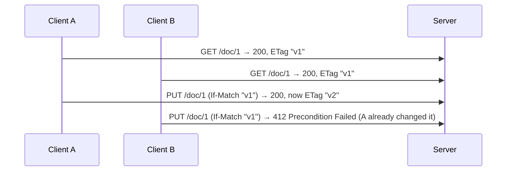
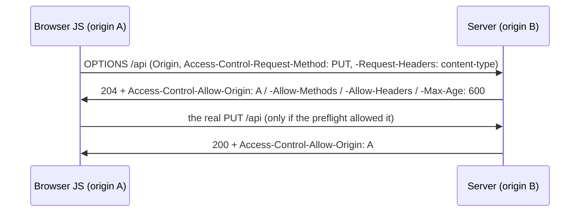

# HTTP in depth (methods, status, headers)

[C03/T05](../C03-networking-fundamentals/T05-http-https-lifecycle.md) introduced HTTP as a protocol in the network stack — the request/response model, the lifecycle, the version evolution. This topic goes **much deeper, from the API-builder's angle**: the precise **semantics** of every method (and why *safe*, *idempotent*, and *cacheable* are **contracts** the whole web infrastructure depends on), the complete **status-code** vocabulary with the distinctions that trip people up, and the **headers** — the real engine of caching, content negotiation, auth, and security. Method, status, and headers are the vocabulary you'll use to design REST APIs ([T02](./T02-rest-principles-and-best-practices.md)), shape resources ([T03](./T03-api-design-resources-versioning-pagination-filtering.md)), and negotiate formats ([T04](./T04-content-negotiation-and-serialization-json-xml-jackson.md)). Getting them exactly right is what separates a sloppy API from one that **caches correctly, retries safely, survives concurrent edits, and plays well with proxies and CDNs** ([C03/T08](../C03-networking-fundamentals/T08-proxies-and-reverse-proxies.md)–[T10](../C03-networking-fundamentals/T10-cdns.md)).

The depth-bar: at the **language** layer, the HTTP message grammar, methods, status codes, and headers in full. At the **architecture** layer — the heart — **HTTP semantics as a contract** the entire web infrastructure relies on, the **idempotency/retry** model, **conditional requests** (caching *and* optimistic concurrency with weak/strong validators), the **CORS** browser-security model, and the **message-framing security** pitfalls (request smuggling).

> [!NOTE]
> Prerequisites: [HTTP/HTTPS lifecycle](../C03-networking-fundamentals/T05-http-https-lifecycle.md) (L2/C03/T05) — **the request/response model, framing (`Content-Length`/chunked), versions, and the caching this deepens**; [Cookies, sessions & tokens](../C03-networking-fundamentals/T07-cookies-sessions-and-tokens.md) (L2/C03/T07) — **the `Authorization` header and the auth model**.

## The HTTP Message Grammar

Before the semantics, the shape. An HTTP/1.1 message is **text** ([C03/T05](../C03-networking-fundamentals/T05-http-https-lifecycle.md)) with a strict structure (RFC 9112): a **start line**, then **header fields** (one per line), then a blank line (`CRLF` — carriage-return + line-feed), then an optional **body**.

```
POST /orders HTTP/1.1                ← request line: METHOD  request-target  HTTP-version
Host: api.example.com                ← header fields (name: value), CRLF-terminated
Content-Type: application/json
Content-Length: 31
                                     ← a bare CRLF ends the header block
{"item":"book","quantity":2}         ← message body
```

The response mirrors it with a **status line** (`HTTP/1.1 201 Created`). Three details matter downstream: the line terminator is **`CRLF`** (`\r\n`), header **names are case-insensitive**, and the **blank line** is the only delimiter between headers and body — which is exactly why **message framing** (how the receiver knows where the body ends) is a security-sensitive problem (see [request smuggling](#message-framing--request-smuggling)). In HTTP/2 and HTTP/3 this text grammar is replaced by a **binary framing** layer with **pseudo-headers** (`:method`, `:path`, `:status`, `:authority`) and header compression (HPACK/QPACK), but the *semantics* below are identical across versions (RFC 9110 defines semantics once for all versions).

## Methods in Depth — Semantics as Contract

Every method carries three properties the infrastructure relies on (RFC 9110 §9):

- **Safe** — read-only; no intended side effects on the server.
- **Idempotent** — making the request N times has the same server effect as making it once (the *effect*, not necessarily the *response* — a second `DELETE` may return `404`).
- **Cacheable** — the response may be stored and reused.

| Method | Purpose | Safe | Idempotent | Cacheable | Body |
|--------|---------|:----:|:----------:|:---------:|:----:|
| **GET** | retrieve a representation | ✅ | ✅ | ✅ | no |
| **HEAD** | like GET, headers only (no body) | ✅ | ✅ | ✅ | no |
| **OPTIONS** | communicate capabilities / CORS preflight | ✅ | ✅ | ❌ | no |
| **TRACE** | loop-back diagnostic (usually disabled — XST risk) | ✅ | ✅ | ❌ | no |
| **POST** | process the enclosed entity (create / action) | ❌ | ❌ | only with explicit freshness | yes |
| **PUT** | replace the target resource with the body | ❌ | ✅ | ❌ | yes |
| **PATCH** | apply a partial modification (RFC 5789) | ❌ | not inherently | ❌ | yes |
| **DELETE** | remove the target resource | ❌ | ✅ | ❌ | optional |
| **CONNECT** | establish a tunnel (HTTPS through a proxy — [C03/T08](../C03-networking-fundamentals/T08-proxies-and-reverse-proxies.md)) | ❌ | ❌ | ❌ | — |

These are **contracts**, not trivia. A **safe** method can be prefetched, crawled, and link-previewed freely; an **idempotent** method can be **automatically retried** on a timeout by clients, proxies, and load balancers ([C03/T09](../C03-networking-fundamentals/T09-load-balancers.md)) **without harm**. The entire web depends on this — which is why a `GET` that mutates is a real bug (a prefetcher or antivirus link-scanner *will* trigger it) and why blindly retrying a `POST` risks duplicate charges.

### PUT vs POST vs PATCH

The classic confusion, resolved by the contract:

- **PUT** *replaces the entire resource* at a **known, client-chosen** URI. **Idempotent**: `PUT /users/5` with the same body twice leaves identical state. PUT can also **create** at that URI (upsert) — `201 Created` if it didn't exist, `200`/`204` if it replaced.
- **POST** *processes the body* however the server defines — usually **creating a subordinate** resource under a **collection** (`POST /users` → the server assigns `/users/42`) or running a non-CRUD action. **Not idempotent**: two `POST`s create **two** resources.
- **PATCH** applies a **partial** change. It is **not inherently idempotent** — but *can be* depending on the patch format. Two precise formats exist:
  - **JSON Merge Patch** (RFC 7386, `application/merge-patch+json`) — a sparse object; `null` deletes a field. Idempotent. (`{"email":"new@x.io"}` sets just email.)
  - **JSON Patch** (RFC 6902, `application/json-patch+json`) — an array of operations (`add`/`remove`/`replace`/`move`/`copy`/`test`). More powerful; an `add` to an array is *not* idempotent.

### Method Override & the Tunneling Anti-Pattern

Some clients/proxies can't send `PUT`/`DELETE`, so frameworks accept an `X-HTTP-Method-Override` header or `_method` field. Useful pragmatically, but **tunneling everything through `POST`** (a single `/api` endpoint with the verb in the body) throws away every property above — it's RPC, not HTTP, and the infrastructure can no longer cache, retry, or reason about it.

### Idempotency Keys

Networks deliver **at-least-once** (they retry), but `POST` isn't idempotent — so how do you make "charge the card" safe to resend? An **idempotency key**: the client sends a unique `Idempotency-Key` header; the server records the key with the result of the first execution and, on a retry with the same key, returns the **stored** result instead of executing again. (Stripe's well-known pattern; keys are typically scoped per-endpoint and expire after 24h.) It's the engineering bridge between unreliable networks and non-idempotent operations.

## Status Codes in Depth

Five families (RFC 9110 §15), with the codes that matter and the distinctions that trip people up.

### 1xx Informational

- **100 Continue** — paired with `Expect: 100-continue`: the client asks permission *before* streaming a large body; the server replies `100` to proceed or `417`/an error to abort, avoiding a wasted upload.
- **101 Switching Protocols** — the handshake for **WebSocket** upgrades.

### 2xx Success

- **200 OK** — the generic success (with a body).
- **201 Created** — a new resource exists; **must** include a `Location` header pointing to it (and usually the representation).
- **202 Accepted** — the request was accepted for **async** processing but isn't done; pair with a status resource to poll ([T03](./T03-api-design-resources-versioning-pagination-filtering.md)).
- **204 No Content** — success with **no body** (a typical `DELETE` or a `PUT` that returns nothing).
- **206 Partial Content** — the response to a successful **`Range`** request (resumable downloads, video seeking).

### 3xx Redirection

The redirect codes differ in **permanence** and **method preservation** — the latter is the gotcha:

| Code | Permanent? | Method on redirect |
|------|:---:|---|
| **301** Moved Permanently | yes | historically may change `POST`→`GET` |
| **302** Found | no | historically may change `POST`→`GET` |
| **303** See Other | no | **always** switch to `GET` (the POST-redirect-GET pattern) |
| **307** Temporary Redirect | no | **preserve** the original method + body |
| **308** Permanent Redirect | yes | **preserve** the original method + body |
| **304** Not Modified | — | conditional GET — "use your cache" (no body) |

Use **307/308** when you must keep a `POST`/`PUT`; **303** to redirect after a form `POST` to a confirmation page.

### 4xx Client Error

- **400 Bad Request** — malformed syntax the server can't parse.
- **401 Unauthorized** — *not authenticated* (despite the name). Must include a `WWW-Authenticate` challenge. Re-authenticating may fix it.
- **403 Forbidden** — *authenticated but not authorized*. Re-authenticating won't help.
- **404 Not Found** — no such resource (also used to hide existence from unauthorized users).
- **405 Method Not Allowed** — the resource exists but not for this method; **must** list valid ones in `Allow`.
- **406 Not Acceptable** — can't produce any representation the `Accept` header permits ([T04](./T04-content-negotiation-and-serialization-json-xml-jackson.md)).
- **409 Conflict** — the request conflicts with current state (e.g. a version mismatch, a duplicate).
- **410 Gone** — like 404 but *intentionally permanent* (the resource was deleted and won't return).
- **412 Precondition Failed** — a conditional header (`If-Match`/`If-Unmodified-Since`) failed → **optimistic concurrency** (below).
- **415 Unsupported Media Type** — the request's `Content-Type` isn't one the server accepts.
- **422 Unprocessable Content** — syntactically valid but **semantically** invalid (validation errors); the common choice for failed business-rule validation.
- **428 Precondition Required** — the server demands a conditional request (forces clients to use `If-Match`, preventing lost updates).
- **429 Too Many Requests** — rate-limited; include `Retry-After`.
- **451 Unavailable For Legal Reasons** — blocked by law.

**401 vs 403** is the perennial interview question: **401 = authentication** (*who are you?*), **403 = authorization** (*I know who you are, and you may not*).

### 5xx Server Error

- **500 Internal Server Error** — an unhandled server fault (the catch-all; don't leak stack traces).
- **501 Not Implemented** — the method isn't supported at all.
- **502 Bad Gateway** — a proxy/gateway ([C03/T08](../C03-networking-fundamentals/T08-proxies-and-reverse-proxies.md)) got an invalid response from upstream.
- **503 Service Unavailable** — temporarily down/overloaded; include `Retry-After`. (What a load balancer returns when no backend is healthy — [C03/T09](../C03-networking-fundamentals/T09-load-balancers.md).)
- **504 Gateway Timeout** — the upstream didn't respond in time.

The distinction matters operationally: a **502/504** points at the *upstream/network*, a **503** at *capacity*, a **500** at a *bug* — and monitoring/alerting/retry logic branches on exactly this.

## Headers in Depth

Headers are the metadata that drives caching, negotiation, auth, framing, and security. RFC 9110 groups fields by role; the ones you must know:

### Framing & Content

- **`Host`** (required in 1.1) — names the target host so one IP serves many sites (virtual hosting; the analog of TLS SNI — [C03/T06](../C03-networking-fundamentals/T06-tls-ssl-and-certificates.md)). Trusting it blindly enables Host-header attacks.
- **`Content-Type`** — the media type, e.g. `application/json; charset=utf-8`. The structure is `type/subtype` + optional `; parameter=value`; the `+suffix` convention marks structured types (`application/problem+json`, `application/vnd.api.v1+json`).
- **`Content-Length`** vs **`Transfer-Encoding: chunked`** — the two ways to frame a body ([C03/T05](../C03-networking-fundamentals/T05-http-https-lifecycle.md)). Exactly one should apply; sending both (or disagreeing values across a proxy chain) is the root of **request smuggling**.
- **`Content-Encoding`** — `gzip`/`br`/`deflate` compression applied to the body (negotiated via `Accept-Encoding`); typically shrinks JSON ~70%.

### Content Negotiation

- **`Accept`**, **`Accept-Encoding`**, **`Accept-Language`** — the client's ranked preferences, with **quality values** (`Accept: application/json;q=0.9, text/*;q=0.1`); the server picks and echoes `Content-Type`/`Content-Encoding`/`Content-Language` ([T04](./T04-content-negotiation-and-serialization-json-xml-jackson.md)).

### Caching

The `Cache-Control` directive set (RFC 9111) is the real caching contract:

| Directive | Meaning |
|-----------|---------|
| `max-age=N` | fresh for N seconds (overrides `Expires`) |
| `s-maxage=N` | `max-age` for **shared** caches (CDNs/proxies — [C03/T10](../C03-networking-fundamentals/T10-cdns.md)) |
| `no-cache` | may store, but **must revalidate** before reuse |
| `no-store` | never store (for sensitive/personalized data) |
| `private` | only the **browser** may cache, not shared caches |
| `public` | any cache may store |
| `must-revalidate` | once stale, do not serve without revalidating |
| `immutable` | won't change for its lifetime (versioned assets — [T03](./T03-api-design-resources-versioning-pagination-filtering.md)) |
| `stale-while-revalidate=N` | serve stale up to N s while refreshing in the background |

- **`ETag`** — an opaque content fingerprint; **strong** (`"abc"`, byte-identical) vs **weak** (`W/"abc"`, semantically equivalent). Drives revalidation and optimistic concurrency.
- **`Vary`** — names the request headers a cached response **depends on** (e.g. `Vary: Accept-Encoding, Accept-Language`). It's part of the **cache key** ([C03/T10](../C03-networking-fundamentals/T10-cdns.md)) — `Vary: *` or varying on volatile headers (cookies, User-Agent) destroys the hit ratio.
- **`Age`**, **`Expires`**, **`Last-Modified`** — supporting freshness fields (`Cache-Control` takes precedence over `Expires`).

### Auth, Rate-Limiting, Forwarding

- **`Authorization`** — the credential, by scheme: `Bearer <token>` (OAuth/JWT — [C03/T07](../C03-networking-fundamentals/T07-cookies-sessions-and-tokens.md)), `Basic <base64>`, `Digest`. The 401 response advertises the scheme via **`WWW-Authenticate`**.
- **`Retry-After`** — seconds (or a date) to wait, on `429`/`503`.
- **`X-Forwarded-For`/`-Proto`/`-Host`** — the real client behind a proxy ([C03/T08](../C03-networking-fundamentals/T08-proxies-and-reverse-proxies.md)); the standardized successor is **`Forwarded`** (RFC 7239). Note the **`X-` prefix is deprecated** (RFC 6648) — don't mint new `X-` headers.

## Conditional Requests — Caching *and* Concurrency

A conditional request carries a **validator** — an `ETag` (preferred) or `Last-Modified` date — plus an `If-*` precondition. The same machinery serves two ends:

- **Caching revalidation** — `If-None-Match: "etag"` (or `If-Modified-Since`) → **304 Not Modified** if unchanged: the cache's copy is reused, the body is *not* re-sent ([C03/T05](../C03-networking-fundamentals/T05-http-https-lifecycle.md)/[T10](../C03-networking-fundamentals/T10-cdns.md)). This is a pure bandwidth/latency win.
- **Optimistic concurrency** — `If-Match: "etag"` on a `PUT`/`PATCH`: apply the write **only if** the resource still matches the version the client read; otherwise **412 Precondition Failed**. This prevents the **lost-update problem** (two people editing the same record), with **no locks held** between read and write:



The full `If-*` family: `If-Match`, `If-None-Match`, `If-Modified-Since`, `If-Unmodified-Since`, and **`If-Range`** (resume a download only if the resource hasn't changed, else re-fetch whole). **Strong** validators are required for `Range`/`If-Match`; **weak** ones suffice for cache revalidation.

## CORS — the Browser Security Model

Browsers enforce the **same-origin policy**: JavaScript may not *read* a response from a different **origin** (scheme + host + port) by default — the boundary that stops `evil.com`'s script from reading your bank's API using your ambient cookies. **CORS** (Cross-Origin Resource Sharing, the Fetch standard) is how a server **opts in** to cross-origin reads. Requests split into two classes:

- **Simple requests** — method `GET`/`HEAD`/`POST`, only "CORS-safelisted" headers, and `Content-Type` ∈ {`text/plain`, `application/x-www-form-urlencoded`, `multipart/form-data`}. These go straight out; the browser just checks the response's `Access-Control-Allow-Origin`.
- **Preflighted requests** — anything else (`PUT`/`DELETE`/`PATCH`, a JSON `Content-Type`, custom headers like `Authorization`). The browser first sends an **`OPTIONS` preflight**:



Key response headers: `Access-Control-Allow-Origin` (an exact origin or `*`), `-Allow-Methods`, `-Allow-Headers`, **`-Allow-Credentials: true`** (to permit cookies — and then `Allow-Origin` **must not be `*`**), `-Max-Age` (cache the preflight), and `-Expose-Headers` (which response headers JS may read). The crucial clarifications: CORS is enforced **by the browser**, affects **only browser JavaScript** (`curl`, server-to-server, and mobile apps ignore it entirely), and is a mechanism the server uses to **relax** the same-origin policy — **it is not server-side access control** (it doesn't stop a request from *reaching* your server, only stops a browser from letting a script *read* the response).

## Memory & Architecture Layer

### HTTP Semantics as a Contract

The unifying idea: HTTP's method/status/header semantics are a **shared contract** the entire web infrastructure relies on — which is *why* getting them right matters far beyond your own code.

- **Caches & CDNs** ([C03/T10](../C03-networking-fundamentals/T10-cdns.md)) store `GET`/`HEAD` responses keyed by **URL + `Vary` headers**, with freshness from **`Cache-Control`/`ETag`**. A wrong method or a missing `Cache-Control` means *nothing caches* — or, worse, an error gets cached and served to everyone.
- **Proxies & load balancers** ([C03/T08](../C03-networking-fundamentals/T08-proxies-and-reverse-proxies.md)/[T09](../C03-networking-fundamentals/T09-load-balancers.md)) route, retry, and health-check on **method/status**; **idempotency** decides what's safe to retry on a timeout.
- **Clients** branch on **status families** (retry 5xx, fix 4xx) and rely on **safe/idempotent** for retries and prefetch.

So a non-idempotent `GET`, a `200`-for-an-error, or a missing `Cache-Control` isn't merely untidy — it makes the infrastructure **misbehave**: a CDN caching a failure, a proxy double-submitting a payment, a monitor blind to an outage. **The semantics *are* the API.** This is the same reasoning ([T02](./T02-rest-principles-and-best-practices.md)) that lets a generic cache/proxy handle *any* HTTP API without knowing its domain.

### Idempotency, Retries & Exactly-Once

Networks are **at-least-once** by nature: a client that times out can't tell whether the request was lost *before* or *after* the server processed it, so it retries. With **idempotent** methods that's safe; with non-idempotent ones (`POST`) a retry may duplicate the effect. **Idempotency keys** turn at-least-once delivery into **effectively-once** processing by deduplicating on the key — the same reliability reasoning that pervades distributed systems (forward to L4/L5).

### Correct Headers Are a Performance Lever

The HTTP cost model ([C03/T05](../C03-networking-fundamentals/T05-http-https-lifecycle.md)) is dominated by round-trips and bytes. Conditional requests (`304`) avoid re-sending a body; `Cache-Control: immutable` + versioned URLs ([T03](./T03-api-design-resources-versioning-pagination-filtering.md)) eliminate revalidation entirely; `Content-Encoding: gzip` cuts payload ~70%; `stale-while-revalidate` hides refresh latency. Getting the headers right is one of the cheapest, highest-leverage performance wins there is.

### Message Framing & Request Smuggling

Because a body is delimited by **either** `Content-Length` **or** `Transfer-Encoding: chunked`, a chain of intermediaries that *disagree* about which to honour can be tricked into splitting one TCP byte-stream into different request boundaries — **HTTP request smuggling** (CL.TE / TE.CL desync), which lets an attacker prepend a hidden request to the next user's. The defenses are exactly the framing rules: never send both headers, reject ambiguous messages, and prefer HTTP/2's unambiguous binary framing. (The same "a stream isn't messages" lesson from [C03/T02](../C03-networking-fundamentals/T02-tcp-vs-udp.md) — framing is security-critical.) Related: **response splitting** (unescaped `CRLF` in a header value injecting fake headers) and **Host-header injection**.

> [!IMPORTANT]
> HTTP's method/status/header **semantics are a contract** the whole infrastructure depends on — caches and CDNs ([C03/T10](../C03-networking-fundamentals/T10-cdns.md)), proxies and load balancers ([C03/T08](../C03-networking-fundamentals/T08-proxies-and-reverse-proxies.md)/[T09](../C03-networking-fundamentals/T09-load-balancers.md)), and clients all branch on them. A non-idempotent `GET`, a `200` for an error, or a missing `Cache-Control` doesn't just read badly — it makes the infrastructure *misbehave*. Use the correct method, status, and headers because **the semantics ARE the API**.

> [!WARNING]
> **Never use `GET` for a mutation, and never trust the `Host`/`X-Forwarded-For` headers blindly.** Prefetchers, crawlers, and antivirus link-scanners issue `GET`s freely, so `GET /delete?id=5` can fire with nobody clicking — mutations are `POST`/`PUT`/`PATCH`/`DELETE`. And `Host`/`X-Forwarded-For` are attacker-controllable: use them for routing only behind a trusted proxy that overwrites them ([C03/T08](../C03-networking-fundamentals/T08-proxies-and-reverse-proxies.md)), never as a security input.

> [!TIP]
> Make `POST` **safely retriable** with an **`Idempotency-Key`** (the server dedupes, so a retried "charge the card" doesn't double-charge), and use **conditional requests** (`If-Match` + `ETag`) for **optimistic concurrency** so two simultaneous edits yield a **412** instead of a silent lost update. For caching, pair a content-hashed URL ([T03](./T03-api-design-resources-versioning-pagination-filtering.md)) with `Cache-Control: public, max-age=31536000, immutable` to make an asset cache forever with zero revalidation.

## Common Mistakes

### `GET` for Mutations / Non-Idempotent `GET`

Prefetch, crawl, link-preview, and retry will trigger it. Mutations use `POST`/`PUT`/`PATCH`/`DELETE` (see the warning).

### `200` for Everything

Returning success for errors breaks client branching, monitoring/alerting, and caching. Use the correct status family, and distinguish `400`/`401`/`403`/`404`/`409`/`422`.

### 401 vs 403 (and 404-as-403)

401 = authentication, 403 = authorization. (Some APIs deliberately return `404` instead of `403` to avoid revealing a resource's existence — a valid choice, but be deliberate.)

### PUT/POST/PATCH Misuse

`PUT` should be an **idempotent** full-replace at a known URI; `POST` creates/acts non-idempotently; `PATCH`'s idempotency depends on the patch format (RFC 7386 vs 6902). Misuse breaks retry-safety.

### No Idempotency Keys on `POST`

A network retry of a non-idempotent `POST` duplicates the charge/order. Add an `Idempotency-Key` to payment-like endpoints.

### Wrong / Missing Cache Headers and `Vary`

No `Cache-Control`/`ETag` → uncacheable (slow) or stale; varying on volatile headers (cookies, `User-Agent`) fragments the cache key and kills the hit ratio ([C03/T10](../C03-networking-fundamentals/T10-cdns.md)).

### CORS Misunderstanding

Treating CORS as server-side security (it's **browser-enforced, browser-only**), or combining `Access-Control-Allow-Origin: *` with `Allow-Credentials: true` (forbidden — the browser rejects it). CORS *relaxes* the same-origin policy; it doesn't authorize requests.

### Sending Both `Content-Length` and `Transfer-Encoding`

Ambiguous framing → **request smuggling** across a proxy chain. Send exactly one; reject messages with both.

### Ignoring Conditional Requests

No `If-Match` → **lost updates** (no optimistic concurrency); no `If-None-Match`/`ETag` → wasted bandwidth (no `304`).

> [!INTERVIEW]
> This is the bread-and-butter of API/backend interviews — strong answers tie the **semantics to the infrastructure** (retries, caching, CORS, smuggling).
>
> 1. **HTTP methods + safe/idempotent/cacheable?** GET/HEAD/OPTIONS safe; GET/HEAD/PUT/DELETE/OPTIONS idempotent; GET/HEAD cacheable. The properties enable retries, caching, and prefetch.
> 2. **PUT vs POST vs PATCH?** PUT = idempotent full-replace at a known URI (can upsert → 201); POST = create-under-collection / non-idempotent action; PATCH = partial, idempotent only for merge-patch (RFC 7386) not arbitrary json-patch (RFC 6902).
> 3. **How do you make `POST` retriable?** An `Idempotency-Key` header + server-side dedupe → at-least-once becomes effectively-once.
> 4. **401 vs 403?** 401 = not authenticated (+`WWW-Authenticate`); 403 = authenticated but not authorized.
> 5. **301 vs 302 vs 307 vs 308?** Permanent vs temporary, and method-changing (301/302/303) vs method-preserving (307/308). 303 forces GET (POST-redirect-GET).
> 6. **502 vs 503 vs 504?** Bad upstream response / no capacity (overloaded) / upstream timeout — they point at different failures.
> 7. **What's in `Cache-Control`, and what is `Vary`?** `max-age`/`s-maxage`/`no-cache`/`no-store`/`private`/`immutable`/`stale-while-revalidate`; `Vary` names the request headers the cached response depends on (part of the cache key).
> 8. **Strong vs weak `ETag`, and a use beyond caching?** Strong = byte-identical, weak (`W/`) = semantically equal; `If-Match` → **optimistic concurrency** (412 prevents lost updates).
> 9. **What is CORS — is it server security?** A browser opt-in for cross-origin **reads** under the same-origin policy; browser-enforced, browser-only — **not** server-side access control.
> 10. **Simple vs preflighted CORS request?** Simple = GET/HEAD/POST + safelisted headers + form/text content-type; otherwise a preflight `OPTIONS` negotiates allowed methods/headers.
> 11. **What is HTTP request smuggling?** A CL/TE framing disagreement across proxies lets an attacker desync request boundaries and inject a request — prevent with unambiguous framing.
> 12. **`Content-Length` vs `Transfer-Encoding: chunked`?** The two body-framing mechanisms; exactly one applies; chunked streams unknown-length bodies as length-prefixed chunks ([C03/T05](../C03-networking-fundamentals/T05-http-https-lifecycle.md)).
> 13. **What does `429` + `Retry-After` mean?** Rate-limited — wait the indicated time before retrying.
> 14. **How do idempotency + retries relate to "exactly-once"?** Networks are at-least-once; idempotent ops are retry-safe; idempotency keys give effectively-once for non-idempotent ops.

## Practice

1. **Inspect a message.** With `curl -v`, capture a full request + response; identify the request line, headers, the blank-line delimiter, and the body framing (`Content-Length` vs `chunked`).
2. **Methods.** Issue every method against a test API; observe status, `Allow` on a 405, and `Location` on a 201.
3. **Idempotency.** `PUT` the same body twice (same result) vs `POST` twice (two resources); then add an `Idempotency-Key` and confirm a retried `POST` doesn't duplicate.
4. **PATCH formats.** Apply a JSON Merge Patch (RFC 7386) and a JSON Patch (RFC 6902) to the same resource; show which is idempotent.
5. **Redirects.** Trigger 301/303/307; observe which preserve the method/body and which switch to `GET`.
6. **401 vs 403.** Trigger each (no auth vs wrong role); read `WWW-Authenticate`.
7. **304.** Use `ETag` + `If-None-Match`; observe a 304 with no body; measure the bytes saved.
8. **Optimistic concurrency.** Two clients `PUT` with `If-Match`; the stale one gets **412**.
9. **Cache directives.** Set `Cache-Control: public, max-age=…, immutable` vs `no-store`; watch a CDN/proxy cache or refuse ([C03/T10](../C03-networking-fundamentals/T10-cdns.md)); add a `Vary` and observe the cache key change.
10. **Content negotiation.** Send different `Accept`/`Accept-Encoding`; observe `Content-Type`/`Content-Encoding`; trigger a `406`.
11. **CORS.** From browser JS, call a cross-origin API; observe the block, then the preflight `OPTIONS` and the `Access-Control-Allow-*` fix; confirm `curl` ignores CORS; then try `Allow-Origin: *` + credentials and see the browser reject it.
12. **Range.** Request a byte range; observe **206** + `Content-Range` + `Accept-Ranges`.
13. **Rate limit.** Exceed a limit; read `429` + `Retry-After`.
14. **Smuggling (sandbox).** Send a request with **both** `Content-Length` and `Transfer-Encoding`; observe how a compliant server rejects it, and read up on a CL.TE desync.
15. **Status discipline.** For create / validation-error / not-found / gone / conflict / rate-limited / upstream-timeout, choose the single most specific status.
16. **Explain it back.** For `PUT /users/5` with `If-Match` and an `Idempotency-Key`, trace (a) the method's idempotency contract, (b) why `If-Match` prevents a lost update (412), (c) the status on success/conflict/not-found, (d) which infrastructure (cache/proxy/CDN) relies on each header, and (e) why `GET` would be wrong here.

## Recap

You should now be able to:

- Read the **HTTP message grammar** (start line, headers, `CRLF` delimiter, body) and explain why **framing** (`Content-Length`/chunked) is security-critical.
- Use HTTP **methods** with their **safe/idempotent/cacheable** semantics as **contracts** — distinguish **PUT** (idempotent full-replace/upsert), **POST** (create/act), and **PATCH** (partial, RFC 7386 merge vs RFC 6902 json-patch) — and make `POST` retriable with **idempotency keys**.
- Choose the right **status code** from the full vocabulary — the **401/403**, **301/302/303/307/308**, **409/410/412/422/428/429**, and **500/502/503/504** distinctions — and explain why correct codes matter to caches, proxies, LBs, clients, and monitoring.
- Wield the **headers** that drive framing/content, **caching** (`Cache-Control` directives, `ETag` weak/strong, `Vary`), negotiation, auth, and forwarding — and know the deprecated-`X-` and `Forwarded` conventions.
- Apply **conditional requests** for both **caching** (`If-None-Match` → 304) and **optimistic concurrency** (`If-Match` → 412, preventing lost updates with no locks).
- Explain **CORS** — the same-origin policy, simple vs preflighted requests, the `Access-Control-*` headers, the credentials/wildcard rule — and that it's **browser-enforced and browser-only**, *not* server-side security.
- Reason about the **architecture**: HTTP semantics as a **contract** the whole infrastructure ([C03/T08](../C03-networking-fundamentals/T08-proxies-and-reverse-proxies.md)–[T10](../C03-networking-fundamentals/T10-cdns.md)) relies on, the **idempotency/retry → effectively-once** model, correct headers as a **performance lever** ([C03/T05](../C03-networking-fundamentals/T05-http-https-lifecycle.md)), and **request smuggling** as a framing-security hazard — and avoid the traps (GET-mutations, 200-for-errors, 401/403 confusion, no idempotency keys, bad `Vary`, CORS-as-security, dual framing headers, ignored conditionals).

## Next

Continue to [REST principles & best practices](./T02-rest-principles-and-best-practices.md).
