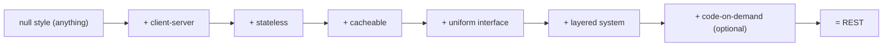
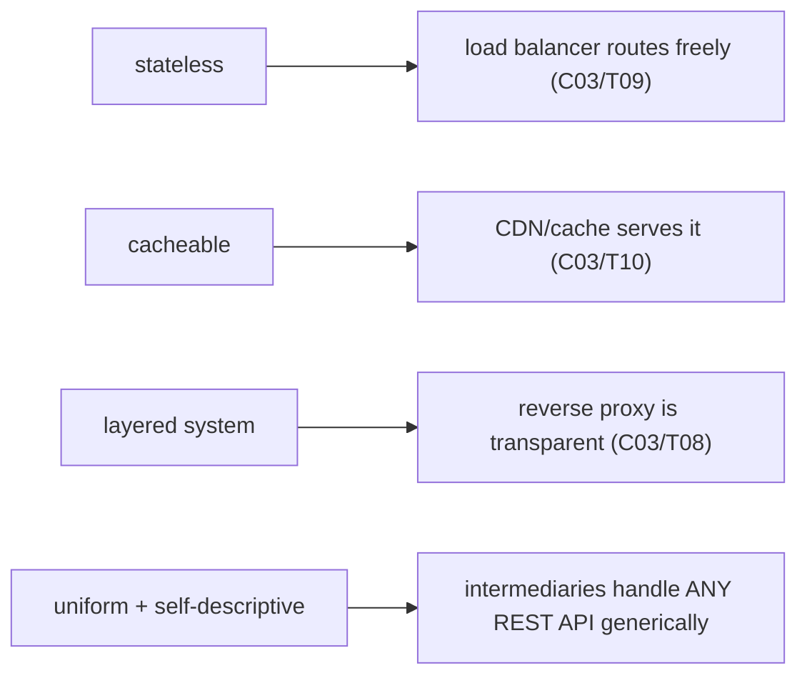

# REST principles & best practices

[T01](./T01-http-in-depth-methods-status-headers.md) gave you the HTTP vocabulary — methods, status codes, headers. **REST** is the architectural **style** that wields that vocabulary to build APIs which scale to the whole web. **REST** (Representational State Transfer) is Roy Fielding's 2000 PhD dissertation (Chapter 5) describing *why the web itself* scales to billions of users and evolves for decades without coordinated upgrades — and applying the same **constraints** to your API earns the same properties: **scalable**, **cacheable**, **evolvable**, **visible** to intermediaries, and compatible with all the infrastructure you built in C03 (proxies, load balancers, CDNs). Crucially, REST is a **style, not a protocol or standard** — there's no "REST spec" to validate against, so "RESTful" is a *spectrum*, and most real APIs sit pragmatically in the middle of it.

The depth-bar: at the **language** layer, **how Fielding *derives* REST** by adding constraints (and what each costs), the **uniform interface** in full, the **resource/representation** model, **HATEOAS** and its real hypermedia formats, the **Richardson Maturity Model**, and **REST vs RPC vs GraphQL**. At the **architecture** layer — the heart — **statelessness as the scaling property**, the **uniform interface as a decoupling contract**, the **trade-offs** each constraint makes, and how REST's constraints **map directly onto the C03 infrastructure**.

> [!NOTE]
> Prerequisites: [HTTP in depth](./T01-http-in-depth-methods-status-headers.md) (L2/C04/T01) — **REST's verbs (methods), status codes, caching headers, and the idempotency contract**; [HTTP/HTTPS lifecycle](../C03-networking-fundamentals/T05-http-https-lifecycle.md) (L2/C03/T05) — **HTTP statelessness, a REST constraint**; [Cookies, sessions & tokens](../C03-networking-fundamentals/T07-cookies-sessions-and-tokens.md) (L2/C03/T07) — **stateless auth via tokens**.

## What Is REST — and How It's Derived

REST is an **architectural style**: a named, coordinated set of **architectural constraints**. It is **not** a protocol, a standard, or a format — there is no document that says "this is REST" the way RFC 9110 *is* HTTP. An API is *RESTful to the degree* it honours the constraints.

Fielding's method is the part most people miss: he **derives** REST by starting from the **"null style"** (no constraints — anything goes) and **adding one constraint at a time**, each chosen to induce a desirable **architectural property** while accepting a trade-off. That framing is the key insight — *every constraint buys a property and costs something* — and it's why REST is a coherent design rather than a grab-bag of rules. The properties REST is built to maximize: **scalability**, **performance** (especially network efficiency and perceived latency via caching), **simplicity** of the uniform interface, **modifiability** (evolve components independently), **visibility** (intermediaries can understand interactions), **portability**, and **reliability**.

## The Six Constraints — Each Property, Each Cost



1. **Client–server** — separate the **user interface** from **data storage** behind a uniform interface. *Property:* portability of the UI and independent evolution of both halves (separation of concerns). *Cost:* the overhead of a network boundary.
2. **Stateless** — each request must contain **all** the information needed to understand it; the server keeps **no client session state** between requests ([C03/T05](../C03-networking-fundamentals/T05-http-https-lifecycle.md)/[T07](../C03-networking-fundamentals/T07-cookies-sessions-and-tokens.md)). *Property:* **visibility** (a monitor sees one request and understands it), **reliability** (recover from partial failures), and **scalability** (the server frees resources between requests, and **any** server can handle **any** request — [C03/T09](../C03-networking-fundamentals/T09-load-balancers.md)). *Cost:* network performance — the same context (auth, etc.) is re-sent on every request, so requests are bigger.
3. **Cacheable** — every response must label itself **cacheable or not** (the `Cache-Control`/`ETag` machinery — [T01](./T01-http-in-depth-methods-status-headers.md)). *Property:* efficiency, scalability, and perceived performance (eliminate round-trips — CDNs/[C03/T10](../C03-networking-fundamentals/T10-cdns.md)). *Cost:* the risk of serving **stale** data.
4. **Uniform interface** — the central constraint (next section): one **generic** interface between components. *Property:* simplicity and visibility; components evolve independently. *Cost:* efficiency — information is transferred in a **standardized** form rather than one tailored to the application's needs.
5. **Layered system** — compose the architecture as **hierarchical layers**, each unable to "see" past the next ([C03/T08](../C03-networking-fundamentals/T08-proxies-and-reverse-proxies.md)–[T10](../C03-networking-fundamentals/T10-cdns.md)). *Property:* you can insert proxies, gateways, shared caches, and load balancers **transparently**; encapsulation. *Cost:* added latency from the extra hops.
6. **Code-on-demand** (optional) — the server may send **executable code** (JavaScript) to extend the client. *Property:* client extensibility and a simpler baseline client. *Cost:* reduced **visibility** — which is exactly why it's the one **optional** constraint.

The discipline of "property vs cost" is what makes REST defensible: drop **stateless** and you lose horizontal scaling; drop **cacheable** and the CDN can't help; drop the **uniform interface** and intermediaries need to understand your domain. The web is "the largest, most successful distributed system ever built" precisely because it accepted these trade-offs.

## The Uniform Interface — Four Sub-Constraints

The heart of REST, and itself four constraints:

1. **Identification of resources** — every concept worth addressing is a **resource**, named by a **URI**. In Fielding's precise definition a resource is a *conceptual mapping* (a "membership function" that can vary over time) — `/users/5` denotes "user 5" regardless of which row, cache copy, or representation currently realizes it.
2. **Manipulation through representations** — you never touch the resource directly; you exchange **representations** of it — a JSON document ([T04](./T04-content-negotiation-and-serialization-json-xml-jackson.md)), an XML one, etc. A `GET` returns a representation + metadata (`Content-Type`, `ETag`); a `PUT` sends a new representation the server applies. **Content negotiation** ([T01](./T01-http-in-depth-methods-status-headers.md)/[T04](./T04-content-negotiation-and-serialization-json-xml-jackson.md)) selects which representation.
3. **Self-descriptive messages** — each message carries **everything needed to process it**: the method, the media type, cache directives, the status. Combined with statelessness, this is what gives intermediaries **visibility** — a cache can decide to store a response, a proxy can route it, *without* understanding your application.
4. **HATEOAS** — *Hypermedia As The Engine Of Application State*: responses include **hypermedia controls** (links and forms) telling the client what it can do **next**, so application state advances by following links rather than by the client hardcoding URIs.

## HATEOAS & Hypermedia Formats

HATEOAS is the most-debated, least-implemented constraint — but understanding it clarifies what REST is *for*. The idea: a client begins at **one** entry URL and **discovers** every other action by following links the server returns; the server can then **restructure its URIs freely** because the client never hardcodes them. It treats the API as a **state machine** whose transitions (affordances) are advertised in each response. Real hypermedia formats standardize this:

| Format | Shape |
|--------|-------|
| **HAL** (`application/hal+json`) | `_links` (with `self`, named relations) + `_embedded` resources — minimal, popular |
| **JSON:API** (`application/vnd.api+json`) | `data`/`links`/`relationships`/`included` — opinionated, batteries-included |
| **Siren** | `entities` + `actions` (with method/href/fields) + `links` — models *actions*, not just links |
| **Hydra** / **HAL-FORMS** | adds machine-readable affordances (which fields, which method) for forms |

```json
{ "id": 5, "status": "open",
  "_links": {
    "self":   { "href": "/orders/5" },
    "cancel": { "href": "/orders/5/cancel" },
    "items":  { "href": "/orders/5/items" } } }
```

> [!NOTE]
> A plain **HAL** link object carries only `href` (+ `templated`, `title`, …) — it has **no `method` member**. The *presence* of a `cancel` link advertises the affordance, but to say *which* HTTP method it uses you need a richer format: **HAL-FORMS** (`_templates`) or **Siren** `actions` (both shown in the table above). Don't put `"method"` inside a HAL `_links` entry — it's non-conformant.

Link relations come from the **IANA link-relations registry** (`self`, `next`, `prev`, `collection`) or custom URIs. The payoff is genuine decoupling; the reason it's rare is client/tooling complexity (few clients are written to *navigate* hypermedia rather than call known URLs).

## The Richardson Maturity Model

A practical yardstick for "how RESTful," in four levels — each adding one of the web's strengths:

- **Level 0 — the swamp of POX.** One URI, one verb (everything is `POST /endpoint`). This is RPC-over-HTTP (SOAP, XML-RPC, most "JSON-RPC" APIs). HTTP is just a tunnel.
- **Level 1 — resources.** Many URIs (`/users/5`, `/orders/9`), but still essentially one verb. You've gained *addressability*.
- **Level 2 — HTTP verbs + status codes.** Use `GET`/`POST`/`PUT`/`DELETE` with their semantics and proper status codes ([T01](./T01-http-in-depth-methods-status-headers.md)). **This is where the vast majority of real "REST" APIs live — and usually rightly**: you get caching, idempotent retries, and intermediary visibility.
- **Level 3 — hypermedia controls (HATEOAS).** Responses advertise the next actions. Fielding considers only Level 3 "truly REST," but Level 2 captures most of the practical value.

## A Level-2 Resource Model in Practice

What "Level 2 done well" actually looks like — a small orders API, with the method, URL, and status code for each operation:

| Operation | Request | Success | Notes |
|-----------|---------|---------|-------|
| list orders | `GET /orders?status=open&page=…` | `200` | paginated ([T03](./T03-api-design-resources-versioning-pagination-filtering.md)), cacheable |
| read one | `GET /orders/5` | `200` (or `404`) | cacheable; returns an `ETag` |
| create | `POST /orders` | `201` + `Location: /orders/42` | server assigns the URI; not idempotent → idempotency key |
| replace | `PUT /orders/5` | `200`/`204` | idempotent; `If-Match` for optimistic concurrency |
| partial update | `PATCH /orders/5` | `200` | merge-patch (RFC 7386) for idempotency |
| delete | `DELETE /orders/5` | `204` (or `404`/`410`) | idempotent |
| sub-resource | `GET /orders/5/items` | `200` | a relationship, not a verb |
| action (non-CRUD) | `POST /orders/5/cancel` | `200`/`409` | a controller sub-resource for a state transition |

Three patterns to internalize from this: a **non-CRUD action** that doesn't map to a verb becomes a **controller sub-resource** (`POST /orders/5/cancel`) rather than `POST /cancelOrder`; a **relationship** is a **sub-resource URI** (`/orders/5/items`), not an embedded verb; and **content negotiation** ([T01](./T01-http-in-depth-methods-status-headers.md)/[T04](./T04-content-negotiation-and-serialization-json-xml-jackson.md)) is part of the uniform interface — the *same* resource `/orders/5` can be returned as `application/json`, `application/hal+json`, or `text/csv` based on `Accept`, because the resource is distinct from its representation.

## REST vs RPC vs GraphQL

REST is an excellent default — not the only style, and not always the right one:

| | **REST** | **RPC (gRPC)** | **GraphQL** |
|---|---|---|---|
| **Model** | resources (nouns) + HTTP verbs | remote **procedures** (methods) | a typed **query language**, one endpoint |
| **Transport/format** | HTTP + JSON (text) | HTTP/2 + Protobuf (binary, codegen) | HTTP + JSON, usually `POST /graphql` |
| **Strengths** | cacheable (HTTP), simple, evolvable, intermediary-friendly | fast, strongly-typed contracts, **streaming**, low latency | client picks exactly the fields (no over/under-fetch), one round-trip for a graph |
| **Weaknesses** | can be **chatty** (n+1 round-trips for related data) | not resource-modeled, **HTTP caching doesn't apply**, browser support needs gRPC-web | **HTTP caching is hard** (everything is `POST`), server **N+1**, query-complexity attacks, more server machinery |
| **Best for** | public/CRUD/cacheable APIs | internal **service-to-service** | flexible aggregation, mobile/BFF |

Note that **HTTP/2 multiplexing** ([C03/T05](../C03-networking-fundamentals/T05-http-https-lifecycle.md)) softens REST's chattiness (many small requests over one connection), and GraphQL trades HTTP's free caching for query flexibility — so the "right" style depends on whether you value **caching + simplicity** (REST), **performance + typing** (gRPC), or **client-driven shaping** (GraphQL).

## Best Practices

A consolidated checklist (each links to its deep treatment):

- **Naming** — plural nouns (`/users`), lowercase, hyphens; hierarchy via paths; no verbs in URIs.
- **Methods + status codes** ([T01](./T01-http-in-depth-methods-status-headers.md)) — the right verb per operation, the most-specific status family, idempotency contracts.
- **Statelessness** — no server-side per-client session; carry auth in a **token** ([C03/T07](../C03-networking-fundamentals/T07-cookies-sessions-and-tokens.md)) over **TLS** ([C03/T06](../C03-networking-fundamentals/T06-tls-ssl-and-certificates.md)).
- **Versioning** and **pagination/filtering** — in depth in [T03](./T03-api-design-resources-versioning-pagination-filtering.md).
- **Idempotency keys** ([T01](./T01-http-in-depth-methods-status-headers.md)); **rate limiting** (`429` + `Retry-After`).
- **Consistent errors** — **RFC 7807 `application/problem+json`** (`type`, `title`, `status`, `detail`, `instance`, plus extension members) rather than ad-hoc error JSON.
- **Content negotiation** ([T04](./T04-content-negotiation-and-serialization-json-xml-jackson.md)) and **caching** ([T01](./T01-http-in-depth-methods-status-headers.md)) as first-class concerns.
- **Document the contract** with **OpenAPI** — the machine-readable spec for docs, clients, and validation.
- **HATEOAS where it helps** — not dogmatically.

## Memory & Architecture Layer

### Statelessness as the Scaling Property

Because the server keeps **no client state**, **any server can handle any request** — so you scale **horizontally** behind a load balancer ([C03/T09](../C03-networking-fundamentals/T09-load-balancers.md)) with no sticky sessions, and responses are **cacheable** ([C03/T10](../C03-networking-fundamentals/T10-cdns.md)). This is the *same* statelessness-enables-scaling theme that ran through HTTP ([C03/T05](../C03-networking-fundamentals/T05-http-https-lifecycle.md)), sessions ([C03/T07](../C03-networking-fundamentals/T07-cookies-sessions-and-tokens.md)), and load balancing ([C03/T09](../C03-networking-fundamentals/T09-load-balancers.md)) — REST elevates it to a first-class architectural principle. The acknowledged **cost** (Fielding names it explicitly): state must live in the **client** (tokens — [C03/T07](../C03-networking-fundamentals/T07-cookies-sessions-and-tokens.md)) or a shared store, and the same context is re-sent on every request, so requests carry more data. Caching is the deliberate counter-pressure to that cost.

### The Uniform Interface as a Decoupling Contract

REST's deepest idea. Because the client, the server, and **every intermediary** share **HTTP's generic semantics** (methods, status, headers, self-descriptive messages — [T01](./T01-http-in-depth-methods-status-headers.md)), they can **evolve independently** and interoperate **without bespoke, per-API coupling**. A proxy, cache, or CDN ([C03/T08](../C03-networking-fundamentals/T08-proxies-and-reverse-proxies.md)–[T10](../C03-networking-fundamentals/T10-cdns.md)) handles *any* RESTful API because it understands "`GET` is safe and cacheable" and "`5xx` is a server error" **generically** — it never needs to know your domain. **This is *why* REST scales to the whole web**: the uniform interface is the contract that lets a planet-sized, heterogeneous, independently-operated system interoperate. The trade-off — generic over tailored — is the efficiency cost Fielding accepts in exchange for that universal interoperability.

### The Constraints Map onto the C03 Infrastructure

The synthesis — REST's constraints are *precisely* the properties that make the C03 edge infrastructure possible:



A load balancer ([C03/T09](../C03-networking-fundamentals/T09-load-balancers.md)) routes freely **because** REST is stateless; a CDN ([C03/T10](../C03-networking-fundamentals/T10-cdns.md)) caches **because** responses declare cacheability; a reverse proxy ([C03/T08](../C03-networking-fundamentals/T08-proxies-and-reverse-proxies.md)) is transparent **because** the layered-system constraint hides it. The networking infrastructure you built and REST's design constraints are two sides of one coin — Fielding was *describing the web*, and the web's infrastructure is the constraints made physical.

> [!IMPORTANT]
> REST's power is the **uniform interface as a decoupling contract**: because clients, servers, and every intermediary share HTTP's **generic, self-descriptive semantics** ([T01](./T01-http-in-depth-methods-status-headers.md)), they evolve independently and a cache/proxy/CDN ([C03/T08](../C03-networking-fundamentals/T08-proxies-and-reverse-proxies.md)–[T10](../C03-networking-fundamentals/T10-cdns.md)) can handle *any* RESTful API without knowing its domain. That generality has a cost (Fielding's own trade-off — a standardized interface is less efficient than a tailored one), but it's *why* REST scales to the whole web — and why "RESTful" is worth the discipline even at Level 2.

> [!WARNING]
> **Resources are nouns; HTTP methods are the verbs.** A URL like `POST /createUser` or `GET /deleteUser?id=5` is **RPC dressed as HTTP** (Richardson Level 0), not REST — and it breaks the contract (a `GET` that deletes is *unsafe* — [T01](./T01-http-in-depth-methods-status-headers.md); verbs in URLs defeat caching, idempotent retries, and uniform handling). Model `/users` + `POST`/`GET`/`DELETE` instead.

> [!TIP]
> **Don't be dogmatic.** Most production "REST" APIs are **Richardson Level 2** (resources + HTTP verbs + status codes, no full HATEOAS) — usually the right amount of rigour. And REST isn't always the answer: **gRPC** for internal service-to-service (typing, streaming, speed), **GraphQL** when clients need flexible field selection, **WebSocket/SSE** for real-time. Pick the style for the job; you can mix them in one system.

## Common Mistakes

### Verbs in URIs (Level 0 in disguise)

`/createUser`, `/getUser` — that's **RPC**, not REST. Resources are nouns; the verb is the HTTP method ([T01](./T01-http-in-depth-methods-status-headers.md)).

### Statefulness

Server-side per-client sessions break horizontal scaling ([C03/T07](../C03-networking-fundamentals/T07-cookies-sessions-and-tokens.md)/[T09](../C03-networking-fundamentals/T09-load-balancers.md)). Keep it stateless with tokens — and accept the re-sent-context cost (mitigate with caching).

### Ignoring HTTP Semantics

`200`-for-errors, `GET` mutations, wrong status families, no cache headers ([T01](./T01-http-in-depth-methods-status-headers.md)) — they break the contract the infrastructure relies on.

### Over- or Under-Applying HATEOAS

Dogmatically forcing Level 3 where no client consumes the links, or providing none where discovery would genuinely decouple. Match it to real clients.

### Chatty APIs

Requiring n+1 round-trips for related data. Mitigate with embedding/sparse fieldsets ([T03](./T03-api-design-resources-versioning-pagination-filtering.md)), HTTP/2 multiplexing ([C03/T05](../C03-networking-fundamentals/T05-http-https-lifecycle.md)), or **GraphQL** if the access pattern is genuinely graph-shaped.

### Inconsistent Naming / Tunnelling Through POST

Mixing singular/plural, camelCase URLs, or one `POST /api` with the action in the body (Level 0). Pick a convention; use the methods.

### Ad-hoc Error Bodies

Every endpoint inventing its own error shape. Standardize on **RFC 7807 `problem+json`**.

### Forcing REST Where It Doesn't Fit

Internal high-performance RPC or flexible-query needs aren't REST's sweet spot. REST is a great default, not a universal law.

> [!INTERVIEW]
> REST is the most-asked API-design topic — strong answers connect the **constraints to scaling** and the **uniform interface to decoupling**, and show you know REST is *derived*, not arbitrary.
>
> 1. **What is REST?** An architectural **style** (Fielding) — a *derived* set of constraints (each property-for-a-cost) describing the web's architecture; **not** a protocol/standard. "RESTful" is a spectrum.
> 2. **The six constraints, and what each buys?** Client-server (separation), **stateless** (scalability/visibility/reliability), **cacheable** (efficiency), **uniform interface** (decoupling/simplicity), **layered system** (intermediaries), code-on-demand (extensibility, optional).
> 3. **Why is statelessness important — and what's the cost?** Any server handles any request → horizontal scaling ([C03/T09](../C03-networking-fundamentals/T09-load-balancers.md)) + cacheability + visibility; cost = context re-sent each request (bigger requests), mitigated by caching + tokens ([C03/T07](../C03-networking-fundamentals/T07-cookies-sessions-and-tokens.md)).
> 4. **The uniform interface's four sub-constraints?** Resource identification (URIs), manipulation via representations, **self-descriptive messages**, and HATEOAS.
> 5. **Resources vs RPC verbs?** REST models nouns (`/users/5`) + HTTP methods as verbs ([T01](./T01-http-in-depth-methods-status-headers.md)); RPC puts the verb in the URL (`/getUser`).
> 6. **What is HATEOAS, and a real format?** Hypermedia links/forms drive state transitions; the client navigates rather than hardcoding URIs — e.g. **HAL** (`_links`/`_embedded`), JSON:API, Siren.
> 7. **The Richardson Maturity Model?** L0 RPC-over-HTTP → L1 resources → L2 verbs+status (most APIs) → L3 hypermedia.
> 8. **REST vs gRPC vs GraphQL?** REST resource-oriented + HTTP-cacheable (can be chatty); gRPC action-oriented binary/typed/streaming (internal, no HTTP caching); GraphQL flexible field selection one endpoint (caching hard, server N+1).
> 9. **Why does REST scale to the whole web?** The uniform interface is a **decoupling contract** — intermediaries ([C03/T08](../C03-networking-fundamentals/T08-proxies-and-reverse-proxies.md)–[T10](../C03-networking-fundamentals/T10-cdns.md)) handle any RESTful API generically.
> 10. **How does the layered-system constraint relate to C03 infra?** Proxies/LBs/CDNs work because a client can't distinguish the origin from an intermediary.
> 11. **How should REST errors be shaped?** RFC 7807 `problem+json` (`type`/`title`/`status`/`detail`/`instance` + extensions), not ad-hoc.
> 12. **Is REST always right?** No — gRPC for internal RPC, GraphQL for flexible queries, WebSocket/SSE for real-time; REST for public/CRUD/cacheable APIs.
> 13. **What's the trade-off the uniform interface makes?** A standardized interface is less efficient than a tailored one — Fielding trades per-interaction efficiency for universal interoperability and evolvability.
> 14. **Can you mix styles?** Yes — REST at the public edge, gRPC between internal services, GraphQL for a mobile BFF, all in one system.

## Practice

1. **Model an API.** Design a resource API for users + orders: collections, members, sub-resources, methods, status codes.
2. **De-RPC it.** Convert `/getUser`, `/createUser`, `/deleteUser` to RESTful resources + verbs; identify the Richardson level before and after.
3. **CRUD mapping.** Map each CRUD operation to the right method + status ([T01](./T01-http-in-depth-methods-status-headers.md)).
4. **HATEOAS in HAL.** Add `_links` (`self`, an action, a relation) to a response; have a client follow a link instead of hardcoding the URL.
5. **Compare formats.** Render the same resource in HAL, JSON:API, and Siren; note what each models (links vs actions).
6. **Make it stateless.** Replace a server session with a token ([C03/T07](../C03-networking-fundamentals/T07-cookies-sessions-and-tokens.md)); confirm any instance serves any request, and note the extra bytes per request.
7. **Constraint trade-offs.** For each of the six constraints, state the property it buys and the cost it pays.
8. **Richardson level.** Place an existing API on the model; identify exactly what a level-up requires.
9. **Errors.** Shape errors with RFC 7807 `problem+json`, including an extension member.
10. **Chattiness.** Spot an n+1 API; redesign with embedding/HTTP-2/GraphQL; argue the trade-offs.
11. **Critique.** Tear apart a bad API (verbs-in-URLs, 200-for-errors, stateful, ad-hoc errors) against the constraints.
12. **Map to infra.** Match each constraint to the C03 infrastructure it enables (cacheable→CDN, stateless→LB, layered→proxy, uniform→generic intermediaries).
13. **Choose a style.** Decide REST vs gRPC vs GraphQL vs WebSocket for: a public CRUD API, internal microservice calls, a mobile app needing flexible data, and a live dashboard.
14. **Explain it back.** For a `/users/5/orders` REST API, trace (a) which constraints it follows and the property each buys, (b) why statelessness lets it scale behind a load balancer ([C03/T09](../C03-networking-fundamentals/T09-load-balancers.md)) and what it costs, (c) how the uniform + self-descriptive interface lets a CDN cache it ([C03/T10](../C03-networking-fundamentals/T10-cdns.md)) without knowing the domain, (d) where HATEOAS would and wouldn't help, and (e) why this beats an RPC `/getUserOrders`.

## Recap

You should now be able to:

- Define **REST** as a **derived** architectural style (Fielding's constraints, each a property-for-a-cost), not a protocol — and that "RESTful" is a spectrum.
- State the **six constraints** with the **property** each buys **and the cost** it pays — client-server, **stateless**, **cacheable**, **uniform interface**, **layered system**, code-on-demand.
- Explain the **uniform interface**'s four sub-constraints (resource identification, representations, **self-descriptive messages**, HATEOAS), and the practical core: **resources (nouns) + HTTP methods as verbs** ([T01](./T01-http-in-depth-methods-status-headers.md)).
- Implement **HATEOAS** with real hypermedia formats (**HAL**/JSON:API/Siren) and place an API on the **Richardson Maturity Model**.
- Choose **REST vs RPC vs GraphQL** (and WebSocket/SSE) for the job, and follow best practices — naming, methods/status, statelessness (tokens), versioning/pagination ([T03](./T03-api-design-resources-versioning-pagination-filtering.md)), idempotency, **RFC 7807** errors, OpenAPI.
- Explain the **architecture**: **statelessness as the scaling property** (and its cost), the **uniform interface as a decoupling contract** (and its efficiency trade-off), and how REST's constraints **map onto the C03 infrastructure** — avoiding the traps (verbs-in-URIs, statefulness, ignoring HTTP semantics, dogmatic HATEOAS, chattiness, ad-hoc errors, forcing REST where it doesn't fit).

## Next

Continue to [API design (resources, versioning, pagination, filtering)](./T03-api-design-resources-versioning-pagination-filtering.md).
