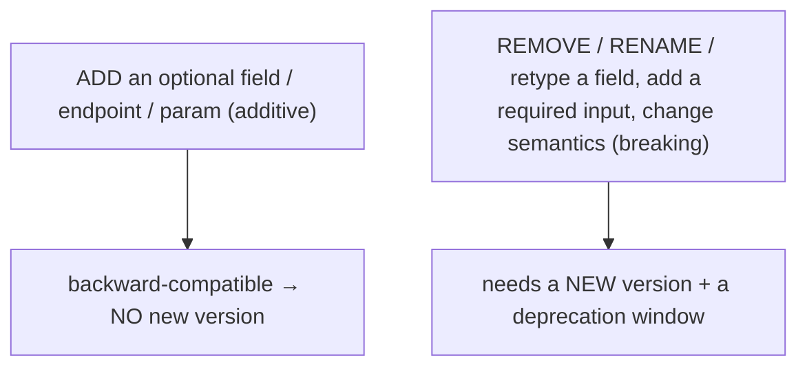
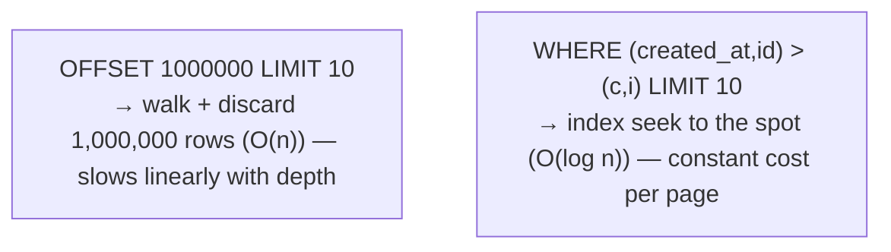

# API design (resources, versioning, pagination, filtering)

[T01](./T01-http-in-depth-methods-status-headers.md) gave the HTTP vocabulary and [T02](./T02-rest-principles-and-best-practices.md) the REST principles — this is where they become **concrete design decisions**: how to **model resources**, how to **evolve** an API without breaking clients (**versioning**), how to return large collections (**pagination**), and how to let clients ask for exactly what they need (**filtering, sorting, field selection**). These are the day-to-day craft of building a REST API people actually want to use. The unifying theme: an API is a **published contract** ([T02](./T02-rest-principles-and-best-practices.md)'s uniform interface) — so every choice serves clients well *and* keeps you able to change later **without breaking them**.

The depth-bar: at the **language** layer, resource modeling (and its security pitfalls), the **breaking-change taxonomy** and versioning strategies, **offset vs cursor** pagination with the tie-breaker subtlety, filter query languages, rate-limiting algorithms, and `problem+json`. At the **architecture** layer — with real teeth — the **API as a contract** (consumer-driven), the **performance** of cursor vs offset pagination (B-tree seek vs row scan), the **cache-ability** of design choices ([C03/T10](../C03-networking-fundamentals/T10-cdns.md)), and **payload** size ([C03/T05](../C03-networking-fundamentals/T05-http-https-lifecycle.md)).

> [!NOTE]
> Prerequisites: [REST principles & best practices](./T02-rest-principles-and-best-practices.md) (L2/C04/T02) — **resources, the uniform interface as a contract, HATEOAS, `problem+json`**; [HTTP in depth](./T01-http-in-depth-methods-status-headers.md) (L2/C04/T01) — **status codes, async 202, idempotency, caching headers, rate-limit headers**.

## Resource Modeling

Applying T02's *resources-not-verbs*:

- **Granularity** — not too coarse (one giant `/data` blob) nor too fine (a request per field). Model meaningful **business** resources that map to how clients actually use them.
- **Collections / members / sub-resources** ([T02](./T02-rest-principles-and-best-practices.md)) — `/users` (collection), `/users/5` (member), `/users/5/orders` (a relationship as a sub-resource, not a verb). Non-CRUD actions become **controller sub-resources** (`POST /orders/5/cancel`).
- **Relationships — embed vs link** — embed the related data (`"orders": [ … ]` → fewer round-trips, bigger payload, risk of over-fetching) or link to it (`"orders": "/users/5/orders"` → smaller, more requests, the n+1 risk). Offer **sparse fieldsets** / `?embed=` so the client chooses.
- **Avoid deep nesting** — `/users/5/orders/9/items/3` couples the URL to a hierarchy that will change; prefer flatter resources (`/items/3`) with links, nesting at most 1–2 levels.
- **Identifiers** — *don't expose sequential database IDs.* `GET /orders/1001` invites **IDOR** (Insecure Direct Object Reference — guess `/orders/1002` to read someone else's order) and lets competitors estimate your volume. Use **UUIDs**, **ULIDs** (sortable), or opaque/encoded IDs, and always **authorize** per-object, not just per-endpoint.

> [!WARNING]
> Two resource-design mistakes are security bugs, not just style: **(1) sequential IDs → IDOR/enumeration** — an attacker increments the ID to access objects they don't own (authorize every object access, and prefer non-guessable IDs); and **(2) mass assignment** — binding the *entire* request body onto your entity lets a client set fields it shouldn't (`{"role":"admin"}`). Bind to a **DTO** with only the allowed fields ([T04](./T04-content-negotiation-and-serialization-json-xml-jackson.md)), never straight onto the domain/DB object.

## Versioning

An API is a **published contract** ([T02](./T02-rest-principles-and-best-practices.md)): once clients depend on it you can't freely change it — yet you must evolve. The first question is *what even counts as breaking?*

### The Breaking-Change Taxonomy

| **Breaking** (needs a new version) | **Non-breaking** (additive — no new version) |
|---|---|
| remove or rename a field | **add** an optional response field |
| change a field's type or meaning | add a new endpoint or resource |
| add a **required** request field | add an **optional** request parameter |
| tighten validation / make a field stricter | relax validation |
| change/remove an error code or status | add a new optional sub-resource |
| change default behaviour | (carefully) add an enum value* |

*Adding an enum value can break a *strict* client that rejects unknown values — which is exactly why clients should be **tolerant readers** ([T04](./T04-content-negotiation-and-serialization-json-xml-jackson.md)). The discipline that keeps versions rare: **evolve additively, never remove or rename, and clients ignore what they don't recognise.**



### Strategies

| Strategy | Example | Used by | Notes |
|----------|---------|---------|-------|
| **URI** | `/v1/users` | most APIs, Twilio | explicit, visible, **cache-friendly** (distinct URLs), trivial to route/test |
| **Custom/media-type header** | `Accept: application/vnd.github+json; version=…` | GitHub | cleaner URIs, content-negotiation-based ([T04](./T04-content-negotiation-and-serialization-json-xml-jackson.md)); harder to test/discover |
| **Date-based header** | `Stripe-Version: 2024-06-20` | Stripe | pin a snapshot of behaviour; backend transforms old → new |
| **Query param** | `?version=1` | some | simple but clutters and fragments the cache key |

A common convention is the **major version in the URI** (`/v1`, `/v2`) following semantic-versioning thinking: only a *major* (breaking) change bumps it; minor/patch changes are additive and need no bump. **Consumer-driven contracts** (e.g. **Pact**) let consumers publish the shape they depend on so the provider's CI fails *before* it ships a breaking change. And announce removals: the **`Deprecation`** and **`Sunset`** headers (RFC 8594) tell clients a resource is deprecated and when it will disappear, with a changelog and advance notice.

## Pagination

A collection can have millions of rows; returning all of them means OOM, timeouts, and a huge payload ([C03/T05](../C03-networking-fundamentals/T05-http-https-lifecycle.md)). **Always paginate.** Two approaches, with real differences:

| | **Offset / limit** | **Cursor / keyset** |
|---|---|---|
| **Form** | `?offset=20&limit=10` (or `?page=3`) | `?after=<cursor>&limit=10` |
| **Jump to any page?** | yes | no (sequential) |
| **Deep-page speed** | **slow** — DB scans + discards N rows (O(n)) | **fast** — index seek (O(log n)) |
| **Stable under writes?** | **no** — inserts/deletes shift offsets → dup/skip | **yes** — anchored to a key |
| **Total count?** | easy (but `COUNT(*)` is expensive at scale) | usually omitted |
| **Best for** | small/bounded sets, admin UIs with page-jump | large datasets, infinite-scroll feeds (**the default**) |

**Offset** is simple and supports jumping to any page, but it has two real problems. **Deep pages are slow**: `OFFSET 1000000 LIMIT 10` makes the database *fetch and discard* a million rows. And it's **inconsistent under writes**: if a row is inserted before your offset between page requests, page 2 *repeats* a row from page 1 (or a delete *skips* one) — concretely, paging a live feed with offset shows the same item twice.

**Cursor / keyset** encodes "where you left off" — the last row's sort key — and fetches `WHERE key > cursor ORDER BY key LIMIT n`. It's stable (anchored to a value, not a position) and fast (an index seek — see architecture). The expert subtlety is the **tie-breaker**: if you sort by a non-unique column (`created_at`), rows with the *same* timestamp can be skipped or duplicated at a page boundary. The fix is a **composite key with a unique tiebreaker** — sort and cursor on `(created_at, id)` — so the cursor is unambiguous. Cursors should be **opaque** (base64-encode the key fields) so clients treat them as tokens, not constructable values.

Return **page metadata**: `next`/`prev` cursors or links (HATEOAS — [T02](./T02-rest-principles-and-best-practices.md)), or the **`Link` header** (RFC 8288, GitHub-style: `Link: <…?after=X>; rel="next"`).

## Filtering, Sorting & Field Selection

Let clients ask for exactly what they want — consistently across the API:

- **Filtering** — from simple `?status=active&created_after=2024-01-01`, to operators (`?price[gte]=10`), to full query languages: **RSQL/FIQL** (`status==active;price=gt=10`), **OData** (`$filter=price gt 10`), JSON:API (`filter[status]=active`). The trade-off: more power means more cache-key fragmentation and more **query-injection / expensive-query** surface — **allowlist** the filterable fields and bound the cost.
- **Sorting** — `?sort=-created,name` (`-` = descending; multi-column). **Allowlist** sortable columns; sorting on an unindexed column at scale is a DoS vector.
- **Sparse fieldsets** — `?fields=id,name` returns only those fields → a smaller payload ([C03/T05](../C03-networking-fundamentals/T05-http-https-lifecycle.md)). This is **REST's answer to GraphQL over-fetching** ([T02](./T02-rest-principles-and-best-practices.md)) — partial representations without a query language.
- **Search** — a distinct `?q=…` for full-text (vs structured filtering).

## Rate Limiting & Other Concerns

**Rate limiting** protects the API; the algorithm matters:

| Algorithm | How | Trade-off |
|-----------|-----|-----------|
| **Fixed window** | N requests per clock window | simple; **burst** at window edges (2N across a boundary) |
| **Sliding window** (log/counter) | weight by position in a rolling window | smooth, more memory/compute |
| **Token bucket** | tokens refill at a rate; each request spends one | allows controlled **bursts** (the common choice) |
| **Leaky bucket** | requests drain at a fixed rate | smooths output, queues bursts |

Respond with **`429 Too Many Requests`** + **`Retry-After`** and `RateLimit-*`/`X-RateLimit-*` headers (limit/remaining/reset). Other essentials: **idempotency keys** ([T01](./T01-http-in-depth-methods-status-headers.md)) for safe `POST` retries; **async** long-running work as **`202 Accepted`** + a status resource ([T01](./T01-http-in-depth-methods-status-headers.md)); **bulk** operations with **`207 Multi-Status`** for partial success; and a **consistent error shape** — **RFC 7807 `application/problem+json`**:

```json
{ "type": "https://api.example.com/errors/validation",
  "title": "Validation failed", "status": 422, "instance": "/orders",
  "errors": [ { "field": "quantity", "detail": "must be > 0" } ] }
```

`type`/`title`/`status`/`detail`/`instance` are standard; everything else (`errors[]`, a machine-readable `code`) is an extension member. Finally, **document the contract** with **OpenAPI** — one machine-readable spec that generates docs, client SDKs, request/response validation, and mock servers.

## Memory & Architecture Layer

### The API Is a Contract

The deep reason versioning and backward-compat matter: once published, clients **depend on the exact payload shape** — it's as binding as the URLs and status codes ([T02](./T02-rest-principles-and-best-practices.md)). **Additive-only** evolution (add fields, never remove/rename) lets the contract **grow without breaking consumers**, which is why "just add a version" isn't always needed — and why a careless rename is an *outage*. **Consumer-driven contracts** make this enforceable: the provider's CI verifies it still satisfies every consumer's recorded expectations before deploying. It's the same "the semantics are the API" idea from [T01](./T01-http-in-depth-methods-status-headers.md)/[T02](./T02-rest-principles-and-best-practices.md), now applied to the **payload shape**.

### Why Cursor Pagination Scales

The standout mechanism. Offset pagination runs `... OFFSET 1000000 LIMIT 10` — the database must **walk and discard** the first million rows: **O(n)** in the offset, so page 100,000 is glacially slow. Cursor/keyset runs `... WHERE (created_at, id) > (:c, :i) ORDER BY created_at, id LIMIT 10`, which a **composite B-tree index** turns into an **O(log n) seek** straight to the boundary, then a short sequential read (forward to **L2/C05** indexes):



So cursor pagination is **constant-cost per page regardless of depth**, and stable under writes (anchored to a key, not a position). The related cost is **`COUNT(*)`** for a total — on a large table that's a full scan; many APIs omit exact totals or return an estimate for exactly this reason.

### Cache-ability of Design Choices

Design choices have caching consequences ([C03/T10](../C03-networking-fundamentals/T10-cdns.md)): **URI versioning** and **stable resource URLs** cache well (distinct, stable keys), while **query-param explosion** — every filter/sort/fieldset combination a different URL, multiplied by `Vary` headers ([T01](./T01-http-in-depth-methods-status-headers.md)) — **fragments** the cache and lowers the hit ratio. And **field selection** (sparse fieldsets) cuts bytes on the wire → lower latency and bandwidth, the same cost-model lever from [C03/T05](../C03-networking-fundamentals/T05-http-https-lifecycle.md).

> [!IMPORTANT]
> An API is a **published contract** ([T02](./T02-rest-principles-and-best-practices.md)): once clients depend on it, the **payload shape** is as binding as the URLs and status codes. Evolve it **additively** — **add** fields and endpoints, **never remove or rename** — so the contract grows without breaking consumers (enforce it with **consumer-driven contracts**). Reserve a **version bump** for genuinely breaking changes, and announce removals with `Deprecation`/`Sunset` (RFC 8594) and a window. A careless rename is an outage, not a release.

> [!TIP]
> Default to **cursor/keyset** pagination with a **unique composite tiebreaker** (`(created_at, id)`) and **opaque cursors** for any large or live dataset — it's O(log n), stable under writes, and avoids the `COUNT(*)` cost; reserve **offset** for small, bounded admin lists that need page-jumping. And make most changes **additive** (tolerant readers — [T04](./T04-content-negotiation-and-serialization-json-xml-jackson.md)) so you rarely version at all; publish the contract as **OpenAPI**.

## Common Mistakes

### Sequential IDs / Mass Assignment

Security bugs: enumerable IDs → IDOR; binding the whole body → privilege escalation. Use opaque IDs + per-object authorization, and bind to a DTO (see the warning).

### No Versioning Strategy / Versioning Every Change

No strategy → a breaking change breaks every client at once; versioning *additive* changes → version sprawl. Have a strategy, and bump **only** for breaking changes.

### Offset Pagination on Huge/Deep Datasets

Slow at depth (O(n)) and inconsistent under writes (dup/skip). Use **cursor/keyset** with a tiebreaker (see the tip).

### Unbounded Collections

Returning a whole collection (no pagination) risks OOM, timeouts, and giant payloads. Paginate everything, and cap the `limit`.

### Deep Nesting

`/a/1/b/2/c/3` is brittle and hard to evolve. Prefer flatter resources + links ([T02](./T02-rest-principles-and-best-practices.md)).

### Unbounded Filters/Sorts

Allowing filtering/sorting on arbitrary columns invites expensive-query DoS and injection. **Allowlist** fields and bound the cost.

### Breaking Changes Without Deprecation

Removing/renaming with no notice surprises clients into outages. Deprecate with `Sunset` + lead time + a changelog.

### Ad-hoc Errors / Exposing DB Internals

Each endpoint inventing its own error shape; leaking schema, internal field names, or stack traces. Standardize on `problem+json`; design the **contract**, not the table.

> [!INTERVIEW]
> API design is a core backend/system-design interview — the standout answers explain **why cursor pagination scales** (and the tiebreaker), the **breaking-change taxonomy**, and the **API-as-contract** discipline.
>
> 1. **How do you model resources well, and the security pitfalls?** Meaningful granularity, collections/members/sub-resources, embed-vs-link, no deep nesting; **opaque IDs** (avoid IDOR) and **DTO binding** (avoid mass assignment).
> 2. **What counts as a breaking change?** Removing/renaming/retyping a field, adding a required input, tightening validation, changing semantics/errors — vs additive (new optional field/endpoint/param).
> 3. **Versioning strategies + when to version?** URI (common/cache-friendly), media-type/date header (GitHub/Stripe), query param; bump **only** for breaking changes; enforce with consumer-driven contracts; deprecate with `Sunset`.
> 4. **Offset vs cursor pagination — why does cursor scale?** Offset walks+discards N rows (O(n), slow deep, shifts under writes); cursor/keyset `WHERE key > cursor` is an O(log n) **index seek**, stable — L2/C05.
> 5. **What's the cursor tiebreaker problem?** Sorting on a non-unique column skips/dups rows at page boundaries; fix with a **unique composite key** (`(created_at, id)`) and opaque cursors.
> 6. **How do clients fetch only what they need?** Filtering, sorting (allowlisted), **sparse fieldsets** (`?fields=`) — REST's answer to over-fetch.
> 7. **How do you shape errors and rate limits?** RFC 7807 `problem+json` (+ `errors[]`); `429` + `Retry-After` + `RateLimit-*`; pick token-bucket/sliding-window per burst needs.
> 8. **Why is an API a contract, and what follows?** Clients depend on the shape; evolve additively; breaking changes need versioning; verify with consumer-driven contracts; document with OpenAPI.
> 9. **How do design choices affect caching?** Stable URI versioning + stable URLs cache well ([C03/T10](../C03-networking-fundamentals/T10-cdns.md)); query-param + `Vary` explosion fragments the cache key.
> 10. **Rate-limit algorithms?** Fixed window (edge bursts), sliding window (smooth), **token bucket** (controlled bursts), leaky bucket (smoothed output).
> 11. **How do you handle long-running and bulk operations?** Async `202` + status resource; bulk with `207 Multi-Status` for partial success.
> 12. **What is OpenAPI?** A machine-readable spec → generated docs/clients/validation/mocks; the contract made explicit.
> 13. **Why is `COUNT(*)` for a total a problem?** On a large table it's a full scan; cursor APIs often omit exact totals or estimate.
> 14. **Why not expose DB IDs/schema?** Leaky abstraction + IDOR/enumeration; use opaque IDs and design the contract independently.

## Practice

1. **Design a collection API.** For products: URLs, query params (filter/sort/page), response shape, and the IDs you'd expose.
2. **Breaking vs additive.** Classify ten proposed changes as breaking or additive; version only the breaking ones.
3. **Version it.** Apply a breaking change (rename a field) with both URI and media-type-header strategies.
4. **Offset vs cursor.** Implement both; measure the cost of a deep page (O(n) vs O(log n)).
5. **Tiebreaker.** Cursor-paginate on a non-unique `created_at`; reproduce a skipped/duplicated row at a boundary; fix with `(created_at, id)`.
6. **Offset inconsistency.** Insert a row mid-pagination; observe a duplicate/skip; show cursor is stable.
7. **Filter/sort/fields.** Add filtering (with an allowlist), sorting, and sparse fieldsets; measure payload reduction.
8. **IDOR.** Build an endpoint with sequential IDs; access another user's object by incrementing; fix with opaque IDs + per-object authz.
9. **Mass assignment.** Bind a full body onto an entity; set a field you shouldn't (`role`); fix with a DTO.
10. **Errors + rate limit.** Shape errors with `problem+json`; add token-bucket rate limiting returning `429` + `Retry-After`.
11. **OpenAPI.** Write an OpenAPI snippet for an endpoint; generate docs / a client.
12. **Cache impact.** Reason how URI vs query-param versioning, and `Vary`, affect CDN cache keys ([C03/T10](../C03-networking-fundamentals/T10-cdns.md)).
13. **Consumer-driven contract.** Record a consumer's expectation; break the provider; show the contract test catching it.
14. **Explain it back.** For `GET /products?status=active&sort=-price&fields=id,name&after=<cursor>&limit=20`, trace (a) the resource model + ID choice, (b) why cursor pagination scales vs offset and why the tiebreaker matters (L2/C05 index), (c) how field selection cuts payload ([C03/T05](../C03-networking-fundamentals/T05-http-https-lifecycle.md)), (d) why this URL caches well or poorly ([C03/T10](../C03-networking-fundamentals/T10-cdns.md)), and (e) what a backward-compatible v-next would add.

## Recap

You should now be able to:

- **Model resources** well — granularity, **embed vs link**, no deep nesting — and dodge the security traps (**IDOR** via opaque IDs + per-object authz; **mass assignment** via DTO binding).
- Apply the **breaking-change taxonomy** (what is/isn't breaking), choose a **versioning** strategy (URI/header/date), version **only** for breaking changes, enforce with **consumer-driven contracts**, and deprecate with **`Sunset`** (RFC 8594).
- **Paginate** correctly — **offset** (simple, O(n), unstable) vs **cursor/keyset** (O(log n), stable — the default) — with a **unique composite tiebreaker** and **opaque cursors**, plus `Link`/HATEOAS metadata and an awareness of the `COUNT(*)` cost.
- Support **filtering** (allowlisted, query-language options), **sorting** (allowlisted), and **sparse fieldsets**, plus **rate limiting** (token-bucket/sliding-window + `429`/`Retry-After`), async (`202`), bulk (`207`), `problem+json`, and **OpenAPI**.
- Explain the **architecture**: the **API as a contract** (additive evolution + consumer-driven), **why cursor pagination scales** (composite-index seek vs row scan — L2/C05), the **cache-ability** of design choices ([C03/T10](../C03-networking-fundamentals/T10-cdns.md)), and **field selection** as a payload lever ([C03/T05](../C03-networking-fundamentals/T05-http-https-lifecycle.md)) — and avoid the traps (sequential IDs, mass assignment, no/over versioning, offset on deep datasets, unbounded collections/filters, undeprecated breaking changes, ad-hoc errors, leaking DB internals).

## Next

Continue to [Content negotiation & serialization (JSON/XML, Jackson)](./T04-content-negotiation-and-serialization-json-xml-jackson.md).
