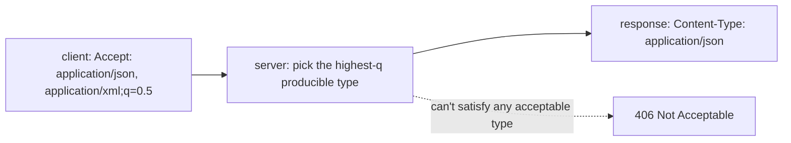
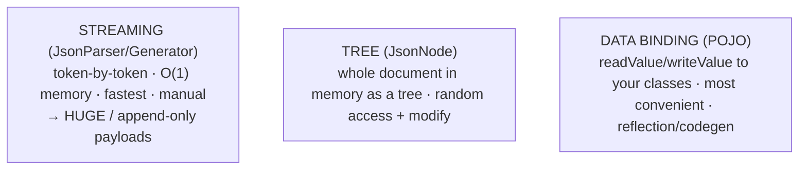

# Content negotiation & serialization (JSON/XML, Jackson)

[T02](./T02-rest-principles-and-best-practices.md) said a REST resource is manipulated through **representations** — and this topic is about those representations: how a client and server agree on a **format** (**content negotiation**), and how a Java object becomes the **bytes** on the wire and back (**serialization**). JSON dominates the web, and **Jackson** is how Java speaks it. This is where your domain objects meet the HTTP body — the boundary that *is* your API's contract ([T02](./T02-rest-principles-and-best-practices.md)/[T03](./T03-api-design-resources-versioning-pagination-filtering.md)) and one of the most common sources of subtle bugs and serious security holes. It's also the last topic of this chapter.

The depth-bar: at the **language** layer, content negotiation, the formats (JSON's **spec gotchas**, XML, Protobuf and **schema evolution**), and **Jackson** in real depth (the annotation catalog, features, views, mix-ins). At the **architecture** layer — the heart — the **three Jackson processing models**, the **reflection cost** (and why you reuse the `ObjectMapper`), **serialization as the API contract**, **payload** size, and the **deserialization-RCE** gadget-chain mechanism and its defense.

> [!NOTE]
> Prerequisites: [HTTP in depth](./T01-http-in-depth-methods-status-headers.md) (L2/C04/T01) — **the `Accept`/`Content-Type` negotiation headers and `q`-values**; [REST principles](./T02-rest-principles-and-best-practices.md) (L2/C04/T02) — **representations, and the serialization boundary as the contract**; [API design](./T03-api-design-resources-versioning-pagination-filtering.md) (L2/C04/T03) — **the tolerant reader, DTO-not-entity, mass-assignment, and backward compatibility**.

## Content Negotiation

The same resource ([T02](./T02-rest-principles-and-best-practices.md)) can be delivered in different formats, encodings, and languages; **content negotiation** is how client and server agree which.



The client sends ranked preferences with **quality values**: `Accept: application/json;q=1.0, application/xml;q=0.5, */*;q=0.1` ([T01](./T01-http-in-depth-methods-status-headers.md)). The server runs a selection algorithm — match the most specific media range with the highest `q` it can **produce** — and echoes the choice in `Content-Type` (likewise `Accept-Encoding`→`Content-Encoding`, `Accept-Language`→`Content-Language`). This is **proactive (server-driven)** negotiation, the common model; **reactive (agent-driven)** negotiation returns `300 Multiple Choices` with a list (rare). If nothing acceptable can be produced, return **`406 Not Acceptable`** (or fall back to a sensible default — many APIs just always return JSON). Beyond the `Accept` header, some APIs negotiate by **URL suffix** (`/users.json` vs `/users.xml`) or a query param — easier to test, but it conflates the resource with its representation.

## The JSON Data Model — and Its Gotchas

JSON (RFC 8259 / ECMA-404) has exactly six value types: **object**, **array**, **string**, **number**, **boolean**, and **null**. Its simplicity is why it won — and also where the traps hide:

- **The number precision trap (the big one).** JSON numbers have *no* precision limit in the grammar, but **JavaScript parses every number as an IEEE-754 `double`**, which holds only **53 bits of integer precision** (`Number.MAX_SAFE_INTEGER` = 2^53−1). A 64-bit `long` ID like `9007199254740993` or a `BigDecimal` money value silently **loses precision or rounds** in a browser. **Serialize large integer IDs and monetary amounts as JSON strings** (`"id": "9007199254740993"`), or use a format that preserves them.
- **No date/time type** — dates are strings; standardize on **ISO 8601** (`2024-06-20T14:30:00Z`).
- **No comments, no trailing commas** — strict JSON forbids both (JSON5/JSONC relax this for config files, not APIs).
- **No `NaN`/`Infinity`** — not representable; Jackson can be configured to emit them but it's non-standard.
- **Encoding is UTF-8**; **duplicate object keys** have undefined behaviour (last-wins in most parsers — a parser-differential security risk). **Jackson** accepts duplicates silently (last-wins) unless you enable `JsonReadFeature.STRICT_DUPLICATE_DETECTION` (or the parser feature `STRICT_DUPLICATE_DETECTION`) to reject them.

## Serialization Formats

**Serialization** (marshalling) turns a Java object into wire **bytes**; **deserialization** turns bytes back into an object — the boundary between your in-memory domain and the HTTP body.

| Format | Readable | Schema | Size/speed | Notes |
|--------|:--------:|:------:|------------|-------|
| **JSON** | ✅ text | none | medium | web default; the number/precision traps above |
| **XML** | ✅ text | XSD (rich) | large/slow | namespaces, XPath, SOAP — and the **XXE** security risk |
| **Protobuf** | ❌ binary | required (`.proto`) | **small/fast** | gRPC ([T02](./T02-rest-principles-and-best-practices.md)); field **numbers** + schema evolution |
| **Avro** | ❌ binary | required | small | schema travels with data / a schema registry |
| **MessagePack / CBOR** | ❌ binary | none | small | "binary JSON" |

**Protobuf schema evolution** is worth knowing because it embodies the additive-compatibility discipline from [T03](./T03-api-design-resources-versioning-pagination-filtering.md) at the format level: fields are identified by **numbers**, not names, on the wire; you may **add** new optional fields freely, you must **never reuse or renumber** a field, and you mark removed fields `reserved` so the number is never recycled — giving forward/backward compatibility by construction. JSON has no such enforcement, which is exactly why *your* API needs the [T03](./T03-api-design-resources-versioning-pagination-filtering.md) discipline and tolerant readers.

## Jackson

**Jackson** is the de-facto Java JSON library, layered as: `JsonFactory` → `JsonParser`/`JsonGenerator` (the streaming core) → **`ObjectMapper`** (data binding) on top. The mapper is the workhorse:

```java
ObjectMapper mapper = JsonMapper.builder()                 // build + configure ONCE, reuse
    .addModule(new JavaTimeModule())                       // java.time support
    .propertyNamingStrategy(PropertyNamingStrategies.SNAKE_CASE)
    .disable(SerializationFeature.WRITE_DATES_AS_TIMESTAMPS)        // ISO-8601 not epoch
    .disable(DeserializationFeature.FAIL_ON_UNKNOWN_PROPERTIES)     // tolerant reader
    .serializationInclusion(JsonInclude.Include.NON_NULL)          // omit nulls
    .build();

String json = mapper.writeValueAsString(user);             // serialize
User u = mapper.readValue(json, User.class);               // deserialize
record User(@JsonProperty("user_name") String name, int age) {}    // records as DTOs (L1/C01/T14)
```

### The Annotation Catalog

Annotations control the JSON shape — i.e. the contract:

| Annotation | Effect |
|------------|--------|
| `@JsonProperty("user_name")` | rename — the **Java↔wire decoupling** |
| `@JsonAlias` | accept extra incoming names (for evolution) |
| `@JsonIgnore` / `@JsonIgnoreProperties(ignoreUnknown=true)` | exclude / tolerate unknowns |
| `@JsonInclude(NON_NULL/NON_EMPTY)` | omit empty values |
| `@JsonFormat` | date/number format, pattern, timezone |
| `@JsonCreator` + `@JsonValue` | custom construction / single-value representation |
| `@JsonAnyGetter` / `@JsonAnySetter` | dynamic / open-ended properties |
| `@JsonUnwrapped` | flatten a nested object into the parent |
| `@JsonView` | **different field sets for different audiences** (public vs internal) |
| `@JsonManagedReference` / `@JsonBackReference` | break bidirectional cycles |
| `@JsonTypeInfo` + `@JsonSubTypes` | polymorphic (de)serialization — *handle with care* |

Two power features beyond annotations: **mix-ins** let you apply Jackson annotations to a class you **can't modify** (a third-party type) by declaring them on a separate mix-in class; and `SerializationFeature`/`DeserializationFeature` flags tune global behaviour (`INDENT_OUTPUT`, `ACCEPT_SINGLE_VALUE_AS_ARRAY`, `FAIL_ON_EMPTY_BEANS`, …). **Modules** extend the mapper: `JavaTimeModule` (essential for `java.time`), `ParameterNamesModule` / Java 16+ canonical-constructor detection (for **records** — [L1/C01/T14](../../L1-core-java/C01-oop/T14-record-types.md)), Kotlin, etc. Alternatives exist (Gson, JSON-B, Moshi), but Jackson is the Spring default.

### The Tolerant Reader

`DeserializationFeature.FAIL_ON_UNKNOWN_PROPERTIES = false` (or `@JsonIgnoreProperties(ignoreUnknown = true)`) makes the deserializer **ignore fields it doesn't recognise**. This is T03's **tolerant reader** made concrete: a client that ignores unknown fields keeps working when the server **adds** a field — the additive, backward-compatible evolution from [T03](./T03-api-design-resources-versioning-pagination-filtering.md). The serialization layer is *where backward compatibility is enforced* — and conversely, the *strict* default (fail on unknown) is what makes a careless server-side addition a client outage.

## Memory & Architecture Layer

### The Three Processing Models

Jackson offers three ways to process JSON, trading **memory + control** against **convenience**:



Most apps use **data binding** (POJO in/out). Reach for **streaming** when a payload is too large to materialize — a million-record export streamed token-by-token uses **constant memory** rather than loading the whole array (the same streaming principle as everywhere else). **Tree** sits between: use it to navigate or surgically modify arbitrary JSON without a class. A common hybrid is to stream the outer array and **data-bind each element**.

### Reflection Cost — Reuse the ObjectMapper

By default Jackson uses **reflection** to read/write fields, with a per-call cost and a warm-up cost — but it **caches** the generated `BeanSerializer`/`BeanDeserializer` per type **on the `ObjectMapper`**. The consequence is the **#1 Jackson performance bug**: *creating an `ObjectMapper` per request throws that cache away* and pays the full introspection + reflection cost every time. The mapper is **thread-safe after configuration**; build **one** and reuse it (Spring injects a configured singleton). For extreme hot paths, the **Afterburner** (older) and **Blackbird** (modern — it generates accessors via `LambdaMetafactory`, the same invokedynamic mechanism as [L2/C01/T01](./../C01-functional-and-modern-java/T01-lambda-expressions.md) lambdas) modules replace reflection with bytecode-generated accessors.

### Serialization Is the API Contract

The JSON shape **is** the contract ([T02](./T02-rest-principles-and-best-practices.md)'s uniform interface, [T03](./T03-api-design-resources-versioning-pagination-filtering.md)'s API-as-contract), and Jackson annotations are how you **control** it. Crucially, **`@JsonProperty`/naming strategies decouple your Java field names from the wire names** — so you can rename an internal field without breaking the API. That's the same decoupling that codegen tools give you ([C02/T08](../C02-build-tools-and-workflow/T08-lombok.md) Lombok, [C02/T09](../C02-build-tools-and-workflow/T09-mapstruct.md) MapStruct): the wire contract stays independent of the internal model. It's *why* you serialize a **DTO**, not your domain/DB entity ([T03](./T03-api-design-resources-versioning-pagination-filtering.md)) — to keep the contract stable, deliberate, and free of mass-assignment risk.

### Payload Size

JSON is text, so it's bigger than binary ([C03/T05](../C03-networking-fundamentals/T05-http-https-lifecycle.md) cost model). **gzip/br** (`Content-Encoding`, negotiated via `Accept-Encoding`) typically cuts JSON ~70%; a **binary** format (Protobuf) is smaller still and faster to parse. Combined with sparse fieldsets ([T03](./T03-api-design-resources-versioning-pagination-filtering.md)), payload size is the same latency/bandwidth lever from [C03/T05](../C03-networking-fundamentals/T05-http-https-lifecycle.md).

### Deserialization Security — the Gadget Chain

The critical risk, and worth understanding mechanically. Deserializing **untrusted** input with **polymorphic typing** is dangerous because it lets the *incoming JSON* specify **which class to instantiate**. The attack — a **gadget chain** — works like this: the attacker names a class that performs a dangerous side effect during construction/setter invocation (e.g. one that opens a JNDI/LDAP connection or spawns a process when a property is set); Jackson, told to honour the type from the JSON, instantiates it and populates it, **executing the side effect** → **remote code execution**. This produced a long line of Jackson CVEs (the same family as Java's native `ObjectInputStream` deserialization, and the mechanism behind Log4Shell's JNDI lookups). The defenses:

- **Never enable default typing on untrusted input** (`activateDefaultTyping`/the old `enableDefaultTyping`).
- When polymorphism is genuinely needed, register a **`PolymorphicTypeValidator`** that **allowlists** exactly the permitted base/subtypes — Jackson refuses any other class.
- Prefer **non-polymorphic DTOs**, keep Jackson **patched** ([C02/T11](../C02-build-tools-and-workflow/T11-dependency-vulnerability-scanning.md) dependency scanning), and for XML disable external entities to prevent **XXE**. (Java's native serialization is even more dangerous; if you must use it, apply a **serialization filter** — JEP 290.)

### Java Mapping

**Spring Boot** auto-configures Jackson: a `@RestController` method returning a POJO is serialized to JSON via an `HttpMessageConverter` (the converter chain also handles XML, Protobuf, etc.), `@RequestBody` deserializes the request, and content negotiation is driven by the `Accept` header and the controller's `produces`/`consumes` ([T01](./T01-http-in-depth-methods-status-headers.md)). Use the **injected `ObjectMapper`** singleton; use **records** ([L1/C01/T14](../../L1-core-java/C01-oop/T14-record-types.md)) as immutable DTOs; and serialize a **DTO, not a JPA entity** ([T03](./T03-api-design-resources-versioning-pagination-filtering.md)) — to avoid leaking the DB schema, dodge the JPA **lazy-loading trap** (serializing a lazy association triggers a query or a `LazyInitializationException`, and the "open-session-in-view" workaround is an anti-pattern — forward to L2/C05), and prevent mass assignment. For XML, `jackson-dataformat-xml` or JAXB.

> [!IMPORTANT]
> **Reuse a single, pre-configured `ObjectMapper`.** It's thread-safe after build and caches per-type serializers/deserializers — creating one per request throws away that cache and pays the full introspection + reflection cost every call (the #1 Jackson performance bug). In Spring, inject the auto-configured singleton; for hot paths add the Blackbird module.

> [!WARNING]
> **Never deserialize untrusted input with polymorphic typing enabled.** It lets the incoming JSON choose which class to instantiate — an attacker names a **gadget** class whose construction has a side effect and achieves **remote code execution** (the Jackson-CVE family, same mechanism as native-`ObjectInputStream` and Log4Shell — [C02/T11](../C02-build-tools-and-workflow/T11-dependency-vulnerability-scanning.md)). Keep default typing **off**, allowlist subtypes with a **`PolymorphicTypeValidator`** if you truly need polymorphism, keep Jackson patched, and disable XML external entities (**XXE**).

> [!TIP]
> Make your API a **tolerant reader** (`FAIL_ON_UNKNOWN_PROPERTIES=false`) so a client survives an added field ([T03](./T03-api-design-resources-versioning-pagination-filtering.md)); serialize a **DTO, not an entity** (contract control + no lazy-loading trap + no mass assignment); and **serialize large IDs and money as strings** to dodge the JSON 53-bit number trap. Use `@JsonView` to expose different field sets to different audiences from one model.

## Common Mistakes

### Creating an `ObjectMapper` Per Request

Discards the per-type cache → the #1 perf bug. Reuse a singleton (Blackbird for hot paths).

### The 53-Bit Number Trap

Serializing a 64-bit `long` ID or `BigDecimal` money as a JSON number → silent precision loss in JS clients. Serialize them as **strings**.

### Not Handling Unknown Fields

Strict deserialization breaks when the server adds a field. Use the **tolerant reader** ([T03](./T03-api-design-resources-versioning-pagination-filtering.md)).

### Serializing Entities Directly

Leaks the DB schema, triggers JPA lazy-loading traps, and enables mass assignment. Serialize **DTOs** ([T03](./T03-api-design-resources-versioning-pagination-filtering.md)).

### Polymorphic Deserialization of Untrusted Input

A remote-code-execution risk via gadget chains. Default typing **off**; allowlist with `PolymorphicTypeValidator` ([C02/T11](../C02-build-tools-and-workflow/T11-dependency-vulnerability-scanning.md)).

### Date/Time Chaos

No `JavaTimeModule` or epoch-vs-ISO inconsistency → broken/locale-dependent dates. Register the module, disable `WRITE_DATES_AS_TIMESTAMPS`, use **ISO-8601**.

### Materializing Giant Payloads

Full data binding of a huge document risks OOM. **Stream** it (`JsonParser`) at constant memory.

### Circular References & Name Coupling

A bidirectional relationship serializes into an infinite loop (`StackOverflow`) — break with `@JsonManagedReference`/`@JsonBackReference` or a DTO. And renaming a Java field that *is* the wire name breaks the API — use `@JsonProperty` to **decouple** ([T02](./T02-rest-principles-and-best-practices.md)/[T03](./T03-api-design-resources-versioning-pagination-filtering.md)).

> [!INTERVIEW]
> Serialization rounds out the web chapter — the standout answers cover the **number-precision trap**, the **three processing models**, **ObjectMapper reuse**, and the **deserialization-RCE** gadget chain.
>
> 1. **What is content negotiation?** Client states preferences (`Accept`/`-Language`/`-Encoding` with `q`-values — [T01](./T01-http-in-depth-methods-status-headers.md)); the server selects the best producible type and sets `Content-Type`; **406** if none.
> 2. **The JSON number trap?** JS parses numbers as IEEE-754 double (53-bit int precision) → big `long` IDs / `BigDecimal` money lose precision → serialize them as **strings**.
> 3. **JSON vs XML vs Protobuf?** JSON text/simple (number traps); XML rich/legacy (XXE); Protobuf binary/schema'd/fast with **schema evolution** by field number (gRPC — [T02](./T02-rest-principles-and-best-practices.md)).
> 4. **The three Jackson processing models?** **Streaming** (token-by-token, O(1) memory, huge docs), **tree** (`JsonNode`, random access), **data binding** (POJO, convenient).
> 5. **What is the `ObjectMapper` gotcha?** Thread-safe + caches per-type (de)serializers → **reuse a singleton**; per-request creation is the #1 perf bug (Blackbird for hot paths).
> 6. **How do you control the JSON shape?** Annotations (`@JsonProperty`/`Ignore`/`Include`/`Format`/`View`), naming strategies, and **mix-ins** for types you can't modify — because the JSON shape **is** the contract.
> 7. **What is the tolerant reader, and why?** Ignore unknown fields → old clients keep working when the server adds fields (backward compat — [T03](./T03-api-design-resources-versioning-pagination-filtering.md)).
> 8. **Why serialize a DTO, not an entity?** Avoids DB-schema leak, JPA lazy-loading traps, and mass assignment ([T03](./T03-api-design-resources-versioning-pagination-filtering.md)/L2-C05).
> 9. **What's the deserialization-RCE risk and the defense?** Polymorphic typing lets untrusted JSON name a **gadget** class → RCE; defend with default-typing-off + a `PolymorphicTypeValidator` allowlist + patches ([C02/T11](../C02-build-tools-and-workflow/T11-dependency-vulnerability-scanning.md)).
> 10. **How do you handle `java.time`?** `JavaTimeModule` + ISO-8601 (disable `WRITE_DATES_AS_TIMESTAMPS`).
> 11. **How does Spring use Jackson?** Auto-configured; `@RestController` POJO → JSON, `@RequestBody` JSON → object via `HttpMessageConverter`; negotiation by `Accept` + `produces`/`consumes`.
> 12. **How do you cut payload size?** gzip/br (`Content-Encoding` — [C03/T05](../C03-networking-fundamentals/T05-http-https-lifecycle.md)), sparse fieldsets ([T03](./T03-api-design-resources-versioning-pagination-filtering.md)), or a binary format.
> 13. **What is `@JsonView`?** Tag fields with views to serialize different subsets for different audiences from one model.
> 14. **Why is Protobuf forward/backward compatible?** Fields keyed by **number**, add-only, never reuse a number (`reserved`) — the additive-compatibility discipline at the format level ([T03](./T03-api-design-resources-versioning-pagination-filtering.md)).

## Practice

1. **Round-trip.** Serialize/deserialize a POJO **and** a record with the `ObjectMapper` (note the records module/Java-16 requirement).
2. **Number trap.** Serialize a `long` ID near 2^53 and a `BigDecimal`; parse in a JS console; observe precision loss; fix by serializing as strings.
3. **Negotiate.** Request JSON vs XML via `Accept`; observe the chosen `Content-Type`; trigger a `406` ([T01](./T01-http-in-depth-methods-status-headers.md)).
4. **Tolerant reader.** Deserialize JSON with an extra unknown field, with and without `FAIL_ON_UNKNOWN_PROPERTIES`.
5. **Stream.** Parse a huge JSON array with `JsonParser` (data-binding each element); confirm constant memory vs full binding.
6. **Annotations.** Use `@JsonProperty` + a naming strategy to decouple names; `@JsonView` to expose public vs internal fields; a **mix-in** to annotate a third-party class.
7. **Reuse cost.** Benchmark `ObjectMapper`-per-call vs a reused singleton (and add Blackbird).
8. **`java.time`.** Serialize an `Instant` with/without `JavaTimeModule` and timestamps; fix to ISO-8601.
9. **Forward compat.** Add a field server-side; confirm a tolerant-reader client still works ([T03](./T03-api-design-resources-versioning-pagination-filtering.md)).
10. **DTO vs entity.** Serialize a JPA-style entity with a lazy association; reproduce the trap; fix with a DTO ([T03](./T03-api-design-resources-versioning-pagination-filtering.md)).
11. **Circular reference.** Serialize a bidirectional relationship; observe the loop; fix it.
12. **Security (sandbox).** Enable default typing and reason through how a gadget-named JSON could execute code; then add a `PolymorphicTypeValidator` allowlist and confirm it rejects unlisted types ([C02/T11](../C02-build-tools-and-workflow/T11-dependency-vulnerability-scanning.md)).
13. **Protobuf evolution.** Define a `.proto`, add an optional field, remove one with `reserved`; show old/new clients still interoperate.
14. **Explain it back.** For a `@RestController` returning a record DTO, trace (a) content negotiation picking JSON ([T01](./T01-http-in-depth-methods-status-headers.md)), (b) Jackson data-binding the record (which model), (c) why the `ObjectMapper` is reused, (d) why it's a DTO not an entity, (e) how the tolerant reader keeps old clients working ([T03](./T03-api-design-resources-versioning-pagination-filtering.md)), and (f) the deserialization-security rule.

## Recap

You should now be able to:

- Explain **content negotiation** — `Accept`/`-Language`/`-Encoding` + `q`-values → the server's selection → `Content-Type` ([T01](./T01-http-in-depth-methods-status-headers.md)); `406`; suffix/param strategies — the same resource ([T02](./T02-rest-principles-and-best-practices.md)) in many forms.
- Know the **JSON data model and its gotchas** — the **53-bit number-precision trap** (serialize big IDs/money as strings), no date type (ISO-8601), no comments/`NaN`, UTF-8 — and compare **JSON vs XML (XXE) vs Protobuf** (binary, schema evolution by field number).
- Use **Jackson** in depth — the layered architecture (`JsonFactory`/parser/`ObjectMapper`), the annotation catalog (`@JsonProperty`/`View`/mix-ins/`@JsonAnyGetter`), `Serialization`/`DeserializationFeature` flags, naming strategies, modules (`JavaTimeModule`, records — [L1/C01/T14](../../L1-core-java/C01-oop/T14-record-types.md)), and the **tolerant reader**.
- Choose among the **three processing models** (streaming / tree / data binding) by the memory-vs-convenience trade-off, and apply the architecture lessons: **reuse the `ObjectMapper`** (reflection cache; Blackbird), **serialization is the contract** (name decoupling — [T02](./T02-rest-principles-and-best-practices.md)/[T03](./T03-api-design-resources-versioning-pagination-filtering.md)), **payload** size ([C03/T05](../C03-networking-fundamentals/T05-http-https-lifecycle.md)), and **DTO-not-entity** ([T03](./T03-api-design-resources-versioning-pagination-filtering.md)).
- Handle **deserialization security** — understand the **gadget-chain** RCE mechanism, never deserialize untrusted **polymorphic** input, allowlist with `PolymorphicTypeValidator`, patch Jackson, and disable XXE ([C02/T11](../C02-build-tools-and-workflow/T11-dependency-vulnerability-scanning.md)) — and avoid the traps (per-request mapper, number precision, unhandled unknowns, entity serialization, date chaos, OOM payloads, circular refs, name coupling).

## Next

This is the last topic of the **Web & REST Basics** chapter — which is **complete (4/4)**. You've built the web-API layer end to end: HTTP semantics in depth, REST principles, API design, and the serialization that carries it all. Continue to the next chapter, [Databases & SQL](../C05-databases-and-sql/README.md).
