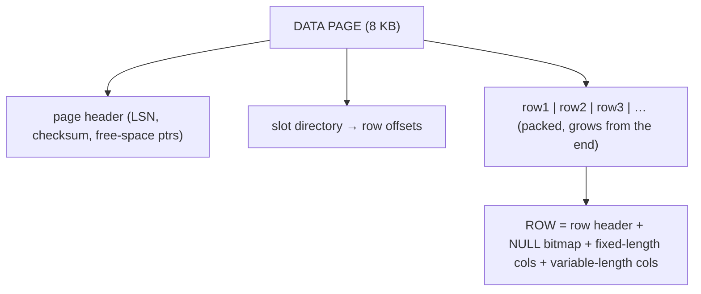
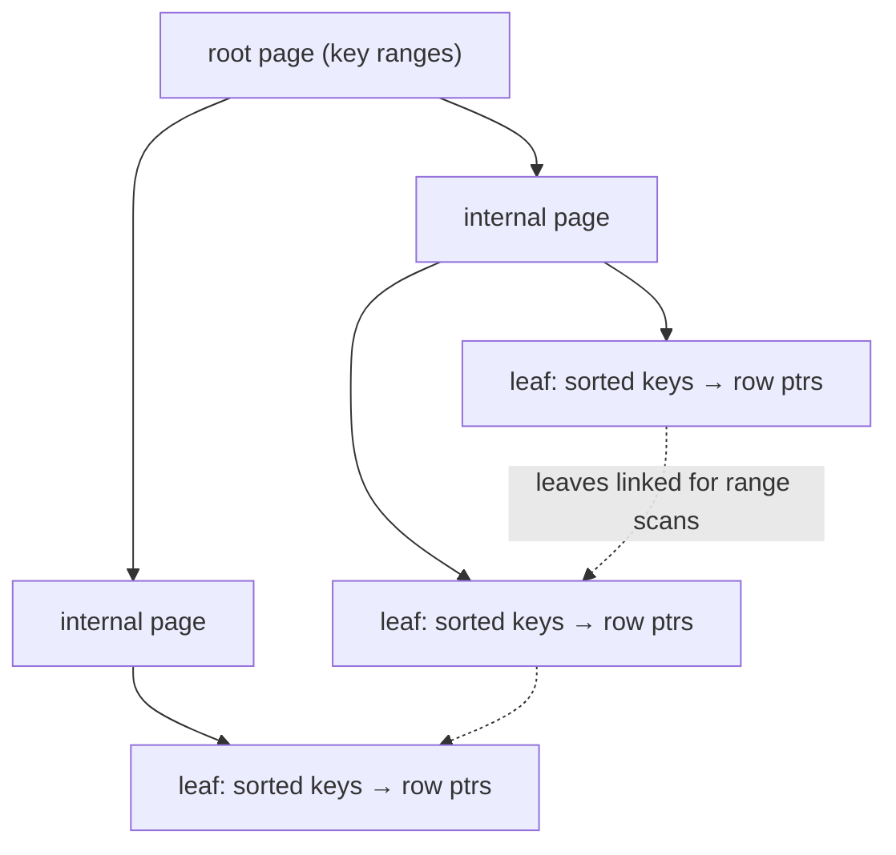

# Relational model & terminology

Almost every backend you'll build stores its data in a **relational database** — PostgreSQL, MySQL, SQL Server, Oracle — and the reason a 50-year-old idea still dominates is that the **relational model** is one of the most successful abstractions in computing. Edgar **Codd** proposed it in 1970 ("A Relational Model of Data for Large Shared Data Banks") on a deceptively simple premise: represent **all** data as **values in tables**, and let users query it **declaratively** (say *what* you want, not *how* to get it), so the database is free to store and retrieve it however is fastest. That separation — the logical model you query versus the physical bytes on disk — is exactly why the relational model has outlived decades of hardware change. This chapter builds the whole database layer; this topic is the **foundation**: the model, its precise terminology, and — crucially — how a clean logical relation becomes **pages, rows, and B-tree indexes** on a spinning or solid-state disk.

The depth-bar has three layers, all of them real for a data topic. At the **conceptual** layer: relations/tuples/attributes/domains, keys and integrity, `NULL` and three-valued logic, and the **relational algebra** SQL is built on. At the **physical/architecture** layer — the heart — how a relation is stored as **pages** with a **byte-level row layout**, the **buffer pool** that makes disk-bound databases fast, and the **B-tree index** that turns an O(n) scan into an O(log n) seek (the very mechanism behind cursor pagination — [C04/T03](../C04-web-and-rest-basics/T03-api-design-resources-versioning-pagination-filtering.md)). And at the **Java** layer: how a `ResultSet` *is* a relation and where the object/relational **impedance mismatch** bites.

> [!NOTE]
> Prerequisites: [API design (pagination)](../C04-web-and-rest-basics/T03-api-design-resources-versioning-pagination-filtering.md) (L2/C04/T03) — **cursor pagination's O(log n) index seek is paid off here**; [Arrays (1-D, multi-dimensional)](../../L0-foundations/C02-java-core/T11-arrays-1-d-multi-dimensional.md) (L0/C02/T11) — **contiguous byte layout and indexing**, the mental model for rows-in-pages. (Foundational topic otherwise.)

## The Relational Model

The model is built from a tiny vocabulary, and the **formal** terms map onto the **SQL** terms you'll use day-to-day:

| Formal (Codd) | SQL | What it is |
|---------------|-----|------------|
| **relation** | table | a named set of tuples over a fixed set of attributes |
| **tuple** | row / record | one entity: a value for each attribute |
| **attribute** | column / field | a named, typed slot |
| **domain** | data type | the set of legal values for an attribute (`INTEGER`, `VARCHAR(50)`, …) |
| **degree** | (column count) | the number of attributes |
| **cardinality** | (row count) | the number of tuples |
| **relation schema** | table definition | the structure (name + attributes + domains) |
| **relation instance** | the data | the actual set of tuples at a point in time |

A **relation** is defined over a **heading** (the attribute names + domains) and contains a **body** (the tuples). The **schema** is the long-lived structure; the **instance** is the data right now — the schema rarely changes, the instance changes with every `INSERT`/`UPDATE`/`DELETE`.

### Relations Are Sets (and SQL Tables Aren't, Quite)

Formally, a relation is a **set** of tuples — so it has **no duplicate rows** and **no inherent order**. This is the model's mathematical purity, and it's why the database is free to store rows in any physical order it likes. But **SQL tables are *multisets* (bags)**: they *can* contain duplicate rows (unless a key or `UNIQUE` constraint forbids it), and the result of a `SELECT` has no guaranteed order **unless you write `ORDER BY`**. Two practical consequences follow immediately: never rely on "insertion order" from a query (there is none — the rows come back in whatever order the execution plan produced), and `SELECT DISTINCT` exists precisely because SQL, unlike the pure model, permits duplicates.

### Keys

A **key** uniquely identifies tuples — the backbone of the model:

- **Super key** — any attribute set that uniquely identifies a tuple (possibly with redundant attributes).
- **Candidate key** — a *minimal* super key (no attribute can be removed and still be unique). A relation can have several.
- **Primary key** — the one candidate key you choose as *the* identifier; it must be **unique** and **not null** (entity integrity).
- **Foreign key** — an attribute (set) in one relation that references the primary key of another, modelling a relationship and enforcing **referential integrity** (you can't reference a row that doesn't exist).
- **Natural vs surrogate key** — a natural key is a real-world identifier (an email, an ISBN); a surrogate is a system-generated meaningless id (an auto-increment or UUID). Surrogates are common because natural keys change and leak meaning — and recall ([C04/T03](../C04-web-and-rest-basics/T03-api-design-resources-versioning-pagination-filtering.md)) that exposing a *sequential* surrogate over an API invites IDOR/enumeration, so a UUID/ULID is often safer at the edge.

### Integrity Constraints

The model enforces three kinds of integrity, declaratively (detailed in [T05](./T05-keys-constraints-and-relationships.md)):

- **Domain integrity** — every value is from its attribute's domain (the type + `CHECK` constraints).
- **Entity integrity** — the primary key is unique and non-null (every tuple is addressable).
- **Referential integrity** — every foreign key value matches an existing primary key (or is null) — no "dangling" references.

### NULL and Three-Valued Logic

`NULL` is not a value — it's a **marker for "unknown" or "not applicable."** Its presence makes SQL logic **three-valued**: a comparison can be `TRUE`, `FALSE`, or **`UNKNOWN`**. This is a famous source of bugs:

- `NULL = NULL` is **`UNKNOWN`**, not `TRUE` — you must use `IS NULL` / `IS NOT NULL`.
- `WHERE` keeps only `TRUE` rows, so a predicate that evaluates to `UNKNOWN` **excludes** the row (`WHERE salary > 1000` silently drops rows where `salary` is null).
- Aggregates like `COUNT(col)` **skip** nulls (but `COUNT(*)` counts all rows); `SUM`/`AVG` ignore them too.
- `NULL` breaks `NOT IN (subquery-with-nulls)` in surprising ways.

The lesson: decide deliberately whether a column should allow nulls, and reach for `COALESCE`/`IS [NOT] NULL` rather than `=`.

## Relational Algebra — What SQL Is Built On

Codd gave the model a formal **query language** in two equivalent flavours: **relational algebra** (procedural — a sequence of operators) and **relational calculus** (declarative — describe the result). SQL is closest to the calculus (you declare *what*), but the database's **query optimizer** internally manipulates **relational algebra** to choose an execution plan. The core operators (closed over relations — every operator takes relations and yields a relation, which is what lets you compose them):

| Operator | Symbol | Meaning |
|----------|:------:|---------|
| **Selection** | σ (sigma) | keep rows matching a predicate (`WHERE`) |
| **Projection** | π (pi) | keep certain columns (`SELECT col1, col2`) |
| **Cartesian product** | × | every row of A paired with every row of B |
| **Join** | ⋈ | product + selection on a matching condition (`JOIN … ON`) |
| **Union / Difference / Intersection** | ∪ / − / ∩ | set operations on union-compatible relations |
| **Rename** | ρ (rho) | alias attributes/relations (`AS`) |

The reason this matters in practice: because every query is a tree of these operators, the optimizer can apply **algebraic equivalences** — e.g. "push the selection down below the join" so you filter *before* the expensive join, not after — to produce a faster but **logically identical** plan. The same `SELECT` can be executed a dozen physical ways; the algebra is what guarantees they all return the same answer ([T02](./T02-sql-select-joins-group-by-subqueries.md) goes deep on SQL itself).

## Why Relational Won — and the Alternatives

The relational model's enduring advantages: **declarative, set-based** queries (the optimizer does the work); **data independence** (change the storage without changing the queries); **strong integrity** (keys, constraints, referential integrity); and **ACID transactions** ([T06](./T06-transactions-and-acid.md)). It beat the earlier **hierarchical** (tree) and **network** (graph-of-pointers) models — where queries hard-coded navigation paths — precisely because you query by *value*, not by *pointer*.

The modern alternatives (**NoSQL**) trade some of this for scale or flexibility:

| Model | Shape | Trades for |
|-------|-------|-----------|
| **Relational** | tables + relationships | ACID, integrity, ad-hoc queries |
| **Document** (MongoDB) | JSON-ish documents | flexible schema, denormalized reads |
| **Key-value** (Redis) | a giant map | raw speed, simplicity |
| **Wide-column** (Cassandra) | partitioned rows | horizontal write scale |
| **Graph** (Neo4j) | nodes + edges | traversal-heavy relationships |

Many NoSQL stores relax ACID toward **BASE** (Basically Available, Soft-state, Eventually consistent) to scale horizontally ([C03/T09](../C03-networking-fundamentals/T09-load-balancers.md) statelessness echo). The relational model remains the default for structured, integrity-critical data with rich query needs — and "NewSQL" systems aim to give relational semantics *with* horizontal scale.

## Memory & Architecture Layer — From Relation to Bytes

The model is logical and clean; the storage is physical and concrete. The gap between them is exactly the **data independence** that makes the relational model powerful — and understanding the physical side is what separates someone who can *write* SQL from someone who can make it *fast*.

### Pages and the Byte-Level Row Layout

A database doesn't read a row at a time from disk — it reads **pages** (fixed-size blocks: **8 KB** in PostgreSQL/SQL Server, **16 KB** in MySQL/InnoDB). A page holds a page header, a slot directory, and a packed set of **rows**. Each row has its own byte-level layout (this is the relational analog of the JVM object header from earlier topics):

Inside a row: a small **header** (row length, visibility/transaction info), a **null bitmap** (one bit per column — so a `NULL` costs ~1 bit, not a full value), the **fixed-length** columns (`INT`, `BIGINT`, `DATE` — stored inline), and the **variable-length** columns (`VARCHAR`, `TEXT`). A value too large for a page is moved to **overflow / TOAST** storage (Postgres) with a pointer left behind. Two real consequences: column *order* and *width* affect how many rows fit per page (and thus how much I/O a scan costs), and a wide `SELECT *` reads bytes you may not need ([C04/T03](../C04-web-and-rest-basics/T03-api-design-resources-versioning-pagination-filtering.md) sparse-fieldsets echo).

### Heap vs Clustered Storage

How are rows arranged across pages? Two strategies:

- **Heap** (PostgreSQL default) — rows live in **no particular order**; indexes are *separate* structures that point at row locations (a `ctid`/page+slot).
- **Clustered / index-organized** (InnoDB, SQL Server) — the table **is** a B-tree keyed by the primary key, so rows are physically **stored in PK order** inside the index leaves. This makes PK lookups and PK-ordered range scans very fast, but a secondary index then stores the *PK value* and does a second lookup.

This is why "what's the primary key" is a *physical* decision in MySQL, not just a logical one — and why random-UUID PKs can hurt InnoDB (they scatter inserts across the B-tree) while sortable ULIDs help.

### The Buffer Pool — Why Disk-Bound Databases Are Fast

Disk I/O (even SSD) is **orders of magnitude** slower than RAM, so every database keeps a **buffer pool** (a.k.a. page cache / buffer cache) — a large region of RAM holding recently-used **pages**. Reads check the buffer pool first (a *hit* is a memory access; a *miss* fetches the page from disk and caches it, often evicting a cold page via LRU-ish policy); writes modify the cached page and are flushed later (with the write-ahead log ensuring durability — [T06](./T06-transactions-and-acid.md)). The buffer pool is to a database what the heap + CPU caches are to the JVM: the working set that determines whether you're memory-fast or disk-slow. Sizing it (e.g. InnoDB's `innodb_buffer_pool_size`) is the single highest-impact database tuning knob, and "is the working set in RAM?" is the first performance question to ask.

### B-Tree Indexes — O(log n), and the Cursor-Pagination Payoff

Without an index, finding rows means a **full table scan** — read every page (**O(n)**). An **index** is a separate, sorted data structure that turns that into a **seek**. The workhorse is the **B-tree** (really a **B+tree**): a balanced, high-fan-out tree whose leaves hold the indexed keys in sorted order with pointers to the rows.

Because the tree is balanced and each node spans many keys (high fan-out → shallow tree — typically 3–4 levels for *millions* of rows), a lookup touches only a handful of pages: **O(log n)**. And the leaves are **linked in sorted order**, so a **range scan** (`WHERE created_at > X ORDER BY created_at LIMIT n`) seeks once to the start and then reads sequentially. **This is the exact mechanism that makes cursor/keyset pagination scale** ([C04/T03](../C04-web-and-rest-basics/T03-api-design-resources-versioning-pagination-filtering.md)): `WHERE (created_at, id) > (:c, :i)` is an index seek to the boundary, O(log n), regardless of depth — whereas `OFFSET 1000000` must walk a million leaf entries. The cost of an index is real, though: it consumes storage and **slows writes** (every `INSERT`/`UPDATE`/`DELETE` must also update the index), so you index the columns you *filter/join/sort* on, not every column.

### Row-Store vs Column-Store

The layouts above are **row-stores** — a row's columns sit together — ideal for **OLTP** (transactional: "fetch/modify a few whole rows"). **Column-stores** (analytics DBs, Parquet) store each column contiguously, which is ideal for **OLAP** ("scan one column across millions of rows, aggregate") — better compression and only reading the columns a query touches. The relational *model* is the same; the physical layout is tuned to the workload. (The deep dive is L4/data-engineering.)

### Logical/Physical Independence → the Optimizer

Tie it together: you write a **declarative** relational query; the **query optimizer** translates it to relational algebra, considers physical options (full scan vs index seek, which join algorithm, which order), estimates costs from statistics, and picks a **plan** — all without you specifying *how*. That's **physical data independence**: the DBA can add an index, repartition, or switch storage engines and your query still returns the same rows, just faster. The model's logical/physical split is precisely what enables decades of storage innovation under a stable query interface.

## How Java Sees It

To Java, a query result *is* a relation: JDBC's **`ResultSet`** is a cursor over tuples, accessed by column name/index ([T09](./T09-jdbc-and-connection-pooling-hikaricp.md) goes deep). The friction is the **object/relational impedance mismatch** — objects have identity, inheritance, references, and graphs; relations have keys, foreign keys, and flat tuples. ORMs (JPA/Hibernate) bridge it by mapping rows ↔ objects, but the mismatch leaks: lazy associations, the **N+1 query problem**, and the **DTO-not-entity** rule you met in [C04/T04](../C04-web-and-rest-basics/T04-content-negotiation-and-serialization-json-xml-jackson.md) (serializing a lazy entity triggers queries / `LazyInitializationException`). Keeping the relational model and the object model clearly distinct in your head — rather than pretending tables *are* objects — is the key to using both well.

> [!IMPORTANT]
> The relational model's superpower is **data independence**: you query a clean **logical** model (relations, tuples, attributes), and the database is free to realize it physically however is fastest (heap or clustered pages, this index or that, in the buffer pool or on disk). A query says *what*, never *how* — which is why the same SQL has run unchanged across 50 years of storage hardware. Learn the **physical** layer not to bypass this, but to write queries the optimizer can execute well.

> [!WARNING]
> **`NULL` is not a value and `NULL = NULL` is `UNKNOWN`, not `TRUE`.** SQL's three-valued logic silently **drops** rows whose predicate is `UNKNOWN`, makes aggregates **skip** nulls, and breaks `NOT IN` against nullable subqueries. Use `IS NULL`/`IS NOT NULL` and `COALESCE`, and decide *per column* whether nulls are even allowed (`NOT NULL` is a constraint, not a default). And remember a `SELECT` has **no order** without `ORDER BY` — never rely on "the order rows come back."

> [!TIP]
> "Is the working set in the **buffer pool**?" and "Is there a **B-tree index** on the columns I filter/join/sort?" answer most database-performance questions. Index the columns you *query by* (not every column — indexes cost storage and slow writes), exploit the index's sorted leaves for **cursor pagination** ([C04/T03](../C04-web-and-rest-basics/T03-api-design-resources-versioning-pagination-filtering.md)), and prefer narrow `SELECT col1, col2` over `SELECT *` so each page yields more useful rows.

## Common Mistakes

### Treating a Table as an Ordered List

SQL tables are unordered multisets; a `SELECT` without `ORDER BY` has no guaranteed order, and "the order I inserted" is not preserved. Always `ORDER BY` when order matters (and use a unique tiebreaker — [C04/T03](../C04-web-and-rest-basics/T03-api-design-resources-versioning-pagination-filtering.md)).

### `NULL` Mishandling

`= NULL` (always `UNKNOWN`), forgetting aggregates skip nulls, `NOT IN` with nullable subqueries. Use `IS NULL`/`COALESCE`; constrain columns `NOT NULL` where appropriate.

### No Primary Key / Meaningful PK Pitfalls

A table without a PK has no entity integrity and (in InnoDB) gets a hidden one anyway; a *random-UUID* PK scatters InnoDB inserts. Choose a surrogate (sortable ULID or sequence) deliberately.

### Indexing Everything (or Nothing)

No index → full scans (O(n)); an index on every column → bloated storage and slow writes. Index the columns you filter/join/sort on.

### `SELECT *` Everywhere

Reads bytes (and TOAST/overflow) you don't need, defeats covering indexes, and couples the app to the column list. Select the columns you use.

### Pretending Tables Are Objects

Mapping rows blindly to objects and ignoring the impedance mismatch leads to N+1 queries and lazy-loading bugs ([C04/T04](../C04-web-and-rest-basics/T04-content-negotiation-and-serialization-json-xml-jackson.md)). Keep the two models distinct; use DTOs at the boundary.

> [!INTERVIEW]
> Relational fundamentals open most database/backend interviews — the standout answers connect the **logical model** to the **physical storage** (pages, buffer pool, B-tree).
>
> 1. **What is the relational model?** Codd's model: all data as **relations** (tables) of **tuples** (rows) over **attributes** (columns), queried **declaratively**; logical/physical independence.
> 2. **Relation vs SQL table?** A relation is a **set** (no dups, no order); an SQL table is a **multiset** (dups allowed, order only via `ORDER BY`).
> 3. **Candidate vs primary vs foreign key?** Candidate = minimal unique key; primary = the chosen one (unique + not null); foreign = references another table's PK (referential integrity).
> 4. **The three integrity rules?** Domain (values in their type/`CHECK`), entity (PK unique + non-null), referential (FK matches an existing PK or is null).
> 5. **Why is `NULL` tricky?** Three-valued logic: `NULL = NULL` is `UNKNOWN`; `WHERE` drops `UNKNOWN` rows; aggregates skip nulls; use `IS NULL`/`COALESCE`.
> 6. **What is relational algebra, and why does it matter?** The procedural operators (σ/π/⋈/∪/−) SQL compiles to; the optimizer applies algebraic equivalences (e.g. push selection below join) to pick a faster, logically identical plan.
> 7. **How is a table stored physically?** As fixed-size **pages** (8/16 KB) holding rows (header + null bitmap + fixed/variable columns); heap (unordered) vs clustered (PK-ordered B-tree).
> 8. **What is the buffer pool?** The RAM cache of pages; reads hit it or fault to disk; it determines whether the database is memory-fast — the top tuning knob.
> 9. **How does a B-tree index work, and its complexity?** A balanced high-fan-out tree; lookups are **O(log n)** (a few page reads), leaves are sorted+linked for range scans — the mechanism behind cursor pagination ([C04/T03](../C04-web-and-rest-basics/T03-api-design-resources-versioning-pagination-filtering.md)).
> 10. **The cost of an index?** Storage + **slower writes** (every write updates the index) — so index query columns, not all columns.
> 11. **Row-store vs column-store?** Row (OLTP, whole-row access) vs column (OLAP, scan/aggregate one column, better compression).
> 12. **Relational vs NoSQL?** Relational = ACID, integrity, ad-hoc queries; NoSQL (document/KV/wide-column/graph) trades some of that for flexibility/scale (often BASE).
> 13. **What is data independence?** Logical (change schema without breaking apps via views) and physical (change storage/indexes without changing queries) — the optimizer realizes the logical query however is fastest.
> 14. **What is the object/relational impedance mismatch?** Objects (identity/graphs/inheritance) vs relations (keys/flat tuples); ORMs bridge it but leak (N+1, lazy loading) — use DTOs at the boundary ([C04/T04](../C04-web-and-rest-basics/T04-content-negotiation-and-serialization-json-xml-jackson.md)).

## Practice

1. **Terminology.** For a `users` table, name the relation, tuples, attributes, domains, degree, and cardinality; identify candidate, primary, and any foreign keys.
2. **Set vs multiset.** Insert a duplicate row into a table with no key; show it's allowed; add a `UNIQUE`/PK and show it's rejected. Run a `SELECT` with and without `ORDER BY` and observe order isn't guaranteed.
3. **NULL logic.** Write predicates that demonstrate `NULL = NULL` → `UNKNOWN`, a `WHERE` dropping null rows, an aggregate skipping nulls, and a `NOT IN` surprise; fix each with `IS NULL`/`COALESCE`.
4. **Keys & integrity.** Create two tables with a foreign key; try to insert a child with a non-existent parent (referential-integrity violation) and to delete a referenced parent.
5. **Relational algebra.** Express a `SELECT name FROM users WHERE age > 30` as π and σ; sketch how "push selection below a join" reorders a join query.
6. **Pages & rows.** Find your DB's page size; estimate how many narrow vs wide rows fit per page; observe how `SELECT *` vs `SELECT col` changes I/O (`EXPLAIN (ANALYZE, BUFFERS)`).
7. **Heap vs clustered.** Compare PostgreSQL (heap + `ctid`) and MySQL/InnoDB (clustered by PK); observe how a secondary index in InnoDB stores the PK value.
8. **Buffer pool.** Run a query cold (from disk) then warm (cached); compare timings; inspect the buffer-pool hit ratio.
9. **B-tree index.** Create an index on a filtered column; compare `EXPLAIN` before/after (seq scan → index scan); measure a deep `OFFSET` vs a keyset `WHERE key > cursor` (the [C04/T03](../C04-web-and-rest-basics/T03-api-design-resources-versioning-pagination-filtering.md) payoff).
10. **Index cost.** Add several indexes; measure how bulk `INSERT` time grows; remove the unused ones.
11. **Optimizer.** Run the same logical query two ways (e.g. subquery vs join) and compare the plans; show the optimizer can choose the physical strategy.
12. **NoSQL contrast.** Model the same data relationally and as a document; list what each makes easy and hard (joins vs denormalized reads; ACID vs flexibility).
13. **Java view.** Read a table via JDBC `ResultSet`; map rows to objects; identify where the impedance mismatch (identity, associations) would arise ([T09](./T09-jdbc-and-connection-pooling-hikaricp.md)).
14. **Explain it back.** For `SELECT id, total FROM orders WHERE customer_id = 42 ORDER BY created_at LIMIT 20`, trace (a) the relational-algebra shape (σ/π), (b) how the rows live in **pages** and whether they're in the **buffer pool**, (c) how a **B-tree index** on `(customer_id, created_at)` turns it into an O(log n) seek + ordered read, (d) why `ORDER BY` is required, and (e) how a `ResultSet` returns it to Java.

## Recap

You should now be able to:

- Use the **relational vocabulary** precisely — relation/table, tuple/row, attribute/column, domain/type, schema vs instance, degree vs cardinality — and that a relation is a **set** while an SQL table is a **multiset** (no order without `ORDER BY`).
- Distinguish the **keys** (super/candidate/primary/foreign, natural vs surrogate) and the **three integrity rules** (domain/entity/referential), and handle **`NULL`** under three-valued logic (`IS NULL`/`COALESCE`).
- Explain **relational algebra** (σ/π/⋈/∪/−) as what SQL compiles to, and why the **optimizer**'s algebraic equivalences let one declarative query run many physical ways — **data independence**.
- Describe the **physical storage**: fixed-size **pages**, the **byte-level row layout** (header + null bitmap + fixed/variable columns + TOAST), **heap vs clustered** tables, the **buffer pool** (the disk-vs-RAM working set), and **B-tree indexes** (O(log n) seeks + sorted leaves → the cursor-pagination payoff, [C04/T03](../C04-web-and-rest-basics/T03-api-design-resources-versioning-pagination-filtering.md)), plus **row vs column** stores (OLTP/OLAP).
- Connect it to **Java** — a `ResultSet` is a relation, and the object/relational **impedance mismatch** (N+1, lazy loading, DTO-not-entity — [C04/T04](../C04-web-and-rest-basics/T04-content-negotiation-and-serialization-json-xml-jackson.md)) is why you keep the two models distinct — and avoid the traps (order assumptions, NULL logic, missing/over indexing, `SELECT *`, tables-as-objects).

## Next

Continue to [SQL: SELECT, JOINs, GROUP BY, subqueries](./T02-sql-select-joins-group-by-subqueries.md).
