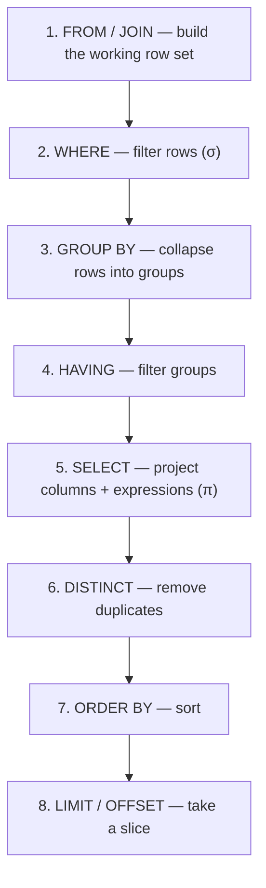

# SQL: SELECT, JOINs, GROUP BY, subqueries

[T01](./T01-relational-model-and-terminology.md) gave you the relational model; **SQL** is the declarative language for querying it, and it's the lingua franca of data — every backend engineer writes it daily. This is the largest topic in the chapter, and the single most important thing it will teach you is a **mindset shift**: SQL is **declarative and set-based**. You describe the *result set* you want — and the database's **optimizer** ([T01](./T01-relational-model-and-terminology.md)) decides *how* to compute it (which index, which join algorithm, what order). Thinking in **sets** (one query over all the rows) instead of **loops** (row-by-row, the imperative habit) is what separates SQL that scales from SQL that crawls. This topic covers the *query* half of SQL — `SELECT` and everything around it; data definition/manipulation (`CREATE`/`INSERT`/grants) is [T03](./T03-sql-ddl-dml-dcl.md).

The depth-bar: at the **language** layer, the **logical query-processing order** (the master key), `SELECT`/`WHERE`, the full **JOIN** family (and its two famous traps), **GROUP BY** + aggregates, **subqueries**, **CTEs**, and **window functions**. At the **architecture** layer — the heart — the **query executor**: how a declarative query becomes a physical plan, the three **join algorithms** (nested-loop / hash / merge), reading **`EXPLAIN ANALYZE`**, **index seek vs scan** and **sargability**, the **N+1** anti-pattern, and set-based vs row-based thinking.

> [!NOTE]
> Prerequisites: [Relational model & terminology](./T01-relational-model-and-terminology.md) (L2/C05/T01) — **relations, relational algebra (σ/π/⋈), `NULL` & three-valued logic, B-tree indexes, pages & the buffer pool, the optimizer**.

## The Logical Query-Processing Order

You *write* a query in one order, but the database *evaluates* it in another. Internalize this order and every SQL behaviour stops being a surprise:



This single picture explains the rules people memorize without understanding:

- **You can't reference a `SELECT` alias in `WHERE`** — `WHERE` (step 2) runs *before* `SELECT` (step 5), so the alias doesn't exist yet. But **you can in `ORDER BY`** (step 7, after `SELECT`).
- **Aggregates aren't allowed in `WHERE`** — grouping (step 3) hasn't happened yet; that's what `HAVING` (step 4) is for.
- **`WHERE` filters rows; `HAVING` filters groups** — they're at different stages.
- **`LIMIT` applies last** — which is why an `OFFSET` still does all the work of producing the earlier rows ([T01](./T01-relational-model-and-terminology.md) cursor-pagination payoff).

## SELECT and WHERE

**`SELECT`** is projection (π — [T01](./T01-relational-model-and-terminology.md)): pick columns, compute expressions, apply functions, alias with `AS`, and `DISTINCT` to dedup. **`WHERE`** is selection (σ): keep rows whose predicate is `TRUE`. The operators: comparisons (`= <> < >= …`), logical (`AND`/`OR`/`NOT`), and the special predicates **`IN`** (membership), **`BETWEEN`** (range), **`LIKE`** (pattern — `%` = any run, `_` = one char), and **`IS NULL`**. Remember the `NULL` three-valued logic from [T01](./T01-relational-model-and-terminology.md): `WHERE` keeps only `TRUE` rows, so any predicate that evaluates to `UNKNOWN` (anything compared to `NULL` with `=`) **silently drops the row** — use `IS NULL`/`IS NOT NULL`.

## JOINs

A join combines rows from multiple tables — the relational **⋈** ([T01](./T01-relational-model-and-terminology.md)), built as a Cartesian product filtered by a condition. The family:

| Join | Keeps |
|------|-------|
| **INNER JOIN** | only rows that match on both sides |
| **LEFT [OUTER] JOIN** | all **left** rows + matched right (NULLs where no match) |
| **RIGHT [OUTER] JOIN** | all **right** rows + matched left |
| **FULL [OUTER] JOIN** | all rows from **both** (NULLs where unmatched) |
| **CROSS JOIN** | the full **Cartesian product** (every pair) |
| **SELF JOIN** | a table joined to itself (hierarchies, comparisons) |

### The ON-vs-WHERE Outer-Join Trap

The most consequential JOIN subtlety. For an **outer** join, *where* you put a condition changes the result:

```sql
-- WRONG: silently becomes an INNER join — customers with no 2024 order vanish
SELECT c.name, o.id
FROM customers c
LEFT JOIN orders o ON c.id = o.customer_id
WHERE o.created_at >= '2024-01-01';      -- filters AFTER the join → drops the NULL rows

-- RIGHT: the condition is part of the join, NULLs preserved
SELECT c.name, o.id
FROM customers c
LEFT JOIN orders o ON c.id = o.customer_id AND o.created_at >= '2024-01-01';
```

The reason is the logical order: the `LEFT JOIN` (step 1) produces NULL-padded rows for unmatched customers, then `WHERE o.created_at >= …` (step 2) evaluates `NULL >= …` → `UNKNOWN` → those rows are **dropped**, collapsing the outer join into an inner one. **Conditions on the outer (null-able) table belong in `ON`; conditions on the preserved table can go in either.**

### Cartesian Explosion

A missing or wrong join condition (`FROM a, b` with no `WHERE`, or `JOIN … ON 1=1`) produces **N×M** rows — a "cartesian explosion" that can turn two 10k-row tables into 100M rows and hang the query. Always join on a real key. (And avoid `NATURAL JOIN`, which silently joins on *all* same-named columns — a refactor of an unrelated column name changes the query's meaning.)

## GROUP BY and Aggregates

**Aggregate functions** collapse many rows into one value: `COUNT`, `SUM`, `AVG`, `MIN`, `MAX`. Recall the `NULL` handling ([T01](./T01-relational-model-and-terminology.md)):

- **`COUNT(*)`** counts all rows; **`COUNT(col)`** counts non-`NULL` values of `col`; **`COUNT(DISTINCT col)`** counts distinct non-`NULL` values.
- `SUM`/`AVG`/`MIN`/`MAX` **skip `NULL`s** (so `AVG` is over the non-null count, not all rows).

**`GROUP BY`** partitions rows into groups and produces one output row per group. The hard rule: **every column in `SELECT` that isn't inside an aggregate must appear in `GROUP BY`** (otherwise the value would be ambiguous — which row's value should it show?). And **`HAVING` vs `WHERE`**:

```sql
SELECT customer_id, COUNT(*) AS orders
FROM orders
WHERE created_at >= '2024-01-01'   -- filter ROWS before grouping
GROUP BY customer_id
HAVING COUNT(*) > 5                 -- filter GROUPS after aggregation
ORDER BY orders DESC;
```

`WHERE` runs before grouping (you can't reference an aggregate there); `HAVING` runs after and *can* (and only should) reference aggregates. (`ROLLUP`/`CUBE`/`GROUPING SETS` extend this to multi-level subtotals.)

## Subqueries

A subquery is a query nested in another. By result shape: **scalar** (one value — usable in `SELECT` or a comparison), **column** (one column — for `IN`), **row**, and **table** (a **derived table** in `FROM`). The critical distinction is **correlated vs uncorrelated**:

- **Uncorrelated** — independent of the outer query; runs **once**.
- **Correlated** — references a column from the **outer** row, so it runs **once per outer row** → an O(n) hidden loop that's often the cause of a slow query (and usually rewritable as a `JOIN`).

The membership predicates: `IN`, `EXISTS`/`NOT EXISTS`, `ANY`/`ALL`. Two expert points:

- **`EXISTS` vs `IN`** — `EXISTS` stops at the first match (a semi-join) and handles `NULL` cleanly; `IN` materializes the list. Modern optimizers often treat them similarly, but `EXISTS` is the safe default for correlated checks.
- **The `NOT IN`-with-`NULL` trap** ([T01](./T01-relational-model-and-terminology.md) three-valued logic): if the subquery returns *any* `NULL`, `x NOT IN (1, 2, NULL)` is `x≠1 AND x≠2 AND x≠NULL` = `… AND UNKNOWN`, which is **never `TRUE`** → the query returns **no rows**. Use **`NOT EXISTS`** instead (it's `NULL`-safe).

## CTEs and Window Functions — Modern SQL

**Common Table Expressions** (`WITH name AS (…)`) are named subqueries that make complex queries readable and can be referenced multiple times. **Recursive CTEs** (`WITH RECURSIVE`) traverse hierarchies and graphs — an **anchor** query plus a **recursive member** that joins back to the CTE:

```sql
WITH RECURSIVE subordinates AS (
  SELECT id, manager_id, name FROM employees WHERE id = 1     -- anchor (the boss)
  UNION ALL
  SELECT e.id, e.manager_id, e.name                            -- recursive member
  FROM employees e JOIN subordinates s ON e.manager_id = s.id)
SELECT * FROM subordinates;                                    -- the whole org tree
```

**Window functions** compute a value **across a set of rows ("window") without collapsing them** — the key difference from `GROUP BY` (which collapses). `func() OVER (PARTITION BY … ORDER BY …)`:

- **Ranking** — `ROW_NUMBER()` (unique sequence), `RANK()`/`DENSE_RANK()` (ties), `NTILE(n)` (buckets).
- **Offset** — `LAG()`/`LEAD()` (the previous/next row's value — for row-over-row diffs).
- **Running aggregates** — `SUM(...) OVER (ORDER BY ...)` (a running total), moving averages, `FIRST_VALUE`/`LAST_VALUE`.

They're the modern replacement for clunky self-joins: **top-N per group** (`ROW_NUMBER() OVER (PARTITION BY category ORDER BY price DESC)` then filter `= 1…N`), de-duplication, running totals, and rankings — all in one pass, far faster and clearer. Finally, **set operations** combine query results: `UNION` (dedups — pays a sort/hash cost), **`UNION ALL`** (keeps duplicates — faster, use it when you know there are none), `INTERSECT`, `EXCEPT`.

## Memory & Architecture Layer — the Query Executor

A declarative query hides a lot of machinery. Understanding the executor is what turns "my query is slow" into a diagnosis.

### Logical Plan → Physical Plan

The parser turns SQL into a **logical plan** (a tree of relational-algebra operators — [T01](./T01-relational-model-and-terminology.md)); the **optimizer** rewrites it (e.g. push selections below joins) and chooses a **physical plan** by **estimating costs** from **statistics** — table row counts and per-column value distributions (histograms). Stale or missing statistics → bad estimates → bad plans (the classic cause of a query that "suddenly got slow"). The plan specifies, for each step, *how* to do it.

### Join Algorithms

The biggest physical choice is *how* to join. Three algorithms, each best in different conditions:

| Algorithm | How it works | Cost | Best when |
|-----------|--------------|------|-----------|
| **Nested-loop** | for each outer row, look up matches in the inner | O(n·m) naive; **O(n·log m)** with an index on the inner key | small outer + **indexed** inner |
| **Hash join** | build a hash table on the smaller input, probe with the larger | **O(n+m)** (needs memory; spills to disk if too big) | large, **unindexed** **equi**-joins |
| **Merge join** | sort both inputs on the join key, merge in one linear pass | **O(n+m)** after sort (free if indexes already provide order) | inputs already sorted (index order) |

The optimizer picks based on table sizes, indexes, and whether the join is an equi-join — and getting the *wrong* algorithm (a nested-loop over two huge unindexed tables) is a common cause of a query that runs for minutes.

### Reading EXPLAIN

**`EXPLAIN`** shows the chosen plan; **`EXPLAIN ANALYZE`** *runs* it and shows **actual** timings and row counts. It is the single most important query-tuning tool. Read it for: the **scan type** (a `Seq Scan` over a big table where you expected an `Index Scan`/`Index Seek` is a red flag), the **join algorithm**, and — crucially — a large gap between **estimated and actual rows** (which means stale statistics misled the optimizer).

### Index Seek vs Scan, and Sargability

This pays off T01's B-tree. A predicate on an **indexed** column lets the database **seek** to the rows via the B-tree — **O(log n)** — instead of a full **sequential scan** — **O(n)**. A predicate is **sargable** (*Search-ARGument-able*) if it can use an index. These **kill sargability** and force a scan:

- A **function on the column** — `WHERE UPPER(name) = 'ADA'` can't use an index on `name` (the index stores `name`, not `UPPER(name)`); use a **functional/expression index** or store a normalized column.
- A **leading wildcard** — `LIKE '%ada'` can't seek (the B-tree is ordered left-to-right); `LIKE 'ada%'` *can*.
- **Implicit type conversion** (comparing an indexed `VARCHAR` to a number), and `OR` across different columns.

A **covering index** (one that contains *all* the columns the query needs) lets the database answer entirely from the index without fetching the row — an "index-only scan."

### The N+1 Problem and Set-Based Thinking

The most common application-side performance bug, and the bridge back to [C04/T04](../C04-web-and-rest-basics/T04-content-negotiation-and-serialization-json-xml-jackson.md)'s ORM warning. The **N+1 problem**: you fetch a list (1 query), then loop and fetch each item's related data (N more queries) — `1 + N` round-trips, each with network + parse + plan overhead. The fix is **one `JOIN`** (or a single batched `IN (…)`), letting the database do the work as a **set** operation.

This is the deep mindset of SQL: **set-based, not row-based.** A row-by-row loop (whether in your app or an SQL cursor) defeats everything the database is built to optimize — join algorithms, index seeks, parallelism, vectorized execution. Express the goal as **one declarative query over the whole set**, and let the optimizer find the fast physical plan. "Can I do this in one query instead of a loop?" is the question that fixes most slow data code.

> [!IMPORTANT]
> SQL is **declarative and set-based**: you describe the *result set* and the optimizer chooses *how* (which join algorithm, which index, what order — [T01](./T01-relational-model-and-terminology.md)). The #1 performance mindset is to express your goal as **one query over the whole set**, not a row-by-row loop (the **N+1** anti-pattern — [C04/T04](../C04-web-and-rest-basics/T04-content-negotiation-and-serialization-json-xml-jackson.md)). When a query is slow, read **`EXPLAIN ANALYZE`** — a `Seq Scan` where you expected an index seek usually means a **non-sargable** predicate or **stale statistics**.

> [!WARNING]
> Two traps return *wrong answers with no error*. **(1)** A condition on the outer (nullable) table of a `LEFT JOIN` belongs in **`ON`, not `WHERE`** — in `WHERE` it filters out the NULL rows and **silently turns the outer join into an inner join**, dropping the "no match" rows you wanted. **(2)** `NOT IN (subquery)` returns **no rows** if the subquery yields any `NULL` (three-valued logic — [T01](./T01-relational-model-and-terminology.md)); use **`NOT EXISTS`** instead.

> [!TIP]
> Master the **logical query-processing order** — it explains alias scoping (`ORDER BY` yes, `WHERE` no), aggregate placement (`HAVING` not `WHERE`), and how to read any query top-down. And reach for **window functions** (`ROW_NUMBER`/`RANK`/running-`SUM` `OVER(…)`) instead of self-joins for ranking, **top-N-per-group**, and running totals — one pass, clearer, and faster.

## Common Mistakes

### The Outer-Join `WHERE` Trap

Putting an outer-table condition in `WHERE` collapses the `LEFT JOIN` to an `INNER JOIN`. Put it in `ON` (see the warning).

### `NOT IN` With Nullable Subqueries

Any `NULL` makes it return no rows. Use `NOT EXISTS`.

### Non-Grouped Column / Aggregate in `WHERE`

Every non-aggregated `SELECT` column must be in `GROUP BY`; aggregates go in `HAVING`, not `WHERE` (the logical order).

### Correlated Subquery Where a JOIN Would Do

A correlated subquery runs per outer row (O(n)); a join is one set operation. Rewrite it.

### Cartesian Explosion

A missing join condition multiplies rows N×M. Always join on a real key; avoid `NATURAL JOIN`.

### Non-Sargable Predicates

A function on the column or a leading `LIKE '%…'` forces a full scan. Use a functional index or restructure the predicate.

### `COUNT(col)` vs `COUNT(*)` Confusion

`COUNT(col)` skips nulls; `COUNT(*)` counts rows. Easy to get a wrong total on a nullable column.

### `SELECT *` Over a Join

Ambiguous/duplicate column names, wasted I/O, and broken covering-index opportunities. Select the columns you use.

### Row-by-Row N+1

A list query + per-row queries. Replace with one `JOIN` or a batched `IN` ([C04/T04](../C04-web-and-rest-basics/T04-content-negotiation-and-serialization-json-xml-jackson.md)).

> [!INTERVIEW]
> SQL is the most-tested practical backend skill — the standout answers explain the **logical order**, the **join traps**, and the **executor** (algorithms, EXPLAIN, sargability).
>
> 1. **The logical query-processing order?** `FROM`/`JOIN` → `WHERE` → `GROUP BY` → `HAVING` → `SELECT` → `DISTINCT` → `ORDER BY` → `LIMIT`. Explains alias scoping and aggregate placement.
> 2. **INNER vs LEFT/RIGHT/FULL vs CROSS join?** Matching only / all-left+matched / mirror / all-both / Cartesian product.
> 3. **The ON-vs-WHERE outer-join trap?** An outer-table condition in `WHERE` drops the NULL rows → turns `LEFT` into `INNER`; put it in `ON`.
> 4. **`WHERE` vs `HAVING`?** `WHERE` filters rows pre-grouping; `HAVING` filters groups post-aggregation (aggregates only in `HAVING`).
> 5. **`COUNT(*)` vs `COUNT(col)` vs `COUNT(DISTINCT col)`?** All rows / non-null values / distinct non-null values.
> 6. **Correlated vs uncorrelated subquery?** Correlated references the outer row → runs per outer row (slow); uncorrelated runs once.
> 7. **`EXISTS` vs `IN`, and the `NOT IN`-NULL trap?** `EXISTS` short-circuits and is NULL-safe; `NOT IN` with a NULL returns no rows → use `NOT EXISTS`.
> 8. **CTE / recursive CTE?** A named subquery (`WITH`); recursive (anchor + recursive member) for trees/graphs.
> 9. **Window functions?** `OVER (PARTITION BY … ORDER BY …)` computes across a window **without collapsing** rows — `ROW_NUMBER`/`RANK`/`LAG`/running-`SUM`; the modern way to do top-N-per-group and running totals.
> 10. **The three join algorithms?** Nested-loop (small + indexed inner), hash (large unindexed equi-join, O(n+m)), merge (sorted inputs, O(n+m)).
> 11. **What does `EXPLAIN ANALYZE` show?** The physical plan — scan/join types, **estimated vs actual** rows, cost; the query-tuning tool.
> 12. **What is sargability?** Whether a predicate can use an index; killed by a function on the column, a leading wildcard, or implicit type conversion.
> 13. **The N+1 problem and the fix?** 1 list query + N per-row queries → one `JOIN` (or batched `IN`); set-based, not row-based.
> 14. **`UNION` vs `UNION ALL`?** `UNION` dedups (sort/hash cost); `UNION ALL` keeps duplicates (faster).

## Practice

1. **Joins.** Write `INNER`/`LEFT`/`RIGHT`/`FULL`/`CROSS` joins on two tables; compare the row sets.
2. **The trap.** Reproduce the `LEFT JOIN` + outer-`WHERE` collapse; move the condition to `ON`; watch the NULL rows return.
3. **Group + having.** `GROUP BY` with `COUNT`/`SUM`; add `HAVING`; show `WHERE` can't filter an aggregate.
4. **COUNT variants.** Compare `COUNT(*)`, `COUNT(col)`, `COUNT(DISTINCT col)` on a nullable column.
5. **Subquery → join.** Write a correlated subquery; rewrite as a `JOIN`; compare `EXPLAIN`.
6. **NOT IN trap.** Reproduce the empty result from `NOT IN` with a NULL; fix with `NOT EXISTS`.
7. **Recursive CTE.** Walk an org chart / category tree with `WITH RECURSIVE`.
8. **Windows.** `ROW_NUMBER` for top-N per group; a running `SUM`; `LAG` for a row-over-row delta.
9. **EXPLAIN.** `EXPLAIN ANALYZE` a join; identify the algorithm; observe a nested-loop vs hash join as table sizes change.
10. **Index seek vs scan.** Index a filtered column; compare `EXPLAIN` (seq scan → index scan); measure timings.
11. **Sargability.** Make a predicate non-sargable (`UPPER(col)=…` or `LIKE '%x'`); observe the seq scan; fix it.
12. **Explosion.** Cause a cartesian explosion with a missing join condition; fix it.
13. **UNION.** Compare `UNION` vs `UNION ALL` on duplicates and timing.
14. **N+1.** Turn an app-side per-row loop into one `JOIN`; count the queries before/after.
15. **Logical order.** Label which clause runs when for a full query; explain why an alias works in `ORDER BY` but not `WHERE`.
16. **Explain it back.** For `SELECT c.name, COUNT(o.id) FROM customers c LEFT JOIN orders o ON c.id=o.customer_id WHERE o.created_at >= '2024-01-01' GROUP BY c.name HAVING COUNT(o.id) > 5 ORDER BY 2 DESC`, (a) walk the logical order, (b) spot and fix the `LEFT JOIN`/`WHERE` trap, (c) say which index + join algorithm would help, and (d) why the count is in `HAVING` not `WHERE`.

## Recap

You should now be able to:

- Apply the **logical query-processing order** (`FROM`→`WHERE`→`GROUP BY`→`HAVING`→`SELECT`→`DISTINCT`→`ORDER BY`→`LIMIT`) to explain alias scoping and aggregate placement, and to read any query.
- Write all **JOIN** types and avoid the **ON-vs-WHERE outer-join trap** and **cartesian explosions**.
- Use **GROUP BY + aggregates** with the `NULL`-skip rules and the `COUNT` variants, and **`HAVING` vs `WHERE`** correctly.
- Write **subqueries** (scalar/derived, **correlated vs uncorrelated**), use `EXISTS`/`IN` correctly, and avoid the **`NOT IN`-with-`NULL`** trap (`NOT EXISTS`).
- Use **CTEs** (incl. **recursive** for hierarchies) and **window functions** (`ROW_NUMBER`/`RANK`/`LAG`/running-`SUM`) for ranking, top-N-per-group, and running totals — plus set operations (`UNION`/`UNION ALL`).
- Reason about the **executor**: logical→physical planning from statistics, the three **join algorithms** (nested-loop/hash/merge), reading **`EXPLAIN ANALYZE`**, **index seek vs scan** and **sargability** (the [T01](./T01-relational-model-and-terminology.md) B-tree payoff), and the **N+1**/**set-based-vs-row-based** mindset — avoiding the traps (outer-join `WHERE`, `NOT IN` nulls, correlated-where-join-fits, non-sargable predicates, `SELECT *`, N+1).

## Next

Continue to [SQL: DDL/DML/DCL](./T03-sql-ddl-dml-dcl.md).
