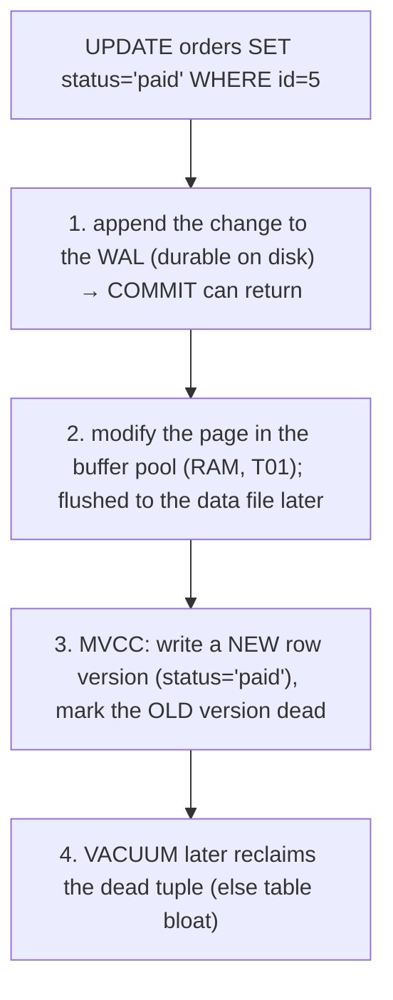

# SQL: DDL/DML/DCL

[T02](./T02-sql-select-joins-group-by-subqueries.md) covered **querying** — `SELECT` and everything around reading data. This topic covers the rest of SQL: the commands that **define** the schema (DDL), **change** the data (DML), and **control access** (DCL) — plus the **transaction control** (TCL) that binds changes into atomic units. These are the statements you run to build and operate a database, and several of them carry production-grade danger: an `ALTER` on a large table can lock it for an outage, and an `UPDATE` without a `WHERE` clause is the most famous one-line catastrophe in our field. Knowing not just the syntax but *what each command does to the storage and catalog underneath* is what separates a safe change from an incident.

The depth-bar: at the **language** layer, the SQL sub-languages and their commands, **constraints** and **data types** (with the money/time pitfalls), and the UPSERT and access-control statements. At the **architecture** layer — the heart — the **system catalog** that DDL edits, **table-rewrite locks** (why migrations are an ops concern), the **write-ahead log + MVCC** behind every DML change (and the `DELETE`-vs-`TRUNCATE` gap), and **sequences/auto-increment** internals.

> [!NOTE]
> Prerequisites: [Relational model & terminology](./T01-relational-model-and-terminology.md) (L2/C05/T01) — **tables, domains/types, constraints, integrity, pages, the buffer pool**; [SQL: SELECT, JOINs, …](./T02-sql-select-joins-group-by-subqueries.md) (L2/C05/T02) — **`SELECT`, used inside `INSERT … SELECT` and `UPDATE … FROM`**.

## The SQL Sub-Languages

SQL is really several languages with one syntax. Knowing the categories organizes everything:

| Sub-language | Commands | Purpose |
|--------------|----------|---------|
| **DDL** — Data Definition | `CREATE`, `ALTER`, `DROP`, `TRUNCATE` | define/change **structure** |
| **DML** — Data Manipulation | `INSERT`, `UPDATE`, `DELETE`, `MERGE` | change **data** |
| **DQL** — Data Query | `SELECT` | read data ([T02](./T02-sql-select-joins-group-by-subqueries.md)) |
| **DCL** — Data Control | `GRANT`, `REVOKE` | **permissions** |
| **TCL** — Transaction Control | `COMMIT`, `ROLLBACK`, `SAVEPOINT` | **transactions** ([T06](./T06-transactions-and-acid.md)) |

The key architectural divide: **DDL changes metadata** (the catalog, plus possibly storage), **DML changes data** (rows, via the log), and **DCL changes permissions** (catalog grants). That split predicts how each behaves.

## DDL — Defining Structure

### CREATE TABLE

A `CREATE TABLE` names columns with **types** (domains — [T01](./T01-relational-model-and-terminology.md)) and attaches **constraints** (the integrity rules — deeper in [T05](./T05-keys-constraints-and-relationships.md)):

```sql
CREATE TABLE orders (
  id          BIGINT GENERATED ALWAYS AS IDENTITY PRIMARY KEY,  -- surrogate key
  customer_id BIGINT NOT NULL REFERENCES customers(id) ON DELETE RESTRICT,
  total       NUMERIC(12,2) NOT NULL CHECK (total >= 0),        -- exact money
  status      VARCHAR(20) NOT NULL DEFAULT 'new',
  created_at  TIMESTAMPTZ NOT NULL DEFAULT now(),
  UNIQUE (customer_id, created_at)
);
```

The constraint vocabulary: **`PRIMARY KEY`** (entity integrity — [T01](./T01-relational-model-and-terminology.md)), **`FOREIGN KEY`/`REFERENCES`** (referential integrity, with `ON DELETE`/`ON UPDATE` actions `CASCADE`/`SET NULL`/`RESTRICT`/`NO ACTION`), **`UNIQUE`**, **`NOT NULL`**, **`CHECK`** (domain rules), and **`DEFAULT`**.

**Data types** matter more than beginners expect:

- **Money → `NUMERIC`/`DECIMAL`, never `FLOAT`/`DOUBLE`.** Binary floating point can't represent `0.10` exactly, so `0.10 + 0.20 ≠ 0.30` — a rounding bug in financial code (the same precision issue as JSON numbers — [C04/T04](../C04-web-and-rest-basics/T04-content-negotiation-and-serialization-json-xml-jackson.md)). `DECIMAL` is exact.
- **Instants → `TIMESTAMPTZ`** (timestamp with time zone), not naive `TIMESTAMP` — store an unambiguous point in time, convert for display.
- Plus the usual `INTEGER`/`BIGINT`, `VARCHAR`/`TEXT`, `BOOLEAN`, `DATE`, `JSON`/`JSONB`, `UUID`, and arrays.

### ALTER, DROP, TRUNCATE

- **`ALTER TABLE`** — `ADD`/`DROP`/`RENAME COLUMN`, `ALTER COLUMN TYPE`, `ADD`/`DROP CONSTRAINT`. Some forms are instant (catalog-only); others **rewrite the whole table** (architecture below).
- **`DROP`** removes the object entirely; **`TRUNCATE`** empties a table *fast* (it's DDL — it deallocates pages rather than deleting rows one at a time); **`DELETE`** (DML) removes rows you select with `WHERE`. The three differ sharply in speed and semantics — see the DML section and the warning.
- **Indexes** are DDL too: `CREATE INDEX` builds the B-tree ([T01](./T01-relational-model-and-terminology.md)); `CREATE INDEX CONCURRENTLY` builds it without locking writes; **partial**, **functional/expression**, and **composite** indexes target specific query shapes ([T02](./T02-sql-select-joins-group-by-subqueries.md) sargability). **Views** (`CREATE VIEW`) store a query as a virtual table ([T08](./T08-stored-procedures-views-triggers.md)).

## DML — Changing Data

- **`INSERT`** — `INSERT INTO t (cols) VALUES (…), (…)` (multi-row), or **`INSERT … SELECT`** to load from a query ([T02](./T02-sql-select-joins-group-by-subqueries.md)), or `… RETURNING id` to get the generated key back in one round-trip.
- **`UPDATE`** — `UPDATE t SET col = … WHERE …`; **`UPDATE … FROM`** joins another table into the update. (No `WHERE` ⇒ **every row** changes — see the warning.)
- **`DELETE`** — `DELETE FROM t WHERE …`. Versus `TRUNCATE`: `DELETE` is row-by-row (fires triggers, writes per-row log, is fully rollback-able and `WHERE`-filtered); `TRUNCATE` is a bulk page-deallocation (fast, resets identity, skips triggers).
- **`MERGE` / UPSERT** — insert-or-update in one atomic statement: the SQL-standard `MERGE`, PostgreSQL `INSERT … ON CONFLICT (key) DO UPDATE`, MySQL `INSERT … ON DUPLICATE KEY UPDATE`. This is the **idempotent-write** pattern (the database-level cousin of HTTP idempotency keys — [C04/T01](../C04-web-and-rest-basics/T01-http-in-depth-methods-status-headers.md)): re-running the same upsert converges to the same state.

And the set-based reminder from [T02](./T02-sql-select-joins-group-by-subqueries.md): `UPDATE`/`DELETE` operate on a **set** — one statement over all matching rows, never a row-by-row loop.

## DCL — Controlling Access

**`GRANT`** and **`REVOKE`** assign privileges (`SELECT`/`INSERT`/`UPDATE`/`DELETE`/`EXECUTE`/`ALL`) on objects (tables, views, schemas) to **users** and **roles** (a role groups privileges and can be granted to many users). The security principle is **least privilege**: the application's database user should hold only the privileges it needs — typically `SELECT`/`INSERT`/`UPDATE`/`DELETE` on its tables, and **not** `DROP`/`ALTER`/`GRANT`. A compromised app with an over-privileged DB account turns a code bug into a database-destroying incident. (Postgres adds **row-level security** for per-row access rules.)

## TCL — Transaction Control (preview)

`BEGIN`/`START TRANSACTION` … `COMMIT` (make it durable) or `ROLLBACK` (undo it), with `SAVEPOINT` for partial rollback. A transaction binds several DML statements into one **atomic** unit — all or nothing (the **A** in ACID — [T06](./T06-transactions-and-acid.md)). Two notes you need now: most tools run in **autocommit** mode (each statement is its own transaction) unless you `BEGIN`; and crucially, **whether DDL is transactional differs by database** — PostgreSQL can `ROLLBACK` a `CREATE`/`ALTER`, but **MySQL and Oracle auto-commit DDL** (it can't be undone). [T06](./T06-transactions-and-acid.md) is the full treatment.

## Memory & Architecture Layer

### The System Catalog — Schema Is Itself Relational

A `CREATE TABLE` doesn't conjure a table from nothing — it **inserts rows into the database's own catalog tables** (PostgreSQL's `pg_catalog`/`information_schema`, the **data dictionary**). The schema is *stored relationally* — a meta-circular design where the database describes itself in its own tables. So DDL is, mechanically, mostly **catalog writes** plus allocating storage for the new object; and the **query planner** ([T02](./T02-sql-select-joins-group-by-subqueries.md)) reads the catalog to know what columns, types, indexes, and statistics exist. You can query the catalog (`SELECT * FROM information_schema.columns …`) to introspect any database.

### DDL Locks & Table Rewrites — Why Migrations Are an Ops Concern

This is the DDL fact that causes real outages. Many `ALTER`s are **not** cheap metadata edits — they **rewrite the entire table** (copy every row into new pages) while holding an **`ACCESS EXCLUSIVE` lock** that blocks *all* reads and writes for the duration ([T07](./T07-isolation-levels-and-locking.md) locking):

- Cheap (catalog-only, instant): adding a **nullable** column, or (PostgreSQL 11+) a column with a **constant** `DEFAULT`; renaming a column.
- Expensive (full rewrite + long lock): changing a column's **type**, adding a column with a **volatile** default, some constraint additions, `VACUUM FULL`.

On a 100-million-row table, a careless `ALTER` can lock the table for *minutes to hours* — a self-inflicted outage. The mitigations are an architectural discipline: build indexes with **`CREATE INDEX CONCURRENTLY`**, add a constraint as `NOT VALID` then `VALIDATE` separately, and use **online-DDL tools** (`pt-online-schema-change`, `gh-ost`) that copy the table in the background and swap it in. **Schema migrations on large tables are production-affecting operations**, not one-liners — which is why teams version them as code ([Java angle](#java-angle)).

### DML, the Write-Ahead Log, and MVCC

A DML change isn't a naive in-place overwrite. Two mechanisms (full in [T06](./T06-transactions-and-acid.md), but the *why* matters here):




- **Write-ahead log (WAL).** Before a change touches the data pages, the database records it in the **WAL** — an append-only log on durable storage. This gives **durability** (the **D** in ACID): after a commit, even a crash can't lose the change, because it's replayed from the log on recovery. So every `INSERT`/`UPDATE`/`DELETE` writes to the WAL first, then the page in the buffer pool ([T01](./T01-relational-model-and-terminology.md)).
- **MVCC (Multi-Version Concurrency Control).** Rather than overwrite a row, PostgreSQL writes a **new row version** and marks the old one dead; readers see the version valid for their transaction (so readers never block writers — [T07](./T07-isolation-levels-and-locking.md)). The consequence: `UPDATE`/`DELETE` leave **dead tuples** that **`VACUUM`** later reclaims, and a table can bloat under heavy churn.

This is the storage-level reason **`TRUNCATE` is dramatically faster than `DELETE`**: `DELETE` versions and logs *every* row (MVCC + WAL); `TRUNCATE` just deallocates the table's pages wholesale. It's also why a giant `DELETE`/`UPDATE` can be slow and bloating, and is often better done in batches.

### Sequences & Auto-Increment

Generated keys come from a **sequence** (PostgreSQL `SEQUENCE`/`SERIAL`/`GENERATED … AS IDENTITY`) or MySQL `AUTO_INCREMENT`. The architectural surprises:

- **Sequences are non-transactional counters.** A rolled-back `INSERT` still **consumed** its number — so **gaps are normal**; never assume ids are contiguous (or that "max id" equals "row count").
- At very high insert rates the central counter can be a **contention point**; databases cache blocks of values per connection to mitigate it (which can reorder ids).
- **UUID/ULID** keys avoid the central counter (good for distributed inserts and avoiding the IDOR/enumeration leak — [C04/T03](../C04-web-and-rest-basics/T03-api-design-resources-versioning-pagination-filtering.md)), at the cost of index locality — a random UUID scatters InnoDB clustered-index inserts ([T01](./T01-relational-model-and-terminology.md)), so a *sortable* ULID is the better surrogate when both matter.

### Java Angle

You run DDL/DML from JDBC ([T09](./T09-jdbc-and-connection-pooling-hikaricp.md)) via `executeUpdate`/`execute`. Three production rules: **(1) version your schema changes** with **Flyway** or **Liquibase** — ordered, repeatable migrations checked into source control and applied by the build/deploy pipeline ([C02](../C02-build-tools-and-workflow/T01-maven-lifecycle-pom-dependencies-plugins.md) echo) — never `ALTER` production by hand. **(2)** Always use **`PreparedStatement`** with bound parameters — never concatenate user input into SQL — to prevent **SQL injection** (full in [T09](./T09-jdbc-and-connection-pooling-hikaricp.md)). **(3)** Give the app's DB user **least privilege** (DCL).

> [!IMPORTANT]
> **DDL is mostly metadata; DML is mostly data + write-ahead log.** A `CREATE TABLE` is cheap (catalog writes), but an `ALTER TABLE` on a large table can **rewrite every row under an `ACCESS EXCLUSIVE` lock** — a real outage, not a one-liner ([T07](./T07-isolation-levels-and-locking.md)). Plan schema migrations like production-affecting operations: `CREATE INDEX CONCURRENTLY`, `NOT VALID` constraints, online-DDL tools, and **versioned migrations** (Flyway/Liquibase) — never hand-`ALTER` prod.

> [!WARNING]
> **`UPDATE`/`DELETE` without a `WHERE` clause changes or erases EVERY row** — the most famous one-line database catastrophe. Write the `WHERE` first; preview with a `SELECT` using the same `WHERE`; and wrap risky changes in a transaction you can `ROLLBACK` ([T06](./T06-transactions-and-acid.md)). And remember **`TRUNCATE` and DDL auto-commit in MySQL/Oracle** — they *cannot* be rolled back there (unlike PostgreSQL, where DDL is transactional).

> [!TIP]
> **Never concatenate user input into SQL** — use **parameterized queries / `PreparedStatement`** (SQL injection is the #1 web-app vulnerability — [T09](./T09-jdbc-and-connection-pooling-hikaricp.md)). Use **`DECIMAL`/`NUMERIC` for money** (never `FLOAT`), **`TIMESTAMPTZ`** for instants, and grant the app DB user the **least privilege** it needs (DCL) — not `DROP`/`ALTER`.

## Common Mistakes

### `UPDATE`/`DELETE` Without `WHERE`

Changes/erases every row. Preview with a `SELECT`, and use a transaction (see the warning).

### `FLOAT` for Money

Binary floating point can't represent decimals exactly → rounding bugs. Use `DECIMAL`/`NUMERIC` ([C04/T04](../C04-web-and-rest-basics/T04-content-negotiation-and-serialization-json-xml-jackson.md) precision echo).

### Timezone-Naive Timestamps

Storing instants as naive `TIMESTAMP` loses the offset. Use `TIMESTAMPTZ`.

### `ALTER` on a Big Table Under Load

A type change or volatile-default add rewrites the table under an exclusive lock → outage. Use online DDL / `CONCURRENTLY` / `NOT VALID`.

### `DELETE` Where `TRUNCATE` Fits (or Vice Versa)

`DELETE` of a whole table is slow (per-row WAL/MVCC); use `TRUNCATE`. But `TRUNCATE` skips triggers and (in MySQL/Oracle) can't be rolled back — use `DELETE` when you need those.

### SQL Injection

Concatenating user input into SQL. Always parameterize ([T09](./T09-jdbc-and-connection-pooling-hikaricp.md)).

### Over-Broad `GRANT`s

The app user with `DROP`/`ALTER`/superuser turns a bug into a catastrophe. Least privilege.

### Relying on Contiguous Auto-Increment Ids

Rolled-back inserts leave gaps; ids aren't a row count and aren't gapless.

### Hand-Editing Prod Schema

Untracked `ALTER`s drift environments and can't be rolled back as a unit. Use **versioned migrations** (Flyway/Liquibase).

> [!INTERVIEW]
> DDL/DML/DCL questions probe whether you understand the *consequences* (locks, WAL, injection), not just the syntax.
>
> 1. **The SQL sub-languages?** DDL (`CREATE`/`ALTER`/`DROP`/`TRUNCATE`), DML (`INSERT`/`UPDATE`/`DELETE`/`MERGE`), DQL (`SELECT`), DCL (`GRANT`/`REVOKE`), TCL (`COMMIT`/`ROLLBACK`).
> 2. **`DROP` vs `TRUNCATE` vs `DELETE`?** DROP removes the object; TRUNCATE empties fast (DDL — deallocate pages, reset identity, skip triggers, often non-rollbackable); DELETE removes `WHERE`-selected rows (DML — per-row WAL/triggers, rollbackable).
> 3. **Why `DECIMAL` not `FLOAT` for money?** Binary FP can't represent decimals exactly → rounding errors; DECIMAL is exact.
> 4. **What is UPSERT/`MERGE`?** Insert-or-update in one statement (`ON CONFLICT`/`ON DUPLICATE KEY`/`MERGE`) — idempotent writes.
> 5. **What happens physically on `ALTER TABLE`?** Catalog edits, and possibly a **full table rewrite** under an exclusive lock — an outage risk on big tables; use online DDL.
> 6. **Where is the schema stored?** In the **system catalog / data dictionary** (`information_schema`/`pg_catalog`) — schema is itself relational.
> 7. **What is the WAL, and DML's relation to it?** The write-ahead log records changes before applying them → durability/crash recovery (the **D** in ACID — [T06](./T06-transactions-and-acid.md)).
> 8. **Why does `TRUNCATE` beat `DELETE`?** `DELETE` versions + logs every row (MVCC + WAL); `TRUNCATE` deallocates pages wholesale.
> 9. **Are auto-increment ids contiguous?** No — rolled-back inserts consume numbers; gaps are normal; don't equate max-id with row count.
> 10. **How do you prevent SQL injection?** Parameterized queries / `PreparedStatement`; never concatenate input ([T09](./T09-jdbc-and-connection-pooling-hikaricp.md)).
> 11. **DCL / least privilege?** `GRANT`/`REVOKE` on roles; the app user gets only what it needs, not DDL/superuser.
> 12. **Is DDL transactional?** PostgreSQL: yes (`ROLLBACK`-able); MySQL/Oracle: DDL **auto-commits** — a migration gotcha.
> 13. **What is MVCC, and a consequence?** Multi-version concurrency: writes create new row versions (readers don't block writers); leftover dead tuples need `VACUUM` and can bloat a churny table.

## Practice

1. **Create with constraints.** `CREATE TABLE` with PK, FK (`ON DELETE CASCADE`), `UNIQUE`, `NOT NULL`, `CHECK`, `DEFAULT`; insert valid and constraint-violating rows.
2. **Types.** Use `NUMERIC` for money and `TIMESTAMPTZ` for an instant; demonstrate the `0.1 + 0.2` rounding error with `FLOAT`.
3. **ALTER cost.** Add a nullable column (instant) vs change a column type (rewrite); observe the timing/lock difference.
4. **DROP/TRUNCATE/DELETE.** Compare behaviour + speed on a large table; check identity reset and rollback-ability.
5. **INSERT … SELECT / RETURNING.** Load rows from a query; return the generated id.
6. **UPDATE … FROM + the near-miss.** Update via a join; in a transaction, run an `UPDATE` with no `WHERE`, see the row count, then `ROLLBACK`.
7. **UPSERT.** `INSERT … ON CONFLICT DO UPDATE`; run it twice; confirm idempotency.
8. **DCL.** Create a role, `GRANT SELECT/INSERT` only; verify it **can't** `DROP` or `ALTER`.
9. **Sequence gaps.** Roll back an insert; observe the consumed (gapped) id.
10. **SQL injection (sandbox).** Build a query by concatenation; inject (`' OR 1=1 --`); fix with a parameterized query.
11. **Migration.** Write a Flyway/Liquibase versioned migration and apply it.
12. **Transactional DDL.** In PostgreSQL: `BEGIN; ALTER …; ROLLBACK;` — confirm it's undone; contrast MySQL's auto-commit.
13. **Catalog.** Query `information_schema`/`pg_catalog` to list a table's columns, types, and constraints.
14. **Explain it back.** For `ALTER TABLE orders ADD COLUMN status VARCHAR DEFAULT 'new' NOT NULL` on a 100M-row table, trace (a) the catalog change, (b) whether/why it rewrites the table and locks it, (c) the safer migration approach, (d) why a missing-`WHERE` `UPDATE` is a disaster, and (e) the WAL/MVCC role in DML.

## Recap

You should now be able to:

- Place every statement in its **sub-language** (DDL/DML/DCL/TCL/DQL) and predict its behaviour from the **metadata-vs-data-vs-permissions** divide.
- Write **DDL** — `CREATE TABLE` with the full constraint set, choose **types** correctly (`DECIMAL` for money, `TIMESTAMPTZ` for instants), and know `ALTER`/`DROP`/`TRUNCATE` and their costs.
- Write **DML** — `INSERT`/`INSERT … SELECT`/`RETURNING`, `UPDATE`/`UPDATE … FROM`, `DELETE`, and **UPSERT/`MERGE`** — set-based, with a `WHERE`.
- Use **DCL** (`GRANT`/`REVOKE`/roles, **least privilege**) and **TCL** (`COMMIT`/`ROLLBACK`/`SAVEPOINT`, the transactional-DDL gotcha — [T06](./T06-transactions-and-acid.md)).
- Reason about the **architecture**: DDL editing the **system catalog**, **table-rewrite locks** (why migrations are an ops concern — [T07](./T07-isolation-levels-and-locking.md)), DML's **write-ahead log + MVCC** (the **D** in ACID, and the `DELETE`-vs-`TRUNCATE` gap — [T06](./T06-transactions-and-acid.md)), and **sequence/auto-increment** internals — and avoid the traps (missing `WHERE`, `FLOAT` money, naive timestamps, locking `ALTER`s, SQL injection, over-broad grants, gapless-id assumptions, hand-edited prod schema).

## Next

Continue to [Normalization & denormalization](./T04-normalization-and-denormalization.md).
