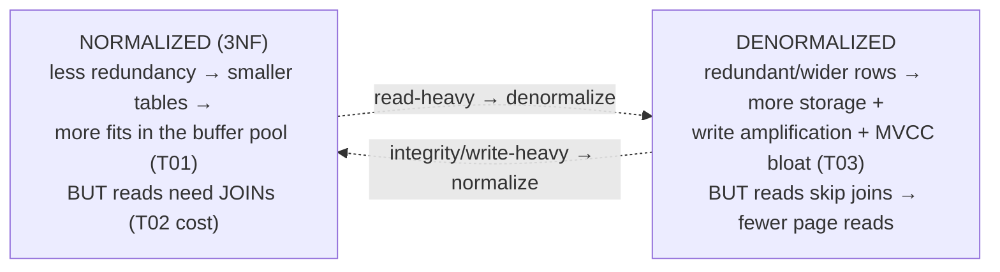

# Normalization & denormalization

[T01](./T01-relational-model-and-terminology.md) gave you the relational model; this topic is about **designing the schema well** — the difference between a database that stays correct as it grows and one that quietly rots into inconsistency. **Normalization** is the discipline of structuring tables so that every fact lives in exactly **one place**, eliminating the redundancy that causes data to drift out of sync. **Denormalization** is the deliberate, measured *reversal* of some of that — reintroducing redundancy to make reads faster — and the art is knowing when the trade is worth it. The two are the yin and yang of schema design: normalization optimizes for **integrity**, denormalization for **read performance**, and a real system balances them per workload.

The depth-bar: at the **language** layer, the **anomalies** redundancy causes, **functional dependencies** (the formal basis), the **normal forms** (1NF→BCNF) with worked before/after examples, and **denormalization** with its sync burden. At the **architecture** layer — the heart — the **storage vs join-cost** trade-off (buffer pool + join algorithms), the **OLTP-normalized vs OLAP-star-schema** split, **materialized views** as managed denormalization, and the deep **consistency-by-construction vs consistency-by-effort** axis.

> [!NOTE]
> Prerequisites: [Relational model & terminology](./T01-relational-model-and-terminology.md) (L2/C05/T01) — **relations, keys, functional dependencies, integrity, pages & the buffer pool, row- vs column-store**; [SQL: SELECT, JOINs, …](./T02-sql-select-joins-group-by-subqueries.md) (L2/C05/T02) — **joins and their cost (the price of normalization)**.

## Why Normalize? The Anomalies

The temptation is to throw everything into one wide table. The problem is **redundancy** — storing the same fact in many rows — and the three **anomalies** it breeds:

| Anomaly | What goes wrong |
|---------|-----------------|
| **Update anomaly** | a fact stored in N rows must be changed in N places; miss one → the data is now **inconsistent** (it "drifts") |
| **Insertion anomaly** | you can't record one fact without another (can't add a customer with no order, if the table conflates them) |
| **Deletion anomaly** | deleting one fact loses an unrelated one (deleting a customer's last order erases their address) |

Picture a single `orders` table that also stores `customer_name`, `customer_city`, `product_name`, and `price` on every row. Change a customer's city → you must update *every* order they ever placed (update anomaly). Can't store a brand-new customer until they order (insertion). Delete their only order → lose their city (deletion). The cure is the **single source of truth** principle: **one fact, one place.** Normalization restructures the schema so each fact is stored exactly once — and the anomalies become *impossible by construction*.

## Functional Dependencies — the Formal Basis

A **functional dependency** `X → Y` means *X determines Y*: any two rows with the same `X` must have the same `Y`. `order_id → order_date`; `product_id → product_name, price`; a candidate key → *all* attributes ([T01](./T01-relational-model-and-terminology.md)). The left side is the **determinant**. FDs are how you *reason* about which attributes belong in which table — they expose the data's inherent structure. The two FD patterns the normal forms hunt down and eliminate:

- **Partial dependency** — a non-key attribute depends on only *part* of a composite key.
- **Transitive dependency** — a non-key attribute depends on *another non-key* attribute (`X → Y → Z` where Y isn't a key).

## The Normal Forms

A progression — each form removes a specific kind of redundancy. Reach them by splitting tables so each FD lives where its determinant is a key.

| Form | Rule | Removes |
|------|------|---------|
| **1NF** | atomic values; no repeating groups; a key | comma-lists/arrays in a cell |
| **2NF** | 1NF + no **partial** dependency | non-key depending on part of a composite key |
| **3NF** | 2NF + no **transitive** dependency | non-key depending on a non-key |
| **BCNF** | every **determinant** is a candidate key | edge cases 3NF misses (overlapping keys) |

Worked through one example — an order-lines table keyed on `(order_id, product_id)`:

- **1NF** — make values atomic. A `products = "pen, pencil"` cell becomes separate rows (or a child table). Every cell now holds one value, and there's a primary key.
- **2NF** — remove partial dependencies. `product_name` depends only on `product_id` (part of the composite key), not the whole key — so it's redundantly repeated for every order of that product. **Move `product_name`/`price` into a `products` table** keyed on `product_id`.
- **3NF** — remove transitive dependencies. In an `orders` table, `order_id → customer_id → customer_city`: `customer_city` depends on `customer_id` (a non-key). **Move customer attributes into a `customers` table.** Now changing a city is one row.
- **BCNF** — the strict form: *every* determinant must be a candidate key. It catches rare cases (overlapping candidate keys) that 3NF allows.

The mnemonic that captures 1NF→3NF: **every non-key attribute must depend on "the key, the whole key, and nothing but the key"** — *the key* (1NF: it's identifiable), *the whole key* (2NF: not just part), *nothing but the key* (3NF: not another non-key). (Higher forms — **4NF** removes independent multivalued dependencies, **5NF** join dependencies — are rarely needed in practice.) **The pragmatic target for transactional schemas is 3NF (or BCNF)** — it kills the anomalies without producing an explosion of tiny tables.

## Denormalization — the Deliberate Reversal

Normalization's cost is **joins**: to reassemble a customer's order with their city and product names, you join several tables ([T02](./T02-sql-select-joins-group-by-subqueries.md)), and joins cost CPU + I/O. **Denormalization** intentionally reintroduces redundancy to skip those joins on read-heavy paths:

- **Precomputed aggregates** — store `comment_count` on a `posts` row instead of `COUNT(*)`-ing the comments table on every page view.
- **Duplicated columns** — copy `customer_city` onto `orders` to avoid the join when listing orders.
- **Flattened structures / wide rows / materialized views** — store the joined result directly.

The trade is explicit and unavoidable: you now have **multiple copies** of a fact, so you must **keep them in sync** — and the anomalies normalization eliminated come *back*, now as *your* responsibility, enforced by **application code**, **triggers** ([T08](./T08-stored-procedures-views-triggers.md)), or a **scheduled/materialized-view refresh**. Denormalization moves work from **read-time joins** to **write-time consistency**. Do it when reads dominate, the join is a measured bottleneck, or the workload is analytical ([OLAP](#oltp-normalized-vs-olap-star-schema)) — **and after measuring**, never speculatively.

## Memory & Architecture Layer

### Storage vs Join-Cost — the Core Trade

Normalization and denormalization sit at opposite ends of one physical trade-off ([T01](./T01-relational-model-and-terminology.md)/[T02](./T02-sql-select-joins-group-by-subqueries.md)):

**Normalized**: less redundancy → **smaller tables**, less storage, more of the data fits in the **buffer pool** ([T01](./T01-relational-model-and-terminology.md)) → better cache hit ratio and small, cheap writes — but reassembling data needs **joins** (nested-loop/hash/merge — [T02](./T02-sql-select-joins-group-by-subqueries.md)). **Denormalized**: wider, redundant rows → more storage and buffer-pool pressure, **write amplification** (one logical change touches many copies), and more **MVCC churn/bloat** ([T03](./T03-sql-ddl-dml-dcl.md) — wider rows produce more dead tuples) — but reads avoid the join, often collapsing to a single index seek ([T01](./T01-relational-model-and-terminology.md)). It is fundamentally **read-cost** traded against **write-cost + storage**.

### OLTP-Normalized vs OLAP Star Schema

The workload decides the model — the same split as row- vs column-store ([T01](./T01-relational-model-and-terminology.md)):

- **OLTP** (transactional: many small reads/writes, order entry, user accounts) favors **normalized (3NF)** — integrity, tiny writes, no anomalies.
- **OLAP** (analytics: huge scans + aggregates, dashboards, reporting) favors **denormalized** — the **star schema**: a central **fact table** of measurable events (each row a sale, with FKs + numeric measures) surrounded by **dimension tables** of descriptive attributes (product, customer, date). Analysts join the fact to a few dimensions; the dimensions are *deliberately* denormalized for fast, simple joins. (Normalizing the dimensions gives the **snowflake** schema — more normalized, more joins.) The dimensional model optimizes the read-mostly analytical workload exactly as 3NF optimizes the write-heavy transactional one.

### Materialized Views — Managed Denormalization

A plain **view** ([T08](./T08-stored-procedures-views-triggers.md)) is just a stored query — recomputed on every access, so **no redundancy** (and no staleness, but no speedup either). A **materialized view** physically **stores** the query's result — denormalized data, fast reads — and must be **refreshed** (the sync burden, but now **managed by the database** rather than hand-maintained). It's the cleanest form of denormalization: you declare the precomputed shape, and the DB owns keeping it current (`REFRESH MATERIALIZED VIEW`, possibly concurrently/incrementally).

### Normalization ↔ Indexing, and the Consistency Axis

Two final architectural ties. First, **a normalized schema relies on good indexing**: it creates more tables joined on **foreign keys**, and those FK columns **need indexes** or the joins degrade to scans ([T02](./T02-sql-select-joins-group-by-subqueries.md) — an unindexed join is the classic slow query). So "normalize to 3NF *and* index your FKs" go together; denormalization can sidestep the need for some join indexes by removing the join.

Second — the deepest framing — **the consistency-vs-performance axis**:

> **Normalized = consistency by construction** (the model enforces single-source-of-truth; the database *guarantees* it via keys and constraints). **Denormalized = consistency by effort** (you maintain the duplicate copies; redundancy can drift if your sync logic has a bug).

This is the *same* tension you meet everywhere data is duplicated for speed — a cache is denormalized data ([C03/T10](../C03-networking-fundamentals/T10-cdns.md) CDN caching), a read replica is a denormalized copy — and it points straight at distributed-systems consistency (CAP, eventual consistency — forward to L4). Every time you trade a guarantee for speed, you take on the job the guarantee was doing.

> [!IMPORTANT]
> Normalization is about **integrity first** (one fact, one place → no update/insert/delete anomalies), not performance — and **3NF/BCNF** is the OLTP default. **Denormalization** is a *deliberate* performance trade: you reintroduce redundancy to skip joins, and in exchange you take on the **consistency burden** (keeping copies in sync) and **write amplification** the normalized model had handled for you. **Normalized = consistency by construction; denormalized = consistency by effort.**

> [!WARNING]
> **Denormalize only after measuring, and never without a sync strategy.** A precomputed `comment_count` or a duplicated `customer_city` is *stale data waiting to happen* unless something — a **trigger** ([T08](./T08-stored-procedures-views-triggers.md)), application logic, or a **materialized-view refresh** — keeps every copy consistent. Premature or unmanaged denormalization silently reintroduces the exact **update anomalies** normalization existed to prevent — now as your bug, not the schema's.

> [!TIP]
> Target **3NF** ("the key, the whole key, and nothing but the key") for transactional (OLTP) schemas — it eliminates anomalies at acceptable join cost — and **index your foreign-key columns** so those joins are index seeks ([T02](./T02-sql-select-joins-group-by-subqueries.md)), not scans. Reach for **denormalization** only on a *measured* read hot-path or for analytics (a **star schema**); when you do, prefer a **materialized view** ([T08](./T08-stored-procedures-views-triggers.md)) and let the database manage the refresh rather than hand-syncing copies.

## Common Mistakes

### Under-Normalization

Redundant columns → update anomalies and silent data drift. Normalize to 3NF so each fact lives once.

### Over-Normalization

Splitting past 3NF until a simple read needs six joins — diminishing returns for OLTP. 3NF/BCNF is the sweet spot.

### Denormalizing Without a Sync Strategy

Duplicated/precomputed data with nothing keeping it consistent → stale copies (the anomalies return). Use a trigger / materialized view / app logic (see the warning).

### Premature Denormalization

Optimizing before measuring. A 3NF schema with indexed FKs is fast enough for most OLTP; denormalize the *proven* hot path only.

### Confusing Normalization With Performance

Normalization is about **integrity**; it often *adds* read cost (joins). The performance lever is denormalization (and indexing).

### Comma-Lists / JSON Blobs Instead of Relations

A `tags = "a,b,c"` column or an opaque JSON blob violates 1NF — you can't index, constrain, or query the elements relationally. Use a child table (use JSONB deliberately, for genuinely schemaless data).

### Forgetting to Index Foreign Keys

A normalized join on an unindexed FK is a sequential scan ([T02](./T02-sql-select-joins-group-by-subqueries.md)). Index the FK columns.

### Wrong Model for the Workload

A heavily-normalized schema for analytics (too many joins over huge scans), or a star schema for OLTP (anomaly-prone writes). Match the model to OLTP vs OLAP.

> [!INTERVIEW]
> Schema-design questions are a backend interview staple — the standout answers explain the **anomalies**, the **forms with examples**, and the **denormalization trade-off** as consistency-vs-performance.
>
> 1. **Why normalize?** To remove redundancy → eliminate the update/insert/delete **anomalies**; one fact, one place; **integrity**.
> 2. **What is a functional dependency?** `X → Y`: X determines Y — the basis for which attributes belong in which table.
> 3. **1NF / 2NF / 3NF?** Atomic values + key / + no partial dependency / + no transitive dependency. "The key, the whole key, and nothing but the key."
> 4. **BCNF vs 3NF?** BCNF: *every* determinant is a candidate key — stricter, handles overlapping-key edge cases.
> 5. **What is denormalization, and the trade-off?** Adding redundancy for read speed (skip joins); cost = sync burden + write amplification + drift risk.
> 6. **When do you denormalize?** Read-heavy / join-dominated / analytics, **after measuring**, **with** a sync strategy.
> 7. **OLTP vs OLAP schema?** OLTP normalized (3NF, integrity, small writes); OLAP denormalized **star schema** (fact + dimensions, fast scans).
> 8. **What is a star schema?** A central **fact** table (measures + FKs) surrounded by **dimension** tables (descriptive) — denormalized for analytics; snowflake = normalized dimensions.
> 9. **Materialized view vs view?** View = stored query, recomputed (no redundancy); materialized view = stored result, refreshed (managed denormalization).
> 10. **How does normalization affect indexing?** More FK joins → **index the FK columns** or they become scans ([T02](./T02-sql-select-joins-group-by-subqueries.md)).
> 11. **Storage vs join-cost trade?** Normalized = smaller/cache-friendly but joins; denormalized = bigger/write-amplified but join-free reads.
> 12. **Consistency by construction vs by effort?** Normalized: the DB guarantees single-source-of-truth via constraints; denormalized: you maintain consistency (drift risk).
> 13. **Is a cache normalization-related?** Yes — a cache (or read replica) is denormalized data; the same consistency-vs-speed trade (CAP/eventual consistency — L4).

## Practice

1. **Spot anomalies.** Build a redundant single-table schema; demonstrate an update, an insertion, and a deletion anomaly.
2. **FDs.** List the functional dependencies for an orders/products/customers dataset.
3. **Normalize to 3NF.** Take an unnormalized table to 1NF → 2NF → 3NF, showing each split.
4. **Transitive dependency.** Find `order → customer → city` and remove it into a `customers` table.
5. **BCNF.** Construct a 3NF-but-not-BCNF table (overlapping candidate keys) and fix it.
6. **1NF fix.** Replace a comma-list/JSON-array column with a child table; show you can now constrain/index/query the elements.
7. **Denormalize + sync.** Precompute a `comment_count`; add a trigger ([T08](./T08-stored-procedures-views-triggers.md)) to keep it consistent; verify under inserts/deletes.
8. **Star schema.** Design fact + dimension tables for a sales-analytics use case.
9. **Materialized view.** Create one over a join; query it fast; `REFRESH` it; contrast with a plain view.
10. **Measure the trade.** `EXPLAIN ANALYZE` a normalized join vs a denormalized single-table read ([T02](./T02-sql-select-joins-group-by-subqueries.md)); compare join cost vs direct read.
11. **Index FKs.** Join two normalized tables without an FK index (seq scan), then with one (index seek); measure.
12. **Drift demo.** Denormalize a column, update one copy not the other, show the inconsistency; discuss the sync fix.
13. **Workload match.** Argue normalized vs denormalized for (a) an order-entry system and (b) a BI dashboard.
14. **Explain it back.** For an `orders` table that also stores `customer_name` and `customer_city`, (a) identify the transitive dependency and the anomaly, (b) normalize it to 3NF, (c) say when you'd *deliberately* re-add `customer_city` and how you'd keep it consistent, (d) the storage/join-cost/buffer-pool trade ([T01](./T01-relational-model-and-terminology.md)/[T02](./T02-sql-select-joins-group-by-subqueries.md)), and (e) consistency-by-construction vs by-effort.

## Recap

You should now be able to:

- Explain **why normalize** — to eliminate redundancy and the **update/insert/delete anomalies** (one fact, one place; integrity).
- Use **functional dependencies** to reason about table design, and take a schema through the **normal forms** — **1NF** (atomic), **2NF** (no partial dependency), **3NF** (no transitive dependency), **BCNF** (every determinant a candidate key) — with the "key, whole key, nothing but the key" rule, targeting **3NF/BCNF** for OLTP.
- Apply **denormalization** deliberately — precomputed aggregates, duplicated columns, the **star schema**, **materialized views** — understanding it trades **read-time joins for write-time consistency** and must come with a **sync strategy**.
- Reason about the **architecture**: the **storage vs join-cost** trade ([T01](./T01-relational-model-and-terminology.md)/[T02](./T02-sql-select-joins-group-by-subqueries.md)), **OLTP-normalized vs OLAP-star-schema**, **materialized views** as managed denormalization ([T08](./T08-stored-procedures-views-triggers.md)), FK indexing, MVCC bloat ([T03](./T03-sql-ddl-dml-dcl.md)), and the **consistency-by-construction vs by-effort** axis — and avoid the traps (under/over-normalization, unmanaged or premature denormalization, comma-lists, unindexed FKs, wrong model for the workload).

## Next

Continue to [Keys, constraints & relationships](./T05-keys-constraints-and-relationships.md).
