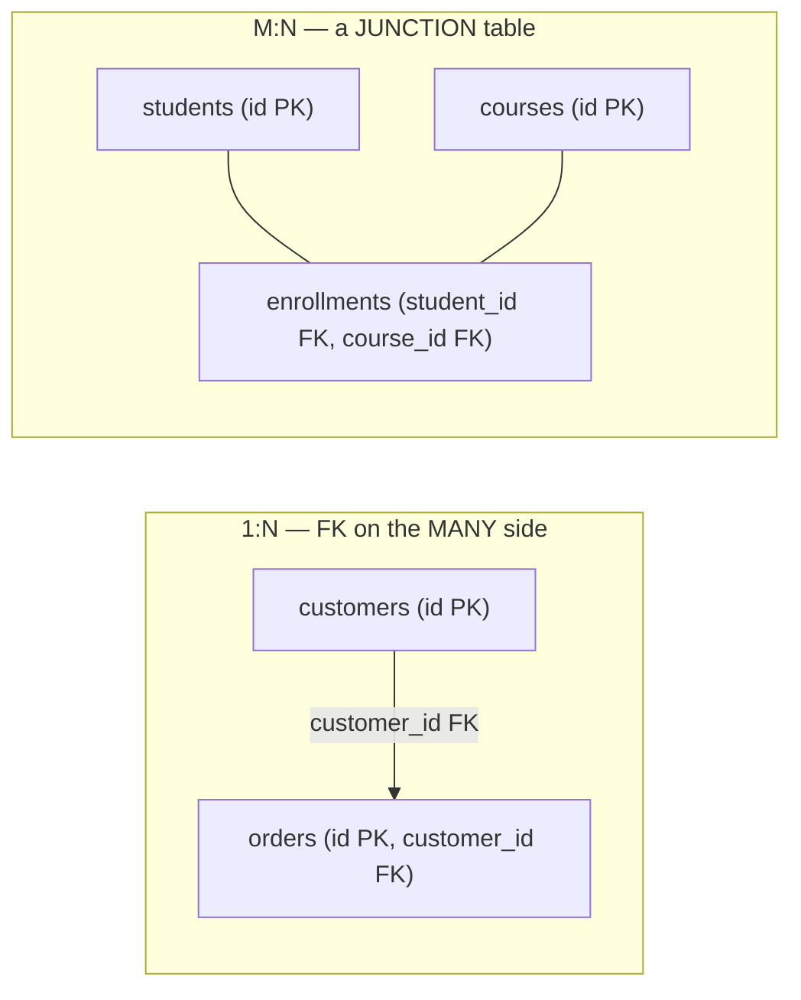
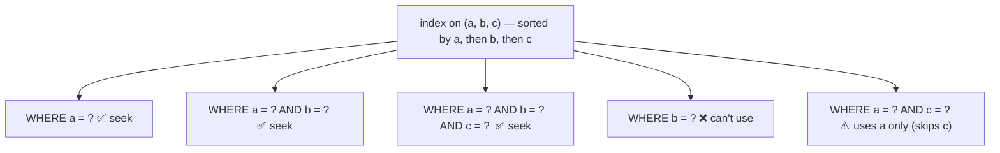

# Keys, constraints & relationships

[T01](./T01-relational-model-and-terminology.md) named the keys and integrity rules; [T03](./T03-sql-ddl-dml-dcl.md) gave the DDL syntax; this topic is where you *use* them to **model relationships correctly** and **enforce integrity in the database**. It's also — because this chapter has no separate indexing topic — the **deep dive on indexing**: the B-tree from [T01](./T01-relational-model-and-terminology.md) and the sargability ideas from [T02](./T02-sql-select-joins-group-by-subqueries.md) made fully practical. That pairing isn't an accident: keys, constraints, and indexes are *one system*. A primary key **is** a unique index; a foreign-key check **is** an index probe; and the right index is what turns a query from an O(n) scan into an O(log n) seek. Master this and you can both model data that *can't go wrong* and make it *fast*.

The depth-bar: at the **language** layer, keys (and how the PK drives physical clustering), **foreign-key referential actions**, the full **constraint family** (including deferrable constraints), and **relationship modeling** (1:1 / 1:N / M:N junction tables). At the **architecture** layer — the heart, and the largest section — **indexing in depth**: clustered vs secondary, the **composite-index leftmost-prefix rule**, **covering / index-only scans**, partial and functional indexes, **when *not* to index**, and how **constraints are enforced by indexes**.

> [!NOTE]
> Prerequisites: [Relational model & terminology](./T01-relational-model-and-terminology.md) (L2/C05/T01) — **keys, the B-tree, clustered vs heap storage, pages**; [SQL: SELECT, JOINs, …](./T02-sql-select-joins-group-by-subqueries.md) (L2/C05/T02) — **joins, sargability, index seek vs scan, `EXPLAIN`**; [SQL: DDL/DML/DCL](./T03-sql-ddl-dml-dcl.md) (L2/C05/T03) — **`CREATE INDEX`, constraint DDL, write amplification**.

## Keys Revisited

A **primary key** uniquely identifies a row (entity integrity — [T01](./T01-relational-model-and-terminology.md)), and it does two physical things worth restating: it is **automatically a unique index**, and in clustered storage engines (InnoDB) **it determines the table's physical order** ([T01](./T01-relational-model-and-terminology.md)). That second point is a real design lever — a **monotonic** PK (auto-increment, or a *sortable* ULID) keeps every insert at the "end" of the clustered B-tree, while a **random UUID** scatters inserts across the tree, causing **page splits** and index fragmentation. So "what's the primary key" is both a logical *and* a performance decision. A **composite key** (multiple columns) identifies a row by a combination — common for junction tables (below) and natural keys.

## Foreign Keys & Referential Actions

A **foreign key** enforces **referential integrity**: the child's FK value must match an existing parent PK (or be `NULL`). The interesting part is **what happens to children when the parent changes** — the **referential actions** declared with `ON DELETE` / `ON UPDATE`:

| Action | On parent delete/update… |
|--------|--------------------------|
| **CASCADE** | delete/update the children too (powerful — and dangerous) |
| **SET NULL** | set the children's FK to `NULL` |
| **SET DEFAULT** | set it to the column's `DEFAULT` |
| **RESTRICT** | forbid the operation if children exist (checked immediately) |
| **NO ACTION** | forbid it (checked at statement end — deferrable) |

`CASCADE` is convenient (`ON DELETE CASCADE` cleans up dependent rows automatically) but a loaded gun: deleting one parent can cascade through a *deep tree* of descendants and erase far more than you intended. Use `RESTRICT` when an accidental mass-delete would be catastrophic. And note the **performance** angle: a parent delete with `CASCADE` (or a `RESTRICT` check) must **find the children** — which is a scan unless the **child's FK column is indexed** (more below).

## The Constraint Family

Constraints enforce integrity **in the database** — the last line of defense, applied uniformly across every client and language ([T04](./T04-normalization-and-denormalization.md) integrity-by-construction). The family:

- **`NOT NULL`** — the value must be present.
- **`UNIQUE`** — no duplicate values; **backed by a unique index**. The trap: most databases (PostgreSQL, MySQL, Oracle) **allow multiple `NULL`s** in a `UNIQUE` column (because `NULL ≠ NULL` under three-valued logic — [T01](./T01-relational-model-and-terminology.md)), so `UNIQUE(email)` does *not* prevent many `NULL`-email rows. (**SQL Server** is the well-known exception — it permits only a *single* `NULL`.) A **partial/filtered unique index** (`UNIQUE … WHERE deleted = false`) is the idiom for "unique among the live rows" (soft deletes).
- **`CHECK`** — a boolean predicate enforced on every write (`CHECK (price >= 0)`, `CHECK (status IN ('new','paid','shipped'))`); can span columns.
- **`DEFAULT`** — a value to use when none is supplied.
- **`EXCLUSION`** (PostgreSQL) — generalized uniqueness, e.g. "no two bookings with overlapping time ranges."

A subtle but powerful feature is **deferrable constraints**: `DEFERRABLE INITIALLY DEFERRED` checks the constraint at **transaction commit** rather than per statement — which lets you *temporarily* violate it mid-transaction (swap two rows' unique values, or insert two mutually-referencing rows) and have it validated only at the end. `IMMEDIATE` vs `DEFERRED` is the checking-timing knob. (Name your constraints — clearer error messages and easier `ALTER`.)

## Modeling Relationships

Cardinality maps to schema shape:

- **1:1** (rare) — a FK with a `UNIQUE` constraint, or a shared primary key; used to split optional/wide attributes off a table.
- **1:N** (the common case) — the **FK lives on the "many" side**: each order has one customer, so `orders` carries `customer_id`.
- **M:N** (many-to-many) — there is *no* direct FK; you introduce a **junction / associative table** with FKs to both sides (`enrollments(student_id, course_id)`, usually a **composite PK** of the two FKs, plus any relationship attributes like `enrolled_at`). This is the canonical pattern — students↔courses, users↔roles, products↔tags.
- **Self-referential** — a FK to the same table (`employees.manager_id → employees.id`, a category tree) → traversed with **recursive CTEs** ([T02](./T02-sql-select-joins-group-by-subqueries.md)).

## Memory & Architecture Layer — Indexing in Depth

An index is a separate, sorted data structure that makes lookups fast — the single biggest lever on query performance. This is the full treatment the chapter routes through here.

### B-Tree Recap and Clustered vs Secondary

The workhorse index is the **B-tree** ([T01](./T01-relational-model-and-terminology.md)): balanced, high-fan-out, **O(log n)** seeks, with sorted, linked leaves for range scans. There are two physical arrangements:

- **Clustered index** (InnoDB primary key) — the **table itself** is the B-tree, rows stored in key order in the leaves.
- **Secondary (non-clustered) index** — a *separate* B-tree whose leaves hold the indexed key plus a **pointer to the row**. In PostgreSQL (heap) that pointer is a `ctid` (page+slot); in **InnoDB** it's the **PK value** — so a secondary-index lookup is a **double traversal**: search the secondary index → get the PK → search the clustered index for the row. Knowing this explains why a covering index (next) is such a win in InnoDB — it skips the second traversal.

### The Composite-Index Leftmost-Prefix Rule

The single most important index gotcha. An index on **`(a, b, c)`** sorts rows by `a`, then by `b` within equal `a`, then by `c` — so it can serve a query that constrains a **left-anchored prefix**: `a`, or `a, b`, or `a, b, c`. It **cannot** seek on `b` alone, `c` alone, or `b, c` (those aren't prefixes — the index isn't sorted by `b` globally).

So **column order matters**: lead with the columns used in **equality** filters, then a range, then sort columns. And a **range** stops the usable prefix — `WHERE a = ? AND b > ? AND c = ?` uses `a` (and `b` for the range) but can't use `c`, because after a range the rows aren't ordered by `c`. This is exactly the index behind **keyset/cursor pagination** ([C04/T03](../C04-web-and-rest-basics/T03-api-design-resources-versioning-pagination-filtering.md)): an index on `(customer_id, created_at)` serves `WHERE customer_id = ? AND created_at > ? ORDER BY created_at` as one seek.

### Covering Indexes / Index-Only Scans

If an index contains **all** the columns a query needs — both the filter and the selected columns — the database can answer **from the index alone**, skipping the table-row fetch entirely (an **index-only scan**). You make an index covering by adding the needed columns, either as additional key columns or — better — as non-key **`INCLUDE`** columns (PostgreSQL/SQL Server), which live in the leaf for retrieval without affecting the sort order or size of the upper tree. A covering index can be the difference between a fast read and a slow one, especially in InnoDB (it avoids the clustered-index second lookup).

### Partial, Functional, and Unique Indexes

- **Partial / filtered** — index only a subset of rows (`CREATE INDEX … WHERE active = true`): smaller, cheaper, and ideal when queries always include that filter (e.g. index only non-deleted rows).
- **Functional / expression** — index an *expression* (`CREATE INDEX … ON users (LOWER(email))`) so a predicate like `WHERE LOWER(email) = ?` becomes **sargable** — directly fixing the non-sargability of a function-on-a-column from [T02](./T02-sql-select-joins-group-by-subqueries.md).
- **Unique index** — the same object that enforces a `UNIQUE`/`PRIMARY KEY` constraint; the constraint *is* the index.

### When NOT to Index

Indexes are not free: each one costs **storage** and, critically, **write amplification** — *every* `INSERT`/`UPDATE`/`DELETE` must update *every* index on the table ([T03](./T03-sql-ddl-dml-dcl.md)/[T04](./T04-normalization-and-denormalization.md)). So:

- **Low-selectivity columns** (a `BOOLEAN`, a status with three values) — the optimizer will *ignore* the index, because seeking + fetching most of the rows is slower than a sequential scan. **Selectivity** (distinct values ÷ row count) is what makes an index worth using; the optimizer estimates it from statistics ([T02](./T02-sql-select-joins-group-by-subqueries.md)).
- **Write-heavy tables** — every extra index taxes every write; index only what you query by.
- **Columns you never filter/join/sort on** — pure overhead.

Index scan types you'll see in `EXPLAIN` ([T02](./T02-sql-select-joins-group-by-subqueries.md)): an **index seek** (point or range), an **index-only scan** (covering), a **bitmap index scan** (combine indexes or handle many matches), versus a full **seq scan**.

### Constraints Are Enforced *by* Indexes

The architectural tie that unifies the whole topic: **constraints are implemented with indexes and write-time checks.** A `PRIMARY KEY`/`UNIQUE` is *backed by a unique index* — the engine probes that index on every write to reject duplicates. A **foreign-key check** is an **index probe** on the parent's PK index — which is why FK validation is fast (the PK is indexed) and why the **child's FK column should be indexed** for the *reverse* direction (find-the-children, for joins — [T02](./T02-sql-select-joins-group-by-subqueries.md) — and for `ON DELETE`/cascade). A `CHECK` runs at write time. So "integrity by construction" ([T04](./T04-normalization-and-denormalization.md)) is, mechanically, **indexes plus write-time validation** — keys, constraints, and indexes really are one system.

> [!IMPORTANT]
> Keys, constraints, and indexes are **one system**. A **`PRIMARY KEY`/`UNIQUE` is backed by a unique index**; a **foreign-key check is an index probe** on the parent's PK; and the right index turns an **O(n) seq scan into an O(log n) seek** ([T01](./T01-relational-model-and-terminology.md)/[T02](./T02-sql-select-joins-group-by-subqueries.md)). So **index your foreign-key columns** (for joins *and* `ON DELETE`/cascade), respect the **composite-index leftmost-prefix rule** (an index on `(a,b,c)` can't serve a query on `b` alone), and remember every index is paid for on **every write** — index the columns you query by, not all of them.

> [!WARNING]
> Two silent traps. **(1) `UNIQUE` allows multiple `NULL`s** in most databases (`NULL ≠ NULL` — [T01](./T01-relational-model-and-terminology.md)), so a `UNIQUE(email)` column does *not* prevent many rows with a `NULL` email — add `NOT NULL`, or a partial unique index, if you need true uniqueness. **(2) `ON DELETE CASCADE` can delete far more than you intend** — one parent delete can cascade through a deep tree of children; use it deliberately, and prefer `RESTRICT` when an accidental mass-delete would be catastrophic.

> [!TIP]
> Design indexes from your **query patterns**, not your column list: for `WHERE a = ? AND b = ? ORDER BY c`, a composite index on `(a, b, c)` serves the filter **and** the sort in one seek (the keyset-pagination pattern — [C04/T03](../C04-web-and-rest-basics/T03-api-design-resources-versioning-pagination-filtering.md)). Make it **covering** (add the selected columns via `INCLUDE`) for an **index-only scan**. And don't index low-selectivity columns (a boolean) — the optimizer ignores them and you just pay the write cost.

## Common Mistakes

### Missing Index on a Foreign-Key Column

Joins and `ON DELETE`/cascade scan the child table. **Index every FK column** ([T02](./T02-sql-select-joins-group-by-subqueries.md)/[T04](./T04-normalization-and-denormalization.md)).

### Composite-Index Leftmost-Prefix Misuse

An index on `(a,b,c)` won't help a query that filters only on `b`. Order columns by how you query them.

### Indexing Low-Selectivity Columns

A boolean or 3-value status index gets ignored by the optimizer; you pay the write cost for nothing.

### Over-Indexing

Every index taxes every write ([T03](./T03-sql-ddl-dml-dcl.md)). Index what you query by, not every column.

### Relying on `UNIQUE` for a Nullable Column

Multiple `NULL`s are allowed. Add `NOT NULL` or a partial unique index.

### Cascade-Delete Surprises

An accidental parent delete cascades widely. Use `CASCADE` deliberately; `RESTRICT` for safety.

### App-Only Integrity

Enforcing keys/uniqueness only in application code lets data drift across clients/bugs. Put constraints in the **database** ([T04](./T04-normalization-and-denormalization.md)).

### Wrong PK for Clustering

A random-UUID PK fragments an InnoDB clustered index (page splits — [T01](./T01-relational-model-and-terminology.md)). Use a monotonic or sortable key when clustering matters.

### No Functional/Partial Index for a Wrapped/Filtered Predicate

`WHERE LOWER(email) = ?` or an always-`WHERE active` query stays a scan without the matching functional/partial index ([T02](./T02-sql-select-joins-group-by-subqueries.md)).

> [!INTERVIEW]
> Keys/constraints/indexing is the most practical database interview area — the standout answers tie **constraints to indexes** and nail the **composite-index leftmost-prefix** rule.
>
> 1. **PK vs UNIQUE?** PK: one per table, `NOT NULL`, the identifier (often clusters the table); UNIQUE: any number, allows `NULL`s — both backed by a unique index.
> 2. **Foreign-key referential actions?** `ON DELETE`/`ON UPDATE` `CASCADE` / `SET NULL` / `SET DEFAULT` / `RESTRICT` / `NO ACTION`.
> 3. **How do you model M:N?** A **junction/associative table** with FKs to both sides (usually a composite PK).
> 4. **1:N — which side has the FK?** The "many" side.
> 5. **Clustered vs non-clustered index?** Clustered = the table in key order (the table *is* the index); secondary = a separate structure pointing to the row (InnoDB → via the PK = a double lookup).
> 6. **The composite-index leftmost-prefix rule?** Index on `(a,b,c)` serves `a` / `a,b` / `a,b,c` but **not** `b` alone; a range stops the prefix; column order matters.
> 7. **Covering index / index-only scan?** The index holds all needed columns → answer from the index, skip the table fetch (`INCLUDE` non-key columns).
> 8. **Partial and functional indexes?** Index a subset of rows (`WHERE active`) / an expression (`LOWER(email)`) to make a predicate sargable.
> 9. **When should you NOT index?** Low-selectivity columns, write-heavy tables, never-queried columns — indexes cost storage + write amplification.
> 10. **How are constraints enforced?** PK/UNIQUE via a unique index; FK via an index probe on the parent PK; CHECK at write time — by the **engine**.
> 11. **Why index FK columns?** For joins ([T02](./T02-sql-select-joins-group-by-subqueries.md)) **and** `ON DELETE`/cascade (finding children).
> 12. **Does `UNIQUE` prevent duplicate `NULL`s?** No — `NULL ≠ NULL`; multiple `NULL`s are allowed; add `NOT NULL`/partial unique.
> 13. **What is index selectivity?** Distinct values ÷ rows; low selectivity → the optimizer prefers a seq scan.
> 14. **What is a deferrable constraint?** One checked at commit (`INITIALLY DEFERRED`) rather than per-statement — lets you temporarily violate it mid-transaction.

## Practice

1. **M:N.** Model students/courses with an `enrollments` junction table (composite PK); query "all courses for a student."
2. **Referential actions.** Add `ON DELETE CASCADE`; delete a parent and watch the cascade; switch to `RESTRICT` and watch the block.
3. **Leftmost prefix.** Create an index on `(a,b,c)`; use `EXPLAIN` to show a query on `b` alone can't use it while `a` / `a,b` can.
4. **Covering index.** Add an `INCLUDE` covering index; confirm an **index-only scan** in `EXPLAIN` ([T02](./T02-sql-select-joins-group-by-subqueries.md)).
5. **Partial index.** Create `… WHERE active = true`; show it's smaller and used only by matching queries.
6. **Functional index.** Index `LOWER(email)`; show `WHERE LOWER(email) = ?` becomes an index scan.
7. **Low selectivity.** Index a boolean column; `EXPLAIN` shows a seq scan anyway — explain why.
8. **UNIQUE + NULL.** Insert several `NULL`s into a `UNIQUE` column (allowed); enforce real uniqueness with `NOT NULL`/partial unique.
9. **PK clustering.** Compare insert behaviour with a monotonic PK vs a random UUID in InnoDB (page splits — [T01](./T01-relational-model-and-terminology.md)).
10. **FK index.** Join parent/child without an FK index (scan), then with one (seek); measure ([T02](./T02-sql-select-joins-group-by-subqueries.md)).
11. **Write cost.** Add five indexes; measure the bulk-`INSERT` slowdown ([T03](./T03-sql-ddl-dml-dcl.md)).
12. **Deferrable.** In a transaction, swap two rows' unique values with a `DEFERRABLE INITIALLY DEFERRED` constraint.
13. **CHECK.** Add `CHECK (status IN (…))`; insert an invalid value and observe the rejection.
14. **Selectivity.** Inspect the planner's statistics; explain its index-vs-scan choice.
15. **Explain it back.** For `WHERE customer_id = ? AND created_at > ? ORDER BY created_at LIMIT 20` (keyset pagination), (a) design the composite index, (b) explain the leftmost-prefix and why `created_at` is last, (c) make it covering, (d) why the FK `customer_id` needs an index, and (e) the write-amplification cost of adding it.

## Recap

You should now be able to:

- Use **keys** well — PK/composite/natural-vs-surrogate — and know the PK **clusters** the table (so a monotonic/sortable key avoids InnoDB page splits — [T01](./T01-relational-model-and-terminology.md)).
- Declare **foreign keys** with the right **referential actions** (`CASCADE`/`SET NULL`/`RESTRICT`/…), understanding the cascade-delete danger and the need to index FK columns.
- Apply the **constraint family** — `NOT NULL`, `UNIQUE` (and its multi-`NULL` trap + partial unique), `CHECK`, `DEFAULT`, `EXCLUSION`, **deferrable** — to enforce **integrity in the database** ([T04](./T04-normalization-and-denormalization.md)).
- Model **relationships** — 1:1, 1:N (FK on the many side), **M:N via a junction table**, and self-referential.
- Master **indexing**: the **B-tree**, **clustered vs secondary** (InnoDB double lookup), the **composite-index leftmost-prefix rule**, **covering/index-only scans**, **partial/functional/unique** indexes, **when *not* to index** (selectivity, write amplification), and that **constraints are enforced by indexes** ([T02](./T02-sql-select-joins-group-by-subqueries.md)) — avoiding the traps (missing FK index, wrong column order, low-selectivity indexes, over-indexing, `UNIQUE`-on-nullable, cascade surprises, app-only integrity).

## Next

Continue to [Transactions & ACID](./T06-transactions-and-acid.md).
