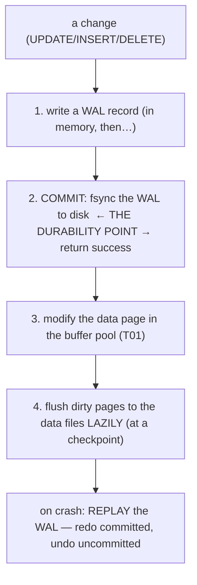
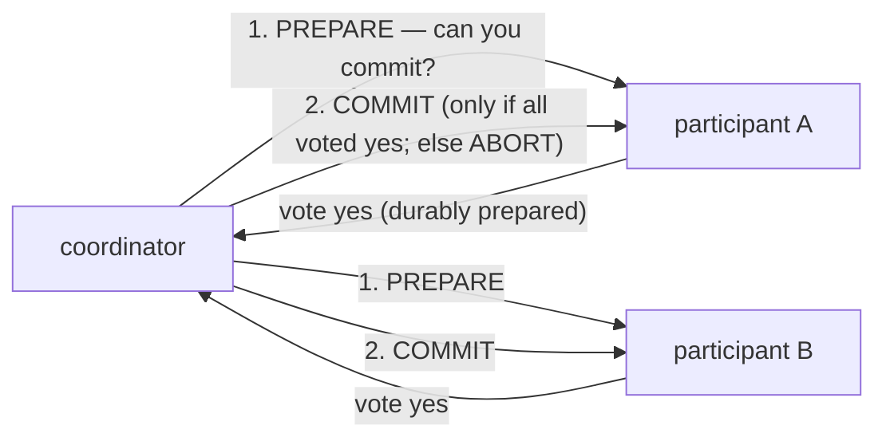

# Transactions & ACID

A **transaction** is a unit of work the database treats as **atomic** — all of it happens, or none of it does. The textbook example is a bank transfer: debit account A, credit account B. If the system crashes *between* those two updates, money must not vanish or duplicate. Wrap them in a transaction and the database guarantees you either see both or neither, even across a power failure. The set of guarantees that make this safe is **ACID** — and the goal of this topic is not just to recite the four letters, but to understand *how the database actually implements them*: the **write-ahead log** that makes commits durable, and **MVCC** that lets transactions run concurrently. That mechanical understanding is what turns "I know what ACID stands for" into "I know why my transaction is slow / why it's holding a lock / where my durability boundary is."

The depth-bar: at the **language** layer, transactions, the four ACID properties (with the bank example), and `SAVEPOINT`/autocommit. At the **architecture** layer — the heart — how **Atomicity + Durability** are implemented by the **WAL** (the `fsync`-at-commit durability point, lazy page flush, crash recovery), how **MVCC** underpins Isolation, the **durability-vs-performance** knob, and **distributed transactions** (2PC, and why microservices avoid them). Isolation itself gets the full treatment next ([T07](./T07-isolation-levels-and-locking.md)).

> [!NOTE]
> Prerequisites: [SQL: DDL/DML/DCL](./T03-sql-ddl-dml-dcl.md) (L2/C05/T03) — **`BEGIN`/`COMMIT`/`ROLLBACK` and the WAL + MVCC intro**; [Keys, constraints & relationships](./T05-keys-constraints-and-relationships.md) (L2/C05/T05) — **constraints, which the "C" in ACID preserves**.

## What Is a Transaction?

A transaction groups statements into one unit: `BEGIN` … (work) … `COMMIT` (make it permanent) or `ROLLBACK` (undo it all). The bank transfer is two statements:

```sql
BEGIN;
UPDATE accounts SET balance = balance - 100 WHERE id = 'A';
UPDATE accounts SET balance = balance + 100 WHERE id = 'B';
COMMIT;     -- both, or (on error/crash) neither
```

Most tools default to **autocommit** — each statement is its own one-statement transaction — until you `BEGIN`. The transaction is the fundamental unit of both **consistency** (it moves the DB between valid states) and **concurrency** (it's the thing isolation isolates).

## ACID — the Four Guarantees

| Property | Guarantee | Implemented by |
|----------|-----------|----------------|
| **Atomicity** | all-or-nothing — the whole transaction, or none of it | **undo** via the WAL / old row versions |
| **Consistency** | moves the DB from one **valid** state to another (constraints + invariants hold) | constraints ([T05](./T05-keys-constraints-and-relationships.md)) + correctly-written transactions |
| **Isolation** | concurrent transactions don't see each other's incomplete work | **MVCC + locking** ([T07](./T07-isolation-levels-and-locking.md)) |
| **Durability** | once committed, it survives a crash | the **WAL** forced to disk (`fsync`) at commit |

A note on each:

- **Atomicity** is the all-or-nothing promise: an error, an explicit `ROLLBACK`, or a crash mid-transaction undoes *all* the partial work.
- **Consistency** is the odd one out — it's *partly the application's job* (the transaction must be written to preserve invariants, like "total money is conserved") and partly the database's, via **constraints** ([T05](./T05-keys-constraints-and-relationships.md)) that it refuses to let a transaction violate. (This "C" is *not* the same as the "C" in CAP — see the distribution section.)
- **Isolation** is about concurrency: the result of running transactions concurrently should be *as if* they ran in some serial order. Perfect isolation (serializability) is expensive, so databases offer weaker **isolation levels** ([T07](./T07-isolation-levels-and-locking.md)).
- **Durability** means a committed transaction is on stable storage — a power loss right after `COMMIT` returns cannot lose it.

## Atomicity & Rollback

How does all-or-nothing work? The database records enough information to **undo** a transaction's changes — the WAL keeps both *redo* and *undo* information, and under MVCC the *old row versions* remain. On `ROLLBACK`, or when crash-recovery finds an **uncommitted** transaction, those changes are reversed. **`SAVEPOINT`** adds partial rollback: mark a point mid-transaction, and `ROLLBACK TO SAVEPOINT` undoes only the work since the marker without aborting the whole transaction (the basis for nested-transaction semantics).

## Durability & the Write-Ahead Log

This is the central mechanism, and the [T03](./T03-sql-ddl-dml-dcl.md) WAL idea fully explained. The naive approach — write every changed data page to disk at `COMMIT` — is far too slow (random I/O across the table's pages — [T01](./T01-relational-model-and-terminology.md)). Instead, databases use the **Write-Ahead Log (WAL)**: an **append-only** log of changes, with one rule — *the log record for a change must reach durable storage **before** the change is committed.*



The crucial insight: **durability comes from the *log* being on disk, not the data pages.** At `COMMIT`, the database forces the WAL to durable storage with an **`fsync`** — *that* is the moment the transaction becomes durable — and returns. The actual data pages stay in the buffer pool and are flushed **lazily** later at a **checkpoint**. If the server crashes, recovery **replays the WAL**: it *redoes* committed changes that hadn't yet reached the data files and *undoes* uncommitted ones, restoring a consistent state (ARIES-style recovery). This design is brilliant for performance: the WAL is a **sequential** append (fast — [T01](./T01-relational-model-and-terminology.md) sequential-vs-random), so durability costs one sequential write rather than scattered random page writes. And because the `fsync` is the bottleneck, databases use **group commit** — batching many transactions' commits into a single `fsync` — to raise throughput under load.

## Isolation & MVCC (preview)

Concurrent transactions must not corrupt one another (the anomalies — dirty read, non-repeatable read, phantom — are [T07](./T07-isolation-levels-and-locking.md)). The mechanism that makes concurrency cheap is **MVCC (Multi-Version Concurrency Control)** ([T03](./T03-sql-ddl-dml-dcl.md)): rather than locking rows for reads, the database keeps **multiple versions** of each row, and every transaction sees a **consistent snapshot** — the versions valid as of its start (determined by transaction ids and visibility rules). The payoff: **readers don't block writers, and writers don't block readers** — the central concurrency win of modern databases. (Writers still take locks to stop two transactions from clobbering the same row.) Exactly *how fresh* a snapshot each transaction sees is the **isolation level**, the subject of [T07](./T07-isolation-levels-and-locking.md).

## Memory & Architecture — Durability vs Performance, and Distribution

### The Durability-vs-Performance Knob

The `fsync` at every commit is the safe default, but a disk round-trip per commit caps throughput. The knob: relaxing it — PostgreSQL `synchronous_commit = off` (commit returns before the WAL is fsynced; a background process flushes it shortly after) or disabling `fsync` entirely — makes commits much faster, **but a crash can lose the last few committed transactions** (their WAL records hadn't hit disk). This is a deliberate **durability-for-throughput** trade some workloads make (high-volume analytics, caches, anything where losing a couple of seconds of writes on a rare crash is acceptable). Knowing this knob means knowing *exactly where your durability boundary is* — full durability is the default, but it isn't free.

### Distributed Transactions, 2PC, and Sagas

Atomicity *across multiple databases or services* needs a coordinator. The classic answer is **Two-Phase Commit (2PC)**:



2PC gives cross-node atomicity, but it's **slow** (extra round-trips + `fsync`s on every participant) and **blocking**: if the coordinator dies *after* participants have prepared, they hold their locks indefinitely, waiting for a verdict. That fragility is why **microservices avoid distributed transactions**. The alternative is a **saga** — a sequence of *local* transactions, each with a **compensating action** to undo it if a later step fails — combined with **idempotent** operations ([C04/T01](../C04-web-and-rest-basics/T01-http-in-depth-methods-status-headers.md) idempotency keys) and **eventual consistency** ([T04](./T04-normalization-and-denormalization.md) consistency-by-effort). You trade the strong "all-or-nothing across services" guarantee for availability and decoupling, accepting brief inconsistency. (Sagas/distributed transactions are an L4/L5 topic; the point now is *don't reach for 2PC by reflex*.)

This connects to **CAP**: under a network partition ([C03/T09](../C03-networking-fundamentals/T09-load-balancers.md)), a distributed data store must choose **Consistency or Availability** — it can't have both while partitioned. ACID/2PC lean toward consistency; BASE/eventual-consistency leans toward availability. A *single-node* relational database sidesteps CAP (there's no partition within one node), which is part of why a plain transaction is so much simpler than a distributed one.

### The Transaction Is a Connection — Keep It Short

A practical architectural fact ([T09](./T09-jdbc-and-connection-pooling-hikaricp.md)): a transaction is bound to a database **connection**, and while it's open it (a) holds **locks** ([T07](./T07-isolation-levels-and-locking.md)), (b) pins a **pooled connection** ([T09](./T09-jdbc-and-connection-pooling-hikaricp.md)), and (c) under MVCC, prevents **`VACUUM`** from reclaiming old row versions ([T03](./T03-sql-ddl-dml-dcl.md) — bloat), because they might still be visible to it. So a long transaction is *triply* costly. The rule: **keep transactions short** — open it, do the DB writes, commit, close; do any slow or external work *outside* it.

### Java Angle

In JDBC ([T09](./T09-jdbc-and-connection-pooling-hikaricp.md)), `connection.setAutoCommit(false)` starts an explicit transaction; then `commit()` or `rollback()`. The `Connection` *is* the transaction boundary. In Spring, **`@Transactional`** declares boundaries declaratively — a proxy opens a transaction before the method and commits (or rolls back) after. Two notorious gotchas: it rolls back on a **`RuntimeException`** by default but **not** on a checked exception (unless you configure `rollbackFor`); and **self-invocation** (a method calling another `@Transactional` method on the same object) bypasses the proxy, so the inner annotation is ignored (L4 detail). The cardinal rule holds: keep the annotated method's work short and DB-only.

> [!IMPORTANT]
> Durability is implemented by the **write-ahead log**, not by writing data pages at commit. At `COMMIT` the database forces the **WAL** to disk (an **`fsync`** — *this* is the durability point) and returns; the modified data pages are flushed **lazily** later at a checkpoint, and a crash is recovered by **replaying the WAL**. This turns slow random page-writes into a fast sequential append — and it's why relaxing the commit-time `fsync` (`synchronous_commit = off`) trades the durability of the *last few committed transactions* for throughput.

> [!WARNING]
> **Keep transactions short — never do slow or external work inside one.** An open transaction holds **locks** ([T07](./T07-isolation-levels-and-locking.md)), pins a **pooled connection** ([T09](./T09-jdbc-and-connection-pooling-hikaricp.md)), and (under MVCC) blocks **`VACUUM`** from reclaiming old row versions ([T03](./T03-sql-ddl-dml-dcl.md) — bloat). A transaction that waits on an HTTP call, user input, or a long computation can cause lock contention, connection-pool exhaustion, and table bloat *simultaneously*. Do the slow work outside; open, write, commit, close.

> [!TIP]
> For atomicity **across services**, don't reach for distributed transactions / **2PC** (slow, blocking, a single coordinator). Prefer a **saga** — local transactions with compensating actions — plus **idempotent** operations ([C04/T01](../C04-web-and-rest-basics/T01-http-in-depth-methods-status-headers.md)) and **eventual consistency** ([T04](./T04-normalization-and-denormalization.md), CAP). Within one database, a plain transaction is exactly right; across many, design as if cross-service transactions don't exist.

## Common Mistakes

### Forgetting to Commit / Leaving a Transaction Open

The transaction holds locks and a connection until commit/rollback. Autocommit confusion is the usual cause — be explicit.

### Assuming Atomicity Without a Transaction

Two separate auto-committed statements are *not* atomic — a crash between them leaves inconsistency. Wrap multi-step changes in `BEGIN … COMMIT`.

### Long-Running Transactions

Lock contention ([T07](./T07-isolation-levels-and-locking.md)), pool exhaustion ([T09](./T09-jdbc-and-connection-pooling-hikaricp.md)), and `VACUUM`-blocking bloat ([T03](./T03-sql-ddl-dml-dcl.md)) all at once. Keep them short.

### Catching an Exception Without Rolling Back

The transaction stays open (or worse, commits partial work). Always `rollback` on failure (or let `@Transactional` do it — mind the checked-exception gotcha).

### Relaxing `fsync` Blindly

`synchronous_commit = off` is faster but can lose recently-committed transactions on a crash. Only relax durability deliberately.

### 2PC Where a Saga Fits

Distributed transactions are slow and blocking. Use sagas + idempotency + eventual consistency for cross-service workflows.

### `@Transactional` Gotchas

No rollback on checked exceptions by default; self-invocation bypasses the proxy. Know the framework's rules.

### Confusing the Two "C"s

ACID's Consistency (constraint/invariant preservation) is *not* CAP's Consistency (all nodes see the same data). Different concepts.

> [!INTERVIEW]
> Transactions/ACID are a guaranteed database interview topic — the standout answers explain *how* durability and isolation are **implemented** (WAL, MVCC), not just the definitions.
>
> 1. **What is a transaction?** A unit of work treated atomically — all-or-nothing (`BEGIN … COMMIT`/`ROLLBACK`).
> 2. **What does ACID stand for?** **A**tomicity, **C**onsistency, **I**solation, **D**urability.
> 3. **Atomicity — what and how?** All-or-nothing; implemented by **undo** (WAL / old row versions) on rollback or crash.
> 4. **Consistency in ACID?** The transaction moves the DB from one **valid** state to another (constraints + invariants hold) — partly the app's job, partly constraints ([T05](./T05-keys-constraints-and-relationships.md)); *not* CAP's C.
> 5. **Isolation — what and how?** Concurrent transactions don't see incomplete work; **MVCC + locking**; isolation levels trade it for performance ([T07](./T07-isolation-levels-and-locking.md)).
> 6. **Durability — what and how?** Committed survives a crash; the **WAL** is `fsync`ed at commit.
> 7. **What's the WAL, and where's the durability point?** An append-only redo log; the durability point is the **`fsync` of the WAL at commit** (not the data-page write); recovery replays it.
> 8. **Why is the WAL faster than writing pages?** Sequential append vs random page I/O; lazy page flush at checkpoints; **group commit** batches `fsync`s.
> 9. **What is MVCC?** Multiple row versions → each transaction sees a consistent snapshot → readers don't block writers (the basis for isolation).
> 10. **What is 2PC, and why do microservices avoid it?** Two-phase commit for cross-node atomicity (prepare + commit); **slow and blocking** (coordinator failure holds locks) → prefer **sagas** + eventual consistency.
> 11. **CAP vs ACID?** Under a partition, a distributed store chooses **C or A**; ACID/2PC favor C, BASE favors A; a single-node DB sidesteps CAP.
> 12. **What is `SAVEPOINT`?** A marker for partial rollback within a transaction.
> 13. **`@Transactional` gotchas?** Rolls back on `RuntimeException` by default (not checked); self-invocation bypasses the proxy.
> 14. **Why keep transactions short?** They hold locks ([T07](./T07-isolation-levels-and-locking.md)), a pooled connection ([T09](./T09-jdbc-and-connection-pooling-hikaricp.md)), and block `VACUUM` ([T03](./T03-sql-ddl-dml-dcl.md)).

## Practice

1. **Atomic transfer.** Run the bank transfer in a transaction; inject a failure between the two updates; `ROLLBACK`; confirm balances unchanged.
2. **Atomicity under crash.** `BEGIN`, do two writes, kill the session before `COMMIT`; reconnect; confirm neither persisted.
3. **Autocommit.** Toggle autocommit; observe single-statement-as-transaction vs explicit `BEGIN … COMMIT`.
4. **SAVEPOINT.** Work, `SAVEPOINT s`, more work, `ROLLBACK TO s`; confirm only the later work is undone.
5. **Durability.** `COMMIT`, then `kill -9` the server; restart; confirm the committed change survived (WAL replay).
6. **Commit latency.** Relate commit latency to the `fsync`; observe it via WAL/commit stats.
7. **`synchronous_commit`.** Turn it off; measure the throughput gain; explain the durability risk.
8. **Long transaction.** Open and hold a transaction; observe held locks ([T07](./T07-isolation-levels-and-locking.md)) and that `VACUUM` can't reclaim old versions ([T03](./T03-sql-ddl-dml-dcl.md)).
9. **Connection = transaction.** In JDBC, `setAutoCommit(false)`, write, `commit()`; observe the connection holds the transaction.
10. **`@Transactional`.** Throw a `RuntimeException` (rollback) vs a checked exception (no rollback by default — the gotcha).
11. **2PC vs saga.** Sketch a cross-service "place order + charge payment" as 2PC and as a saga with compensation; compare failure handling.
12. **MVCC snapshot.** Two sessions; one updates without committing; the other reads the *old* version (snapshot) — preview [T07](./T07-isolation-levels-and-locking.md).
13. **CAP.** Argue Consistency-vs-Availability for a partitioned distributed store.
14. **Explain it back.** For the bank transfer, (a) name the ACID property each step relies on, (b) trace how the WAL gives durability (the `fsync` point), (c) how a crash mid-transfer is recovered, (d) why you'd keep this transaction short, and (e) why doing it across two services needs a **saga**, not a transaction.

## Recap

You should now be able to:

- Define a **transaction** (atomic unit, `BEGIN`/`COMMIT`/`ROLLBACK`, autocommit, `SAVEPOINT`) and the bank-transfer motivation.
- State the four **ACID** properties — **Atomicity** (all-or-nothing/undo), **Consistency** (valid-state-to-valid-state via constraints + correct code — [T05](./T05-keys-constraints-and-relationships.md)), **Isolation** (concurrent snapshots — [T07](./T07-isolation-levels-and-locking.md)), **Durability** (survives a crash) — and what implements each.
- Explain **Durability via the WAL**: the write-ahead rule, the **`fsync`-at-commit** durability point (not the data-page write), lazy page flush + checkpoints, **crash recovery** by replay, and **group commit** — and the **`synchronous_commit`** durability-vs-throughput knob.
- Explain **MVCC** as the basis for Isolation (consistent snapshots, readers-don't-block-writers — [T07](./T07-isolation-levels-and-locking.md)).
- Reason about **distribution**: **2PC** (cross-node atomicity, slow + blocking) vs **sagas** + idempotency + **eventual consistency** ([T04](./T04-normalization-and-denormalization.md)/[C04/T01](../C04-web-and-rest-basics/T01-http-in-depth-methods-status-headers.md)), and the **CAP** trade — plus the practical rules (transaction = connection, **keep it short**, `@Transactional` gotchas) and avoiding the traps (open transactions, non-atomic multi-step changes, long transactions, missing rollback, blind `fsync` relaxation, reflexive 2PC).

## Next

Continue to [Isolation levels & locking](./T07-isolation-levels-and-locking.md).
