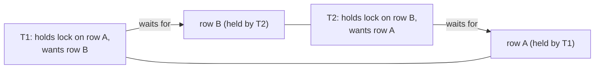
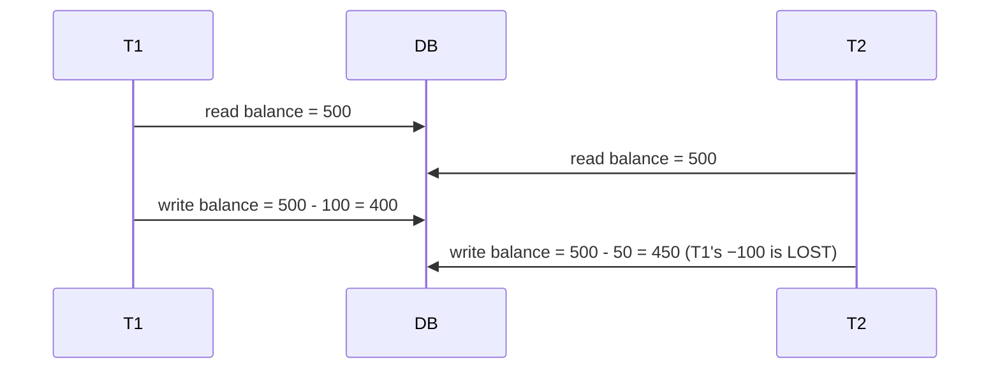

# Isolation levels & locking

[T06](./T06-transactions-and-acid.md) introduced the **I** in ACID — **isolation**, the promise that concurrent transactions don't corrupt each other. But perfect isolation (every transaction running as if it were alone) is *expensive*, so databases offer a spectrum of **isolation levels** that trade correctness for concurrency — each permitting certain **anomalies**. This is one of the most consequential and most *misunderstood* areas in all of backend engineering, because of one fact that surprises nearly everyone: **the default isolation level in most databases is not the strongest.** Your "obviously correct" transaction, reasoned about as if it ran alone, can be subtly and silently *wrong* the moment two of them run at once. This topic is the concurrency-correctness capstone of the chapter — the anomalies, the levels that prevent them, the locking that enforces them, deadlocks, and the optimistic-vs-pessimistic design choice that decides your throughput.

The depth-bar: at the **language** layer, the read **anomalies**, the four **isolation levels** (and what each allows), **locking**, **deadlocks**, and **optimistic vs pessimistic** concurrency. At the **architecture** layer — the heart — how levels are *implemented* (**MVCC snapshots vs two-phase locking**), how **SERIALIZABLE works on MVCC (SSI)**, the **isolation-vs-throughput** trade, and the mechanics of the **lost update** and **write skew** that catch out even experienced engineers.

> [!NOTE]
> Prerequisites: [Transactions & ACID](./T06-transactions-and-acid.md) (L2/C05/T06) — **transactions, isolation as the "I", MVCC, keep-transactions-short**; [Keys, constraints & relationships](./T05-keys-constraints-and-relationships.md) (L2/C05/T05) — **row locks via `FOR UPDATE`, constraints**.

## The Anomalies — What Isolation Prevents

When transactions interleave, specific bad outcomes become possible. The three classic **read phenomena** (defined by the ANSI standard), plus the two that bite hardest in practice:

| Anomaly | What happens |
|---------|--------------|
| **Dirty read** | T1 reads a row T2 changed but hasn't committed; if T2 rolls back, T1 saw data that never existed |
| **Non-repeatable read** | T1 reads a row; T2 commits a change to it; T1 re-reads → a *different* value, within one transaction |
| **Phantom read** | T1 runs a range query; T2 commits new rows matching it; T1 re-runs → new "phantom" rows appear |
| **Lost update** | T1 and T2 both read X, both compute a new value, both write — one write is silently overwritten |
| **Write skew** | T1 and T2 read an overlapping set, write *disjoint* rows, and together break an invariant each preserved alone |

The last two are the dangerous ones because they cause *real data corruption*, not just inconsistent reads. The **lost update** is the canonical concurrency bug (two `balance = balance - 100` from different sessions → one disappears). **Write skew** is subtler — the textbook example: two doctors each run "is *anyone else* still on call?", each sees "yes," and each goes off-call → now **nobody** is on call, an invariant ("at least one doctor on call") violated even though each transaction alone preserved it.

## The Isolation Levels

The four ANSI levels form a spectrum — each prevents more anomalies, at more cost:

| Level | Dirty read | Non-repeatable read | Phantom read |
|-------|:----------:|:-------------------:|:------------:|
| **READ UNCOMMITTED** | ✅ allowed | ✅ | ✅ |
| **READ COMMITTED** *(common default)* | ❌ prevented | ✅ allowed | ✅ allowed |
| **REPEATABLE READ** | ❌ | ❌ | ✅ (ANSI) / ❌ in MVCC |
| **SERIALIZABLE** | ❌ | ❌ | ❌ (and no write skew) |

- **READ UNCOMMITTED** — allows even dirty reads. Rarely used; PostgreSQL doesn't implement it as distinct from READ COMMITTED.
- **READ COMMITTED** — sees only **committed** data (no dirty reads), but each *statement* gets a fresh snapshot, so non-repeatable reads and phantoms are possible. **This is the default in PostgreSQL, Oracle, and SQL Server** — the fact that surprises people.
- **REPEATABLE READ** — a **stable snapshot for the whole transaction**: re-reading a row always gives the same value (no non-repeatable reads). The ANSI standard still allows phantoms here, but **MVCC implementations prevent phantoms too** at this level (it's really *snapshot isolation*). InnoDB's default. (Caveat: PostgreSQL RR is true snapshot isolation; **InnoDB RR** blocks phantoms for plain *non-locking* reads via the snapshot, but uses **next-key locks** for locking reads — `SELECT … FOR UPDATE`/`UPDATE`/`DELETE` — so it isn't full SI and can still expose some current-read anomalies.)
- **SERIALIZABLE** — the result is guaranteed to be *as if* the transactions ran one after another. Prevents **all** anomalies, including write skew. The strongest and slowest.

The practical takeaway: **the default (READ COMMITTED) allows non-repeatable reads and phantoms**, so code that reads a value, does some logic, and reads or writes again — assuming a stable view — is buggy under concurrency unless you raise the level or take an explicit lock.

## Locking

Locks coordinate concurrent access to the same data. The two fundamental modes:

- **Shared (S / read) lock** — many transactions can hold it simultaneously; it blocks *writers*.
- **Exclusive (X / write) lock** — only one holder; it blocks *everyone* (readers and writers).

Locks have **granularity** — row, page, or table — where finer locks allow more concurrency but cost more bookkeeping, and **lock escalation** (a DB upgrading thousands of row locks to one table lock to save memory) can suddenly kill concurrency. **Explicit locking** lets you reach for a lock yourself: **`SELECT … FOR UPDATE`** takes an exclusive row lock now ("I'm about to update these — hold them for me"), and `FOR SHARE` takes a shared one. A transaction that can't get a lock **waits** (subject to a `lock_timeout`).

## Deadlocks

Locking creates the possibility of a **deadlock**: two transactions each hold a lock the other needs, so neither can proceed — a cycle.

Databases **detect** deadlocks (by finding a cycle in the wait-for graph) and break them by **aborting a victim** transaction (rolling it back with a deadlock error) — so the application must be ready to **retry**. The way to *prevent* deadlocks is to **acquire locks in a consistent order** (e.g. always lock rows by ascending primary key) so a cycle can never form, and to keep transactions short ([T06](./T06-transactions-and-acid.md)) so locks are held briefly.

## Optimistic vs Pessimistic Concurrency

The central design choice — *how* you protect a read-modify-write from conflicts:

- **Pessimistic** — assume conflicts are likely; **lock up front** (`SELECT … FOR UPDATE`), forcing other transactions to wait until you commit. Correct and simple, but it serializes access (reduced concurrency) and risks deadlocks. Use it when conflicts are *frequent* or a lost update is unacceptable (decrementing inventory, booking the last seat).
- **Optimistic** — assume conflicts are rare; **don't lock**. Instead, detect a conflict *at write time*: read a **version** (or timestamp) column, then write with `UPDATE … SET …, version = version + 1 WHERE id = ? AND version = :old_version`. If **0 rows** were updated, someone else changed it first → conflict → **retry**. This is the database-level twin of HTTP's **`If-Match`/ETag** optimistic concurrency ([C04/T01](../C04-web-and-rest-basics/T01-http-in-depth-methods-status-headers.md) — the `412`). No locks are held, so throughput is high; the cost is occasional retries. Use it when conflicts are *rare* (most web CRUD).

## Memory & Architecture Layer

### MVCC Snapshots vs Two-Phase Locking

Isolation levels are *concepts*; databases implement them two very different ways:

- **MVCC databases** (PostgreSQL, InnoDB, Oracle) — reads use **snapshots** ([T06](./T06-transactions-and-acid.md)): each transaction sees the row versions valid as of a point in time, so **readers never block writers and writers never block readers**. A *level* is then "which snapshot do you see?" — READ COMMITTED takes a *fresh* snapshot per statement; REPEATABLE READ takes *one* snapshot for the whole transaction (this is **snapshot isolation**). Writes still take row locks to prevent two writers clobbering the same row.
- **Lock-based databases** (the classic SQL Server default, and the textbook model) — **Two-Phase Locking (2PL)**: a transaction acquires locks in a *growing* phase and releases them in a *shrinking* phase; **Strict 2PL** holds all write locks until commit. Here readers *do* block writers and vice versa, giving straightforward serializability at the cost of concurrency.

This is why "the same isolation level" can behave differently across engines, and why PostgreSQL's reads are so cheap (no read locks — just a snapshot).

### SERIALIZABLE on MVCC = SSI

Here's the subtle, important part. **Snapshot isolation alone is NOT serializable** — it prevents the ANSI three but *allows write skew* (the on-call-doctors bug happens precisely because each transaction reads a consistent snapshot and writes a *different* row). So how does PostgreSQL offer true SERIALIZABLE without locking everything? **Serializable Snapshot Isolation (SSI)**: it runs transactions under snapshot isolation but **tracks the read-write dependencies** between concurrent transactions, and if it detects a pattern of dependencies that *could* produce a non-serializable result (a dangerous cycle), it **aborts one of them** with a serialization failure. So **SERIALIZABLE on MVCC = snapshot isolation + conflict detection + abort-and-retry** — which is why correct SERIALIZABLE application code *must include a retry loop*.

### The Isolation-vs-Throughput Trade

The fundamental knob: **stronger isolation costs concurrency.** More isolation means more locking (in 2PL) or more aborts and retries (in SSI) or longer-held snapshots — all of which reduce throughput. **READ COMMITTED is the common default precisely because it's a good balance** — it eliminates the worst anomaly (dirty reads) cheaply. **SERIALIZABLE** is correct-by-default but you pay in contention and retry overhead. Choosing an isolation level is choosing *where on the correctness-vs-throughput curve you want to sit* — and the right answer is usually "READ COMMITTED, with explicit locking or optimistic versioning on the few operations that need more."

### The Lost-Update Mechanism, and Three Fixes

The canonical concurrency bug, mechanically:

Both read 500, both compute from the *stale* value, and the second write overwrites the first — `$100` vanishes. Three correct fixes: **(1) an atomic `UPDATE accounts SET balance = balance - 100 WHERE id = ?`** (the database does the read-modify-write itself under a row lock — the simplest fix); **(2) `SELECT … FOR UPDATE`** before the read (pessimistic — T2 waits); **(3) a `@Version` column** (optimistic — T2's write fails the version check and retries). The lesson: **never "read into the app, compute, write back" a value other transactions also modify** without one of these.

### Write Skew and MVCC Bloat

Two final architectural notes. **Write skew** is the anomaly *only SERIALIZABLE catches* — snapshot isolation (REPEATABLE READ) lets it through because the two transactions touch *different* rows, so there's no write-write conflict to detect; only SSI's dependency tracking sees the danger. If your correctness depends on an invariant that spans rows which concurrent transactions both read and modify, you need SERIALIZABLE (and a retry loop). And the bloat tie ([T03](./T03-sql-ddl-dml-dcl.md)/[T06](./T06-transactions-and-acid.md)): a long-running transaction holds an old snapshot, so the old row versions it might still need **can't be `VACUUM`ed** — long transactions cause table bloat *as well as* lock contention. Yet another reason to keep them short.

### Java Angle

Set the level with `connection.setTransactionIsolation(Connection.TRANSACTION_REPEATABLE_READ)` or Spring's `@Transactional(isolation = Isolation.REPEATABLE_READ)`. **JPA optimistic locking** is the idiomatic Java pattern: annotate an entity field `@Version`, and Hibernate appends `WHERE version = ?` to every update and throws an **`OptimisticLockException`** (Spring's `ObjectOptimisticLockingFailureException`) on conflict — you catch it and retry. **Pessimistic** locking uses `LockModeType.PESSIMISTIC_WRITE` → `SELECT … FOR UPDATE`. And under SERIALIZABLE or optimistic locking, a transaction can be aborted to preserve correctness, so a **retry-on-serialization-failure loop** is part of correct code — not an afterthought.

> [!IMPORTANT]
> The default isolation level in most databases is **READ COMMITTED**, *not* SERIALIZABLE — so your transaction can see **non-repeatable reads and phantoms**, and a naive **read-modify-write** (`x = read(); write(x - 1)`) silently **loses updates** under concurrency. Make read-modify-write safe with an **atomic `UPDATE … SET col = col - 1`**, **`SELECT … FOR UPDATE`** (pessimistic), or a **`@Version` column** (optimistic — the DB twin of HTTP `If-Match` — [C04/T01](../C04-web-and-rest-basics/T01-http-in-depth-methods-status-headers.md)). Never assume single-threaded reasoning holds under concurrent transactions.

> [!WARNING]
> **Snapshot isolation (REPEATABLE READ on PostgreSQL/InnoDB) does NOT prevent write skew.** Two transactions can each read an overlapping set, write **disjoint** rows, and jointly violate an invariant each alone preserved (two doctors both go off-call because each saw the other on call). Only **SERIALIZABLE** (via **SSI** on MVCC) catches it — and SERIALIZABLE can **abort** a transaction to do so, so you **must retry** on serialization failures.

> [!TIP]
> Choose concurrency control by **conflict rate**: **optimistic** (a `@Version` column, retry on conflict) when conflicts are **rare** (most web CRUD) — no locks held, high throughput; **pessimistic** (`SELECT … FOR UPDATE`) when conflicts are **frequent** or a lost update is unacceptable (inventory, seat booking). Prevent **deadlocks** by acquiring locks in a **consistent order** (e.g. ascending PK) and keeping transactions short ([T06](./T06-transactions-and-acid.md)).

## Common Mistakes

### Assuming the Default Is SERIALIZABLE

It's usually **READ COMMITTED** — non-repeatable reads and phantoms are allowed. Check your engine's default and raise it where correctness needs it.

### Read-Modify-Write Lost Update

`x = read(); write(x-1)` from two sessions loses an update. Use atomic `UPDATE`, `FOR UPDATE`, or `@Version`.

### Deadlock From Inconsistent Lock Order

Two transactions locking rows in opposite order deadlock. Lock in a consistent order (ascending PK).

### Long Transactions Holding Locks

Contention plus `VACUUM`-blocking bloat ([T03](./T03-sql-ddl-dml-dcl.md)/[T06](./T06-transactions-and-acid.md)). Keep transactions short.

### `SELECT … FOR UPDATE` Outside a Transaction

In autocommit the lock is released immediately — no protection. Use it inside an explicit transaction.

### Over- or Under-Using SERIALIZABLE

Over: needless contention and aborts where READ COMMITTED + explicit locking suffices. Under: **write skew** slips through snapshot isolation. Match the level to the invariant.

### Not Handling Serialization/Optimistic Retries

SERIALIZABLE and optimistic locking *abort* on conflict by design — the app **must retry**. A missing retry loop turns a recoverable conflict into a user-facing error.

### Confusing Level With Locking Strategy

The isolation level sets defaults; explicit locks (`FOR UPDATE`) and optimistic versioning *add* to it. They're complementary, not alternatives.

> [!INTERVIEW]
> Isolation/locking is the deepest practical database topic — the standout answers nail the **level × anomaly table**, the **lost-update fixes**, and how **SERIALIZABLE works on MVCC**.
>
> 1. **The read anomalies?** Dirty read, non-repeatable read, phantom read — plus **lost update** and **write skew**.
> 2. **The four isolation levels and what each allows?** READ UNCOMMITTED (dirty) → READ COMMITTED (non-repeatable + phantom) → REPEATABLE READ (phantom in ANSI, none in MVCC) → SERIALIZABLE (none).
> 3. **What's the common default, and the gotcha?** **READ COMMITTED** — allows non-repeatable reads/phantoms; a "stable view" assumption is unsafe.
> 4. **Shared vs exclusive locks?** Many readers (S, blocks writers) vs one writer (X, blocks all).
> 5. **What is a deadlock and how is it handled?** Two transactions each holding a lock the other needs → the DB detects the cycle and **aborts a victim**; prevent with consistent lock ordering.
> 6. **Optimistic vs pessimistic concurrency?** Pessimistic = lock up front (`FOR UPDATE`); optimistic = version-check at write (`@Version`), retry on conflict. Conflict rate decides.
> 7. **How do you prevent a lost update?** Atomic `UPDATE SET col = col - 1`, `SELECT … FOR UPDATE`, or a `@Version` column.
> 8. **MVCC vs 2PL?** MVCC = snapshots (readers don't block writers); 2PL = locks (readers block writers) — two ways to implement isolation.
> 9. **How does SERIALIZABLE work on MVCC?** **SSI** — snapshot isolation + tracking read-write dependency cycles + aborting one → no write skew (so you must retry).
> 10. **What is write skew, and which level prevents it?** Disjoint writes jointly breaking an invariant; **only SERIALIZABLE** catches it (snapshot isolation doesn't).
> 11. **The isolation-vs-throughput trade?** Stronger isolation = more locking/aborts/retries = less concurrency; pick the level for your correctness need.
> 12. **`@Version` optimistic locking in JPA?** A version column; Hibernate adds `WHERE version = ?` and throws `OptimisticLockException` on conflict → retry.
> 13. **`SELECT … FOR UPDATE` — what and when?** A pessimistic exclusive row lock for a read-modify-write; use inside a transaction.
> 14. **Why retry on serialization failure?** SERIALIZABLE/optimistic *abort* to preserve correctness; the app must retry the whole transaction.

## Practice

1. **Dirty read.** Where supported (READ UNCOMMITTED), have two sessions show a dirty read.
2. **Non-repeatable read.** Reproduce it at READ COMMITTED; raise to REPEATABLE READ and watch it disappear.
3. **Phantom.** Reproduce at READ COMMITTED; observe MVCC REPEATABLE READ preventing it.
4. **Lost update.** Two sessions read-modify-write a balance; observe the lost update; fix it three ways (atomic `UPDATE`, `FOR UPDATE`, `@Version`).
5. **Write skew.** At REPEATABLE READ, two sessions each "go off call" and both succeed (invariant broken); switch to SERIALIZABLE and watch one abort.
6. **Set levels.** `SET TRANSACTION ISOLATION LEVEL …`; observe the behaviour change.
7. **`FOR UPDATE`.** One session locks a row; another blocks until commit.
8. **Deadlock.** Two sessions lock rows in opposite order; observe the DB abort a victim; fix with consistent ordering.
9. **Optimistic.** Implement a version column; simulate a conflict; observe the failed update (0 rows) and the retry.
10. **JPA `@Version`.** Trigger an `OptimisticLockException`; add a retry.
11. **JPA pessimistic.** Use `PESSIMISTIC_WRITE`; observe the `FOR UPDATE` SQL.
12. **SSI retry.** At SERIALIZABLE, force a serialization failure; add a retry loop.
13. **Throughput.** Benchmark a contended workload at READ COMMITTED vs SERIALIZABLE.
14. **Bloat.** Hold a long REPEATABLE READ transaction; observe `VACUUM` can't reclaim old versions ([T03](./T03-sql-ddl-dml-dcl.md)/[T06](./T06-transactions-and-acid.md)).
15. **Explain it back.** For a "decrement inventory" operation under concurrency, (a) explain the lost-update hazard, (b) fix it pessimistically (`FOR UPDATE`) *and* optimistically (`@Version`), (c) which isolation level you'd need to also prevent overselling and why, (d) how a deadlock could arise and how to avoid it, and (e) the throughput trade.

## Recap

You should now be able to:

- Identify the **anomalies** — dirty read, non-repeatable read, phantom, **lost update**, **write skew** — and which are *read* phenomena vs *data-corruption* hazards.
- Place a transaction at the right **isolation level** using the **level × anomaly** table, knowing the **default is READ COMMITTED** (which allows non-repeatable reads/phantoms) and that **MVCC REPEATABLE READ is snapshot isolation**.
- Use **locking** — shared vs exclusive, `SELECT … FOR UPDATE`, granularity — and **prevent/recover from deadlocks** (consistent ordering, abort-a-victim + retry).
- Choose **optimistic** (`@Version`, retry — [C04/T01](../C04-web-and-rest-basics/T01-http-in-depth-methods-status-headers.md)) vs **pessimistic** (`FOR UPDATE`) concurrency by conflict rate, and **fix a lost update** three ways.
- Explain the **architecture**: **MVCC snapshots vs 2PL**, **SERIALIZABLE = SSI** (dependency tracking + abort), the **isolation-vs-throughput** trade, the **lost-update** and **write-skew** mechanics, and the MVCC-bloat cost of long transactions ([T06](./T06-transactions-and-acid.md)) — and the Java side (`@Version`, `setTransactionIsolation`, retry loops) — avoiding the traps (assuming SERIALIZABLE default, lost updates, deadlock ordering, long transactions, missing retries, write skew).

## Next

Continue to [Stored procedures, views, triggers](./T08-stored-procedures-views-triggers.md).
