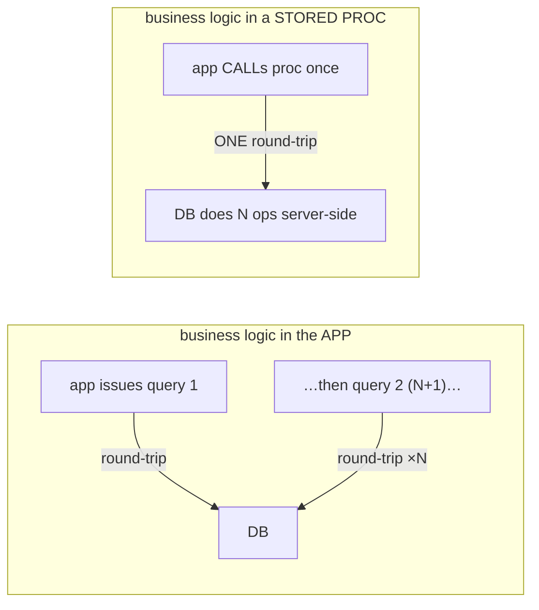

# Stored procedures, views, triggers

So far, SQL has been something your application *sends* to the database. This topic is about logic that lives **inside** the database: **views** (saved queries you can read like tables), **stored procedures and functions** (procedural code that runs server-side), and **triggers** (code that fires automatically when data changes). These are genuinely powerful — a stored procedure can collapse a chatty app-to-database conversation into a single round-trip; a view can present a clean, stable interface over a messy schema; a trigger can keep a denormalized count perfectly in sync. But they're also where logic *hides*, where vendor lock-in creeps in, and — most importantly — where the **hardest-to-scale tier of your system** takes on work the easily-scaled app tier could do. So this topic is as much about *when not to* as *how*.

The depth-bar: at the **language** layer, views, procedures/functions, and triggers, with their uses and pitfalls. At the **architecture** layer — the heart — how a view is a **free abstraction** (query rewrite), the **round-trip economics** of server-side logic *versus* the **database-as-precious-resource** reality, that **triggers run inside the transaction**, and the **business-logic-in-DB-vs-app** debate that decides where your code lives.

> [!NOTE]
> Prerequisites: [SQL: SELECT, JOINs, …](./T02-sql-select-joins-group-by-subqueries.md) (L2/C05/T02) — **views are saved `SELECT`s; `EXPLAIN`; the N+1 problem**; [SQL: DDL/DML/DCL](./T03-sql-ddl-dml-dcl.md) (L2/C05/T03) — **`CREATE VIEW`/`FUNCTION`, `GRANT`, versioned migrations**.

## Views

A **view** is a **stored, named query** — a *virtual* table you `SELECT` from as if it were real, but it holds **no data**; it runs the underlying query each time:

```sql
CREATE VIEW active_customers AS
  SELECT id, name, email FROM customers WHERE status = 'active';
-- now: SELECT * FROM active_customers WHERE email LIKE '%@example.com';
```

Three high-value uses:

- **Simplify complex queries** — give a gnarly join/aggregate a simple name so the app and other queries reuse it.
- **A stable interface over a changing schema** — the view's columns are a **contract** ([C04/T03](../C04-web-and-rest-basics/T03-api-design-resources-versioning-pagination-filtering.md)); you can refactor the underlying tables and keep the view's shape, decoupling consumers from the physical schema.
- **Security** — `GRANT SELECT` on a *view* that exposes only certain columns or rows, not the base table ([T03](./T03-sql-ddl-dml-dcl.md) DCL / least privilege). A view is how you give a reporting user "orders *without* the customer's SSN column" or "only their own rows."

**Updatable vs read-only**: a simple single-table view can be `INSERT`/`UPDATE`/`DELETE`-able; a view with joins, aggregates, or `DISTINCT` is read-only (you'd add an **`INSTEAD OF` trigger** to make it writable). And **materialized views** ([T04](./T04-normalization-and-denormalization.md)): a plain view recomputes on every access (no storage); a *materialized* view physically **stores** the result (fast reads, denormalized) and must be **`REFRESH`**ed — the managed denormalization from [T04](./T04-normalization-and-denormalization.md).

## Stored Procedures & Functions

Most databases extend SQL with a **procedural language** — PL/pgSQL (PostgreSQL), T-SQL (SQL Server), PL/SQL (Oracle), MySQL stored programs — adding variables, loops, conditionals, and exception handling, so you can write multi-step logic that runs **inside** the database. The distinction:

- **Function** — returns a value (scalar or a table) and is usable *in a query* (`SELECT total_for(order_id)`).
- **Procedure** — does work (side effects), can manage transactions (`COMMIT`/`ROLLBACK` inside), and is invoked with `CALL`.

The trade-off is real on both sides:

| Pros | Cons |
|------|------|
| **one round-trip** — N operations server-side in a single network trip | **logic split** between app and DB — two places to reason about |
| **atomicity** — wrap multi-step logic in the DB transaction | **hard to test/version/debug** — weak tooling vs app code |
| **centralization** — one rule for many apps/languages | **vendor lock-in** — PL/pgSQL ≠ T-SQL ≠ PL/SQL (porting = rewrite) |
| **security** — `GRANT EXECUTE` without table access | **scaling** — strains the scarcest tier (the DB CPU — below) |

## Triggers

A **trigger** is procedural code the database runs **automatically** in response to a data change — `BEFORE`, `AFTER`, or `INSTEAD OF` an `INSERT`/`UPDATE`/`DELETE`, at row or statement level. The legitimate uses:

- **Audit logging** — `AFTER INSERT/UPDATE/DELETE` → write a row recording who/what/when.
- **Maintaining denormalized data** — `AFTER` a comment insert → increment `posts.comment_count`. This is *the* clean implementation of [T04](./T04-normalization-and-denormalization.md)'s "denormalization needs a sync strategy."
- **Enforcing complex rules** beyond `CHECK` constraints (cross-table invariants), **derived columns**, and making a view updatable (`INSTEAD OF`).

But triggers carry a serious hazard: **hidden, implicit logic.** A trigger fires *invisibly* — an `INSERT` does what you wrote *plus* whatever its triggers do, with **no sign at the call site**. That makes behaviour surprising (a "simple insert" has side effects you can't see in the app code), debugging painful ("the cause is somewhere in a trigger"), and opens the door to **cascading triggers** (a trigger's write fires another trigger → chains and recursion) and a **performance** tax on every write. Use triggers sparingly, for genuinely cross-cutting concerns where the implicitness is acceptable.

## Memory & Architecture Layer

### A View Is a Free Abstraction — Query Rewrite

A *non-materialized* view costs nothing at runtime. At plan time, the optimizer **inlines** the view's definition into the outer query and optimizes the *whole thing as one* ([T02](./T02-sql-select-joins-group-by-subqueries.md)):

```sql
SELECT * FROM active_customers WHERE email LIKE '%@x.com';
-- the planner rewrites this to:
SELECT id, name, email FROM customers
  WHERE status = 'active' AND email LIKE '%@x.com';   -- both predicates, planned together
```

So the view stores no data and adds no overhead — the optimizer "sees through" it and pushes predicates down — while you get query reuse, a stable interface, and security. **Views are a free abstraction; use them liberally.** (A *materialized* view is the opposite — stored data you read directly, refreshed on a schedule — [T04](./T04-normalization-and-denormalization.md).)

### Round-Trip Economics vs the Database-as-Precious-Resource

This is the central architectural tension, and the heart of the topic. There's a real **performance** argument *for* server-side logic, and a real **scaling** argument *against* it:



- **For** (round-trip economics): a stored procedure does N operations in **one** network round-trip ([C03/T05](../C03-networking-fundamentals/T05-http-https-lifecycle.md) RTT cost), avoiding the app-side **N+1** ([T02](./T02-sql-select-joins-group-by-subqueries.md)). For *data-heavy* logic — a batch update touching many rows with intermediate computation — running it *in* the database, **next to the data**, can be dramatically faster than shipping rows to the app, processing, and shipping results back.
- **Against** (the scarce tier): the **database is the hardest tier to scale.** The app/web tier is **stateless** ([C03/T09](../C03-networking-fundamentals/T09-load-balancers.md)) and scales out horizontally for cheap (add servers behind a load balancer); the database is **stateful**, typically a single primary, and scaling it (sharding, replicas) is hard and expensive. So **DB CPU is precious** — every bit of business logic in a stored proc or trigger *competes with every query* for the system's scarcest resource.

The synthesis is a **where-does-the-CPU-go** decision: DB-side (one round-trip, but on the scarce tier) vs app-side (N round-trips, but on the cheap, scalable tier). The modern default — reinforced by microservices and ORMs — is **thin database, fat app**: keep business logic in the easily-scaled, easily-tested app tier; keep the database doing data (queries, integrity, transactions). Push logic into the DB only when the **data-locality win genuinely dominates** (heavy ETL/reporting near the data).

### Triggers Run Inside the Transaction

A trigger executes as part of the **same transaction** as the statement that fired it ([T06](./T06-transactions-and-acid.md)). The consequences are why triggers are doubly hazardous: a **slow** trigger slows *every* write; a **failing** trigger **aborts** the write and its transaction; **cascading** triggers all run in that one transaction (lengthening it → more locks [T07](./T07-isolation-levels-and-locking.md) and bloat [T03](./T03-sql-ddl-dml-dcl.md)); and recursion has hard limits. The combination of *implicit* and *in-transaction* is precisely what makes a misbehaving trigger so hard to track down.

### Business Logic in DB vs App

The debate, framed cleanly:

- **DB-side** (procs/triggers/views) — **performance** (data locality, fewer round-trips), **atomicity** (one transaction), **centralization** (one rule for every client/language), **security** (a controlled gateway).
- **App-side** — **testability** (real unit tests, mocks, CI), **versioning** (it's just code in git; DB code needs migration tooling — [T03](./T03-sql-ddl-dml-dcl.md)), **portability** (no vendor lock-in), and **scalability** (the cheap, stateless tier).

The pendulum has swung firmly toward **app-side for business logic** (the DB does data + integrity), but **data-heavy ETL, reporting, and bulk operations** still live well in the database where the data is.

### Java Angle

You call a stored procedure from JDBC with a **`CallableStatement`** ([T09](./T09-jdbc-and-connection-pooling-hikaricp.md)); views you query like any table. There's an **ORM tension**: ORMs (JPA/Hibernate) assume the logic is in the app and map tables↔objects — they work cleanly with **views** (map one as a read-only `@Immutable`/`@Subselect` entity) but stored procs sit *awkwardly* (you invoke them out-of-band), which reinforces the thin-DB lean. And treat DB code as code: **version your views, procedures, and triggers in Flyway/Liquibase migrations** ([T03](./T03-sql-ddl-dml-dcl.md)), in source control — never hand-apply them.

> [!IMPORTANT]
> A plain (non-materialized) **view is a free abstraction** — the optimizer **inlines** its query into the outer query and plans them together ([T02](./T02-sql-select-joins-group-by-subqueries.md)), so it stores nothing and adds no cost while giving you query reuse, a **stable interface over a changing schema** ([C04/T03](../C04-web-and-rest-basics/T03-api-design-resources-versioning-pagination-filtering.md)), and **column/row-level security** (grant on the view, not the table — [T03](./T03-sql-ddl-dml-dcl.md)). Use views liberally. A **materialized view** is the opposite — stored and fast, but must be refreshed — the managed denormalization of [T04](./T04-normalization-and-denormalization.md).

> [!WARNING]
> **Triggers run invisibly, inside the triggering transaction.** An `INSERT` silently does whatever its triggers do — so behaviour is surprising, debugging is "find the trigger," **cascading triggers** can chain unexpectedly, and every write pays the trigger's cost (a slow trigger slows all writes; a failing one **aborts** them — [T06](./T06-transactions-and-acid.md)). Use triggers for genuinely cross-cutting concerns (audit logs, keeping a denormalized count in sync — [T04](./T04-normalization-and-denormalization.md)), **not** for business logic you'd struggle to find six months later.

> [!TIP]
> Default to **thin database, fat app**: keep business logic in the app tier — which is **stateless and scales out cheaply** ([C03/T09](../C03-networking-fundamentals/T09-load-balancers.md)) and is far easier to **test, version, and debug** — and keep the database doing what only it can (queries, integrity, transactions). Reach for **stored procedures** only when the **round-trip / data-shipping cost dominates** (data-heavy batch logic next to the data — the [T02](./T02-sql-select-joins-group-by-subqueries.md) N+1 / [C03/T05](../C03-networking-fundamentals/T05-http-https-lifecycle.md) RTT win), because **DB CPU is the scarcest, least-scalable resource** in your system.

## Common Mistakes

### Business Logic Hidden in Triggers

Logic you can't find when debugging. Keep complex business rules visible in app code; reserve triggers for cross-cutting concerns.

### Heavy Compute in Stored Procedures

It strains the un-scalable DB tier ([C03/T09](../C03-networking-fundamentals/T09-load-balancers.md)). Move compute to the app unless data locality clearly wins.

### Vendor Lock-In via Procedural SQL

PL/pgSQL ≠ T-SQL ≠ PL/SQL — porting a procedure-heavy schema is a rewrite. Keep portable logic in the app.

### Forgetting Triggers Run In-Transaction

A slow trigger slows the write; a failing trigger aborts it ([T06](./T06-transactions-and-acid.md)). Keep triggers tiny and reliable.

### Updatable-View Surprises

A join/aggregate view isn't writable without an `INSTEAD OF` trigger. Know which views are updatable.

### Cascading / Recursive Triggers

One trigger's write fires another → chains and recursion. Avoid trigger webs.

### Not Versioning DB Code

Hand-applied procs/views/triggers drift between environments. Put them in **Flyway/Liquibase** migrations ([T03](./T03-sql-ddl-dml-dcl.md)).

### A Trigger Where a Constraint or App Code Is Clearer

For a simple invariant, a `CHECK` constraint ([T05](./T05-keys-constraints-and-relationships.md)) or explicit app logic is more visible and testable than a trigger.

### Granting Table Access Instead of a View

When a user needs only some columns/rows, expose a **view** ([T03](./T03-sql-ddl-dml-dcl.md) security), not the base table.

> [!INTERVIEW]
> Server-side database programming is a design-judgment topic — the standout answers weigh **round-trip economics against the un-scalable DB tier**.
>
> 1. **What is a view, and is it stored?** A stored named query (virtual table); a plain view stores **no** data (recomputed/inlined), a **materialized** view stores the result (refreshed — [T04](./T04-normalization-and-denormalization.md)).
> 2. **View uses?** Simplify queries, a stable interface over a changing schema, and **security** (column/row hiding — [T03](./T03-sql-ddl-dml-dcl.md)).
> 3. **How does a non-materialized view perform?** The optimizer **inlines/rewrites** it into the outer query and plans them together — no extra cost ([T02](./T02-sql-select-joins-group-by-subqueries.md)).
> 4. **Function vs stored procedure?** Function returns a value (usable in a query); procedure does side-effect work, can manage transactions, is `CALL`ed.
> 5. **Stored-proc pros/cons?** Pros: one round-trip, atomicity, centralization, security. Cons: split logic, hard to test/version/debug, vendor lock-in, strains the scarce DB tier.
> 6. **The round-trip economics?** A proc does N ops in **one** round-trip vs the app's N+1 ([T02](./T02-sql-select-joins-group-by-subqueries.md)/[C03/T05](../C03-networking-fundamentals/T05-http-https-lifecycle.md)) — a win for data-heavy logic near the data.
> 7. **Why is heavy logic in the DB a scaling concern?** The DB is the hardest tier to scale (stateful, single primary — [C03/T09](../C03-networking-fundamentals/T09-load-balancers.md)); the app scales out cheaply (stateless) → **thin DB, fat app**.
> 8. **Trigger types and uses?** `BEFORE`/`AFTER`/`INSTEAD OF` on `INSERT`/`UPDATE`/`DELETE`; audit logs, denorm sync ([T04](./T04-normalization-and-denormalization.md)), complex rules, updatable views.
> 9. **The danger of triggers?** Hidden/implicit logic (surprising side effects), cascading triggers, in-transaction cost, hard to debug.
> 10. **Do triggers run in the transaction?** Yes — the same transaction as the firing statement ([T06](./T06-transactions-and-acid.md)); a slow/failing trigger affects the write.
> 11. **Business logic in DB vs app?** DB: performance/atomicity/centralization/security; App: testability/versioning/portability/scalability — the modern lean is **app-side**.
> 12. **How do you secure with a view?** `GRANT` on the view (exposing some columns/rows), not the base table ([T03](./T03-sql-ddl-dml-dcl.md)).
> 13. **Call a proc / version DB code from Java?** `CallableStatement` ([T09](./T09-jdbc-and-connection-pooling-hikaricp.md)); version views/procs/triggers in Flyway/Liquibase ([T03](./T03-sql-ddl-dml-dcl.md)).

## Practice

1. **View + rewrite.** Create a view over a complex join; `SELECT` from it with an extra filter; `EXPLAIN` and observe the **inlined** plan ([T02](./T02-sql-select-joins-group-by-subqueries.md)).
2. **Materialized view.** Create one, query it (fast), `REFRESH` it; contrast with the plain view ([T04](./T04-normalization-and-denormalization.md)).
3. **Security view.** `GRANT SELECT` on a view exposing some columns; verify the user can't see the hidden ones ([T03](./T03-sql-ddl-dml-dcl.md)).
4. **Updatable view.** `INSERT`/`UPDATE` on a single-table view (works) vs a join view (read-only); add an `INSTEAD OF` trigger.
5. **Function + procedure.** Write a PL/pgSQL function (returns a value) and a procedure (does work); `CALL` the procedure.
6. **Audit trigger.** `AFTER INSERT/UPDATE/DELETE` → write to an audit table; observe it fire invisibly.
7. **Denorm-sync trigger.** `AFTER` a comment insert → increment `posts.comment_count`; verify consistency under inserts/deletes ([T04](./T04-normalization-and-denormalization.md)).
8. **Round-trip.** Implement a batch operation as a stored proc (one round-trip) vs an app loop (N round-trips); measure ([T02](./T02-sql-select-joins-group-by-subqueries.md)/[C03/T05](../C03-networking-fundamentals/T05-http-https-lifecycle.md)).
9. **Cascade.** Make a trigger whose write fires another; observe the chain (and the recursion guard).
10. **In-transaction.** Make a trigger fail; observe it aborts the firing statement's transaction ([T06](./T06-transactions-and-acid.md)).
11. **CallableStatement.** Call a stored proc from JDBC ([T09](./T09-jdbc-and-connection-pooling-hikaricp.md)).
12. **Version it.** Put a view/proc/trigger in a Flyway/Liquibase migration ([T03](./T03-sql-ddl-dml-dcl.md)).
13. **Debate.** For "calculate order total + apply discounts," argue DB-side proc vs app-side; pick and justify.
14. **Explain it back.** For "keep a denormalized `comment_count` in sync," (a) write the trigger, (b) explain it runs **in-transaction** ([T06](./T06-transactions-and-acid.md)), (c) the hidden-logic trade-off, (d) why a plain view wouldn't solve it but a **materialized view** could ([T04](./T04-normalization-and-denormalization.md)), and (e) when you'd do it app-side instead.

## Recap

You should now be able to:

- Use **views** — a stored query (no data, **inlined** by the optimizer — [T02](./T02-sql-select-joins-group-by-subqueries.md)) for **simplification**, a **stable interface** over a changing schema ([C04/T03](../C04-web-and-rest-basics/T03-api-design-resources-versioning-pagination-filtering.md)), and **security** ([T03](./T03-sql-ddl-dml-dcl.md)) — and distinguish updatable vs read-only and **materialized** views ([T04](./T04-normalization-and-denormalization.md)).
- Write **stored procedures/functions** (procedural SQL), and weigh their **pros** (one round-trip, atomicity, centralization, security) against their **cons** (split logic, testing/versioning/debugging, vendor lock-in, DB scaling).
- Use **triggers** (`BEFORE`/`AFTER`/`INSTEAD OF`) for audit logs, **denormalization sync** ([T04](./T04-normalization-and-denormalization.md)), and complex rules — while respecting the **hidden-logic** and **in-transaction** dangers ([T06](./T06-transactions-and-acid.md)).
- Reason about the **architecture**: the **round-trip economics** of server-side logic ([T02](./T02-sql-select-joins-group-by-subqueries.md)/[C03/T05](../C03-networking-fundamentals/T05-http-https-lifecycle.md)) **vs** the **database-as-precious-resource** ([C03/T09](../C03-networking-fundamentals/T09-load-balancers.md)), the **thin-DB / fat-app** default, and the **business-logic-in-DB-vs-app** debate — and the Java side (`CallableStatement`, ORM tension, versioned migrations) — avoiding the traps (hidden trigger logic, DB-tier compute, vendor lock-in, in-transaction triggers, un-versioned DB code).

## Next

Continue to [JDBC & connection pooling (HikariCP)](./T09-jdbc-and-connection-pooling-hikaricp.md).
