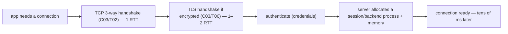

# JDBC & connection pooling (HikariCP)

Every topic in this chapter has been about the database; this one is the **bridge** — how Java actually talks to it. **JDBC** (Java Database Connectivity) is the standard API, and **connection pooling** (HikariCP) is the not-optional pattern that makes it perform. Two lessons matter above all: **always use `PreparedStatement`** (SQL injection is the #1 web vulnerability, and parameterizing *also* caches the query plan), and **never open a connection per request** — pool them, because a database connection is one of the most *expensive* things you can create and one of the *scarcest* things the database has. Get those two right and you've avoided the most common database-related outages in production. This is the finale of the Databases chapter — and of the entire L2 module.

The depth-bar: at the **language** layer, the JDBC API (`Connection`, `PreparedStatement`, `ResultSet`), transactions, batching, and try-with-resources. At the **architecture** layer — the heart — the **connection lifecycle and its cost**, the **pool as a bounded resource**, **pool exhaustion**, the counterintuitive **small-pool paradox**, the **sum-of-pools** constraint, and **prepared-statement plan caching**.

> [!NOTE]
> Prerequisites: [Relational model & terminology](./T01-relational-model-and-terminology.md) (L2/C05/T01) — **a `ResultSet` is a relation; the object/relational impedance mismatch**; [Transactions & ACID](./T06-transactions-and-acid.md) (L2/C05/T06) — **a connection *is* a transaction; keep transactions short**.

## JDBC — the Standard Java DB API

**JDBC** is the vendor-neutral API in `java.sql`. You code to its interfaces; a **driver** — a database-specific jar (`org.postgresql.Driver`, MySQL Connector/J) — implements the actual wire protocol. Swap the driver, change databases, keep your code. The pieces:

- **`DataSource` / `DriverManager`** — how you obtain a `Connection` (a `DataSource` is the modern, *poolable* way; `DriverManager` the old direct way).
- **`Connection`** — a session to the database, and *it is the transaction* ([T06](./T06-transactions-and-acid.md) — `setAutoCommit`/`commit`/`rollback`). Under the hood it holds a **socket** to the DB server ([C03/T03](../C03-networking-fundamentals/T03-ip-ports-and-sockets.md)).
- **`Statement` vs `PreparedStatement` vs `CallableStatement`**:
  - **`Statement`** — a raw SQL string; **vulnerable to SQL injection** if you concatenate user input.
  - **`PreparedStatement`** — parameterized with `?` placeholders bound via `setString`/`setInt`/…; it **prevents SQL injection** (the input is *data*, never parsed as SQL — [T03](./T03-sql-ddl-dml-dcl.md)) **and** enables **plan caching** (the DB parses/plans once, reuses across parameter values — [T02](./T02-sql-select-joins-group-by-subqueries.md)). **Always use it.**
  - **`CallableStatement`** — calls stored procedures ([T08](./T08-stored-procedures-views-triggers.md)).
- **`ResultSet`** — a **cursor** over the returned rows (a relation — [T01](./T01-relational-model-and-terminology.md)): iterate with `next()`, read columns by name/index (`getString`/`getInt`), mapping SQL types to Java. It's forward-only and read-only by default (it *streams* rows). Mapping rows to objects by hand is the object/relational **impedance mismatch** ([T01](./T01-relational-model-and-terminology.md)) that ORMs ([C04/T04](../C04-web-and-rest-basics/T04-content-negotiation-and-serialization-json-xml-jackson.md)) automate.
- **`executeQuery` / `executeUpdate` / `executeBatch`** — a query (returns a `ResultSet`) / DML (returns a row count) / **batching** (`addBatch` + `executeBatch` send many statements in **one** round-trip — the [T08](./T08-stored-procedures-views-triggers.md)/[T02](./T02-sql-select-joins-group-by-subqueries.md) round-trip win).

```java
String sql = "SELECT id, name FROM users WHERE status = ? AND city = ?";
try (Connection conn = dataSource.getConnection();          // borrow from the pool
     PreparedStatement ps = conn.prepareStatement(sql)) {   // parameterized → injection-safe + plan-cached
    ps.setString(1, status);                                // bound as DATA, never parsed as SQL
    ps.setString(2, city);
    try (ResultSet rs = ps.executeQuery()) {
        while (rs.next()) {                                 // cursor over the relation (T01)
            process(rs.getLong("id"), rs.getString("name"));
        }
    }
}   // try-with-resources closes rs, ps, conn — the connection RETURNS to the pool
```

The **try-with-resources** is not optional: `Connection`, `Statement`, and `ResultSet` are `AutoCloseable`, and a leaked (unclosed) connection is one that's **never returned to the pool** — the road to exhaustion.

## Connection Pooling — Why It's Mandatory

Here is the single most important operational fact about databases from Java: **opening a database connection is enormously expensive.** It is not a function call — it's a sequence of slow, networked steps:



That's a **TCP handshake** ([C03/T02](../C03-networking-fundamentals/T02-tcp-vs-udp.md)), a **TLS handshake** if encrypted ([C03/T06](../C03-networking-fundamentals/T06-tls-ssl-and-certificates.md)), **authentication**, and **server-side session setup** (PostgreSQL forks a whole backend *process* per connection) — often **tens of milliseconds**, frequently *more than the query itself*. And the database **caps** how many connections it accepts, because each costs server memory and a process (PostgreSQL's `max_connections`, often ~100) — the **C10k problem for databases** ([C03/T03](../C03-networking-fundamentals/T03-ip-ports-and-sockets.md)). So **opening a connection per request is catastrophic** twice over: the setup dwarfs the work, and you'd blow past `max_connections` under any load.

The fix is a **connection pool**: a fixed set of **pre-opened** connections, **reused** across requests — **borrow** one, use it, **return** it (not *close* — return to the pool). The expensive setup is paid once at startup and amortized over millions of requests. **HikariCP** is the fast, de-facto Java pool (Spring Boot's default). Its key settings: `maximumPoolSize`, `minimumIdle`, **`connectionTimeout`** (how long to wait for a free connection before failing), `idleTimeout`, **`maxLifetime`** (recycle connections to avoid stale server-side state), and **`leakDetectionThreshold`**.

## Memory & Architecture Layer

### The Pool as a Bounded Resource, and Exhaustion

A pool is a classic **bounded object pool**: a fixed number of connections, borrowed and returned. When all are checked out, the next borrower **blocks** until one is returned — up to `connectionTimeout`, then it fails. That bounding is *intentional*: it shields the database from being overwhelmed. But it means **pool exhaustion** is a real and common outage — all connections checked out, new requests timing out — and its causes are exactly the things this chapter has warned about:

- **Leaked connections** — borrowed and never returned (a missing `close`) → permanently removed from the pool. Try-with-resources prevents this; `leakDetectionThreshold` catches it.
- **Long transactions** ([T06](./T06-transactions-and-acid.md)) — a connection held by a slow transaction is unavailable to everyone else. *This* is the operational reason "keep transactions short" matters: a held connection is a held pool slot.
- **Slow queries** — each holds its connection longer, reducing effective pool capacity.
- **A pool too small** for the genuine concurrency.

The connection is, recall ([T08](./T08-stored-procedures-views-triggers.md)), the scarce DB resource — and a connection inside a transaction also holds **locks** ([T07](./T07-isolation-levels-and-locking.md)) and (under MVCC) blocks `VACUUM` ([T03](./T03-sql-ddl-dml-dcl.md)). So a connection held too long is *triply* costly: a pool slot, locks, and table bloat. Keeping transactions short ([T06](./T06-transactions-and-acid.md)) is the lever that protects all three.

### The Small-Pool Paradox

The most counterintuitive — and most important — tuning fact: **a bigger pool is usually *slower*, not faster.** A pool larger than the database can effectively serve just creates **context-switching and lock contention** on the DB; the connections sit waiting on the database's *real* concurrency limit (its cores and disks) while adding overhead. HikariCP's well-known guidance sizes a pool at roughly **`(cores × 2) + effective_spindles`** — which means **10–20 connections** routinely serve *thousands* of requests per second, not the hundreds of connections people instinctively reach for. The intuition (from queueing theory / Little's Law): throughput is bounded by the database's actual ability to do concurrent work, not by how many connections you *offer* it — a small pool that keeps the DB busy-but-not-thrashing beats a huge pool that drowns it. **Start small; only grow the pool if you measure starvation.**

### Sum-of-Pools ≤ max_connections

The multi-instance gotcha that bites when you scale out. With horizontal scaling — N app instances behind a load balancer ([C03/T09](../C03-networking-fundamentals/T09-load-balancers.md)) — **each instance has its own pool**, so the **sum of all pools must not exceed the database's `max_connections`**. Ten app instances each with a 20-connection pool = 200 connections; if the database caps at 100, half your instances can't connect and you get cascading failures. As you add app servers (cheap, stateless — [C03/T09](../C03-networking-fundamentals/T09-load-balancers.md)), you must shrink per-instance pools or raise the DB cap (or add a separate connection-pooling proxy like PgBouncer). This is the database's stateful, hard-to-scale nature ([T08](./T08-stored-procedures-views-triggers.md)) meeting the app tier's easy horizontal scaling.

### Prepared-Statement Plan Caching

One more reason `PreparedStatement` is non-negotiable: beyond preventing injection ([T03](./T03-sql-ddl-dml-dcl.md)), a parameterized statement is **parsed and planned once** by the database, and subsequent executions with different parameter values **reuse the cached plan** ([T02](./T02-sql-select-joins-group-by-subqueries.md)), skipping the re-parse/re-plan overhead. (Pools and drivers also cache the `PreparedStatement` objects per connection.) So parameterization buys you **security *and* performance** from the same one habit.

### The Java Database Stack

The full picture, top to bottom: **your code → an ORM (JPA/Hibernate — [C04/T04](../C04-web-and-rest-basics/T04-content-negotiation-and-serialization-json-xml-jackson.md)) → JDBC → the driver → a pooled socket → the database.** JDBC is the foundation everything else sits on — ORMs ultimately generate JDBC calls — which is why understanding it (and the pool beneath it) makes every higher layer comprehensible. Spring Boot auto-configures a HikariCP `DataSource`; `spring.datasource.hikari.*` tunes it.

> [!IMPORTANT]
> **Never open a database connection per request — pool them.** Opening a connection is one of the most expensive operations in your system (a TCP handshake — [C03/T02](../C03-networking-fundamentals/T02-tcp-vs-udp.md) — plus TLS — [C03/T06](../C03-networking-fundamentals/T06-tls-ssl-and-certificates.md) — plus auth plus a server-side session/process), often costing more than the query, and the database **caps** how many it accepts (the C10k problem for databases — [C03/T03](../C03-networking-fundamentals/T03-ip-ports-and-sockets.md)). A **connection pool** (HikariCP) pays that setup *once* at startup and reuses a fixed set forever — **borrow, use, return** (not close).

> [!WARNING]
> **A bigger pool is usually *slower*** (the small-pool paradox) — a pool larger than the DB can serve causes context-switching and lock contention; HikariCP's guidance is roughly **(cores × 2)**, often just **10–20 connections** for thousands of req/s. And with horizontal scaling, the **sum of every instance's pool must not exceed the DB's `max_connections`** ([C03/T09](../C03-networking-fundamentals/T09-load-balancers.md)) — `10 × 20 = 200` exhausts a DB capped at 100. **Pool exhaustion** (all connections checked out → requests timing out) is a classic outage, caused by **leaked connections** (forgotten `close`), **long transactions** ([T06](./T06-transactions-and-acid.md)), and **slow queries**.

> [!TIP]
> Four JDBC non-negotiables: **(1) always `PreparedStatement`** with bound parameters — it prevents **SQL injection** ([T03](./T03-sql-ddl-dml-dcl.md)) *and* lets the DB **cache the plan** ([T02](./T02-sql-select-joins-group-by-subqueries.md)); **(2) always try-with-resources** so `Connection`/`Statement`/`ResultSet` are closed (returned to the pool) even on exception; **(3) always a pool** (HikariCP), sized **small**; **(4) always keep transactions short** ([T06](./T06-transactions-and-acid.md)) — a held connection is a scarce pool slot *and* holds locks ([T07](./T07-isolation-levels-and-locking.md)).

## Common Mistakes

### Opening a Connection Per Request

Catastrophic — the setup cost dominates and you exhaust `max_connections`. Always pool.

### Not Closing / Returning Connections

A leak permanently removes a connection from the pool → exhaustion. Use try-with-resources; enable leak detection.

### Long Transactions Holding Pool Connections

A held connection is a held pool slot (plus locks — [T07](./T07-isolation-levels-and-locking.md), plus bloat — [T03](./T03-sql-ddl-dml-dcl.md)). Keep transactions short ([T06](./T06-transactions-and-acid.md)).

### Pool Too Large (or Too Small)

Too large thrashes the DB (small-pool paradox); too small causes queueing. Size ≈ cores × 2, then measure.

### String-Concatenation SQL

SQL injection. Always `PreparedStatement` ([T03](./T03-sql-ddl-dml-dcl.md)).

### Sum-of-Pools Exceeding `max_connections`

N instances × pool size can overrun the DB cap when you scale out ([C03/T09](../C03-networking-fundamentals/T09-load-balancers.md)). Coordinate pool size with instance count.

### Ignoring `connectionTimeout` / `maxLifetime` / Leak Detection

Silent hangs, stale connections, undetected leaks. Configure them.

### Not Batching

N round-trips where one `executeBatch` would do ([T08](./T08-stored-procedures-views-triggers.md)/[T02](./T02-sql-select-joins-group-by-subqueries.md)). Batch bulk writes.

> [!INTERVIEW]
> JDBC + pooling is a guaranteed backend interview area — the standout answers explain **why connections are expensive** and the **small-pool paradox**.
>
> 1. **What is JDBC?** The standard Java DB API (`java.sql`); you code to the interface, the **driver** implements the protocol.
> 2. **`Statement` vs `PreparedStatement`?** `PreparedStatement` parameterizes (`?`) → prevents **injection** ([T03](./T03-sql-ddl-dml-dcl.md)) *and* caches the **plan** ([T02](./T02-sql-select-joins-group-by-subqueries.md)); always use it.
> 3. **How does `PreparedStatement` prevent injection?** The input is bound as **data**; the SQL structure is fixed before values arrive, so input is never parsed as SQL.
> 4. **What is a `ResultSet`?** A cursor over the returned rows (a relation — [T01](./T01-relational-model-and-terminology.md)); iterate with `next()`; forward-only by default.
> 5. **Why is opening a connection expensive?** TCP ([C03/T02](../C03-networking-fundamentals/T02-tcp-vs-udp.md)) + TLS ([C03/T06](../C03-networking-fundamentals/T06-tls-ssl-and-certificates.md)) + auth + server-side session/process — tens of ms, often > the query.
> 6. **Why pool connections?** Amortize the expensive setup and stay under the DB's connection cap; never open per request.
> 7. **What is HikariCP?** The fast de-facto Java connection pool (Spring Boot's default).
> 8. **The small-pool paradox?** A bigger pool is often *slower* (DB context-switching/contention); size ≈ cores × 2 — often 10–20 connections.
> 9. **What causes pool exhaustion?** Leaked connections (no `close`), long transactions ([T06](./T06-transactions-and-acid.md)), slow queries, a too-small pool → `connectionTimeout`.
> 10. **The sum-of-pools gotcha?** Each instance has a pool; the **sum** must not exceed DB `max_connections` ([C03/T09](../C03-networking-fundamentals/T09-load-balancers.md)).
> 11. **Why try-with-resources for JDBC?** `Connection`/`Statement`/`ResultSet` are `AutoCloseable`; closing **returns** the connection to the pool, even on exception.
> 12. **The connection = the transaction?** Yes — it holds the transaction and its locks ([T06](./T06-transactions-and-acid.md)/[T07](./T07-isolation-levels-and-locking.md)); a long-held connection is triply costly.
> 13. **What is batching?** `addBatch`/`executeBatch` — many statements in one round-trip ([T08](./T08-stored-procedures-views-triggers.md)/[T02](./T02-sql-select-joins-group-by-subqueries.md)).
> 14. **The Java DB stack?** code → ORM (JPA — [C04/T04](../C04-web-and-rest-basics/T04-content-negotiation-and-serialization-json-xml-jackson.md)) → JDBC → driver → pooled socket → DB.

## Practice

1. **Raw JDBC.** Open a connection, run a parameterized `PreparedStatement` query, iterate the `ResultSet` — all in try-with-resources.
2. **Injection.** Build a query by string concatenation; inject `' OR 1=1 --`; fix with `PreparedStatement` ([T03](./T03-sql-ddl-dml-dcl.md)).
3. **Batch.** Insert 10k rows in a loop (N round-trips) vs `executeBatch` (one); measure ([T08](./T08-stored-procedures-views-triggers.md)/[T02](./T02-sql-select-joins-group-by-subqueries.md)).
4. **Transaction.** `setAutoCommit(false)`, two writes, `commit`; force a failure and `rollback` ([T06](./T06-transactions-and-acid.md)).
5. **HikariCP.** Configure a `DataSource`; tune `maximumPoolSize`.
6. **Exhaustion via leak.** Borrow connections without closing; watch the pool exhaust and `connectionTimeout` fire.
7. **Exhaustion via long txn.** Hold a transaction open; observe a connection stays checked out ([T06](./T06-transactions-and-acid.md)).
8. **Small-pool paradox.** Benchmark a workload at pool size 10 vs 100; observe the large pool isn't faster (often slower).
9. **Connection cost.** Measure the time to open a *fresh* connection vs *borrow* from the pool.
10. **`maxLifetime` / leak detection.** Configure them; observe a recycled / a leaked connection logged.
11. **Sum-of-pools.** Reason about N instances × pool size vs DB `max_connections` ([C03/T09](../C03-networking-fundamentals/T09-load-balancers.md)).
12. **Mapping.** Map `ResultSet` rows to objects by hand; note the impedance mismatch ([T01](./T01-relational-model-and-terminology.md)) an ORM ([C04/T04](../C04-web-and-rest-basics/T04-content-negotiation-and-serialization-json-xml-jackson.md)) would handle.
13. **The stack.** Trace a Spring `@Repository` call down through JPA → JDBC → driver → socket.
14. **Explain it back.** For a web app under load, (a) why a per-request connection is catastrophic, (b) how the pool fixes it, (c) why the pool should be **small**, (d) how a leaked connection or long transaction exhausts it, and (e) the sum-of-pools constraint when you scale to 10 instances ([C03/T09](../C03-networking-fundamentals/T09-load-balancers.md)).

## Recap

You should now be able to:

- Use the **JDBC** API — `DataSource`/`Connection`, **`PreparedStatement`** (injection-safe + plan-cached — [T03](./T03-sql-ddl-dml-dcl.md)/[T02](./T02-sql-select-joins-group-by-subqueries.md)), `CallableStatement` ([T08](./T08-stored-procedures-views-triggers.md)), the **`ResultSet`** cursor ([T01](./T01-relational-model-and-terminology.md)), transactions ([T06](./T06-transactions-and-acid.md)), **batching**, and **try-with-resources**.
- Explain **why a database connection is expensive** (TCP + TLS + auth + session — [C03/T02](../C03-networking-fundamentals/T02-tcp-vs-udp.md)/[T06](../C03-networking-fundamentals/T06-tls-ssl-and-certificates.md)) and **capped** ([C03/T03](../C03-networking-fundamentals/T03-ip-ports-and-sockets.md)), so it must be **pooled** (HikariCP — borrow/use/return).
- Reason about the pool architecture: it's a **bounded resource** that can **exhaust** (leaks, long transactions — [T06](./T06-transactions-and-acid.md), slow queries); the **small-pool paradox** (≈ cores × 2, not hundreds); the **sum-of-pools ≤ `max_connections`** constraint when scaling out ([C03/T09](../C03-networking-fundamentals/T09-load-balancers.md)); and **prepared-statement plan caching** ([T02](./T02-sql-select-joins-group-by-subqueries.md)).
- Apply the four non-negotiables — **`PreparedStatement`, try-with-resources, a small pool, short transactions** — and place JDBC in the stack (code → ORM → JDBC → driver → socket → DB), avoiding the traps (per-request connections, leaks, long transactions, oversized pools, string SQL, sum-of-pools overrun, no batching).

## Next

This is the last topic of the **Databases & SQL** chapter — which is now **complete (9/9)** — and with it the entire **Intermediate Java & Backend Foundations (L2)** module is **complete (44/44)**. You've built the full backend foundation: functional & modern Java, build tools & workflow, networking & the web, REST APIs, and databases end to end. Continue to the next module, [Advanced Java & the JVM (L3)](../../L3-advanced-jvm/README.md).
