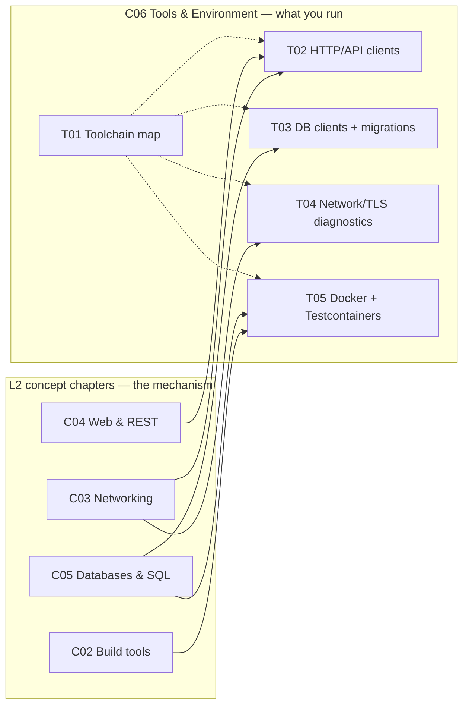

# Intermediate Java & Backend Foundations — Tools & Environment

The **concept chapters** of L2 teach the *mechanism* — how build tools resolve a dependency graph (C02), how TCP/TLS/HTTP carry bytes (C03), how REST shapes an API (C04), how a query planner walks a B-tree (C05). This chapter teaches the **tools you actually run** to work with that machinery day to day: the HTTP clients you poke an endpoint with, the database clients you inspect a table with, the packet- and TLS-level diagnostics you reach for when the network misbehaves, and the containers you spin a real Postgres up in for an integration test.

These are **reference** topics, not concept topics — they don't count toward the 371 concept total. But they hold the **same depth bar**: real commands, the mechanism humming under each one, edge cases, and troubleshooting recipes — not a shallow "install X, run Y" sampler.

> [!NOTE]
> **Tier:** Junior to Mid
> **Prerequisites:** L2 concept chapters — [C02 Build Tools](../C02-build-tools-and-workflow/), [C03 Networking](../C03-networking-fundamentals/), [C04 Web & REST](../C04-web-and-rest-basics/), [C05 Databases & SQL](../C05-databases-and-sql/)

## Topics

| # | Topic | File | Maps to | Status |
|---|-------|------|---------|--------|
| 01 | Backend toolchain quick reference | [`T01-backend-toolchain-quick-reference.md`](./T01-backend-toolchain-quick-reference.md) | all of L2 | **complete** |
| 02 | HTTP & API clients (curl, HTTPie, Postman, DevTools) | [`T02-http-and-api-clients.md`](./T02-http-and-api-clients.md) | C03/C04 | **complete** |
| 03 | Database clients & migration tools (psql/mysql, DBeaver, Flyway/Liquibase) | [`T03-database-clients-and-migration-tools.md`](./T03-database-clients-and-migration-tools.md) | C05 | **complete** |
| 04 | Network & TLS diagnostics (dig, ss, tcpdump, openssl) | [`T04-network-and-tls-diagnostics.md`](./T04-network-and-tls-diagnostics.md) | C03 | **complete** |
| 05 | Local dev environment: Docker & Testcontainers | [`T05-local-dev-environment-docker-testcontainers.md`](./T05-local-dev-environment-docker-testcontainers.md) | all of L2 | **complete** |

## How this chapter relates to the rest of L2

[Back to L2 index](../README.md) · [Master curriculum](../../../CURRICULUM.md)
