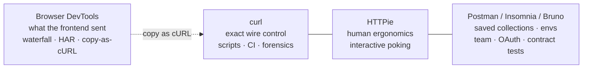
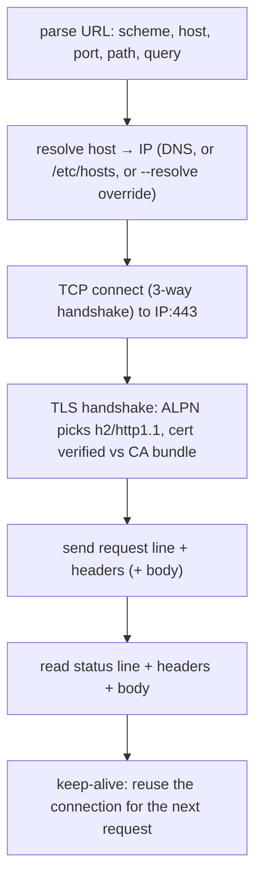
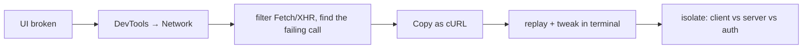

# HTTP & API Clients (curl, HTTPie, Postman, DevTools)

The deep dive on the tools you call HTTP APIs with — expanding [T01 §2](./T01-backend-toolchain-quick-reference.md). The HTTP *semantics* (methods, status codes, headers, idempotency) live in [C04 HTTP in depth](../C04-web-and-rest-basics/T01-http-in-depth-methods-status-headers.md); the *wire lifecycle* (DNS → TCP → TLS → request → response) lives in [C03 HTTP/HTTPS lifecycle](../C03-networking-fundamentals/T05-http-https-lifecycle.md). This file is about driving that machinery from a client: **curl** for exact control, **HTTPie** for ergonomics, **Postman/Insomnia/Bruno** for saved collections and team workflows, and **browser DevTools** for forensics on requests the frontend actually made.

## The Client Spectrum



| Tool | Strength | Reach for it when |
|------|----------|-------------------|
| **curl** | precise, scriptable, everywhere | CI, repro from a bug report, exact header/TLS control, timing forensics |
| **HTTPie** | readable syntax + output | interactive exploration by hand |
| **Postman/Insomnia/Bruno** | collections, environments, scripting | recurring multi-step flows, OAuth, sharing, contract testing |
| **DevTools Network** | sees real browser traffic | "the UI is broken" → capture + replay the failing request |

---

## 1. curl — The Universal HTTP Workhorse

### 1.1 What curl actually does

A single `curl https://api.example.com/users/42` runs the entire [C03 request lifecycle](../C03-networking-fundamentals/T05-http-https-lifecycle.md):



`-v` (verbose) prints this whole exchange — lines prefixed `*` are curl's notes (connection, TLS), `>` are request bytes sent, `<` are response bytes received. Reading `-v` output fluently is the core skill; it's the [C04 anatomy of a request](../C04-web-and-rest-basics/T01-http-in-depth-methods-status-headers.md) shown literally.

### 1.2 Methods and the `-X` trap

```bash
curl URL                       # GET (default)
curl -d '{}' URL               # implies POST — you do NOT need -X POST
curl -X PUT  -d '...' URL
curl -X DELETE URL
curl -I URL                    # HEAD: headers only (note: capital -I, not -i)
curl -X PATCH -d '...' URL
```

> [!WARNING]
> **The `-X` trap.** `-X` only overrides the method *string*; it doesn't change curl's behavior. `curl -X GET -d data URL` still sends a body (because `-d` set up a body) but labels it GET — a malformed request many servers reject. And `-X POST` *without* `-d` sends a POST with no body and no `Content-Length` logic. Rule: let `-d`/`-F`/`--data-*` imply the method; only use `-X` for methods that take no body (DELETE) or non-standard verbs.

### 1.3 Headers

```bash
curl -H 'Accept: application/json' URL                 # add a header (C04 content negotiation)
curl -H 'Authorization: Bearer eyJ...' URL
curl -H 'X-Request-Id: abc-123' URL
curl -H 'Accept:' URL                                  # REMOVE a default header (empty value)
curl -H 'Host: internal.svc' https://1.2.3.4/          # override Host (test virtual-hosting / a LB)
curl -A 'my-agent/1.0' URL                             # shortcut for User-Agent
curl -e 'https://ref.example' URL                      # shortcut for Referer
```

### 1.4 Request bodies — the five forms

```bash
curl -d '{"a":1}' URL                  # raw body; auto-sets Content-Type: application/x-www-form-urlencoded (!)
curl -d '{"a":1}' -H 'Content-Type: application/json' URL   # JSON: you MUST set the type yourself
curl --json '{"a":1}' URL              # curl 7.82+: sets Content-Type AND Accept to application/json
curl --data-raw '@literal'             # like -d but does NOT treat a leading @ as a file
curl --data-binary @body.json URL      # send file bytes EXACTLY (no newline stripping) — use for JSON files
curl --data-urlencode 'q=a b&c' URL    # percent-encode a value safely (spaces, &, =)
curl -F 'file=@photo.png' -F 'name=Ada' URL   # multipart/form-data (file upload); sets boundaries
curl -F 'file=@photo.png;type=image/png' URL  # set the part's content-type
curl -T ./bigfile URL                  # PUT-upload a file (streamed)
```

> [!TIP]
> `-d @file` strips newlines and whitespace (it was designed for form data) — for a JSON file use **`--data-binary @file`** so the bytes go unmodified. And `-d` reads `@name` as "read file `name`"; to send a literal `@...` string use `--data-raw`.

### 1.5 Authentication shapes

```bash
curl -u alice:s3cret URL               # HTTP Basic → header 'Authorization: Basic base64(alice:s3cret)'
curl -u alice URL                      # prompt for the password (keeps it out of argv/history)
curl -H 'Authorization: Bearer <jwt>' URL     # Bearer token / JWT (C03 tokens)
curl --netrc URL                       # read credentials from ~/.netrc (machine/login/password)
curl --digest -u alice:s3cret URL      # HTTP Digest auth
curl --aws-sigv4 'aws:amz:us-east-1:s3' --user "$KEY:$SECRET" URL   # sign an AWS request
```

> [!WARNING]
> **Basic auth is base64, not encryption** — trivially reversible. It is safe *only* over HTTPS, where TLS encrypts the whole header ([C03 TLS](../C03-networking-fundamentals/T06-tls-ssl-and-certificates.md)). Over plain HTTP it is equivalent to sending the password in cleartext.

### 1.6 TLS options

```bash
curl --cacert ca.pem URL               # verify the server against a specific CA bundle
curl --cert client.pem --key client.key URL   # mutual TLS (mTLS): present a client certificate
curl --tlsv1.3 URL                     # require a minimum TLS version
curl -v URL 2>&1 | grep -E 'SSL|TLS|subject|issuer'   # read the negotiated cipher + cert
curl -k URL                            # --insecure: SKIP certificate verification
```

> [!WARNING]
> **`-k`/`--insecure` disables the entire trust check** — it accepts expired, self-signed, wrong-host, and attacker certificates silently, defeating the point of TLS. Use it *only* to confirm "is the cert the problem?" during local debugging, **never** in scripts, CI, or anything touching real data. The right fix for a self-signed dev cert is `--cacert` pointing at the dev CA, not `-k`.

### 1.7 HTTP versions

```bash
curl --http1.1 URL
curl --http2 URL                       # over TLS, version is negotiated via ALPN in the handshake
curl --http3 URL                       # QUIC/UDP (needs an HTTP/3-capable curl build)
curl -v --http2 URL 2>&1 | grep -i 'ALPN\|HTTP/2'
```

HTTP/2 multiplexes many requests over one TCP+TLS connection (no head-of-line blocking at the HTTP layer); HTTP/3 moves that onto QUIC over UDP to also dodge TCP-level head-of-line blocking. curl negotiates the version during the handshake; force one to test a specific path.

### 1.8 Redirects, retries, timeouts

```bash
curl -L URL                            # follow 3xx redirects (off by default!)
curl -L --max-redirs 5 URL             # cap redirect hops (avoid loops)
curl --connect-timeout 3 URL           # cap the TCP+TLS connect phase
curl --max-time 10 URL                 # cap the WHOLE operation (connect + transfer)
curl --retry 3 --retry-delay 2 URL     # retry on transient errors (with backoff)
curl --retry 3 --retry-connrefused URL # also retry when the connection is refused (server booting)
curl --retry 3 --retry-all-errors URL  # retry on any error incl. non-transient HTTP codes
```

> [!TIP]
> Only auto-retry **idempotent** requests (GET/PUT/DELETE — see [C04 idempotency](../C04-web-and-rest-basics/T02-rest-principles-and-best-practices.md)). Retrying a non-idempotent `POST` can double-charge a card or create two orders. For POST, retry only with an `Idempotency-Key` the server honors.

### 1.9 Timing forensics — `-w`

The write-out template prints machine-readable metrics after the transfer. The timing variables are cumulative seconds from start (see [T01 §2](./T01-backend-toolchain-quick-reference.md) for the diagram):

```bash
curl -o /dev/null -s -w '
 dns:      %{time_namelookup}
 connect:  %{time_connect}
 tls:      %{time_appconnect}
 ttfb:     %{time_starttransfer}
 total:    %{time_total}
 size:     %{size_download} bytes
 code:     %{http_code}
 redirects:%{num_redirects}
 ip:       %{remote_ip}:%{remote_port}
' URL
```

Subtract adjacent values to get each phase's cost: `time_connect − time_namelookup` = TCP handshake; `time_appconnect − time_connect` = TLS; `time_starttransfer − time_appconnect` = server think time (your app + its DB). One command localizes the latency to a layer.

### 1.10 Output control & exit status

```bash
curl -o out.json URL                   # write body to a file
curl -O https://x/file.zip             # save as the remote filename
curl -s URL                            # silent (no progress meter)
curl -sS URL                           # silent but STILL show errors (the CI-friendly combo)
curl -D headers.txt -o body.txt URL    # dump headers and body separately
curl -f URL                            # --fail: exit non-zero on HTTP >= 400 (so scripts notice!)
curl --fail-with-body URL              # like -f but still print the error body
```

> [!WARNING]
> By default **curl exits 0 even on HTTP 404/500** — it succeeded at *speaking HTTP*; the error is the server's. In a script or CI step, always add `-f`/`--fail` (or check `%{http_code}`) or a failing API call passes silently.

### 1.11 Multiple URLs, parallelism, config

```bash
curl URL1 URL2 URL3                     # several requests, one connection reused per host
curl --parallel --parallel-max 10 URL1 URL2 ...   # fetch concurrently
curl 'https://x/page/[1-5]'             # globbing: 5 requests, page/1..5
curl 'https://x/{users,orders}/42'      # globbing: two paths
curl --config req.curl URL              # read flags from a file (one per line)
# ~/.curlrc is read automatically — put defaults like 'silent' or 'connect-timeout = 5' there
```

### 1.12 Security pitfalls

```bash
# BAD: the secret is visible to anyone running `ps` and lands in shell history
curl -H "Authorization: Bearer $(cat token)" -d "password=hunter2" URL
# BETTER: read body from a file or stdin; read auth from .netrc / a header file
curl --data-binary @payload.json -H @auth-header.txt URL
curl -u alice URL            # prompt, don't pass the password on the command line
```

On a shared host, command-line arguments are world-readable via `/proc/<pid>/cmdline` (`ps aux`). Keep secrets out of `argv`: use prompts, `--netrc`, env-substituted header *files* (`-H @file`), or stdin.

---

## 2. HTTPie — curl for Humans

HTTPie (`http` / `https`) trades exact control for readability: JSON by default, colorized output, an intuitive item syntax.

```bash
http GET :8080/users                       # localhost shorthand; GET is default
http POST :8080/users name=Ada age:=30     # =  string field, :=  raw JSON (number/bool/array)
http PUT  :8080/users/42 active:=true
http :8080/search q==java page==2          # ==  query-string param (?q=java&page=2)
http :8080/me Authorization:'Bearer xyz'   # :   request header
http --form POST :8080/upload file@./p.png # --form → multipart; @ uploads a file
http --offline POST :8080/x a=1            # print the request WITHOUT sending (inspect it)
http -d https://x/big.zip                  # --download (like curl -O, with a progress bar)

http --session=mysess :8080/login user=ada pass=secret   # persist cookies/auth to a named session
http --session=mysess :8080/me             # reuse it — cookies replayed automatically
```

The item operators are the whole language: `=` string, `:=` raw JSON, `==` query param, `:` header, `@` file upload, `=@` field from a file. `--offline` is the killer feature for "what exactly will this send?" without hitting the server.

---

## 3. Postman / Insomnia / Bruno — Collections & Collaboration

GUI clients add what curl lacks: **saved requests** grouped into collections, **environments** of variables (dev/staging/prod), scripting, and team sharing.

- **Variables & environments.** `{{base_url}}/users/{{user_id}}` resolves against the active environment. Switch environment → the same collection hits a different server. Scopes: global → collection → environment → local, inner wins.
- **Pre-request & test scripts** (Postman uses `pm.*` JavaScript):

  ```javascript
  // Pre-request: nothing to do here usually
  // Tests (run after the response):
  pm.test("201 Created", () => pm.response.to.have.status(201));
  pm.test("returns an id", () => pm.expect(pm.response.json()).to.have.property("id"));
  pm.environment.set("user_id", pm.response.json().id);   // capture for the next request
  ```

- **Chaining.** Capture a value from response N (`pm.environment.set`) and reference it as `{{user_id}}` in request N+1 — the GUI version of curl's token-capture idiom.
- **Auth helpers.** Built-in flows for OAuth 2.0 (authorization code, client credentials), AWS SigV4, API keys, Bearer — it runs the token dance for you ([C03 tokens](../C03-networking-fundamentals/T07-cookies-sessions-and-tokens.md)).
- **Collection Runner + Newman.** Run a whole collection in order, data-driven from a CSV/JSON. **Newman** is the CLI runner — `newman run collection.json -e prod.json` — so your saved requests double as **CI contract tests**.
- **Mock servers.** Postman can serve example responses so a frontend can develop against an API that doesn't exist yet.
- **Code generation.** Any request → a curl/Java/Python/JS snippet (handy to paste into code or a bug report).

| Client | Distinguishing trait |
|--------|----------------------|
| **Postman** | the most features; cloud sync; Newman CI runner; mocks; monitors |
| **Insomnia** | lighter; strong GraphQL + gRPC support; plugin ecosystem |
| **Bruno** | **git-native** — collections are plain files in your repo (`.bru`), no cloud account; offline-first |

> [!WARNING]
> **Postman cloud-syncs collections by default**, including any secrets typed into them. For real credentials use environment variables marked *secret*, link a vault, or prefer **Bruno** (files stay in your repo, where your existing secret hygiene applies). Treat a synced collection like committed code — don't put production tokens in it.

---

## 4. Browser DevTools — Network Panel Forensics

When the symptom is "the web app is broken," the request you need to see is the one the *browser* sent. Open DevTools → **Network**.

- **The waterfall** shows each request's timing bars: Queued → Stalled → DNS → Initial connection → SSL → Request sent → **Waiting (TTFB)** → Content Download. Same phases as curl's `-w`, visualized — a long "Waiting" bar means a slow server, a long "Content Download" means a big/slow body.
- **Copy → Copy as cURL** turns any captured request into a curl command with every header, cookie, and body — the fastest path from "broken UI" to a reproducible terminal command.
- **Save all as HAR** exports the whole session (an HTTP Archive JSON) to attach to a bug or replay.
- **Throttling** simulates Slow 3G / offline to reproduce latency-dependent bugs.
- **Preserve log** keeps requests across navigations/redirects (otherwise the list clears on page load) — essential for debugging login redirects.
- **Filter** by `Fetch/XHR`, status, or domain to find the one call among hundreds.



---

## 5. Beyond HTTP/1 JSON — gRPC & WebSockets (quick note)

Not every API is REST-over-JSON. The equivalents:

```bash
grpcurl -plaintext localhost:50051 list                       # list gRPC services (reflection)
grpcurl -d '{"id":42}' localhost:50051 user.UserService/Get   # call a gRPC method
websocat ws://localhost:8080/ws                               # interactive WebSocket client
wscat -c wss://example/ws                                     # alternative WS client (Node)
curl -N https://x/events                                      # -N: no buffering — read a Server-Sent Events stream
```

gRPC is HTTP/2 + protobuf (binary), so plain curl can't easily drive it — `grpcurl` adds reflection + JSON encoding. WebSockets upgrade an HTTP connection to a persistent bidirectional channel; `websocat`/`wscat` drive them.

---

## 6. Workflow Recipes

```bash
# (a) Log in, capture a token, call a protected endpoint
TOKEN=$(curl -s -X POST https://api/login \
  -H 'Content-Type: application/json' -d '{"u":"ada","p":"secret"}' | jq -r .access_token)
curl -s -H "Authorization: Bearer $TOKEN" https://api/me | jq .

# (b) Walk cursor pagination until exhausted (C04 pagination)
next='https://api/items?limit=100'
while [ -n "$next" ] && [ "$next" != "null" ]; do
  page=$(curl -s -H "Authorization: Bearer $TOKEN" "$next")
  echo "$page" | jq -c '.data[]'
  next=$(echo "$page" | jq -r '.next_url')
done

# (c) Conditional GET — only download if changed (C04 ETag / caching)
etag=$(curl -sI https://api/resource | awk -F'"' '/[Ee][Tt]ag/{print $2}')
curl -s -H "If-None-Match: \"$etag\"" -o new.json -w '%{http_code}\n' https://api/resource
# → 304 Not Modified = unchanged (no body); 200 = changed

# (d) Multipart upload with extra fields
curl -F 'meta={"title":"x"};type=application/json' -F 'file=@doc.pdf' https://api/docs

# (e) Resume a big interrupted download
curl -C - -O https://x/big.iso       # -C - continues from where the local file left off
```

---

## 7. Troubleshooting

| Symptom | Cause / move |
|---------|-------------|
| `curl: (6) Could not resolve host` | DNS — `dig host +short`; check `/etc/hosts`, VPN, typo ([T04](./T04-network-and-tls-diagnostics.md)). |
| `curl: (7) Failed to connect ... Connection refused` | Nothing listening / wrong port / firewall — `ss -ltnp`, `nc -vz host port`. |
| `curl: (28) Operation timed out` | Packet black-hole (firewall/security group) — raise `--connect-timeout`, capture with `tcpdump`. |
| `curl: (60) SSL certificate problem` | Untrusted/expired/wrong-host cert — `openssl s_client -connect host:443`; fix with `--cacert`, **not** `-k`. |
| `curl: (35) ... handshake failure` | TLS version/cipher mismatch — try `--tlsv1.2`; check server config ([C03 TLS](../C03-networking-fundamentals/T06-tls-ssl-and-certificates.md)). |
| Gets HTML login page instead of JSON | Missing/!valid auth, or missing `Accept: application/json` ([C04 content negotiation](../C04-web-and-rest-basics/T04-content-negotiation-and-serialization-json-xml-jackson.md)). |
| `415 Unsupported Media Type` | Forgot `-H 'Content-Type: application/json'` (raw `-d` defaults to form-encoded). |
| `400` with a JSON file body | Used `-d @file` (strips newlines) — use `--data-binary @file`. |
| Script "passes" but the API 500'd | Missing `-f`/`--fail` — curl exits 0 on HTTP errors by default. |
| Redirect goes nowhere | Forgot `-L`; or a redirect loop — add `--max-redirs`. |

## Recap

- **curl** is the exact-wire workhorse: let `-d`/`-F`/`--json` imply the method (the `-X` trap); pick the right body form (`--data-binary @file` for JSON files, `-F` for uploads, `--data-urlencode` for safety); auth shapes (`-u`, Bearer, `--netrc`, mTLS); **`-f` so scripts notice HTTP errors**; `-w` to localize latency to a layer; keep secrets out of `argv`.
- **`-k` disables TLS trust entirely** — debugging only, never in scripts; fix dev certs with `--cacert`.
- **HTTPie** trades control for readable syntax (`=` string, `:=` raw JSON, `==` query, `:` header, `@` upload) and `--offline`/sessions.
- **Postman/Insomnia/Bruno** add collections, environments, `pm.*` test scripts, OAuth helpers, **Newman** for CI, and mock servers; **Bruno is git-native** (no cloud-sync secret leak).
- **DevTools Network** shows what the browser actually sent — waterfall timings, **Copy as cURL**, HAR export, throttling, preserve-log.
- **gRPC/WebSocket/SSE** need `grpcurl`/`websocat`/`curl -N` respectively.
- The recipes (token capture, pagination walk, conditional GET, multipart, resume) are the everyday glue.

## Next

Continue to **[T03 — Database clients & migration tools](./T03-database-clients-and-migration-tools.md)** for psql/mysql, DBeaver/DataGrip, `EXPLAIN ANALYZE`, and Flyway/Liquibase migrations.

[Back to C06 index](./README.md) · [Back to L2 index](../README.md)
