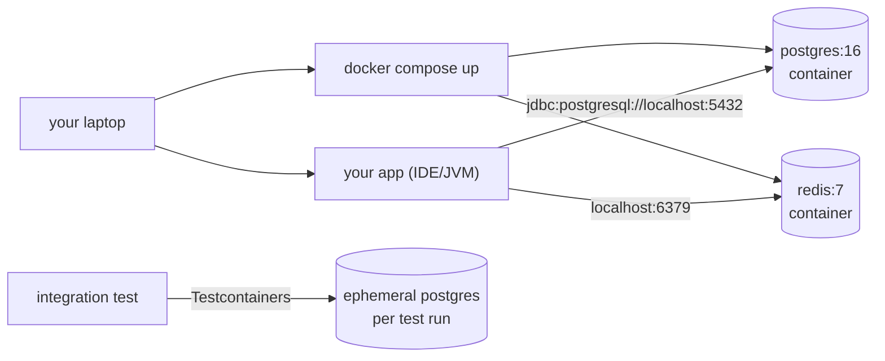
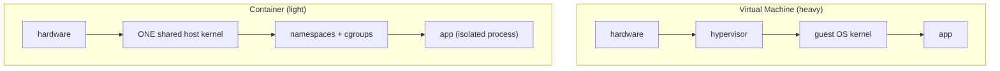
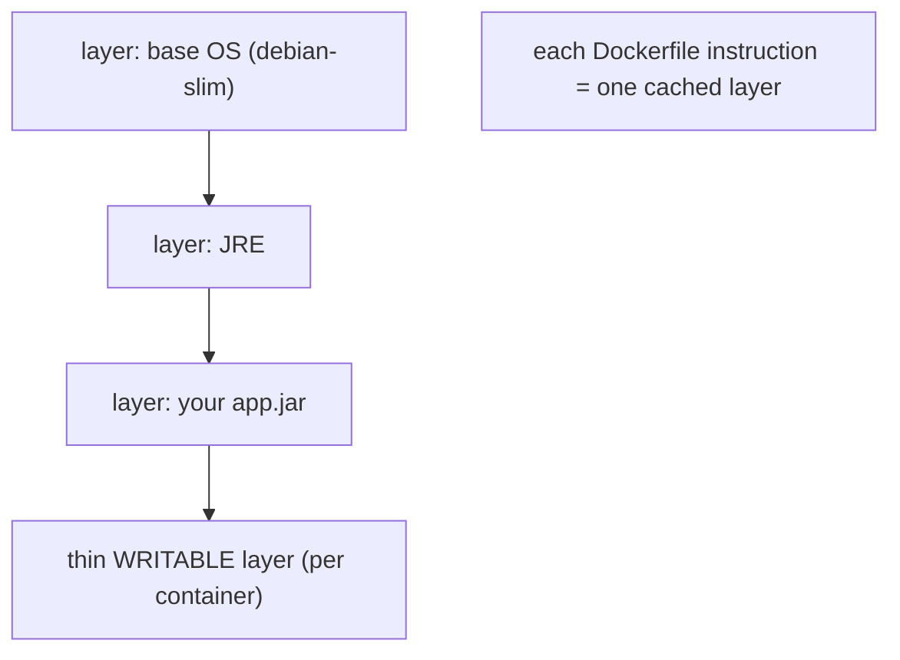
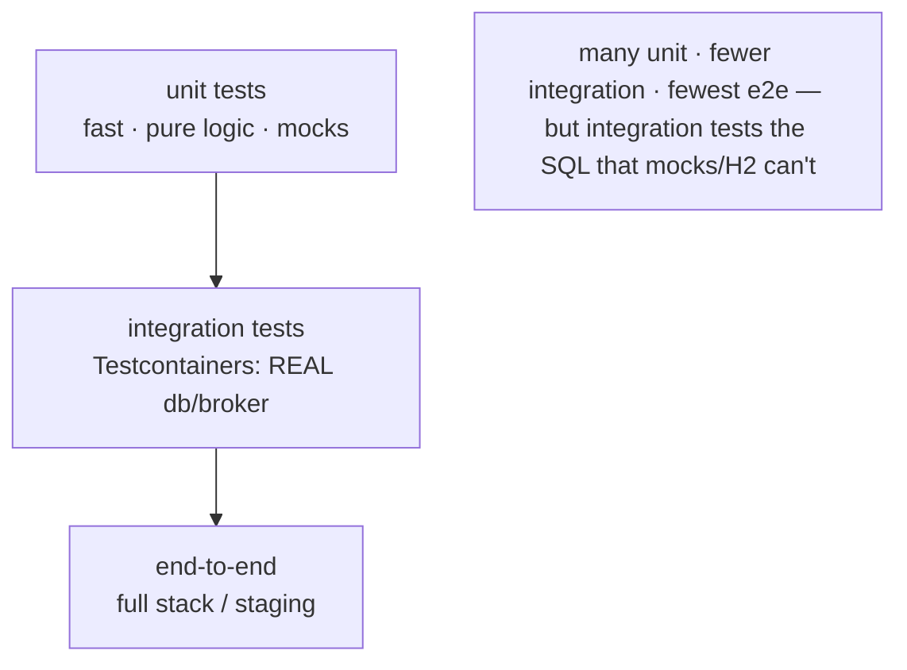

# Local Dev Environment: Docker & Testcontainers

The **C06 finale**. A backend service depends on real infrastructure — a database, a cache, a message broker. Installing those on your laptop is fragile and drifts from production; **containers** run them as throwaway, reproducible, version-pinned processes instead. This file covers Docker for local dependencies and **Testcontainers** for driving real infrastructure from your tests. It deepens [T01 §6](./T01-backend-toolchain-quick-reference.md) and connects the database tooling of [T03](./T03-database-clients-and-migration-tools.md) and [C05/T09 JDBC](../C05-databases-and-sql/T09-jdbc-and-connection-pooling-hikaricp.md) to a runnable environment.



---

## 1. What a Container Actually Is

A container is **not a virtual machine**. It is an ordinary Linux process the kernel *isolates* and *limits* using three features — there is no guest OS and no hypervisor:

- **Namespaces** — give the process its own *view* of the system: `pid` (its own process tree, sees itself as PID 1), `net` (own interfaces, ports, routing), `mnt` (own filesystem mounts), `uts` (own hostname), `ipc`, `user` (own uid mapping). Two containers can both "listen on port 8080" because each has its own `net` namespace.
- **cgroups** (control groups) — *limit and account* resources: CPU shares, memory ceiling, I/O. `--memory=512m` is a cgroup cap; exceed it and the kernel OOM-kills the process.
- **Union filesystem** (overlayfs) — stacks read-only image layers under a thin writable layer.



Because it's just a process on the host kernel, a container **starts in milliseconds** and adds almost no overhead — the property that makes "spin up a fresh Postgres per test" practical (§7). The trade-off: containers share the host kernel, so they're isolation, not a security boundary as strong as a VM's.

---

## 2. Images & the Dockerfile

An **image** is a read-only template — a stack of filesystem layers plus metadata (entrypoint, env, exposed ports). A **container** is a running instance of an image with a writable layer on top. Images live in **registries** (Docker Hub, GitHub Container Registry, ECR); `docker pull postgres:16` fetches one.



### A multi-stage Java Dockerfile

The idiom: **build** in a fat image with the JDK + Maven, then copy only the artifact into a **slim runtime** image — so the shipped image has no compiler, no build cache, no source.

```dockerfile
# ---- build stage ----
FROM eclipse-temurin:21-jdk AS build
WORKDIR /app
COPY pom.xml .
RUN mvn -q -o dependency:go-offline -B || mvn -q dependency:go-offline -B  # cache deps (C02)
COPY src ./src
RUN mvn -q -B package -DskipTests

# ---- runtime stage ----
FROM eclipse-temurin:21-jre AS runtime
WORKDIR /app
COPY --from=build /app/target/app.jar app.jar
RUN useradd -r app && chown app:app /app           # run as NON-root
USER app
EXPOSE 8080
ENTRYPOINT ["java","-jar","/app/app.jar"]
```

```bash
docker build -t myorg/app:1.0 .          # build → tag the image
docker images                            # list local images
docker push myorg/app:1.0                # push to a registry
```

> [!TIP]
> **Layer-cache ordering is the build-speed lever.** Docker caches each instruction's layer and reuses it until an input changes. Copy `pom.xml` and resolve dependencies **before** copying `src/` — then a code change reuses the cached dependency layer ([the C02 dependency cache](../C02-build-tools-and-workflow/T01-maven-lifecycle-pom-dependencies-plugins.md)) instead of re-downloading the world. Reverse the order and every code edit re-fetches all dependencies.

> [!NOTE]
> Add a **`.dockerignore`** (like `.gitignore`) so `target/`, `.git/`, and secrets never enter the build context. Prefer a **slim/distroless** runtime base and a **non-root `USER`** — smaller attack surface and image size. On Apple Silicon, mind `--platform linux/amd64` when an image has no ARM build.

---

## 3. Running Containers

```bash
docker run --rm -d --name pg \
  -e POSTGRES_PASSWORD=dev -e POSTGRES_DB=appdb \
  -p 5432:5432 --memory=512m postgres:16
#  --rm delete on exit · -d detached · --name handle · -e env · -p port-map · --memory cgroup cap

docker ps                       # running containers (-a includes stopped)
docker logs -f pg               # tail stdout/stderr (where a container "prints")
docker exec -it pg psql -U postgres appdb   # run a command INSIDE a running container
docker stop pg                  # SIGTERM then SIGKILL; with --rm it's also removed
docker rm -f pg                 # force-remove
docker system prune -af --volumes   # reclaim disk: dangling images, stopped containers, unused volumes
docker stats                    # live CPU/memory per container (the cgroup accounting)
```

`-e` passes the [12-factor config](./T01-backend-toolchain-quick-reference.md) the image documents; official images expose their knobs as env vars (`POSTGRES_PASSWORD`, etc.).

---

## 4. Data & Volumes — Persistence

> [!WARNING]
> **A container's writable layer is ephemeral — `docker rm` deletes it and all data inside.** Write a database's files to the container's own filesystem and they vanish when it's recreated. Anything that must survive a container's lifecycle goes in a **volume**.

```bash
# Named volume — Docker-managed, the right default for databases
docker run -v pgdata:/var/lib/postgresql/data postgres:16
docker volume ls                # list      docker volume inspect pgdata

# Bind mount — map a HOST path in (great for live-editing source/config)
docker run -v "$PWD/conf:/etc/app/conf:ro" myorg/app:1.0   # :ro = read-only

# tmpfs — in-memory, gone on stop (fast scratch / secrets)
docker run --tmpfs /scratch myorg/app:1.0
```

| Type | Lives where | Use for |
|------|-------------|---------|
| **named volume** | Docker-managed area | database data, anything to persist across `rm` |
| **bind mount** | a host directory you choose | source for live reload, config files |
| **tmpfs** | RAM | ephemeral scratch, sensitive temp data |

---

## 5. Networking

### Port mapping is a NAT rule

`-p 5432:5432` (host:container) inserts a [NAT](../C03-networking-fundamentals/T11-firewalls-and-nat-basics.md) rule: traffic to the host's port 5432 is forwarded into the container's port 5432 (the same [ports/sockets](../C03-networking-fundamentals/T03-ip-ports-and-sockets.md) model, applied locally). That's why your app connects to `localhost:5432` even though Postgres runs in an isolated `net` namespace. Map to a different host port to avoid a clash: `-p 5433:5432`.

### Container-to-container DNS

On a **user-defined bridge network**, Docker runs an embedded DNS resolver so containers reach each other **by service/container name** — no IPs, no port mapping needed between them ([C03 DNS](../C03-networking-fundamentals/T04-dns-resolution-records.md) at local scope):

```bash
docker network create appnet
docker run -d --name db --network appnet postgres:16
docker run -d --name api --network appnet myorg/app:1.0
# 'api' connects to the DB at host "db" → jdbc:postgresql://db:5432/appdb
```

`--network host` shares the host's stack (no isolation, no `-p` needed; Linux only); `--network none` gives no networking at all.

---

## 6. docker compose — the Whole Local Stack

Hand-running several `docker run`s is tedious and unshareable. **Compose** declares the stack in one file; a teammate runs `docker compose up` and gets an identical environment.

```yaml
# compose.yaml
services:
  db:
    image: postgres:16
    environment:
      POSTGRES_PASSWORD: dev
      POSTGRES_DB: appdb
    ports: ["5432:5432"]
    volumes: ["pgdata:/var/lib/postgresql/data"]
    healthcheck:                       # is it actually READY (not just started)?
      test: ["CMD-SHELL", "pg_isready -U postgres"]
      interval: 5s
      retries: 5
  cache:
    image: redis:7
    ports: ["6379:6379"]
  api:
    build: .                           # build the Dockerfile in this dir
    ports: ["8080:8080"]
    environment:
      DATABASE_URL: jdbc:postgresql://db:5432/appdb   # reach 'db' by service name (§5)
    depends_on:
      db:
        condition: service_healthy     # wait for the healthcheck, not just container start
volumes:
  pgdata:
```

```bash
docker compose up -d        # start the stack (build images as needed)
docker compose ps           # status      docker compose logs -f api
docker compose exec db psql -U postgres appdb
docker compose down         # stop + remove containers/networks (add -v to drop volumes too)
```

> [!WARNING]
> **`depends_on` alone only waits for the container to *start*, not to be *ready***. Postgres' process is up seconds before it accepts connections — your app then fails its first query. Gate startup on a **`healthcheck`** + `condition: service_healthy` (above), or make the app retry its initial [connection](../C05-databases-and-sql/T09-jdbc-and-connection-pooling-hikaricp.md). This is the local-dev version of the [T04 "service can't reach the DB"](./T04-network-and-tls-diagnostics.md) race.

---

## 7. Testcontainers — Real Dependencies in Tests

The hardest tests to get right are the ones touching the database. Two common shortcuts both **lie**:

- **Mock the repository** → you test your mock, not your SQL. A broken query, a missing index, a constraint violation, a wrong [isolation assumption](../C05-databases-and-sql/T07-isolation-levels-and-locking.md) — all invisible.
- **Swap Postgres for in-memory H2** → H2's SQL dialect, types, and locking differ from Postgres; tests pass on H2 and the same code breaks on the real database (JSON columns, `ON CONFLICT`, window functions, sequences…).

**Testcontainers** removes the shortcut: it boots a **real** Dockerized dependency from your test code, tied to the test lifecycle, and cleans it up afterward (a sidecar reaper, *Ryuk*, kills leftovers even if the JVM crashes).

```java
@SpringBootTest
@Testcontainers
class OrderRepositoryIT {

  @Container
  static PostgreSQLContainer<?> pg =
      new PostgreSQLContainer<>("postgres:16").withDatabaseName("appdb");

  // feed the container's RANDOM host port + URL into Spring at runtime
  @DynamicPropertySource
  static void props(DynamicPropertyRegistry r) {
    r.add("spring.datasource.url",      pg::getJdbcUrl);   // jdbc:postgresql://localhost:<random>/appdb
    r.add("spring.datasource.username", pg::getUsername);
    r.add("spring.datasource.password", pg::getPassword);
  }

  @Autowired OrderRepository repo;

  @Test
  void persistsAndQueriesAgainstRealPostgres() {
    repo.save(new Order("ABC", 42));
    assertThat(repo.findByCode("ABC")).isPresent();   // runs against REAL Postgres SQL
  }
}
```

Key points:

- The container gets a **random host port** ([NAT](../C03-networking-fundamentals/T11-firewalls-and-nat-basics.md) avoids clashes in CI); `getJdbcUrl()` hands the live coordinates to your [datasource/pool](../C05-databases-and-sql/T09-jdbc-and-connection-pooling-hikaricp.md). `@DynamicPropertySource` wires them in before the context starts.
- It tests the **real dialect** — your [migrations](./T03-database-clients-and-migration-tools.md) (Flyway/Liquibase) run against actual Postgres, real constraints and indexes ([C05/T05](../C05-databases-and-sql/T05-keys-constraints-and-relationships.md)) are enforced, real transaction isolation applies.
- **Speed:** a fresh container per class is slow; reuse a **singleton container** across the suite (start once, truncate between tests) or enable Testcontainers *reuse* mode for local runs.
- Beyond databases: `KafkaContainer`, `GenericContainer<>("redis:7")`, LocalStack for AWS — any image becomes a test fixture.



---

## 8. Troubleshooting

| Symptom | Move |
|---------|------|
| `bind: address already in use` on `-p` | The host port is taken — `lsof -iTCP:5432 -sTCP:LISTEN` ([T04](./T04-network-and-tls-diagnostics.md)); map a different host port (`-p 5433:5432`). |
| App can't reach the DB container | Same Docker network? Reach it by **service name**, not `localhost`, from another container (§5); from the host use the mapped port. |
| Data gone after `docker compose down` | No volume, or you ran `down -v`. Put DB data in a **named volume** (§4). |
| `toomanyrequests` / pull rate limit | Docker Hub anonymous limit — log in (`docker login`) or use a mirror/registry. |
| `no space left on device` | Image/layer/volume buildup — `docker system prune -af --volumes` (careful: drops unused volumes). |
| Build re-downloads deps every time | Dockerfile copies `src` before resolving deps — fix layer order (§2). |
| `exec format error` / image won't run | Architecture mismatch (ARM vs amd64) — `docker build --platform linux/amd64 …` / pull a multi-arch tag. |
| Testcontainers: "Could not find a valid Docker environment" | Docker daemon not running / not reachable — start Docker Desktop or set `DOCKER_HOST`. |
| Integration tests slow in CI | Use a singleton/reused container; cache the image; don't restart per test method. |

## Recap

- A **container is an isolated process**, not a VM: **namespaces** (own view of pid/net/mnt) + **cgroups** (resource caps) + **union fs** (layered image) on the *shared host kernel* — hence millisecond starts.
- An **image** is read-only layers + metadata from a **registry**; a **multi-stage Dockerfile** builds with the JDK and ships only the jar on a slim JRE; **order layers** (deps before source) for cache hits; `.dockerignore`, non-root `USER`, slim base.
- `docker run` flags (`-d -p -e -v --name --rm --memory`), `logs`/`exec`/`stop`/`prune` lifecycle; `-e` feeds 12-factor config.
- **Volumes** persist data past the ephemeral writable layer (named volume for DBs, bind mount for source, tmpfs for scratch).
- **Networking:** `-p host:container` is a **NAT** rule (why `localhost:5432` works); a **user-defined bridge** gives container-to-container **DNS by name**.
- **Compose** declares the whole stack; gate `depends_on` on a **`healthcheck`** (`service_healthy`), not mere container start.
- **Testcontainers** boots a **real** Dockerized dependency from tests (random port → `getJdbcUrl()` → `@DynamicPropertySource`), testing the real SQL dialect/constraints/migrations that **mocks and H2 cannot** — the integration layer of the test pyramid.

## Next

**This completes C06 — Tools & Environment (5/5).** You now have the full backend toolchain: build → call ([T02](./T02-http-and-api-clients.md)) → inspect the DB ([T03](./T03-database-clients-and-migration-tools.md)) → diagnose the network ([T04](./T04-network-and-tls-diagnostics.md)) → run real dependencies locally and in tests (here). The natural continuation is **[L2/C07 Hands-On](../C07-hands-on/)** (apply it in a project) or another L2 cross-cutting chapter.

[Back to C06 index](./README.md) · [Back to L2 index](../README.md)
