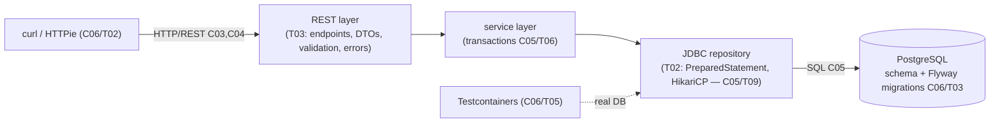

# Intermediate Java & Backend Foundations — Hands-On

Theory is half the job. This chapter is where the L2 concept chapters (C01–C05) and the toolchain (C06) become a working backend. Two parts: a graded **exercise set** spanning every concept chapter, then a fully worked **level project** — a REST service backed by a relational database via JDBC — built across two topics along its natural architectural seam (data layer, then the HTTP layer).

> [!NOTE]
> **Work the exercises with the editor, not just by reading the solutions.** Each problem states the task, gives a hint, then a complete worked solution with the *why*. Cover the solution, attempt it, then compare.

## Topics

| # | Topic | File | Maps to | Status |
|---|-------|------|---------|--------|
| 01 | Exercises (graded, across C01–C05) | [`T01-exercises.md`](./T01-exercises.md) | C01–C05 | **complete** |
| 02 | Level Project · Part 1 — data layer (schema, migrations, JDBC repository, Testcontainers) | [`T02-project-rest-service-data-layer.md`](./T02-project-rest-service-data-layer.md) | C05, C06 | **complete** |
| 03 | Level Project · Part 2 — REST API (endpoints, DTOs, validation, errors, pagination) | [`T03-project-rest-service-api-layer.md`](./T03-project-rest-service-api-layer.md) | C03, C04 | **complete** |

## Level project — "Tasks API"

A small but real REST service: users own tasks; tasks have a status and can be created, queried (with filtering + pagination), updated, and deleted. It exercises nearly the whole module end-to-end:

Build it with Maven ([C02](../C02-build-tools-and-workflow/)), run Postgres in Docker ([C06/T05](../C06-tools-and-environment/T05-local-dev-environment-docker-testcontainers.md)), test against a real database with Testcontainers, and drive it with curl ([C06/T02](../C06-tools-and-environment/T02-http-and-api-clients.md)).

[Back to L2 index](../README.md) · [Master curriculum](../../../CURRICULUM.md)
