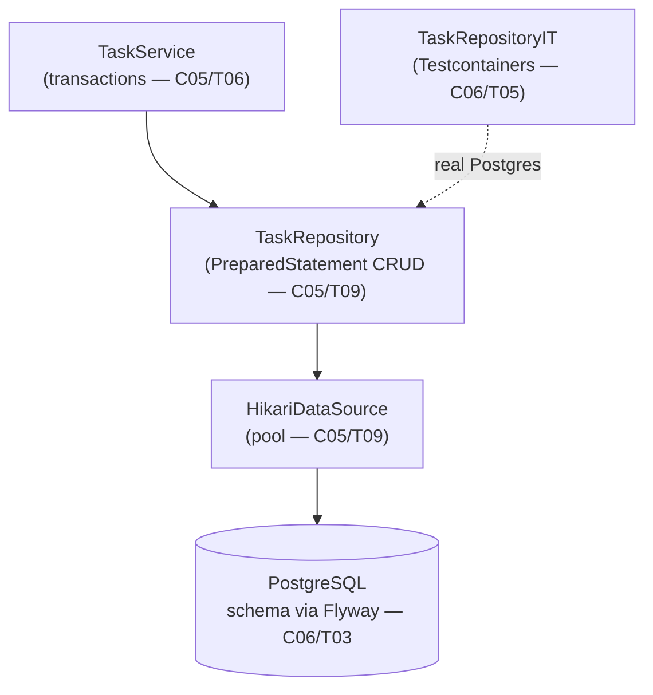

# Level Project · Part 1 — The Data Layer

We build the **Tasks API** introduced in the [C07 index](./README.md): users own tasks; tasks have a status and can be created, listed (with filtering + keyset pagination), fetched, updated, and deleted. This part builds the **persistence layer** end-to-end; [Part 2 (T03)](./T03-project-rest-service-api-layer.md) puts the REST API on top.

We use **plain JDBC over HikariCP** — no ORM, no Spring — so every line maps to a concept you've already met ([C05/T09 JDBC](../C05-databases-and-sql/T09-jdbc-and-connection-pooling-hikaricp.md)) and nothing is hidden. (Frameworks come in L4; you'll appreciate them more having done it by hand.)



---

## 1. Project Setup

A standard Maven layout ([C02](../C02-build-tools-and-workflow/T01-maven-lifecycle-pom-dependencies-plugins.md)):

```text
tasks-api/
├── pom.xml
├── docker-compose.yaml                 # local Postgres
└── src
    ├── main
    │   ├── java/com/example/tasks/
    │   │   ├── Main.java                # entry point (built in Part 2 / T03)
    │   │   ├── domain/    (User, Task, TaskStatus, Page)
    │   │   ├── db/        (Db — the DataSource factory)
    │   │   ├── repo/      (TaskRepository, UserRepository)
    │   │   └── api/       (Part 2 / T03: Json, DTOs, ApiException, TaskService, handlers)
    │   └── resources/db/migration/     # Flyway SQL
    │       ├── V1__init.sql
    │       └── V2__task_indexes.sql
    └── test/java/com/example/tasks/repo/TaskRepositoryIT.java
```

> This is one project across both topics: Part 1 (here) builds `domain`/`db`/`repo` + migrations + tests; Part 2 ([T03](./T03-project-rest-service-api-layer.md)) adds the `api` package and `Main`.

The dependencies — driver, pool, migrations, JSON (used by the Part 2 REST layer), and the test stack. The `<properties>` pins **Java 21** so the records, switch expressions, and text blocks below compile:

```xml
<properties>
  <maven.compiler.release>21</maven.compiler.release>
  <project.build.sourceEncoding>UTF-8</project.build.sourceEncoding>
</properties>

<dependencies>
  <dependency><groupId>org.postgresql</groupId><artifactId>postgresql</artifactId><version>42.7.3</version></dependency>
  <dependency><groupId>com.zaxxer</groupId><artifactId>HikariCP</artifactId><version>5.1.0</version></dependency>
  <dependency><groupId>org.flywaydb</groupId><artifactId>flyway-database-postgresql</artifactId><version>10.13.0</version></dependency>
  <!-- JSON for the REST layer (T03) -->
  <dependency><groupId>com.fasterxml.jackson.core</groupId><artifactId>jackson-databind</artifactId><version>2.17.1</version></dependency>
  <dependency><groupId>com.fasterxml.jackson.datatype</groupId><artifactId>jackson-datatype-jsr310</artifactId><version>2.17.1</version></dependency>

  <!-- test -->
  <dependency><groupId>org.junit.jupiter</groupId><artifactId>junit-jupiter</artifactId><version>5.10.2</version><scope>test</scope></dependency>
  <dependency><groupId>org.testcontainers</groupId><artifactId>postgresql</artifactId><version>1.19.8</version><scope>test</scope></dependency>
  <dependency><groupId>org.testcontainers</groupId><artifactId>junit-jupiter</artifactId><version>1.19.8</version><scope>test</scope></dependency>
  <dependency><groupId>org.assertj</groupId><artifactId>assertj-core</artifactId><version>3.25.3</version><scope>test</scope></dependency>
</dependencies>
```

> [!NOTE]
> Note the `<scope>test</scope>` on JUnit, Testcontainers, and AssertJ — they're compile+run dependencies for tests only, never shipped in the production artifact ([C02 dependency scopes](../C02-build-tools-and-workflow/T01-maven-lifecycle-pom-dependencies-plugins.md)). The Postgres driver, HikariCP, Flyway, and Jackson are `compile` (default) — the app needs them at runtime. `maven.compiler.release` (not the legacy `source`/`target`) also constrains the API to the target JDK.

Local Postgres ([C06/T05](../C06-tools-and-environment/T05-local-dev-environment-docker-testcontainers.md)):

```yaml
# docker-compose.yaml
services:
  db:
    image: postgres:16
    environment: { POSTGRES_PASSWORD: dev, POSTGRES_DB: tasks }
    ports: ["5432:5432"]
    healthcheck:
      test: ["CMD-SHELL", "pg_isready -U postgres"]
      interval: 5s
      retries: 5
```

---

## 2. The Domain Model

Immutable **records** ([C01 favors immutability](../C01-functional-and-modern-java/T07-optional-in-depth.md)) — the data the layer moves:

```java
package com.example.tasks.domain;
import java.time.Instant;

public enum TaskStatus { OPEN, IN_PROGRESS, DONE }

public record User(long id, String name, String email) {}

public record Task(long id, long userId, String title,
                   TaskStatus status, Instant createdAt) {}

// A page of results plus the cursor to fetch the next page (keyset pagination, §6)
public record Page<T>(java.util.List<T> items, String nextCursor) {}
```

Records give us `equals`/`hashCode`/`toString` for free and make the objects safe to pass around — a row read from the database can't be mutated underneath us.

---

## 3. Schema & Migrations

The schema lives in versioned Flyway scripts ([C06/T03 migrations](../C06-tools-and-environment/T03-database-clients-and-migration-tools.md)), so dev, CI, and prod converge from empty. `V1` creates the tables with a foreign key ([C05/T05 keys](../C05-databases-and-sql/T05-keys-constraints-and-relationships.md)):

```sql
-- src/main/resources/db/migration/V1__init.sql
CREATE TABLE users (
    id    BIGINT GENERATED ALWAYS AS IDENTITY PRIMARY KEY,
    name  TEXT NOT NULL,
    email TEXT NOT NULL UNIQUE                       -- UNIQUE → a 409 in the API layer (T03)
);

CREATE TABLE tasks (
    id         BIGINT GENERATED ALWAYS AS IDENTITY PRIMARY KEY,
    user_id    BIGINT NOT NULL REFERENCES users(id) ON DELETE CASCADE,
    title      TEXT   NOT NULL,
    status     TEXT   NOT NULL DEFAULT 'OPEN'
               CHECK (status IN ('OPEN','IN_PROGRESS','DONE')),   -- enforce the enum (C05/T05)
    created_at TIMESTAMPTZ NOT NULL DEFAULT now()
);
```

```sql
-- src/main/resources/db/migration/V2__task_indexes.sql
-- Index the columns we filter/paginate on (C05/T05 indexing, sargable — C07/T01 E5).
-- One composite index serves the list query's full access path:
--   WHERE user_id = ? AND status = ? AND id > ?  ORDER BY id
-- (leftmost-prefix user_id,status for the filter + id for the keyset range/sort — C05/T05).
CREATE INDEX idx_tasks_user_status_id ON tasks(user_id, status, id);
```

> [!NOTE]
> The `CHECK` constraint and the `REFERENCES … ON DELETE CASCADE` push integrity into the database — the single source of truth ([C05/T05](../C05-databases-and-sql/T05-keys-constraints-and-relationships.md)). Even a buggy app or a manual SQL edit can't insert an invalid status or an orphan task. App-layer validation (T03) is for *good error messages*, not the last line of defense.

---

## 4. The DataSource (HikariCP)

One pooled `DataSource` for the whole app, configured from the environment ([12-factor](../C06-tools-and-environment/T01-backend-toolchain-quick-reference.md); [C05/T09 pooling](../C05-databases-and-sql/T09-jdbc-and-connection-pooling-hikaricp.md)):

```java
package com.example.tasks.db;
import com.zaxxer.hikari.*;
import javax.sql.DataSource;
import org.flywaydb.core.Flyway;

public final class Db {
    public static DataSource create() {
        var cfg = new HikariConfig();
        cfg.setJdbcUrl(env("DATABASE_URL", "jdbc:postgresql://localhost:5432/tasks"));
        cfg.setUsername(env("DB_USER", "postgres"));
        cfg.setPassword(env("DB_PASSWORD", "dev"));
        cfg.setMaximumPoolSize(10);          // small pool — cores×2-ish (the C05/T09 paradox)
        cfg.setPoolName("tasks-pool");
        return new HikariDataSource(cfg);
    }

    /** Apply pending migrations on startup. */
    public static void migrate(DataSource ds) {
        Flyway.configure().dataSource(ds).load().migrate();
    }

    private static String env(String k, String def) {
        return System.getenv().getOrDefault(k, def);
    }
    private Db() {}
}
```

---

## 5. The Repository — CRUD with `PreparedStatement`

The repository owns all SQL. Every query is a **`PreparedStatement`** with `?` placeholders — injection-proof and plan-cacheable ([C05/T09](../C05-databases-and-sql/T09-jdbc-and-connection-pooling-hikaricp.md)). A small private `map` turns a `ResultSet` row into a `Task`.

```java
package com.example.tasks.repo;
import com.example.tasks.domain.*;
import javax.sql.DataSource;
import java.sql.*;
import java.util.*;

public class TaskRepository {
    private final DataSource ds;
    public TaskRepository(DataSource ds) { this.ds = ds; }

    public Task create(long userId, String title) {
        String sql = "INSERT INTO tasks(user_id, title) VALUES (?, ?) " +
                     "RETURNING id, user_id, title, status, created_at";   // RETURNING avoids a 2nd round trip
        try (Connection c = ds.getConnection();
             PreparedStatement ps = c.prepareStatement(sql)) {
            ps.setLong(1, userId);
            ps.setString(2, title);
            try (ResultSet rs = ps.executeQuery()) {
                rs.next();
                return map(rs);
            }
        } catch (SQLException e) { throw new DataAccessException("create task", e); }
    }

    public Optional<Task> findById(long id) {
        String sql = "SELECT id, user_id, title, status, created_at FROM tasks WHERE id = ?";
        try (Connection c = ds.getConnection();
             PreparedStatement ps = c.prepareStatement(sql)) {
            ps.setLong(1, id);
            try (ResultSet rs = ps.executeQuery()) {
                return rs.next() ? Optional.of(map(rs)) : Optional.empty();   // Optional, not null (C01/T07)
            }
        } catch (SQLException e) { throw new DataAccessException("findById", e); }
    }

    public boolean updateStatus(long id, TaskStatus status) {
        String sql = "UPDATE tasks SET status = ? WHERE id = ?";
        try (Connection c = ds.getConnection();
             PreparedStatement ps = c.prepareStatement(sql)) {
            ps.setString(1, status.name());
            ps.setLong(2, id);
            return ps.executeUpdate() == 1;          // rows affected → did it exist?
        } catch (SQLException e) { throw new DataAccessException("updateStatus", e); }
    }

    public boolean delete(long id) {
        try (Connection c = ds.getConnection();
             PreparedStatement ps = c.prepareStatement("DELETE FROM tasks WHERE id = ?")) {
            ps.setLong(1, id);
            return ps.executeUpdate() == 1;
        } catch (SQLException e) { throw new DataAccessException("delete", e); }
    }

    private static Task map(ResultSet rs) throws SQLException {
        return new Task(
            rs.getLong("id"),
            rs.getLong("user_id"),
            rs.getString("title"),
            TaskStatus.valueOf(rs.getString("status")),
            rs.getTimestamp("created_at").toInstant());
    }
}
```

```java
// DataAccessException.java — a thin unchecked wrapper so callers aren't forced to handle SQLException.
// It keeps the SQLException as its cause, so the REST layer (T03) can inspect the SQLState.
public class DataAccessException extends RuntimeException {
    public DataAccessException(String msg, Throwable cause) { super(msg, cause); }
}
```

> [!WARNING]
> Every `Connection`, `PreparedStatement`, and `ResultSet` is in **try-with-resources** — they close in reverse order, and a `Connection.close()` on a pooled datasource *returns it to the pool* rather than really closing it. Forget this and you leak connections until the pool is exhausted and every request hangs on `connectionTimeout` ([C05/T09](../C05-databases-and-sql/T09-jdbc-and-connection-pooling-hikaricp.md), [C06/T04 CLOSE_WAIT](../C06-tools-and-environment/T04-network-and-tls-diagnostics.md)).

---

## 6. Filtering + Keyset Pagination

Listing must filter by status and paginate. We use **keyset (cursor) pagination** — `WHERE id > :lastSeenId ORDER BY id LIMIT n` — not `OFFSET`, because `OFFSET` rescans and skips all prior rows (slower the deeper you go) and can drop/duplicate rows under concurrent inserts ([C04/T03 pagination](../C04-web-and-rest-basics/T03-api-design-resources-versioning-pagination-filtering.md)).

```java
public Page<Task> listByUser(long userId, TaskStatus status, long afterId, int limit) {
    String sql = """
        SELECT id, user_id, title, status, created_at
        FROM tasks
        WHERE user_id = ? AND status = ? AND id > ?
        ORDER BY id
        LIMIT ?""";                              // uses idx_tasks_user_status_id (sargable — C07/T01 E5)
    try (Connection c = ds.getConnection();
         PreparedStatement ps = c.prepareStatement(sql)) {
        ps.setLong(1, userId);
        ps.setString(2, status.name());
        ps.setLong(3, afterId);                  // 0 for the first page
        ps.setInt(4, limit);
        try (ResultSet rs = ps.executeQuery()) {
            List<Task> items = new ArrayList<>();
            while (rs.next()) items.add(map(rs));
            String next = items.size() == limit
                    ? String.valueOf(items.get(items.size() - 1).id())   // cursor = last id
                    : null;                                              // no more pages
            return new Page<>(items, next);
        }
    } catch (SQLException e) { throw new DataAccessException("listByUser", e); }
}
```

The returned `nextCursor` is the last row's `id`; the client passes it back as `afterId` to get the next page. A `null` cursor means the last page — the loop terminator the REST layer (T03) exposes as the absence of a `next` link.

---

## 7. Transactions — a Multi-Write Unit of Work

When two writes must both happen or neither, wrap them in one transaction: turn off autocommit, do the work on **one `Connection`**, then `commit` (or `rollback` on failure) ([C05/T06 ACID](../C05-databases-and-sql/T06-transactions-and-acid.md)). Example: reassign every open task from one user to another atomically.

```java
public void reassignOpenTasks(long fromUser, long toUser) {
    String move = "UPDATE tasks SET user_id = ? WHERE user_id = ? AND status = 'OPEN'";
    try (Connection c = ds.getConnection()) {
        c.setAutoCommit(false);                  // begin
        try (PreparedStatement ps = c.prepareStatement(move)) {
            ps.setLong(1, toUser);
            ps.setLong(2, fromUser);
            ps.executeUpdate();
            // ... any further writes share THIS connection so they're in the same transaction ...
            c.commit();                          // all-or-nothing
        } catch (SQLException e) {
            c.rollback();                        // undo on any failure
            throw new DataAccessException("reassign", e);
        }
    } catch (SQLException e) { throw new DataAccessException("reassign tx", e); }
}
```

> [!WARNING]
> The transaction boundary is the **`Connection`**. Two writes on two different pooled connections are two *separate* transactions — a partial failure leaves inconsistent data. A correct unit of work acquires one connection, does all its writes on it, and commits once. (This is exactly the plumbing Spring's `@Transactional` automates for you in L4.)

---

## 8. Integration Tests with Testcontainers

Unit-testing this layer with mocks would test nothing — the value *is* the SQL. **Testcontainers** boots a real Postgres in Docker, runs the real migrations, and exercises the real queries ([C06/T05](../C06-tools-and-environment/T05-local-dev-environment-docker-testcontainers.md)). It catches what an in-memory H2 would miss: the `CHECK`/`UNIQUE` constraints, `RETURNING`, `TIMESTAMPTZ`, and real keyset ordering.

```java
package com.example.tasks.repo;
import com.example.tasks.db.Db;
import com.example.tasks.domain.*;
import com.zaxxer.hikari.*;
import org.junit.jupiter.api.*;
import org.testcontainers.containers.PostgreSQLContainer;
import org.testcontainers.junit.jupiter.*;
import javax.sql.DataSource;
import static org.assertj.core.api.Assertions.*;

@Testcontainers
class TaskRepositoryIT {

    @Container
    static PostgreSQLContainer<?> pg = new PostgreSQLContainer<>("postgres:16");

    static DataSource ds;
    static TaskRepository repo;
    static long userId;

    @BeforeAll
    static void setup() throws Exception {
        var cfg = new HikariConfig();
        cfg.setJdbcUrl(pg.getJdbcUrl());          // the container's RANDOM host port
        cfg.setUsername(pg.getUsername());
        cfg.setPassword(pg.getPassword());
        ds = new HikariDataSource(cfg);
        Db.migrate(ds);                           // run the SAME Flyway migrations as prod
        repo = new TaskRepository(ds);
        try (var c = ds.getConnection();
             var ps = c.prepareStatement(
                 "INSERT INTO users(name,email) VALUES ('Ada','ada@x.io') RETURNING id")) {
            var rs = ps.executeQuery(); rs.next(); userId = rs.getLong(1);
        }
    }

    @Test
    void createsAndReadsBack() {
        Task t = repo.create(userId, "write tests");
        assertThat(t.id()).isPositive();
        assertThat(t.status()).isEqualTo(TaskStatus.OPEN);            // the DB DEFAULT applied
        assertThat(repo.findById(t.id())).contains(t);
    }

    @Test
    void findByIdReturnsEmptyForMissing() {
        assertThat(repo.findById(999_999)).isEmpty();                 // Optional, not null
    }

    @Test
    void updatesStatusAndReportsRowCount() {
        Task t = repo.create(userId, "ship it");
        assertThat(repo.updateStatus(t.id(), TaskStatus.DONE)).isTrue();
        assertThat(repo.updateStatus(999_999, TaskStatus.DONE)).isFalse();   // no such row
        assertThat(repo.findById(t.id()).orElseThrow().status()).isEqualTo(TaskStatus.DONE);
    }

    @Test
    void keysetPaginationWalksAllPages() {
        for (int i = 0; i < 5; i++) repo.create(userId, "p" + i);
        Page<Task> p1 = repo.listByUser(userId, TaskStatus.OPEN, 0, 2);
        assertThat(p1.items()).hasSize(2);
        assertThat(p1.nextCursor()).isNotNull();
        Page<Task> p2 = repo.listByUser(userId, TaskStatus.OPEN, Long.parseLong(p1.nextCursor()), 2);
        assertThat(p2.items().get(0).id()).isGreaterThan(p1.items().get(1).id());  // strictly after
    }

    @Test
    void uniqueEmailIsEnforcedByTheDatabase() {
        assertThatThrownBy(() -> {
            try (var c = ds.getConnection();
                 var ps = c.prepareStatement("INSERT INTO users(name,email) VALUES ('Dup','ada@x.io')")) {
                ps.executeUpdate();               // violates the UNIQUE constraint → SQLException
            }
        }).isInstanceOf(Exception.class);          // T03 maps this to HTTP 409
    }
}
```

Run them with `./mvnw verify` — Testcontainers pulls `postgres:16`, starts it, and tears it down after the class. The same tests run unchanged in CI (Docker available), with no shared test database to pollute.

---

## 9. Run It Locally

A tiny `SmokeMain` (a normal `public static void main`) proves the wiring end to end before the REST layer exists:

```java
package com.example.tasks;
import com.example.tasks.db.Db;
import com.example.tasks.repo.TaskRepository;

public class SmokeMain {
    public static void main(String[] args) {
        var ds = Db.create();
        Db.migrate(ds);                                  // schema up to date
        var repo = new TaskRepository(ds);
        // (assumes a user with id 1 exists — insert one first, or run against seeded data)
        System.out.println(repo.create(1, "smoke test"));
    }
}
```

```bash
docker compose up -d                # start Postgres (waits healthy)
./mvnw verify                       # build + run the Testcontainers integration tests (no DB setup needed)

# To run SmokeMain against the compose Postgres, use the exec plugin by its full coordinates
# (no pom change needed) — or just run Main from T03 once the REST layer exists:
DATABASE_URL=jdbc:postgresql://localhost:5432/tasks \
  ./mvnw -q compile org.codehaus.mojo:exec-maven-plugin:3.2.0:java \
         -Dexec.mainClass=com.example.tasks.SmokeMain
docker compose exec db psql -U postgres tasks -c 'SELECT id,title,status FROM tasks;'
```

`./mvnw verify` is the one command that always works (Testcontainers needs no local DB setup); the `exec` line is optional and shown with the plugin's fully-qualified coordinates so it runs without adding it to the `pom.xml`.

## Recap

- **Plain JDBC over HikariCP** keeps every line traceable to [C05/T09](../C05-databases-and-sql/T09-jdbc-and-connection-pooling-hikaricp.md); a `DataSource` is created once and pooled (small pool ≈ cores×2).
- **Flyway migrations** in `db/migration` make the schema a deterministic function of versioned scripts ([C06/T03](../C06-tools-and-environment/T03-database-clients-and-migration-tools.md)); integrity (`UNIQUE`, `CHECK`, `FK ON DELETE CASCADE`) lives in the database.
- The **repository** uses `PreparedStatement` everywhere (injection-proof, plan-cached), returns **`Optional`** for absent rows, uses **`RETURNING`** to avoid a second round trip, and wraps every JDBC object in **try-with-resources** (a leak exhausts the pool).
- **Keyset pagination** (`WHERE id > cursor ORDER BY id LIMIT n`) beats `OFFSET` for deep pages and concurrent inserts ([C04/T03](../C04-web-and-rest-basics/T03-api-design-resources-versioning-pagination-filtering.md)).
- A **transaction** is bounded by one `Connection`: `setAutoCommit(false)` → writes → `commit`/`rollback` ([C05/T06](../C05-databases-and-sql/T06-transactions-and-acid.md)).
- **Testcontainers** tests the real database (real constraints, `RETURNING`, ordering) that mocks/H2 can't ([C06/T05](../C06-tools-and-environment/T05-local-dev-environment-docker-testcontainers.md)).

## Next

Put the HTTP layer on top: **[T03 — Level Project, Part 2: the REST API](./T03-project-rest-service-api-layer.md)** — endpoints, DTOs, validation, an error model (404/409/422), and pagination links, driven with curl.

[Back to C07 index](./README.md) · [Back to L2 index](../README.md)
