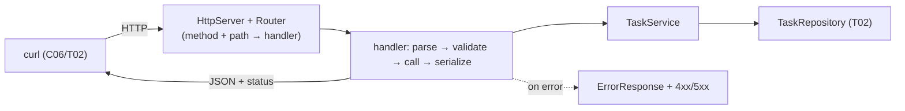

# Level Project · Part 2 — The REST API

[Part 1 (T02)](./T02-project-rest-service-data-layer.md) built the data layer: a `TaskRepository` over HikariCP with migrations and Testcontainers tests. Now we put an **HTTP/REST API** on top — turning method + path into a repository call and a domain object into a JSON response, with proper status codes and a consistent error model.

We use the **JDK's built-in `com.sun.net.httpserver.HttpServer`** plus **Jackson** for JSON — no web framework. That keeps the HTTP visible: you see the request line, the routing, the status code, and the bytes, all the [C04 semantics](../C04-web-and-rest-basics/T01-http-in-depth-methods-status-headers.md) made literal. (Spring Boot collapses most of this file into annotations — that's L4. Doing it by hand once is why those annotations will make sense.)



---

## 1. The API Contract

What we expose ([C04/T03 API design](../C04-web-and-rest-basics/T03-api-design-resources-versioning-pagination-filtering.md)):

| Method + path | Body | Success | Errors |
|---------------|------|---------|--------|
| `POST /users` | `{name,email}` | `201` + `Location` | `409` dup email, `422` invalid |
| `POST /tasks` | `{userId,title}` | `201` + `Location` | `422` invalid / unknown user |
| `GET /tasks/{id}` | — | `200` | `404` |
| `GET /tasks?userId=&status=&after=&limit=` | — | `200` + page | `422` bad params |
| `PATCH /tasks/{id}` | `{status}` | `200` | `404`, `422` bad status |
| `DELETE /tasks/{id}` | — | `204` | `404` |

`POST /users` exists because a task needs an owner — and it's where a duplicate email demonstrates **409 Conflict** ([C05/T05 UNIQUE](../C05-databases-and-sql/T05-keys-constraints-and-relationships.md)).

---

## 2. DTOs & JSON

**DTOs** (data transfer objects) are the *wire shape* — deliberately separate from the domain records so the API contract doesn't change every time the schema does ([C04/T04](../C04-web-and-rest-basics/T04-content-negotiation-and-serialization-json-xml-jackson.md)). Requests in, responses out:

```java
package com.example.tasks.api;
import com.example.tasks.domain.*;
import java.time.Instant;
import java.util.List;

public record CreateUserRequest(String name, String email) {}
public record CreateTaskRequest(Long userId, String title) {}
public record UpdateStatusRequest(String status) {}

public record TaskResponse(long id, long userId, String title, String status, Instant createdAt) {
    static TaskResponse from(Task t) {                       // domain → DTO (C01 mapping)
        return new TaskResponse(t.id(), t.userId(), t.title(), t.status().name(), t.createdAt());
    }
}
public record PageResponse(List<TaskResponse> items, String nextCursor) {}
public record ErrorResponse(String code, String message) {}    // a consistent error shape
```

One Jackson `ObjectMapper`, configured for `Instant` and lenient reads:

```java
package com.example.tasks.api;
import com.fasterxml.jackson.databind.*;
import com.fasterxml.jackson.datatype.jsr310.JavaTimeModule;
import com.sun.net.httpserver.HttpExchange;
import java.io.*;
import java.nio.charset.StandardCharsets;

public final class Json {
    private final ObjectMapper m = new ObjectMapper()
            .registerModule(new JavaTimeModule())                          // Instant ⇄ ISO-8601
            .disable(DeserializationFeature.FAIL_ON_UNKNOWN_PROPERTIES);   // ignore extra fields (C04/T04 tolerant reader)

    <T> T read(HttpExchange ex, Class<T> type) throws IOException {
        try (InputStream in = ex.getRequestBody()) { return m.readValue(in, type); }
    }

    void write(HttpExchange ex, int status, Object body) throws IOException {
        byte[] bytes = m.writeValueAsBytes(body);
        ex.getResponseHeaders().set("Content-Type", "application/json; charset=utf-8");  // C04/T04
        ex.sendResponseHeaders(status, bytes.length);
        try (OutputStream out = ex.getResponseBody()) { out.write(bytes); }
    }
}
```

> [!NOTE]
> **DTOs ≠ domain objects.** Mapping `Task → TaskResponse` looks like boilerplate, but it decouples the wire contract from storage: rename a column, add an internal field, or change a type without breaking clients ([C04/T04](../C04-web-and-rest-basics/T04-content-negotiation-and-serialization-json-xml-jackson.md)). The `FAIL_ON_UNKNOWN_PROPERTIES=false` makes us a **tolerant reader** — a client sending an extra field doesn't break us, which is what lets the API evolve.

---

## 3. The Error Model

Every failure returns the **same JSON shape** with a meaningful **status code** — never a `200` wrapping an error ([C04/T01 status codes](../C04-web-and-rest-basics/T01-http-in-depth-methods-status-headers.md)). A single exception type carries the HTTP status:

```java
package com.example.tasks.api;

public class ApiException extends RuntimeException {
    public final int status;
    public final String code;
    public ApiException(int status, String code, String message) {
        super(message); this.status = status; this.code = code;
    }
    public static ApiException notFound(String what)  { return new ApiException(404, "not_found", what + " not found"); }
    public static ApiException conflict(String msg)   { return new ApiException(409, "conflict", msg); }
    public static ApiException invalid(String msg)    { return new ApiException(422, "validation", msg); }
}
```

We also need to translate **database** failures into the right HTTP status. The repository wraps the JDBC `SQLException` in a `DataAccessException` (T02 §5) but **keeps it as the cause**, so we unwrap it and inspect the SQLState ([C05/T05](../C05-databases-and-sql/T05-keys-constraints-and-relationships.md)). This is a static factory on `ApiException`, called from the handler's catch block (§5):

```java
// add to ApiException:
// SQLState 23505 = unique_violation → 409 ; 23503 = foreign_key_violation → 422
public static ApiException fromDataAccess(DataAccessException dae) {   // import com.example.tasks.repo.DataAccessException
    String sqlState = (dae.getCause() instanceof java.sql.SQLException se) ? se.getSQLState() : null;
    return switch (sqlState == null ? "" : sqlState) {
        case "23505" -> conflict("resource already exists");
        case "23503" -> invalid("a referenced resource does not exist");
        default      -> new ApiException(500, "internal", "unexpected database error");
    };
}
```

---

## 4. The Service — Validation + Orchestration

The service validates input (→ `422`), calls the repository (T02), and maps results to DTOs. **Validation produces good error messages; the database `CHECK`/`UNIQUE`/`FK` constraints are the real guard** (T02 §3).

```java
package com.example.tasks.api;
import com.example.tasks.domain.*;
import com.example.tasks.repo.*;

public class TaskService {
    private final TaskRepository tasks;
    private final UserRepository users;
    public TaskService(TaskRepository t, UserRepository u) { this.tasks = t; this.users = u; }

    public TaskResponse create(CreateTaskRequest req) {
        if (req.userId() == null)            throw ApiException.invalid("userId is required");
        if (isBlank(req.title()))            throw ApiException.invalid("title must not be blank");
        if (req.title().length() > 200)      throw ApiException.invalid("title too long (max 200)");
        if (!users.existsById(req.userId())) throw ApiException.invalid("unknown userId " + req.userId());
        Task t = tasks.create(req.userId(), req.title().trim());    // a racing FK violation still → 422 via fromDataAccess
        return TaskResponse.from(t);
    }

    public TaskResponse get(long id) {
        return tasks.findById(id).map(TaskResponse::from)
                    .orElseThrow(() -> ApiException.notFound("task " + id));   // Optional → 404 (C01/T07)
    }

    public TaskResponse updateStatus(long id, UpdateStatusRequest req) {
        TaskStatus status = parseStatus(req.status());             // bad value → 422
        if (!tasks.updateStatus(id, status)) throw ApiException.notFound("task " + id);
        return get(id);
    }

    public void delete(long id) {
        if (!tasks.delete(id)) throw ApiException.notFound("task " + id);
    }

    public PageResponse list(long userId, String statusParam, long after, int limit) {
        TaskStatus status = parseStatus(statusParam);
        if (limit < 1 || limit > 100) throw ApiException.invalid("limit must be 1..100");
        Page<Task> page = tasks.listByUser(userId, status, after, limit);
        return new PageResponse(page.items().stream().map(TaskResponse::from).toList(),  // C01/T04
                                page.nextCursor());
    }

    private static TaskStatus parseStatus(String s) {
        try { return TaskStatus.valueOf(s); }
        catch (Exception e) { throw ApiException.invalid("status must be OPEN|IN_PROGRESS|DONE"); }
    }
    private static boolean isBlank(String s) { return s == null || s.isBlank(); }
}
```

---

## 5. The Router & Handler

One `HttpHandler` for `/tasks`, dispatching by **method + path shape**. It centralizes the `ApiException → status` translation so each operation stays clean.

```java
package com.example.tasks.api;
import com.sun.net.httpserver.*;
import java.io.IOException;
import java.net.URI;
import java.util.*;

public class TaskHandler implements HttpHandler {
    private final TaskService svc;
    private final Json json = new Json();
    public TaskHandler(TaskService svc) { this.svc = svc; }
    // imports also include: com.example.tasks.repo.DataAccessException

    @Override public void handle(HttpExchange ex) {
        try {
            String method = ex.getRequestMethod();
            String[] p = ex.getRequestURI().getPath().split("/");   // /tasks → ["","tasks"]; /tasks/42 → ["","tasks","42"]
            if (p.length == 2) {                                    // collection: /tasks
                switch (method) {
                    case "POST" -> create(ex);
                    case "GET"  -> list(ex);
                    default     -> throw new ApiException(405, "method_not_allowed", "POST or GET");
                }
            } else if (p.length == 3) {                             // item: /tasks/{id}
                long id = Long.parseLong(p[2]);
                switch (method) {
                    case "GET"    -> json.write(ex, 200, svc.get(id));
                    case "PATCH"  -> json.write(ex, 200, svc.updateStatus(id, json.read(ex, UpdateStatusRequest.class)));
                    case "DELETE" -> { svc.delete(id); ex.sendResponseHeaders(204, -1); }   // 204 = no body
                    default       -> throw new ApiException(405, "method_not_allowed", "GET, PATCH or DELETE");
                }
            } else throw ApiException.notFound("resource");
        } catch (ApiException e) {
            safeWrite(ex, e.status, new ErrorResponse(e.code, e.getMessage()));
        } catch (DataAccessException e) {                       // DB failure → map SQLState (23505→409, 23503→422)
            ApiException mapped = ApiException.fromDataAccess(e);
            safeWrite(ex, mapped.status, new ErrorResponse(mapped.code, mapped.getMessage()));
        } catch (NumberFormatException e) {
            safeWrite(ex, 400, new ErrorResponse("bad_request", "id must be a number"));
        } catch (Exception e) {
            safeWrite(ex, 500, new ErrorResponse("internal", "unexpected error"));   // never leak stack traces
        } finally {
            ex.close();
        }
    }

    private void create(HttpExchange ex) throws IOException {
        TaskResponse t = svc.create(json.read(ex, CreateTaskRequest.class));
        ex.getResponseHeaders().set("Location", "/tasks/" + t.id());   // 201 carries the new URL (C04/T01)
        json.write(ex, 201, t);
    }

    private void list(HttpExchange ex) throws IOException {
        Map<String,String> q = query(ex.getRequestURI());
        long userId = Long.parseLong(q.getOrDefault("userId", "0"));
        String status = q.getOrDefault("status", "OPEN");
        long after = Long.parseLong(q.getOrDefault("after", "0"));     // the keyset cursor (T02 §6)
        int limit = Integer.parseInt(q.getOrDefault("limit", "20"));
        PageResponse page = svc.list(userId, status, after, limit);
        if (page.nextCursor() != null)                                  // expose the next page as a Link header
            ex.getResponseHeaders().set("Link",
                "</tasks?userId=" + userId + "&status=" + status + "&after=" + page.nextCursor() + ">; rel=\"next\"");
        json.write(ex, 200, page);
    }

    private void safeWrite(HttpExchange ex, int status, ErrorResponse body) {
        try { json.write(ex, status, body); } catch (IOException ignored) {}
    }
    private static Map<String,String> query(URI uri) {
        Map<String,String> m = new HashMap<>();
        if (uri.getRawQuery() == null) return m;
        for (String kv : uri.getRawQuery().split("&")) {
            int i = kv.indexOf('=');
            if (i > 0) m.put(kv.substring(0, i), java.net.URLDecoder.decode(kv.substring(i + 1), java.nio.charset.StandardCharsets.UTF_8));
        }
        return m;
    }
}
```

> [!NOTE]
> The `GET` list exposes the next page two ways: the `nextCursor` in the body **and** a standard **`Link: …; rel="next"`** header ([C04/T03 pagination](../C04-web-and-rest-basics/T03-api-design-resources-versioning-pagination-filtering.md)). The client follows links rather than constructing `OFFSET`s — and because it's keyset-based (T02 §6), deep pages stay fast and stable under concurrent inserts.

A near-identical `UserHandler` handles `POST /users` (201 + `Location`) — omitted for brevity; it's the same shape as `create` above. A duplicate email surfaces as a `DataAccessException` wrapping SQLState `23505`, which the handler's `catch (DataAccessException)` maps to **409** via `ApiException.fromDataAccess`. (`UserRepository` exposes `create(name, email)` and `existsById(id)` — the same `PreparedStatement` pattern as `TaskRepository` in T02.)

---

## 6. Wiring `main`

```java
package com.example.tasks;
import com.example.tasks.api.*;
import com.example.tasks.db.Db;
import com.example.tasks.repo.*;
import com.sun.net.httpserver.HttpServer;
import java.net.InetSocketAddress;
import java.util.concurrent.Executors;

public class Main {
    public static void main(String[] args) throws Exception {
        var ds = Db.create();
        Db.migrate(ds);                                           // schema up to date on boot (C06/T03)

        var svc = new TaskService(new TaskRepository(ds), new UserRepository(ds));
        var server = HttpServer.create(new InetSocketAddress(8080), 0);
        server.createContext("/tasks", new TaskHandler(svc));
        server.createContext("/users", new UserHandler(svc));
        server.setExecutor(Executors.newFixedThreadPool(16));     // a small thread pool (not one-thread-per-request unbounded)
        server.start();
        System.out.println("listening on :8080");
    }
}
```

---

## 7. Drive It with curl

Start Postgres + the app (`docker compose up -d`, then run `Main`), and exercise it ([C06/T02](../C06-tools-and-environment/T02-http-and-api-clients.md)):

```bash
# create a user → 201 + Location
curl -i -X POST localhost:8080/users -H 'Content-Type: application/json' \
     -d '{"name":"Ada","email":"ada@x.io"}'
# HTTP/1.1 201 Created
# Location: /users/1

# duplicate email → 409 Conflict
curl -s -o /dev/null -w '%{http_code}\n' -X POST localhost:8080/users \
     -d '{"name":"Dup","email":"ada@x.io"}'                       # → 409

# create tasks → 201
curl -s -X POST localhost:8080/tasks -d '{"userId":1,"title":"write tests"}' | jq .
curl -s -X POST localhost:8080/tasks -d '{"userId":1,"title":"ship it"}'    | jq .

# validation failure → 422
curl -s -X POST localhost:8080/tasks -d '{"userId":1,"title":"  "}' | jq .
# {"code":"validation","message":"title must not be blank"}

# unknown user (FK) → 422
curl -s -X POST localhost:8080/tasks -d '{"userId":999,"title":"x"}' | jq .

# get one → 200 / 404
curl -s localhost:8080/tasks/1 | jq .
curl -s -o /dev/null -w '%{http_code}\n' localhost:8080/tasks/999     # → 404

# list page 1, follow the Link header's cursor for page 2
curl -i 'localhost:8080/tasks?userId=1&status=OPEN&limit=1'           # Link: <...&after=1>; rel="next"
curl -s 'localhost:8080/tasks?userId=1&status=OPEN&after=1&limit=1' | jq .

# update status → 200 ; delete → 204
curl -s -X PATCH localhost:8080/tasks/1 -d '{"status":"DONE"}' | jq .
curl -s -o /dev/null -w '%{http_code}\n' -X DELETE localhost:8080/tasks/1   # → 204
```

Every status code is meaningful: `201`+`Location` on create, `204` (empty) on delete, `404`/`409`/`422` on the error paths — the [C04/T01](../C04-web-and-rest-basics/T01-http-in-depth-methods-status-headers.md) contract, working.

---

## 8. What a Framework Would Add (the L4 teaser)

This works, but you wrote the plumbing by hand. **Spring Boot** (L4) replaces it with declarations:

| Hand-rolled here | Spring Boot equivalent |
|------------------|------------------------|
| `HttpServer` + manual routing | `@RestController` + `@GetMapping("/tasks/{id}")` |
| `Json.read/write` | automatic Jackson (de)serialization |
| `query()` parsing | `@RequestParam`, `@PathVariable` |
| `ApiException → status` in a catch | `@ExceptionHandler` / `@ResponseStatus` |
| manual validation | `@Valid` + Bean Validation annotations |
| `Db` + manual transactions (T02) | `DataSource` autoconfig + `@Transactional` |

The value of doing it by hand: when Spring "magically" returns a 404 or serializes JSON, you know **exactly** what it's doing under the annotation — because you wrote that code here.

## Recap

- A REST layer turns **method + path → a repository call**, and a **domain object → a JSON DTO** with a meaningful status code; the JDK `HttpServer` + Jackson make every step visible.
- **DTOs are separate from domain objects** so the wire contract can stay stable as storage changes; a tolerant reader (`FAIL_ON_UNKNOWN_PROPERTIES=false`) lets the API evolve ([C04/T04](../C04-web-and-rest-basics/T04-content-negotiation-and-serialization-json-xml-jackson.md)).
- A **single error model** maps exceptions and DB SQLStates to `404`/`409`/`422` with a consistent JSON shape — never a `200` over an error ([C04/T01](../C04-web-and-rest-basics/T01-http-in-depth-methods-status-headers.md)).
- **Validation gives good messages; the database constraints are the real guard** (T02 §3).
- Pagination is exposed as both a body `nextCursor` and a `Link: rel="next"` header over the keyset cursor ([C04/T03](../C04-web-and-rest-basics/T03-api-design-resources-versioning-pagination-filtering.md)).
- Driving it with **curl** confirms each status-code path; a framework (L4) collapses this plumbing into annotations — which now hold no mystery.

## Next

**This completes C07 — Hands-On (3/3)**, and with it a full vertical slice of L2: functional Java, build tooling, networking, REST, SQL/JDBC, and the toolchain — assembled into a working, tested service. From here, the remaining L2 cross-cutting chapters (C08 Best Practices … C12 Resources) consolidate and reference; or move on to L3.

[Back to C07 index](./README.md) · [Back to L2 index](../README.md)
