# Threads & Runnable

A **thread** is a unit of execution within a process — a sequence of instructions the CPU runs, plus the bookkeeping that lets the OS pause it, swap to another, and resume it later. Until now (across L0–L2) every program in this book has run on **one** thread — the JVM's `main` thread. This topic introduces creating, naming, joining, and reasoning about **multiple** threads sharing one JVM.

The depth-bar requirement isn't just "show `new Thread(r).start()`." At the **language** layer Java offers a few different ways to author and start threads (extending `Thread`, implementing `Runnable`, lambda over `Runnable`, factory methods like `Thread.ofPlatform().start(...)`, and — since Java 21 — `Thread.ofVirtual().start(...)`) and each has its own ergonomics. At the **memory** layer, every Java platform thread is backed by an **OS thread** — a kernel-managed object with its own **per-thread stack** (`-Xss`, default ~1 MB on most platforms — covered briefly in T14 recursion), a kernel TCB (thread control block), and a `Thread` object on the heap (~200 bytes + a native handle). The heap is **shared**; only the stack is per-thread. At the **architecture** layer, the OS kernel scheduler — Linux's **CFS** (Completely Fair Scheduler), Windows' multilevel-feedback-queue scheduler, macOS's similar Mach-derived scheduler — multiplexes threads onto CPU cores. **Context switches** cost ~1–10 µs (register save + TLB flush risk + cache locality loss); creating a thread costs ~50–100 µs (stack allocation + kernel structures + scheduler entry). These costs are why production servers historically limited themselves to **thread pools** of a few hundred threads rather than spawning one-per-request — until **Project Loom** (Java 21, T14) introduced **virtual threads** that decouple Java threads from kernel threads. We'll spend most of this topic on the **classic platform thread** model; T14 dedicates itself to virtual threads.

> [!NOTE]
> Prerequisites: [Program Structure](../../L0-foundations/C02-java-core/T01-program-structure-class-main-statements.md) (L0/C02/T01) — `main` runs on the JVM's main thread; [Methods, parameters, return values](../../L0-foundations/C02-java-core/T12-methods-parameters-return-values.md) (L0/C02/T12) — each thread has its own stack of frames; [Variable scope & lifetime](../../L0-foundations/C02-java-core/T15-variable-scope-and-lifetime.md) (L0/C02/T15) — locals live in the thread's frame; instance/static fields live on the shared heap; [Recursion](../../L0-foundations/C02-java-core/T14-recursion.md) (L0/C02/T14) — `-Xss` bounds per-thread stack; [How Computers Run Programs](../../L0-foundations/C01-cs-foundations/T01-how-computers-run-programs-cpu-memory-binary.md) (L0/C01/T01) — CPU + memory; [Source to Bytecode](../../L0-foundations/C01-cs-foundations/T04-source-to-bytecode-to-jvm-to-machine-code.md) (L0/C01/T04) — class loading, JIT.

## Why Multiple Threads

Three reasons a program wants more than one thread:

1. **Latency hiding.** While one thread waits on I/O (database, file, network), another can do useful work on the CPU.
2. **Parallelism.** Multi-core CPUs can run *N* threads simultaneously — splitting an embarrassingly parallel computation across cores can give linear speedups up to the core count.
3. **Responsiveness.** A UI / server can keep a thread free for incoming events while heavier work happens in background threads.

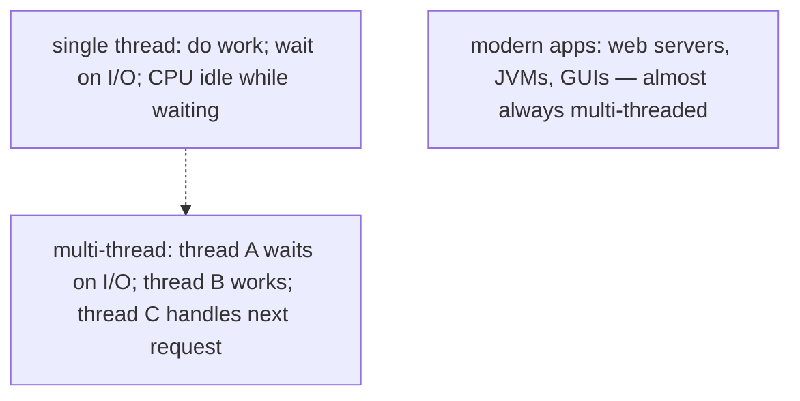

The cost: shared mutable state becomes the source of every subtle bug in the rest of the chapter (T03 synchronisation, T12 memory model). For now, focus on **creating, naming, joining** — single-thread mechanics applied N times.

## The `Thread` Class and `Runnable` Interface

Java's threading API rests on **two** types:

- **`java.lang.Thread`** — represents a thread of execution. The OS thread underneath is created when you call `.start()`.
- **`java.lang.Runnable`** — a single-method interface whose `void run()` defines the **work** the thread does.

```java
public interface Runnable {
    void run();
}
```

These two are decoupled by design: a `Runnable` is *what to do*; a `Thread` is *who does it*. Multiple threads can run the same `Runnable`; one thread can sequentially run several different `Runnable`s; the same `Runnable` can be passed to executors (T05) instead of threads.

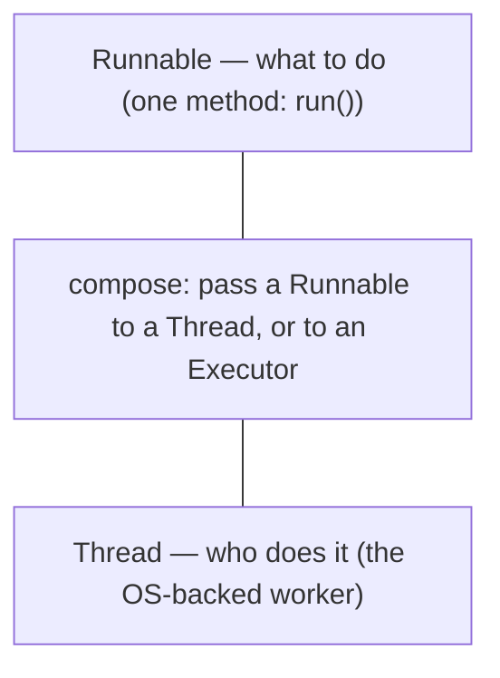

## Five Ways to Start a Thread

### 1. Implement `Runnable`, pass to `Thread`

The canonical pre-Java-8 idiom:

```java
class Greeter implements Runnable {
    @Override
    public void run() {
        System.out.println("hello from " + Thread.currentThread().getName());
    }
}

Thread t = new Thread(new Greeter(), "greeter-1");
t.start();
```

`new Thread(runnable, name)` is the most-used constructor. The second argument is the thread's **name** (visible in stack traces, debuggers, profilers) — **always name your threads** for debuggability.

### 2. Lambda over `Runnable`

Since Java 8, `Runnable` is a **functional interface** — a lambda satisfies it:

```java
Thread t = new Thread(() -> {
    System.out.println("hello from " + Thread.currentThread().getName());
}, "greeter-2");
t.start();
```

Shorter; same behaviour. The standard form today.

### 3. Extend `Thread`

```java
class MyThread extends Thread {
    MyThread(String name) { super(name); }

    @Override
    public void run() {
        System.out.println("hello from " + getName());
    }
}

new MyThread("greeter-3").start();
```

**Avoid this form.** Extending `Thread` ties your business logic to a concrete class — you can no longer extend anything else (Java has single inheritance), you can't easily reuse the work in an `Executor` (T05), and you mix two concerns (work + worker). Prefer `Runnable`.

> [!WARNING]
> Extending `Thread` is a common L0/L1 example because it looks simpler, but it's the *worst* of the five forms in production. Use `Runnable` (or `Callable<T>`, T06 — when you need a return value).

### 4. `Thread.ofPlatform().start(...)` — the modern factory (Java 21+)

```java
Thread t = Thread.ofPlatform()
        .name("greeter-4")
        .daemon(false)
        .priority(5)
        .start(() -> System.out.println("hello"));
```

A builder-style API that lets you configure name, priority, daemon, group, uncaught-exception-handler before starting. Equivalent to manually setting these on a `Thread` then calling `.start()` — just nicer to read.

### 5. `Thread.ofVirtual().start(...)` — virtual threads (Java 21+, Project Loom)

```java
Thread t = Thread.ofVirtual()
        .name("vt-1")
        .start(() -> System.out.println("hello"));
```

Looks identical to (4) but the underlying mechanism is fundamentally different — these are **virtual threads**, not OS-backed. You can spawn **millions** of them. Full coverage in [T14 Virtual threads](./T14-virtual-threads-project-loom.md); for now, recognise the API.

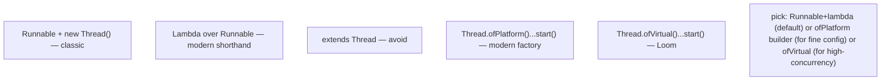

## `start()` vs `run()` — the Beginner Trap

```java
Thread t = new Thread(() -> doWork());

t.run();      // BUG: runs doWork() on the CURRENT thread synchronously
t.start();    // CORRECT: spawns a new thread that runs doWork() concurrently
```

`run()` is just a regular method — calling it directly is like calling any other method. `start()` is the magic: it asks the JVM to create an OS thread, the new thread enters its body, and the new thread calls `run()` itself.

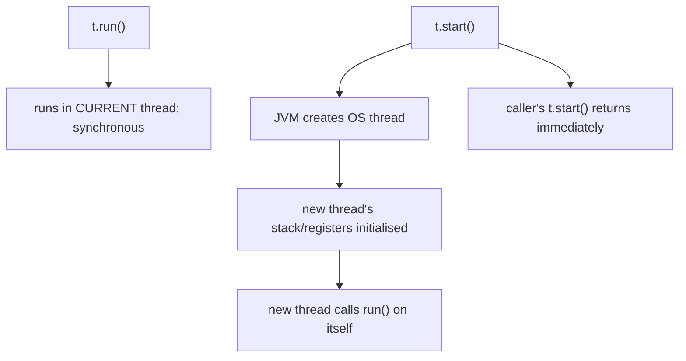

After `start()`, the call returns immediately — your code continues while the new thread runs concurrently.

> [!WARNING]
> **Never call `start()` twice on the same `Thread`.** It's not reusable. The second call throws `IllegalThreadStateException`. To "rerun" the work, create a new `Thread` instance (or use an `Executor`).

## Joining

`t.join()` makes the calling thread **wait until `t` finishes**:

```java
Thread t = new Thread(() -> {
    sleep(1000);
    System.out.println("worker done");
}, "worker");

t.start();
t.join();                                        // main waits ~1 second here
System.out.println("worker confirmed finished");
```

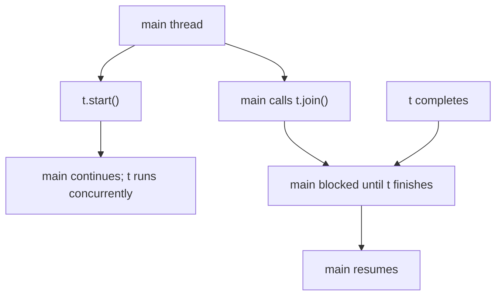

`join()` can throw `InterruptedException` — covered in T02. Variants:

```java
t.join();                    // wait indefinitely
t.join(1000);                 // wait up to 1 second (timeout)
t.join(1000, 0);              // ms + ns
```

`join()` is the simplest synchronisation primitive — useful at the end of a `main` to wait for worker threads before exiting.

## Naming, ID, and Identifying Threads

Every thread has a **name** (string, debug-friendly) and an **ID** (a long, unique within the JVM):

```java
Thread t = Thread.currentThread();
System.out.println(t.getName());                 // e.g., "main"
System.out.println(t.threadId());                 // unique long (since Java 19; older: getId())
```

The default name for unnamed threads is `Thread-N` where N increments — useless for debugging. **Always give threads a meaningful name** so stack traces, log lines, and thread dumps (`jstack`) make sense.

For threads created via constructors:

```java
new Thread(runnable, "request-handler-7");        // explicit name
new Thread(runnable);                              // gets "Thread-N"
```

For the factory builder:

```java
Thread.ofPlatform().name("worker-", 0).start(...);   // prefix + counter — fresh name each time
```

Inside a running thread:

```java
Thread.currentThread().getName();
```

## Thread Groups (Mostly Deprecated)

`ThreadGroup` was Java 1.0's mechanism to manage groups of threads (priorities, parents, security). Modern code uses **`Executor`** (T05) or virtual threads instead. The relevant facts:

- Every thread belongs to a thread group.
- `Thread.currentThread().getThreadGroup()` returns it.
- Most `ThreadGroup` methods (`enumerate`, `stop`, `suspend`) are deprecated.
- Don't write new code that uses thread groups beyond "leave at default."

Mentioned only because old codebases still reference them.

## Daemon vs User Threads

Java threads come in two flavours:

- **User threads** — keep the JVM alive. The JVM only exits when all user threads finish (or `System.exit` is called).
- **Daemon threads** — don't keep the JVM alive. If only daemons remain, the JVM exits.

```java
Thread t = new Thread(runnable, "background-cleaner");
t.setDaemon(true);                                 // call BEFORE start()
t.start();
```

The `main` thread is a user thread. Threads inherit daemon status from their creator (so threads created by `main` are user threads unless explicitly set otherwise).

Use cases:

| Flavour | Example |
|---------|---------|
| User thread | request handler; foreground worker the program needs to finish before exiting |
| Daemon thread | metrics emitter; cache warmer; heartbeat ping; anything where "if the app dies, this should die too" |

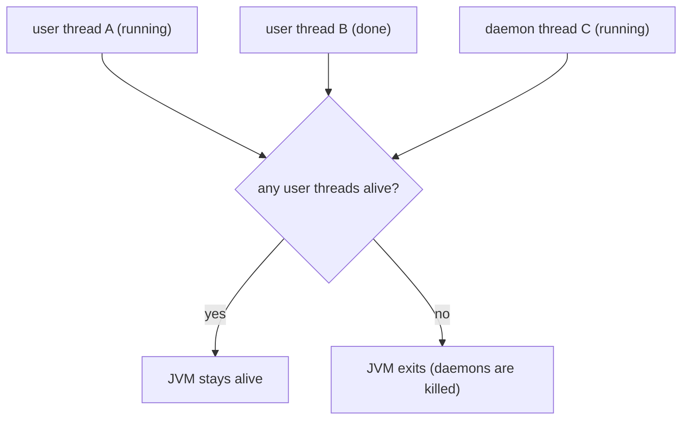

> [!IMPORTANT]
> `setDaemon` must be called **before** `start()`. Otherwise it throws `IllegalThreadStateException`.

## Thread Priorities

Each thread has a priority `1..10` (`Thread.MIN_PRIORITY = 1`, `Thread.NORM_PRIORITY = 5`, `Thread.MAX_PRIORITY = 10`):

```java
t.setPriority(Thread.NORM_PRIORITY);
```

**On most platforms this is advisory.** The JVM maps Java priorities to OS thread priorities (Linux nice values, Windows priority classes); the OS scheduler is free to ignore or interpret loosely. **Don't tune for performance with priority** — production rarely benefits. If you genuinely need priority scheduling, use a `PriorityBlockingQueue` (T10) + a thread pool consuming highest-priority tasks first.

## Uncaught Exceptions

A `Runnable.run()` that throws an exception **doesn't propagate** to the parent thread — it terminates the worker thread silently (unless an handler is set).

```java
Thread t = new Thread(() -> {
    throw new RuntimeException("boom");
}, "buggy");
t.start();
// main thread sees nothing; the exception is "lost"
```

Install an **uncaught exception handler**:

```java
t.setUncaughtExceptionHandler((thread, ex) -> {
    System.err.println("Uncaught in " + thread.getName() + ": " + ex);
    ex.printStackTrace();
});
t.start();
```

Or globally:

```java
Thread.setDefaultUncaughtExceptionHandler((thread, ex) -> {
    log.error("Thread {} died: {}", thread.getName(), ex.getMessage(), ex);
});
```

Production code should **always** install a default handler — log, alert, or take corrective action. A silently-dead worker is the worst kind of bug.

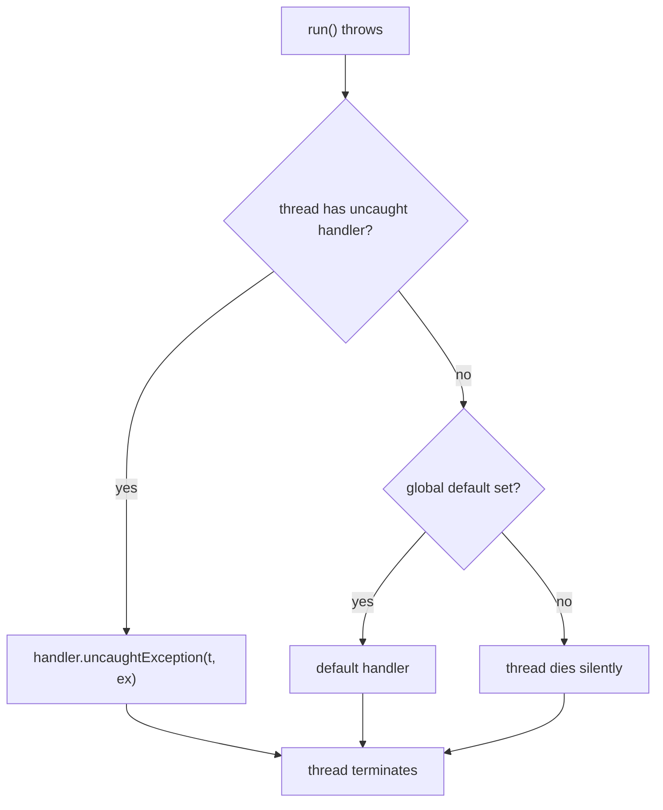

## Thread `Object` Layout and Memory

The Java `Thread` object itself is a regular heap object — about **~200 bytes** of fields:

```
Thread {
    long      tid;                      // unique thread ID
    String    name;
    int       priority;
    ThreadGroup group;
    Runnable  target;
    ClassLoader contextClassLoader;
    AccessControlContext inheritedAccessControlContext;
    boolean   daemon;
    int       threadStatus;
    long      eetop;                    // native thread handle
    long      stackSize;                // requested stack size
    long      parkBlocker;              // for LockSupport
    ThreadLocal.ThreadLocalMap threadLocals;
    InheritableThreadLocal.ThreadLocalMap inheritableThreadLocals;
    ...
}
```

The `eetop` field is the **native handle** — a pointer to the OS-side `JavaThread` structure in HotSpot. That structure links to:

- The **per-thread stack** (`-Xss` bytes, default 512 KB–1 MB).
- The **JVM Thread Local Storage** (TLAB pointers, GC state, lock metadata, JIT compilation state).
- The **OS thread** (pthread_t on Linux/macOS, HANDLE on Windows).

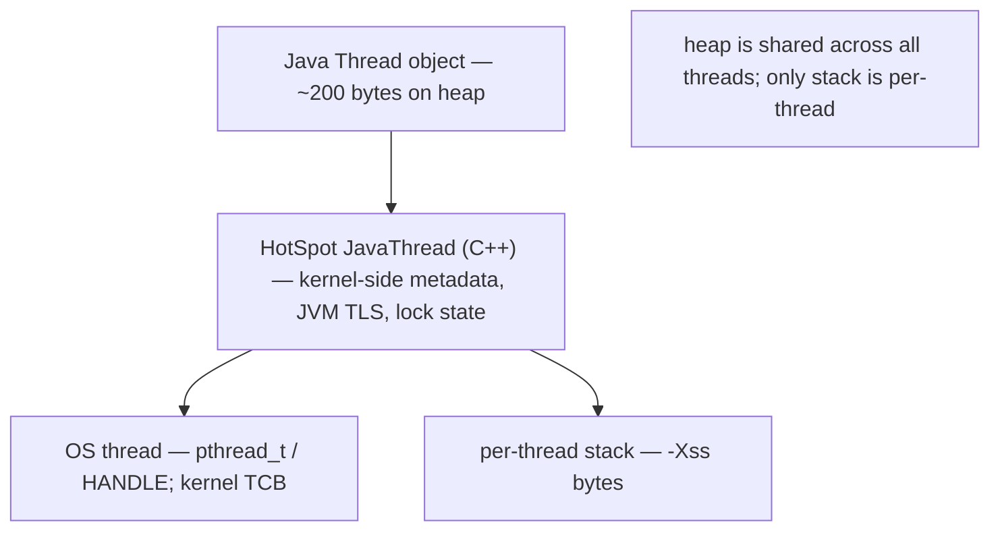

## The 1-to-1 Platform-Thread Mapping

In HotSpot (and every mainstream JVM since Java 1.3), one Java **platform thread** = one **OS kernel thread**:

| Layer | Cost |
|-------|------|
| `new Thread()` (Java object) | ~16 bytes header + ~200 bytes fields + native handle ≈ ~240 bytes |
| `start()` → `pthread_create` (Linux) / `CreateThread` (Windows) | ~50–100 µs + kernel TCB + stack reservation |
| Per-thread stack | ~512 KB–1 MB virtual address space (committed lazily on access) |
| Kernel TCB (Linux `task_struct`) | ~1-2 KB |
| Context switch (when scheduler swaps threads on a core) | ~1–10 µs (register save + cache impact) |

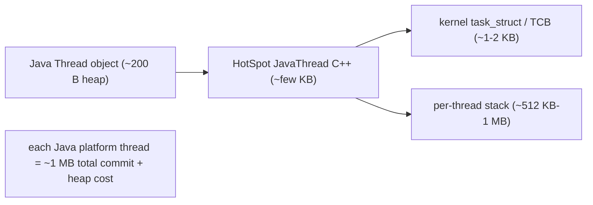

This 1-to-1 mapping is why the JVM (pre-Loom) was capped around **~16,000–32,000 platform threads** before resource exhaustion — and why production tuning historically obsessed over thread-pool sizing. **Virtual threads (T14)** decouple this — millions of virtual threads multiplex onto a small pool of OS threads.

### Virtual Threads — Why 1-to-1 Doesn't Bind Them (preview)

Full coverage is [T14](./T14-virtual-threads-project-loom.md), but the architecture is worth previewing here because it inverts everything above. A **virtual thread** is *not* backed by an OS thread. It is a `Runnable` wrapped in a `jdk.internal.vm.Continuation` — a delimited, one-shot coroutine whose stack can be suspended and resumed:

- **Mount / unmount.** To run, a virtual thread **mounts** on a **carrier** (a platform thread from a dedicated scheduler) — its frames are *thawed* onto the carrier's real OS stack. When it blocks (`park`, socket I/O, and since JDK 24 a contended `synchronized`), it **unmounts**: its live frames are *frozen* back onto the **Java heap** as stack-chunk objects, and the carrier is freed to run a different virtual thread. There is no carrier affinity — it may resume on a different one.
- **Freeze / thaw** is just copying frames between the OS stack ("v-stack") and the heap chunk ("h-stack"). That's the whole trick: **the stack lives on the GC heap**, so it costs hundreds of bytes (and grows on demand) instead of a 1 MB reservation. Hence *millions* per JVM.
- **The scheduler** is a dedicated `ForkJoinPool` in **FIFO** mode (distinct from the LIFO common pool that parallel streams use), with parallelism = `Runtime.availableProcessors()` by default and `maxPoolSize` 256.
- **Switching cost** is a user-mode freeze/thaw + task hand-off — **tens to low-hundreds of nanoseconds, no syscall** — vs the ~1–2 µs kernel context switch a platform thread pays. That, not raw speed, is the win.

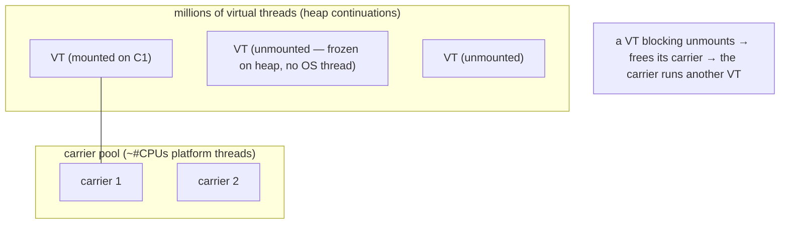

> [!IMPORTANT]
> Two facts a 2026 engineer must keep current. **(1) Virtual threads are not "faster threads"** — they don't speed up CPU-bound code (same JIT'd code, same cores); they raise *throughput/scalability* for blocking I/O by removing the OS-thread ceiling. **(2) The `synchronized` pinning advice is outdated.** Pre-JDK-24, a virtual thread blocked inside `synchronized` was **pinned** (couldn't unmount, held its carrier), so the rule was "replace hot `synchronized` with `ReentrantLock`." **JEP 491 (JDK 24)** fixed this — `synchronized` no longer pins; the remaining pinning causes are **native/JNI frames and FFM downcalls**. Don't pool virtual threads, and don't reflexively de-`synchronized` on JDK 24+.

## Per-Thread Stack: Layout and `-Xss`

T12 + T14 covered this; here's the multi-thread angle. Each thread gets its own stack:

```
0x7ffff7fff000  ← top of stack (high address)
       ↓
       │ frame for current method
       │ frame for caller
       │ ...
       │ frame for main()
       │
       │ guard page
       │ (~ -Xss bytes below the top)
       ↓
0x7ffff7eff000  ← bottom of stack
```

The OS reserves `-Xss` bytes of virtual address space per thread, plus a guard page at the bottom. Stack frames grow downward (toward lower addresses) as calls deepen. When the stack pointer crosses the guard page, the OS raises a signal (SIGSEGV); HotSpot catches it and throws `StackOverflowError`.

`-Xss=64k` to `-Xss=4m` are typical; default is platform-dependent (1 MB Linux x86-64). Smaller stacks let more threads coexist; larger stacks support deeper recursion.

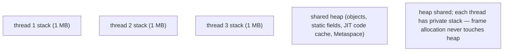

### Stack Guard Zones — How `StackOverflowError` Is Actually Thrown

The "guard page" at the bottom of the stack is really **four** HotSpot-managed zones, `mprotect`-ed below the usable stack (default page counts on Linux x64, 4 KB pages):

| Zone | Default | Purpose |
|------|--------:|---------|
| **Reserved** | 1 page (`-XX:StackReservedPages`) | JEP 270 — lets a `@ReservedStackAccess` critical section (e.g. `ReentrantLock.unlock`) *finish* instead of corrupting a lock on overflow |
| **Yellow** | 2 pages (`-XX:StackYellowPages`) | **recoverable** — overflow here throws a catchable `StackOverflowError` |
| **Red** | 1 page (`-XX:StackRedPages`) | **unrecoverable** — fatal; writes `hs_err_pid.log` and the VM dies |
| **Shadow** | 20 pages (`-XX:StackShadowPages`) | headroom so a deep native/JNI call can't leap past the guards undetected |

The mechanism is **stack banging**: compiled methods proactively store to a fixed offset below `%rsp` (e.g. `mov %eax,-0x14000(%rsp)`) *before* growing the frame. If that address lands in a guard page → **SIGSEGV** → HotSpot's signal handler inspects the faulting address:

- **Yellow hit** → unprotect the yellow pages (give the throw-path room), unwind, throw `StackOverflowError`, **re-guard** on the way out → recoverable, catchable.
- **Red hit** → fatal VM error (you blew past the recovery margin).
- **Reserved hit** inside a `@ReservedStackAccess` method → defer the error so the lock op completes atomically.

> [!IMPORTANT]
> **A `StackOverflowError` is *not* a JVM crash** — yellow-zone overflow is a normal, catchable `Error` thrown on the offending thread; the JVM keeps running. Only a **red-zone** breach (you exhausted even the recovery margin) is a fatal `hs_err` crash. This is a frequent interview/code-review misconception (T14 recursion).

The practical floor: `40 KB + (1+2+1+20) pages × 4 KB ≈ 136 KB`, so `-Xss` below ~136 KB is rejected. On **Apple-silicon macOS the base page is 16 KB** (not 4 KB), so the same *page counts* reserve ~4× the bytes — a concrete arch difference when you're squeezing thread counts.

## The OS Kernel Scheduler

Below the JVM, the OS scheduler decides which thread runs on which CPU core at which moment.

### Linux: CFS (Completely Fair Scheduler)

CFS treats threads as runnable tasks with a **virtual runtime** counter. The scheduler picks the task with the smallest vruntime, runs it for a small **time slice** (~1–4 ms typical), then preempts and re-picks. Over time, every task gets roughly equal CPU.

Key concepts:

- **`nice` value** (-20 to 19): maps roughly to Java priority. -20 = highest, 19 = lowest.
- **CPU affinity** (`taskset` / `sched_setaffinity`): pin a thread to specific cores.
- **Runqueue per core**: each CPU has its own; thread migration between cores is possible but loses cache.

### Windows: Multilevel-Feedback-Queue

Windows uses 32 priority levels (mapped from process priority class + thread priority). Threads get a quantum (~15 ms desktop, ~120 ms server); higher-priority threads preempt lower ones.

### macOS: Mach-Derived

Similar in spirit to Linux CFS but with Mach IPC underpinnings. The user-visible knobs are similar.

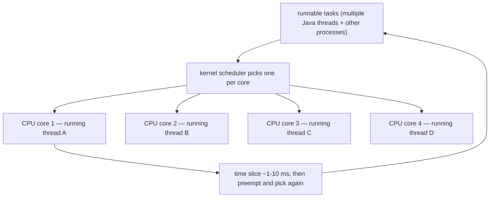

### Context Switch Cost

When the scheduler swaps a thread off a core to run another:

1. **Save** the current thread's CPU register state to its TCB.
2. **Restore** the next thread's register state.
3. **TLB flush** (if address space changes — only between processes, not threads of same process).
4. **Cache eviction** as the new thread's working set displaces the old one.

Total cost: ~**1.2–2.2 µs** *direct* (measured on Linux/NPTL — ~1.2–1.5 µs core-pinned, ~2.2 µs cross-core) **plus** the indirect cost of cache/TLB pollution, which often dominates. For comparison: a method call is ~1–5 ns. A context switch is roughly **1000× more expensive** than a method call — and a *virtual*-thread switch (user-mode freeze/thaw, no syscall) is ~10–100× cheaper than this kernel switch.

This is why **high-rate context switching is a perf killer** — and why thread pools (which keep threads alive across many tasks) outperform spawn-thread-per-task (T05).

## Native Thread Mechanics

### The Full `start()` → `pthread_create` Chain

`Thread.start()` is not a thin wrapper — it's a multi-layer descent into the VM that allocates three coupled objects and performs a producer/consumer rendezvous:

```text
Thread.start()                       (Java)
  └─ Thread.start0()                 (native, @IntrinsicCandidate)
      └─ JVM_StartThread             (hotspot/share/prims/jvm.cpp)
          └─ new JavaThread(&entry, stack_sz)     ← the C++ VM thread object
              └─ os::create_thread(...)
                  └─ pthread_create(&tid, &attr, thread_native_entry, this)   (Linux/macOS)
                     // or CreateThread / _beginthreadex on Windows
```

Three structures are created per platform thread:

- **`JavaThread`** (C++) — the VM's thread object. Holds `_thread_state` (the `JavaThreadState`: `_thread_new`/`_thread_in_Java`/`_thread_in_vm`/`_thread_in_native`/`_thread_blocked` — used for safepoints, T02), an **`OopHandle` to the Java `Thread` `oop`** (the heap object), and the **`JavaFrameAnchor`** (`_anchor` = last_Java_sp/fp/pc — the saved boundary that lets GC and stack-walkers find Java frames from inside C++/native code).
- **`OSThread`** (C++) — the thin OS handle: the `pthread_t` / native thread id.
- The Java **`Thread` `oop`** on the heap (T01's ~200-byte object).

**It's a rendezvous, not fire-and-forget.** The new OS thread starts in `thread_native_entry`, but immediately **blocks on a condvar** until the creating thread — holding the global `Threads_lock` — finishes wiring it into the VM's `ThreadsList`, then flips it runnable (`os::start_thread`). Only then does the child call `JavaThread::run()` → the Java `run()`. So `pthread_create` returning does *not* mean the Java code has started; there's a hand-off.

### Linux/macOS — POSIX Threads (`pthread`)

```c
pthread_create(&tid, &attr, thread_native_entry, java_thread);
```

- `tid` (`pthread_t`) is the OS thread handle (HotSpot also exposes a native handle on the legacy `Thread.eetop` field).
- `attr` controls stack size and scheduling. Notably HotSpot calls `pthread_attr_setguardsize(&attr, 0)` to **disable glibc's own guard page** — it manages its own four-zone guards (above) instead.
- `thread_native_entry` is HotSpot's C++ entry: waits on the rendezvous, attaches TLS, then invokes the Java `run()`.

### Windows — `CreateThread`

```c
CreateThread(NULL, stackSize, java_start, java_thread, 0, &tid);
```

Similar mechanism; HANDLE replaces `pthread_t`.

### Attaching a Native Thread to the JVM

A C/C++ program that wants to call Java code from its own thread must **attach** it via JNI:

```c
JavaVMAttachArgs args = { JNI_VERSION_21, "native-worker", NULL };
JNIEnv *env;
jvm->AttachCurrentThread((void**)&env, &args);
// now the native thread can call Java methods
jvm->DetachCurrentThread();
```

The attached thread becomes a Java thread (with a `Thread` object on the heap) while attached. Detaching releases the JVM TLS but the native thread continues to exist.

## Thread Cap on the JVM

Before Loom, you could expect roughly:

| Stack size | Approx max threads on 64-bit Linux | Why |
|------------|-----------------------------------:|-----|
| 1 MB (default) | ~16 000 | virtual address space + kernel TCB |
| 256 KB | ~32 000 | same constraints, less per-thread cost |
| 64 KB | ~64 000 | risky — easy to SOE |

`ulimit -u` (Linux) sets a hard per-user cap on threads/processes (often 4096 default). `ulimit -s` controls default stack size. A third, less-obvious wall is **`vm.max_map_count`** (default ~65 530): each thread's stack + four guard zones consume several `mmap` map entries, so a JVM spawning tens of thousands of threads can hit *"attempt to allocate stack guard pages failed"* — an `mprotect`/map-count exhaustion, not a memory shortage.

> [!NOTE]
> **"Each thread eats 1 MB" is imprecise.** That 1 MB is **reserved virtual address space**, not committed RAM — physical pages are mapped lazily as the stack is touched, so a shallow thread costs a few pages. But the 1 MB still counts against the **address space** and **`max_map_count`**, which is why the cap is about *virtual* limits, not heap. (And `-Xss` sizes the **native** OS stack — virtual-thread stacks live on the **heap**, not bounded by `-Xss`; T14.)

Going past these limits → `OutOfMemoryError: unable to create new native thread` or `pthread_create failed`. The fix in modern Java is **virtual threads** (T14) — millions per JVM.

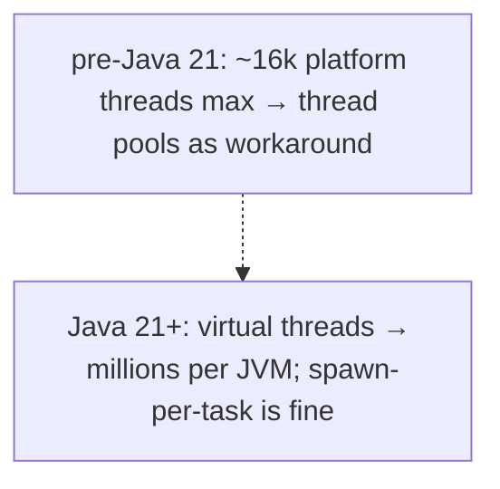

## Common Mistakes

### Calling `run()` Instead of `start()`

Covered above. `run()` is synchronous on the caller's thread; `start()` spawns a new thread. The bug surfaces as "code runs but I see no concurrency."

### Calling `start()` Twice

```java
t.start();
t.start();                                  // IllegalThreadStateException
```

`Thread` is one-shot. Use a fresh `Thread` for each run, or pass the `Runnable` to an `Executor` (T05).

### Not Naming Threads

`Thread-7` in a stack trace tells you nothing. **Always** name threads — pass the name as the constructor argument, use the builder, or set `t.setName(...)` before `start()`.

### Extending `Thread` and Coupling Work to Worker

Limits reuse, blocks inheritance, makes testing harder. Use `Runnable` (or `Callable<T>` for return values).

### Forgetting `setDaemon` Timing

```java
t.start();
t.setDaemon(true);                           // IllegalThreadStateException
```

Set before `start()` — the daemon flag is consulted when the OS thread is created.

### Swallowing Uncaught Exceptions

A `Runnable.run()` that throws disappears without an uncaught-exception-handler. **Always** install a default handler; or use `Future` (T06) which captures and re-throws on `.get()`.

### Premature Priority Tuning

`setPriority` is advisory on most platforms. Don't expect speedups. If you need scheduling guarantees, use a higher-level construct (priority-queue + worker pool, T10/T05).

### Thread Leak

Creating threads without joining them or pooling them leaks resources:

```java
while (true) {
    new Thread(() -> handleRequest(...)).start();   // each request leaks a thread
}
```

Use an `ExecutorService` (T05). Bound the parallelism explicitly.

### `Thread.sleep` for Synchronisation

```java
new Thread(() -> { /* slow */ }).start();
Thread.sleep(1000);                           // "I hope the worker finished by now"
```

This is hope-driven scheduling. Use `join` (this topic), `CountDownLatch` (T09), `Future.get` (T06).

### Mutating Shared State Without Synchronisation

Foreshadowing T03 / T12: two threads writing to the same `int` produce undefined results — see T02/T03/T11/T12.

> [!INTERVIEW]
> Threading basics show up at every level — L0 conceptual ("what's a thread?") through L3+ deep ("walk through `pthread_create` from `Thread.start`").
>
> 1. **What's the difference between `Thread` and `Runnable`?** `Thread` is the worker; `Runnable` is the work. Decoupling lets one worker run many `Runnable`s and lets the same `Runnable` be reused.
> 2. **What's the difference between `start()` and `run()`?** `start()` spawns a new OS thread; `run()` is a regular method call on the current thread.
> 3. **Can you call `start()` twice?** No — `IllegalThreadStateException`.
> 4. **Daemon vs user thread?** Daemons don't keep the JVM alive; user threads do. `setDaemon` must be before `start()`.
> 5. **What's the underlying OS mechanism?** `pthread_create` on Linux/macOS; `CreateThread` on Windows. One Java platform thread = one kernel thread.
> 6. **How much does a thread cost?** ~200 B Java object + ~1 MB virtual stack + ~1-2 KB kernel TCB; ~50–100 µs to create.
> 7. **What's a context switch and how expensive is it?** Swapping the running thread on a CPU core. Direct cost ~1–10 µs; indirect cost via cache invalidation can dominate. ~1000× a method call.
> 8. **What's `join`?** Block until the named thread finishes. Optional timeout.
> 9. **What happens to an uncaught exception in a thread?** Without a handler, the thread dies silently. Install `UncaughtExceptionHandler` per thread or globally.
> 10. **What's the maximum number of threads on a JVM?** Practical cap ~16k platform threads on 64-bit Linux due to virtual address space. Virtual threads remove this cap.
> 11. **Why is `setPriority` weak?** It maps to OS priorities which the kernel scheduler is free to interpret loosely.
> 12. **What's the JVM's `main` thread?** The single user thread the JVM creates when starting; runs `main(String[])`. JVM exits when no user threads remain.
> 13. **Walk `Thread.start()` to the OS.** `start()` → `start0()` → `JVM_StartThread` → `new JavaThread` → `os::create_thread` → `pthread_create`; the child blocks on a rendezvous (under `Threads_lock`) until the parent wires it into the `ThreadsList`, then runs Java `run()`.
> 14. **Is `StackOverflowError` a crash?** No — a **yellow-zone** overflow is a catchable `Error` (the JVM unguards, throws, re-guards); only a **red-zone** breach is a fatal `hs_err` crash. HotSpot detects overflow by *stack banging* into `mprotect`-ed guard pages.
> 15. **How do virtual threads escape the 1-to-1 cap?** They're heap `Continuation`s that mount/unmount on a small carrier pool; a blocked VT *freezes* its stack to the heap and frees its carrier — no OS thread held, so millions fit. They improve I/O throughput, not CPU speed.
> 16. **Does `synchronized` pin a virtual thread?** Pre-JDK-24, yes (couldn't unmount → held its carrier). **JEP 491 (JDK 24)** removed that; now mostly only native/JNI frames pin. So "always swap `synchronized` for `ReentrantLock`" is outdated on 24+.

## Practice

1. **Three forms of the same task.** Write the same `Runnable` (print "hello") three ways: implementing `Runnable`, lambda, extending `Thread`. Confirm identical behaviour.
2. **Naming.** Create 10 threads, set names "worker-0" through "worker-9", have each print its name on start. Confirm distinct names appear (in any order).
3. **`start` vs `run`.** Call `t.run()` directly; confirm execution is synchronous on the current thread (use `Thread.currentThread().getName()` inside).
4. **`start` twice.** Reproduce `IllegalThreadStateException`.
5. **`join` for completion.** Spawn 5 threads, each sleeping a different amount; `join` each from `main` (in order); confirm `main` waits ~longest-sleep total.
6. **Daemon vs user.** Spawn a daemon that loops forever printing "tick"; from `main`, exit after 2 seconds; confirm the JVM exits cleanly (daemon doesn't keep it alive).
7. **Forget `setDaemon` timing.** Call `setDaemon(true)` after `start()`; observe `IllegalThreadStateException`.
8. **Uncaught exception.** Spawn a thread that throws; observe the silent death. Install an uncaught-exception-handler; confirm it's invoked.
9. **Default uncaught handler.** Call `Thread.setDefaultUncaughtExceptionHandler`; spawn 3 threads that throw; confirm the default fires for all 3.
10. **Thread count limit.** Spawn threads in a loop until you get `OutOfMemoryError: unable to create new native thread`. Record the count. Try with `-Xss=64k` and observe the new ceiling.
11. **Inspect thread metadata.** From `Thread.currentThread()`, print name, ID, priority, daemon, group. Compare main vs a spawned thread.
12. **Spawn cost.** Time spawning + joining a single trivial thread 1000 times. Compare to invoking a method 1000 times. Confirm ~1000× difference.
13. **Context-switch micro-benchmark.** Two threads, ping-ponging a `volatile` flag back and forth via busy-spin; measure ~M/sec. Then with `LockSupport.park`/`unpark` (T08 preview); compare.
14. **`Thread.ofPlatform()` factory.** Create a thread via the factory with name, priority, daemon, exception handler. Confirm `getName/getPriority/isDaemon` reflect them.
15. **Virtual thread comparison preview.** `Thread.ofVirtual().start(() -> ...)`. Spawn 1 million; confirm OOM doesn't fire (unlike platform).
16. **Read thread dump.** Spawn 5 named threads sleeping; from another terminal, `jcmd <pid> Thread.print`. Find your 5 by name.
17. **JNI attach (advanced).** Write a C program that spawns a native thread, attaches it to the JVM, calls a Java method, detaches. Confirm the Java method sees `Thread.currentThread()` correctly.

## Recap

You should now be able to:

- Distinguish **`Thread`** (the worker, OS-backed) from **`Runnable`** (the work; functional interface with one `run()` method) and use them composed.
- Spawn threads via **five idiomatic forms** — implementing `Runnable`, lambda over `Runnable`, extending `Thread` (avoid), `Thread.ofPlatform().start(...)` (modern factory), `Thread.ofVirtual().start(...)` (Java 21+ virtual threads).
- Apply the **`start()` vs `run()` rule** — only `start()` spawns a new thread; `run()` is a regular method call.
- Recall **one-shot semantics** — `start()` twice throws `IllegalThreadStateException`; reuse a `Runnable` with new `Thread`s or an `Executor`.
- Apply **naming discipline** — always name threads for debuggability; `getName`/`threadId`/`setName`.
- Apply **`join`** to make the calling thread wait for a worker; with optional timeout.
- Distinguish **user vs daemon threads** — user threads keep the JVM alive; daemons don't. Set `daemon` before `start()`.
- Recognise **`setPriority` is advisory** — don't tune for perf with thread priorities; use priority queues + worker pools instead.
- Install an **`UncaughtExceptionHandler`** per thread, or a global default — without one, a thread that throws dies silently.
- Recall the **memory footprint** of a platform thread: ~200 B Java object on heap + native handle + ~1 MB virtual stack (`-Xss`) + ~1-2 KB kernel TCB. ~50–100 µs to create.
- Recall the **1-to-1 platform/OS thread mapping** in HotSpot — `Thread.start()` calls `pthread_create` (Linux/macOS) or `CreateThread` (Windows). One Java platform thread = one kernel thread.
- Identify the **per-thread stack** as the only per-thread memory — heap, Metaspace, code cache, static fields are shared.
- Recognise the **kernel scheduler** mechanism — CFS (Linux), MLFQ (Windows), Mach-derived (macOS); ~1–10 ms time slices; preemption.
- Recall the **context-switch cost** — ~1–10 µs direct + indirect cache-cost; ~1000× a method call.
- Recognise the **pre-Loom thread cap** — ~16k platform threads on 64-bit Linux due to virtual address space. **Virtual threads (T14) remove this cap.**
- Avoid the **common traps**: `run()` instead of `start()`, `start()` twice, no thread name, extending `Thread`, `setDaemon` after `start`, swallowing uncaught exceptions, premature priority tuning, thread leak via unbounded `new Thread`, `Thread.sleep` as synchronisation.

## Next

Continue to [Thread lifecycle & states](./T02-thread-lifecycle-and-states.md).
