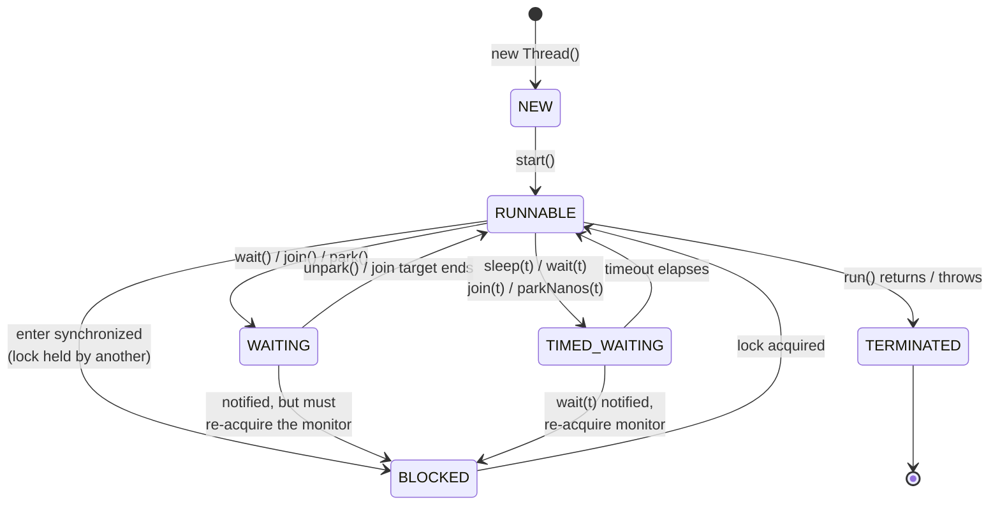
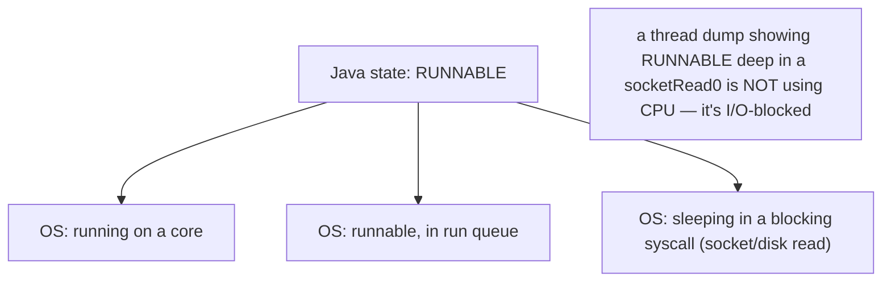
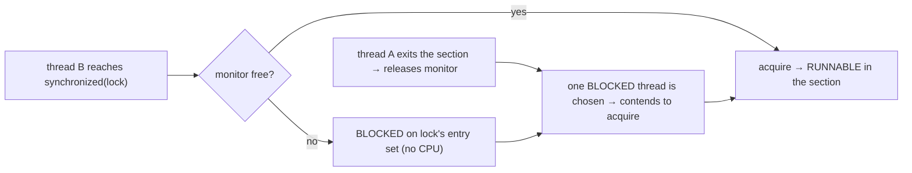
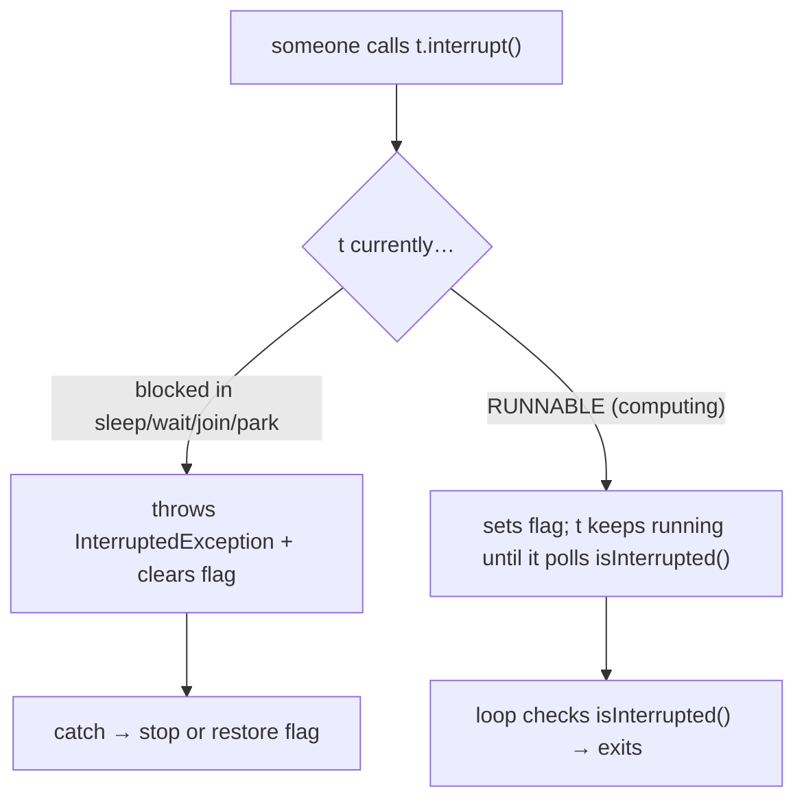
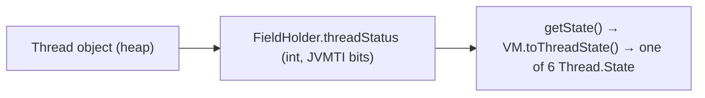
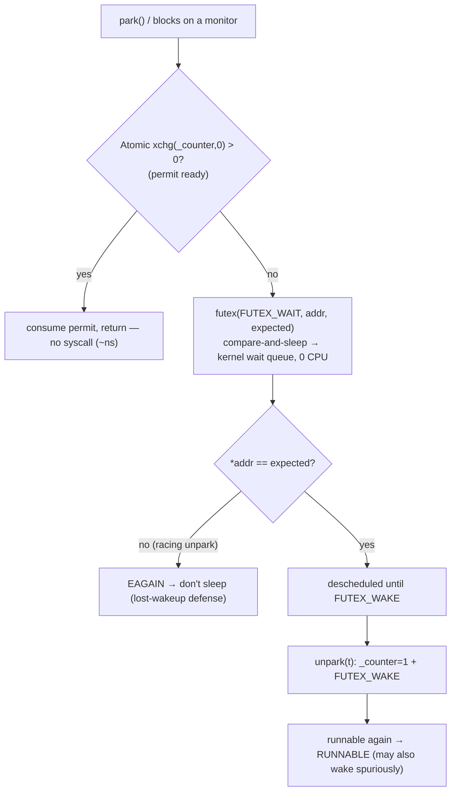

# Thread Lifecycle & States

A thread is not simply "running." Across its life it moves through a small set of **states** — created, runnable, blocked on a lock, waiting to be woken, sleeping with a deadline, finished — and the transitions between them are driven by specific method calls and scheduler events. Reading those states (in a thread dump, in a debugger, in your head) is the single most useful diagnostic skill in concurrent Java: a hung service is almost always a thread stuck in a state it shouldn't be in.

The depth-bar requirement isn't just "list the six `Thread.State` values." At the **language** layer, Java models the lifecycle with the `Thread.State` enum and a set of transition-causing methods (`start`, `sleep`, `wait`, `join`, the monitor-acquire path, `LockSupport.park`, `interrupt`). At the **memory** layer, the current state is a small integer (`threadStatus`) inside the `Thread` object, and the *waiting* states are implemented by **parking** the OS thread on a kernel wait queue — on Linux a **futex** (fast userspace mutex) — so a `WAITING`/`BLOCKED` Java thread is a descheduled OS thread consuming no CPU. At the **architecture** layer, Java's six states are a *coarsening* of the OS scheduler's states (running / runnable / sleeping-uninterruptible / sleeping-interruptible): most famously, a thread blocked in a socket read is `RUNNABLE` to Java but *sleeping* to the kernel — a gotcha that has misled a generation of thread-dump readers. We'll cover all three layers, then the **interrupt** mechanism (the cooperative cancellation protocol that ties the waiting states together), and finish with how to *observe* states in a live JVM.

> [!NOTE]
> Prerequisites: [Threads & Runnable](./T01-threads-and-runnable.md) (L3/C01/T01) — `Thread`/`Runnable`, `start()` vs `run()`, the 1-to-1 OS-thread mapping, per-thread stacks; [Methods, parameters, return values](../../L0-foundations/C02-java-core/T12-methods-parameters-return-values.md) (L0/C02/T12) — call frames; [How Computers Run Programs](../../L0-foundations/C01-cs-foundations/T01-how-computers-run-programs-cpu-memory-binary.md) (L0/C01/T01) — CPU scheduling, the run queue.

## The Six States

`java.lang.Thread.State` is an enum with exactly **six** values. Every Java thread is in exactly one at any instant:

| State | Meaning | Entered by | Holds CPU? |
|-------|---------|-----------|:----------:|
| `NEW` | created, not yet started | `new Thread(...)` | no |
| `RUNNABLE` | runnable: running on a core **or** ready and waiting for one **or** blocked in native/I/O | `start()`; scheduler dispatch | maybe |
| `BLOCKED` | waiting to acquire a **monitor** lock (`synchronized`) | contended `synchronized` entry / re-entry after `wait` | no |
| `WAITING` | waiting **indefinitely** to be signalled | `wait()`, `join()`, `LockSupport.park()` | no |
| `TIMED_WAITING` | waiting with a **deadline** | `sleep(t)`, `wait(t)`, `join(t)`, `parkNanos/parkUntil` | no |
| `TERMINATED` | `run()` has returned or thrown | natural completion | no |

```java
Thread t = new Thread(task);
System.out.println(t.getState());          // NEW
t.start();
// ... t.getState() is one of RUNNABLE / BLOCKED / WAITING / TIMED_WAITING while alive
t.join();
System.out.println(t.getState());          // TERMINATED
```

> [!WARNING]
> `getState()` returns a **snapshot** that may be stale the instant it returns — a thread can change state between the read and your next line. It's for **monitoring and debugging only**. Never branch program logic on `getState()` (e.g. "if it's BLOCKED, do X") — that's an inherent race. Use real synchronization (T03–T12) instead.

## The State Diagram



Two subtleties the diagram makes explicit:

1. **There is no state for "running" vs "ready."** Both are `RUNNABLE`. The JVM deliberately doesn't expose whether the OS has the thread *on a core* right now or *in the run queue* waiting for one — that changes microsecond to microsecond and the JVM can't track it cheaply.
2. **After `wait()`, a notified thread doesn't jump straight to `RUNNABLE`.** It must **re-acquire the monitor** it released (T04), so it passes through `BLOCKED` first. A thread dump can show a just-notified thread as `BLOCKED` on the very lock it's about to reclaim.

## NEW and TERMINATED — the Endpoints

**`NEW`** is the gap between construction and `start()`. The `Thread` object exists on the heap (T01), but **no OS thread exists yet** — `pthread_create` hasn't been called. The thread consumes a heap object and nothing else.

**`TERMINATED`** is reached when `run()` returns normally or propagates an exception (T01 — uncaught-exception handling). The OS thread is gone; the `Thread` object lingers on the heap until GC collects it. A terminated thread is **dead forever** — `start()` on it throws `IllegalThreadStateException` (T01). To "rerun," create a new `Thread` or use an `Executor` (T05).

```java
Thread t = new Thread(() -> {});
t.getState();   // NEW
t.start();
t.join();
t.getState();   // TERMINATED
t.start();      // IllegalThreadStateException — one-shot
```

## RUNNABLE — and the I/O Gotcha

`RUNNABLE` is the broadest state. A Java thread is `RUNNABLE` when it is:

- actually executing instructions on a CPU core, **or**
- ready to execute and sitting in the OS run queue waiting for a core, **or**
- **blocked in a native call or I/O** — a `read()` on a socket, a disk write, a `synchronized`-free native blocking call.

That third case is the **famous gotcha**. From the kernel's view, a thread parked in `recv()` waiting for network bytes is *sleeping* (interruptible sleep, `S` in `top`), consuming no CPU. But the JVM only knows the thread is somewhere inside a native method — it can't tell "computing" from "blocked in a syscall" — so it reports **`RUNNABLE`**.



> [!IMPORTANT]
> **In a thread dump, `RUNNABLE` does not mean "using CPU."** A pool of threads all `RUNNABLE` at `java.net.SocketInputStream.socketRead0(Native Method)` are *idle*, waiting on the network — not a CPU bottleneck. To find real CPU hogs, correlate the dump with per-thread CPU time (`top -H -p <pid>`, or async-profiler / JFR), not the Java state alone. Misreading this sends people optimizing the wrong thing.

## BLOCKED — Monitor-Lock Contention

A thread is `BLOCKED` for exactly **one** reason: it is trying to enter a `synchronized` block or method whose **monitor** is held by another thread (or to re-enter a monitor after returning from `wait()`). It is *not* `BLOCKED` for `java.util.concurrent` locks — a `ReentrantLock` (T08) parks the thread, which shows as `WAITING`/`TIMED_WAITING`, not `BLOCKED`. `BLOCKED` is the `synchronized`-only state.

```java
synchronized (lock) {    // if 'lock's monitor is held elsewhere, this thread is BLOCKED here
    // critical section
}
```



Underneath, an uncontended monitor is cheap (a CAS on the object header's mark word — biased/thin lock, detailed in T03); a *contended* monitor **inflates** to a heavyweight monitor backed by an OS mutex, and the loser thread is parked on a kernel wait queue (a **futex** on Linux) — descheduled, zero CPU, until the owner's release wakes one waiter. Full lock mechanics are T03; here the point is: `BLOCKED` = "queued for a `synchronized` monitor," and it costs nothing but latency.

## WAITING and TIMED_WAITING

These two are the **signal-driven** states: a thread voluntarily steps aside until something wakes it. The only difference is whether there's a deadline.

| Trigger | State | Wakes on |
|---------|-------|----------|
| `Object.wait()` | `WAITING` | `notify()`/`notifyAll()` (then re-acquire monitor) — T04 |
| `Object.wait(ms)` | `TIMED_WAITING` | notify, **or** timeout |
| `Thread.join()` | `WAITING` | target thread terminates |
| `Thread.join(ms)` | `TIMED_WAITING` | target terminates, **or** timeout |
| `Thread.sleep(ms)` | `TIMED_WAITING` | timeout (or interrupt) |
| `LockSupport.park()` | `WAITING` | `unpark()` (or interrupt) — T08 |
| `LockSupport.parkNanos(n)` | `TIMED_WAITING` | `unpark`, timeout, or interrupt |

All of these park the OS thread on a kernel wait queue — no CPU, no spinning. The wake path is an `unpark`/`notify` that makes the kernel mark the thread runnable again. (The lone exception is a *busy-wait* / spin, which is `RUNNABLE` and burns a core — almost always a bug; see Common Mistakes.)

## `sleep` vs `wait` vs `yield`

Three superficially similar calls that behave very differently. Knowing the differences cold is a classic interview filter.

| | `Thread.sleep(t)` | `Object.wait()` | `Thread.yield()` |
|--|------------------|-----------------|------------------|
| Defined on | `Thread` (static) | `Object` (instance) | `Thread` (static) |
| State | `TIMED_WAITING` | `WAITING` (or timed) | stays `RUNNABLE` |
| **Releases the monitor?** | **NO** — keeps every lock it holds | **YES** — releases *this* object's monitor | n/a (doesn't block) |
| Must hold a lock first? | no | **yes** — must be inside `synchronized(obj)` or `IllegalMonitorStateException` | no |
| Woken by | timeout / interrupt | `notify`/`notifyAll` / interrupt (/ timeout) | scheduler's discretion |
| Typical use | pause for a fixed time | wait for a condition (T04) | a (usually pointless) scheduling hint |

> [!WARNING]
> **`sleep()` does not release locks.** Calling `Thread.sleep()` inside a `synchronized` block keeps the monitor the whole time — every other thread that needs that lock is `BLOCKED` for the full duration. This is a classic way to throttle a whole system by accident. If you need to wait *for a condition* while letting others proceed, use `wait()`/a condition variable (T04), which releases the monitor.

**`yield()`** is a *hint* to the scheduler that the current thread is willing to give up its core. The scheduler is free to ignore it (and usually does on a loaded machine), and the thread stays `RUNNABLE`. It almost never helps real code — don't reach for it to "fix" a race or smooth scheduling; use proper synchronization.

## The Interrupt Mechanism

Java has **no way to forcibly stop a thread** — `Thread.stop()` is deprecated and dangerous (it can release locks mid-mutation, corrupting state). Instead, cancellation is **cooperative**, built on a single per-thread boolean: the **interrupt status flag**. `interrupt()` is the universal "please stop / wake up" signal, and it's what ties the waiting states together.

### The flag and the three methods

```java
t.interrupt();                              // SET t's interrupt flag (request)
t.isInterrupted();                          // READ t's flag (no clear)
Thread.interrupted();                       // READ-AND-CLEAR the CURRENT thread's flag (static!)
```

- **`interrupt()`** sets the target's flag. That's all it does to a *computing* thread — it does not stop it.
- **`isInterrupted()`** (instance) tests the flag without clearing it.
- **`Thread.interrupted()`** (static) tests **and clears** the *calling* thread's flag — the easy-to-misuse one (it has a side effect, and it always refers to the current thread regardless of which `Thread` you call it on).

### Two ways a thread observes an interrupt

1. **It's blocked in an interruptible method** — `sleep`, `wait`, `join`, `LockSupport.park`, and many `InterruptibleChannel` I/O calls. The method **throws `InterruptedException`**, and *clears the flag* as it does so. The thread wakes from `WAITING`/`TIMED_WAITING` immediately.
2. **It's `RUNNABLE` (computing)** — nothing is thrown; the flag is just set. The thread only notices if it **polls** `isInterrupted()`. This is the cooperative-cancellation loop:

```java
while (!Thread.currentThread().isInterrupted()) {
    doOneChunkOfWork();                     // long loops must check the flag periodically
}
// fell out → we were asked to stop → clean up and return
```



### The two rules that matter

> [!WARNING]
> **Never swallow `InterruptedException`.** A bare `catch (InterruptedException e) {}` throws away a cancellation request — the thread keeps running when it was asked to stop, and the flag is already cleared so no one upstream can tell. Do one of two things:
> 1. **Propagate it** — declare `throws InterruptedException` and let the caller decide. Best when you can.
> 2. **Restore the flag and stop** — if you can't propagate (e.g. you're inside `Runnable.run()`, which can't throw checked exceptions), call `Thread.currentThread().interrupt()` to **re-set** the flag you just cleared, then exit the work. This preserves the interrupt for code higher up the stack.

```java
try {
    Thread.sleep(1000);
} catch (InterruptedException e) {
    Thread.currentThread().interrupt();     // RESTORE the flag (sleep cleared it)
    return;                                 // stop doing work — honor the cancellation
}
```

This `interrupt()` is the most-forgotten line in concurrent Java, and the reason a `Future.cancel(true)` or an `ExecutorService.shutdownNow()` (T05/T06) silently fails to stop tasks that catch-and-ignore.

### Under the hood — where the flag lives and how the wake fires

The interrupt flag is a plain field on the Java `Thread`: **`volatile boolean interrupted;`** (commented in the JDK source "interrupted status (read/written by VM)"). It wasn't always there — **before JDK 11 it lived in the C++ `OSThread`**; JDK-8198908 (JDK 11) moved it into the Java object, and the VM now reads/writes it through `java_lang_Thread::interrupted()`/`set_interrupted()` at a cached `_interrupted_offset`. `Thread.interrupt()` is just:

```java
public void interrupt() {
    interrupted = true;     // set the flag FIRST (so a waking thread always sees it)
    interrupt0();           // native: tell the VM to wake the thread if it's blocked
}
```

That native `interrupt0()` reaches `JavaThread::interrupt()`, which **unparks all three of the thread's wait primitives** so that whichever one it's blocked on returns at once:

```cpp
void JavaThread::interrupt() {
  _SleepEvent->unpark();   // wakes Thread.sleep()
  parker()->unpark();      // wakes LockSupport.park()      (the Parker above)
  _ParkEvent->unpark();    // wakes synchronized / Object.wait()
}
```

The blocking method itself does the throwing: on wake it calls `is_interrupted(true)` (test-and-clear) and either throws `InterruptedException` (`sleep`/`wait`/`join`) or — for `LockSupport.park` — **just returns with the flag still set** (park never throws; T08's AQS checks the flag after park). This is why `interrupt()` is purely a *request*: it sets a boolean and rings the doorbell; the *receiver* decides what to do.

## Memory & Architecture Layer — Where the State Lives

### `threadStatus` — the state as an integer

A thread's Java state is not stored as a `Thread.State` enum object; it's a small **`int threadStatus`** the **VM writes** as the thread transitions. Since JDK 19 (Loom refactoring) it lives one level deeper — in a nested **`Thread.FieldHolder`** (`private final FieldHolder holder;` → `volatile int threadStatus`) rather than directly on `Thread` — so `getState()` on a platform thread reads `holder.threadStatus`. So "what state is this thread in?" is, at the byte level, a single 4-byte volatile field read — which is why `getState()` is cheap but inherently raced (the field can change the next instant).

Critically, that int is **not** the `Thread.State` ordinal — it's a bitmask of **JVMTI thread-state bits**, mapped to the six-value enum by `jdk.internal.misc.VM.toThreadState(int)`:

```java
// jdk.internal.misc.VM — the actual JVMTI bit values + priority order
JVMTI_THREAD_STATE_ALIVE                    = 0x0001;
JVMTI_THREAD_STATE_TERMINATED               = 0x0002;
JVMTI_THREAD_STATE_RUNNABLE                 = 0x0004;
JVMTI_THREAD_STATE_BLOCKED_ON_MONITOR_ENTER = 0x0400;
JVMTI_THREAD_STATE_WAITING_INDEFINITELY     = 0x0010;
JVMTI_THREAD_STATE_WAITING_WITH_TIMEOUT     = 0x0020;

if      ((s & RUNNABLE) != 0)                 return RUNNABLE;
else if ((s & BLOCKED_ON_MONITOR_ENTER) != 0) return BLOCKED;
else if ((s & WAITING_INDEFINITELY) != 0)     return WAITING;
else if ((s & WAITING_WITH_TIMEOUT) != 0)     return TIMED_WAITING;
else if ((s & TERMINATED) != 0)               return TERMINATED;
else if ((s & ALIVE) == 0)                    return NEW;
else                                          return RUNNABLE;   // alive, none of the above
```

The **priority order** is why a thread is reported `RUNNABLE` whenever the RUNNABLE bit is set, even if it's actually off-CPU in a syscall — the JVM never sets a "blocked in native" Java state.



### Java state ⊃ JVM thread state ⊃ OS state

There are really **three** layers of "state," each coarser than the one below:

| Layer | States (sample) | Who tracks it |
|-------|-----------------|---------------|
| Java `Thread.State` | NEW/RUNNABLE/BLOCKED/WAITING/TIMED_WAITING/TERMINATED | the `Thread` object |
| HotSpot `JavaThreadState` | `_thread_new`, `_thread_in_Java`, `_thread_in_vm`, `_thread_in_native`, `_thread_blocked` | the C++ `JavaThread` (needed for **safepoints**, GC) |
| OS task state (Linux) | `R` running/runnable, `S` interruptible sleep, `D` uninterruptible sleep, `T` stopped, `Z` zombie | the kernel `task_struct` |

The mismatch is the I/O gotcha again: a thread `_thread_in_native` blocked on `recv()` is OS-state `S` (sleeping) but Java-state `RUNNABLE`. HotSpot tracks `_thread_in_native` separately precisely so it can reach a **safepoint** (see next) without waiting for a native call to return — a thread in native is already "safe" because it isn't touching the Java heap.

### Safepoints and thread-local handshakes — how a dump is even possible

To read every thread's state + stack consistently (for a thread dump, or to move objects during GC), the JVM must get threads to a **safepoint** — a point where the heap and stacks are in a known, walkable state. JIT-compiled code is sprinkled with cheap **safepoint polls** at loop back-edges and call returns. The modern (JDK 10+) poll is **thread-local**: each `JavaThread` has a poll word in its TLS (addressed off `%r15` on x86-64), and emitted code is essentially `test (poll_word)`. An *inactive* poll costs about **half a CPU cycle** (an L1-hitting load); to request a stop, the VM flips that thread's poll word to a bad page and the next poll traps into the runtime.

Two refinements matter at this level:

- **Thread-local handshakes (JEP 312, JDK 10)** let the VM run a callback on **one** thread (or a subset) **without a global stop-the-world** — used for single-thread stack sampling, deopt, and (historically) biased-lock revocation. A thread dump of a single thread, or `StackWalker`, rides this machinery.
- **`_thread_in_native` threads don't block a safepoint.** A thread in a blocking syscall is already safe; the VM proceeds, and that thread **self-blocks at the native→Java boundary** if a safepoint is in progress when it tries to return. So a pool of `RUNNABLE`-in-`socketRead0` threads never delays GC.

The practical consequence: **time-to-safepoint (TTSP)** is set by the *slowest in-Java thread that still has to reach a poll* — e.g. a giant counted loop the JIT didn't put a poll inside, or a long array copy. A "GC pause" that's mostly TTSP is a poll-placement problem, not a collector problem (`-Xlog:safepoint` shows the split).

### Parking, `unpark`, and the futex

The `WAITING`/`TIMED_WAITING`/`BLOCKED` states are implemented by **descheduling** the OS thread so it burns no CPU. The primitive is `LockSupport.park()/unpark()` (T08) — and underneath every `JavaThread` owns a HotSpot C++ **`Parker`** object (`jt->parker()`) built around a **binary permit**:

```cpp
// PlatformParker (POSIX) — the real fields
volatile int _counter;       // the PERMIT: 0 or 1 — saturates, never accumulates
pthread_mutex_t _mutex[1];
pthread_cond_t  _cond[2];     // [0]=relative (CLOCK_MONOTONIC), [1]=absolute (parkUntil)
int _cur_index;              // which condvar is being waited on (−1 = not parked)
```

`Parker::park()` runs a lock-free fast path first:

```cpp
// the essence of Parker::park(isAbsolute, time)
if (Atomic::xchg(&_counter, 0) > 0) return;   // permit present → consume it, return. NO syscall, NO mutex.
if (thread->is_interrupted(false)) return;    // pending interrupt → return immediately
...
if (pthread_mutex_trylock(_mutex) != 0) return;   // trylock (not lock): contention ⇒ an unpark is racing ⇒ bail
if (_counter > 0) { _counter = 0; unlock; return; }      // re-check under the lock
pthread_cond_wait(_cond[_cur_index], _mutex);     // actually block (untimed) — or cond_timedwait
```

`unpark(t)` locks the mutex, sets `_counter = 1`, and signals the condvar **only if** the thread was actually parked. Three consequences a senior engineer must internalize:

1. **The permit is *state*, not an edge.** Because `_counter` is a sticky 0/1 word that `park` swaps to 0, an `unpark` posted *before* `park` leaves `_counter = 1`, so the next `park` consumes it and returns immediately — **no lost wakeup**. This is the whole reason `LockSupport` is the building block for AQS (T08).
2. **The permit saturates at 1.** Two `unpark`s with no intervening `park` leave exactly **one** permit — the second is lost. (Contrast a semaphore, which counts.)
3. **`park()` may return spuriously.** The HotSpot source literally documents "spurious returns are fine… the victim will simply re-test the condition and re-park." **Therefore every `park` must sit in a `while (condition-not-met)` loop** — never assume a single return means the event happened.

On Linux the actual block (`pthread_cond_wait`) sits on a **futex** (`futex(FUTEX_WAIT, addr, expected)`). The futex's defining trick: the kernel **atomically compares `*addr` to `expected` and sleeps *only if equal*** — if a racing `unpark` already changed the word, the syscall returns `EAGAIN` and the thread does **not** sleep. That compare-against-expected is the *kernel-level* twin of the permit: it closes the lost-wakeup window between the userspace decision to wait and the syscall. And "fast userspace mutex" means the **uncontended path never enters the kernel at all** (a single atomic in user space, ~tens of cycles); only a *real* block pays the futex syscall (~1–2 µs) plus the context switch.



### `parkBlocker` — what a thread is parked on

When a thread parks via the `java.util.concurrent` machinery, it records the *blocker object* (the lock/synchronizer it's waiting on) in the `Thread.parkBlocker` field. That's how a thread dump can print **"parking to wait for `<0x...> (a java.util.concurrent.locks.ReentrantLock$NonfairSync>`)"** — the dump reads `parkBlocker` to name the culprit, turning an anonymous park into an actionable "who holds this lock?" question.

## Observing States — Thread Dumps

The practical payoff of all this is reading a **thread dump**: a snapshot of every thread's state + stack + held/awaited locks, taken at a safepoint.

```bash
jstack <pid>                      # classic
jcmd <pid> Thread.print           # modern, same content
# also: kill -3 <pid> (SIGQUIT) prints a dump to the JVM's stdout
```

What each state looks like in a dump:

```text
"worker-1" #21 prio=5 ... java.lang.Thread.State: TIMED_WAITING (sleeping)
   at java.lang.Thread.sleep(Native Method)

"worker-2" ... java.lang.Thread.State: BLOCKED (on object monitor)
   at com.x.Service.update(Service.java:42)
   - waiting to lock <0x000000071ab2> (a com.x.Account)   ← contended synchronized
   - locked <0x000000071ac0> (a com.x.Ledger)             ← already holds this one

"worker-3" ... java.lang.Thread.State: WAITING (parking)
   at jdk.internal.misc.Unsafe.park(Native Method)
   - parking to wait for <0x000000071b00> (a j.u.c.locks.ReentrantLock$NonfairSync)

"io-pool-7" ... java.lang.Thread.State: RUNNABLE
   at java.net.SocketInputStream.socketRead0(Native Method)   ← RUNNABLE but I/O-blocked!
```

Reading these is how you diagnose hangs: **two threads each `BLOCKED` waiting to lock what the other has `locked`** is a textbook **deadlock** (T16); a pool of threads all `RUNNABLE` in `socketRead0` is a slow dependency, not a CPU problem; a thread `WAITING (parking)` on a `ReentrantLock` points you straight at the lock owner. The JVM even auto-detects and prints **"Found one Java-level deadlock"** at the bottom of the dump when it spots a monitor cycle.

> [!TIP]
> Take **two or three dumps a few seconds apart**. A thread stuck in the *same* state at the *same* stack frame across all of them is genuinely hung; one that moves is just busy. The delta between dumps is far more informative than any single snapshot.

## Virtual Thread States (JDK 21+)

A virtual thread (T14) has the **same six public `Thread.State` values** — `getState()` never exposes anything else. But internally `VirtualThread` runs a much richer **~19-value state machine** (`private volatile int state;` with `NEW`, `STARTED`, `RUNNING`, `PARKING`, `PARKED`, `PINNED`, `TIMED_PARKING`/`TIMED_PARKED`/`TIMED_PINNED`, `UNPARKED`, `YIELDING`/`YIELDED`, `BLOCKING`/`BLOCKED`, `WAITING`/`WAIT`, `TIMED_WAITING`/`TIMED_WAIT`, `TERMINATED`), which `VirtualThread.threadState()` collapses to the six:

| Internal VT state | Public `Thread.State` |
|-------------------|-----------------------|
| `RUNNING` (mounted), `UNPARKED`, `YIELDED`, transitions | `RUNNABLE` |
| `PARKED`, `PINNED`, `WAIT` | `WAITING` |
| `TIMED_PARKED`, `TIMED_PINNED`, `TIMED_WAIT` | `TIMED_WAITING` |
| `BLOCKING`, `BLOCKED` | `BLOCKED` |
| `TERMINATED` | `TERMINATED` |

The pivotal concept is **mount / unmount**. A virtual thread runs by **mounting** on a **carrier** platform thread (from a dedicated `ForkJoinPool`); when it blocks — `LockSupport.park`, blocking I/O, and (JDK 24+) a contended `synchronized` — it **unmounts**: its stack frames are *frozen* from the carrier's OS stack onto the **heap** (a continuation), and the carrier is released to run another virtual thread. An unmounted, parked virtual thread therefore **holds no OS thread at all** — it's a few hundred bytes of heap object on a wait list. That's how a JVM runs *millions* of them.


> [!IMPORTANT]
> **The pinning story changed in JDK 24.** Before JDK 24, a virtual thread that blocked **inside `synchronized`** (or on `Object.wait`) could not unmount — it was **pinned** (internal `PINNED`, reported `BLOCKED`), keeping its carrier hostage and defeating the whole point. The standard JDK-21 advice was "swap `synchronized` for `ReentrantLock` on hot blocking paths." **JEP 491 (JDK 24)** reworked the monitor implementation so a `synchronized`-blocked virtual thread now **unmounts** (internal `BLOCKED`/`WAIT`) like any other block. So a 2026 expert no longer reflexively rips out `synchronized` — the remaining pinning causes are **native/JNI frames and FFM downcalls**. (`-Djdk.tracePinnedThreads` was removed; use the `jdk.VirtualThreadPinned` JFR event, which carries the reason.)

A few state facts unique to virtual threads: a **mounted** VT queried by *another* thread reports its **carrier's** state; virtual threads are **always daemon** and **always `NORM_PRIORITY`** (the setters are no-ops); and a modern thread dump (`jcmd <pid> Thread.dump_to_file -format=json`) enumerates virtual threads grouped by their structured-concurrency scope (T15), since a plain `jstack` would otherwise drown in millions of them.

## Common Mistakes

### Branching on `getState()`

```java
if (t.getState() == Thread.State.BLOCKED) { ... }   // race — stale the instant it returns
```

State is for observation, never control flow. Use `join`, latches (T09), futures (T06), or proper locks.

### Swallowing `InterruptedException`

```java
try { Thread.sleep(100); } catch (InterruptedException e) { /* ignored */ }   // ✗
```

You've discarded a cancellation request and cleared the flag. Propagate, or restore-and-stop (above). This is the #1 concurrency code-review finding.

### `sleep()` inside `synchronized`

Holds the lock the whole nap — everyone else is `BLOCKED`. Use `wait()` (releases the monitor) for condition-waiting (T04).

### Busy-waiting (spin) instead of parking

```java
while (!ready) { }                          // ✗ pegs a CPU core at 100%, RUNNABLE forever
```

A spin loop is `RUNNABLE` and burns a whole core doing nothing. Use `wait`/`notify` (T04), a `CountDownLatch` (T09), or `LockSupport.park`. (Tight spins are justified *only* in specialized low-latency code with a known, sub-microsecond wait, and even then with `Thread.onSpinWait()`.)

### `yield()` as a synchronization tool

`yield()` is an ignorable hint, not a memory barrier and not a wait. It fixes nothing; it just makes timing-dependent bugs flakier.

### Assuming `RUNNABLE` = busy CPU

Covered above — `RUNNABLE` includes I/O-blocked native calls. Always correlate a dump with per-thread CPU time before concluding "CPU-bound."

### Calling `Thread.interrupted()` thinking it's read-only

It **clears** the flag (and refers to the current thread). If you only want to test, use the instance `isInterrupted()`.

> [!INTERVIEW]
> Thread states + interruption are a staple of mid-to-senior concurrency interviews — and reading a thread dump is a real on-call skill.
>
> 1. **Name the six thread states.** NEW, RUNNABLE, BLOCKED, WAITING, TIMED_WAITING, TERMINATED.
> 2. **What's the difference between `BLOCKED` and `WAITING`?** `BLOCKED` = queued for a `synchronized` monitor; `WAITING` = parked after `wait`/`join`/`park`, woken by a signal. (A `ReentrantLock` waiter is `WAITING`, not `BLOCKED`.)
> 3. **Does a thread blocked on a socket read show as `BLOCKED`?** No — `RUNNABLE` (the JVM can't distinguish native I/O-block from computing). The kernel sees it as sleeping.
> 4. **`sleep()` vs `wait()`?** `sleep` is on `Thread`, keeps all locks, timed; `wait` is on `Object`, must hold that monitor, releases it, woken by `notify`. Both throw `InterruptedException`.
> 5. **What does `interrupt()` do to a running thread?** Just sets its flag — it does not stop it. The thread must poll `isInterrupted()` to notice.
> 6. **What does `interrupt()` do to a sleeping/waiting thread?** The blocking method throws `InterruptedException` and clears the flag.
> 7. **`isInterrupted()` vs `Thread.interrupted()`?** Instance `isInterrupted` reads without clearing; static `interrupted` reads-and-clears the *current* thread's flag.
> 8. **Right way to handle `InterruptedException` you can't propagate?** `Thread.currentThread().interrupt()` to restore the flag, then stop the work. Never swallow it.
> 9. **Why is `getState()` unsafe for logic?** It's a racy snapshot; the state can change immediately after the read.
> 10. **After `notify()`, what state is the woken thread in?** `BLOCKED` first — it must re-acquire the monitor it released before continuing.
> 11. **How do you take and read a thread dump?** `jstack`/`jcmd Thread.print`/`kill -3`; match states to stacks; two dumps apart reveal genuine hangs; the JVM auto-reports monitor deadlocks.
> 12. **What's underneath a parked thread on Linux?** A futex wait — descheduled, zero CPU; `unpark` is a futex wake. The uncontended path stays in userspace.
> 13. **Why can `unpark` be called before `park` without losing the wakeup?** The permit is *sticky state* (a 0/1 `_counter`), not an edge: `park` swaps it to 0 and returns if it was 1. The Linux futex mirrors this — `FUTEX_WAIT` refuses to sleep if the word already changed. (And the permit saturates at 1 — two `unpark`s ≠ two permits.)
> 14. **Where does the interrupt flag physically live?** Since JDK 11 it's a `volatile boolean interrupted` field on the Java `Thread` (moved out of the C++ `OSThread`); `interrupt()` sets it then unparks the thread's sleep/park/monitor events so a blocked method wakes and throws.
> 15. **What state is a parked *virtual* thread, and does it hold an OS thread?** Public state `WAITING`/`TIMED_WAITING`; internally `PARKED`. It **unmounted** from its carrier — its stack is on the heap and it holds **no** OS thread (that's how millions fit). Pre-JDK-24 a `synchronized` block could *pin* it (carrier held); JEP 491 (JDK 24) fixed that — now mostly only native frames pin.
> 16. **Why does `getState()` never return "RUNNING"?** Java's `threadStatus` is a JVMTI bitmask mapped to 6 states; "on-CPU" and "ready in the run queue" both map to `RUNNABLE` — the JVM doesn't track CPU residency.

## Practice

1. **Observe every state.** Write one program that drives a thread through `NEW → RUNNABLE → TIMED_WAITING → BLOCKED → WAITING → TERMINATED`, printing `getState()` at each step from another thread. (Use `sleep`, a contended `synchronized`, and `wait`.)
2. **The I/O gotcha.** Start a thread that blocks on `System.in.read()` (or a socket `read`); from another thread print its `getState()`. Confirm `RUNNABLE`. Then take a `jstack` and confirm it's parked in `socketRead0`/`readBytes`.
3. **`sleep` holds the lock.** Thread A enters `synchronized(lock)` then `sleep(2000)`; thread B tries to enter the same block. Print B's state — confirm `BLOCKED` for ~2 s.
4. **`wait` releases the lock.** Repeat (3) with `wait()` instead of `sleep()`; confirm B is *not* blocked (A released the monitor). (Full `wait`/`notify` in T04.)
5. **Interrupt a sleeper.** Spawn a thread that `sleep(10_000)`; from `main`, `interrupt()` it after 1 s; confirm it wakes immediately with `InterruptedException` and that the flag is cleared in the catch.
6. **Interrupt a computer.** Spawn a thread running a tight compute loop that polls `isInterrupted()`; interrupt it; measure how long until it stops. Then remove the poll and confirm `interrupt()` has no effect.
7. **Restore the flag.** Write a `Runnable` whose `run()` calls a method that catches `InterruptedException`; show that *without* `Thread.currentThread().interrupt()` the outer loop never sees the cancellation, and *with* it the loop exits.
8. **`interrupted()` clears.** Set the flag (`interrupt()` self), call `Thread.interrupted()` twice; confirm the first returns `true`, the second `false`.
9. **Deadlock dump.** Write the classic two-lock deadlock (A locks X then Y; B locks Y then X); run it; take a `jcmd Thread.print` and find the "Found one Java-level deadlock" report. Identify the two `BLOCKED` threads and the locks. (Mechanism in T16.)
10. **Park/unpark ordering.** Show that `LockSupport.unpark(t)` called *before* `t` parks still lets `t.park()` return immediately (the permit persisted) — the lost-wakeup-safe property.
11. **Busy-wait vs park.** Implement "wait until ready" two ways: a spin loop and `wait`/`notify`. Compare CPU usage (`top -H`) — confirm the spin pegs a core and the park uses ~0%.
12. **Two-dump diagnosis.** Run a program with one genuinely stuck thread and one merely busy thread; take two dumps 3 s apart; show how the *unchanged* stack identifies the stuck one.

## Recap

You should now be able to:

- Name and define the **six `Thread.State` values** — NEW, RUNNABLE, BLOCKED, WAITING, TIMED_WAITING, TERMINATED — and the **method/event that triggers each transition**.
- Explain why **`RUNNABLE` is a coarsening** — it covers on-CPU, ready-in-run-queue, *and* native/I/O-blocked — and why a thread dump's `RUNNABLE` at `socketRead0` is **not** a CPU bottleneck.
- Distinguish **`BLOCKED`** (queued for a `synchronized` monitor only) from **`WAITING`/`TIMED_WAITING`** (parked after `wait`/`join`/`park`/`sleep`, signal- or deadline-driven), and recall that a notified `wait`er passes through `BLOCKED` to re-acquire the monitor.
- Compare **`sleep` vs `wait` vs `yield`** cold — `sleep` keeps locks (timed, on `Thread`); `wait` releases the monitor (must hold it, on `Object`, signalled); `yield` is an ignorable hint that doesn't block.
- Use the **interrupt mechanism** correctly: `interrupt()` sets a flag (and only that, for a running thread); interruptible blocking methods throw `InterruptedException` and clear the flag; `isInterrupted()` reads, static `Thread.interrupted()` reads-and-clears; **never swallow `InterruptedException`** — propagate or **restore the flag and stop**.
- Locate the state in memory — the **`threadStatus` int** in the `Thread` object — and place Java's six states above the coarser **HotSpot `JavaThreadState`** (safepoint-aware) and the **OS task states** (R/S/D/…).
- Explain that waiting states are implemented by **parking** the OS thread on a kernel wait queue — a **futex** on Linux — with `LockSupport.park/unpark` and a per-thread **permit**; the **uncontended path stays in userspace** (nanoseconds), only contention pays a syscall; and `parkBlocker` names what a thread is parked on.
- **Read a thread dump** (`jstack`/`jcmd Thread.print`/`kill -3`): map states to stacks, spot a monitor deadlock (mutual `BLOCKED`/`locked`), recognize I/O-blocked `RUNNABLE`, and use **multiple dumps over time** to confirm a genuine hang.
- Avoid the traps: branching on `getState()`, swallowing `InterruptedException`, `sleep` inside `synchronized`, busy-wait spins, `yield`-as-synchronization, equating `RUNNABLE` with CPU usage, and mistaking `Thread.interrupted()` for a read-only check.

## Next

Continue to [synchronized, monitors & intrinsic locks](./T03-synchronized-monitors-and-intrinsic-locks.md) — how the JVM actually implements the monitor that `BLOCKED` queues on, from the object-header mark word through biased/thin/fat lock inflation.
