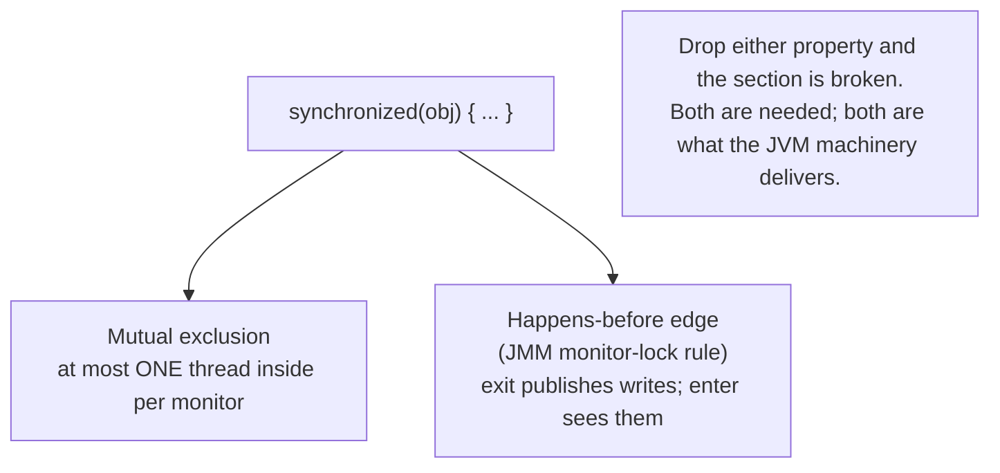
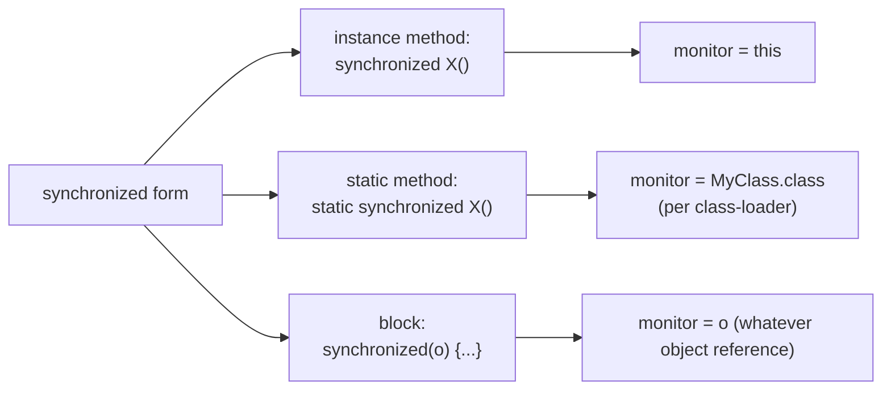
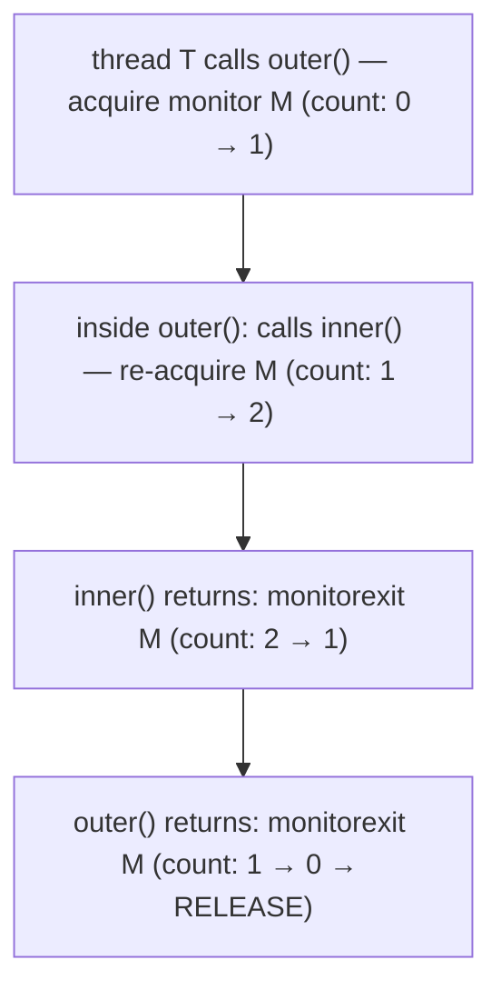
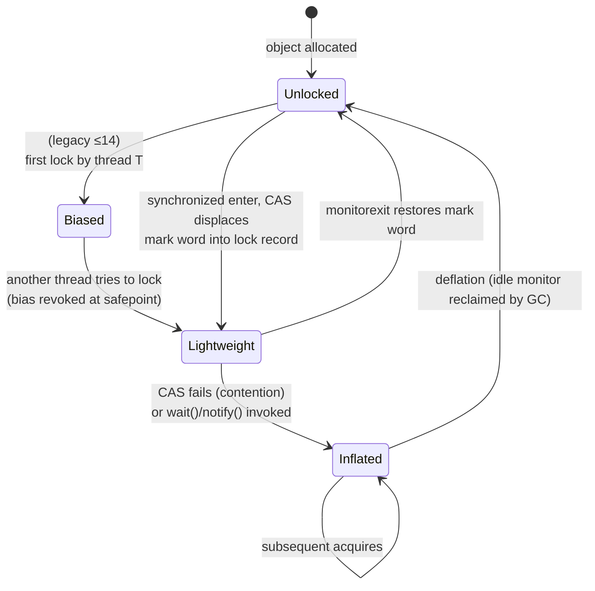
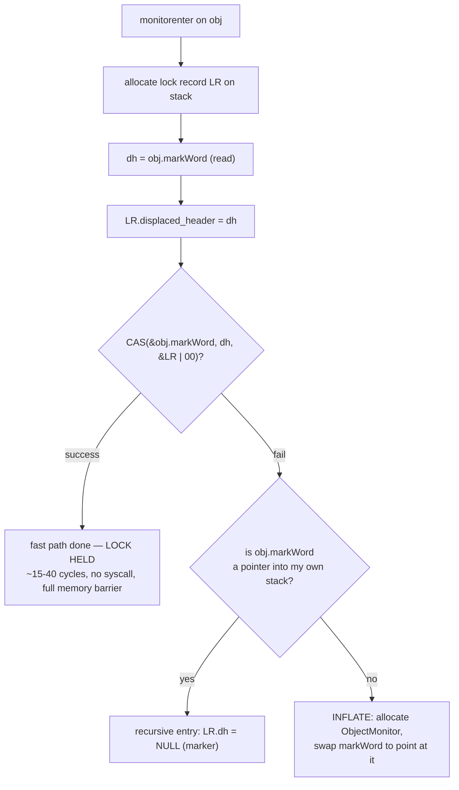
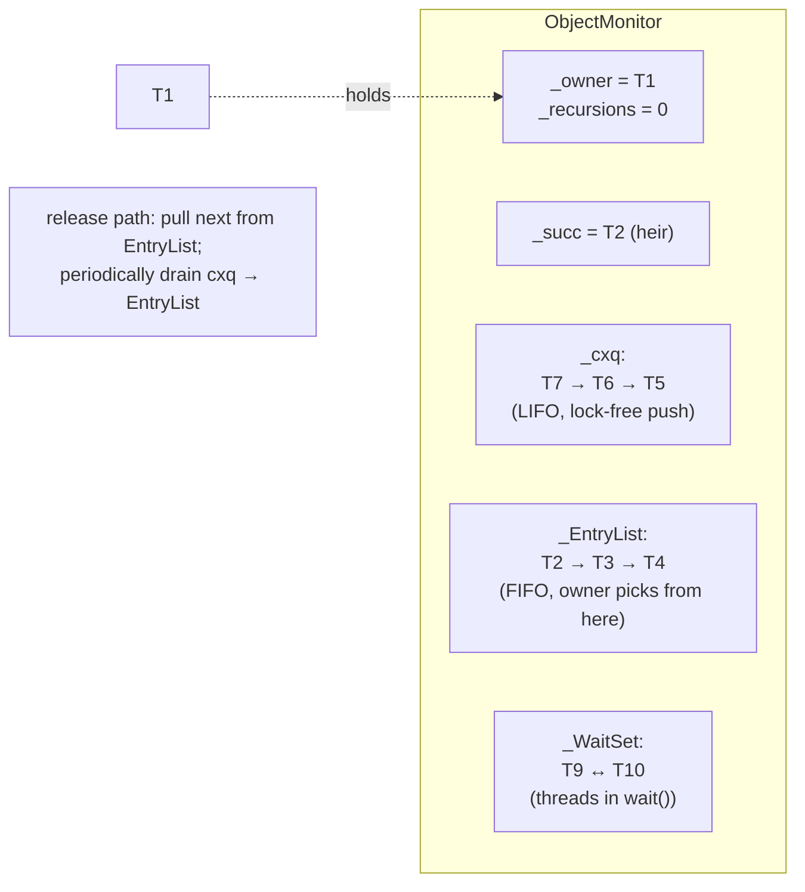
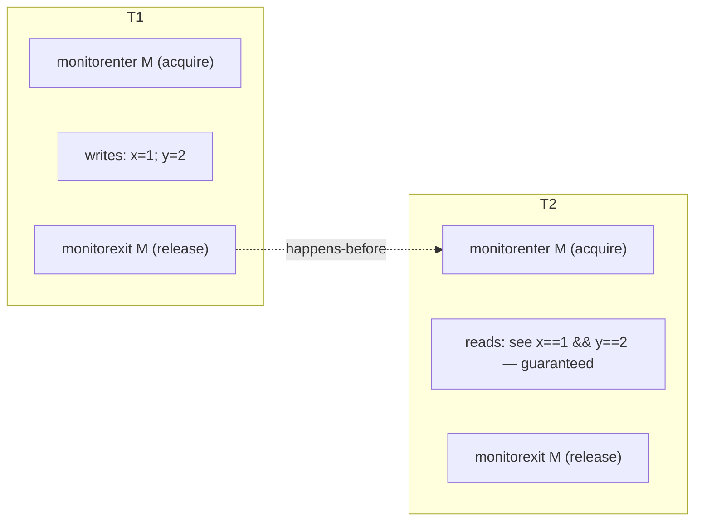
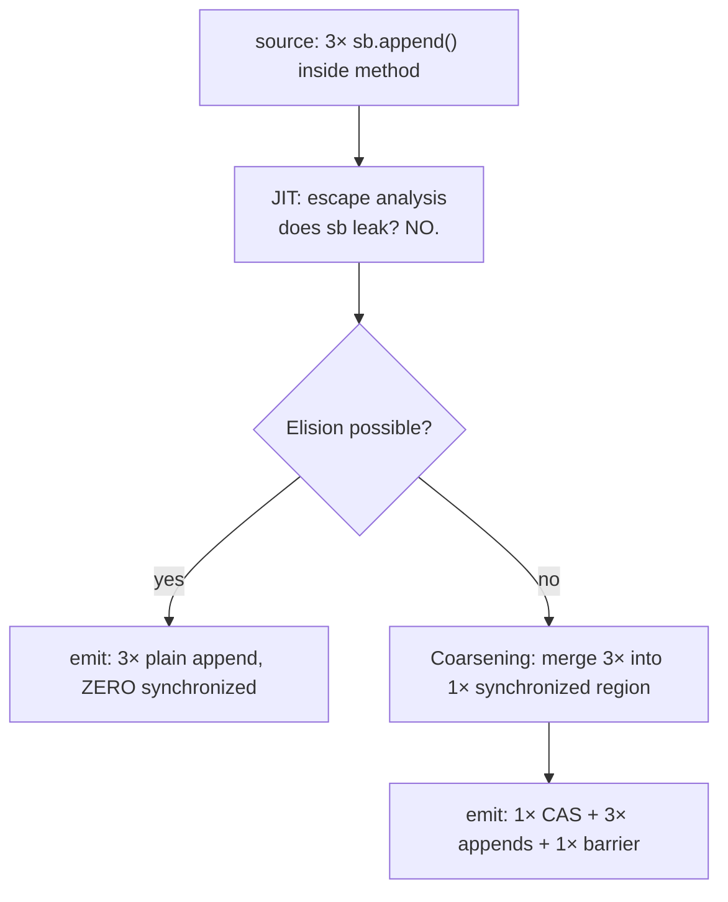
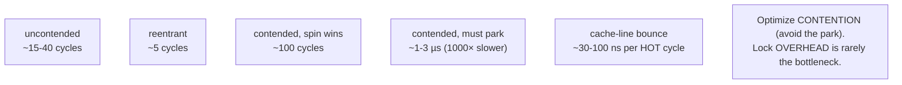
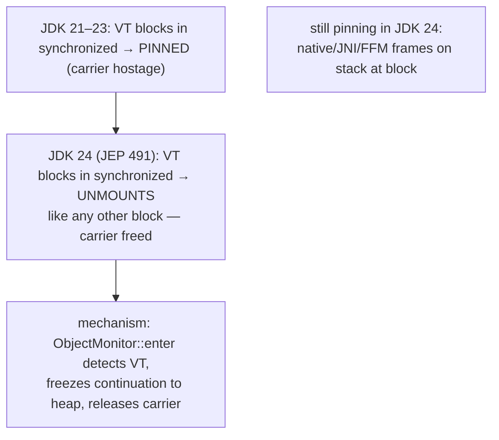

# synchronized, Monitors & Intrinsic Locks

`synchronized` is the oldest, simplest, and — until JDK 21 — most heavily optimized lock in Java. One keyword promises two things at once: *while one thread runs the code inside, no other thread runs it; and every effect that inside thread had is visible to whoever runs the section next.* **Mutual exclusion** and **memory visibility** — the two pillars of every shared-state concurrency primitive — and almost the entire history of Java concurrency is built on the machinery that delivers them.

The depth-bar requirement isn't "use `synchronized` and you'll be safe." At the **language** layer, `synchronized` takes one of three syntactic forms (instance method, static method, block), each implicitly choosing which **monitor** (a per-object lock) to acquire, and is lowered to bytecode as the `monitorenter`/`monitorexit` instruction pair (plus an `ACC_SYNCHRONIZED` method flag). At the **memory** layer, every Java object carries a **mark word** in its header whose lowest bits encode the object's *current lock state* — unlocked, lightweight-locked (mark word becomes a pointer into the locking thread's stack), inflated (mark word becomes a pointer to a heap-allocated `ObjectMonitor`), or marked-for-GC — and the JVM walks objects through a state machine of progressively heavier representations as contention rises. At the **architecture** layer, an uncontended acquire is a **single CAS** on the mark word (`LOCK CMPXCHG` on x86, an `LDXR`/`STXR` load-link/store-conditional pair on ARM64) costing a few tens of cycles, plus a **memory barrier** (`MFENCE` on x86, `DMB ISH` on ARM64) that supplies the **acquire/release** semantics every JMM happens-before edge ultimately rides on; a contended acquire **inflates** to a full `ObjectMonitor` whose blocked-thread queue is parked on a kernel **futex** — descheduling threads at micro-second cost rather than spinning on the memory bus. The JIT then performs two transformative optimizations on top — **lock coarsening** (merge adjacent locks on the same monitor) and **lock elision** (delete locks the escape-analysis pass proves are thread-local) — that make `synchronized` competitive with explicit `ReentrantLock` (T08) for the common case. We will cover all four layers down to the bit, the cycle, and the cache line.

> [!NOTE]
> Prerequisites: [Thread lifecycle & states](./T02-thread-lifecycle-and-states.md) (L3/C01/T02) — `BLOCKED`/`WAITING`, parking, futex, Parker; [Threads & Runnable](./T01-threads-and-runnable.md) (L3/C01/T01) — per-thread stacks, OS threads; [Source to bytecode to JVM to machine code](../../L0-foundations/C01-cs-foundations/T04-source-to-bytecode-to-jvm-to-machine-code.md) (L0/C01/T04) — JIT, bytecode; [How Computers Run Programs](../../L0-foundations/C01-cs-foundations/T01-how-computers-run-programs-cpu-memory-binary.md) (L0/C01/T01) — CAS, atomic instructions, cache lines; [Variable scope & lifetime](../../L0-foundations/C02-java-core/T15-variable-scope-and-lifetime.md) (L0/C02/T15) — stack frames, locals.

## What `synchronized` Guarantees — Two Properties, One Keyword

A region of code "synchronized on `obj`" promises **two** things:

1. **Mutual exclusion.** At most one thread at a time executes any region synchronized on the *same* monitor (the same object identity). Every other thread that tries enters `BLOCKED` (T02) and waits its turn.
2. **Visibility / happens-before.** When a thread *exits* a synchronized region, every write it performed inside is **published** to memory; when a thread *enters* the same monitor next, all those writes are **visible** before any code in its section observes shared state. This is the JMM's *monitor lock rule* — without it, no synchronized program could reason about shared data across threads.

Most other concurrency primitives in Java derive from these two: `volatile` gives you (2) without (1) (T12); `Atomic*` gives you (1) over a single word without blocking (T11); `ReentrantLock` (T08) gives you both with finer control (timed, interruptible, fair). `synchronized` is the baseline, and every other primitive is "what `synchronized` gives you, minus or plus X."



> [!IMPORTANT]
> A `synchronized` block protects the *monitor*, not "the variable." Two threads each entering `synchronized(a)` and `synchronized(b)` for two *different* objects `a` and `b` run **concurrently** — there is no exclusion between them. Mutual exclusion is per-monitor, and "which monitor" is decided at compile time by the keyword's syntactic form (next section). Choose your monitor object deliberately; sharing one across unrelated state coarsens contention, while protecting related state under separate monitors loses atomicity.

## The Three Syntactic Forms

`synchronized` appears in three places, and each implicitly chooses which object's monitor is acquired.

### 1. Synchronized instance method — monitor is `this`

```java
class Counter {
    private long count;
    public synchronized void inc() {     // monitor = this (the Counter instance)
        count++;
    }
}
```

Equivalent to `public void inc() { synchronized (this) { count++; } }` *for the application* — but **not** the same at the bytecode level (see [Bytecode](#bytecode--monitorenter-monitorexit-and-acc_synchronized) below: the method form uses `ACC_SYNCHRONIZED`, not `monitorenter`).

### 2. Synchronized `static` method — monitor is the `Class` object

```java
class Util {
    public static synchronized int next() {   // monitor = Util.class (the j.l.Class instance)
        ...
    }
}
```

The monitor is the unique `Class<Util>` instance. One per class loader; if `Util` is loaded by two class loaders, **two different monitors exist** — a famous footgun in app-server hot-redeploy scenarios.

### 3. Synchronized block — monitor is whatever object you pass

```java
private final Object lock = new Object();   // dedicated lock object
public void op() {
    synchronized (lock) {                   // monitor = lock
        // ...
    }
}
```

The block form gives you control of scope (you can lock a smaller region than a whole method) **and** of monitor identity (you can pick `this`, `Class`, a field, or a dedicated `private final Object`). Idiomatic modern code prefers a **dedicated private final lock object** so the monitor is encapsulated and can't be hijacked by external code (see Common Mistakes).



> [!WARNING]
> Synchronizing the *getter* of a field but not the setter (or vice-versa) loses both guarantees: there is no happens-before edge between an unsynchronized write and a synchronized read of the same field, so the read can see stale data, torn writes, or reordered effects. Either both accesses go through the same monitor or neither does — partial synchronization is a bug, not a smaller fix.

## Reentrancy — Why a Thread Can Lock Itself

`synchronized` is **reentrant**: a thread that already holds a monitor can enter another synchronized region on the *same* monitor and the acquire is recorded as a recursive entry, not a self-deadlock. The JVM tracks a per-monitor recursion count for the owner; each `monitorexit` decrements it, and only the final exit actually releases the monitor.

```java
synchronized void outer() {
    inner();                       // calls a synchronized method on the SAME object
}
synchronized void inner() { ... }  // re-acquires 'this' — fine, recursion count++
```

Without reentrancy, the most basic OO pattern — one synchronized method calling another on the same object — would deadlock. Mechanically, the JVM stores the recursion count in:

- The **lock record on the thread's stack** for lightweight (thin) locks — each recursive entry pushes another lock record with `displaced_header = NULL` as a "this is a re-entry" marker.
- The **`_recursions` field** on the `ObjectMonitor` for inflated locks (one integer, owner thread's identity in `_owner`).

A subtle consequence: reentrant acquires are **free** (no CAS, no barrier on inflated monitors — the owner check fast-paths). Recursive code with `synchronized` pays the lock cost only on the outermost call.



## The Object Header — Where the Lock Lives

Every Java heap object — *every* object, primitive arrays included — carries a fixed-size **header** before its instance fields. The header is the only place the JVM has to store per-object metadata: identity hash code, age (for GC), the pointer to the class metadata (the *klass pointer*), and — most importantly here — the **mark word** that encodes the object's current lock state.

```text
+----------------------------+-----------------------+-------------------+----------+
| MARK WORD (lock state etc) | KLASS POINTER (klass) | (array length)    | fields…  |
| 8 bytes (64-bit JVM)       | 4 or 8 bytes          | 4 bytes (arrays)  | ...      |
+----------------------------+-----------------------+-------------------+----------+
0                           8                       12 or 16            depends
```

On a HotSpot 64-bit JVM with compressed class pointers enabled (the default for heaps under ~4 GB), the header is **12 bytes** for a regular object and **16 bytes** for an array (4-byte array length + 4 bytes padding). With `-XX:-UseCompressedClassPointers` it's **16 bytes** for an object. On a 32-bit JVM it's 8 bytes for an object, 12 for an array. The klass pointer addresses the **klass metadata** (the C++ `Klass*` that holds the vtable, fields layout, supertypes — *not* the `Class` object) in Metaspace.

The mark word is **8 bytes** on a 64-bit JVM, **4 bytes** on a 32-bit JVM, and it's the part that changes constantly. It's a *union* — its bits mean different things in different states — and the **lowest two bits** are the discriminant the JVM reads first.

### Mark word layout — 64-bit JVM (pre-Lilliput)

```text
LOCK STATE        HIGH BITS                                                                      LOW BITS
                  ┌──────────────────────────────────────────────────────────────────────────────┐
unlocked (normal) │ unused:25 │ identity_hash:31 │ unused:1 │ age:4 │ biased:1 │ lock:01 │       │
                  ├──────────────────────────────────────────────────────────────────────────────┤
biased            │           thread_id:54           │ epoch:2  │ unused:1 │ age:4 │ 1 │ lock:01 │
                  ├──────────────────────────────────────────────────────────────────────────────┤
lightweight       │ ptr_to_lock_record_on_stack:62                                      │ lock:00│
                  ├──────────────────────────────────────────────────────────────────────────────┤
heavyweight       │ ptr_to_ObjectMonitor:62                                             │ lock:10│
                  ├──────────────────────────────────────────────────────────────────────────────┤
marked for GC     │ unused:62                                                           │ lock:11│
                  └──────────────────────────────────────────────────────────────────────────────┘
```

The **lowest 2 bits** discriminate:

| Bits | State | What the upper bits mean |
|:---:|--------|--------------------------|
| `01` | normal or biased | bit 2 is the *biased* flag; if set, upper bits = bias owner thread id |
| `00` | lightweight-locked | upper bits = pointer to the owner's stack-allocated lock record |
| `10` | heavyweight (inflated) | upper bits = pointer to a heap-allocated `ObjectMonitor` |
| `11` | marked for GC | a transient state used during marking phases |

### Mark word layout — 32-bit JVM

```text
unlocked    │ hash:25 │ age:4 │ biased:1 │ lock:01 │
biased      │ thread_id:23 │ epoch:2 │ age:4 │ 1 │ lock:01 │
lightweight │ ptr_to_lock_record:30                       │ lock:00 │
heavyweight │ ptr_to_ObjectMonitor:30                     │ lock:10 │
```

Two architectural points worth knowing cold:

- **Pointer alignment guarantees free low bits.** Heap objects and stack frames are 8-byte-aligned on 64-bit (16-byte for SIMD types), so any object pointer's bottom 3 bits are *always zero* — perfectly fine to overwrite with lock-state bits. This is why the mark word can pack a pointer into the same 64-bit slot as the tag.
- **The identity hash code is lazy.** It's not computed at allocation — it lives only after `Object.hashCode()` is first called, and it's stored *in the mark word*. Inflate to a heavyweight monitor before you take the hash and the identity-hash bits in the mark word are *gone* (overwritten by the monitor pointer); HotSpot copies the hash into the `ObjectMonitor` field `_hash`. Take the hash *first*, then inflate, and the JVM stashes it where it can recover it after inflation. This is the only reason `System.identityHashCode(o)` survives synchronization.

> [!NOTE]
> **Project Lilliput** (JEP 450, ongoing) shrinks the header from 12/16 bytes to **8 bytes** by interning klass pointers into a small index inside the mark word — saving ~10% heap on object-heavy workloads. With it, the mark word bit budget is even tighter, and lightweight locking gets *redesigned* (the displaced-header trick below is replaced by a per-thread "lock stack" that no longer needs to overwrite the mark word at all). The mark-word layouts above are HotSpot 17–23 standard; Lilliput is preview as of JDK 23.

## The Four Lock States — One State Machine

The mark word's lock bits plus the biased flag give the JVM **four** lock states, and `synchronized` walks objects through them as contention rises. The point of having states is *cost*: each state is cheaper than the next, and the JVM uses the cheapest one it can get away with.



Two transitions are worth zooming in on:

- **Biased → Lightweight (revocation)** is the painful one. Revocation requires a **safepoint** (T02) — every thread must reach a safe point so the JVM can walk the biased thread's stack and rewrite the mark word and any matching lock records. In a process with many short-lived threads, churn here is *measurable*; this is the root reason biased locking was disabled by default in JDK 15 and removed in JDK 18 (JEP 374, below).
- **Lightweight → Inflated** is the *contention* transition. Once a second thread sees the mark word's `00` bits and a CAS to take the lock fails, that thread allocates (or finds an idle, pooled) `ObjectMonitor`, copies the prior owner into it as `_owner`, swaps the mark word to point at the monitor (`...10`), then enqueues *itself* on the monitor's contention queue and parks. From then on the object is "inflated" — it pays the heavyweight cost on every acquire until deflated.

## Lightweight (Thin) Locking — A CAS on the Mark Word

Lightweight locking is the path the JVM takes on **uncontended** synchronized entry — the case that dominates real programs. Three things happen, in order:

1. The thread allocates a **lock record** on its own stack — a small structure (16 bytes on 64-bit) reserved inside the current Java frame.
2. The thread copies the object's current mark word into the lock record's `displaced_header` slot.
3. The thread issues an atomic **compare-and-swap** that swaps the object's mark word for a pointer to the lock record (low bits cleared to `00`). On success, the object is now lightweight-locked; on failure, another thread beat us to it and we fall through to either retry, recursion, or inflation.

```text
BEFORE                                       AFTER successful CAS
+------------------------+                   +---------------------------------+
| obj.markWord =         |  CAS(             | obj.markWord = ptr_to_LR | 00   |
|   header_unlocked (01) | expected=...01,   +---------------------------------+
+------------------------+ new=ptr|00)
                                                stack frame
                                              +------------------------+
                                              | LR.displaced_header =  |
                                              |   header_unlocked (01) | ← original mark word
                                              | LR.obj = obj           | ← back pointer
                                              +------------------------+
```

### The pseudo-code the JVM compiles to

The lightweight-acquire fast path, as the C1 / C2 JITs emit it for `monitorenter` on an unlocked object:

```cpp
LockRecord* lr = stack_alloc_lock_record();
markWord  dh = obj->mark();                       // load current mark word
lr->set_displaced_header(dh);

if (CAS(&obj->mark_word, dh, encode_lock_record_ptr(lr))) {
    // SUCCESS — lightweight lock held. ZERO syscalls, ZERO blocking. Done.
} else if (dh.is_neutral() &&
           current_stack_contains(obj->mark())) {
    // The mark word ALREADY points into MY stack — reentrant. Push a "marker" LR.
    lr->set_displaced_header(nullptr);            // null = "this is a recursive entry"
} else {
    // Either another thread holds it (lightweight by them, or inflated),
    // OR a biased revocation race happened. Inflate to a heavyweight monitor.
    inflate_and_enqueue(obj);                     // slow path
}
```

The release path mirrors:

```cpp
markWord dh = lr->displaced_header();
if (dh == nullptr) {
    // recursive exit — just pop the marker LR
} else if (CAS(&obj->mark_word, encode_lock_record_ptr(lr), dh)) {
    // SUCCESS — restored the original mark word. Lock released.
} else {
    // CAS failed → the monitor was inflated while we held it (a contender
    // who failed CAS in their acquire went and inflated). Release via the
    // ObjectMonitor.
    ObjectMonitor* m = obj->mark()->monitor();
    m->exit(thread);
}
```

> [!IMPORTANT]
> The displaced-header trick is what makes the **fast path one instruction** (a CAS) in the uncontended case. The original mark word — which encodes hash, age, biased state — is preserved on the stack and restored on release; the object header temporarily becomes a pointer the GC and JVMTI know to dereference back through the lock record when they need to read those fields during a safepoint walk. This is also why lightweight locking is **stack-coupled**: the lock record *must* live in the locking thread's stack frame, so unwinding (return, exception) makes lock leakage impossible.

### What "the CAS" actually compiles to

On x86-64 the CAS is one instruction with the `LOCK` prefix:

```asm
; rdi = &obj->mark_word, rax = expected (old mark word), rcx = new (lock record ptr)
lock cmpxchg [rdi], rcx     ; atomically: if [rdi]==rax then [rdi]=rcx, ZF=1
                            ; else rax=[rdi], ZF=0
```

`LOCK CMPXCHG` is the linchpin. The `LOCK` prefix tells the CPU to *exclusive-own* the cache line for the duration of the instruction (the modern equivalent — on every CPU since the Pentium 4 — is asserting MESI exclusivity in the cache coherence protocol rather than literally locking the system bus, but the semantics are the same). The instruction is **atomic** (no other core observes a torn intermediate state) and serves as a **full memory barrier** (LFENCE+SFENCE+MFENCE rolled in) — so the CAS *also* gives the acquire/release semantics the JMM demands for monitor enter/exit.

On ARM64, x86's "one instruction does it all" is impossible — ARM is a **weakly-ordered** load-store architecture and uses the **load-link / store-conditional** pattern:

```asm
; x0 = &obj->mark_word, x1 = expected, x2 = new
retry:
   ldaxr   x3, [x0]         ; load-acquire-exclusive: read mark word, ARM-track exclusive monitor
   cmp     x3, x1
   b.ne    fail              ; expected mismatch — no swap
   stlxr   w4, x2, [x0]      ; store-release-exclusive: write IFF nobody touched the cache line
   cbnz    w4, retry         ; w4 != 0 means "someone else won" — retry from the LDAXR
   ; success — also gives release-acquire semantics via the LDAR/STLR halves
```

`LDXR`/`STXR` is the ISA's exclusive-monitor pair: between an `LDXR` and its matching `STXR`, if any other core writes to the same cache line, the `STXR` fails (`w4 = 1`) and the code retries. The acquire-load (`LDAXR`) and release-store (`STLXR`) variants additionally embed the *acquire* and *release* memory barriers — exactly the JMM-required ordering. Compare-and-swap is therefore an **LL/SC retry loop**, not a single instruction, on ARM — but ARMv8.1's `CAS`/`CASA`/`CASAL` family gives single-instruction CAS where present (the JIT picks it under `-XX:+UseLSE`).

The architectural punchline: a single uncontended `synchronized` enter costs **one CAS + zero syscalls** — about 15–40 cycles (~5–15 ns) on a modern core, including the implicit memory barrier. This is why uncontended `synchronized` is *not* a performance problem in practice.



## Heavyweight (Inflated) Locking — the `ObjectMonitor`

Once contention is observed (a CAS fails, or `wait()`/`notify()` is called, which always inflates), the JVM allocates a full **`ObjectMonitor`** — a C++ struct in HotSpot — and points the object's mark word at it (low bits `10`). Every subsequent acquire on this object goes through the monitor, paying its richer cost. The cost buys correctness: the monitor has a queue of waiting threads, supports `wait()`/`notify()` cleanly, integrates with the **futex** (T02) for OS-level descheduling instead of spinning, and is *the* place where `BLOCKED` threads (T02) actually reside.

### The `ObjectMonitor` C++ struct (HotSpot 17+)

The fields you must know — heavily abridged but the names match the source (`hotspot/share/runtime/objectMonitor.hpp`):

```cpp
class ObjectMonitor {
private:
  // --- ownership ---
  void*           _owner;          // CAS target: thread that holds the lock
                                   // (may be a thread pointer, a stack address, or null/DEFLATER_MARKER)
  intx            _recursions;     // re-entry count for _owner (0 = first entry)
  oop             _object;          // back-pointer to the Java object this monitor protects

  // --- contention queues ---
  ObjectWaiter*   _cxq;             // LOCK-FREE LIFO contention queue: new arrivals push here
  ObjectWaiter*   _EntryList;       // FIFO list of BLOCKED threads ready to be woken next
  ObjectWaiter*   _WaitSet;          // doubly-linked list of threads in Object.wait()

  // --- bookkeeping ---
  Thread*         _succ;             // "heir presumptive" — chosen successor to avoid
                                     // thundering-herd wakeups
  intx            _SpinDuration;     // adaptive-spin tuning per monitor
  int             _waiters;          // count of WaitSet threads (for jvmstat / dumps)
  int             _contentions;      // count of EntryList + cxq (for jvmstat / dumps)
  intx            _previous_owner_tid; // identity of last owner — used by adaptive spin
  jint            _hash;             // saved identityHashCode (lost from mark word)
};
```

`ObjectWaiter` is a small node (one per waiting thread) that carries a `Thread*` and the doubly-linked-list pointers. Each waiting Java thread parks (T02) inside its own `ObjectWaiter`, and the monitor's three queues are simply different linked-lists of these nodes.

### The three queues and why there are three, not one



The **`_cxq`** is a **lock-free LIFO stack**: a newly arriving thread that needs to block CAS-pushes itself onto `_cxq` (just one CAS, no monitor lock needed — that's why it's lock-free). LIFO not FIFO because CAS push at the head is the cheapest operation; the monitor doesn't try to enforce queue ordering at this stage.

The **`_EntryList`** is a **FIFO list** that the current owner *drains* `_cxq` into when releasing. The owner takes `_cxq` (one CAS to swap it to NULL), reverses its order, and prepends to `_EntryList`. The next thread to wake is taken from the head of `_EntryList`.

The **`_WaitSet`** holds threads that called `Object.wait()` — they've **released** the monitor (`_recursions` saved, then `_owner = nullptr`) and are parked. `notify()` removes one (and re-enqueues it on `_EntryList` so it can re-contend); `notifyAll()` moves all of them.

Why split contention into `_cxq` (lock-free arrivals) and `_EntryList` (the actual ready queue)? Because the owner is the only thread that touches `_EntryList` during normal operation — *no lock is needed* on it — while *many* contending threads must push without blocking. Splitting the two paths lets HotSpot have a fast lock-free arrival path and a single-writer ordering path, optimal for both sides.

### The acquire path on an inflated monitor

```cpp
// ObjectMonitor::enter — simplified
Thread* self = current_thread();
if (CAS(&_owner, nullptr, self) == nullptr) {
    return;                       // FAST: monitor was free, we took it. ~one CAS.
}
if (_owner == self) {
    _recursions++;                 // reentrant — no CAS, no barrier needed
    return;
}
// CONTENDED PATH
adapt_spin_briefly();              // ~50–200 cycles of CAS spin; quits on backoff
if (CAS(&_owner, nullptr, self) == nullptr) return;   // spin succeeded
ObjectWaiter w(self);              // build my queue node
push_to_cxq(&w);                   // ONE CAS — lock-free push
while (true) {
    if (CAS(&_owner, nullptr, self) == nullptr) { unlink_and_return; }
    self->park();                  // → Linux futex → OS deschedules me → 0% CPU
                                   // (T02 — Parker; thread state becomes BLOCKED)
    // re-check on wake; spurious wakeups possible
}
```

The release path is `_owner = nullptr; barrier; pick_successor()`. Picking is the subtle part: HotSpot uses `_succ` as a "heir presumptive" so that on release it usually unparks **exactly one** thread (the heir), not the whole `_EntryList`. This avoids the **thundering herd** where unparking all waiters has them all wake, contend for `_owner`, and most lose the CAS, parking again. The heir-presumptive optimization keeps `synchronized` competitive with explicit locks on contended workloads.

### Inflation cost and deflation

Allocating an `ObjectMonitor` is not free: ~200 bytes per monitor, plus the cache-line ping-pong between contending cores. Worse, *historically* monitors were never reclaimed — a one-off contended `synchronized` would pin an `ObjectMonitor` for the object's GC lifetime. JDK 16 (JEP 380 — async monitor deflation) made this *concurrent and routine*: an idle monitor (uncontended for a while) is **deflated** back into a normal lightweight/unlocked state, the mark word restored, the monitor returned to a free list. As of JDK 17+, monitor pressure is normally invisible.

> [!NOTE]
> An inflated lock survives until either it's deflated or the object is GC'd. You can watch the population with `-Xlog:monitorinflation,async+monitor*` (or `jcmd <pid> Thread.print` includes monitor counts via JMX). On a healthy modern JVM the inflated population should be small and bounded — a steadily rising count is usually a sign of a hot-contended lock that's being repeatedly inflated faster than deflation runs.

## Biased Locking — Why It Existed, Why It's Gone

Through JDK 14, the JVM had a **fourth** state below lightweight: **biased**. The idea was that *most monitors are only ever acquired by one thread*, so on the *first* acquire the JVM would atomically write that thread's ID into the mark word (one CAS), and on every subsequent acquire by the *same thread* it would do a *plain read* — no CAS, no barrier, basically free. The data: biased acquires were ~3× faster than lightweight acquires for uncontested locks owned by their original thread.

The problem was **revocation**. If a *second* thread ever touched the lock, the JVM had to:

1. **Stop the original biased thread at a safepoint** (T02 — all threads to safe ground).
2. Walk that thread's stack to find all live lock records.
3. Rewrite the mark word to lightweight or unlocked.
4. Resume.

Revocation cost was *unbounded* — a thread deep in a long compute loop without a safepoint poll could delay everyone for *milliseconds*. The economics were:

- **Worth it in 2005** — single-threaded micro-benchmarks dominated; `Vector`, `Hashtable`, and `StringBuffer` were everywhere and synchronized despite being thread-local; thread-pool patterns hadn't taken over yet.
- **Net negative by 2020** — modern code uses `ConcurrentHashMap`, `StringBuilder`, escape-analysis-driven lock elision, and short-lived worker threads (the safepoint cost of revocation hits *every* worker spawn). On many real workloads, biased locking was a *slowdown*.

**JEP 374 (JDK 15)** disabled biased locking by default; **JDK 18** removed the implementation entirely. As of JDK 18+ a synchronized acquire is *always* a CAS (lightweight). The mark word still has the `biased` bit defined for layout compatibility, but it's never set.

> [!INTERVIEW]
> The right answer to "what's biased locking?" in a 2026 interview is: "Removed in JDK 18 (JEP 374). It was a fast path for monitors only ever touched by one thread, skipping the CAS — but the safepoint cost of revoking the bias when a second thread arrived stopped paying for itself once heavy use of thread pools and `j.u.c.` collections shifted workloads. The synchronization fast path is now always a CAS on the mark word."

## JMM Guarantees — Acquire / Release and Happens-Before

The **Java Memory Model** (T12 covers it in full) specifies what writes one thread is guaranteed to see from another. `synchronized` contributes the *monitor lock rule*:

> An `unlock` on monitor M *happens-before* every subsequent `lock` on the same monitor M.

Mechanically, this is built from two halves the JVM emits at every monitor enter and exit:

- **Acquire semantics on `monitorenter`** — no load or store *after* the enter can be reordered *before* it. In other words, no read inside the critical section can be hoisted out above the lock acquisition. Implemented as a one-way *acquire fence*.
- **Release semantics on `monitorexit`** — no load or store *before* the exit can be reordered *after* it. No write inside can be sunk below the unlock. Implemented as a one-way *release fence*.

Stitched together: every store inside thread T1's `synchronized(M) { ... }` is *visible* to thread T2 inside its own *subsequent* `synchronized(M) { ... }` block — there's a happens-before edge across the release/acquire pair on the same monitor.



The release-acquire pair is the **only** JMM mechanism by which one thread reliably observes another's writes (the others — `volatile`, `final` initialization, thread `start`/`join`, `Atomic*` — all reduce to the same release-acquire shape). This is why `synchronized` is the foundational primitive: it's the *only* one that gives both exclusion and happens-before in one keyword.

### What the hardware actually does

The fences are real CPU instructions on weakly-ordered architectures:

| Arch | Acquire | Release | Full barrier |
|------|---------|---------|--------------|
| **x86 / x86-64** | implicit on every load (TSO model) | implicit on every store | `MFENCE`, or any `LOCK`-prefixed RMW (which `LOCK CMPXCHG` is) |
| **ARM64** | `LDAR` (load-acquire) / `DMB ISHLD` | `STLR` (store-release) / `DMB ISHST` | `DMB ISH` |
| **PowerPC** | `lwsync` (acquire half) | `lwsync` (release half) | `sync` |

x86 is the lenient case: it has the **Total Store Order (TSO)** memory model, where acquire/release semantics are *already implied* by ordinary loads and stores (the only reordering hardware does is *store-to-load forwarding*, and a `LOCK`-prefixed instruction blocks even that). On x86, a `LOCK CMPXCHG` on the mark word *is* the entire fence — no separate `MFENCE` needed.

ARM (and POWER) are *weakly ordered* — by default the CPU reorders almost everything. The JIT must emit `DMB ISH` (data memory barrier, inner shareable domain) at every monitor exit, or use the `LDAR`/`STLR` instructions which embed the half-barrier. These extra instructions are the *cost of weak memory* and are *the* reason ARM concurrency code is fractionally slower than x86 even on architecturally similar workloads.

> [!IMPORTANT]
> Visibility *requires* the same monitor on both sides. If T1 writes inside `synchronized(A)` and T2 reads inside `synchronized(B)`, **no happens-before edge exists** — T2 may see stale data. Two threads must lock the *same* monitor for the JMM rule to fire. This is a real source of bugs when refactors split one lock into two with the intent of "smaller critical sections" but lose the publication path between them.

## Bytecode — `monitorenter`, `monitorexit`, and `ACC_SYNCHRONIZED`

`synchronized` compiles to two different forms depending on whether it's a method-level or block-level.

### Synchronized block — `monitorenter` / `monitorexit` instruction pair

```java
void op() {
    synchronized (lock) {
        doWork();
    }
}
```

```
0: aload_0                  // load 'this'
1: getfield  lock
4: dup                       // duplicate reference (one for monitorenter, one for monitorexit)
5: astore_1                  // store the locked object in slot 1 (so we can release later)
6: monitorenter              // ← enter monitor on top-of-stack
7: aload_0
8: invokevirtual doWork
11: aload_1                  // re-load the locked object reference
12: monitorexit              // ← normal exit
13: goto 21
16: astore_2                 // EXCEPTION HANDLER: catch any throwable
17: aload_1
18: monitorexit              // ← release on exception path
19: aload_2
20: athrow                   // re-throw
21: return

Exception table:
  from   to   target   type
    7    13     16     any   ← if anything between monitorenter and monitorexit throws,
                              ←   jump to the cleanup that releases the monitor
```

Two non-obvious details:

1. **The compiler emits a second `monitorexit` in an exception handler.** Without it, an exception thrown inside the block would skip the normal exit, leaking the lock forever. The exception table (`from..to → target type=any`) guarantees that *any* throwable between the enter and the exit triggers the release-then-rethrow handler. Forgetting this is impossible because `javac` generates it — but it's *why* `try { ... } finally { unlock(); }` is the correct manual idiom with `ReentrantLock` (T08).
2. **The object reference is `dup`-ed and stashed in a local.** The JVM doesn't try to find "which object we entered on" from the stack — it just holds it in a local slot so the exit path can grab it cleanly.

### Synchronized method — `ACC_SYNCHRONIZED` flag

```java
synchronized void op() { doWork(); }
```

```
public synchronized void op();
  descriptor: ()V
  flags: ACC_PUBLIC, ACC_SYNCHRONIZED        ← method flag, NOT an instruction
  Code:
    0: aload_0
    1: invokevirtual doWork
    4: return
```

The bytecode has *no* `monitorenter`/`monitorexit`. Instead the `ACC_SYNCHRONIZED` flag on the method's access modifiers tells the *JVM* — not the bytecode interpreter — to acquire the monitor at method entry and release it at method exit (normal or exceptional). The JIT lowers this to the same machine code as the block form, but the source-of-truth lives in the method descriptor.

**Why two forms?** Historical: `ACC_SYNCHRONIZED` exists because in the original JVM there was no exception table for methods, so a method-wide monitor release had to be guaranteed by the VM, not by emitted code. The block form came with explicit exception tables. Functionally equivalent today — but a `javap` reader can tell the two apart at a glance, which matters for compatibility tools (Quarkus, GraalVM, instrumenting agents) that recognize one but not the other.

> [!TIP]
> `javap -c -p YourClass.class` shows both forms readably. `javap -v` adds the access flags so you can see `ACC_SYNCHRONIZED` on method-form locks. Bytecode reading is the fastest path to settling "is this *actually* synchronized?" arguments — a `@Synchronized` annotation, a Lombok plugin, or an aspect could either add or fail to add the bytecode, and only the disassembled class tells you the truth.

## JIT Optimizations — Coarsening and Elision

The interpreter executes `monitorenter`/`monitorexit` as a CAS+barrier on every entry. The JIT (C1 and C2) does dramatically better via two transformations.

### Lock coarsening

If the JIT sees several adjacent synchronized blocks on the **same monitor** with little between them, it **merges** them into one. The classic case:

```java
StringBuffer sb = new StringBuffer();   // StringBuffer is internally synchronized
sb.append("a");
sb.append("b");
sb.append("c");
```

A naïve translation enters and exits the `sb`'s monitor *three times* (three CAS pairs, three barriers, three potential inflation paths). Coarsening rewrites it as:

```java
synchronized (sb) {
    sb.append_unlocked("a");
    sb.append_unlocked("b");
    sb.append_unlocked("c");
}
```

One CAS pair, one barrier, the same correctness (only this thread held the lock anyway). Enabled by default; controlled by `-XX:+EliminateLocks` / `-XX:+UseLocksCoarsening`. You'll see it most aggressively when the JIT inlines synchronized methods and reasons across the inlined boundaries.

### Lock elision via escape analysis

If the JIT proves the lock object **does not escape the method** — no other thread can ever reach a reference to it — then it can *remove the locks entirely*. The object is provably thread-local, so its monitor can never be contended, so the CAS and barrier are pure overhead. Example:

```java
String build(List<String> parts) {
    StringBuffer sb = new StringBuffer();   // sb is local — references never escape
    for (var p : parts) sb.append(p);
    return sb.toString();
}
```

Under escape analysis (`-XX:+DoEscapeAnalysis`, default on) C2 proves `sb` is method-local. Lock elision (`-XX:+EliminateLocks`, default on) then removes every `synchronized` inside `sb`'s methods *for this call site*. The compiled output performs no synchronization at all — it is bit-for-bit identical to the `StringBuilder` equivalent, because the compiler proved the synchronization couldn't matter.

This is the answer to "isn't `StringBuffer` slow because it's synchronized?" — historically yes, today **only if it escapes the method**. The JIT elides locks on thread-local synchronized objects so well that the runtime cost is near-zero. The reason to still prefer `StringBuilder` is API hygiene (no false promise of thread-safety to readers), not measured performance on modern JVMs.



Two flags worth knowing:

- `-XX:+PrintEliminateLocks` — log every lock the JIT elided (very verbose; use on a small reproducer).
- `-XX:-DoEscapeAnalysis` — disable escape analysis; useful to *measure* the difference (run the same benchmark with and without and watch the synchronized version slow down to lock-record-on-stack speeds).

> [!INTERVIEW]
> The reason `synchronized` is "as fast as `ReentrantLock`" in microbenchmarks isn't the lock implementation — it's elision and coarsening. The JIT can be *more aggressive* with `synchronized` because it understands the keyword's exact semantics, while `ReentrantLock` is a regular API call the optimizer treats more conservatively. JEP 491 (below) widens this gap further by also unblocking virtual threads on `synchronized`.

## Performance — The Real Numbers

A rough ladder of cost, on a modern x86-64 server core (2024 — Skylake or newer; ARM is similar):

| Scenario | Approx. cost | Notes |
|----------|------------:|-------|
| Lock elided (JIT, thread-local object) | **0 cycles** | nothing emitted |
| Lock coarsened (multiple to one) | amortized to one CAS | divided across coalesced blocks |
| Uncontended lightweight acquire + release | **15–40 cycles** (~5–15 ns) | one `LOCK CMPXCHG` + barrier × 2 |
| Reentrant acquire (already owner) | **~5 cycles** | check `_owner`, bump `_recursions` |
| Contended acquire — spin succeeds | **~100 cycles** | adaptive spin in `ObjectMonitor::enter` |
| Contended acquire — must park | **1–3 µs** | futex syscall + context switch (T02) |
| Inflation (first contention) | **~1 µs** + monitor allocation | ObjectMonitor allocation + mark word swap |
| Cross-core cache-line bounce (HOT contention) | **30–100 ns** *per bounce* | MESI invalidate-acquire on the mark word's cache line |

The implication: **the only acquire that matters for latency is the contended-and-must-park one**, because it costs orders of magnitude more than the others. Everything else is fast enough that the cost of the *body* of the synchronized region dwarfs the lock cost. Optimizing for `synchronized` overhead in code where the section runs for microseconds is almost always pointless; optimizing for *contention* (reducing the number of threads that block) is the actually-impactful move.



### False sharing — when the mark word itself becomes a hot cache line

Here's a non-obvious one. Suppose two threads each have their own thread-local `Counter`, never contend, but the two `Counter`s happen to be allocated adjacent in memory — their mark words share an L1 cache line (64 bytes). Then every CAS on one's mark word **invalidates the line on the other CPU**, costing the other thread a cache miss next access. The two threads are *conceptually* uncontended but *hardware*-contended on the same cache line — **false sharing**.

The mitigation: padding (`@Contended` annotation, JDK 8+, requires `-XX:-RestrictContended` or it's only for `j.u.c.` internals) inflates the object so its mark word lives in its own cache line. Most application code never needs this — `@Contended` is a tool for last-mile lock-free data-structure tuning (T11 `Atomic*`). But it's the explanation for occasional benchmark results where "uncontended" `synchronized` runs slower than expected on multi-core machines.

## `wait` / `notify` — The Monitor's Built-in Condition Variable

The monitor exposes a *condition variable* via three methods on `Object`: `wait()`, `notify()`, `notifyAll()`. The complete protocol is T04's topic; this is just the placement.

- These methods may only be called by a thread that **holds the monitor** — they throw `IllegalMonitorStateException` otherwise.
- `wait()` atomically **releases** the monitor and parks the thread on the monitor's `_WaitSet` (T02 — `WAITING` state).
- `notify()` moves one arbitrary `_WaitSet` thread into the `_EntryList` so it can re-acquire; `notifyAll()` moves all of them.
- The woken thread is `BLOCKED` (re-acquiring), then `RUNNABLE` once it has the monitor back, and **then** returns from `wait()`. The whole release-park-reacquire sequence is the *atomic step* that makes condition signalling correct.

Two consequences worth flagging now and revisiting in T04:

1. **A bare `monitorenter` never throws `IllegalMonitorStateException`.** That exception is *only* about `wait`/`notify` — they require the caller already hold the monitor on the *same* object they're called on. A common bug is `obj.wait()` outside a `synchronized(obj)` block.
2. **`wait()` always inflates the monitor.** The `_WaitSet` lives only on `ObjectMonitor`, so any monitor that's ever been waited on is permanently (until deflation) heavyweight. This is one reason microbenchmarks of "synchronized methods that wait" are slower than "synchronized methods that don't" — they take the inflated path.

## Virtual Threads & `synchronized` — Pinning and JEP 491

`synchronized` and virtual threads (T14) have a difficult history. In JDK 21 (initial Loom release), a virtual thread that **entered a `synchronized` block and then blocked** — typically on the lock itself, or on a `wait()`/I/O inside — could not **unmount** from its carrier platform thread. The carrier was pinned, holding an OS thread hostage until the virtual thread woke. With millions of virtual threads, even a few pinned carriers could starve the scheduler.

The recommended workaround in JDK 21–23 was "swap `synchronized` to `ReentrantLock` on hot blocking paths" — because `ReentrantLock` uses `LockSupport.park` (T02), which the Loom runtime intercepts to unmount the virtual thread cleanly. This advice produced churn in libraries (the JDK itself, Netty, Tomcat, etc.) for two years.

**JEP 491 (JDK 24)** reworked the HotSpot monitor implementation so a virtual thread blocked in `synchronized` *unmounts* like any other block. The mechanism: the inflated `ObjectMonitor::enter` now detects a virtual-thread caller, freezes its continuation onto the heap (just like `LockSupport.park`), releases the carrier, and resubmits to the scheduler on wake. The mark word's `10` bit (heavyweight) and the inflation path didn't change — just the C++ enter loop got virtual-thread aware.

The pinning causes that **remain** in JDK 24:

- **Native frames on the stack at the point of block** (JNI, FFM `Linker` downcalls): the JVM can't safely freeze a native frame, so a virtual thread with one on its stack at park time is pinned.
- **`Object.wait()` inside `synchronized`** through JDK 23; JDK 24 also fixed `wait`.
- **Class initialization (`<clinit>`)**: the JVM holds an initialization lock during static initializers, which currently pins.

Observe pinning via the **JFR event `jdk.VirtualThreadPinned`** (the `-Djdk.tracePinnedThreads` flag was removed in JDK 24). The event carries a stack trace and the reason. A few `jdk.VirtualThreadPinned` per second is benign; a flood is a real bug to fix.



> [!IMPORTANT]
> Carry exactly this answer into a senior interview: "JDK 21 pinned virtual threads on `synchronized`, so the standard advice was `ReentrantLock` on hot paths. JEP 491 (JDK 24) fixed it — `synchronized` now unmounts cleanly, and the remaining pinning causes are native frames and class init. Production code on JDK 24+ should treat `synchronized` and `ReentrantLock` as performance-equivalent for virtual-thread fitness."

## Common Mistakes

### Synchronizing on shared / cached objects

```java
synchronized (Integer.valueOf(1)) { ... }     // ✗ Integer cache: same instance for all -128..127
synchronized ("KEY") { ... }                   // ✗ String literal: interned; shared globally
synchronized (Boolean.TRUE) { ... }            // ✗ singleton shared by entire JVM
```

The literal `1` always boxes to the *same* cached `Integer`. The string `"KEY"` is interned — every class that uses `"KEY"` shares one `String` object. Every `synchronized` block on these shares a monitor *with every other library, framework, and bug* in your address space — including third-party code that might happen to lock the same global object. Catastrophic accidental contention, occasionally deadlock. **Always lock a dedicated `private final Object lock = new Object();`** or a non-shared instance.

### Synchronizing on `this` in public classes

```java
public class Service {
    public synchronized void op() { ... }   // monitor = this — caller can see/lock this too
}

// in unrelated code:
synchronized (service) { ... }              // takes the SAME monitor as Service.op() — surprise!
```

External callers can lock on your instance, contending with — or accidentally deadlocking against — your internal `synchronized` methods. Defensive style is a **private final lock object** that's not exposed via any getter:

```java
private final Object lock = new Object();   // encapsulated monitor
public void op() { synchronized (lock) { ... } }
```

### Synchronizing on a *changing* reference

```java
private Object lock = new Object();
public void op() {
    synchronized (lock) { ... }             // ✗ if lock is ever reassigned, threads sync on DIFFERENT objects
}
public void reset() { lock = new Object(); } // ← causes the bug
```

Mutual exclusion is per-monitor identity. If `lock` is reassigned mid-flight, two threads can each be inside `op()` synchronized on different objects — *no mutual exclusion at all*. The lock field must be **`final`** so this can't happen.

### Holding the lock during I/O or callbacks

```java
synchronized (lock) {
    long bytes = socket.read(buf);           // ✗ holds the monitor through a multi-second I/O wait
}
```

Every other thread is `BLOCKED` for the duration of the network read. The right pattern is to do the I/O *outside* the synchronized region and re-enter only to commit the result (T16 — pitfalls). The shorter the time the monitor is held, the lower the contention curve.

### Synchronizing the wrong half

Synchronizing the writer but reading without a lock — or vice-versa — destroys both guarantees (no mutual exclusion *between* the unsynchronized accesses, and no happens-before across them). Either both sides synchronize on the same monitor or neither does.

### Synchronized collections used unsynchronized for iteration

```java
List<X> list = Collections.synchronizedList(new ArrayList<>());
for (X x : list) { ... }     // ✗ iterator is NOT guarded — concurrent modification → CME or invisible torn read
```

`Collections.synchronizedList` synchronizes the *individual methods* (add/get/remove), not iteration. You must do the iteration `synchronized(list) { for (X x : list) ... }` yourself, or switch to a `CopyOnWriteArrayList` / `ConcurrentHashMap`.

### Self-deadlock via two different monitors held in different orders

```java
synchronized (a) { synchronized (b) { ... } }   // thread T1
synchronized (b) { synchronized (a) { ... } }   // thread T2 — opposite order → classic deadlock
```

If T1 holds `a` and waits for `b`, while T2 holds `b` and waits for `a`, the cycle is permanent. Full discussion in T16; the takeaway here is *always acquire multiple monitors in a canonical, globally agreed order*.

### Calling `wait` without holding the monitor

```java
obj.wait();                                  // ✗ outside synchronized(obj) → IllegalMonitorStateException
```

`wait`/`notify` require the caller hold *the receiver's* monitor. The right shape is always `synchronized (obj) { while (!cond) obj.wait(); }` (T04).

### Confusing the static-method monitor with an instance one

```java
class C {
    public synchronized void foo() { ... }                 // monitor = this
    public static synchronized void bar() { ... }          // monitor = C.class — DIFFERENT
}
```

A thread inside `foo()` and a thread inside `bar()` **do not exclude each other** — they hold *different* monitors. Mixing instance and static synchronization on what looks like "the same class" is a real bug pattern.

## Observing It Live

### Read the bytecode

```bash
javap -c -p -v MyClass.class | less       # shows monitorenter/monitorexit + ACC_SYNCHRONIZED
```

### See the mark word (JOL)

OpenJDK's [JOL](https://github.com/openjdk/jol) (Java Object Layout) lets you print the live mark word bit-by-bit:

```java
import org.openjdk.jol.info.ClassLayout;
Object o = new Object();
System.out.println(ClassLayout.parseInstance(o).toPrintable());
// shows: mark word, klass pointer, field offsets, padding
synchronized (o) {
    System.out.println(ClassLayout.parseInstance(o).toPrintable());
    // mark word's low bits now '00' — pointer into THIS stack frame
}
```

This is the single best way to *see* lightweight vs inflated mark words without diving into HotSpot source.

### Monitor stats in thread dumps

`jcmd <pid> Thread.print` (or `jstack`) shows each lock a thread holds (`- locked <0x...>`) or is blocked on (`- waiting to lock <0x...>`), and at the bottom auto-reports any detected monitor deadlock. The combination identifies who-holds-what in any contention scenario.

### JFR

`jcmd <pid> JFR.start duration=30s settings=profile` will record `jdk.JavaMonitorEnter` and `jdk.JavaMonitorWait` events with durations and stack traces. Open in JDK Mission Control to see contention hotspots — by lock object, by stack, by duration. This is the *production-grade* way to find contention; `jstack` is the interactive equivalent.

> [!INTERVIEW]
> A complete senior-level answer to "how does `synchronized` work under the hood?" walks the four levels in order:
>
> 1. **Source → bytecode**: the keyword lowers to `monitorenter`/`monitorexit` around a region (with exception-handler-emitted release) or to the method's `ACC_SYNCHRONIZED` flag.
> 2. **Bytecode → JVM**: the JVM walks the object's *mark word* — low bits encode the lock state. Unlocked, the JVM allocates a *lock record* on the thread's stack, copies the mark word into it, and CAS-swaps the mark word for a pointer to the record. Success = lightweight lock; failure = inflate.
> 3. **JVM → CPU**: the CAS is a `LOCK CMPXCHG` on x86 (one instruction, full memory barrier) or an `LDAXR`/`STLXR` LL/SC retry loop on ARM. Acquire/release semantics come for free on x86's TSO model; ARM emits explicit `DMB ISH` / load-acquire-store-release.
> 4. **JVM → OS**: under contention, the monitor *inflates* to an `ObjectMonitor` on the heap. Blocked threads enqueue lock-free onto `_cxq`, are migrated to `_EntryList` by the owner, and park on a Linux **futex** (zero CPU, kernel wait queue). On release, the owner unparks one heir, who CAS-takes `_owner` and runs.
>
> Bonus: mention **lock elision** (escape analysis removes thread-local locks entirely), **lock coarsening** (adjacent same-monitor blocks merge), and **JEP 491** (JDK 24 — virtual threads no longer pin on `synchronized`).

> [!INTERVIEW]
> A short list of mid-to-senior questions on this topic:
>
> 1. **What does `synchronized` guarantee?** Mutual exclusion *and* happens-before across release/acquire on the *same* monitor.
> 2. **What are the three syntactic forms and the monitor each chooses?** Instance method → `this`; static method → `MyClass.class`; block → whatever object you pass.
> 3. **Where does the lock state live?** In the *mark word* — first 8 bytes of every 64-bit object's header. Low bits encode state.
> 4. **Walk me through an uncontended acquire.** Allocate lock record on the stack; copy mark word into `displaced_header`; CAS-swap mark word for pointer to lock record (low bits `00`). One instruction on x86 (`LOCK CMPXCHG`). Fast path.
> 5. **What's the difference between a lightweight and a heavyweight (inflated) lock?** Lightweight: mark word points into the owner's stack, no allocation, no queue. Heavyweight: mark word points to a heap-allocated `ObjectMonitor` with cxq / EntryList / WaitSet, contended waiters parked on a futex.
> 6. **When does inflation happen?** On the first CAS failure (contention), or as soon as `wait()` is called (which needs a `WaitSet`).
> 7. **What about biased locking?** Removed JDK 18 (JEP 374). Was a fast path skipping the CAS for single-thread monitors; revocation safepoint cost stopped paying for itself.
> 8. **How is `synchronized` reentrant?** Lightweight: a recursive entry pushes a lock record with `displaced_header = NULL` (marker). Inflated: `_recursions` integer on the `ObjectMonitor`.
> 9. **What does `monitorenter` actually compile to on x86?** A `LOCK CMPXCHG` against the mark word — atomic and full-fence. On ARM: an `LDAXR`/`STLXR` LL/SC pair (or single-instruction `CASAL` with LSE).
> 10. **What memory ordering does monitor enter/exit provide?** Acquire on enter (no later loads hoisted above), release on exit (no earlier stores sunk below), giving the JMM monitor-lock happens-before rule.
> 11. **Why are `wait`/`notify` on `Object` and not on `Thread`?** Because the condition variable belongs to a *monitor* (per-object), not to a thread. Every object can be a monitor; every monitor has a wait set.
> 12. **What's lock elision?** JIT's escape analysis proves a lock object can't escape the method → the JIT removes the synchronization entirely. That's why a method-local `StringBuffer` runs at `StringBuilder` speed today.
> 13. **What's lock coarsening?** JIT merges adjacent `synchronized` regions on the *same* monitor into one. Multiple appends to a local `StringBuffer` become one enter / N appends / one exit.
> 14. **What's the difference between `synchronized` and `ReentrantLock`?** `synchronized`: keyword, automatic release, scoped to a block, no timed/interruptible/fair variants, JIT-optimised hard. `ReentrantLock`: API, manual release in finally, supports `tryLock`, `lockInterruptibly`, fairness, multiple `Condition`s. Performance is now comparable for the common case (JDK 24+ thanks to JEP 491).
> 15. **What was the JDK 21 virtual-thread pinning issue, and is it still there?** A virtual thread that blocked inside `synchronized` couldn't unmount its carrier → carrier pinned. JEP 491 (JDK 24) fixed it. Remaining pin reasons: native/JNI frames on the stack at block.
> 16. **What's wrong with `synchronized ("KEY")` or `synchronized (Integer.valueOf(1))`?** Both are shared global objects (string intern pool, `Integer` cache). Locking them means contending with every other piece of code that touches them — accidental deadlocks, accidental contention.
> 17. **Can you take the identity hash code of an inflated object?** Yes — but the identity hash is *moved* into the `ObjectMonitor` (`_hash`) when inflation happens, because the mark word no longer has room for it. Without inflation, the hash bits sit in the mark word.
> 18. **Why is the mark word a *union*?** To pack all the per-object metadata (hash, age, lock state) into one fixed 8-byte slot. The low 2 bits tag which interpretation is current; the upper bits mean different things in each state.

## Practice

1. **See the four mark-word states with JOL.** Print `ClassLayout.parseInstance(o).toPrintable()` for an `Object o` — (a) freshly created, (b) inside `synchronized(o)`, (c) after a thread called `o.wait()` (inflation), (d) after calling `o.hashCode()` (identity-hash stored). Note the low-bit transitions and where the upper bits' meaning changes.
2. **Bytecode of three forms.** Write a class with one of each (instance method, static method, block) and run `javap -v -c`. Identify `monitorenter`/`monitorexit` in the block, the `ACC_SYNCHRONIZED` flag on the methods, and the exception-handler entry for the block form. Sketch why the block needs an explicit exception handler and the method form doesn't.
3. **Lock elision in action.** Write two micro-benchmarks (use JMH for honesty) that build a string via `StringBuffer` — one method-local, one shared field. Compare throughput with `-XX:+DoEscapeAnalysis` and `-XX:-DoEscapeAnalysis`. Show that the local version's perf collapses under `-XX:-DoEscapeAnalysis` while the shared one barely moves.
4. **Coarsening in action.** Write a method that calls `sb.append("x")` 100 times on a local `StringBuffer`. Run with `-XX:+PrintEliminateLocks` and `-XX:+UnlockDiagnosticVMOptions -XX:+PrintAssembly` (with hsdis installed) and identify the coalesced single monitor enter/exit in the JIT'd code.
5. **Cause and observe inflation.** Take an `Object o`. From thread A, take `synchronized(o)` and call `o.wait(2000)` inside. Concurrently, thread B prints `ClassLayout.parseInstance(o).toPrintable()`. Observe that the mark word's low bits are `10` (heavyweight) and stay heavyweight after the wait returns.
6. **The static vs instance monitor trap.** Write a class with a `synchronized` instance method `inst()` and a `static synchronized` method `stat()`. Have thread A run `inst()` while thread B runs `stat()`. Confirm they run *concurrently* (no exclusion); fix it by adding `synchronized (MyClass.class) { ... }` inside `inst()`.
7. **`synchronized ("KEY")` accidental contention.** Have two unrelated classes both `synchronized ("KEY")` for completely different purposes. Observe with a `jcmd Thread.print` that they contend for the same monitor — show that the interned string is shared.
8. **Lock leak on exception (negative test).** Use a `Lock` object instead of `synchronized` and *forget* the `unlock()` in a `finally`. Throw an exception inside the locked region. Observe that a follow-up acquire `BLOCK`s forever — then write the same logic with `synchronized` and confirm the lock is released even on exception (the bytecode exception handler does it for you).
9. **Cache-line / false-sharing CAS hit.** Allocate two `Counter` objects with a `synchronized` `inc()` method; hammer one from each of two threads on different cores. Repeat with the counters padded to >64 bytes apart (allocate filler fields, or use `@Contended` with `-XX:-RestrictContended`). Compare throughput — quantify the false-sharing penalty.
10. **Virtual-thread pinning.** On JDK 21 and JDK 24, run a virtual-thread workload where each VT enters a `synchronized` block and parks for 100 ms. With `-Djdk.tracePinnedThreads=full` (JDK 21–23) or JFR's `jdk.VirtualThreadPinned` event (JDK 24+), observe the pinning frequency. Confirm that JDK 24 has dramatically fewer pin events.
11. **Read the assembly.** With hsdis installed, dump the JIT'd code of a method whose body is `synchronized (lock) { x++; }`. Identify the CAS instruction (x86: `lock cmpxchg`; ARM64: `casa` or `ldxr/stxr` pair) and the lock-record allocation on the stack. Count the cycles in your head against the lookup table earlier in this topic.
12. **`finally` equivalence.** Implement `synchronized (obj) { body; }` by hand using `ReentrantLock`. Show that the *guarantees* are the same (mutual exclusion + happens-before), the *bytecode is different* (explicit `try/finally/unlock` instead of bytecode-emitted exception handler), and that the JIT can be more aggressive on the `synchronized` form due to its special-case knowledge.

## Recap

You should now be able to:

- State the **two guarantees `synchronized` provides** — mutual exclusion **and** happens-before across release/acquire on the *same monitor* — and connect them to the JMM's monitor-lock rule.
- Identify the **three syntactic forms** and the monitor each implicitly chooses: instance method → `this`, static method → `MyClass.class`, block → whatever object you pass; and explain *why* a dedicated `private final Object lock` is the safest choice.
- Locate the lock state at the byte level — the **mark word** inside every object's header — and read the low-bit encoding (`01` unlocked/biased, `00` lightweight, `10` inflated, `11` GC-marked) on both 32- and 64-bit layouts.
- Walk through the **lightweight (thin) acquire** mechanism end-to-end: allocate lock record on the thread's stack, copy mark word into `displaced_header`, CAS the mark word to a pointer to the lock record, release by CAS-restoring the displaced header. Identify the *single x86 instruction* (`LOCK CMPXCHG`) and its *ARM64 LL/SC equivalent* (`LDXR/STXR` pair, or `CASAL` under LSE).
- Walk through the **heavyweight (inflated) acquire** mechanism: trigger conditions, `ObjectMonitor` allocation, the three queues (lock-free `_cxq`, FIFO `_EntryList`, `_WaitSet`), heir-presumptive `_succ`, and the futex park/unpark cycle on contention.
- Explain **reentrancy** at both layers — recursive lock records on the stack (lightweight) vs the `_recursions` counter (inflated).
- State the **biased-locking history**: motivation, revocation cost, JEP 374 default-off (JDK 15), removed (JDK 18). Don't recommend it for new code or 2026 interviews.
- Explain the **acquire / release fences** monitor enter and exit emit, and how the hardware realises them: x86 TSO + `LOCK`-prefixed RMW (free for CAS); ARM `LDAR`/`STLR` and `DMB ISH`.
- Read the **bytecode**: `monitorenter` / `monitorexit` pair around a region with a compiler-generated exception-handler-release, vs `ACC_SYNCHRONIZED` method flag with a JVM-emitted enter/exit.
- Describe **JIT lock optimizations** — **coarsening** (merge adjacent same-monitor blocks) and **elision** (escape analysis proves the lock object is thread-local → remove the lock entirely) — and the flags to observe them (`-XX:+PrintEliminateLocks`, `-XX:+DoEscapeAnalysis`).
- Quote the **performance ladder**: 0 cycles (elided), ~5 cycles (reentrant), 15–40 cycles (uncontended), ~100 cycles (contended spin wins), 1–3 µs (contended park), with the right takeaway — *optimize contention, not the lock-overhead constant*.
- Explain the **JDK 21–23 virtual-thread pinning issue** and **JEP 491 (JDK 24)** that fixed it, and name the remaining pinning causes (native/JNI frames at block time).
- Avoid the eight common mistakes: locking shared/cached objects (string literals, `Integer` cache), `this` in a public class, a *non-final* lock field, holding the lock through I/O, partial synchronization, mis-using `Collections.synchronizedList` iteration, ordered-acquire deadlocks, and `wait` outside `synchronized`.
- Use the **tooling**: `javap -v` to confirm the bytecode form, JOL to see the live mark word, `jcmd Thread.print` for held/waiting monitors, JFR's `jdk.JavaMonitorEnter` for contention hot spots.

## Next

Continue to [wait / notify / notifyAll](./T04-wait-notify-notifyall.md) — the monitor's built-in condition-variable protocol: how a thread *releases* the monitor it holds, parks on the `_WaitSet`, gets `notify()`'d back into the `_EntryList`, re-acquires, and resumes — and the "always-`while`-on-the-predicate" rule that defends against spurious wakeups.
