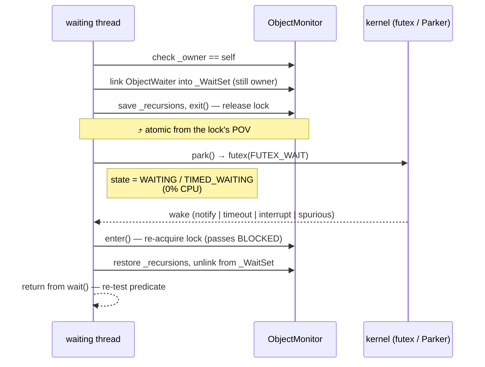
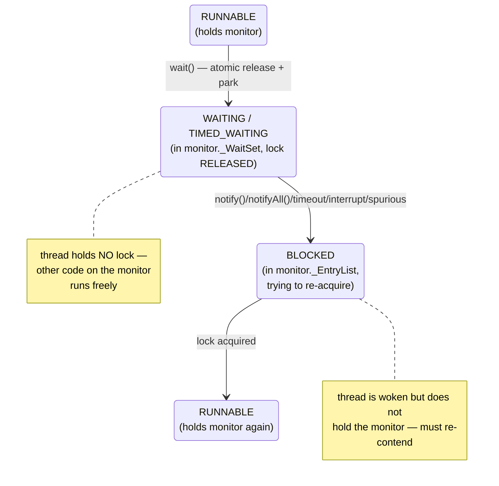
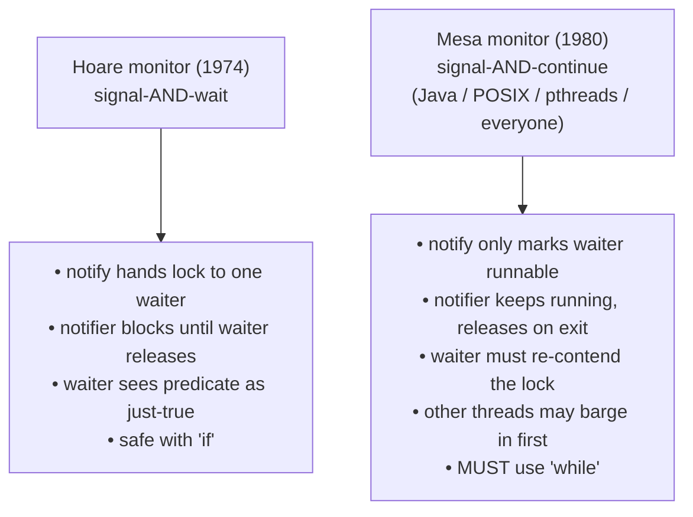
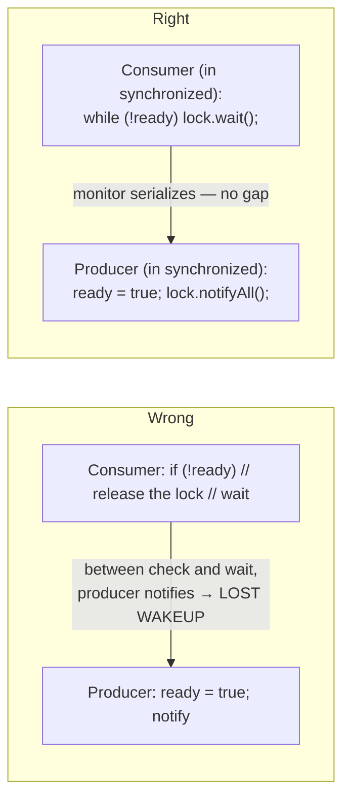
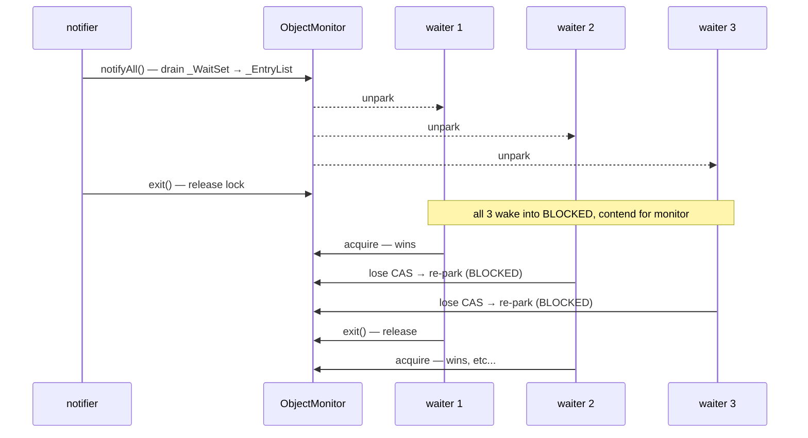
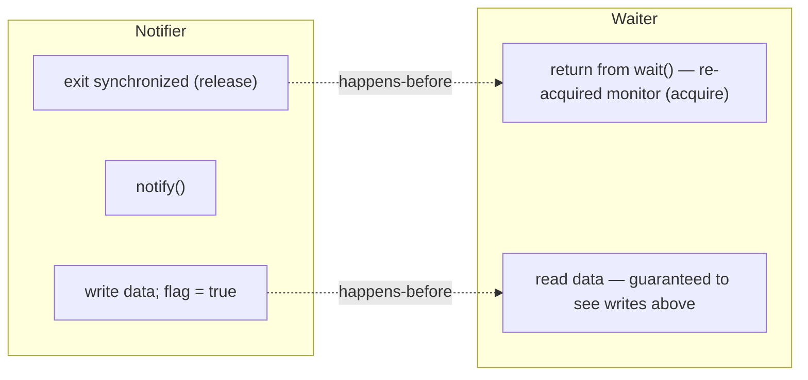
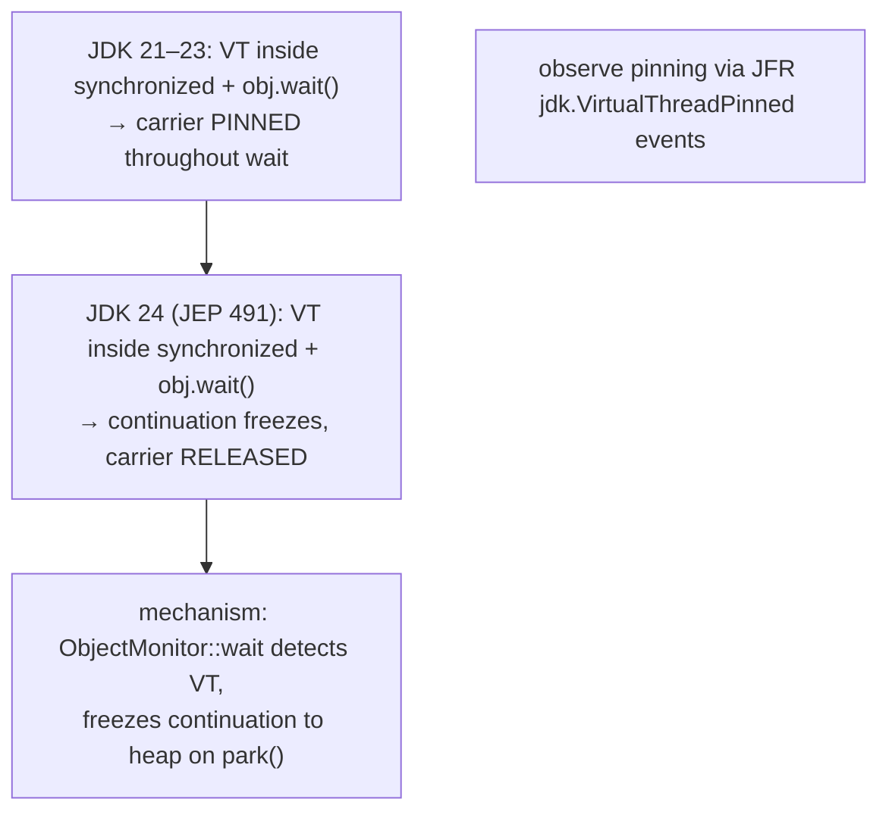

# wait / notify / notifyAll

A `synchronized` block lets one thread *exclude* others while it touches shared state — but it gives no way to *coordinate*: no way for a consumer to wait until a producer has something ready, no way for a worker to sleep until a job arrives, no way for `Future.get()` to block until a result lands. The classic answer in operating-systems theory is the **condition variable**, and Java spells it `Object.wait()`/`Object.notify()`/`Object.notifyAll()` — three methods on **every** object that, together with `synchronized`, form the Java monitor protocol.

The depth-bar requirement isn't "use `wait` inside `while`." At the **language** layer, `wait` *atomically* releases the monitor and parks the calling thread on the object's wait set; `notify`/`notifyAll` move waiters from the wait set to the entry list so they can re-contend; and `IllegalMonitorStateException` enforces the rule that only the monitor's owner may use them. At the **memory** layer, the call inflates the object's monitor (the `_WaitSet` lives only on `ObjectMonitor`, T03), enqueues a stack-allocated `ObjectWaiter` node into the heap-allocated wait-set list, saves the owner's recursion count, calls into `Parker::park` (T02 — futex on Linux), and on wake walks the entry list back to RUNNABLE. At the **architecture / OS** layer, the park sits on a `pthread_cond_wait`/`futex(FUTEX_WAIT)` system call descheduling the OS thread at zero CPU; signal delivery, kernel timer expiration, and `notify` are all *indistinguishable* on return — which is *the* reason the JLS makes **spurious wakeups legal** and *the* reason the predicate **must** be re-checked in a `while` loop. At the **theory** layer, Java implements **Mesa monitors** (signal-and-continue) rather than **Hoare monitors** (signal-and-wait): `notify` does *not* transfer the monitor to the waiter; the waiter re-enters the entry list and races for the lock with any new arrivals (a "barger"). That single design choice is the reason `if` is wrong and `while` is right. We will cover all four layers and the consequences each imposes on every line of correct condition-coordinating code.

> [!NOTE]
> Prerequisites: [synchronized, monitors & intrinsic locks](./T03-synchronized-monitors-and-intrinsic-locks.md) (L3/C01/T03) — `ObjectMonitor`, the three queues, mark-word inflation; [Thread lifecycle & states](./T02-thread-lifecycle-and-states.md) (L3/C01/T02) — `WAITING`/`BLOCKED`/`TIMED_WAITING`, the Parker, futex park/unpark; [Threads & Runnable](./T01-threads-and-runnable.md) (L3/C01/T01) — per-thread stacks, the OS thread; [How Computers Run Programs](../../L0-foundations/C01-cs-foundations/T01-how-computers-run-programs-cpu-memory-binary.md) (L0/C01/T01) — interrupts, scheduler, syscalls.

## The Three Methods and the Cardinal Rule

`Object` declares three `final native` methods (since JDK 9, `wait()` is implemented in Java atop `wait(long)`):

```java
public final void wait() throws InterruptedException;             // wait forever (== wait(0))
public final void wait(long timeoutMillis) throws InterruptedException;
public final void wait(long timeoutMillis, int nanos) throws InterruptedException;
public final native void notify();
public final native void notifyAll();
```

The cardinal rule, stated in `Object.wait`'s Javadoc and enforced by the JVM:

> [!IMPORTANT]
> **All five methods may only be called by a thread that currently holds the receiver's monitor.** Calling `obj.wait()`, `obj.notify()`, or `obj.notifyAll()` *outside* a `synchronized (obj) { ... }` (or a synchronized instance method whose receiver is `obj`) throws **`IllegalMonitorStateException`** at the call site. The exception is the JVM's check that you have indeed locked *this exact object*. It exists because every other invariant of the protocol depends on it.

```java
synchronized (lock) {            // we now hold lock's monitor
    lock.wait();                  // legal — we hold lock's monitor
    other.wait();                 // ✗ IllegalMonitorStateException — we don't hold other's monitor
}
lock.wait();                      // ✗ IllegalMonitorStateException — not inside synchronized(lock)
```

The runtime check is one comparison: `if (this.monitor._owner != currentThread) throw IMSE`. Cheap, but absolute.

## The Wait Protocol — Atomic Release-Park-Reacquire

Calling `obj.wait()` is *not* "release the lock; park; then reacquire." Done as three separate steps, a race window between *release* and *park* would let a `notify()` arrive in between and be **lost**. Instead, the JVM performs the release-and-park as one **atomic step** — from the caller's perspective, between the moment the monitor becomes free and the moment the thread sleeps, no other thread can squeeze in and `notify` to nowhere.

The protocol is the same in every textbook monitor (Hoare 1974, Mesa 1980, POSIX `pthread_cond_wait` 1995). In Java it runs:

```
1.  CHECK_OWNER();                          // throw IllegalMonitorStateException unless _owner == self
2.  ObjectWaiter w(self);                   // small node on the WAITING thread's stack
3.  w.TState = TS_WAIT;
4.  add_waiter(&w);                          // link w into the monitor's _WaitSet (doubly-linked list)
5.  intptr_t save_recursions = _recursions; // remember our reentry depth
6.  _recursions = 0;
7.  _waiters++;
8.  exit_monitor();                          // releases the lock — atomic with step 9 from the lock's POV
9.  ParkEvent::park(timeout);                // → Linux futex → 0% CPU, thread state WAITING/TIMED_WAITING
                                             // ───── may be unblocked by: notify, interrupt, timeout, spurious ─────
10. enter_monitor();                         // re-acquire the lock — passes through BLOCKED state on the way
11. _recursions = save_recursions;           // restore reentry depth
12. _waiters--;
13. if (w.TState == TS_WAIT) dequeue_waiter(&w);   // notify may have already moved us out
14. if (was_interrupted) { Thread.currentThread().interrupt(); throw new InterruptedException(); }
15. return;                                  // we are RUNNABLE, holding the monitor, woken — re-test the predicate!
```

The atomicity that matters is between step 4 (linked into the wait set) and step 8 (lock release). Once the wait-set link is in place *and we still hold the lock*, no other thread can hold the lock to call `notify` against an empty set. The moment the lock is released, the wait-set entry is already published, so a concurrently arriving `notify` either finds us or doesn't — there is no torn intermediate state.



> [!IMPORTANT]
> A thread returning from `wait()` is once again **inside the synchronized region holding the monitor**. You don't write any "reacquire" code — the JVM has already done it before `wait()` returns. The lock you held going in is the lock you hold coming out (with your full recursion depth restored), but **arbitrary other code on the same monitor has run in between**. So all your read variables — the predicate you're waiting on, every shared field — may have changed. That's the entire point, and it's why the re-check on return is mandatory, not optional.

## State Transitions — How `wait` Moves Through the Six States

Wait/notify is the **only** mechanism that makes a Java thread visit `WAITING` (or `TIMED_WAITING`) by parking in a monitor's wait set, and the only one that routes through `BLOCKED` on the way out (re-acquiring the lock).



Two transitions easy to misread in a thread dump:

- **`WAITING` → `BLOCKED` on `notify`.** The notified thread does *not* go straight to `RUNNABLE`. It goes to `BLOCKED` while it waits for the monitor — which may be currently held by the notifier (until the notifier exits its `synchronized`) or by an unrelated thread that contended after the notifier released. A thread dump caught mid-transition shows the just-notified thread as `BLOCKED on object monitor` *against the very same object* it was waiting on a microsecond earlier.
- **`TIMED_WAITING` → `BLOCKED` on timeout.** Same: timeout doesn't restore the monitor; the thread has to re-contend. Two threads sharing a monitor, one waking from a timed wait and one entering fresh, may both spend a measurable interval `BLOCKED` against each other before either makes progress.

### Why a re-check is structurally required: Mesa vs Hoare semantics

In **Hoare monitors** (the original 1974 design), `notify` *transfers the lock* directly to the woken thread — the notifier is **suspended** until the notified thread releases. Signal-and-wait. The notified thread runs immediately on resumption with the predicate provably still true (no other code ran in between).

In **Mesa monitors** (Xerox PARC, 1980 — the model every mainstream language uses), `notify` *only marks the waiter runnable*; the notifier keeps running and releases the lock when its synchronized region ends. Signal-and-continue. The notified thread joins the entry list and is **arbitrarily delayed** before it actually acquires the lock — and during that delay, *anyone else* who can grab the lock first (a "barger") may invalidate the predicate.

Java is Mesa. The consequence is the only condition-variable rule that's worth remembering verbatim:

> [!IMPORTANT]
> **Always wait in a `while` loop on the predicate. Never in an `if`.** When `wait()` returns, three things may be true: the predicate now holds (good — proceed), the predicate doesn't hold (a barger or a spurious wake — re-wait), or the thread was interrupted (handle / re-throw). With `if`, the second case silently proceeds with a stale predicate — the bug shape that defines this protocol.
>
> ```java
> synchronized (lock) {
>     while (!conditionHolds()) {        // ← while, not if
>         lock.wait();                   // releases lock, parks; re-acquired on return
>     }
>     // predicate holds AND we hold the lock — safe to act
> }
> ```

The `while` is not paranoia; it's the *correctness* of the Mesa model. Hoare semantics with `if` would have been strictly safer for application code — but harder for the runtime, because every `notify` would have to suspend the notifier and atomically hand over the lock. Mesa won everywhere because the implementation is simpler, and the application code pays for it with one extra word: `while`.



## Spurious Wakeups and Lost Wakeups — The Two Failure Modes

Two distinct failure modes are paranoid-sounding but completely real, and the `synchronized`+`while`+`notify` protocol exists to defeat both.

### Spurious wakeup

`Object.wait()`'s Javadoc spells it out: *"A thread can also wake up without being notified, interrupted, or timing out — a so-called spurious wakeup."* This is not a Java quirk; it's a property the JLS deliberately *preserved* because every underlying primitive Java could be built on may spuriously wake:

- POSIX `pthread_cond_wait` is permitted to spuriously return — the POSIX standard explicitly says so (so implementations can use `futex` directly without the wrapper logic that suppresses spurious wakes).
- Linux's `futex(FUTEX_WAIT)` returns to userspace on **any signal delivery** (`EINTR`-style), even ones the JVM intends to ignore — looks identical to a `FUTEX_WAKE`.
- The HotSpot `Parker` (T02) itself documents `// spurious returns are fine ... the victim will simply re-test the condition and re-park`.

If `wait()` is written as `if (!cond) wait();`, a spurious wakeup makes the thread fall through to "proceed" with the predicate possibly false — every action after the `if` becomes a bug. With `while`, the spurious return harmlessly loops back into another `wait()`. **Cost of paranoia: one condition test per wakeup, branch-predicted to "false → re-wait."** Practically free; absolutely required.

### Lost wakeup

A "lost wakeup" is the converse: `notify()` is called when no thread is in the wait set, *and the predicate that drove the wait is already* set. The notification is lost — `notify` on an empty wait set is a no-op — and a subsequent `wait()` parks forever, even though the condition has already become true.

The defensive shape is exactly the protocol given above: the producer changes the predicate and calls `notify` *while holding the monitor*; the consumer tests the predicate *and* parks *while holding the monitor*. Because both producer and consumer are serialized through the monitor, the producer cannot squeeze a `notify` in between the consumer's predicate-check (showing false) and the consumer's `wait` (parking) — they're inside the same critical section.

```java
// Producer
synchronized (lock) {
    queue.add(item);
    lock.notifyAll();                  // monitor still held — consumer cannot be mid-predicate-check
}                                       // release on } — only NOW the consumer can run

// Consumer
synchronized (lock) {
    while (queue.isEmpty()) {           // predicate test inside the same monitor
        lock.wait();                     // atomic release-and-park — same atomic window
    }
    Item it = queue.remove();
}
```

The two atomic steps — (1) "check predicate, then park" by the consumer, and (2) "change predicate, then notify" by the producer — are serialized by the monitor. There is no window where the producer changes the state and notifies *between* the consumer's test and park.



Once you internalize that lost wakeups come from "predicate change + notify happening between predicate test and park," the protocol's two requirements — hold the lock on both sides, loop the predicate on the consumer — become the only design choice that closes the window.

## Under the Hood — `ObjectMonitor::wait` and the WaitSet

T03 introduced the three monitor queues: lock-free `_cxq` (new arrivals contending for the lock), FIFO `_EntryList` (the actual ready queue), and `_WaitSet` (threads parked via `wait()`). `wait`/`notify` operate entirely on `_WaitSet` and the `_EntryList`; `_cxq` belongs to ordinary `synchronized` enter.

### The `ObjectWaiter` node

Each waiter is represented by an `ObjectWaiter` struct allocated on the *waiting thread's* C++ stack (HotSpot does *not* heap-allocate one per wait — saves GC pressure):

```cpp
class ObjectWaiter {
public:
  ObjectWaiter*   _next;             // doubly-linked list pointers
  ObjectWaiter*   _prev;
  Thread*         _thread;            // the parked Java thread
  jlong           _notifier_tid;      // who notified us (for JFR / diagnostics)
  int             _notified;          // 0 = still waiting, 1 = notified by notify(), TS_WAIT = in WaitSet
  TStates         TState;              // TS_WAIT (in WaitSet), TS_ENTER (in EntryList), TS_RUN, ...
  bool            _interrupted;
  ParkEvent*      _event;             // the Parker (Tier-1 condvar wrapper, T02)
};
```

Stack allocation works because `ObjectWaiter`'s lifetime is bounded by the `wait()` call frame: the node is constructed when `wait()` begins, linked into the `_WaitSet`, and destructed when `wait()` returns. Stack-allocation also means each waiter contributes **zero heap allocation** — `wait()` is a syscall-grade primitive in cost, not an allocation-pressure source.

### The HotSpot wait path (compressed)

```cpp
// hotspot/share/runtime/objectMonitor.cpp — ObjectMonitor::wait — abridged
void ObjectMonitor::wait(jlong millis, bool interruptible, TRAPS) {
  JavaThread* self = THREAD;
  CHECK_OWNER();                              // → IllegalMonitorStateException if !_owner == self

  // build the waiter node on this thread's stack
  ObjectWaiter node(self);
  node.TState = ObjectWaiter::TS_WAIT;

  add_waiter(&node);                          // link into _WaitSet (doubly-linked, intrusive)
  _waiters++;

  intptr_t save_recursions = _recursions;     // <- preserve OUR re-entry depth
  _recursions = 0;
  exit(true, self);                           // <- atomic release of monitor; barging-OK exit

  assert(_owner != self, "invariant");

  // the actual wait — futex-backed park
  if (millis == 0) {
    node._event->park();                      // untimed
  } else {
    node._event->park(millis);                // CLOCK_MONOTONIC-relative
  }

  // ---- WOKEN ----
  // Re-acquire by enqueuing on EntryList (or directly if it's free)
  // ReenterI handles the "we were on WaitSet; un-park; try to take the lock" path
  ReenterI(self, &node);

  // node may still be in WaitSet (if interrupted before notify); dequeue if so
  // also restore recursion depth and waiter count
  _recursions = save_recursions;
  _waiters--;

  if (node._interrupted) {
    THROW_MSG(vmSymbols::java_lang_InterruptedException(), "");
  }
}
```

`add_waiter` does an *unsynchronized* doubly-linked-list insert — safe because the caller still holds the monitor at that moment, so no other thread can be touching `_WaitSet`. `ReenterI` is the path that returns the thread to ownership; it's a slightly specialized version of `enter()` that knows we were just on the `_WaitSet` rather than arriving fresh.

### The HotSpot notify path

`notify` removes one waiter from `_WaitSet` and moves it onto a queue the owner-release path can drain into `_EntryList`. The default policy (`QMode = 2`) goes "head of `_WaitSet` → tail of `_EntryList`," giving near-FIFO behaviour. Other modes (`QMode 0–4`) exist as `-XX:SyncKnobs=QMode=N` for niche tuning but are rarely changed.

```cpp
// ObjectMonitor::notify — abridged
void ObjectMonitor::notify(TRAPS) {
  CHECK_OWNER();
  if (_WaitSet == nullptr) return;            // notify on empty wait set → no-op (LOST if you intended it!)
  ObjectWaiter* iterator = dequeue_waiter();  // pulls head of _WaitSet
  if (iterator != nullptr) {
    // Move onto _EntryList (so it'll be picked when current owner releases)
    iterator->TState = ObjectWaiter::TS_ENTER;
    Atomic::add(&_contentions, 1);
    push_to_entry_list(iterator);
    iterator->_event->unpark();               // ← here is the futex wake!
  }
}
```

The `unpark()` is what makes the waiter `RUNNABLE` at the OS layer. It does *not* yet make it Java-state `RUNNABLE` — that requires re-acquiring the monitor, which is the entry-list contention. So the thread's path is:

`TS_WAIT (WAITING)` → `notify()` removes from _WaitSet, queues on _EntryList → `TS_ENTER (BLOCKED)` → owner releases or current owner is the notifier and exits → CAS `_owner = self`, success → `TS_RUN (RUNNABLE)` → returns from `wait()`.

### `notifyAll` — the thundering herd

`notifyAll` simply drains the *entire* `_WaitSet` onto `_EntryList`, unparking each waiter. They all run the OS wake, each enters `BLOCKED`, and they then contend for the monitor one-by-one — only one wins per release cycle, while the others go back to `BLOCKED`. With *N* waiters on `_WaitSet`, a single `notifyAll` triggers ~*N* OS context switches and *N*–1 wasted re-park cycles.



This is the famous **thundering herd**. The mitigation in pure `wait`/`notify` is *use `notify` (single) when correctness allows* — if every waiter is interchangeable and only one item is available. Use `notifyAll` when waiters wait on **different conditions** (so the wrong waiter might be woken by `notify` and immediately re-wait, with no one waking the right one — the **lost notify** subspecies). For finer control — multiple condition queues per lock — use `j.u.c.locks.Condition` (T08), which decouples the queues per-condition and avoids the herd by *design*.

> [!INTERVIEW]
> "When do you use `notify` vs `notifyAll`?" — A solid senior answer: **default to `notifyAll`**. Use `notify` only if (a) every waiter is waiting on the *same* predicate, (b) only one work item is being added (so waking more would just have them re-wait), and (c) the contention numbers warrant avoiding the herd. The default is `notifyAll` because a `notify` that wakes the wrong waiter (in a multi-predicate scenario) leaves the right one parked forever — silent deadlock. `notifyAll` is the safe default; `notify` is an optimization that requires proof.

## Timed `wait` — Deadline Semantics

`wait(long ms)` blocks for up to `ms` milliseconds or until notified/interrupted, whichever happens first. Two practical surprises:

1. **You cannot distinguish "timed out" from "notified" on return.** Both wake the thread and return from `wait`. The only signal that the timeout fired is *the elapsed time*. If you need to know which happened, measure elapsed time and re-check the predicate together.
2. **The deadline measures wall-clock-ish *monotonic* time.** Internally `wait(ms)` parks the thread with a CLOCK_MONOTONIC-relative deadline (Linux `pthread_cond_timedwait` with `CLOCK_MONOTONIC` — `futex(FUTEX_WAIT, ..., timeout)`). System time jumps (NTP step, manual clock change) do *not* cut the wait short or extend it. That's a robustness property pre-JDK-1.5 implementations sometimes got wrong; modern HotSpot is correct.

```java
final long deadlineNs = System.nanoTime() + TimeUnit.SECONDS.toNanos(5);
synchronized (lock) {
    while (!conditionHolds()) {
        long remainingNs = deadlineNs - System.nanoTime();
        if (remainingNs <= 0) return /* timeout */;
        lock.wait(remainingNs / 1_000_000L, (int)(remainingNs % 1_000_000L));   // ms + ns
    }
    // predicate holds — proceed
}
```

This is the canonical *bounded* wait. The `while` loop is still essential — spurious wakeups exist for `wait(ms)` too, and the *remaining time* recomputation defends against re-entry after a partial wake. `BlockingQueue.poll(long, TimeUnit)` (T10) and `Condition.awaitNanos` (T08) use exactly this pattern internally; they just hide it.

`wait(0)` and `wait()` are equivalent — `wait(0)` is the "wait forever" sentinel (matches `pthread_cond_wait` no-timeout). `wait(0, 0)` is also wait forever; non-zero nanos with zero millis waits for the nanos.

## Memory Model — The Happens-Before Edge

The JMM rule from T03 — *unlock on monitor M happens-before subsequent lock on M* — covers `wait` and `notify` exactly. Putting it concretely:

- Every write performed by the notifier inside `synchronized (lock) { ... ; lock.notify(); }` happens-before every read performed by the woken thread inside its `synchronized (lock) { ... }` after returning from `wait`.
- Reason: the notifier's monitor-exit (when it leaves its `synchronized` block) happens-before the waiter's monitor-acquire (the re-acquire built into `wait`'s return path). Standard release/acquire pair.



This is why you don't need `volatile` on the predicate field — the monitor acquire/release pair propagates **all** writes inside the synchronized region, including the predicate field. Adding `volatile` to a predicate read inside `synchronized` is harmless but redundant.

> [!WARNING]
> Conversely, if a notifier sets `flag = true` *outside* the synchronized block and then enters the block only to `notify()`, the write is **not** covered by the monitor's release. The waker may return from `wait()` and read `flag` as **false**, even though the notifier "knows" it set it. Always change the predicate *inside* the same synchronized region from which you call `notify`. This is the single most common JMM-related wait/notify bug.

## Producer / Consumer — The Reference Implementation

The hello-world of condition variables. We'll build a bounded buffer with `wait`/`notify` from scratch — both to show the mechanism and to give a textbook reference you can compare your own code against.

```java
import java.util.ArrayDeque;
import java.util.Deque;

public final class BoundedBuffer<T> {
    private final Deque<T> queue = new ArrayDeque<>();
    private final int capacity;
    private final Object lock = new Object();         // dedicated private final monitor (T03)

    public BoundedBuffer(int capacity) {
        if (capacity <= 0) throw new IllegalArgumentException();
        this.capacity = capacity;
    }

    public void put(T item) throws InterruptedException {
        synchronized (lock) {
            while (queue.size() == capacity) {        // wait WHILE full — never if
                lock.wait();                           // releases lock, parks, re-acquires
            }
            queue.add(item);
            lock.notifyAll();                         // wake any consumer (or producer waiting for space)
        }
    }

    public T take() throws InterruptedException {
        synchronized (lock) {
            while (queue.isEmpty()) {                 // wait WHILE empty
                lock.wait();
            }
            T item = queue.remove();
            lock.notifyAll();                         // wake any producer (or consumer waiting on size)
            return item;
        }
    }

    public int size() {
        synchronized (lock) {
            return queue.size();                       // synchronized read — happens-before from any put/take
        }
    }
}
```

Five things this code does right that the broken version always gets wrong:

1. **Dedicated `private final Object lock`.** Not `this`, not the queue, not a String literal (T03 Common Mistakes).
2. **`while`, not `if`.** Mesa semantics require it; spurious wakeups require it.
3. **`notifyAll`.** Producers and consumers wait on *different* predicates (`size==capacity` vs `size==0`). A single `notify()` could wake a producer when the right wakeup target is a consumer (or vice versa), and the right thread stays parked forever. We don't optimize until we measure.
4. **Predicate change happens *inside* the same `synchronized` block as the `notifyAll`.** This is what publishes the new size to the woken thread's happens-before view.
5. **`InterruptedException` is propagated, not swallowed.** A bare `catch (InterruptedException e) {}` would swallow a cancellation request and leave callers unable to shut the buffer down (T02 — restore the flag and stop).

### Why `notifyAll` and not `notify` here

Imagine the buffer is full. Two producers and three consumers are blocked in `wait`. A consumer takes an item — buffer is no longer full and no longer empty. With `notify`:

- If the JVM picks a *consumer* off the wait set, the consumer wakes, re-tests `queue.isEmpty()` → false → proceeds to consume. But the *two waiting producers* were equally legitimate wakeup targets, and they stay parked. Eventually a fresh producer call satisfies the producers — but if no more `put` calls come, both producers are stuck forever. **Silent deadlock.**
- `notifyAll` wakes everyone; each re-tests its own predicate; the wrong predicates re-wait; only the right ones proceed. **Correct, but wasteful.**

The fix that retains `notify`'s economy is `j.u.c.locks.Condition` with **two separate condition queues** (`notFull` and `notEmpty`), `signal`-ing into the queue that contains the right kind of waiter. That's what `ArrayBlockingQueue` (T10) does internally — exactly this code, but with two `Condition`s. The conclusion: *intrinsic monitors have one wait set per object, so `notifyAll` is the safe default whenever waiters wait on **different** predicates*.

## Virtual Threads & `wait` — JEP 491 (JDK 24)

The pinning story T03 laid out for `synchronized` applies *equally* to `wait`. Through JDK 23, a virtual thread that called `Object.wait()` inside a `synchronized` block remained mounted on its carrier platform thread — `wait()` parked the *carrier* (because the inflated `ObjectMonitor` path called into the carrier's `Parker`), so the OS thread was held hostage for the duration of the wait. This nullified virtual-thread scalability for any code path that used intrinsic monitors with condition variables — and the JDK and most libraries had to be audited and converted to `ReentrantLock` + `Condition` for blocking paths.

**JEP 491 (JDK 24)** fixed both `synchronized` *and* `wait`. The mechanism: `ObjectMonitor::wait` now detects a virtual-thread caller and freezes its continuation onto the heap (just like `LockSupport.park`), releases the carrier, and on `notify` schedules the continuation back into the virtual-thread scheduler. The carrier was held only for the brief moment to do the predicate-check and the actual `wait()` call.



In 2026 code on JDK 24+, plain `synchronized` + `wait`/`notifyAll` is again a first-class choice for virtual-thread workloads. The `Lock` + `Condition` advice from JDK 21 is no longer obligatory — it remains a *style* choice when you need timed `lockInterruptibly`, multiple condition queues, or fairness, but not a *correctness* requirement.

## Comparison — `Object.wait`/`notify` vs `Condition.await`/`signal`

The `j.u.c.locks.Condition` (T08) interface is the "modern condition variable" — and it's deliberately almost-identical to the intrinsic version, just with a separate API.

| Aspect | `Object.wait`/`notify` | `Condition.await`/`signal` |
|--------|------------------------|----------------------------|
| Lock | implicit `synchronized` monitor | explicit `Lock` (`ReentrantLock`, etc.) |
| Method names | `wait`/`notify`/`notifyAll` | `await`/`signal`/`signalAll` |
| Required state | caller holds monitor | caller holds `Lock` (else `IllegalMonitorStateException`) |
| Multiple queues per lock | **No** — one wait set per object | **Yes** — `lock.newCondition()` makes more |
| Spurious wakeups | yes — must `while` | yes — must `while` |
| Timed wait | `wait(ms)` returns nothing | `awaitNanos(ns)` returns remaining time; `await(t, unit)` returns false on timeout — clean signal |
| Interruptible | yes (throws `InterruptedException`) | yes; `awaitUninterruptibly()` opts out |
| Tied to thread state | yes — `BLOCKED`/`WAITING` named in dumps | yes — uses `LockSupport.park` → `WAITING (parking)` |
| Performance | optimized by JIT (T03 elision/coarsening) | regular method calls; can't be elided |
| Virtual-thread fit (JDK 24+) | full unmount (JEP 491) | full unmount (always) |

The deciding question: **do you need multiple condition queues against one lock?** If yes, use `Condition`. If no, `Object.wait`/`notifyAll` is shorter, JIT-friendlier, and now equally virtual-thread-friendly. The middle case — wanting a timed wait that *tells* you whether it timed out — is the most common reason to switch to `Condition.await(t, unit)`, which returns a boolean cleanly.

## Observing It Live

### In a thread dump

```text
"consumer-1" #21 ... java.lang.Thread.State: WAITING (on object monitor)
   at java.lang.Object.wait(Native Method)
   - waiting on <0x000000071ab2> (a java.lang.Object)            ← the lock object
   at com.x.BoundedBuffer.take(BoundedBuffer.java:31)
   - locked <0x000000071ab2> (a java.lang.Object)                ← we *will hold* it on resume

"producer-1" #22 ... java.lang.Thread.State: TIMED_WAITING (on object monitor)
   at java.lang.Object.wait(Native Method)
   - waiting on <0x000000071ab2> (a java.lang.Object)
```

The dump tells you what monitor each thread is parked on (the `<0x...>` address). Cross-reference with `- locked <0x...>` lines on other threads to find who *holds* the monitor that the waiters will need to re-acquire. The `- locked` annotation on the waiter itself is a HotSpot quirk that means "this is the lock we'll reacquire" — not "we hold it now" (we don't, we're parked).

### JFR events

`jdk.JavaMonitorWait` records every `wait()` that exits a parked state, with:

- the monitor (object class + identity),
- duration parked,
- whether timed out, notified, interrupted, or unblocked spuriously,
- the notifier's thread id (`notifier`), if any.

Run `jcmd <pid> JFR.start duration=30s settings=profile` and open the recording in JDK Mission Control to see the distribution of wait durations and the worst-blocking notifiers — far more actionable than `jstack` for understanding production wait behaviour.

## Common Mistakes

### Calling `wait`/`notify` outside `synchronized` on the same object

```java
lock.wait();                                  // ✗ IllegalMonitorStateException
synchronized (other) { lock.wait(); }         // ✗ IllegalMonitorStateException — wrong monitor
```

The runtime check is `if (_owner != current) throw IMSE`. Always match the synchronized object with the wait/notify receiver.

### Using `if` instead of `while`

```java
synchronized (lock) {
    if (!ready) lock.wait();                  // ✗ spurious wakeup or barger → proceeds with !ready
    doWork();                                  // wrong half the time
}
```

The defining bug of the protocol. *Always* `while`.

### Changing the predicate outside the synchronized block

```java
ready = true;                                 // ✗ write not under the monitor's release
synchronized (lock) { lock.notifyAll(); }      // waker may read ready as false
```

The waker's happens-before edge is *the monitor's release*. Writes outside that release are not propagated. Always change the predicate inside the same synchronized region.

### Swallowing `InterruptedException`

```java
try { lock.wait(); } catch (InterruptedException e) { /* ignored */ }   // ✗ T02 — never swallow
```

You've discarded a cancellation request and cleared the flag. Restore the flag (`Thread.currentThread().interrupt()`) and exit, or propagate the exception. This is the #1 finding in concurrency code review (T02 — interrupt protocol).

### Using `notify` when multiple predicates share the lock

```java
synchronized (lock) {
    queue.add(x);
    lock.notify();                            // ✗ may wake a producer waiting on "not full" instead of a consumer
}
```

If two threads are waiting on *different* conditions (`isEmpty` vs `isFull`), `notify` may wake the wrong one — which finds its predicate still unmet, re-waits, and leaves the right one parked. Use `notifyAll` unless every waiter is interchangeable. Or use `Condition` queues.

### `wait(0)` thinking it's "don't wait"

```java
lock.wait(0);                                 // ✗ this is wait FOREVER — not "don't wait"
```

`wait(0)` is the "no deadline" sentinel — equivalent to `wait()` and `pthread_cond_wait` with no timeout. To not wait, simply don't call `wait`.

### Calling `notify` to "wake up the lock"

```java
synchronized (lock) { lock.notify(); }         // does nothing if no thread is in WaitSet
```

`notify` on an empty wait set is a no-op. The wakeup is *lost* — if a thread later parks on `wait`, it parks forever. This is "lost wakeup" and is fixed by the protocol (change-predicate-and-notify inside the same critical section, while-loop on the consumer side). Calling `notify` defensively "just in case" is fine — extra notifies are harmless — but it doesn't substitute for the predicate-and-monitor discipline.

### Holding the lock for the entire wait operation by accident

```java
synchronized (lock) {
    while (!ready) {
        Thread.sleep(100);                     // ✗ keeps the lock — every producer is BLOCKED on lock for 100ms each cycle
    }
}
```

`sleep` does **not** release the monitor (T02). The whole synchronized region holds the lock for the wait duration. Use `wait()` (releases the monitor) or `lock.wait(100)` (releases the monitor for up to 100 ms). This is also why "busy-polling inside synchronized" is the *worst* of all worlds — full lock contention + 100% CPU.

### Calling `wait` on a different object than `notify`

```java
synchronized (lock) { lock.wait(); }                  // consumer
synchronized (otherLock) { otherLock.notifyAll(); }   // producer — DIFFERENT monitor!
```

Wait sets are per-object. A `notify` on a different object doesn't reach waiters on this one. Even a tiny refactor that renames or reassigns a lock reference can split a working protocol — `final` lock fields prevent this (T03 Common Mistakes).

> [!INTERVIEW]
> Wait/notify is one of the highest-yield concurrency interview topics — easy to ask, hard to get fully right. The senior bar:
>
> 1. **Why must `wait`/`notify` be inside `synchronized`?** Because (a) only the owner may use them — IllegalMonitorStateException otherwise — and (b) the predicate test and the wait must be atomic with respect to the predicate change and the notify, or you get lost wakeups.
> 2. **What is a spurious wakeup, and why does it exist?** `wait` may return without notify/timeout/interrupt — POSIX `pthread_cond_wait`, the Linux futex, and the HotSpot Parker all permit it (signal delivery; underlying primitive choice). It exists so the implementation is free to be cheap and direct. **Use `while`.**
> 3. **What's a lost wakeup, and how does the protocol prevent it?** `notify` on an empty wait set is a no-op; if it happens before the would-be waiter parks, the parking is permanent. Protocol prevents it by serializing predicate-change + notify and predicate-test + park through the same monitor.
> 4. **Why `while`, not `if`?** Mesa monitors (signal-and-continue) — `notify` does not transfer the lock; barger or spurious wake may invalidate the predicate before the woken thread re-acquires. The `while` re-checks.
> 5. **What's Hoare vs Mesa, and which is Java?** Hoare: signal-and-wait, notifier suspends, notifier hands the lock to one waiter. Mesa (Java, POSIX, every mainstream system): signal-and-continue, notifier keeps running, waiter joins the entry list and races for the lock. Mesa is simpler to implement; cost is the `while`.
> 6. **`notify` vs `notifyAll` — when to use which?** `notifyAll` is the safe default. Use `notify` only when (a) all waiters wait on the *same* predicate and (b) only one work-item is published. If you have multiple predicates per lock, switch to `Condition` queues.
> 7. **What state is a thread in during `wait`?** `WAITING` (or `TIMED_WAITING` for `wait(ms)`). On notify, it transitions to `BLOCKED` (re-acquiring the monitor) before becoming `RUNNABLE` again.
> 8. **What happens to the monitor's recursion count during `wait`?** Saved and zeroed on the way in; restored on the way out. So a thread that entered the lock three times (recursion=2) and then waited will, after returning from `wait`, again be the owner with recursion=2. This is why a synchronized method that calls `wait` doesn't accidentally release locks of its outer synchronized callers.
> 9. **Why is `IllegalMonitorStateException` runtime, not compile-time?** The compiler can't statically know which monitor is held at any program point — the call site may be reachable from many entry chains, each with different `synchronized` ancestors. The check is a one-CAS-comparison at the call.
> 10. **What memory edge does `notify` create?** No edge by itself. The edge is the monitor's release on `synchronized` exit (where `notify` was called) → acquire on the woken thread's re-entry to its `synchronized` region. Same JMM rule as plain `synchronized`.
> 11. **Why doesn't `wait` need `volatile` on the predicate field?** Because the monitor's release-acquire pair propagates all writes inside the synchronized region. The predicate is read after acquiring the monitor's lock, so writes by the notifier inside the same monitor are visible.
> 12. **What's the difference between `wait()` and `wait(0)`?** Same. `wait(0)` is the "no timeout" sentinel.
> 13. **How does `wait(timeout)` tell you whether it timed out?** It doesn't — `wait` returns nothing. Measure elapsed time externally, or switch to `Condition.await(t, unit)`, which returns a clean boolean.
> 14. **What's the JDK 21 virtual-thread pinning issue with `wait`, and is it fixed?** JDK 21–23 pinned the carrier through the entire `wait` because the inflated `ObjectMonitor` parked on the carrier's `Parker`. **JEP 491 (JDK 24)** fixed it — `wait` now freezes the virtual-thread continuation and releases the carrier.
> 15. **How does the JVM avoid races between waiting threads and notifiers under the hood?** The atomic step: a waiter holds the monitor, links its `ObjectWaiter` into `_WaitSet`, and only *then* releases the monitor. A notifier holds the monitor while it inspects/drains `_WaitSet`. The two are serialized by the monitor — no overlap is possible, so the wait set is always self-consistent.
> 16. **What's the data structure of `_WaitSet`?** A doubly-linked intrusive list of `ObjectWaiter` nodes. Each node is **stack-allocated** on the waiting thread's frame (no heap allocation per `wait`). The monitor (heap) holds head/tail pointers.

## Practice

1. **The minimal `wait`/`notify` shape.** Write two threads sharing one `Object`. Consumer prints `before`, waits, prints `after`. Producer sleeps 1 s, then `notifyAll`s. Verify in a thread dump (during the sleep) the consumer is `WAITING (on object monitor)` against that exact object.
2. **Test the cardinal rule.** Try `obj.wait()` outside `synchronized (obj)`. Catch the `IllegalMonitorStateException` and print its message. Confirm the JVM check is per-monitor.
3. **Demonstrate the spurious-wakeup defense.** Write the consumer with `if (!ready) wait();` and the producer that calls `notify()` once. Add a printout *between* `if` and the rest of the consumer that fakes "I proceeded with predicate false." Now rewrite with `while`; show the fake proceed never happens. (A real spurious wake is hard to force in user code; the test is structural.)
4. **Lost wakeup demonstration.** Implement a wrong protocol: producer sets `ready = true` and calls `notify()` *outside* a synchronized block; consumer enters synchronized only at `wait`. Race them. Observe that on some runs the consumer parks forever. Then fix by moving both `ready = true` and `notify()` inside the synchronized block.
5. **Build the bounded buffer.** Copy the reference implementation above; write a JMH benchmark with 4 producers and 4 consumers; measure throughput. Then replace `notifyAll` with `notify`; observe (with bad luck) the throughput dropping to zero or the producers/consumers blocking forever — the multi-predicate failure.
6. **Two `Condition`s on one `ReentrantLock`.** Reimplement the same bounded buffer with `ReentrantLock` + two `Condition`s (`notFull`, `notEmpty`). Use `signal` (not `signalAll`) into the right queue on `put`/`take`. Confirm equivalent correctness and that `signal` is now safe — because each queue contains only one kind of waiter.
7. **The thundering herd.** With 1000 waiters on one `Object`, time how long it takes them all to drain after one `notifyAll`. Compare to `notify` calling 1000 times in sequence. Plot the OS context-switch counts (`vmstat`/`pidstat`).
8. **Timed `wait`'s identity-of-wake gotcha.** Write `lock.wait(1000)`. Record elapsed time on return. From a separate test, sometimes notify within 500 ms, sometimes don't. Show that the elapsed time is the only way to know which happened.
9. **The recursion-count round-trip.** Write a method that enters `synchronized (lock)` 3 times (recursive calls), then on the deepest one calls `lock.wait()`. From another thread, take a thread dump and observe the waiter's stack — confirm the dump's "locked" annotations indicate the *full* prior recursion depth (HotSpot prints the same lock 3×). Then `notifyAll`, let the waiter return, and confirm it remains locked at depth 3 (only the outermost return releases).
10. **Predicate change outside synchronized — broken.** Producer sets the predicate volatile *outside* the synchronized block, then enters it only to `notify`. Show that a consumer occasionally reads stale predicate after wake (rare; takes many iterations on a multi-core CPU). Fix by moving the predicate write into the synchronized block.
11. **Virtual-thread pinning on `wait`.** On JDK 21 and on JDK 24+, run 10,000 virtual threads each calling `Object.wait(100)` inside a `synchronized`. Measure how many carriers the JDK consumes (compare with `Thread.dumpToStream(...)` or `jcmd JFR`). On JDK 21 the carrier count tracks the wait count (pinned); on JDK 24 it's bounded by available CPUs (unpinned via JEP 491).
12. **JFR `jdk.JavaMonitorWait` analysis.** Run the bounded buffer under JFR. Open the recording in JDK Mission Control. Filter `jdk.JavaMonitorWait` by duration and by notifier; correlate the slowest waits with the producer that finally notified. This is the production-grade equivalent of staring at thread dumps for hours.

## Recap

You should now be able to:

- State the **cardinal rule**: `wait`, `notify`, `notifyAll` may *only* be called by the thread that holds the receiver's monitor; calling outside throws **`IllegalMonitorStateException`**. The rule exists because every other invariant of the protocol — predicate–park atomicity, predicate–notify atomicity, happens-before publication — depends on it.
- Walk through the **atomic release-park-reacquire sequence** of `wait()` — save the recursion count, link an `ObjectWaiter` into `_WaitSet`, release the monitor, park (on the futex via the `Parker`), and on wake re-acquire (passing through `_EntryList` and the `BLOCKED` state) before restoring the recursion count and returning.
- Distinguish **Mesa (signal-and-continue, Java)** from **Hoare (signal-and-wait)** monitors. Explain why the Mesa model imposes the **`while`-on-predicate** rule: `notify` does not hand the lock to a waiter; bargers and spurious wakes may invalidate the predicate before the woken thread reacquires.
- Define **spurious wakeup** (`wait` returning without notify/timeout/interrupt — legal per JLS because POSIX/futex/Parker all permit it) and **lost wakeup** (`notify` on an empty wait set is a no-op; if predicate-change and notify aren't serialized with predicate-test and park through the same monitor, the wakeup vanishes).
- Choose between **`notify`** and **`notifyAll`**: default to `notifyAll`; use `notify` only when all waiters wait on the *same* predicate, performance is measured to matter, and the thundering-herd cost is meaningful — otherwise switch to `Condition` queues (T08).
- Explain the **JMM edge** wait/notify creates: the notifier's monitor-exit happens-before the waiter's monitor-reacquire (same release/acquire pair as ordinary `synchronized`), so any writes the notifier made inside the synchronized region are visible to the waiter after return — no `volatile` needed on the predicate field.
- Identify the data structures used: **per-thread stack-allocated `ObjectWaiter` nodes** linked into a **doubly-linked `_WaitSet`** on the heap-allocated **`ObjectMonitor`**, with the underlying park sitting on a Linux **futex** (`pthread_cond_wait` → `FUTEX_WAIT`).
- Read **timed `wait`** correctly: `wait(0)` is forever; `wait(t)` is bounded; you can't tell timeout from notify on return without measuring elapsed time externally (or switching to `Condition.await(t, unit)`).
- Build a correct **producer/consumer bounded buffer**: dedicated `private final Object lock`, `while` on the predicate, `notifyAll` (because put-side and take-side wait on different predicates), predicate change and `notify` both inside the same synchronized block, `InterruptedException` propagated (T02).
- State the **virtual-thread story**: JDK 21–23 pinned the carrier through `wait`; **JEP 491 (JDK 24)** freezes the virtual-thread continuation on park and releases the carrier — `synchronized`+`wait`/`notify` is again a first-class virtual-thread primitive.
- Compare with **`j.u.c.locks.Condition`**: same model, with multiple queues per lock (`signal` into the *right* queue avoids the herd) and a clean timed-wait return value. Use `Condition` when you need multiple condition queues or `await(t, unit)`'s boolean return; otherwise `wait`/`notifyAll` is shorter and JIT-friendlier.
- Avoid the **eight common bugs**: `wait`/`notify` outside synchronized, `if` instead of `while`, predicate change outside the lock, swallowing `InterruptedException`, `notify` with multiple predicates per lock, `wait(0)` meaning "forever," sleeping inside synchronized, `wait` and `notify` on different monitors.

## Next

Continue to [Executors & thread pools](./T05-executors-and-thread-pools.md) — the modern API layer above raw threads + wait/notify. We'll see how `ThreadPoolExecutor` uses a `BlockingQueue` (built on `ReentrantLock` + two `Condition`s — exactly the pattern this topic ends on) to coordinate worker threads, why `Executors.newFixedThreadPool` was the default of the JDK-5 era but no longer is, and how `Thread.ofVirtual().factory()` plugs virtual threads into the same `ExecutorService` interface for Loom-era backends.
