# Executors & Thread Pools

A thread costs ~1 MB of stack + tens of microseconds to create + a kernel data structure that the OS must schedule. Spinning up one thread per task — the obvious shape — burns most of your budget on overhead and exposes the OS thread limit (low thousands on Linux, lower on Windows) as a *throughput ceiling* for every server you write. The fix everyone arrives at independently: keep a small pool of long-lived threads, hand them work through a queue, reuse them. The `java.util.concurrent.Executor` framework — introduced in JDK 5, now twenty years old and still the foundation of every Spring controller, Tomcat acceptor, Netty handler, and `CompletableFuture` callback — is Java's standard answer.

The depth-bar requirement isn't "use `Executors.newFixedThreadPool`." At the **language** layer, the `Executor` / `ExecutorService` / `ScheduledExecutorService` hierarchy decouples *what to do* (a `Runnable`/`Callable`) from *who does it* (a pool, a scheduler, a virtual-thread spawner), unified by one `submit(...)` API. At the **library** layer, the concrete `ThreadPoolExecutor` is configured by **seven** constructor parameters (core size, max size, keep-alive, queue, thread factory, rejection handler, time unit) whose *interaction* produces every classic pool shape — fixed, cached, single, custom-bounded — and whose *misconfiguration* produces every classic pool bug — OOM via unbounded queue, thread explosion, silent rejection, pool deadlock. At the **JVM internals** layer, a `ThreadPoolExecutor` packs its life-cycle state (3 bits: RUNNING/SHUTDOWN/STOP/TIDYING/TERMINATED) and worker count (29 bits) into a *single atomic int* (`ctl`) so every state transition is one CAS, each `Worker` is itself an `AbstractQueuedSynchronizer` (T08), and the worker loop is a `getTask().run()` cycle that times out idle workers via the queue's `poll(timeout)`. At the **architecture / OS** layer, pool sizing is governed by Brian Goetz's formula — **N × (1 + W/C)** for IO-bound, **N + 1** for CPU-bound — and tuned against backpressure semantics; **virtual threads** (JDK 21, T14) invert the whole calculus by making "one thread per task" cheap again. We will cover all four layers.

> [!NOTE]
> Prerequisites: [wait / notify / notifyAll](./T04-wait-notify-notifyall.md) (L3/C01/T04) — the protocol every `BlockingQueue` uses internally; [synchronized, monitors & intrinsic locks](./T03-synchronized-monitors-and-intrinsic-locks.md) (L3/C01/T03) — `ReentrantLock`/`Condition` underpin `LinkedBlockingQueue` and `ArrayBlockingQueue`; [Thread lifecycle & states](./T02-thread-lifecycle-and-states.md) (L3/C01/T02) — worker threads are in `RUNNABLE`/`WAITING (parking)`; [Threads & Runnable](./T01-threads-and-runnable.md) (L3/C01/T01) — `Runnable` is the task interface; the per-thread stack is the dominant memory cost of a pool.

## Why a Pool — the Cost of One-Thread-per-Task

A platform thread is not free. Concrete costs, on Linux x86-64 with HotSpot 21:

| Cost | Order of magnitude | Reason |
|------|-------------------:|--------|
| Memory per thread | **~1 MB** | `-Xss` default; pre-allocated stack address space (not all touched, but reserved) |
| Creation latency | **~50–100 µs** | `pthread_create` + kernel TCB + scheduler entry + JVM `Thread` bookkeeping |
| Context-switch latency | **~1–10 µs** | register save/restore + TLB miss risk + L1/L2 thrash |
| OS thread cap | **~thousands** | `/proc/sys/kernel/threads-max`; per-user `RLIMIT_NPROC`; system memory |

Doing `new Thread(task).start()` per HTTP request at 10k req/s burns ~1 GB/s of stack-reservation churn and ~1 ms of CPU just on thread setup — before any work. A pool of, say, 200 threads sized to the workload reuses the same kernel objects across millions of tasks; the setup cost is paid once per pool, not once per task.

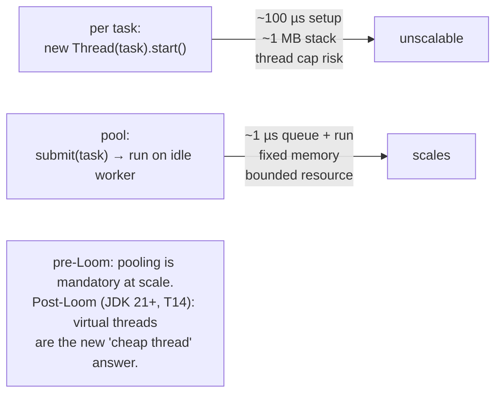

> [!INTERVIEW]
> "Why do we use thread pools?" is the warm-up. The senior answer is the *cost ladder above* + **the secondary reason**: a bounded pool *bounds concurrency*. Even after Loom makes thread cost negligible, a pool of size `N` is the simplest *concurrency limiter* for a downstream resource — a connection pool, a rate-limited API, a database — and that role doesn't go away even when threads themselves stop being scarce.

## The Type Hierarchy

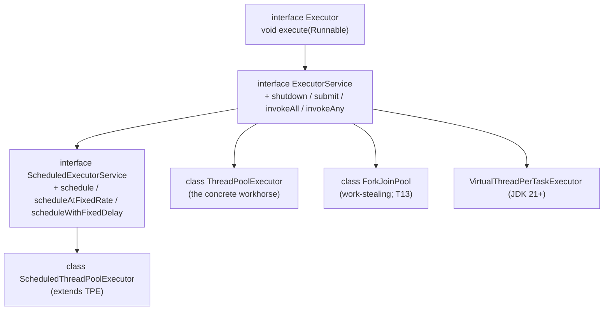

Three interfaces, each a strict superset of the prior:

- **`Executor`** — one method: `void execute(Runnable command)`. The base contract: "run this somewhere, sometime." Says nothing about *when*, *where*, or *return value*. Almost too thin to use directly — exists so you can hand a generic `Runnable` sink to any framework that wants one.
- **`ExecutorService`** — adds *lifecycle* (`shutdown`, `shutdownNow`, `awaitTermination`) and *task submission with results* (`submit(Callable)` returns `Future<T>`, `invokeAll`, `invokeAny`). This is the everyday API.
- **`ScheduledExecutorService`** — adds delayed and periodic submission. Backed by `ScheduledThreadPoolExecutor` whose queue is a *heap* ordered by due-time.

The concrete implementations: **`ThreadPoolExecutor`** is the workhorse for queue-based pools, **`ScheduledThreadPoolExecutor`** extends it for scheduled work, **`ForkJoinPool`** (T13) is the work-stealing variant for divide-and-conquer parallelism, and (JDK 21+) **`Executors.newVirtualThreadPerTaskExecutor()`** returns an `ExecutorService` that spawns a fresh virtual thread per task — no pooling at all.

## `ThreadPoolExecutor` — the Seven Constructor Parameters

The full constructor (the one all the factory methods delegate to):

```java
public ThreadPoolExecutor(
    int corePoolSize,                         // 1. threads to keep alive even when idle
    int maximumPoolSize,                      // 2. hard cap on concurrent workers
    long keepAliveTime, TimeUnit unit,        // 3+4. how long extra (non-core) workers idle before exit
    BlockingQueue<Runnable> workQueue,        // 5. THE crucial choice — shapes the whole pool's behavior
    ThreadFactory threadFactory,              // 6. how to make threads (naming, daemon flag, group)
    RejectedExecutionHandler handler          // 7. what to do when saturated + queue full
);
```

Each parameter is independently tunable, and the interaction of `corePoolSize`, `maximumPoolSize`, and `workQueue` produces *every* classic pool shape. Memorize the four-step submission flow and you can derive any pool's behavior from its parameters:

### The four-step submission flow

When you call `pool.execute(task)`, the pool tries to dispatch it through **exactly** this sequence:

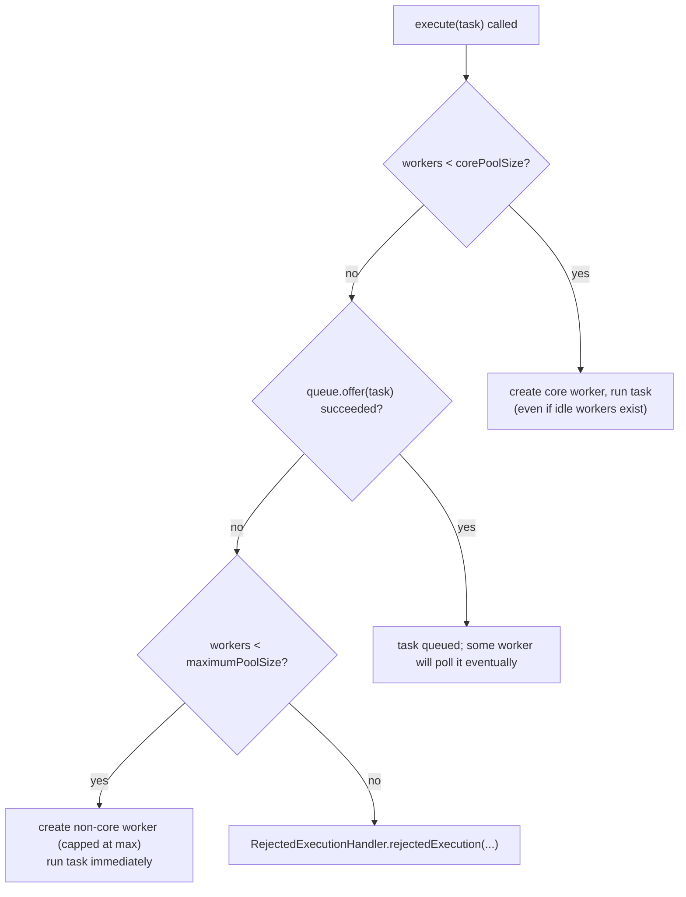

Three counter-intuitive consequences fall out of this flow:

1. **The queue is tried *before* growing past core size.** If you set `core=2, max=10, queue=LinkedBlockingQueue(1000)`, a burst of 100 tasks will result in **2 working threads + 98 queued tasks** — *not* 10 working threads. The extra capacity (`max-core`) is only used when the queue refuses, which an unbounded queue *never* does.
2. **`maximumPoolSize` is meaningless with an unbounded queue.** This is *the* design flaw of `Executors.newFixedThreadPool(N)` (next section) — it sets `core = max = N` *and* uses an unbounded `LinkedBlockingQueue`, so `max` would be inert anyway; under overload, the queue grows until OOM.
3. **A `SynchronousQueue` always refuses.** It has zero capacity; `offer` succeeds only if a worker is already waiting in `take()`. So with `SynchronousQueue`, *every* task either hands off to a waiting worker or triggers step 3 (new worker spawn if under max) or step 4 (rejection). This is how `newCachedThreadPool` keeps spawning threads.

> [!IMPORTANT]
> The submission flow is the single most important invariant in this entire topic. If you can recite it cold and apply it to *any* combination of {core, max, queue}, you can predict every pool's behavior under any load — including the failure modes. Memorize the flow before tuning numbers.

## Queue Strategies — Where Pool Behaviour Actually Lives

The choice of `BlockingQueue` defines the pool more than any other parameter. The six common queues, with the behaviour they impose:

### `SynchronousQueue` — direct handoff, zero capacity

```java
new ThreadPoolExecutor(0, Integer.MAX_VALUE, 60, SECONDS,
                       new SynchronousQueue<>(), factory, handler);
```

This is `newCachedThreadPool` in skeleton form. `SynchronousQueue` has no buffer; `offer(task)` succeeds *only if* a consumer is `take()`-ing right now. So step-2 in the flow always *fails* unless a worker is idle and parked at the queue's `take()`. Result: every submission becomes "hand to an idle worker, else spawn a new worker (step 3, up to `Integer.MAX_VALUE`)." Workers that go idle for 60 s exit (step's keep-alive). The pool's size tracks the workload *exactly* — but with **no upper bound on thread count**, which under sudden burst will spawn until the OS thread limit (T01) — usually before, since each thread reserves 1 MB. *Production rule: never use a `SynchronousQueue` with `Integer.MAX_VALUE` max in a server that can be DoS'd.*

### `LinkedBlockingQueue(unbounded)` — used by `newFixedThreadPool`

```java
new ThreadPoolExecutor(N, N, 0L, MILLISECONDS,
                       new LinkedBlockingQueue<>(),         // ← no capacity arg = Integer.MAX_VALUE
                       factory, handler);
```

`core = max = N`, queue is unbounded. Step-2 *always* succeeds (the queue never refuses), so steps 3 and 4 are *unreachable*. The pool has exactly `N` workers; excess work accumulates in the queue. Under sustained overload, the queue grows without bound until OOM. The famous "Effective Java Item 80" anti-pattern.

`LinkedBlockingQueue` internally uses **two separate `ReentrantLock`s** — one for the head (consumers `take`/`poll`) and one for the tail (producers `put`/`offer`). Producers and consumers operate on opposite ends without contending unless the queue is empty or full. This *two-lock* design is why `LinkedBlockingQueue` scales better than `ArrayBlockingQueue` under high producer-consumer concurrency.

### `LinkedBlockingQueue(bounded)` — the sane production default

```java
new ThreadPoolExecutor(coreN, maxN, 60, SECONDS,
                       new LinkedBlockingQueue<>(queueCapacity),
                       factory, handler);
```

This is the production-grade configuration that the `Executors` factory *should* have provided. Under load:

- Bursts up to `queueCapacity` are absorbed into the queue.
- If queue fills, new workers spawn up to `maxN`.
- If both saturate, rejection fires (next section) — and *that's the right time to apply backpressure*, not OOM.

The `core`/`max`/`queueCapacity` trio is a three-level escalation: queue absorbs bursts cheaply, extra workers handle sustained pressure, rejection applies backpressure to the caller.

### `ArrayBlockingQueue` — bounded, single-lock

```java
new ArrayBlockingQueue<>(capacity, /* fair = */ false);
```

Backed by a circular array of fixed size, protected by **one** `ReentrantLock` and **two** `Condition`s (`notEmpty`, `notFull`) — exactly the bounded-buffer reference from T04. Under high contention from many producers/consumers, the single lock becomes a bottleneck; under low-to-moderate contention, the contiguous array has better cache behaviour than `LinkedBlockingQueue`'s linked nodes. The `fair=true` variant uses a fair lock (FIFO on the entry queue) — typically 2–3× slower under contention; rarely worth it.

### `PriorityBlockingQueue` — unbounded priority heap

Tasks dequeue in `Comparable` order, not FIFO. Backed by a binary heap. The pool runs tasks in priority order — useful for schedulers, real-time pipelines, anything with "important first." Has the same OOM risk as any unbounded queue: a flood of low-priority tasks accumulates indefinitely.

### `DelayedWorkQueue` — used by `ScheduledThreadPoolExecutor`

A binary heap of `RunnableScheduledFuture` ordered by *due time*. `take()` blocks until the head's due time, then returns it. Capacity is unbounded but bounded in practice by your scheduling rate. Internals: see [Scheduled Executors](#scheduledthreadpoolexecutor--time-driven-work) below.

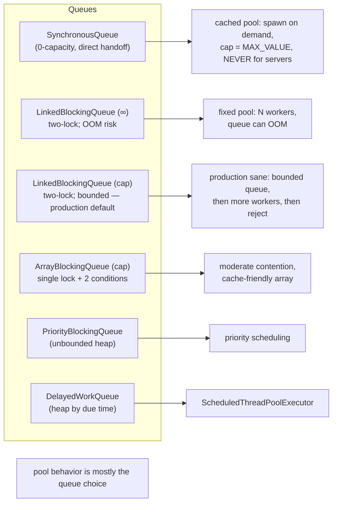

## Rejection Policies

When step 4 of the flow fires — queue full *and* maxPoolSize reached — the configured `RejectedExecutionHandler` runs. The JDK ships four; you can write your own.

| Handler | Behavior | When to use |
|---------|----------|-------------|
| **`AbortPolicy`** (default) | throws `RejectedExecutionException` | callers must handle / retry / report. Surface failure loudly. |
| **`CallerRunsPolicy`** | runs the task *on the calling thread* | natural backpressure — the submitter is itself blocked, slowing the producer. Great for offload pipelines. |
| **`DiscardPolicy`** | silently drops the task | rarely correct (silent data loss) — only for non-critical telemetry, metrics |
| **`DiscardOldestPolicy`** | drops the head of the queue, retries `offer` | latest-wins scenarios — UI events, sensor readings where freshness > completeness |

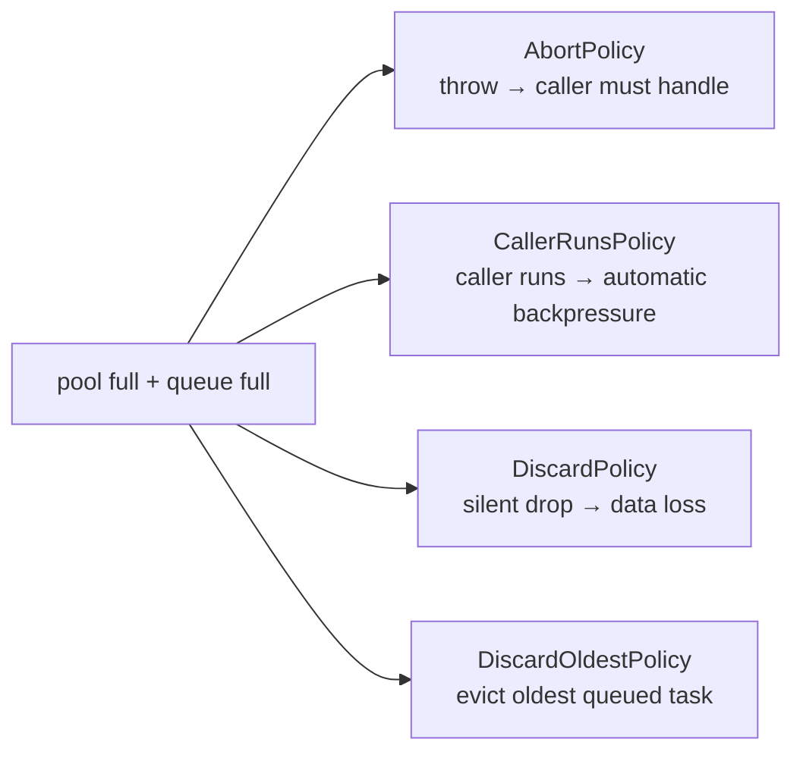

> [!IMPORTANT]
> **`CallerRunsPolicy` is the single best backpressure mechanism in plain `ThreadPoolExecutor`.** It costs nothing extra to wire up, and it does the right thing under sustained overload: when the pool can't keep up, submission *itself* slows down, because the submitting thread is now busy running the task it wanted to offload. Memory does not grow unbounded, downstream stays bounded by the pool's capacity, and the only cost is reduced throughput on the submitter — which is exactly what backpressure *is*. For server-side pipelines that can tolerate latency over crash, this is almost always the right rejection policy.

Custom handlers are one-method classes:

```java
RejectedExecutionHandler timeoutBackoff = (task, executor) -> {
    try {
        if (!executor.getQueue().offer(task, 250, MILLISECONDS)) {
            throw new RejectedExecutionException("backoff timeout");
        }
    } catch (InterruptedException ie) {
        Thread.currentThread().interrupt();
        throw new RejectedExecutionException(ie);
    }
};
```

## `Executors` Factory Methods — Mostly Anti-Patterns in 2026

The `Executors` class ships convenience factories. Each maps to a specific `ThreadPoolExecutor` configuration; almost all carry a footgun.

### `newFixedThreadPool(int n)`

```java
new ThreadPoolExecutor(n, n, 0L, MS, new LinkedBlockingQueue<>());
```

Unbounded queue. **OOM under overload.** Acceptable only if your producer is *strictly* bounded (e.g., reading a finite file).

### `newCachedThreadPool()`

```java
new ThreadPoolExecutor(0, Integer.MAX_VALUE, 60, S, new SynchronousQueue<>());
```

Spawns threads without limit. **OS thread cap exhaustion / OOM via stack reservation** under burst. Acceptable only for short-lived bursty work whose peak rate is *strictly bounded* by something else — almost never true on servers.

### `newSingleThreadExecutor()`

```java
new ThreadPoolExecutor(1, 1, 0L, MS, new LinkedBlockingQueue<>());
```

One worker, unbounded queue. Same OOM risk as `newFixedThreadPool(1)`, plus *cannot* be reconfigured to a bigger pool later (it returns a *wrapper* that hides the underlying `ThreadPoolExecutor`).

### `newScheduledThreadPool(int n)`

```java
new ScheduledThreadPoolExecutor(n);    // queue is DelayedWorkQueue
```

The only factory that's safe to use as-is — its queue is a bounded-in-practice heap, and scheduled-task overflow is rare in normal designs.

### `newWorkStealingPool()` / `newWorkStealingPool(parallelism)`

Returns a `ForkJoinPool` (T13). Different work model (work-stealing deques per worker) — not a `ThreadPoolExecutor`. Good for divide-and-conquer parallel computation; *not* a drop-in for IO-bound submission workloads.

### `newVirtualThreadPerTaskExecutor()` (JDK 21+)

```java
ExecutorService es = Executors.newVirtualThreadPerTaskExecutor();
```

Every `submit`/`execute` spawns a **brand-new virtual thread** (T14). Not a pool — no reuse, no queue, no rejection. The virtual-thread runtime's *carrier pool* (a `ForkJoinPool` sized to `Runtime.availableProcessors()`) handles the actual execution. For blocking-IO-heavy workloads, this is the JDK 21+ default. For CPU-bound workloads, prefer a platform-thread pool sized to cores.

> [!WARNING]
> *Joshua Bloch, Effective Java 3rd ed., Item 80:* **"avoid `Executors.newFixedThreadPool` and `newCachedThreadPool` in production server code"** — exactly because both have unbounded resource modes that fail open under overload (OOM or thread explosion). Construct `new ThreadPoolExecutor(...)` directly with a *bounded* queue and a sensible rejection policy. The exception in 2026: `newVirtualThreadPerTaskExecutor()` is safe and idiomatic for IO-bound work; it's the only `Executors`-factory whose use is unambiguously recommended.

## Internals — How `ThreadPoolExecutor` Really Works

The `ThreadPoolExecutor` source is one of the most-studied 1,500 lines in the JDK; it's worth knowing what's in there.

### The `ctl` atomic int — state + count in one word

```java
private final AtomicInteger ctl = new AtomicInteger(ctlOf(RUNNING, 0));

// 3 high bits = runState (one of RUNNING / SHUTDOWN / STOP / TIDYING / TERMINATED)
// 29 low bits = worker count (max ~500 million workers — comfortably more than feasible)

private static final int  COUNT_BITS  = Integer.SIZE - 3;
private static final int  COUNT_MASK  = (1 << COUNT_BITS) - 1;     // 0x1FFF_FFFF
private static final int  RUNNING     = -1 << COUNT_BITS;
private static final int  SHUTDOWN    =  0 << COUNT_BITS;
private static final int  STOP        =  1 << COUNT_BITS;
private static final int  TIDYING     =  2 << COUNT_BITS;
private static final int  TERMINATED  =  3 << COUNT_BITS;

private static int runStateOf(int c)     { return c & ~COUNT_MASK; }
private static int workerCountOf(int c)  { return c &  COUNT_MASK; }
private static int ctlOf(int rs, int wc) { return rs | wc; }
```

Packing both state and worker count into one int means **every** state transition is one CAS — no lock needed for the combination. Increment worker count + check state both happen atomically. This is the same technique `ReentrantLock`'s AQS uses (T08) and the same reason it scales: the contended path is a single CAS, not a critical section.

The state machine:

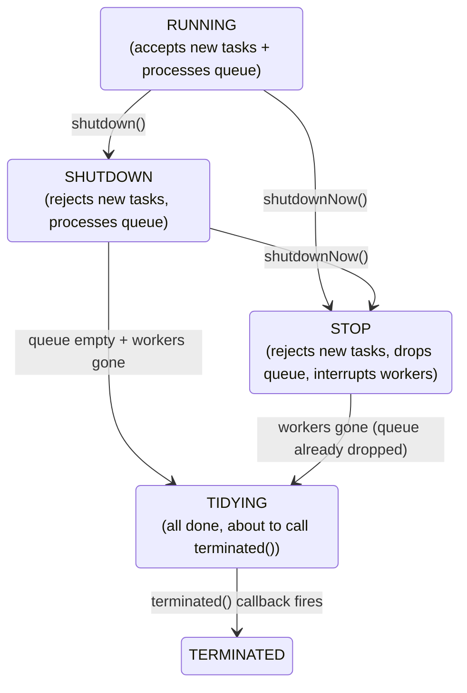

Five states, four transitions, all driven by atomic CAS on `ctl`. The state machine is monotonic — once advanced, it never goes back — which lets `awaitTermination` simply wait on a single `Condition` for `TERMINATED`.

### The `Worker` class — an AQS-backed runnable

Each worker is *not* just a `Thread`; it's a `Worker extends AbstractQueuedSynchronizer implements Runnable`:

```java
private final class Worker extends AbstractQueuedSynchronizer implements Runnable {
    final Thread thread;
    Runnable firstTask;
    volatile long completedTasks;

    Worker(Runnable firstTask) {
        setState(-1);                            // disallow interrupt until runWorker starts
        this.firstTask = firstTask;
        this.thread = getThreadFactory().newThread(this);   // <-- Worker IS the Runnable
    }

    public void run() { runWorker(this); }

    // AQS lock methods: state 0 = unlocked, 1 = locked
    // Used by interruptIdleWorkers to skip currently-running workers (locked)
    protected boolean tryAcquire(int unused) { return compareAndSetState(0, 1) ? (setExclusiveOwnerThread(currentThread()), true) : false; }
    protected boolean tryRelease(int unused) { setExclusiveOwnerThread(null); setState(0); return true; }
}
```

Why does the worker extend AQS? Because `shutdown()` and `shutdownNow()` need to interrupt **only idle workers** (not workers currently running a task — that would interrupt the user's code mid-execution). The AQS lock around each task execution is the signal: if `tryAcquire` succeeds, the worker is idle; if it fails, the worker is mid-task. So `interruptIdleWorkers` iterates the worker set, `tryAcquire`-s each, and interrupts only the ones it could lock. Beautiful reuse of the AQS state bit for a non-mutex purpose.

### The `runWorker` loop

```java
final void runWorker(Worker w) {
    Runnable task = w.firstTask;
    w.firstTask = null;
    w.unlock();                                  // allow interrupts now
    try {
        while (task != null || (task = getTask()) != null) {
            w.lock();
            try {
                beforeExecute(w.thread, task);    // hook
                Throwable thrown = null;
                try { task.run(); }                // <-- run the user task
                catch (Throwable x) { thrown = x; throw x; }
                finally { afterExecute(task, thrown); }  // hook
            } finally {
                task = null;
                w.completedTasks++;
                w.unlock();
            }
        }
    } finally {
        processWorkerExit(w, false);              // dec ctl, possibly trigger TIDYING
    }
}
```

Two details that matter:

1. **`getTask()` is the *only* idle-waiting point in the entire pool.** It polls `workQueue` with `poll(keepAliveTime, unit)` for non-core (or `allowCoreThreadTimeOut=true`) workers, and `take()` (no timeout) for core workers. So worker idle time is implemented as the queue's wait — the futex/Condition machinery from T04. A worker in `WAITING (parking)` on its queue is a worker waiting for work.
2. **`beforeExecute` and `afterExecute` are protected overridable hooks.** Subclass `ThreadPoolExecutor` to log every task, propagate MDC (logging context), instrument metrics, or detect long-running tasks. `afterExecute` receives the task's exception (if any) — *the* place to centralize uncaught-exception logging across a pool.

### Why pool deadlock happens

```java
ExecutorService pool = Executors.newFixedThreadPool(2);
Future<Integer> f1 = pool.submit(() -> {
    Future<Integer> inner = pool.submit(() -> 42);   // submit a child task
    return inner.get();                              // WAIT for the child — but on what thread?
});
f1.get();
```

If `pool` has 2 worker threads and both are blocked in `inner.get()` (waiting for a child task to complete), there are **no workers left to run the child tasks** — and the children sit in the queue forever. Self-deadlock. The fix: never submit dependent tasks to the same bounded pool from inside a task. Use separate pools for parent and child layers, or use `ForkJoinPool` (T13), which is *designed* for this with work-stealing, or use `CompletableFuture` chains (T07) that don't block worker threads.

> [!INTERVIEW]
> "How does `ThreadPoolExecutor` know when to grow vs queue vs reject?" — Walk the four-step submission flow. "Why is `ctl` an atomic int?" — single-CAS state transitions, no extra lock for state-plus-count updates. "Why does `Worker` extend AQS?" — to mark itself locked while running a task, so `shutdown` can interrupt only idle workers without disturbing mid-task ones. "Why is the queue choice the most important configuration?" — because it determines whether step 2 always succeeds (unbounded → OOM), sometimes succeeds (bounded → escalates to step 3 and 4 under pressure), or never succeeds (Synchronous → always goes to step 3).

## `submit`, `Future`, and `FutureTask`

`execute(Runnable)` is fire-and-forget. `submit(...)` adds a return channel:

```java
Future<?> submit(Runnable task);
<T> Future<T> submit(Runnable task, T result);
<T> Future<T> submit(Callable<T> task);
```

All three internally wrap the task in a **`FutureTask`** (which `implements RunnableFuture<T>`, i.e., it's both a `Runnable` and a `Future`). The pool runs the `Runnable` half; the caller gets the `Future` half to query later. T06 covers `Future`/`Callable` exhaustively; the placement here is that **`submit` and `Future` are layered on top of `execute`, not separate machinery** — the pool itself only ever sees `Runnable`s.

The two collection-level methods:

- **`invokeAll(Collection<Callable<T>>)`** — submits all, blocks until all complete (or fail), returns `List<Future<T>>`. Use for parallel fan-out/fan-in.
- **`invokeAll(Collection<Callable<T>>, long timeout, TimeUnit)`** — same, with a total deadline; unfinished tasks are cancelled at timeout.
- **`invokeAny(Collection<Callable<T>>)`** — returns the result of the **first** successful task, cancels the rest. Use for "try several providers; take the fastest."

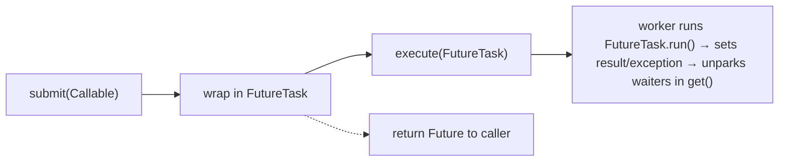

## `ScheduledThreadPoolExecutor` — Time-Driven Work

The scheduled variant overrides the queue with a **`DelayedWorkQueue`** — a binary heap of `RunnableScheduledFuture` ordered by due time. `take()` peeks the head, computes `headDue - now`, and parks for that long via `Condition.awaitNanos`. The pool's workers are otherwise identical to plain `ThreadPoolExecutor`'s.

### `schedule` — one-shot delay

```java
ses.schedule(() -> doIt(), 5, SECONDS);
```

Runs `doIt()` 5 s from now, exactly once.

### `scheduleAtFixedRate` vs `scheduleWithFixedDelay` — the canonical difference

```java
ses.scheduleAtFixedRate(task, 0, 1, SECONDS);    // run at t=0, 1, 2, 3, ... (rate from start time)
ses.scheduleWithFixedDelay(task, 0, 1, SECONDS); // run at t=0; finish; wait 1s; run again ...
```

The famous distinction:

| API | Schedules next run at | Effect if task duration > period |
|-----|----------------------|----------------------------------|
| `scheduleAtFixedRate(t, period)` | **start time + period × n** | runs immediately after each — *no overlap*, but the period is "lost" |
| `scheduleWithFixedDelay(t, delay)` | **end time + delay** | natural spacing; each iteration adds full delay after finish |

```mermaid
gantt
  title scheduleAtFixedRate(period=1s) — task takes 400ms
  dateFormat  s
  axisFormat  %S
  section task
  run 1 :a1, 0, 0.4
  run 2 :a2, 1, 0.4
  run 3 :a3, 2, 0.4
  run 4 :a4, 3, 0.4
```

```mermaid
gantt
  title scheduleWithFixedDelay(delay=1s) — task takes 400ms
  dateFormat  s
  axisFormat  %S
  section task
  run 1 :b1, 0,   0.4
  run 2 :b2, 1.4, 0.4
  run 3 :b3, 2.8, 0.4
  run 4 :b4, 4.2, 0.4
```

> [!IMPORTANT]
> **A periodic task that throws is silently suppressed.** `ScheduledThreadPoolExecutor` catches the exception inside its wrapping `RunnableScheduledFuture`, sets the future's exception, and **does not reschedule**. The next run *never happens*; no log line, no metric. This is the most-bitten bug in the entire scheduler API.
>
> The fix: wrap every periodic task in your own `try/catch (Throwable t) { log.error(...); }` so the exception never escapes to the future:
>
> ```java
> ses.scheduleAtFixedRate(() -> {
>     try { doIt(); }
>     catch (Throwable t) { logger.error("periodic task failed", t); }
> }, 0, 1, SECONDS);
> ```
>
> Equivalently: override `afterExecute(Runnable r, Throwable t)` on the executor and inspect the future for an exception — but the per-task `try/catch` is the only memorable, copy-pasteable defense.

## Sizing the Pool — Brian Goetz's Formula

The textbook (Goetz, *Java Concurrency in Practice*, ch. 8) formula for IO-bound workloads:

```
optimal threads ≈ N_cpu × U_cpu × (1 + W/C)
```

where:

- `N_cpu` = number of cores
- `U_cpu` = target CPU utilization (0..1)
- `W` = wait time (time spent blocked, e.g., on IO)
- `C` = compute time (time spent on CPU)

Two regime extremes:

- **CPU-bound** (`W ≈ 0`): `~N_cpu` threads. Adding more just thrashes the cache; you have no IO to hide behind. The classic recommendation is `N_cpu + 1` — the +1 lets a thread run when another is briefly suspended (page fault, GC pause).
- **IO-bound** (`W >> C`): much higher. A workload spending 90% of its time in IO and 10% on CPU wants ~10×`N_cpu` threads to keep cores saturated. This is the regime where `newFixedThreadPool(200)` exists.

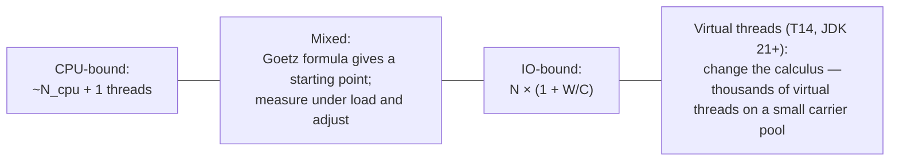

The honest version: the formula gives a *starting point*. Real-world workloads have variable W/C, GC pauses, lock contention, and external rate limits that the formula doesn't model. The practical method: instrument throughput vs pool size, plot the curve, find the inflection. The formula is a Bayesian prior; the load test is the data.

> [!INTERVIEW]
> "How would you size a thread pool for a web server doing database calls?" — The *literal* answer: Goetz formula with `W` = expected DB call latency, `C` = expected handler CPU time per request. The *senior* answer: "I'd start with `2 × N_cpu` as a heuristic, then load-test and tune by measuring 95th-percentile request latency at increasing pool sizes — the right answer is the smallest pool where latency doesn't degrade. And in 2026, I'd reach for virtual threads first; the question only matters if I'm CPU-bound or need explicit concurrency limits."

## `ThreadFactory` — Why Naming Threads Matters

The default `Executors.defaultThreadFactory()` produces threads named `pool-N-thread-M`. Useless. A thread dump full of `pool-3-thread-7` tells you *nothing* about which pool that worker belongs to.

A named factory:

```java
import java.util.concurrent.atomic.AtomicInteger;

class NamedThreadFactory implements ThreadFactory {
    private final String prefix;
    private final boolean daemon;
    private final AtomicInteger seq = new AtomicInteger();

    NamedThreadFactory(String prefix, boolean daemon) {
        this.prefix = prefix; this.daemon = daemon;
    }

    @Override
    public Thread newThread(Runnable r) {
        Thread t = new Thread(r, prefix + "-" + seq.incrementAndGet());
        t.setDaemon(daemon);
        return t;
    }
}

// usage
ExecutorService imagePool = new ThreadPoolExecutor(
    4, 8, 60, SECONDS, new LinkedBlockingQueue<>(1000),
    new NamedThreadFactory("img-resize", true),    // <-- threads named img-resize-1, img-resize-2, ...
    new ThreadPoolExecutor.CallerRunsPolicy());
```

Now a thread dump shows `"img-resize-3"` instead of `"pool-3-thread-7"` — and an oncall engineer at 3 AM can see which subsystem owns which workers. **This is not a stylistic preference; it's a production necessity.**

The `daemon` flag matters too: daemon threads don't keep the JVM alive (T01). Set it `true` for fire-and-forget background pools; leave it `false` (default) when the pool's tasks must run to completion before exit (e.g., a graceful-shutdown manager).

## Lifecycle — Shutdown Done Right

```java
pool.shutdown();                                // stop accepting; finish queued tasks
boolean clean = pool.awaitTermination(30, SECONDS);
if (!clean) {
    pool.shutdownNow();                         // interrupt workers; drop queued
    if (!pool.awaitTermination(5, SECONDS)) {
        logger.warn("pool did not terminate cleanly");
    }
}
```

Five rules for clean shutdown:

1. **Always shut down.** A `ThreadPoolExecutor` whose threads are non-daemon will keep the JVM alive forever. The default factory creates *non-daemon* threads. A common cause of "my CLI hangs at the end."
2. **Two-phase: `shutdown()` then `shutdownNow()`.** First a soft request (let queued tasks finish), then a hard interrupt if the soft request times out.
3. **`shutdownNow()` returns the un-run queue.** If you cared about the queued work, capture the list and replay it later.
4. **`shutdownNow()` *interrupts* workers — it does not stop them.** Workers must cooperate (T02 — interrupt protocol). If your task ignores `InterruptedException` or never checks `isInterrupted()`, `shutdownNow()` won't make it stop.
5. **`awaitTermination` is the only way to know the pool is *really* done.** `isShutdown()` returns `true` immediately after `shutdown()`; `isTerminated()` doesn't return `true` until all workers have exited. Don't confuse them.

## Backpressure — the Real Tuning Question

The pool's configuration *is* its backpressure policy. The four common strategies, with their failure modes:

| Strategy | Queue | Max | Rejection | Behavior under overload |
|----------|------|-----|-----------|-------------------------|
| Unbounded | unbounded | meaningless | n/a | OOM (latent crash) |
| Bounded + Abort | bounded | bounded | `Abort` | caller sees `RejectedExecutionException` — must retry / drop / log |
| Bounded + CallerRuns | bounded | bounded | `CallerRuns` | submitter blocks executing the task; producer naturally slows |
| Bounded + custom timed-offer | bounded | bounded | `offer(t, ms)` then abort | bounded latency, bounded drop, observable failure |

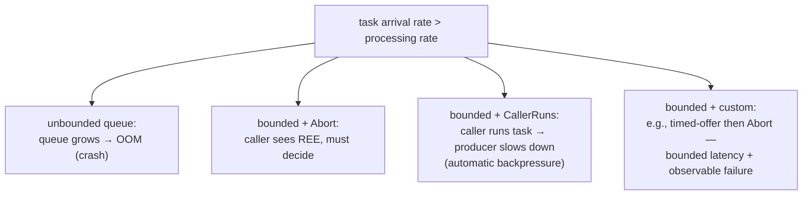

The fundamental choice: **does your caller tolerate slowing down?** Sync request handlers (each request is its own thread) tolerate caller-runs — the request just takes longer. Async event-loops or message-driven systems often *cannot* tolerate it — slowing the event loop creates head-of-line blocking. For those, prefer `Abort` and let the caller decide (`retry`, `route elsewhere`, `drop with metric`).

## Virtual Threads Change the Calculus

JDK 21's virtual threads (T14, JEP 444) re-frame the entire pool sizing conversation. A virtual thread costs ~200 bytes of heap + ~1 KB of growable stack, not 1 MB. A million virtual threads is plausible; a million platform threads is impossible. So for IO-bound work, the answer is no longer "size a pool of N platform threads" — it's "give every task its own virtual thread and let the runtime manage the carriers."

```java
try (var es = Executors.newVirtualThreadPerTaskExecutor()) {
    for (var req : requests) {
        es.submit(() -> handle(req));
    }
}
```

What `newVirtualThreadPerTaskExecutor()` returns is a *different shape* of `ExecutorService`: no queue (every submit spawns), no pool size (unbounded virtual threads — bounded by memory, not threads), no rejection (there's no saturation point in the pool itself). The carriers underneath — the platform-thread `ForkJoinPool` that virtual threads run on — are sized to `Runtime.availableProcessors()` by default.

**What remains true** for thread pools in the virtual-thread era:

- **CPU-bound work still wants a platform-thread pool sized to cores.** Spawning a million virtual threads to do CPU-bound computation just ping-pongs them across the carriers; you want exactly N CPU-bound platform workers.
- **Concurrency limiting is still useful.** A platform-thread pool of `N` is the simplest possible *concurrency limiter* — at most `N` tasks run at once. Useful when downstream resources (a database, a partner API) have their own limits. Virtual threads don't replace this role; for it, use `Semaphore` (T09) gating around a virtual-thread executor instead.
- **Scheduling (`ScheduledExecutorService`) is unchanged.** Periodic tasks remain useful and the scheduler's implementation is orthogonal to whether the work runs on platform or virtual threads.

> [!INTERVIEW]
> "Should I migrate to virtual threads in JDK 21?" — Senior answer: "For IO-bound server workloads, yes — replace `Executors.newFixedThreadPool(200)` with `Executors.newVirtualThreadPerTaskExecutor()` and remove the artificial concurrency cap. For CPU-bound parallel computation, no — keep a platform-thread pool sized to cores. For periodic scheduling, no — `ScheduledThreadPoolExecutor` is unchanged. And on JDK 21–23, audit `synchronized` blocks on hot blocking paths for pinning; **JEP 491 in JDK 24** removes that audit need."

## Observing Pools in Production

### Thread dumps

```text
"img-resize-3" #42 prio=5 daemon ... java.lang.Thread.State: WAITING (parking)
   at jdk.internal.misc.Unsafe.park(Native Method)
   - parking to wait for <0x000000071ab2> (a j.u.c.locks.AbstractQueuedSynchronizer$ConditionObject)
   at j.u.c.LinkedBlockingQueue.take(LinkedBlockingQueue.java:435)
   at j.u.c.ThreadPoolExecutor.getTask(...)
   at j.u.c.ThreadPoolExecutor.runWorker(...)
```

A worker `parking to wait for` a `ConditionObject` deep in `getTask` is **idle**, parked on the queue's `notEmpty` condition. Many workers in this state = pool is over-provisioned. None of them in this state, with the queue backing up = pool is under-provisioned.

### JFR

`jdk.ThreadPoolExecutor` is not a JFR event — but JFR's `jdk.JavaMonitorWait`, `jdk.JavaMonitorEnter`, and `jdk.ThreadPark` reveal time spent parked in `getTask`, contending on queue locks, and parked in user code respectively. Cross-pool comparison of those is more diagnostic than any single thread-count metric.

### `ThreadPoolExecutor` runtime metrics

The pool exposes `getActiveCount()`, `getPoolSize()`, `getLargestPoolSize()`, `getCompletedTaskCount()`, `getTaskCount()`, `getQueue().size()`. Wire them to your metrics system; the **queue size** and **active count** are the two that flag overload first. (Note: `getActiveCount` is approximate — it walks the worker set without locking.)

```java
Gauge.builder("pool.queue.size", pool, p -> p.getQueue().size()).register(registry);
Gauge.builder("pool.active",     pool, ThreadPoolExecutor::getActiveCount).register(registry);
Gauge.builder("pool.size",       pool, ThreadPoolExecutor::getPoolSize).register(registry);
```

## Common Mistakes

### Using `Executors.newFixedThreadPool` or `newCachedThreadPool` in production

Unbounded queue (fixed) or unbounded thread spawn (cached). Both fail open under overload. Construct `ThreadPoolExecutor` directly with bounded resources and an explicit rejection policy.

### Submitting dependent tasks to the same bounded pool

```java
ExecutorService pool = ...;  // bounded
pool.submit(() -> {
    Future<X> child = pool.submit(...);   // submits to the SAME pool from inside a task
    return child.get();                    // ✗ if all workers are doing this, deadlock
});
```

Worker exhaustion deadlock. Use separate pools by layer, `ForkJoinPool` (T13), or non-blocking composition (`CompletableFuture`, T07).

### Ignoring `Future.get()` exceptions

```java
Future<X> f = pool.submit(task);
X x = f.get();                              // ✗ ExecutionException, InterruptedException — what to do?
```

`get()` throws `ExecutionException` wrapping the task's exception. Catching only `Exception` swallows it; not catching it crashes. Document the exception contract; rethrow as a domain exception, log, retry — but *handle* it. Same for `InterruptedException` (T02 — restore + propagate).

### Forgetting to shut down the pool

A non-daemon pool keeps the JVM alive forever — even if `main` returned. Wrap the pool in `try-with-resources` (JDK 19+ — `ExecutorService` is now `AutoCloseable`, `close()` calls `shutdown()` + `awaitTermination`):

```java
try (var pool = Executors.newFixedThreadPool(4)) {     // JDK 19+
    pool.submit(task);
}                                                       // shutdown + awaitTermination at }
```

Pre-JDK-19, use an explicit `try/finally` with `pool.shutdown()`. Better yet, give the factory `setDaemon(true)` so abnormal exit doesn't hang the process.

### Submitting a `Runnable` whose `run()` throws

Plain `execute(Runnable)` with an uncaught exception triggers the thread's `UncaughtExceptionHandler` (T01) — usually `System.err` and the thread dies; the pool replaces it. With `submit`, the exception is *captured* in the `Future` and is invisible unless someone calls `get()`. This is *the* subtle reason async pipelines lose exceptions: a fire-and-forget `submit` whose task throws produces *no* output. Either always `get()` (and handle the exception), or wrap the task's body in `try/catch` and log.

### `scheduleAtFixedRate` with a task that can throw

Silently suppressed (above). Always wrap periodic-task bodies in `try { ... } catch (Throwable t) { log.error(...); }`.

### Sharing one pool across unrelated subsystems

Two subsystems share one bounded pool; one floods the queue with slow tasks; the other's quick tasks pile up behind them, head-of-line-blocked. *Priority inversion* via a shared resource. Solution: each subsystem owns its own pool (and a `SemaphoreBoundedExecutor` if a subsystem needs internal concurrency limits beyond the pool's size).

### Misusing `CallerRunsPolicy` in an async context

`CallerRunsPolicy` blocks the *submitting* thread to run the task. Fine when the submitter is a request thread that can wait. **Wrong** when the submitter is an event loop, an NIO selector thread, or a `ForkJoinPool` worker doing work-stealing — slowing those threads doesn't just slow throughput, it stalls every other task they should be doing. Verify the submitter context before choosing `CallerRuns`.

## Practice

1. **Reproduce the four-step flow.** Build a `ThreadPoolExecutor(2, 5, 10, SECONDS, new LinkedBlockingQueue<>(3), factory, AbortPolicy)`. Submit 1, then 10, then 20 tasks in bursts; print queue size, active count, pool size, and rejected count at each step. Trace each task's path through the four-step flow.
2. **Show `newFixedThreadPool` OOM.** Submit ever-larger objects to a `newFixedThreadPool(1)` from a tight loop without consuming them. Watch the heap fill. Replace with a *bounded* `LinkedBlockingQueue`; observe `RejectedExecutionException` instead of OOM.
3. **The pool-deadlock pattern.** With `newFixedThreadPool(2)`, submit a task that submits a *child* task to the same pool and `.get()`s it. Run 2 such tasks concurrently; observe the hang. Take a thread dump; identify the two workers blocked in `Future.get()` waiting for a child task with no worker to run it.
4. **Periodic-task suppression.** `scheduleAtFixedRate` a task that throws every 5th iteration. Run for 30 s; observe the silent stop after the first throw. Wrap the body in `try/catch (Throwable)`; rerun; confirm continued execution.
5. **`fixedRate` vs `fixedDelay`.** Schedule a task that takes 200 ms with `fixedRate(0, 1, SECONDS)` and (separately) `fixedDelay(0, 1, SECONDS)`. Record start timestamps; plot the two. Confirm the rate version starts at 0/1/2/3 s and the delay version at 0/1.2/2.4/3.6 s.
6. **Named thread factory in a thread dump.** Configure two pools with named factories (`img-resize`, `db-write`). Submit blocking tasks to both. Take a `jstack`; verify thread names show the pool of origin. Then strip the factories; observe how unreadable the dump becomes.
7. **`CallerRunsPolicy` backpressure measurement.** Build a producer-consumer where the producer is a tight loop and the consumer is slow. With `Abort`, measure how quickly the producer fails. With `CallerRuns`, measure how the producer's throughput drops to the consumer's rate. Plot both.
8. **`ctl` packing.** Read the `java.util.concurrent.ThreadPoolExecutor` source (it's only ~1,500 lines; this is a worthwhile evening). Confirm `runStateOf`, `workerCountOf`, `ctlOf` are pure bit-ops. Search the source for every `ctl.compareAndSet` and explain what each transition does.
9. **`Worker` AQS reuse.** Confirm — via the source — that `Worker.tryAcquire` is used only by `interruptIdleWorkers`, and not as a general mutex. Why does the worker's AQS state default to `-1` instead of `0` in the constructor?
10. **Hook injection.** Subclass `ThreadPoolExecutor`; override `beforeExecute` to start a per-task timer, `afterExecute` to record the elapsed time + any exception. Wire to a metrics registry. Verify task-level p95/p99 latency comes out cleanly.
11. **`shutdownNow` doesn't stop uninterruptible tasks.** Submit a task with an infinite `while(true)` body that doesn't check `isInterrupted()`. Call `shutdownNow()`. Confirm the task keeps running (the interrupt is set but ignored). Modify the task to check `Thread.interrupted()`; confirm it now stops.
12. **Virtual-thread executor comparison.** Implement an IO-bound workload (10,000 HTTP calls) two ways: `newFixedThreadPool(100)` and `newVirtualThreadPerTaskExecutor()`. Measure total wall time, peak memory, peak OS thread count. The virtual-thread version should be near-equal in throughput and dramatically lower in OS-thread count.

## Recap

You should now be able to:

- Defend **why a pool exists**: thread creation is ~50–100 µs and 1 MB; reuse amortizes; *and* a bounded pool *bounds* concurrency, a value that survives even into the virtual-thread era.
- Place the four core interfaces — `Executor`, `ExecutorService`, `ScheduledExecutorService` — and their concrete implementations (`ThreadPoolExecutor`, `ScheduledThreadPoolExecutor`, `ForkJoinPool`, the virtual-thread executor).
- Recite the **seven `ThreadPoolExecutor` parameters** and the **four-step submission flow** (core → queue → max → reject), and predict any pool's behavior under load from {core, max, queue}.
- Choose **`BlockingQueue` strategy by need**: `SynchronousQueue` (direct handoff), `LinkedBlockingQueue` (two-lock, fast under contention; bounded if you don't want OOM), `ArrayBlockingQueue` (single-lock, cache-friendly), `PriorityBlockingQueue` (heap), `DelayedWorkQueue` (scheduler heap by due time).
- Pick the right **rejection policy**: `Abort` (surface failure), `CallerRuns` (natural backpressure for sync submitters), `Discard`/`DiscardOldest` (only for non-critical streams), or a custom timed-offer-then-abort hybrid.
- Diagnose **the `Executors` factory anti-patterns** — `newFixedThreadPool` (unbounded queue → OOM) and `newCachedThreadPool` (unbounded threads → thread/memory exhaustion) — and replace them with `new ThreadPoolExecutor(...)` directly. Recognize `newVirtualThreadPerTaskExecutor()` as the one new safe default.
- Walk through **`ThreadPoolExecutor`'s internals**: the **`ctl` atomic int** packing 3-bit state + 29-bit count for single-CAS transitions; the **five-state machine** (RUNNING → SHUTDOWN/STOP → TIDYING → TERMINATED); the **`Worker` extends AQS** trick for marking mid-task vs idle; the **`runWorker` loop** with `getTask()` as the only idle-park point.
- Understand **`submit` / `Future` / `FutureTask` layering** — `submit` wraps a task in a `FutureTask` (a `RunnableFuture`) so the pool only sees `Runnable`s — and the use of **`invokeAll`/`invokeAny`** for parallel fan-out.
- Explain **`ScheduledThreadPoolExecutor`**: the `DelayedWorkQueue` (heap by due time), `schedule` (one-shot), `scheduleAtFixedRate` (next = start + n×period; runs immediately if late), `scheduleWithFixedDelay` (next = end + delay), and the **silent-suppression bug** for periodic tasks that throw.
- Apply **Goetz's pool-sizing formula** — `N × (1 + W/C)` for IO-bound, `N + 1` for CPU-bound — as a *starting point* for load testing, not a final answer.
- Use a **named `ThreadFactory`** so thread dumps name the pool of origin, and set **`daemon`** appropriately so the pool's lifecycle matches the application's.
- Run a **clean shutdown** (`shutdown()` → `awaitTermination` → `shutdownNow()` → final `awaitTermination`) and explain why pre-JDK-19 code needs `try/finally` and JDK-19+ code can use `try-with-resources`.
- Reason about **backpressure**: unbounded queue → OOM, bounded + abort → caller-handled failure, bounded + caller-runs → automatic producer slowing — and pick by whether the submitter context tolerates slowing.
- Adapt to **virtual threads (JDK 21+)**: `newVirtualThreadPerTaskExecutor` for IO-bound work; *still* a platform-thread pool for CPU-bound parallelism and explicit concurrency limiting; `ScheduledThreadPoolExecutor` unchanged. JEP 491 (JDK 24) removes the prior `synchronized` pinning concern.
- Avoid **the eight common bugs**: unbounded factories in production, dependent-task pool deadlock, `Future.get()` exception silence, forgotten shutdown, `submit` swallowing thrown exceptions, periodic-task throw suppression, shared pool head-of-line blocking, misplaced `CallerRunsPolicy` in async contexts.
- Use the **observability tools**: thread dump showing `LinkedBlockingQueue.take` for idle workers, JFR's `jdk.JavaMonitorWait` for queue-park hotspots, the pool's `getQueue().size()` / `getActiveCount()` exposed as metrics.

## Next

Continue to [Callable & Future](./T06-callable-and-future.md) — the result-bearing side of task submission. We'll dissect `FutureTask`'s state machine (NEW → COMPLETING → NORMAL/EXCEPTIONAL/CANCELLED/INTERRUPTING/INTERRUPTED), the *atomic-result-publication-then-unpark-waiters* idiom, how `get()`'s blocking integrates with `LockSupport.park`, and why `Future.cancel(true)` is the *only* clean way to stop a worker thread holding cooperative-cancellation discipline.
