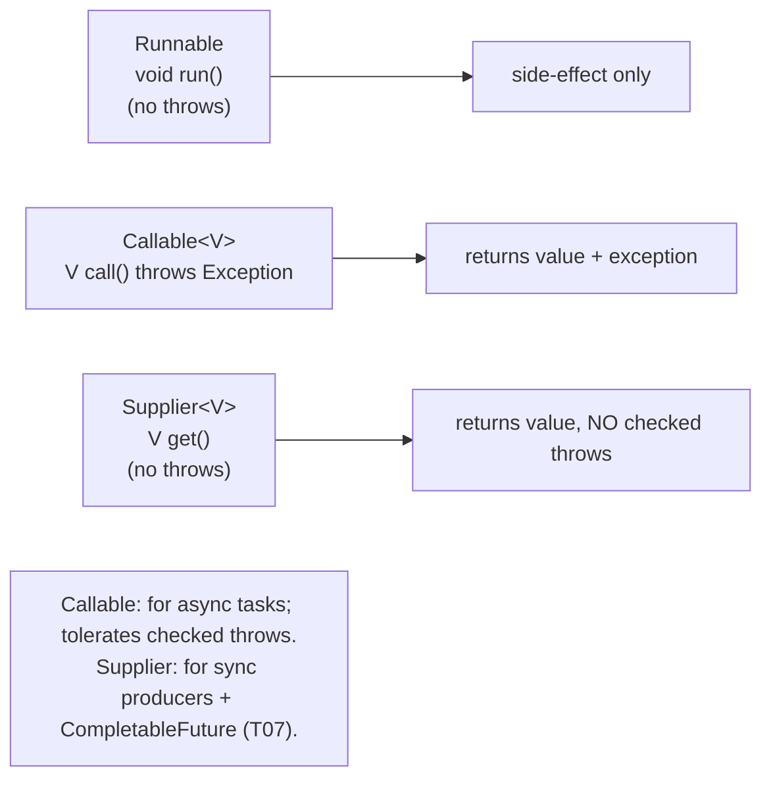
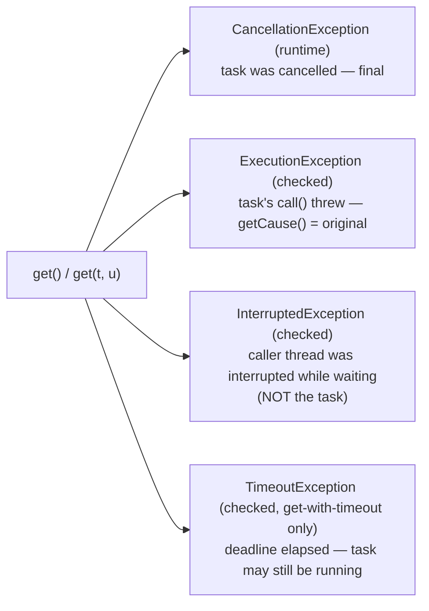
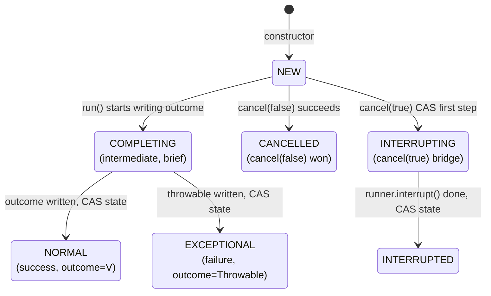
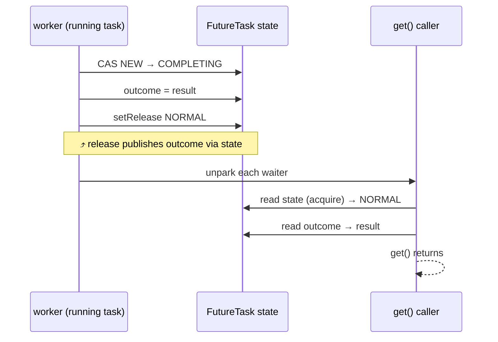
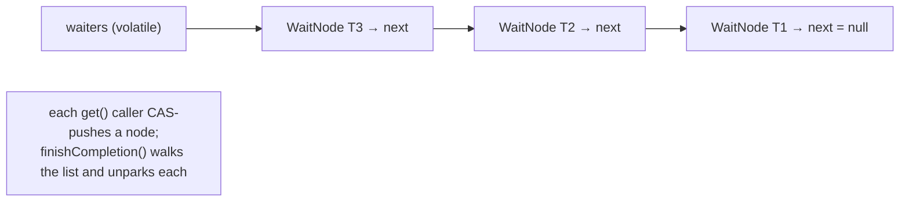

# Callable & Future

`Runnable` lets a task run on someone else's thread but offers no way to *get a result back* and no way to *report an exception*. Production code almost never wants pure fire-and-forget — it wants to dispatch a unit of work, do other things, then come back later and ask "what's the answer?" or "did it fail?" The pair `Callable<V>` + `Future<V>` is the JDK 5 answer: `Callable` is "a `Runnable` with a return value and a checked-exception channel"; `Future` is "a handle you can poll or block on for the result." Together they're the foundation that `ExecutorService.submit(...)` builds on, that every `CompletableFuture` (T07) is layered atop, and that every async API in Spring, Netty, and Reactive Streams ultimately reduces to.

The depth-bar requirement isn't "use `submit` and call `get`." At the **language** layer, `Callable<V>` exists to fix two `Runnable` limitations: no return value, and no checked-exception support — and `Future<V>` exposes a five-method contract whose `get()` couples *blocking* with *exception propagation* through three exception types (`InterruptedException`, `ExecutionException`, `TimeoutException`, plus `CancellationException` at runtime). At the **implementation** layer, `FutureTask<V>` — the concrete class behind every `submit(Callable)` — is a tightly engineered state machine of **seven states**, transitioning by CAS on a single `volatile int state` field, with the task's result *or* exception stored as a `volatile Object outcome` (a union — only one of the two ever lands), waiters parked on a **lock-free Treiber stack of `WaitNode`** entries that the completer walks unparking each. At the **concurrency-mechanics** layer, the *publish-then-wake* idiom — CAS the state from `COMPLETING` to `NORMAL` (release semantics), then unpark every waiter — is the canonical way to publish a result safely without a lock. At the **architecture** layer, `cancel(true)` does *not* stop a running task — it interrupts the runner thread, and only cooperatively-cancelling code (T02) actually halts. The `INTERRUPTING` → `INTERRUPTED` transition exists specifically to handle the race where `run()` is finishing at the moment `cancel` is firing, so the interrupt always lands on the *task's* thread and not the *next* task's. We will cover all four layers, with the FutureTask source as the ground truth.

> [!NOTE]
> Prerequisites: [Executors & thread pools](./T05-executors-and-thread-pools.md) (L3/C01/T05) — `submit(...)` returns `Future` and wraps the task in a `FutureTask`; [wait / notify / notifyAll](./T04-wait-notify-notifyall.md) (L3/C01/T04) — the publish-then-wake mechanics; [Thread lifecycle & states](./T02-thread-lifecycle-and-states.md) (L3/C01/T02) — the interrupt protocol cancel relies on, `LockSupport.park`/`unpark`; [synchronized, monitors & intrinsic locks](./T03-synchronized-monitors-and-intrinsic-locks.md) (L3/C01/T03) — the JMM acquire/release ordering that publishes `outcome`.

## `Callable<V>` — Runnable with a Return Value and an Exception

`Runnable` is the classic "do this":

```java
public interface Runnable {
    void run();
}
```

Two limitations show up the instant a task needs to *produce* something:

1. **No return value.** `void` means the task can only communicate via side effects on shared state — which then needs synchronization to publish safely.
2. **No checked-exception channel.** `run()` cannot `throws Exception`; checked exceptions thrown by code inside must be either caught + handled or re-thrown as `RuntimeException`. This forces try/catch boilerplate at every `Runnable` boundary.

`Callable<V>` fixes both:

```java
@FunctionalInterface
public interface Callable<V> {
    V call() throws Exception;
}
```

`call()` returns a value of declared type `V` *and* may propagate any checked `Exception`. That's the entire interface — one method, generic over result type, exception-permissive — and it's the natural shape for any "run this, give me the result" semantics.



### `Callable` vs `Supplier` — when each fits

`Supplier<V>` (`java.util.function`) has nearly the same shape — `V get()` — but **no checked-exception clause**. The choice between them in API design comes down to *what consumer reads the result*:

- **`Callable` ↔ `ExecutorService.submit(...)`** — the legacy 2004-era API. `submit` returns `Future<V>` whose `get()` already throws `ExecutionException`, so a checked throw from the task body fits naturally in the existing wrapped-exception channel.
- **`Supplier` ↔ `CompletableFuture.supplyAsync(...)`** — the JDK 8 API. `CompletableFuture` doesn't have a checked-exception story; its callbacks expect non-throwing functional interfaces. A `Callable` would force `supplyAsync` to handle two exception families, which the API avoided by taking `Supplier` instead.

In practice, modern code with `CompletableFuture` writes `Supplier`s that catch + wrap (`throw new RuntimeException(e)`) any checked exception inside the lambda; modern code with `ExecutorService.submit` writes `Callable`s and lets `Future.get()` deliver the wrapped checked exception. Both work; neither is wrong; the choice tracks the consumer.

## `Future<V>` — A Handle on Eventual Completion

```java
public interface Future<V> {
    boolean cancel(boolean mayInterruptIfRunning);
    boolean isCancelled();
    boolean isDone();
    V get() throws InterruptedException, ExecutionException;
    V get(long timeout, TimeUnit unit) throws InterruptedException, ExecutionException, TimeoutException;
}
```

Five methods, three checked exception types, plus one runtime exception (`CancellationException`) thrown when `get` is called on an already-cancelled future. Everything `Future` does — and everything every async API built on it does — fits in this surface.

### The five-method contract

- **`cancel(mayInterruptIfRunning)`** — attempts to cancel. Returns `false` if the task is already complete or already cancelled; returns `true` if the cancellation was recorded (the task is now considered cancelled, even if it had not yet started or is still running uninterruptibly).
- **`isCancelled()`** — was `cancel` called and succeeded? `true` after a successful `cancel`. Doesn't tell you whether the task is *finished* running its body.
- **`isDone()`** — has the task reached *any* terminal state — completed normally, completed exceptionally, or been cancelled? `true` if any of those; `false` if still pending or running.
- **`get()`** — blocks the calling thread until the task is done; returns the result or throws. Three things it throws and what they mean: `InterruptedException` — the *calling* thread was interrupted while waiting (not the task's interruption); `ExecutionException` — the task's `call()` threw, wrapped here; `CancellationException` (runtime) — the task was cancelled before completing.
- **`get(timeout, unit)`** — same, with an additional `TimeoutException` if the deadline elapses without completion.

### The four exception types and what each tells you



Two often-confused distinctions:

1. **`InterruptedException` is about the *caller*, not the task.** If you call `future.get()` and *your* thread is interrupted while parked, `get()` throws `InterruptedException`. The task is unaffected — it keeps running on its worker. To cancel the task, you call `future.cancel(true)`; the *task's* runner gets the interrupt that way.
2. **`TimeoutException` is about *time*, not failure.** `get(5, SECONDS)` throwing `TimeoutException` doesn't mean the task failed — it means the task wasn't done within 5 s. The task is still running (or queued); future `get` calls may still succeed. If you don't want it to continue, call `cancel(true)` after the timeout.

```java
try {
    V result = future.get(5, SECONDS);
    // ... use result ...
} catch (TimeoutException te) {
    future.cancel(true);    // we don't want it anymore — interrupt the runner
    throw new ServiceTimeoutException(...);
} catch (ExecutionException ee) {
    Throwable cause = ee.getCause();   // the task's original exception
    // ... rethrow as a domain exception, log, retry, etc ...
} catch (InterruptedException ie) {
    Thread.currentThread().interrupt();   // restore (T02)
    future.cancel(true);                   // *we* were cancelled; clean up
    throw new ServiceCancelledException(ie);
}
```

The four exceptions are not interchangeable — production code needs all four `catch` branches, because each maps to a different recovery action.

### `ExecutionException` — why the JDK wraps every task exception

`Callable.call()` may throw *any* `Throwable` — checked, unchecked, even `Error`. But `Future.get()` must propagate that throwable from a *different* thread than the one that threw it, and Java's checked-exception system doesn't allow `get()` to declare every possible exception type the task body might throw. The JDK's solution: wrap *everything* — checked or unchecked — in `ExecutionException`, which is itself a *single* checked type.

```java
// ExecutionException — what FutureTask uses to wrap
public class ExecutionException extends Exception {
    public ExecutionException(Throwable cause) { super(cause); }
    // ... cause accessible via getCause()
}
```

So `future.get()` declares exactly one checked task-failure exception (`ExecutionException`), the caller writes one `catch` for it, and `getCause()` exposes the original. The cost — one wrapper layer in stack traces — is the price of crossing thread boundaries cleanly.

> [!IMPORTANT]
> `RuntimeException`s thrown by the task are *also* wrapped in `ExecutionException`. A `NullPointerException` inside `call()` becomes `ExecutionException(NullPointerException)`; you cannot catch the original NPE without unwrapping `getCause()`. Skipping that unwrap is a real source of "why isn't my catch firing?" bugs — the catch is for an exception that's now nested inside a wrapper. Always `getCause()` to inspect or re-throw the original.

## `FutureTask` — the Reference Implementation

`FutureTask<V>` is the concrete class behind every `Future` returned from `ExecutorService.submit(...)`. Reading its source — `java.util.concurrent.FutureTask`, ~300 lines — is one of the most rewarding sub-hour deep dives in the JDK; it's a complete, self-contained example of lock-free state-publication + waiter-coordination.

### The class structure

```java
public class FutureTask<V> implements RunnableFuture<V> {
    private volatile int state;                              // the state machine (CAS'd, never locked)
    private static final int NEW          = 0;
    private static final int COMPLETING   = 1;               // intermediate while writing outcome
    private static final int NORMAL       = 2;               // run() completed, outcome = result
    private static final int EXCEPTIONAL  = 3;               // run() threw, outcome = throwable
    private static final int CANCELLED    = 4;               // cancel(false) won
    private static final int INTERRUPTING = 5;               // cancel(true) mid-flight
    private static final int INTERRUPTED  = 6;               // cancel(true) completed

    private Callable<V> callable;                            // the task — nulled on completion
    private Object outcome;                                  // V (state=NORMAL) or Throwable (state=EXCEPTIONAL)
    private volatile Thread runner;                          // thread executing run(); set+nulled here
    private volatile WaitNode waiters;                        // top of the Treiber-stack of get() callers
}
```

The single `volatile int state` field is the locus of every transition; `outcome` holds the result *or* the exception (a union — only one ever lands); `runner` tracks the executing thread so `cancel(true)` can target it; `waiters` is the head of a lock-free linked list of threads parked in `get()`.

`RunnableFuture<V>` is exactly `Runnable + Future<V>` — a marker interface combining both. So a `FutureTask` is *the* `Runnable` the pool runs *and* the `Future` the submitter holds. One object plays both roles.

### The seven-state machine



Five terminal states (`NORMAL`, `EXCEPTIONAL`, `CANCELLED`, `INTERRUPTED`) and two intermediate ones (`COMPLETING`, `INTERRUPTING`) that exist purely to mediate races: the brief moments between *"I'm about to publish the result"* and *"the result is published"*, and between *"I'm about to interrupt the runner"* and *"the interrupt has been delivered."* Each intermediate state pins a specific race window down to one CAS.

### Why the intermediates exist — the two races they close

#### Race 1: `run()` publishing vs `get()` reading

Without `COMPLETING`, the sequence would be: `run()` writes `outcome = result; state = NORMAL`. A reader's `get()` could see `state == NORMAL` (the volatile read provides happens-before) *but* the runtime is allowed to *split* the two stores at the JIT level; aggressive optimisation could reorder them under weak memory models. The intermediate `COMPLETING` state forces the JVM to:

1. CAS state `NEW → COMPLETING` (acquire — claims publish right).
2. Write `outcome = result` (non-volatile, but ordered after step 1).
3. Store-release `state = NORMAL` (release — publishes outcome to readers).

A reader sees `state >= COMPLETING`: if `COMPLETING`, spin briefly (state is about to settle); if `NORMAL`/`EXCEPTIONAL`, read `outcome` with full happens-before from the release-store. The intermediate guarantees that no reader ever sees a final state with a stale `outcome` field.

#### Race 2: `cancel(true)` vs `run()` finishing

Without `INTERRUPTING`, the sequence would be: cancel reads `runner`, calls `runner.interrupt()`, then CAS state to `CANCELLED`. But `runner` is `volatile Thread`, and `run()` *clears* it at exit. A race: cancel reads `runner == T1`, but T1 is now mid-exit and is about to run a *different* task next. cancel's `interrupt()` lands on T1 while it's running task #2 — a wrong-task interrupt.

The fix: cancel first CAS state `NEW → INTERRUPTING` (so `run()` will see it on its way out and know to wait for the interrupt). Then read `runner` and call `interrupt()`. Then CAS state `INTERRUPTING → INTERRUPTED`. Meanwhile, `run()`'s finally block sees state ≥ `INTERRUPTING`, spins until state is `INTERRUPTED`, then exits — guaranteeing the interrupt lands while this task's body is still considered "running" and not after.

```java
// run() — abridged
public void run() {
    if (state != NEW || !RUNNER.compareAndSet(this, null, Thread.currentThread())) return;
    try {
        Callable<V> c = callable;
        if (c != null && state == NEW) {
            V result;
            try {
                result = c.call();
                set(result);                         // CAS NEW → COMPLETING → NORMAL, outcome=result
            } catch (Throwable ex) {
                setException(ex);                    // CAS NEW → COMPLETING → EXCEPTIONAL, outcome=ex
            }
        }
    } finally {
        runner = null;
        // handle race with cancel(true)
        int s = state;
        if (s >= INTERRUPTING) handlePossibleCancellationInterrupt(s);  // wait for INTERRUPTED
    }
}

private void handlePossibleCancellationInterrupt(int s) {
    if (s == INTERRUPTING)
        while (state == INTERRUPTING)
            Thread.yield();                          // spin briefly; cancel(true) is mid-interrupt
}
```

This is a beautiful piece of engineering: the runner thread *waits* for cancel to finish its interrupt before letting itself be "free" — the interrupt lands while this `FutureTask`'s body is logically "the runner," not after.

## Atomic Publish-Then-Wake — `set()` and `setException()`

```java
protected void set(V v) {
    if (STATE.compareAndSet(this, NEW, COMPLETING)) {     // claim publish right
        outcome = v;
        STATE.setRelease(this, NORMAL);                    // release-store: publish outcome
        finishCompletion();                                // walk waiters and unpark
    }
}

protected void setException(Throwable t) {
    if (STATE.compareAndSet(this, NEW, COMPLETING)) {
        outcome = t;
        STATE.setRelease(this, EXCEPTIONAL);
        finishCompletion();
    }
}
```

Three steps, all of which must be in order:

1. **CAS state `NEW → COMPLETING`** — only one thread wins this CAS; subsequent calls (or a racing `cancel`) see a non-`NEW` state and skip publishing.
2. **Plain write to `outcome`** — no fence needed; protected by the release-store that follows.
3. **`setRelease(state, NORMAL)`** — a *release* store that makes `outcome`'s write visible to any reader that subsequently does an *acquire* load of `state`. This is the publish.

Then `finishCompletion()` walks the waiter stack and unparks every waiting thread. The atomicity that matters: a waiter that sees `state >= COMPLETING` knows the publish-right has been claimed; a waiter that sees `state >= NORMAL` knows the outcome is published; the gap between is a tight `Thread.yield()` spin (microseconds at most) for any reader that arrived during the intermediate state.



## `get()` — Park on a Treiber Stack of Waiters

When a caller calls `get()` and the task isn't done, the caller is *parked* on a stack-allocated `WaitNode` linked into the task's `waiters` list — the same pattern AQS (T08) uses for its condition queue, and the same pattern T04's `_WaitSet` uses inside an `ObjectMonitor`.

### The `WaitNode` and its stack

```java
static final class WaitNode {
    volatile Thread thread;       // the parked waiter; nulled when removed
    volatile WaitNode next;        // next node toward the tail
    WaitNode() { thread = Thread.currentThread(); }
}
```

The `waiters` field is the head of a lock-free **Treiber stack** — pushes happen at the head with a CAS, pops happen by walking. Every `get()` caller creates a node and CAS-pushes onto `waiters`; the completer walks the list, unparks each thread, and clears its node.



### The `get()` source — the awaitDone path

```java
public V get() throws InterruptedException, ExecutionException {
    int s = state;
    if (s <= COMPLETING)
        s = awaitDone(false, 0L);                 // park on Treiber stack
    return report(s);                             // return outcome or throw
}

private int awaitDone(boolean timed, long nanos) throws InterruptedException {
    long startTime = 0L;
    WaitNode q = null;
    boolean queued = false;
    for (;;) {
        if (Thread.interrupted()) {                // caller was interrupted
            removeWaiter(q);
            throw new InterruptedException();
        }
        int s = state;
        if (s > COMPLETING) {                       // done — task finished
            if (q != null) q.thread = null;          // unlink myself
            return s;
        } else if (s == COMPLETING) {                // about to publish — yield briefly
            Thread.yield();
        } else if (q == null) {                      // first iteration: build my node
            if (timed && nanos <= 0L) return s;
            q = new WaitNode();
        } else if (!queued) {                        // second iteration: CAS-push it
            queued = WAITERS.weakCompareAndSet(this, q.next = waiters, q);
        } else if (timed) {                           // timed wait
            long remaining = nanos - (System.nanoTime() - startTime);
            if (remaining <= 0L) { removeWaiter(q); return state; }
            LockSupport.parkNanos(this, remaining);
        } else {
            LockSupport.park(this);                  // untimed wait
        }
    }
}
```

The pattern is the classic lock-free-wait-and-check loop:

1. Check `state` — if done, return; if `COMPLETING`, `yield`; if `NEW`, prepare to park.
2. First iteration builds a `WaitNode`; second iteration CAS-pushes it onto the head of `waiters`.
3. Subsequent iterations park (timed or untimed) via `LockSupport`.
4. On wake (notified, interrupted, or spurious), the loop re-checks `state`.

This is **the** canonical way to build a publishable-result primitive: state CAS at the publish boundary + waiter stack + `LockSupport.park` for blocking + outer `for(;;)` loop guarding against spurious wakeups. Every result-bearing primitive in `j.u.c.` follows this shape — `CountDownLatch` (T09), `CyclicBarrier` (T09), `Semaphore` (T09), `CompletableFuture` (T07), `Phaser` — they differ in *what state* they track but not in the *shape* of the publish-and-wait machinery.

### `finishCompletion` — wake everyone, clear the stack

```java
private void finishCompletion() {
    for (WaitNode q; (q = waiters) != null;) {
        if (WAITERS.weakCompareAndSet(this, q, null)) {
            for (;;) {
                Thread t = q.thread;
                if (t != null) { q.thread = null; LockSupport.unpark(t); }
                WaitNode next = q.next;
                if (next == null) break;
                q.next = null;                          // unlink to help GC
                q = next;
            }
            break;
        }
    }
    done();                                              // hook for subclasses
    callable = null;                                      // task reference released
}
```

One CAS to atomically detach the entire `waiters` list (so other concurrent `get()` callers arriving *after* completion don't add to a stale list). Then a plain walk: read each node's thread, null it, `unpark` it. The unpark wakes the parked thread, which loops back in `awaitDone`, sees `state >= COMPLETING`, returns and reports.

### `report` — the outcome reader

```java
private V report(int s) throws ExecutionException {
    Object x = outcome;
    if (s == NORMAL) return (V)x;
    if (s >= CANCELLED) throw new CancellationException();
    throw new ExecutionException((Throwable)x);
}
```

Three terminal cases:

- `NORMAL` → cast outcome to `V`, return.
- `CANCELLED`, `INTERRUPTING`, `INTERRUPTED` → throw `CancellationException` (note: runtime — not declared on `get()`).
- `EXCEPTIONAL` → wrap outcome in `ExecutionException`.

The unchecked cast `(V)x` is safe because `outcome` was written in `set(V v)` typed as `V` — the JVM doesn't verify, but the source contract does.

## `cancel(boolean)` — the Two Modes

```java
public boolean cancel(boolean mayInterruptIfRunning) {
    if (!(state == NEW &&
          STATE.compareAndSet(this, NEW, mayInterruptIfRunning ? INTERRUPTING : CANCELLED)))
        return false;
    try {
        if (mayInterruptIfRunning) {
            try {
                Thread t = runner;
                if (t != null) t.interrupt();
            } finally {
                STATE.setRelease(this, INTERRUPTED);
            }
        }
    } finally {
        finishCompletion();                  // wake any get() callers; they'll throw CancellationException
    }
    return true;
}
```

### `cancel(false)` — soft cancel

CAS state `NEW → CANCELLED`. The task either hasn't started yet (the queued `Runnable` checks `state == NEW` before running and exits if not) or has already started — in which case it runs to completion but **its result is discarded** (the publish path in `set()` will see `state != NEW` and skip). Useful for cancelling queued-but-not-yet-running tasks; useless for actually stopping running ones.

### `cancel(true)` — interrupt the runner

CAS state `NEW → INTERRUPTING`. Then read `runner` and call `interrupt()` on it. Then CAS state `INTERRUPTING → INTERRUPTED`. The interrupt is a *request* (T02) — the task body must cooperatively check it (or be parked in an interruptible blocking call) to actually stop.

```mermaid
sequenceDiagram
  participant C as caller
  participant FT as FutureTask
  participant W as worker (running call())
  C->>FT: cancel(true)
  FT->>FT: CAS NEW → INTERRUPTING
  FT->>W: runner.interrupt()
  Note over W: interrupt FLAG set;<br/>or InterruptedException if parked
  FT->>FT: setRelease INTERRUPTED
  FT->>FT: finishCompletion → unpark waiters
  W->>W: cooperatively notices and exits<br/>(or never notices → cancel was theatre)
```

> [!WARNING]
> **`cancel(true)` does not stop the task. It interrupts the runner.** A task whose body is a tight CPU loop with no `isInterrupted()` check will *ignore* the cancellation entirely — the `Future`'s state changes to `INTERRUPTED`, future `get()`s throw `CancellationException`, but the worker thread keeps spinning and the pool slot stays occupied. **Cancellable tasks must be written to be interruptible.** This is the same cooperative-cancellation rule from T02 (interrupt protocol), applied here at the task level.

### `cancel` after the task is done — the no-op

If `state != NEW` when `cancel` is called, the CAS in the first line fails and the method returns `false`. No state change, no interrupt, no notification. So calling `cancel` after `isDone()` is `true` is harmless but useless.

## `submit(Runnable)` — and Why It Returns `Future<?>`

```java
Future<?> ExecutorService.submit(Runnable task);
<T> Future<T> ExecutorService.submit(Runnable task, T result);
<T> Future<T> ExecutorService.submit(Callable<T> task);
```

The first two overloads take a `Runnable`. Internally `submit(Runnable)` wraps it as `new FutureTask<>(task, null)` — using `FutureTask`'s `(Runnable, V)` constructor that runs the runnable then sets `outcome = V`. So:

- `submit(Runnable)` → `Future<?>` whose `get()` returns `null` (the placeholder result).
- `submit(Runnable, T result)` → `Future<T>` whose `get()` returns the supplied `result` after the runnable completes.

The second variant is useful when you want a result *handle* but the work is naturally `Runnable`-shaped:

```java
StringBuilder buffer = new StringBuilder();
Future<StringBuilder> f = pool.submit(() -> buffer.append("hello"), buffer);
StringBuilder result = f.get();              // returns the same `buffer`, after runnable completes
```

The `Future<?>` from `submit(Runnable)` still serves two real purposes: blocking until the task finishes, and observing whether it threw (via `get()` → `ExecutionException`). A fire-and-forget `execute(Runnable)` *cannot* observe thrown exceptions from the calling site; `submit(Runnable)` can. This is the most-overlooked reason to prefer `submit` over `execute` for any task whose exceptions you'd want to know about.

## `invokeAll` and `invokeAny` — Bulk Submission

`ExecutorService` provides two collection-level submission methods that wrap a fan-out + collect pattern:

```java
<T> List<Future<T>> invokeAll(Collection<? extends Callable<T>> tasks) throws InterruptedException;
<T> List<Future<T>> invokeAll(Collection<? extends Callable<T>> tasks, long timeout, TimeUnit unit) throws InterruptedException;
<T> T              invokeAny(Collection<? extends Callable<T>> tasks) throws InterruptedException, ExecutionException;
<T> T              invokeAny(Collection<? extends Callable<T>> tasks, long timeout, TimeUnit unit) throws InterruptedException, ExecutionException, TimeoutException;
```

### `invokeAll`

Submits all tasks, blocks until *all* have completed (success, failure, or cancellation), returns a `List<Future<T>>` in submission order. The blocking is sequential — `invokeAll` iterates the list calling `Future.get()` on each. So *every* future is done when the method returns, but the futures may complete out of order — `invokeAll` just waits for the slowest.

```java
List<Future<Integer>> futures = pool.invokeAll(List.of(
    () -> service1.fetch(),
    () -> service2.fetch(),
    () -> service3.fetch()
));
for (Future<Integer> f : futures) {
    Integer r = f.get();         // never blocks — already done
    // ...
}
```

The timed variant cancels (via `cancel(true)`) any tasks still unfinished when the deadline elapses, then returns. So the returned list contains a mix of `NORMAL` (succeeded in time), `EXCEPTIONAL` (failed in time), and `INTERRUPTED` (timed out and cancelled) futures.

### `invokeAny`

Returns the result of the **first** task to complete successfully, *cancels the rest*. If every task fails, throws `ExecutionException` wrapping the last failure. Useful for "ask three providers, take the fastest answer":

```java
Quote best = pool.invokeAny(List.of(
    () -> bloomberg.quote(symbol),
    () -> refinitiv.quote(symbol),
    () -> internal.quote(symbol)
));
// the other two requests are cancelled; we have one answer ASAP
```

Internally, `invokeAny` uses an `ExecutorCompletionService` (next section) to wait on whichever future completes first. The cancellation of the losers is a `cancel(true)`, so the losing tasks must be cooperatively interruptible to actually stop — otherwise they continue running uselessly until their natural completion.

## `ExecutorCompletionService` — Process Results as They Arrive

For workloads where you want to *process results in completion order* rather than submission order, the JDK provides `ExecutorCompletionService<V>`:

```java
ExecutorCompletionService<Result> ecs = new ExecutorCompletionService<>(pool);
for (var task : tasks) ecs.submit(task);
for (int i = 0; i < tasks.size(); i++) {
    Future<Result> f = ecs.take();          // blocks until ANY task completes
    process(f.get());                        // handle results in completion order
}
```

`submit` wraps each task to push the resulting future onto an internal `BlockingQueue` *as soon as it completes* — so `take()` returns the next-completed future, blocking only if none has finished yet. The pool itself is unchanged; only the consumer-side iteration is reordered.

This is the standard pattern for "fan out N requests, react to fastest-first" — every successful response can be processed immediately, slow stragglers don't block the early ones, and a partial-result aggregator can decide to stop early (cancel remaining futures) once it has enough.

## CompletableFuture — Preview (T07)

Plain `Future` has one limitation that drives every other async API: **`get()` blocks**. A pipeline of "task A completes, then submit task B (which depends on A's result), then task C (which depends on B's result)" expressed via `Future` looks like:

```java
Future<X> fA = pool.submit(A);
X xa = fA.get();                      // blocks worker thread
Future<Y> fB = pool.submit(() -> B(xa));
Y yb = fB.get();                       // blocks worker thread
Future<Z> fC = pool.submit(() -> C(yb));
Z zc = fC.get();                       // blocks worker thread
```

Three thread-blocking gets, three sequential pool submissions, none of them concurrent. `CompletableFuture<X>` (T07) fixes this by making completions *trigger callbacks* rather than requiring polling:

```java
CompletableFuture.supplyAsync(A, pool)
    .thenApplyAsync(B, pool)
    .thenApplyAsync(C, pool)
    .thenAccept(zc -> render(zc));     // no blocking; callbacks fire as each step completes
```

Same primitives underneath — a state machine, a CAS publish, a waiter stack — but the API offers chaining instead of blocking. `Future` is the floor; `CompletableFuture` is the modern composition layer above it. The mechanics you learned here directly map.

## Virtual Threads + `Future.get()` — JEP 444 Works as Expected

A virtual thread that calls `future.get()` parks via the same `LockSupport.park` path the JDK has always used — and Loom (T14) hooks into `LockSupport.park` to *unmount* the virtual thread from its carrier. So:

- A virtual thread parked in `get()` releases its carrier; the carrier runs other virtual threads.
- When the future completes, `finishCompletion()` calls `LockSupport.unpark(thread)`, the Loom scheduler resubmits the virtual thread, and it remounts (possibly on a different carrier) to return from `get()`.
- The wait costs ~hundreds of bytes of continuation heap, not 1 MB of stack.

This means **every existing `Future.get()`-based code path "just works" with virtual threads** — no rewrite needed. Virtual threads were *designed* to interoperate with the existing blocking-API surface, and `Future.get()` is the canonical blocking API.

The earlier JDK-21-pinning concern (T03/T04 — virtual threads pinned through `synchronized`) does not apply to `Future.get()`: `FutureTask` uses `LockSupport.park`, not `synchronized`, for its waiter parking — by design, because it pre-dates virtual threads and was *already* the lock-free way to build a result-bearing primitive. JEP 491 (JDK 24) made `synchronized` virtual-thread-friendly; `Future.get()` was already that way.

## Common Mistakes

### Catching `Exception` and missing `ExecutionException.getCause()`

```java
try {
    X x = f.get();
} catch (ExecutionException e) {
    log.error("task failed", e);      // ✗ logs the wrapper, not the cause
}
```

The wrapper has a generic stack trace; the cause is the *real* exception. Log `e.getCause()` (and re-throw with cause preserved) so the underlying error is visible.

### Calling `get()` in a tight loop

```java
while (!f.isDone()) { /* busy-wait */ }
X x = f.get();                          // ✗ pegs a CPU for nothing — get() already blocks
```

`get()` is the right way to block; the polling is wasteful. If you want to do other work while waiting, do it explicitly — submit it, then `get()`. Or use `CompletableFuture` callbacks to *not* block at all.

### Assuming `cancel(true)` stops the task

`cancel(true)` only interrupts. The task must cooperate. CPU-bound tasks with no interrupt checks ignore cancellation entirely; future `get()` calls correctly throw `CancellationException`, but the worker thread keeps spinning. Always test that your tasks respect interruption (T02 — the cooperative protocol).

### Cancelling a future you don't own

```java
Future<X> f = downstreamService.beginRequest();
// ... time passes ...
if (timeoutElapsed) f.cancel(true);      // ✗ may interrupt code that doesn't expect it
```

If `downstreamService` returns a `Future` that's running on a *shared* pool worker, cancelling may interrupt that worker mid-task, which the next task on that thread may not handle. Only cancel futures whose interrupt-handling contract you control (or whose tasks you own).

### Storing the result via a side-effecting `Runnable` and ignoring its `Future`

```java
pool.submit(() -> { sharedResult = compute(); });   // ✗ no way to know when sharedResult is valid
// ... use sharedResult somewhere ...
```

The `Future` is discarded; the calling code has no way to know when `sharedResult` is published. Either store the result through the `Future` (`submit(Callable)` → `f.get()`) or use a proper synchronization primitive (`CountDownLatch`, T09).

### `Future.get()` without a timeout in a request-handling path

A request handler that does `f.get()` waits *forever* if the task hangs (network call to an unresponsive service, deadlock, infinite loop). Production code should *always* use `get(timeout, unit)` in request paths, with a sensible deadline tied to the request's own SLA.

### Confusing `InterruptedException` from `get()` with task cancellation

```java
try {
    X x = f.get();
} catch (InterruptedException ie) {
    Thread.currentThread().interrupt();   // restore ✓
    // ✗ but task is still running! cancel it.
}
```

`InterruptedException` from `get()` means *we were interrupted* — not the task. If we don't want the task to keep going on a worker we're abandoning, `f.cancel(true)` it before returning.

### Swallowing the `Future` of a periodic scheduled task

```java
ses.scheduleAtFixedRate(() -> { ... }, 0, 1, SECONDS);   // ✗ ignores the returned Future
```

The returned `Future` is the *only* way to stop the periodic task (`cancel(false)`). Without it, the task runs until the executor shuts down. Always capture the future of `scheduleAtFixedRate`/`scheduleWithFixedDelay` and store it for cancellation.

## Observability

### Thread dump signature

A thread blocked in `Future.get()`:

```text
"caller-1" #15 ... java.lang.Thread.State: WAITING (parking)
   at jdk.internal.misc.Unsafe.park(Native Method)
   - parking to wait for <0x000000071ab2> (a j.u.c.FutureTask)
   at java.util.concurrent.locks.LockSupport.park(LockSupport.java:341)
   at java.util.concurrent.FutureTask.awaitDone(FutureTask.java:506)
   at java.util.concurrent.FutureTask.get(FutureTask.java:190)
   at com.x.Service.handle(Service.java:42)
```

The `parking to wait for <... FutureTask>` line names the specific future. Multiple threads `get`-ing the same future will all appear here; the runner thread (off in the worker pool) is doing the actual work — a thread dump *across* pools is needed to see both sides.

### JFR

`jdk.ThreadPark` events with `parkedClass = FutureTask` show every `get()` block, with duration. Filter and aggregate to find the slowest tasks and which threads are most often blocked waiting — the equivalent of an end-to-end latency breakdown across all your future-based async chains.

> [!INTERVIEW]
> "Walk me through what `submit(callable).get()` does internally." — The senior answer hits all four layers:
>
> 1. **API.** `submit` wraps the `Callable` in a `FutureTask` (which is a `RunnableFuture` — both `Runnable` and `Future`). The pool's `execute` runs the `Runnable` half; the caller holds the `Future` half.
> 2. **State machine.** `FutureTask` has a 7-state machine: `NEW → COMPLETING → NORMAL/EXCEPTIONAL`, plus `CANCELLED` and the `INTERRUPTING → INTERRUPTED` bridge. Transitions are atomic CAS on a single `volatile int state`.
> 3. **Publish-then-wake.** `run()` CAS's `NEW → COMPLETING`, writes the result to `outcome`, release-stores `COMPLETING → NORMAL`. Then walks a lock-free Treiber stack of `WaitNode`s and unparks every waiter via `LockSupport.unpark`.
> 4. **`get()`.** The caller pushes its own `WaitNode` onto the stack and `LockSupport.park`s. On wake, re-checks state, returns outcome (`NORMAL`) or throws `ExecutionException` (`EXCEPTIONAL`) or `CancellationException` (`CANCELLED`/`INTERRUPTED`).
>
> Add the cancel-race detail: `cancel(true)` uses the `INTERRUPTING` bridge so that `run()` can wait for the interrupt to land before letting itself be considered "done," guaranteeing the interrupt targets *this* task's runner and not the next one.

> [!INTERVIEW]
> Short-form Q&A:
>
> 1. **`Runnable` vs `Callable`?** Callable returns `V` and may throw `Exception`; Runnable returns nothing and may throw only unchecked.
> 2. **What does `Future.get()` throw?** `InterruptedException` (caller was interrupted), `ExecutionException` (task threw), `CancellationException` (task was cancelled), plus `TimeoutException` for the timed variant.
> 3. **Why is task exception wrapped in `ExecutionException`?** Because the task's exception is propagated across a thread boundary; the JDK can't declare every possible throw type on `get()`, so it wraps in one checked type.
> 4. **`cancel(true)` vs `cancel(false)`?** `cancel(false)` only stops queued-but-not-yet-running tasks; `cancel(true)` additionally interrupts the runner. Neither stops a task that's running uninterruptibly — interruption is a *request*.
> 5. **What's the state machine of `FutureTask`?** 7 states: `NEW`, `COMPLETING` (brief), `NORMAL`, `EXCEPTIONAL`, `CANCELLED`, `INTERRUPTING` (brief), `INTERRUPTED`. Transitions are CAS on a single `volatile int`.
> 6. **Why does `FutureTask` need an `INTERRUPTING` state?** To close the race between `cancel(true)` reading the runner and `run()` clearing it — the bridge state guarantees the interrupt lands while *this* `FutureTask` still owns the runner, not the next task.
> 7. **How are `get()` callers parked and woken?** Each `get()` pushes a `WaitNode` onto a lock-free Treiber stack (`waiters` field). `finishCompletion` walks the stack and `LockSupport.unpark`s each.
> 8. **Why a Treiber stack and not a queue?** Pushes are CAS-only; the completer is the only walker so order doesn't matter; LIFO is cheaper than FIFO. Same trade-off as `ObjectMonitor._cxq` (T03).
> 9. **What's the relationship between `submit(Runnable)` and `submit(Callable)`?** Both wrap in a `FutureTask`; the `Runnable` variant has a `(Runnable, V result)` constructor that returns the supplied `result` on completion.
> 10. **What's the difference between `invokeAll` and `invokeAny`?** `invokeAll` blocks until *all* tasks finish, returns all futures; `invokeAny` blocks until *one* finishes successfully, cancels the others, returns its result.
> 11. **What's `ExecutorCompletionService`?** Wraps a pool so completed futures arrive on a queue; iterate `take()` to process in completion order rather than submission order — the natural API for fastest-first patterns.
> 12. **What memory ordering publishes the result?** The release-store `state = NORMAL` (with `outcome` already written) pairs with the acquire-load of `state` in `get()` — same release/acquire pattern as `synchronized`, but lock-free.
> 13. **Why doesn't `Future.get()` pin a virtual thread?** Because it parks via `LockSupport.park`, which Loom intercepts to unmount the virtual thread. `synchronized` had the pinning issue (fixed in JEP 491, JDK 24); `Future.get()` never did.
> 14. **What's the relationship between `Future` and `CompletableFuture`?** `CompletableFuture` *implements* `Future` and adds composition (`thenApply`, `thenCompose`, `allOf`, `anyOf`) that lets you chain async operations without blocking on `get()`. Internals are similar — state CAS, waiter stack — but the API is fundamentally different.
> 15. **How do you stop a `FutureTask` whose body is a tight CPU loop?** You can't, without modifying the body to check `Thread.interrupted()`. `cancel(true)` only sets the interrupt flag; uncooperative code ignores it. This is the same cooperative-cancellation rule from T02.

## Practice

1. **Watch the state machine.** Subclass `FutureTask`, override `done()` to print `state` at completion. Submit a normal-completing task, a throwing task, a cancelled-before-run task, and a cancelled-mid-run task. Verify each lands in the right terminal state.
2. **Trace the publish-then-wake.** Submit a slow task; have multiple threads call `f.get()`. Add log lines just before and after each `get()`. Compute the wall-clock delta from the task completion to each caller's return — it should be the unpark-and-runqueue latency, ~microseconds.
3. **Force the COMPLETING window.** Subclass `FutureTask`; insert a `Thread.sleep(10)` between writing `outcome` and the release-store of `state`. Confirm a concurrent `get()` `Thread.yield`s in the `awaitDone` loop while `state == COMPLETING` and then sees `NORMAL`. (Demonstrates the intermediate state in action.)
4. **`cancel(true)` on a non-interruptible task.** Submit a task whose body is `while (true) Math.sin(Math.random());` with no interrupt check. Call `cancel(true)`. Confirm `f.isDone() == true`, `f.get()` throws `CancellationException`, *but* the worker keeps spinning at 100% CPU (visible in `top -H`). Add `if (Thread.interrupted()) break;` to the body; rerun; confirm the task stops.
5. **`InterruptedException` from `get()`.** Have thread A call `f.get()` on a slow task. From thread B, call `A.interrupt()`. Confirm A's `get()` throws `InterruptedException`. *The task on the worker is unaffected* — show its `f.isDone()` becomes true normally after the worker finishes.
6. **`invokeAll` semantics with timeout.** Submit 5 tasks taking 100, 300, 600, 900, 1500 ms via `invokeAll(tasks, 1000, MS)`. Inspect each future's state: tasks 1–3 should be `NORMAL`, tasks 4–5 should be `CANCELLED`/`INTERRUPTED`.
7. **`invokeAny` race.** Submit 3 tasks with different sleep times. `invokeAny`. Confirm the result is from the fastest and that the others were cancelled (instrument with a `cancelled` counter via the runner's interrupt handling).
8. **`ExecutorCompletionService` fastest-first.** Submit 10 tasks with random delays. Process results via `take()`. Confirm the iteration sees them in completion order, not submission order.
9. **`ExecutionException.getCause()` round-trip.** Throw `new IllegalArgumentException("oops")` from a task. Catch `ExecutionException` in `get()`. Verify `e.getCause() instanceof IllegalArgumentException` and `e.getCause().getMessage().equals("oops")`.
10. **Result via `submit(Runnable, T)`.** Build a `StringBuilder`, submit a `Runnable` that appends to it with the builder as the result. Show that `get()` returns the same `StringBuilder` post-modification, and that this is exactly equivalent to writing a `Callable<StringBuilder>` that returns it.
11. **Virtual-thread `Future.get()`.** Launch 10,000 virtual threads, each submitting a 100-ms task to a fixed pool and calling `get()`. Measure the carrier count and confirm it's bounded by `Runtime.availableProcessors()` — the virtual threads unmount during `get()` and the carriers serve millions of parks.
12. **Inspect the `WaitNode` stack.** With a slow task, have 5 threads call `f.get()` concurrently. Mid-wait, take a heap dump; inspect the `FutureTask` instance, walk `waiters` and confirm the 5 nodes are linked head-first (most recent at top — LIFO Treiber stack).

## Recap

You should now be able to:

- Distinguish **`Callable<V>`** (returns `V`, throws `Exception`) from **`Runnable`** (`void`, no checked throws) and **`Supplier<V>`** (returns `V`, no checked throws); pick the right one for `ExecutorService.submit` (`Callable`) vs `CompletableFuture.supplyAsync` (`Supplier`).
- Recite **`Future<V>`'s five-method contract** — `cancel`, `isCancelled`, `isDone`, `get`, `get(timeout, unit)` — and the **four exception types** `get()` can produce: `CancellationException` (runtime), `ExecutionException` (task threw — `getCause` unwraps), `InterruptedException` (the *caller* was interrupted), `TimeoutException` (timed-only).
- Walk through **`FutureTask`'s 7-state machine**: `NEW → COMPLETING → NORMAL/EXCEPTIONAL`, `NEW → CANCELLED`, `NEW → INTERRUPTING → INTERRUPTED`. Explain why **`COMPLETING`** exists (closes the publish race so readers never see a final state without `outcome`) and why **`INTERRUPTING`** exists (closes the runner-clear race so `cancel(true)`'s interrupt lands on *this* task's thread).
- Explain the **atomic publish-then-wake** in `set()`/`setException()`: CAS `NEW → COMPLETING`, write `outcome`, release-store `state = NORMAL`, then `finishCompletion()` walks the **lock-free Treiber stack of `WaitNode`s** and `LockSupport.unpark`s each. This is the canonical shape every `j.u.c.` result-bearing primitive uses.
- Walk through **`get()`** — push a `WaitNode` onto `waiters` via CAS, `LockSupport.park`, re-check `state` on wake (loop guards spurious wakes), `report()` returns outcome or throws.
- Explain **`cancel(false)`** (mark `CANCELLED`; suppress publishing if task is mid-run; can't stop running code) vs **`cancel(true)`** (interrupt the runner; cooperative protocol applies; needs `INTERRUPTING` bridge state).
- State the **cooperative-cancellation rule**: `cancel(true)` interrupts; uncooperative task bodies ignore it; only `Thread.interrupted()` checks or interruptible blocking calls (T02) actually stop the work.
- Explain why **`ExecutionException` wraps every task exception** — to give `get()` one checked exception type across all possible task throws — and why **production code must `getCause()`** to inspect the original.
- Use **`invokeAll`** (block until all complete; futures in submission order; returns mix of states) and **`invokeAny`** (block until one succeeds; cancel the rest; throws if all fail), and the **`ExecutorCompletionService`** pattern for fastest-first processing.
- Choose between **`submit(Runnable)`** (returns `Future<?>` whose `get()` returns `null`; still observes exceptions via `ExecutionException`), **`submit(Runnable, T)`** (`Future<T>` returning the supplied result), and **`submit(Callable<T>)`** (full result + checked-exception).
- Connect to **`CompletableFuture` (T07)** — same state-machine + waiter-stack underneath, but with non-blocking callback composition (`thenApply`, `thenCompose`, `allOf`, `anyOf`) instead of `get()`.
- State the **virtual-thread compatibility**: `Future.get()` parks via `LockSupport.park`, which Loom intercepts to unmount the virtual thread — every existing `get()`-based code path works unchanged with virtual threads, including under JDK 21 (no JEP 491 dependency).
- Avoid the **eight common bugs**: logging the wrapper instead of `getCause()`; busy-waiting on `isDone()`; assuming `cancel(true)` stops the task; cancelling other people's futures; storing results via side effects; `get()` without a timeout in request paths; treating `InterruptedException` from `get()` as task cancellation; swallowing the future returned by `scheduleAtFixedRate`.
- Read **the thread-dump signature** for `Future.get()` (parking on a `FutureTask`) and use **JFR's `jdk.ThreadPark` events** to measure async-wait time across the codebase.

## Next

Continue to [CompletableFuture & async composition](./T07-completablefuture-and-async-composition.md) — the JDK 8 redesign that makes `Future`s composable. We'll dissect the `CompletableFuture` state-machine (similar to `FutureTask` but with completion *stacks* of dependent stages), the difference between `thenApply` (synchronous) and `thenApplyAsync` (re-submit to executor), how `thenCompose` collapses nested futures, the `allOf`/`anyOf` combinators, the *common pool* `ForkJoinPool.commonPool()` problem and how to pass an explicit executor, and why `CompletableFuture.get()` is almost always the wrong API call (you want `.join()` or you don't want to block at all).
