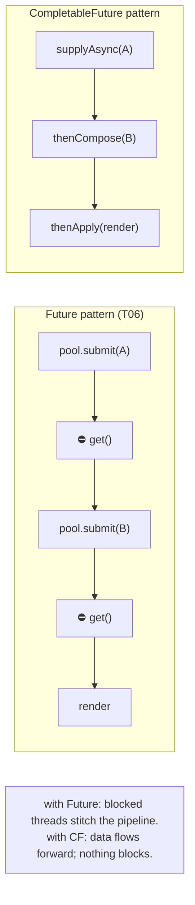
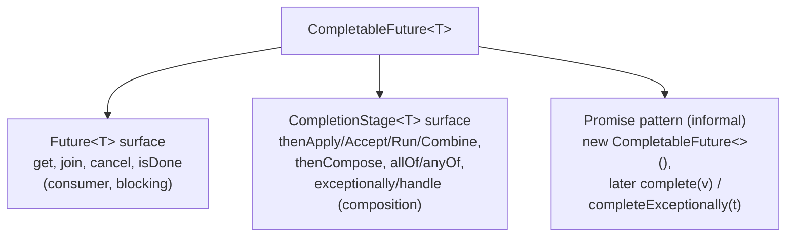
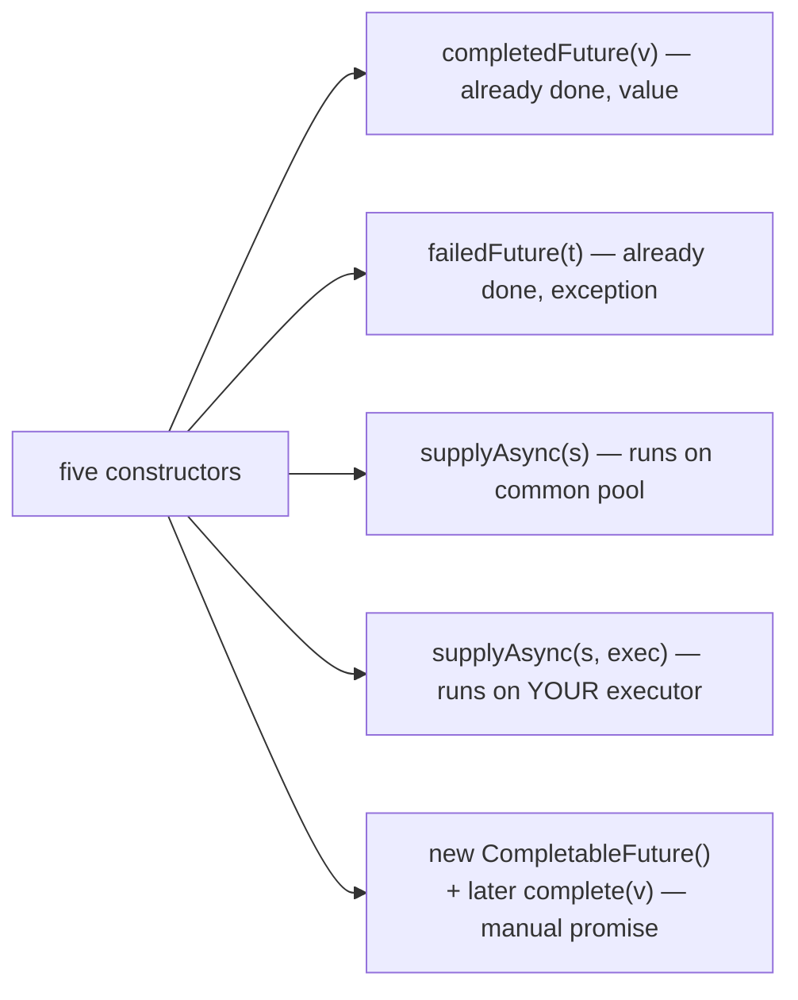
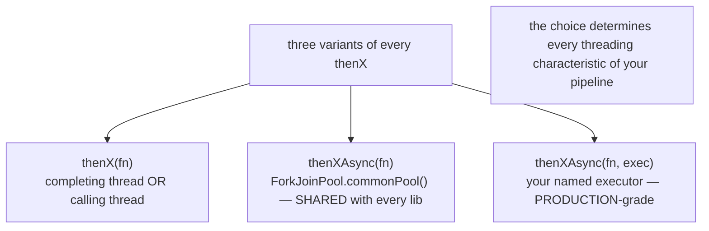
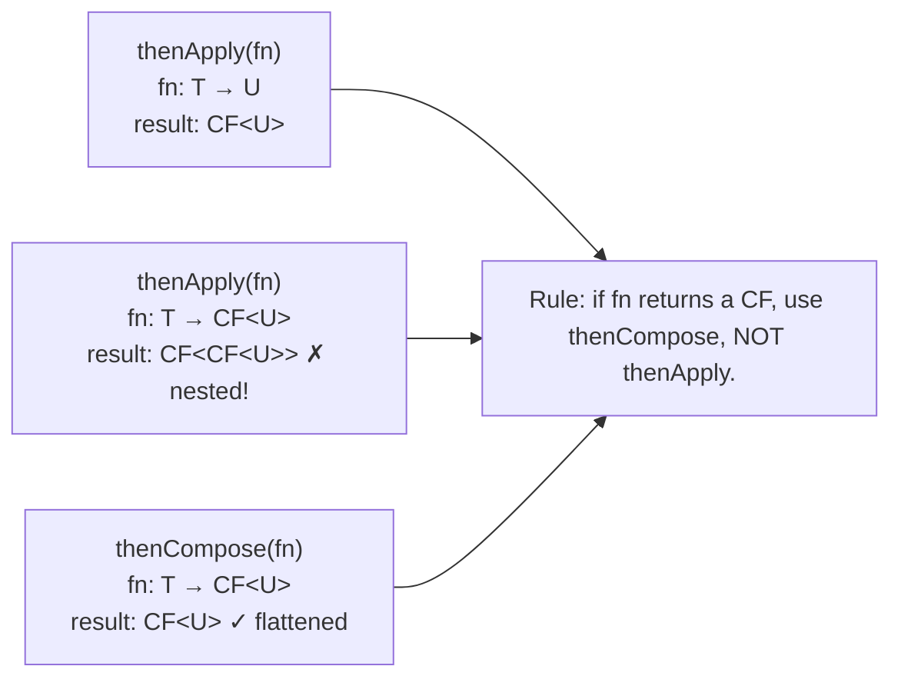
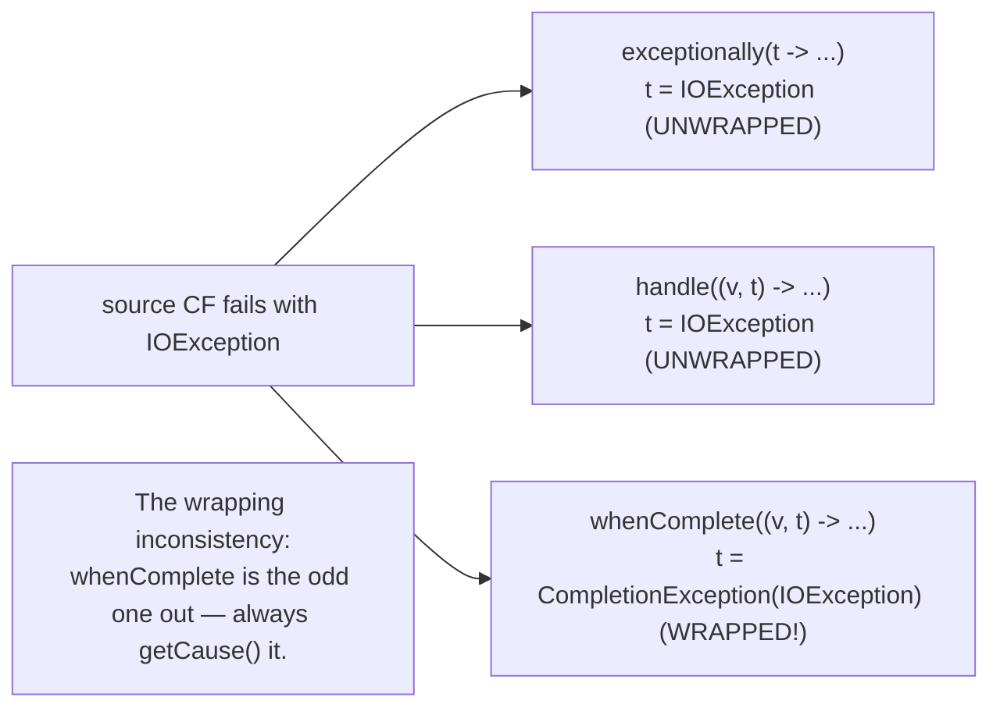
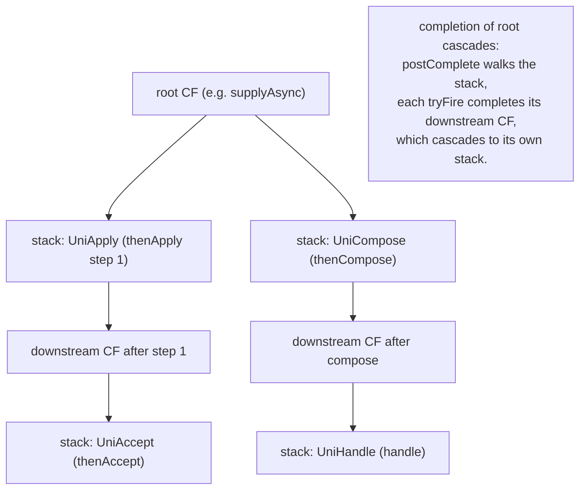

# CompletableFuture & Async Composition

`Future` (T06) lets you submit work and *later* retrieve its result by blocking. That's the right shape for a single one-shot task — but the moment a real workflow has *two or more* async steps that depend on each other ("fetch user → fetch user's orders → render"), `Future` forces you to **block on each step's `get()` to feed the next step's submit**, eating worker threads as expensive bookmark slots and serializing what could be a pipeline. `CompletableFuture` (CF), introduced in JDK 8 by Doug Lea, fixes this: instead of *polling* a result, you *attach a callback* — a continuation — that fires when the prior stage completes, and that continuation itself returns a CF whose own continuations chain further down the line. The result is a graph of async stages connected by data-flow edges, computing in parallel, never blocking a thread to wait for an upstream stage.

The depth-bar requirement isn't "use `thenApply` and `join`." At the **language** layer, `CompletableFuture<T>` implements both `Future<T>` (so it's a drop-in replacement) and `CompletionStage<T>` — the latter contributing ~50 *callback-attaching* methods organized in four families (`thenApply`/`thenAccept`/`thenRun`/`thenCombine`) plus error-handling (`exceptionally`/`handle`/`whenComplete`) plus the *crucial* `thenCompose` (monadic flatMap that prevents nested CFs). At the **execution** layer, every method has *three* variants — `thenApply(fn)` runs the callback **on whichever thread completed the source** (or the calling thread if already complete), `thenApplyAsync(fn)` *re-submits* the callback to the **common ForkJoinPool**, and `thenApplyAsync(fn, executor)` submits to a *named* executor — and the choice between them determines every threading characteristic of your pipeline, including the famous **common-pool footgun** (blocking I/O on the common pool steals capacity from every library in the JVM). At the **internals** layer, CF stores its state in *one* `volatile Object result` field — null while incomplete, the value on success, an `AltResult(throwable)` on failure — and chains dependencies via a **lock-free Treiber stack of `Completion` objects** (one of ~30 subclasses, each encoding "what to do when the source finishes"), where completion is a CAS publish of `result` followed by walking the stack and firing each completion. At the **failure-mode** layer, `cancel(true)` on a CF only completes *this* stage with `CancellationException` and propagates *downstream*; upstream tasks keep running — a real limitation that pushes serious code toward structured concurrency (JEP 462, T15). We will cover all four layers.

> [!NOTE]
> Prerequisites: [Callable & Future](./T06-callable-and-future.md) (L3/C01/T06) — `Future` contract, `FutureTask`'s publish-then-wake (same pattern, smaller scope); [Executors & thread pools](./T05-executors-and-thread-pools.md) (L3/C01/T05) — pools and the `*Async(fn, executor)` variants; [wait / notify / notifyAll](./T04-wait-notify-notifyall.md) (L3/C01/T04) — `LockSupport.park`-based waiter machinery; [Thread lifecycle & states](./T02-thread-lifecycle-and-states.md) (L3/C01/T02) — the `WAITING (parking)` state CF waiters sit in.

## Why CompletableFuture — the Cost of `Future.get()` Chains

A two-step async pipeline with plain `Future`:

```java
Future<User> userF      = pool.submit(() -> db.fetchUser(id));
User user               = userF.get();                          // ⛔ BLOCKS this thread
Future<List<Order>> ordF = pool.submit(() -> db.fetchOrders(user));
List<Order> orders      = ordF.get();                            // ⛔ BLOCKS this thread again
return render(user, orders);
```

Two blocks. If this runs inside a request handler, each block holds the request thread *and* the worker pool's thread waiting on it. At scale — thousands of concurrent requests — the blocking dominates: pools size up to absurd numbers to compensate, queues overflow, OOM follows. The fundamental problem is that `Future.get()` is *the only way* to thread a result from step *n* into step *n+1*, and `get()` is blocking by design.

`CompletableFuture` makes the data flow *direct*:

```java
return CompletableFuture
    .supplyAsync(() -> db.fetchUser(id), pool)
    .thenComposeAsync(user -> CompletableFuture
        .supplyAsync(() -> db.fetchOrders(user), pool)
        .thenApply(orders -> render(user, orders)),
        pool);
```

Each stage's result is *fed forward* as the argument to the next stage's callback. No thread blocks waiting for the previous stage — the JVM, on completion, just *calls* the next stage's function with the value. The caller never blocks; the pool's worker that ran step 1 either runs step 2 directly (sync mode) or hands it off to be picked up later (async mode). The pipeline can fan out (one CF feeds two), fan in (two CFs combine into one), bail out (an exception skips to a recovery handler) — all without a single blocked thread.



> [!INTERVIEW]
> "Why CompletableFuture over plain Future?" — Two reasons: **(1) Composition without blocking** — callbacks chain stages so threads aren't held hostage waiting for prior results. **(2) Combinators** — `allOf` / `anyOf` / `thenCombine` express fan-out/fan-in declaratively, where with `Future` you'd hand-write the coordination. The single biggest pitfall to mention: the *default* async executor is `ForkJoinPool.commonPool()`, which is sized to (cores−1) and *shared by every library in the JVM* — never run blocking I/O on it.

## The Dual Nature — Future + Promise + CompletionStage

`CompletableFuture<T>` implements **two** interfaces, giving it two complementary public surfaces:

```java
public class CompletableFuture<T> implements Future<T>, CompletionStage<T> { ... }
```

- **`Future<T>`** — the T06 contract: `get`, `cancel`, `isDone`. Lets *consumers* block-and-poll the way every JDK-5 async code does. This is the *consumer* side.
- **`CompletionStage<T>`** — the ~50-method callback-attaching interface introduced with CF in JDK 8. Lets *consumers* attach continuations (`thenApply`, `thenAccept`, ...) that fire on completion. This is the *composition* side.

A third role isn't an interface but a *usage pattern*: **CompletableFuture as a Promise**. You construct an empty `new CompletableFuture<>()`, hand it to a consumer, and *later* — from any thread — call `cf.complete(value)` or `cf.completeExceptionally(throwable)`. The consumer's attached callbacks fire as if the CF had been async-computed. This is how callback-style async APIs (Netty's `Future`, Kafka's `send` callbacks, Spring's `WebClient`) bridge to the CompletableFuture world.



Most code touches the `CompletionStage` surface heavily, the `Future` surface lightly (one `get()` or `join()` at the outermost boundary), and the promise pattern only when bridging non-CF async APIs. The three roles unified in one class is what makes CF the universal async glue in the JDK.

## Five Ways to Get a `CompletableFuture`

```java
// 1. Already-completed — pre-computed value
CompletableFuture<String> ok   = CompletableFuture.completedFuture("hi");

// 2. Already-failed — pre-computed exception (JDK 9+)
CompletableFuture<String> bad  = CompletableFuture.failedFuture(new IOException("boom"));

// 3. Async — Supplier runs on common pool
CompletableFuture<String> a    = CompletableFuture.supplyAsync(() -> fetch());

// 4. Async on named executor — Supplier runs on YOUR pool
CompletableFuture<String> b    = CompletableFuture.supplyAsync(() -> fetch(), myPool);

// 5. Manual promise — construct empty; complete later
CompletableFuture<String> p    = new CompletableFuture<>();
someAsyncApi.onResult(p::complete, p::completeExceptionally);
return p;
```

`runAsync(Runnable [, executor])` is the no-result variant — returns `CompletableFuture<Void>` (the void here is *unit*, not "no value" — it does signal completion). Use `runAsync` when the side effect is the point and there's no value to thread forward.



## The Four Method Families

Most of CF's ~50 `CompletionStage` methods follow the same pattern: take a function whose signature describes how to use the upstream value, attach it as a callback, return a new CF representing the downstream result. The four families differ by *what shape function* you pass:

| Family | Function | Downstream type | Used for |
|--------|---------|-----------------|----------|
| **`thenApply(Function<T,U>)`** | `T → U` | `CF<U>` | transform value |
| **`thenAccept(Consumer<T>)`** | `T → void` | `CF<Void>` | consume value (final side effect) |
| **`thenRun(Runnable)`** | `() → void` | `CF<Void>` | run after, ignore value |
| **`thenCompose(Function<T,CF<U>>)`** | `T → CF<U>` | `CF<U>` (flat) | flatMap — chain async-returning calls |

Plus three **combining** families that join two CFs into one:

| Combining family | Function | Downstream type | Used for |
|------------------|----------|-----------------|----------|
| **`thenCombine(other, BiFn<T,U,V>)`** | `(T, U) → V` | `CF<V>` | combine two independent results |
| **`thenAcceptBoth(other, BiCon)`** | `(T, U) → void` | `CF<Void>` | consume both |
| **`runAfterBoth(other, Runnable)`** | `() → void` | `CF<Void>` | run after both, ignore both values |

Plus three **either** families that pick the first of two CFs:

| Either family | Function | Downstream type | Used for |
|---------------|----------|-----------------|----------|
| **`applyToEither(other, Fn<T,U>)`** | `T → U` | `CF<U>` | fastest wins, transform |
| **`acceptEither(other, Consumer)`** | `T → void` | `CF<Void>` | fastest wins, consume |
| **`runAfterEither(other, Runnable)`** | `() → void` | `CF<Void>` | run after either |

And the *aggregate* operations on arrays of CFs:

```java
CompletableFuture.allOf(CF... cfs)   // CF<Void> — completes when all complete (or first fails)
CompletableFuture.anyOf(CF... cfs)   // CF<Object> — completes with first result (success or failure)
```

The unifying mental model: **each method takes a function, attaches it as a continuation, returns a new CF representing the function's eventual result.** Mastering the family means knowing which family fits *which intent* (transform, consume, side-effect, combine, race), and the rest follows.

## Sync vs Async vs Async-with-Executor — the *Crucial* Trio

Every `thenX(fn)` has three variants:

| Variant | When fn runs | On which thread |
|---------|-------------|-----------------|
| `thenX(fn)` | inline — synchronous attachment | **whichever thread completes the source** (or the *calling* thread if source is already complete) |
| `thenXAsync(fn)` | async — submit to executor | **`ForkJoinPool.commonPool()`** |
| `thenXAsync(fn, executor)` | async — submit to named executor | **`executor`** |

The differences matter immensely:

### `thenApply(fn)` — runs on the completing thread (synchronous)

```java
CompletableFuture
    .supplyAsync(() -> step1(), pool)   // runs step1 on a pool worker
    .thenApply(x -> step2(x));           // ⚠ step2 runs on the SAME pool worker (after step1 returns)
```

The pool worker that runs `step1`, immediately after publishing the result, also runs `step2`. No re-submission, no context switch — fast. But if `step2` is slow or blocks, **it holds the worker for the whole duration**, which is exactly the worker-starvation problem CF was meant to avoid.

If `step1` has *already completed* by the time you attach `thenApply`, `step2` runs **synchronously on the calling thread** — surprise!:

```java
var cf = CompletableFuture.completedFuture(42);
cf.thenApply(x -> heavyWork(x));    // ⚠ heavyWork runs on the *current* thread, RIGHT NOW
```

### `thenApplyAsync(fn)` — runs on the common pool

```java
.thenApplyAsync(x -> step2(x));   // step2 always re-submitted to ForkJoinPool.commonPool()
```

Step 2 runs on a *common-pool* worker, freeing the upstream worker immediately. Decoupling is the goal — but the common pool is **shared by every library**.

### `thenApplyAsync(fn, executor)` — runs on YOUR executor

```java
.thenApplyAsync(x -> step2(x), myDedicatedPool);
```

Step 2 runs on `myDedicatedPool`. Explicit, named, contained — this is the *production-grade* form. Almost every CompletableFuture style guide recommends *always pass an explicit executor*.



## The Common-Pool Footgun

`ForkJoinPool.commonPool()` is the JVM-wide shared pool used by:

- Every `thenXAsync(...)` *without* an explicit executor
- Every `supplyAsync(...)` / `runAsync(...)` without an explicit executor
- `parallelStream()` (most parallel-stream computation runs there)
- `CompletableFuture.allOf` / `anyOf` internal coordination

Its size is `Runtime.availableProcessors() - 1` (e.g., 7 on an 8-core machine). The math: it's sized as a *CPU-bound* pool — one worker per core, minus one for the calling thread that may help. That sizing is **correct for CPU-bound parallel work** (the target of `parallelStream`) and **catastrophic for blocking I/O**.

> [!WARNING]
> **Never run blocking I/O on the common pool.** A handful of slow DB calls or HTTP requests via `CompletableFuture.supplyAsync(...)` will pin all 7 common-pool workers; meanwhile every other library in the JVM that uses `parallelStream` or `allOf` is silently stuck waiting for the pool. The symptoms are catastrophic and diagnostic-resistant: throughput collapses, parallel streams run sequentially, JFR shows huge `jdk.ThreadPark` events on common-pool workers — but *your* code looks fine because it just submitted some work.

The fix is one rule: **always pass an explicit executor**. Either the *thenXAsync(fn, executor)* form for every async stage, or wrap a known-blocking operation in a small dedicated pool:

```java
ExecutorService dbPool   = Executors.newFixedThreadPool(20, namedFactory("db"));
ExecutorService httpPool = Executors.newFixedThreadPool(50, namedFactory("http"));

return CompletableFuture
    .supplyAsync(() -> db.fetchUser(id), dbPool)                  // DB → dbPool
    .thenComposeAsync(user -> http.fetchOrders(user.id), httpPool)// HTTP → httpPool
    .thenApply(orders -> render(orders));                          // pure CPU → completing thread is fine
```

The common pool is then reserved for what it was sized for: CPU-bound parallel work and lightweight async coordination.

In JDK 21+, the more modern alternative is `Executors.newVirtualThreadPerTaskExecutor()` — each blocking operation gets its own virtual thread, the common pool stays clean, and the virtual-thread carrier pool (a separate ForkJoinPool sized to cores) handles all the dispatching. We will cover this fully in T14.

## `thenCompose` — the FlatMap That Prevents Nested CFs

The most-confused method in the CF API, and the most important one in pipelines:

```java
CompletableFuture<User>          userCf   = fetchUser(id);
CompletableFuture<List<Order>>   ordersCf = userCf.thenApply(user -> fetchOrders(user));
                                                                         //  ↑ returns a CF
// userCf.thenApply(fn) where fn: User → CompletableFuture<List<Order>>
// result is CompletableFuture<CompletableFuture<List<Order>>>   — NESTED!
```

`thenApply` blindly wraps the function's return value in a new CF — but if the return value is *itself* a CF, you end up with a CF-of-CF, which `get`/`join`/downstream stages will *not* unwrap for you. The result type is the giveaway: `CompletableFuture<CompletableFuture<List<Order>>>` is almost always a mistake.

`thenCompose` is the fix. It *flattens* — the function returns a CF, and `thenCompose` returns that very CF as the next stage:

```java
CompletableFuture<List<Order>> ordersCf =
    userCf.thenCompose(user -> fetchOrders(user));     // returns CF<List<Order>>, NOT CF<CF<...>>
```

This is the *monadic bind* / *flatMap* operation — the same shape as `Optional.flatMap`, `Stream.flatMap`, or Reactor's `Mono.flatMap`. Any time a callback returns an *async* result, use `thenCompose`. Any time a callback returns a *plain value*, use `thenApply`.



## `thenCombine`, `allOf`, `anyOf` — Combining Multiple CFs

### `thenCombine` — two CFs, one downstream

```java
CompletableFuture<User>  userCf  = fetchUser(id);
CompletableFuture<Stats> statsCf = fetchStats(id);

CompletableFuture<Profile> profileCf =
    userCf.thenCombine(statsCf, (user, stats) -> new Profile(user, stats));
```

Both `userCf` and `statsCf` run in parallel; when *both* complete, the BiFunction is called with the two results. The downstream CF holds the combined value. This is exactly the "two independent async calls feeding a render" pattern, expressed cleanly without manual coordination.

### `allOf` — wait for many CFs to all complete

```java
CompletableFuture<Void> all = CompletableFuture.allOf(cf1, cf2, cf3, cf4);
all.thenRun(() -> {
    // every cfN is now done — collect via cfN.join() (won't block; they're done)
    var results = List.of(cf1.join(), cf2.join(), cf3.join(), cf4.join());
});
```

`allOf` returns `CF<Void>` — a *signal* that all done, not the *results*. To get the results, call `.join()` on each individually after `allOf` fires. Combining `allOf` with streams is the idiomatic shape for collecting *N* parallel results:

```java
List<CompletableFuture<X>> futures = ids.stream()
    .map(id -> CompletableFuture.supplyAsync(() -> fetch(id), pool))
    .toList();

CompletableFuture<List<X>> allResults = CompletableFuture
    .allOf(futures.toArray(new CompletableFuture<?>[0]))
    .thenApply(_v -> futures.stream().map(CompletableFuture::join).toList());
```

The pattern: build the list, fan out via `stream().map(...supplyAsync...)`, await via `allOf`, then `join()` each. This is the JDK-8 equivalent of structured concurrency's *fork-and-await*; JEP 462 will make it cleaner (T15).

### `anyOf` — first wins

```java
CompletableFuture<Object> firstWin = CompletableFuture.anyOf(cf1, cf2, cf3);
```

Returns `CF<Object>` (because the CFs may be different types) holding the first result — success or failure. The losers continue running (unless you cancel them); often you'll want a `firstWin.thenAccept(_x -> { cf1.cancel(true); cf2.cancel(true); cf3.cancel(true); })` to release their resources.

For the *typed* variant — all CFs are `CF<T>` and you want a `CF<T>` of the first result — write it yourself with `applyToEither` or use a small helper.

## Error Handling — `exceptionally`, `handle`, `whenComplete`

A failure in any stage propagates downstream as a `CompletionException` wrapping the original cause. Three methods catch and (optionally) recover:

### `exceptionally(Function<Throwable, T>)`

```java
cf.thenApply(this::transform)
  .exceptionally(t -> defaultValue());      // if any upstream failed, recover with defaultValue()
```

Only triggers on failure; on success, passes through unchanged. The `Throwable` parameter is the **unwrapped** cause — if the underlying exception was `IOException`, you receive `IOException`, not `CompletionException(IOException)`. Returns a CF that's `CF<T>` whether the source succeeded or failed.

### `handle(BiFunction<T, Throwable, U>)`

```java
cf.thenApply(this::transform)
  .handle((value, throwable) -> {
      if (throwable != null) { logger.warn("failed", throwable); return fallback(); }
      return value;
  });
```

Fires on *both* success and failure. Receives both `value` (or null on failure) and `throwable` (or null on success — exactly one is non-null) and returns a new value, transforming or recovering. Returns `CF<U>` — the result type may differ from the source's. This is the most general — and most commonly correct — error-handling primitive.

### `whenComplete(BiConsumer<T, Throwable>)`

```java
cf.thenApply(this::transform)
  .whenComplete((value, throwable) -> {
      if (throwable != null) metrics.recordFailure(throwable);
      else metrics.recordSuccess(value);
  });
```

Observes both completion paths without changing the result. Returns a CF with the *same* value (or exception) as the source — useful for logging, metrics, side effects. **If the consumer itself throws, the original exception is *suppressed* and replaced** — an easy mistake.

### The wrapping inconsistency — beware

| Method | Throwable parameter | Throwable wrapping in resulting failure |
|--------|--------------------|-----------------------------------------|
| `exceptionally(fn)` | **unwrapped** (raw cause) | rethrown as `CompletionException(original)` |
| `handle(bifn)` | **unwrapped** (raw cause) | rethrown as `CompletionException(original)` |
| `whenComplete(bicon)` | **wrapped** (the `CompletionException`) | passes through unchanged |
| Downstream `thenApply`/etc. | n/a (callback never fires on failure) | failure propagates as the original `CompletionException` |

That `whenComplete` receives the *wrapped* throwable while `handle`/`exceptionally` receive the *unwrapped* is a famous JDK design wart. The pragmatic rule: when you read the `Throwable` in `whenComplete`, unwrap explicitly via `getCause()` if you need the real exception.



## Timeouts (JDK 9+)

Pre-JDK 9, CF had no built-in timeout mechanism — you had to schedule an explicit `cancel` from a `ScheduledExecutorService`. JDK 9 added two methods:

```java
cf.orTimeout(5, SECONDS);                              // if not complete in 5s, fail with TimeoutException
cf.completeOnTimeout(defaultValue, 5, SECONDS);        // if not complete in 5s, complete with defaultValue
```

Both mutate the receiving CF (they don't return a new one in the chaining sense — well, they *do* return `this` for fluency, but the timeout applies to the same instance).

Internals: CF maintains a static `Delayer` — a private `ScheduledThreadPoolExecutor` with one daemon worker that schedules timeout completions. So calling `orTimeout` is *cheap* (a single delayed task scheduled) but it *does* allocate a `Timeout` task and ties up a slot in the static scheduler. Heavy use (millions of CFs with timeouts) can pressure the delayer; for hot paths, use a dedicated `ScheduledExecutorService` and `cancel` manually.

JDK 9 also added `CompletableFuture.delayedExecutor(t, unit)` — an `Executor` that delays each submitted task by the given duration. Useful for retry-with-backoff patterns:

```java
return CompletableFuture
    .supplyAsync(this::tryOnce, pool)
    .exceptionallyComposeAsync(t ->
        CompletableFuture.supplyAsync(this::tryOnce,
            CompletableFuture.delayedExecutor(500, MILLISECONDS, pool))
    );
```

## Manual Promise Pattern — Bridging Callback APIs

Many async APIs predate `CompletableFuture` and expose callback registration instead of returning a CF. To bridge them:

```java
public CompletableFuture<HttpResponse> sendAsync(HttpRequest req) {
    CompletableFuture<HttpResponse> promise = new CompletableFuture<>();
    nettyClient.send(req, new Callback() {
        @Override public void onSuccess(HttpResponse resp) {
            promise.complete(resp);
        }
        @Override public void onFailure(Throwable t) {
            promise.completeExceptionally(t);
        }
    });
    return promise;
}
```

The CF is created empty; the Netty callback (running on whatever thread Netty completes I/O on) calls `complete` or `completeExceptionally`. Every subsequent `thenApply`/`thenCompose` the caller attaches will fire on that callback thread (sync mode) or be submitted to an executor (async mode). The CF becomes the *bridge* between the callback world and the composable-future world.

The same pattern flips: `cf.whenComplete((v, t) -> { if (t == null) cb.onSuccess(v); else cb.onFailure(t); })` exposes a CF *as* a callback API for legacy consumers.

## Internals — How a `CompletableFuture` Actually Works

The CF implementation is one file (~3,000 lines), studied less often than `FutureTask`'s 300 lines but worth understanding at the same depth.

### The `result` field — value + signal in one volatile

```java
volatile Object result;        // null while incomplete; T on success; AltResult(throwable) on failure

static final class AltResult {
    final Throwable cause;
    AltResult(Throwable cause) { this.cause = cause; }
}
```

The presence of *any* non-null value in `result` *is* the completion signal. CAS on `result` (from null to value-or-AltResult) is the atomic publish — exactly like `FutureTask`'s `state` field but combining the value channel with the signal:

```java
// the atomic-publish CAS — called by every completion path
final boolean completeValue(T t) {
    return RESULT.compareAndSet(this, null, (t == null) ? NIL : t);
}
final boolean completeThrowable(Throwable x) {
    return RESULT.compareAndSet(this, null, new AltResult(x));
}
```

A "complete with null" needs the sentinel `NIL` (= `new AltResult(null)`) because `null` in `result` means *incomplete*. Edge case worth knowing — `CompletableFuture.completedFuture(null)` stores `NIL`, not `null`.

### The completion stack — Treiber stack of `Completion` objects

```java
volatile Completion stack;     // top of the dependent-stages stack (Treiber stack)

abstract static class Completion {
    volatile Completion next;
    abstract CompletableFuture<?> tryFire(int mode);   // fires when source completes
}
```

Every method like `thenApply` pushes a specific `Completion` subclass onto the source CF's stack. The full taxonomy is ~30 subclasses; the central ones:

| Subclass | Created by | What `tryFire` does |
|----------|-----------|---------------------|
| `UniApply` | `thenApply` | runs `fn(value)`, completes downstream with result |
| `UniAccept` | `thenAccept` | runs `consumer(value)`, completes downstream with `null` |
| `UniRun` | `thenRun` | runs `runnable`, completes downstream with `null` |
| `UniCompose` | `thenCompose` | calls `fn(value)`, threads through the returned CF |
| `UniHandle` | `handle` | runs `bifn(value, throwable)` either way |
| `UniExceptionally` | `exceptionally` | only fires on exception path |
| `UniWhenComplete` | `whenComplete` | runs `bicon`, passes through result |
| `BiApply` | `thenCombine` | needs *both* sources complete |
| `OrApply` | `applyToEither` | needs *either* source complete |
| `AsyncSupply` | `supplyAsync` | the root async task |
| `AsyncRun` | `runAsync` | the root async runnable |
| `Signaller` | `get`/`join` | parks a thread waiting for completion |

When the source completes, `postComplete()` walks the stack, calling `tryFire` on each `Completion`. Each completion typically:

1. CAS the *downstream* CF's `result` to publish the computed value.
2. Walk the downstream's own stack to fire *its* completions.

This is a *tree* of CFs connected by `Completion` edges, and one root completion triggers a cascade down the tree — every dependent stage fires in turn, all on whichever thread is doing the firing (or hopped to executors via `*Async` variants).



### `get` and `join` — park on a `Signaller`

For consumers that *do* want to block, CF's `get`/`join` push a `Signaller` completion that parks the current thread via `LockSupport.park`. On completion, `tryFire` on the `Signaller` unparks the thread, which then reads the published result. Same machinery as `FutureTask`'s waiter stack — same `LockSupport`, same Treiber stack — just dressed up as a `Completion`.

So when a thread is blocked in `cf.join()`, the JVM has pushed a `Signaller` onto `cf.stack`, and the thread is parked exactly like a `FutureTask.WaitNode` waiter from T06.

### `get()` vs `join()` — checked vs unchecked exceptions

```java
T get()  throws InterruptedException, ExecutionException;   // Future contract — checked
T join();                                                    // CompletionStage — unchecked
```

`get()` is the Future-inherited form, throwing `ExecutionException` (checked). `join()` is the CF-specific form, throwing `CompletionException` (runtime). Behaviorally identical otherwise; the difference is **exception ergonomics in lambda contexts**:

```java
List<X> results = futures.stream()
    .map(CompletableFuture::get)      // ✗ doesn't compile — get throws checked
    .toList();

List<X> results = futures.stream()
    .map(CompletableFuture::join)     // ✓ join's exceptions are unchecked
    .toList();
```

In stream pipelines and lambda expressions, `join` is the right call almost every time. Use `get` only when you're *already* in a checked-exception context and want the exception types to match (e.g., interop with older `Future`-returning APIs).

### Cancellation — `cancel` is a one-way local marker

```java
public boolean cancel(boolean mayInterruptIfRunning) {
    boolean cancelled = (result == null) &&
        internalComplete(new AltResult(new CancellationException()));
    postComplete();
    return cancelled || isCancelled();
}
```

`cancel(true)` *only completes this CF* with `CancellationException`. It does *not*:

- Interrupt any upstream task (the `mayInterruptIfRunning` parameter is **ignored** — a famous wart inherited from the `Future` contract).
- Propagate to upstream CFs.
- Stop downstream CFs that haven't fired yet (they'll fire and see the `CancellationException`).

So calling `cancel(true)` on a CF mid-pipeline only "abandons" that branch — the upstream task on the worker thread keeps running, producing a result that's discarded; downstream stages cascade the cancellation. **There is no way to actually stop upstream work via `cf.cancel`.**

For *real* cancellation of an upstream task, you must keep a reference to the underlying `Future` or thread and cancel/interrupt it directly. Or — the modern answer — use **structured concurrency** (JEP 462, T15) whose scope-based cancellation propagates upstream correctly. This is *the* single biggest reason structured concurrency was added.

## Virtual Threads + CompletableFuture

Pass `Executors.newVirtualThreadPerTaskExecutor()` to every `*Async(fn, executor)` call. Each callback runs on its own virtual thread; blocking I/O is cheap; the carrier pool stays bounded. Virtually all the common-pool-footgun concerns evaporate when virtual threads handle the dispatching.

```java
ExecutorService vte = Executors.newVirtualThreadPerTaskExecutor();
CompletableFuture
    .supplyAsync(() -> db.fetchUser(id), vte)
    .thenComposeAsync(user -> http.fetchOrders(user.id), vte)
    .thenApplyAsync(orders -> render(orders), vte);
```

But structured concurrency (T15) is the more idiomatic JDK-21+ shape:

```java
try (var scope = new StructuredTaskScope.ShutdownOnFailure()) {
    var userF   = scope.fork(() -> db.fetchUser(id));
    var statsF  = scope.fork(() -> stats.compute(id));
    scope.join();                       // wait for both; one failure cancels both
    scope.throwIfFailed();
    return render(userF.get(), statsF.get());
}
```

Try-with-resources gives natural cancellation (the scope's `close()` cancels remaining tasks), exception handling propagates the first failure, and the lexical structure makes the data dependencies explicit. CompletableFuture remains useful for *bridging* callback APIs and for the broader `CompletionStage` ecosystem, but for new code structured concurrency is the recommended starting point.

## Common Mistakes

### Blocking I/O on the common pool

```java
CompletableFuture.supplyAsync(() -> http.fetch(url));  // ✗ blocks a common-pool worker; every other library suffers
```

Always pass an executor. Always.

### `thenApply` with a function returning a `CompletableFuture`

```java
cf.thenApply(x -> fetchAsync(x));    // ✗ CF<CF<...>>
cf.thenCompose(x -> fetchAsync(x));  // ✓ CF<...>
```

If your function returns a CF, use `thenCompose`.

### `whenComplete` swallowing exceptions

```java
cf.whenComplete((v, t) -> {
    cleanup();          // ✗ if cleanup() throws, the original exception is replaced
});
```

`whenComplete`'s consumer that throws *replaces* the underlying exception. Always wrap `whenComplete` bodies in `try { ... } catch (Throwable inner) { ... }` if you can't guarantee they won't throw.

### `get` in a request-handler chain without timeout

```java
String result = cf.get();   // ✗ hangs forever if upstream never completes
```

Use `get(t, unit)` or `orTimeout` to bound the wait. Same rule as plain `Future.get` (T06).

### Assuming `cancel(true)` stops upstream

Discussed above. `cancel(true)` only completes this CF locally. Upstream tasks keep running. The "interrupt the runner" semantic of `Future.cancel(true)` is *not* there.

### Mixing `thenApply` (sync) with blocking work

```java
cf.thenApply(x -> http.fetch(x.url));  // ✗ blocks the completing thread (often a common-pool worker)
```

If the function blocks, use `thenApplyAsync(fn, dedicatedPool)`. Sync `thenApply` is for *pure CPU* transformations only.

### Forgetting `exceptionally` and missing failures silently

A CF that fails and has no `exceptionally`/`handle`/`whenComplete` attached *swallows the failure*. The pipeline simply stops at the failing stage; downstream `thenApply` callbacks never fire; nothing logs. The submitter who held the CF never calls `get`/`join` if they're not interested in the result — and silence ensues. Always end a pipeline with `whenComplete` for logging, even if you don't care about the result.

### Calling `complete` after upstream has already failed

```java
CompletableFuture<X> promise = new CompletableFuture<>();
promise.completeExceptionally(new IOException());
promise.complete(value);   // returns false — already complete
```

`complete` and `completeExceptionally` return `false` if the CF was already completed. Whoever wins the CAS sets the result; later callers are silently ignored. Manual-promise code should treat the return value as load-bearing.

### Sharing one executor across CF chains and stream `parallelStream` workloads

The two compete for the same workers. Stream parallel work hogs the pool while CF callbacks queue up, or vice versa. Use *different* executors for different workload kinds — and never let `parallelStream` run on a pool shared with blocking-I/O CF chains.

## Observability

### Thread dump

A `cf.join()` shows:

```text
"caller-1" #15 ... java.lang.Thread.State: WAITING (parking)
   at jdk.internal.misc.Unsafe.park(Native Method)
   at java.util.concurrent.locks.LockSupport.park(LockSupport.java:341)
   at java.util.concurrent.CompletableFuture$Signaller.block(CompletableFuture.java:1864)
   at java.util.concurrent.ForkJoinPool.managedBlock(ForkJoinPool.java:3463)
   at java.util.concurrent.CompletableFuture.waitingGet(CompletableFuture.java:1898)
   at java.util.concurrent.CompletableFuture.join(CompletableFuture.java:2117)
```

The `Signaller.block`/`waitingGet` lines name the wait. The `ForkJoinPool.managedBlock` is the FJP integration — a blocking FJP worker temporarily increases the pool's "compensating thread" count so other work can continue. This is one of the better corners of the JDK design, but it's *only* engaged when the thread blocking is itself an FJP worker, hence: another reason `cf.join()` from an FJP worker (e.g., a parallel stream) is not as catastrophic as it might look — but still avoid it.

### JFR

`jdk.ThreadPark` events on `CompletableFuture$Signaller` show every `get`/`join` wait. Cross-correlate with `jdk.ThreadPoolExecutor` events (T05) to identify pool starvation. The `jdk.ForkJoinPoolStatistics` event reveals common-pool saturation. Together these are the production-grade way to diagnose CF-related latency regressions.

> [!INTERVIEW]
> "Walk me through how `cf.thenApplyAsync(fn).thenAccept(g)` executes." — The senior answer:
>
> 1. **Construction.** `thenApplyAsync(fn)` pushes a `UniApply` Completion onto `cf`'s stack, recording `fn` and the *default async executor* (= `ForkJoinPool.commonPool()`). Creates and returns a new CF `cf2`. `cf2.thenAccept(g)` pushes a `UniAccept` Completion onto `cf2`'s stack, recording `g`. Creates and returns `cf3`.
> 2. **Source completion.** `cf` completes — somehow (its own root computation finished, or someone called `complete(v)`). `postComplete()` walks `cf`'s stack. It finds the `UniApply` and calls `tryFire(ASYNC)`.
> 3. **Async hop.** `UniApply.tryFire(ASYNC)` *submits* itself to the common pool, returns. Now the pool worker picks it up.
> 4. **`fn` execution.** Pool worker calls `fn(cf.value)`. Result is CAS'd into `cf2.result`. `postComplete()` walks `cf2`'s stack, finds `UniAccept`, calls `tryFire`.
> 5. **`g` execution.** `UniAccept.tryFire` (mode SYNC because we're already on a worker thread) calls `g(cf2.value)`. CAS `null` into `cf3.result` (which is `CF<Void>`).
> 6. **End.** `cf3` is complete; no further callbacks; the worker becomes idle.

> [!INTERVIEW]
> Short Q&A:
>
> 1. **`Future` vs `CompletableFuture`?** CF implements `Future` *and* `CompletionStage`. The callback chaining (`thenApply`/etc.) is what `Future` lacks.
> 2. **`thenApply` vs `thenApplyAsync` vs `thenApplyAsync(fn, executor)`?** Sync (completing thread or caller); async on common pool; async on named pool.
> 3. **`thenCompose` vs `thenApply`?** `thenCompose` flattens — use when the function returns a CF. `thenApply` wraps — would produce `CF<CF<...>>` if the function returns a CF.
> 4. **What's the common-pool footgun?** `ForkJoinPool.commonPool` is sized for CPU-bound work and shared JVM-wide. Blocking I/O on it starves every other library.
> 5. **`get()` vs `join()`?** `get` throws checked `ExecutionException`/`InterruptedException`; `join` throws unchecked `CompletionException`/`CancellationException`. Use `join` in lambdas and streams.
> 6. **`exceptionally` vs `handle` vs `whenComplete`?** `exceptionally` triggers on failure only, recovers with a value. `handle` triggers on either, transforms. `whenComplete` observes either, doesn't change. Beware: `whenComplete` receives the *wrapped* `CompletionException`; the others receive the *unwrapped* cause.
> 7. **How does `cancel(true)` work on a CF?** Completes the local CF with `CancellationException`. *Does not* interrupt upstream tasks. Downstream stages cascade the cancellation. This is the famous limitation that drove structured concurrency (T15).
> 8. **What's `allOf`'s return type and how do you collect results?** `CF<Void>`. Collect via `.join()` on each individual CF after `allOf` completes.
> 9. **How is CF implemented internally?** One `volatile Object result` (null = incomplete; value = success; `AltResult(throwable)` = failure). A Treiber stack of `Completion` objects representing downstream stages. Atomic CAS on `result` publishes; `postComplete` walks the stack and fires each `Completion`.
> 10. **What's `orTimeout` in JDK 9?** Schedules a `TimeoutException` to complete the CF if not already done. Uses a static `Delayer` `ScheduledThreadPoolExecutor`.
> 11. **What is the manual promise pattern?** `new CompletableFuture<>()`, hand to consumer, complete from another thread later — bridges callback-based APIs into the CF world.
> 12. **Why does `whenComplete` give you the wrapped exception when `handle`/`exceptionally` unwrap it?** Design wart inherited from JDK 8. Pragmatic rule: `getCause()` in `whenComplete` if you need the original.
> 13. **What's the consequence of mixing `thenApply` (sync) with blocking code?** The blocking code runs on whichever thread completes the source — often a common-pool or upstream-pool worker. The worker is held for the block's duration. Always use `*Async(fn, executor)` for blocking callbacks.
> 14. **How do virtual threads change CF usage?** Pass `newVirtualThreadPerTaskExecutor()` to each `*Async`. Or, ideally, use `StructuredTaskScope` (T15) for new code — explicit scope, scope-based cancellation, no common-pool concerns.
> 15. **What's `delayedExecutor`?** An executor that delays each task by a given duration. Useful for retry-with-backoff. Reuses the static `Delayer`.

## Practice

1. **Two-step pipeline with explicit executor.** Build `supplyAsync → thenCompose → thenApply`. Pass an explicit named executor to each `*Async` call. Verify in a thread dump that no work runs on `ForkJoinPool.commonPool()`.
2. **Common-pool starvation reproduction.** Submit 100 CFs of `supplyAsync(slowHttpCall)` *without* an executor. Concurrently run a `parallelStream` doing CPU work. Measure throughput of the parallel stream; observe collapse. Switch CFs to use an explicit pool; rerun; observe the parallel stream recovers.
3. **`thenApply` vs `thenCompose`.** Write a function `lookup(int id)` returning `CompletableFuture<String>`. Apply via `thenApply` and via `thenCompose`. Print the result types (e.g., via `CompletableFuture<?>` `getClass().getName()` of the inner). Show the `thenApply` version is `CF<CF<String>>` and the `thenCompose` is `CF<String>`.
4. **`allOf` for N parallel results.** Build a list of 10 CFs of `supplyAsync(fetch(i))`. Use `allOf` + `.thenApply(_v -> futures.stream().map(CF::join).toList())`. Verify all fetches happened in parallel via timestamps.
5. **`anyOf` race with cancellation.** Three CFs with random sleeps. `anyOf`. On completion, cancel the other two. Verify the cancelled CFs' `isCancelled()` returns true *but* their underlying `supplyAsync` tasks keep running (you can prove this by counting executions on the pool — they all run, even the cancelled ones).
6. **Error handling round-trip.** Throw inside a stage. Catch with `exceptionally`. Then throw a *different* exception from the `exceptionally` block. Verify it propagates as `CompletionException(SecondException)` to downstream `whenComplete`.
7. **`whenComplete` wrapping gotcha.** Add `whenComplete((v, t) -> System.out.println(t.getClass()))` after a failing stage. Verify it prints `CompletionException`, not the underlying cause. Add `getCause()` to confirm the original.
8. **Manual promise.** Build a "fake async API" that takes a callback. Adapt it to a CF via `new CompletableFuture<>()` + `cb.onSuccess(promise::complete)`. Verify all the CompletionStage methods work on it.
9. **`orTimeout` failure mode.** Submit a CF that will take 10 s. Apply `orTimeout(2, SECONDS)`. Observe `TimeoutException` arrives after 2 s. Then verify the underlying supplier *kept running* to completion — the task ran but its result is discarded.
10. **Mixed pool.** Build a pipeline that uses `dbPool` for the DB call and `httpPool` for the HTTP call. Submit 1000 requests through it; verify each pool's stats — dbPool should be saturated at its size, httpPool similarly, and the common pool should be untouched.
11. **`Signaller` in a thread dump.** Call `join()` from one thread; print a thread dump from another. Verify the joining thread shows `CompletableFuture$Signaller.block` in its parked stack.
12. **Convert to structured concurrency.** Take an existing `allOf`-based fan-out you wrote, rewrite it with `StructuredTaskScope.ShutdownOnFailure` (JDK 21+). Compare exception propagation, cancellation behavior, and readability.

## Recap

You should now be able to:

- State **why `CompletableFuture` exists** — `Future.get()` chains block worker threads to thread results between stages; CF replaces blocking with callback chaining (`CompletionStage`) so data flows forward without holding any thread.
- Recognize the **dual nature**: `Future<T>` (consumer-side blocking surface) + `CompletionStage<T>` (composition surface) + manual-promise pattern (bridge from callback APIs). One class, three roles.
- Build CFs five ways: `completedFuture`, `failedFuture`, `supplyAsync(fn)`, `supplyAsync(fn, executor)`, `new CompletableFuture<>()` + later `complete`.
- Choose between the **four method families** (`thenApply`/`thenAccept`/`thenRun`/`thenCompose`) by the *shape of the function* you have (transform / consume / side-effect / async-returning) and add the **three execution variants** (sync / async-on-common-pool / async-on-named-executor).
- Apply the **golden rule**: pass an explicit executor to every `*Async` call. The default — `ForkJoinPool.commonPool()` — is a shared, CPU-sized resource that blocking I/O will saturate, starving every other library in the JVM.
- Use **`thenCompose`** instead of `thenApply` whenever the callback returns a CF — this is the monadic *flatMap* that prevents `CF<CF<T>>`.
- Combine CFs with **`thenCombine`** (two CFs → BiFn → one CF), **`allOf`** (all done — collect via `.join()` per CF afterward), and **`anyOf`** (first wins — remember to cancel losers).
- Handle errors with **`exceptionally`** (failure-only recovery), **`handle`** (transform either path), and **`whenComplete`** (observe without changing) — and remember the *wrapping inconsistency*: `whenComplete` gets the *wrapped* `CompletionException`; the others get the *unwrapped* cause.
- Bound waits with **`orTimeout`** and **`completeOnTimeout`** (JDK 9+), backed by a static `Delayer` `ScheduledThreadPoolExecutor`. Combine with `delayedExecutor` for backoff patterns.
- Bridge callback APIs via the **manual promise pattern** — `new CompletableFuture<>()`, hand to consumer, complete from another thread when the callback fires.
- Walk through the **internals**: `volatile Object result` (null incomplete; value on success; `AltResult` on failure) doubling as value + signal; a **Treiber stack of `Completion`** objects representing dependent stages; atomic CAS on `result` followed by `postComplete()` walking the stack and firing each `Completion`. `Signaller` is the special completion that parks a thread for `get`/`join`.
- Choose between **`get`** (Future-inherited, checked exceptions, throws `ExecutionException`) and **`join`** (CF-specific, unchecked, throws `CompletionException`). Prefer `join` in streams and lambda contexts.
- Accept the **`cancel(true)` limitation**: it only completes the local CF; does not interrupt or stop upstream tasks. For real cancellation, use structured concurrency (T15).
- Adapt to **virtual threads (JDK 21+)**: pass `Executors.newVirtualThreadPerTaskExecutor()` to every `*Async`; or, preferably, use **`StructuredTaskScope`** (JEP 462, T15) for new code — scope-based cancellation propagates correctly, and the data flow is lexically clear.
- Avoid **the eight common bugs**: blocking I/O on the common pool, `thenApply`-of-CF-returning-fn, `whenComplete` swallowing exceptions, `get`/`join` without timeout in request paths, expecting `cancel(true)` to stop upstream, sync `thenApply` on blocking work, silent failure when no terminal `exceptionally`/`whenComplete`, sharing one executor across CF + parallelStream workloads.
- Diagnose with **thread dumps** (`CompletableFuture$Signaller.block` for joiners) and **JFR** (`jdk.ThreadPark`, `jdk.ForkJoinPoolStatistics`).

## Next

Continue to [Locks (ReentrantLock, ReadWriteLock, StampedLock)](./T08-locks-reentrantlock-readwritelock-stampedlock.md) — the explicit `Lock` API and the `AbstractQueuedSynchronizer` (AQS) framework underneath. We'll dissect AQS's state-and-queue architecture (the same `LockSupport.park` + Treiber-stack-of-nodes pattern used by `FutureTask` and `CompletableFuture`, but generalized into a kit), the fair vs unfair acquisition heuristics, `ReadWriteLock`'s 16+16 bit packed state, `StampedLock`'s optimistic read protocol, and the JDK 24 changes that make `ReentrantLock` and `synchronized` near-equivalent for the common case.
