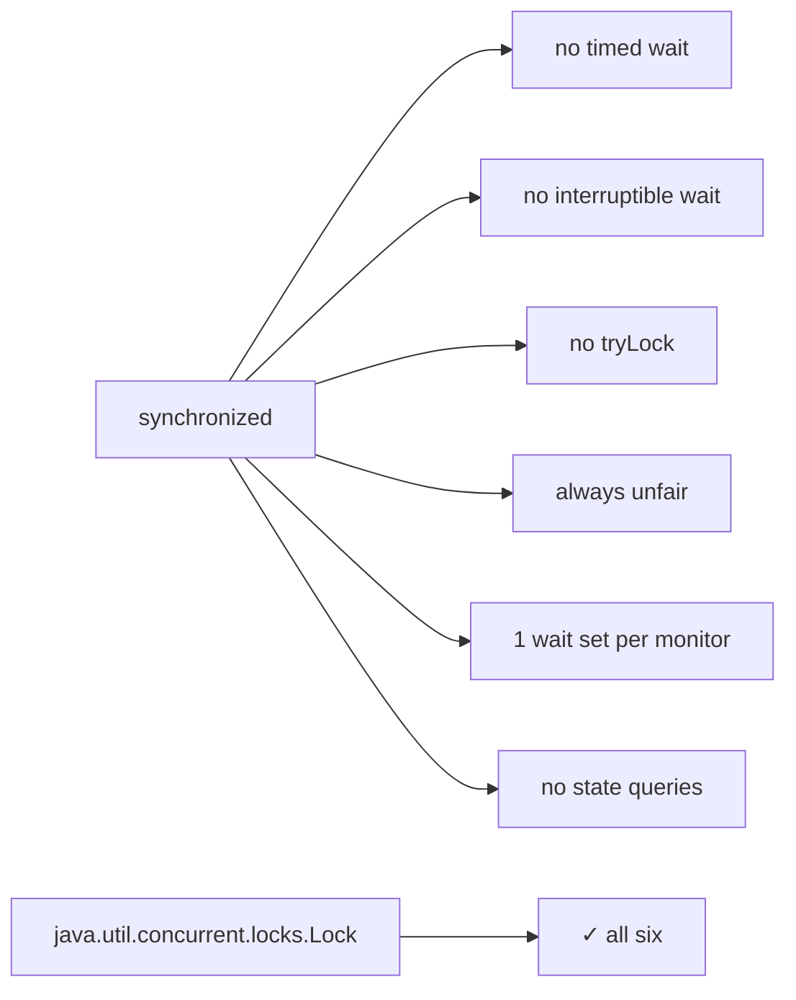
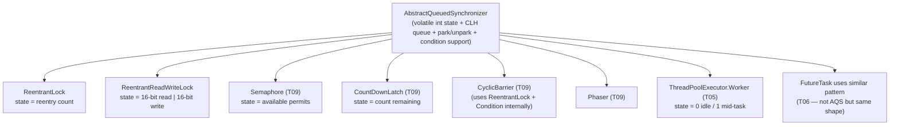
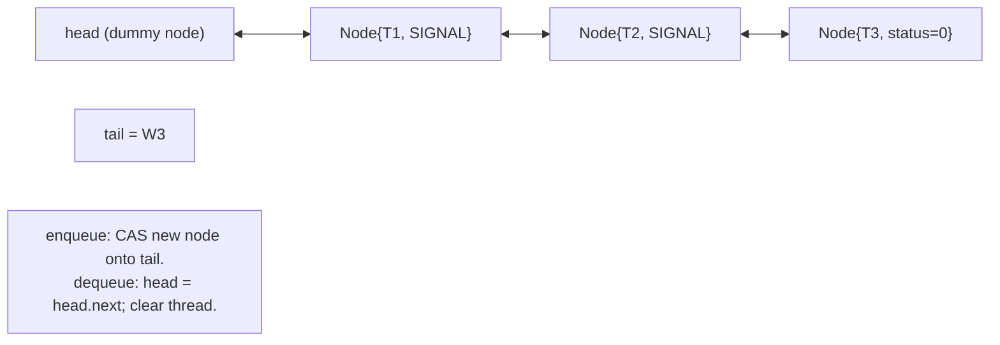
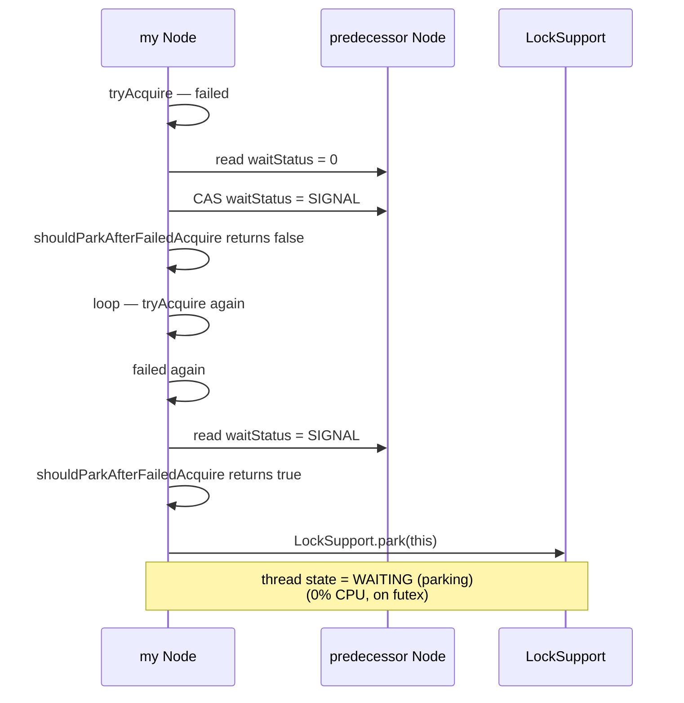
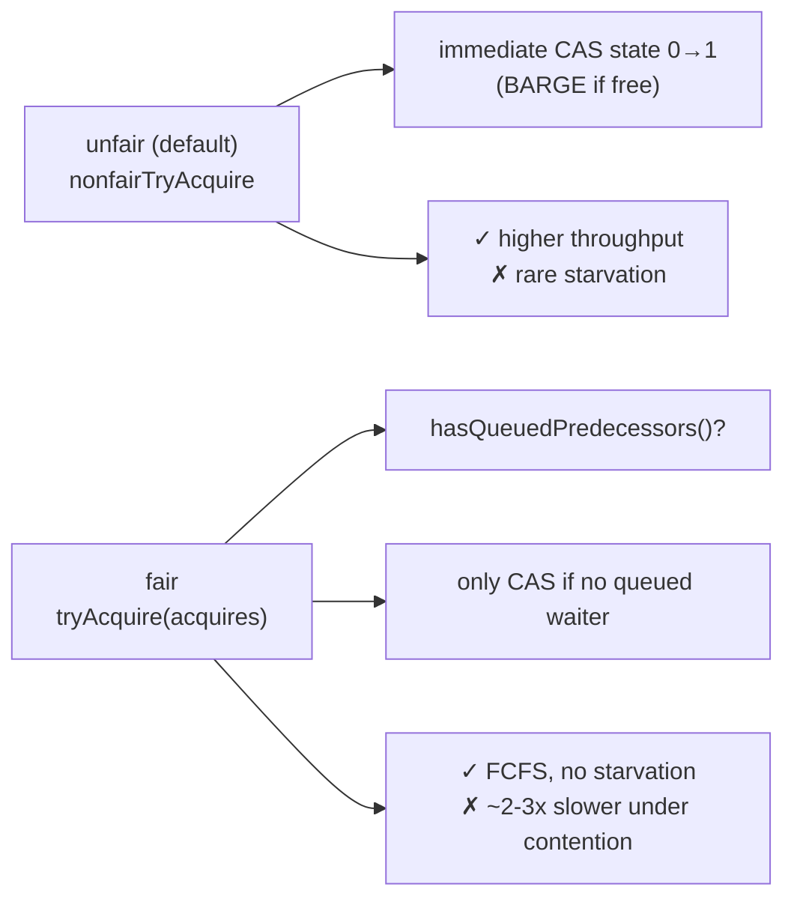
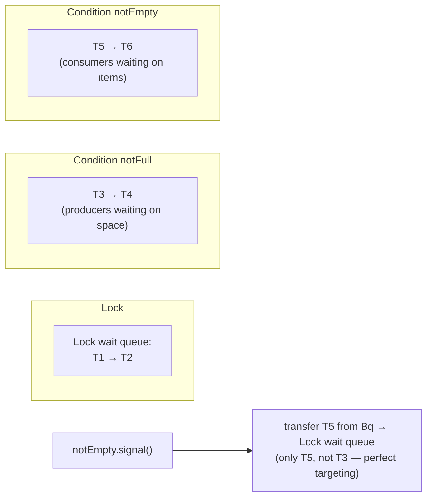
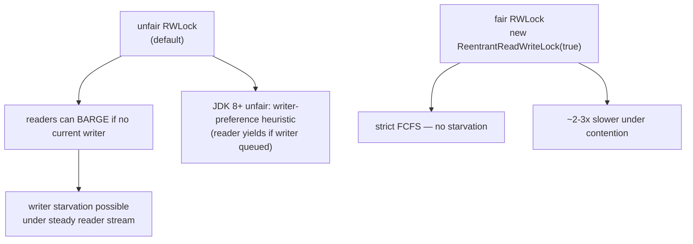
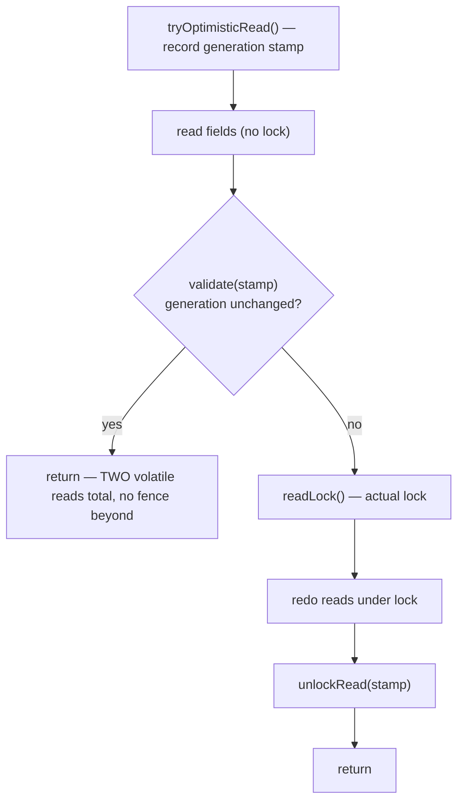
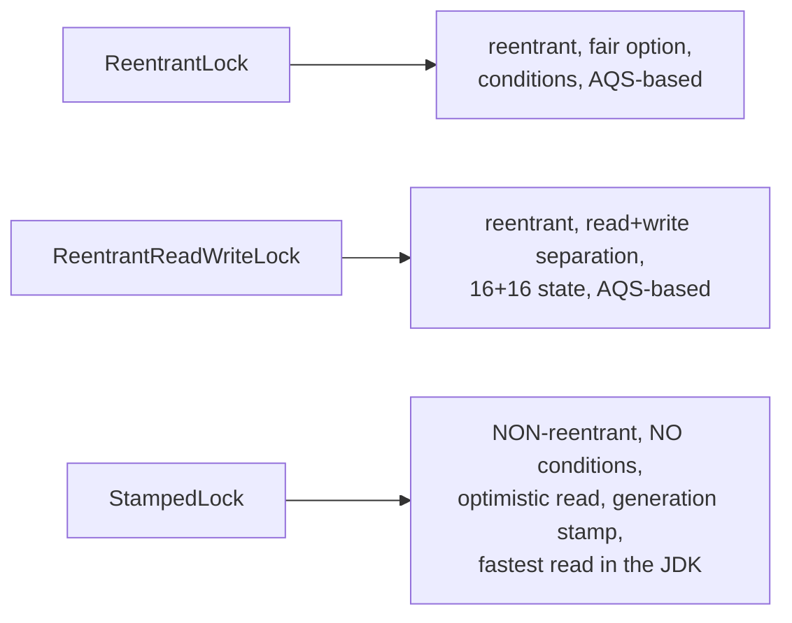

# Locks (ReentrantLock, ReadWriteLock, StampedLock)

`synchronized` (T03) gives you mutual exclusion and JMM happens-before in one keyword — but it pays for that simplicity with rigidity: no timed wait, no interruptibility, no "try-and-give-up," no fairness control, no multiple condition queues per lock, and no programmatic way to query the lock's state. The `java.util.concurrent.locks` package, contributed by Doug Lea for JDK 5, exposes the *same* monitor semantics through a richer API — `Lock`, `ReentrantLock`, `ReentrantReadWriteLock`, `StampedLock` — and, more importantly, builds them all on top of one ingeniously general framework: **`AbstractQueuedSynchronizer`** (AQS), a 2,000-line class that is *the* shared engine behind every lock, latch, semaphore, barrier, and synchronizer in the JDK, plus `FutureTask` (T06), `ThreadPoolExecutor.Worker` (T05), and dozens of third-party libraries.

The depth-bar requirement isn't "call `lock.lock()` and put `lock.unlock()` in a `finally`." At the **language** layer, `Lock` is an interface with six methods — `lock`, `lockInterruptibly`, `tryLock`, `tryLock(timeout)`, `unlock`, `newCondition` — and the discipline rule that *you* are now responsible for the release (the JVM no longer emits an implicit `monitorexit` for you). At the **framework** layer, AQS exposes a single **`volatile int state`** plus a *CLH-style* lock-free FIFO **queue of `Node` objects** that the lock subclass interprets — `ReentrantLock`'s state is "reentry count," `ReentrantReadWriteLock`'s is *two* counts packed into 16+16 bits (reader-count high, writer-count low), `Semaphore`'s is "available permits," `CountDownLatch`'s is "countdown remaining" — and AQS handles every thread queueing, parking, signalling, cancellation, and condition-variable detail with two subclass hooks: `tryAcquire(int)` and `tryRelease(int)`. At the **algorithmic** layer, the acquire path is the famous *lazy-SIGNAL* protocol — `shouldParkAfterFailedAcquire` walks back over CANCELLED predecessors, CAS's the predecessor's status to `SIGNAL`, and only *then* parks via `LockSupport.park` — so the predecessor knows on release that it must `LockSupport.unpark(successor)`. At the **architecture** layer, **`StampedLock`** (JDK 8) is *not* AQS-based; it's a hand-rolled sequence lock with three modes (write, read, optimistic-read) whose **optimistic-read** path costs *two volatile reads* (no CAS, no fence beyond the read itself) and is the highest-performance read primitive in the JDK for read-mostly data. We will cover all four layers, with AQS source as the ground truth, and finish with the `synchronized` vs `Lock` decision in 2026 (JDK 24, JEP 491-fixed).

> [!NOTE]
> Prerequisites: [CompletableFuture & async composition](./T07-completablefuture-and-async-composition.md) (L3/C01/T07) — same Treiber-stack/`LockSupport`-park machinery in a different shape; [Callable & Future](./T06-callable-and-future.md) (L3/C01/T06) — `FutureTask`'s state-machine pattern; [wait / notify / notifyAll](./T04-wait-notify-notifyall.md) (L3/C01/T04) — condition-variable semantics `Condition` re-exposes; [synchronized, monitors & intrinsic locks](./T03-synchronized-monitors-and-intrinsic-locks.md) (L3/C01/T03) — the baseline `synchronized` mechanics this topic replaces; [Thread lifecycle & states](./T02-thread-lifecycle-and-states.md) (L3/C01/T02) — `WAITING (parking)`, `LockSupport`, the futex.

## Why an Explicit `Lock` API — What `synchronized` Cannot Do

`synchronized` (T03) is a one-shape primitive — *the* one shape, in fact, that the JVM optimizes hardest. But six things it cannot do, that explicit locks can:

1. **Timed acquisition.** "Acquire within 100 ms, or give up." `synchronized` blocks indefinitely; `Lock.tryLock(100, MILLISECONDS)` returns a boolean.
2. **Interruptible acquisition.** "Acquire, unless I get interrupted while waiting." `synchronized` cannot be interrupted *while waiting to acquire* — once a thread starts to enter, it's committed. `Lock.lockInterruptibly()` throws `InterruptedException` if the waiter is interrupted before the lock is granted.
3. **Non-blocking try-acquire.** "Acquire if free; else do something else." `synchronized` has no such variant; `Lock.tryLock()` returns immediately with a boolean.
4. **Fairness control.** "Hand the lock to the longest waiter." `synchronized` is unfair by design (T03 — barging is allowed). `ReentrantLock(true)` is a fair lock.
5. **Multiple condition queues per lock.** A monitor has *one* wait set. A `Lock` can produce *many* `Condition`s — each its own queue — so producer/consumer code can `signal` the *right* queue without thundering-herd risk (T04).
6. **Programmatic state inspection.** `isLocked`, `isHeldByCurrentThread`, `getHoldCount`, `getQueueLength`, `hasQueuedThread(t)`. `synchronized` exposes none of these (and `Thread.holdsLock(obj)` is the only equivalent — and only a single boolean check).



The cost of all this expressiveness: **you** must release the lock. The JVM emits no implicit release; an exception inside an unguarded critical section leaks the lock forever.

## The `Lock` Interface and the `finally` Discipline

```java
public interface Lock {
    void lock();
    void lockInterruptibly() throws InterruptedException;
    boolean tryLock();
    boolean tryLock(long time, TimeUnit unit) throws InterruptedException;
    void unlock();
    Condition newCondition();
}
```

The canonical usage:

```java
lock.lock();
try {
    // critical section
} finally {
    lock.unlock();
}
```

> [!IMPORTANT]
> **The `try` block must start *after* `lock.lock()` succeeds, not before.** If you write `try { lock.lock(); ... } finally { lock.unlock(); }`, an exception *before* `lock()` returns (extremely rare, but possible — `OutOfMemoryError` during queue node allocation) would trigger `unlock()` on a lock you don't hold, throwing `IllegalMonitorStateException` that masks the original exception. The acquire goes *before* the `try`; the `try` covers only "what happens *while holding* the lock."

For the timed and interruptible variants:

```java
if (!lock.tryLock(100, MILLISECONDS)) return false;     // give up after 100 ms
try { /* critical section */ } finally { lock.unlock(); }

try {
    lock.lockInterruptibly();
} catch (InterruptedException ie) {
    Thread.currentThread().interrupt();              // T02 — restore
    return;                                           // we were cancelled while waiting
}
try { /* critical section */ } finally { lock.unlock(); }
```

The interruptible variant is *the* feature `synchronized` cannot match — a thread `BLOCKED` on `synchronized` cannot be cancelled mid-acquire (T02). Production code that needs graceful shutdown for any operation involving locks should prefer `Lock.lockInterruptibly`.

## `ReentrantLock` — the Workhorse

```java
private final Lock lock = new ReentrantLock();       // unfair (default)
private final Lock fairLock = new ReentrantLock(true);   // fair
```

Two constructor forms, then the six interface methods plus a fistful of inspection methods (`isLocked`, `isHeldByCurrentThread`, `getHoldCount`, `getQueueLength`, etc.). **Reentrant** means the same thread can acquire the lock multiple times — each acquire increments a recursion counter, each `unlock` decrements, only the final `unlock` actually releases.

```java
ReentrantLock lock = new ReentrantLock();
lock.lock();            // acquire — hold count = 1
lock.lock();            // re-acquire (same thread) — hold count = 2
lock.unlock();          // hold count = 1 — still held
lock.unlock();          // hold count = 0 — released
lock.unlock();          // IllegalMonitorStateException — we don't hold it
```

The unfair variant lets a newly-arriving thread *barge* — attempt to acquire the lock before checking the wait queue. The fair variant requires checking the queue first: a thread arrives, sees waiters ahead of it, and queues without trying to acquire. Both use the *same* AQS underneath; only the `tryAcquire` hook differs.

## AQS — `AbstractQueuedSynchronizer`, the Engine Underneath

Every lock, latch, semaphore, and barrier in `java.util.concurrent` — plus `ThreadPoolExecutor.Worker` (T05) and `FutureTask`-adjacent primitives — is built on `AbstractQueuedSynchronizer`. AQS is a 2,000-line abstract class that gives you:

- **One `volatile int state`** — the meaning is *defined by the subclass* (reentry count, permit count, countdown, mode bits, whatever).
- **A FIFO queue of `Node` objects** — the waiters, doubly-linked.
- **`LockSupport.park`/`unpark` integration** — thread suspension via the futex (T02).
- **`tryAcquire(arg)` / `tryRelease(arg)` hooks** — the subclass implements only these; AQS handles all queueing, parking, signalling, cancellation.
- **Shared-mode variants** — `tryAcquireShared` / `tryReleaseShared` for semaphores, latches, RWLock's read side.
- **Condition support** — `ConditionObject` provides `await`/`signal`/`signalAll` per AQS instance.

The brilliance of AQS is that it factors out *every* hard part — thread queueing, parking, cancellation cleanup, ordering, condition transfer — into one place, leaving the subclass to write a tiny `tryAcquire` that decides "can I take the state?" and `tryRelease` that decides "is the state now releasable?" The same engine powers `ReentrantLock`, `ReentrantReadWriteLock`, `Semaphore`, `CountDownLatch`, `CyclicBarrier`, `Phaser`, and dozens of others.



### The `state` field — meaning by subclass

```java
private volatile int state;

protected final int getState();
protected final void setState(int newState);
protected final boolean compareAndSetState(int expect, int update);
```

For `ReentrantLock`:

- `state = 0` — lock free.
- `state > 0` — lock held by `exclusiveOwnerThread`; value is the reentry count.

For `ReentrantReadWriteLock` (next section):

- High 16 bits: read count (number of concurrent readers).
- Low 16 bits: write count (write reentry; 0 means no writer).

For `Semaphore`:

- `state` = currently-available permits.

For `CountDownLatch`:

- `state` = countdown remaining; reaches 0 → permanently signalled.

For `ThreadPoolExecutor.Worker` (T05):

- `state = -1` initially (no interrupts allowed yet during construction).
- `state = 0` — idle (lock-free, can be interrupted by `shutdown`).
- `state = 1` — mid-task (locked; `shutdown` skips interrupting).

Six wildly different semantics from one `volatile int` — that's AQS.

### The CLH-style queue and the `Node` struct

AQS's wait queue is a doubly-linked FIFO of `Node` objects, derived from the **CLH (Craig, Landin, Hagersten) lock** of 1993 — a classic lock-free linked-list queue, modified by Doug Lea to support cancellation and the "predecessor-signals-successor" pattern that eliminates spinning.

```java
static final class Node {
    static final Node SHARED = new Node();         // marker for shared mode
    static final Node EXCLUSIVE = null;             // null next-waiter means exclusive

    static final int CANCELLED =  1;
    static final int SIGNAL    = -1;                // "you must unpark me on release"
    static final int CONDITION = -2;                // I'm on a condition queue, not the main queue
    static final int PROPAGATE = -3;                // shared release should cascade

    volatile int waitStatus;
    volatile Node prev;
    volatile Node next;
    volatile Thread thread;
    Node nextWaiter;                                 // mode marker OR condition-queue link
}
```

The queue:

```text
   head (dummy, no thread)
     ↓
     prev←next
     ↓
   Node{T1, status=SIGNAL}
     ↓
     prev←next
     ↓
   Node{T2, status=SIGNAL}
     ↓
     prev←next
     ↓
   Node{T3, status=0}      ← tail
```

**`head` is always a dummy node** — the thread that "owns the head" is actually the current lock holder, but the node that represents them is the `head` itself with no live thread reference (the thread field is nulled on acquisition). The first *waiter* is `head.next`. The most-recently-arrived waiter is `tail`.



### `waitStatus` — the four meaningful values

- **`0` (default)** — neutral; the node was just enqueued, neither needs signalling nor has cancelled.
- **`SIGNAL` (-1)** — "my predecessor will unpark me when it releases." Set by the *successor*, on its own predecessor, just before parking.
- **`CANCELLED` (1)** — this node was cancelled (e.g., interrupted timed-out). Predecessors must skip it when looking for a successor to signal.
- **`CONDITION` (-2)** — this node is on a `ConditionObject` queue, not the main wait queue. Used during `await`.
- **`PROPAGATE` (-3)** — shared-mode bookkeeping; tells `releaseShared` to keep propagating wakeups.

The lazy-SIGNAL invariant: **only the node about to park sets its predecessor's status to SIGNAL.** This means a thread that arrives but immediately re-tries `tryAcquire` (the fast spin in `acquireQueued`) doesn't burden its predecessor with signalling work it may not need to do.

## The Acquire Algorithm — Lazy-SIGNAL, Park-and-Retry

The full `acquire(int arg)`:

```java
public final void acquire(int arg) {
    if (!tryAcquire(arg) &&
        acquireQueued(addWaiter(Node.EXCLUSIVE), arg))
        selfInterrupt();
}
```

Three steps:

1. **`tryAcquire(arg)`** — subclass hook. If it returns `true`, we got the lock without queueing.
2. **`addWaiter(Node.EXCLUSIVE)`** — enqueue a new node at the tail (one CAS).
3. **`acquireQueued(node, arg)`** — the park-and-retry loop.

### `addWaiter` — the tail CAS

```java
private Node addWaiter(Node mode) {
    Node node = new Node(Thread.currentThread(), mode);
    Node pred = tail;
    if (pred != null) {
        node.prev = pred;
        if (compareAndSetTail(pred, node)) {     // CAS tail
            pred.next = node;
            return node;
        }
    }
    enq(node);                                    // slow path: initialize queue or retry
    return node;
}
```

Lock-free push at the tail: read `tail`, CAS-replace it with the new node. The slow path (`enq`) handles initialization (first ever enqueue creates the dummy head + tail node) and retry under contention.

### `acquireQueued` — the loop

```java
final boolean acquireQueued(Node node, int arg) {
    boolean interrupted = false;
    try {
        for (;;) {
            Node p = node.predecessor();
            if (p == head && tryAcquire(arg)) {           // I'm at the front; try again
                setHead(node);
                p.next = null;                              // help GC
                return interrupted;
            }
            if (shouldParkAfterFailedAcquire(p, node))     // CAS predecessor's status to SIGNAL
                interrupted |= parkAndCheckInterrupt();    // park; on wake, loop back
        }
    } catch (Throwable t) {
        cancelAcquire(node);
        throw t;
    }
}
```

Two key things happen here:

1. **The front-of-queue retry.** When my predecessor *is* the head (a dummy), I'm next in line. I `tryAcquire` one more time *before* parking — handles the case where my predecessor just released between my last failed `tryAcquire` and now.
2. **Park then re-check.** `shouldParkAfterFailedAcquire` sets my predecessor's `waitStatus` to `SIGNAL` and returns `true`, telling me it's safe to park. `parkAndCheckInterrupt` calls `LockSupport.park(this)` (parking on the futex, T02), suspending until `unpark`. On wake, I loop back and try again.

### `shouldParkAfterFailedAcquire` — the lazy-SIGNAL handshake

```java
private static boolean shouldParkAfterFailedAcquire(Node pred, Node node) {
    int ws = pred.waitStatus;
    if (ws == SIGNAL) return true;                      // predecessor will signal me
    if (ws > 0) {
        // predecessor is CANCELLED — walk back skipping cancelled predecessors
        do { node.prev = pred = pred.prev; } while (pred.waitStatus > 0);
        pred.next = node;
        return false;                                    // try again with the new predecessor
    } else {
        // status is 0 or PROPAGATE — try to CAS it to SIGNAL
        compareAndSetWaitStatus(pred, ws, Node.SIGNAL);
        return false;                                    // loop back, try acquire once more, then park
    }
}
```

The two-pass pattern is the elegance: first call returns `false` after CAS-ing SIGNAL onto predecessor; we loop, retry `tryAcquire`; if still failing, second call sees SIGNAL and returns `true`, so we park. The whole machinery ensures we *never* park without our predecessor knowing it must unpark us.



## The Release Algorithm

```java
public final boolean release(int arg) {
    if (tryRelease(arg)) {                           // subclass hook
        Node h = head;
        if (h != null && h.waitStatus != 0)
            unparkSuccessor(h);
        return true;
    }
    return false;
}

private void unparkSuccessor(Node node) {
    int ws = node.waitStatus;
    if (ws < 0) compareAndSetWaitStatus(node, ws, 0);
    Node s = node.next;
    if (s == null || s.waitStatus > 0) {              // successor missing or CANCELLED
        s = null;
        for (Node t = tail; t != null && t != node; t = t.prev)
            if (t.waitStatus <= 0) s = t;             // walk back from tail to find first non-cancelled
    }
    if (s != null) LockSupport.unpark(s.thread);      // wake the successor
}
```

On release: if the head's status is non-zero (someone is waiting and asked to be signalled), wake the next non-cancelled successor. The walk-back-from-tail is a quirk needed because `next` pointers can be stale (set lazily after the CAS on `prev`/tail), but `prev` pointers are always valid.

```mermaid
sequenceDiagram
  participant H as Holder (head)
  participant Pred as Pred Node (status=SIGNAL)
  participant Succ as Successor Node
  H->>Pred: tryRelease succeeds
  Pred->>Succ: read status, CAS = 0
  Pred->>Succ: LockSupport.unpark(Succ.thread)
  Succ->>Succ: wake; loop in acquireQueued
  Succ->>Succ: predecessor == head, tryAcquire succeeds
  Succ->>Succ: setHead(self), return
  Note over Succ: lock now held by Succ
```

## Fair vs Unfair — One Line of Code Apart

The unfair `tryAcquire` (`ReentrantLock` default):

```java
final boolean nonfairTryAcquire(int acquires) {
    final Thread current = Thread.currentThread();
    int c = getState();
    if (c == 0) {
        if (compareAndSetState(0, acquires)) {            // BARGE — no queue check!
            setExclusiveOwnerThread(current);
            return true;
        }
    } else if (current == getExclusiveOwnerThread()) {     // reentry
        int nextc = c + acquires;
        if (nextc < 0) throw new Error("Maximum lock count exceeded");
        setState(nextc);
        return true;
    }
    return false;
}
```

The fair version differs by one check:

```java
protected final boolean tryAcquire(int acquires) {
    final Thread current = Thread.currentThread();
    int c = getState();
    if (c == 0) {
        if (!hasQueuedPredecessors() &&                    // FAIR — yield to queued waiters
            compareAndSetState(0, acquires)) {
            setExclusiveOwnerThread(current);
            return true;
        }
    } else if (current == getExclusiveOwnerThread()) {
        ...
    }
    return false;
}
```

`hasQueuedPredecessors()` walks the queue to see if any other thread is queued ahead. If so, this thread queues without attempting the CAS — yielding its turn to the longer waiters. The unfair version skips that check and CAS-attempts immediately, allowing a newcomer to *barge* past queued threads.

**Why is unfair the default?** Throughput. A barging newcomer that successfully CAS's the state proceeds *immediately* — no enqueue, no park, no unpark cycle. The waiters who were going to wake anyway lose only a small turn-share to the barger. In aggregate, the unfair lock has 2–3× the throughput of the fair lock under contention, at the cost of *occasional* tail-latency outliers (a thread can starve in extreme cases). The fair version guarantees **first-come-first-served** but pays for every acquire.



> [!IMPORTANT]
> **Don't reach for fair locks "to be safe."** They cost real throughput and the starvation they prevent is rare in real workloads (typically requires pathological producer patterns to manifest). Use fair locks only when you've *measured* unfairness causing latency outliers, or when ordering is a domain requirement (e.g., a queue that *must* return items in submission order across threads). Default to unfair.

## `Condition` — Multiple Wait Queues Per Lock

`Lock.newCondition()` returns a `Condition` — AQS's `ConditionObject`. Each `Condition` has its own FIFO queue (separate from the lock's main wait queue), and you can create **multiple Conditions per lock** — one for "queue is not full," one for "queue is not empty," etc. That single capability is the single biggest reason to prefer `Lock` over `synchronized` for producer/consumer code: it lets you `signal` the *right* queue, avoiding the thundering-herd that forces `notifyAll` with intrinsic monitors (T04).

```java
public interface Condition {
    void await() throws InterruptedException;
    long awaitNanos(long nanosTimeout) throws InterruptedException;
    boolean await(long time, TimeUnit unit) throws InterruptedException;
    boolean awaitUntil(Date deadline) throws InterruptedException;
    void awaitUninterruptibly();
    void signal();
    void signalAll();
}
```

### The await/signal protocol — same pattern, separate queues

When a thread calls `condition.await()` while holding the lock:

1. Build a new `Node` with `waitStatus = CONDITION` (-2).
2. Append to the **condition queue** (separate from the AQS wait queue).
3. *Fully* release the lock (saving the reentry count for restoration).
4. `LockSupport.park` — descend into `WAITING` state.

When another thread calls `condition.signal()` while holding the lock:

1. Pop the head of the condition queue.
2. **Transfer** that node to the AQS *main* wait queue (set `waitStatus = 0`).
3. `LockSupport.unpark` the node's thread.

The signalled thread wakes, finds itself on the main wait queue, runs `acquireQueued` to re-acquire the lock, restores its reentry count, and returns from `await`. Same semantics as `wait`/`notify` (T04) but with explicit, multiple queues.



The producer/consumer reference from T04, with `Lock` + `Condition`:

```java
public final class BoundedBuffer<T> {
    private final Deque<T> q = new ArrayDeque<>();
    private final int cap;
    private final ReentrantLock lock = new ReentrantLock();
    private final Condition notFull  = lock.newCondition();
    private final Condition notEmpty = lock.newCondition();

    public BoundedBuffer(int cap) { this.cap = cap; }

    public void put(T x) throws InterruptedException {
        lock.lock();
        try {
            while (q.size() == cap) notFull.await();    // wait WHILE full
            q.add(x);
            notEmpty.signal();                           // wake ONE consumer — no thundering herd
        } finally { lock.unlock(); }
    }

    public T take() throws InterruptedException {
        lock.lock();
        try {
            while (q.isEmpty()) notEmpty.await();
            T x = q.remove();
            notFull.signal();                            // wake ONE producer
            return x;
        } finally { lock.unlock(); }
    }
}
```

The same shape `ArrayBlockingQueue` uses internally (T10). `signal` instead of `notifyAll` because each Condition's queue only contains waiters on *that* predicate — no cross-condition mistakes, no thundering herd.

## `ReentrantReadWriteLock` — Two Locks, One State Word

```java
ReentrantReadWriteLock rwl = new ReentrantReadWriteLock();
Lock readLock  = rwl.readLock();
Lock writeLock = rwl.writeLock();
```

Two `Lock` instances sharing one AQS state. The contract:

- **Read lock** (shared). Multiple readers may hold simultaneously, as long as no writer holds.
- **Write lock** (exclusive). Only one writer, and no readers while it's held.
- **Reentrant.** A thread holding the write lock can re-acquire the write lock or *additionally* acquire the read lock (downgrade). A thread holding the read lock cannot upgrade to write lock without deadlock risk (see below).
- **Fair / unfair** option, same as `ReentrantLock`.

### The 16+16 packed state

```java
private static final int SHARED_SHIFT   = 16;
private static final int SHARED_UNIT    = (1 << SHARED_SHIFT);          // 0x0001_0000
private static final int MAX_COUNT      = (1 << SHARED_SHIFT) - 1;       // 65535
private static final int EXCLUSIVE_MASK = (1 << SHARED_SHIFT) - 1;

static int sharedCount(int c)    { return c >>> SHARED_SHIFT; }
static int exclusiveCount(int c) { return c & EXCLUSIVE_MASK; }
```

```text
state (32 bits):

   bit:  31 ........... 16  15 ........... 0
         |   read count   |   write count   |
         | (max 65535)    |   (max 65535)   |
```

A read acquire adds `SHARED_UNIT` to state (`+= 0x10000`); a write acquire adds 1 to the low half. Reads and writes are *independent counters* in the same word — one CAS atomically updates both halves.

Max readers or writes: 65,535. Exceeding either throws `Error("Maximum lock count exceeded")`. In practice you'll never see it; mention exists for completeness.

### Per-thread read hold count via `ThreadLocal`

The state field tracks the *total* read count but not *which threads* hold reads — needed for reentrancy bookkeeping (the same thread acquiring the read lock twice should keep a personal hold count). The implementation uses a `ThreadLocal` cache for the most-recent reader (the firstReader optimization) plus a regular `ThreadLocal<HoldCounter>` for all others.

```java
private transient ThreadLocalHoldCounter readHolds;
private transient HoldCounter cachedHoldCounter;       // most-recent reader's counter
private transient Thread firstReader;                   // single-reader optimization
private transient int firstReaderHoldCount;
```

The first thread to acquire the read lock skips the ThreadLocal access entirely (`firstReader = currentThread()`). The second non-first reader gets a `cachedHoldCounter`. Subsequent readers hit the `ThreadLocal`. Three layers of caching to avoid the ThreadLocal cost in the common cases.

### The downgrade pattern

```java
writeLock.lock();
try {
    // make modifications under exclusive lock
    ...
    readLock.lock();         // acquire read lock WHILE STILL HOLDING write lock
} finally {
    writeLock.unlock();      // release write lock; still hold read lock
}
try {
    // now we have exclusive view from when we modified, with read-lock access
} finally {
    readLock.unlock();
}
```

This pattern lets a writer atomically downgrade to a reader without a window where state is unprotected. Useful for "modify, then verify" patterns where the verification only needs a read lock but must see the post-modification state.

### Why upgrade is impossible

```java
readLock.lock();
// ...
writeLock.lock();         // ✗ DEADLOCK if another reader also tries this
```

If two threads each hold the read lock and each tries to upgrade to write, both wait for the other's read to release — deadlock. The lock has no atomic mode-change primitive, so upgrade requires releasing the read lock first, attempting the write lock, and re-acquiring the read lock on failure — with a window where state may have changed. `StampedLock` (below) provides `tryConvertToWriteLock` for this exact purpose.

### Writer starvation in the unfair variant

In unfair mode, an arriving reader doesn't check for queued waiters — it just CAS-acquires if no writer is currently holding. So a *steady stream of readers* can keep the read count above 0 forever, leaving a queued writer waiting indefinitely.

The fair variant prevents this (a writer at the head of the queue causes new readers to queue behind it). Even in the unfair variant, JDK 8+ has a *writer-preference* heuristic: in unfair mode, if a writer is queued and another reader arrives, the reader yields (one writer at a time gets priority). Reduces but doesn't fully eliminate starvation; reach for fair RWLock if starvation is intolerable.



### When (not) to use RWLock

The motivating intuition — "reads can be parallel, so a read-write lock is faster than a regular lock for read-heavy data" — is *often wrong* in practice. Reasons:

- AQS state is a single word; every read acquire/release CAS's it. Under heavy read concurrency, that one cache line is the bottleneck.
- The read lock's bookkeeping (ThreadLocal hold counts, AQS queue ops) is heavier than a plain `ReentrantLock` acquire.
- For truly read-mostly data, a `ConcurrentHashMap` (per-bucket locks) or `CopyOnWriteArrayList` (no read locks) outperforms RWLock by far.
- For data where reads can be optimistic, **`StampedLock`** is dramatically faster (next section).

Rule of thumb: RWLock helps when reads are *infrequent but long*, so the parallel-read benefit dominates the bookkeeping cost. For *frequent* reads, prefer `StampedLock` or a CAS-based structure.

## `StampedLock` — Optimistic Read for the Fast Path

`StampedLock` (JDK 8) is a hand-rolled sequence lock — *not* AQS-based — with three modes:

1. **Write lock** (exclusive) — `writeLock()` returns a *stamp*, `unlockWrite(stamp)` releases.
2. **Pessimistic read lock** (shared) — `readLock()` / `unlockRead(stamp)`. Like RWLock's read lock.
3. **Optimistic read** — `tryOptimisticRead()` returns a stamp; you read the protected data; `validate(stamp)` checks whether a writer intervened. **No actual lock acquired — just a stamp**.

The optimistic read is the headline. For read-mostly data where writes are rare, the optimistic read is essentially **two volatile reads** (one for the stamp, one for `validate`) — orders of magnitude faster than acquiring any lock.

### State layout

```text
state (64 bits):

   bit:  63 ........... 8   7 6 5 4 3 2 1 0
         |   generation   |   reader_count   | write_bit
         | (56 bits)       |   (7 bits)       |
```

Approximate layout — actual bit allocation is fiddly. The **generation** counter increments on every write release, so any stamp issued before a write becomes invalid after. `validate(stamp)` simply checks that the current state matches the issuance generation.

### The optimistic-read pattern

```java
public Point read(StampedLock lock, double[] x_y) {
    long stamp = lock.tryOptimisticRead();        // record current generation
    double x = x_y[0];                              // read field
    double y = x_y[1];                              // read field
    if (!lock.validate(stamp)) {                    // did a writer happen in between?
        stamp = lock.readLock();                    // fall back to actual read lock
        try { x = x_y[0]; y = x_y[1]; }
        finally { lock.unlockRead(stamp); }
    }
    return new Point(x, y);
}
```

The optimistic path: read fields without locking, then verify. If no writer interfered, return. If a writer did, **redo with a pessimistic read lock**. Because writes are rare, the common path skips all the AQS machinery.



> [!IMPORTANT]
> **The fields being read must be `volatile` or safely published, because the optimistic read does not synchronize.** Without volatile, the reader could see uninitialized or out-of-order values. The `validate(stamp)` only checks that the generation matched at *both* the start and end of the read — it doesn't synchronize the fields' visibility. Standard idiom: protect arrays / data structures whose individual elements are themselves safely published (e.g., final fields of value objects, primitive arrays whose individual element accesses are atomic).

### Mode conversion

```java
long stamp = lock.tryOptimisticRead();
// ... read fields ...
if (!lock.validate(stamp)) {
    long writeStamp = lock.tryConvertToWriteLock(stamp);
    if (writeStamp == 0L) {
        // couldn't convert; fall back to writeLock()
        writeStamp = lock.writeLock();
    }
    try { /* now hold write lock */ } finally { lock.unlockWrite(writeStamp); }
}
```

`tryConvertToWriteLock(stamp)` is the canonical answer to RWLock's deadlock-prone upgrade pattern: it *atomically* upgrades an optimistic-read or read-lock holder to write-lock, *or* returns 0 if not possible (writes can't happen if any other reader holds). The caller decides whether to retry, fall back to `writeLock()` (which queues), or abort.

### Why `StampedLock` is not reentrant

A famous gotcha: **`StampedLock` is not reentrant**. The same thread holding a write lock that tries to acquire it again *deadlocks itself*. There's no `exclusiveOwnerThread` tracking; the stamp is the only identifier and recursive acquires would have no way to record the recursion.

```java
StampedLock lock = new StampedLock();
long s1 = lock.writeLock();          // hold write lock
long s2 = lock.writeLock();          // ✗ DEADLOCK — self-block forever
```

This restriction is the price of the simpler design (no thread tracking, no recursion counter). For reentrant logic, use `ReentrantReadWriteLock`. For purely read-heavy data accessed non-recursively, `StampedLock` is the clear winner.



### Performance comparison

| Lock | Uncontended write | Uncontended read | Contended (parking) | Read parallelism |
|------|------------------:|------------------:|--------------------:|:----------------:|
| `synchronized` | ~15-40 ns | n/a | ~1-3 µs | no |
| `ReentrantLock` | ~50-100 ns | n/a | ~1-3 µs | no |
| `ReentrantReadWriteLock` write | ~60-120 ns | — | ~1-3 µs | n/a |
| `ReentrantReadWriteLock` read | — | ~60-100 ns | ~1-3 µs | yes |
| `StampedLock` write | ~50-80 ns | — | ~1-3 µs | n/a |
| `StampedLock` read (pessimistic) | — | ~50-80 ns | ~1-3 µs | yes |
| **`StampedLock` optimistic read** | — | **~5-10 ns** | n/a (no parking) | yes |

The optimistic read's ~5-10 ns is *the* number to remember: for read-mostly data, `StampedLock` is ~10× faster than any other lock, and orders of magnitude faster than a CAS-based primitive.

## Locks + Virtual Threads — Always Friendly

Every `j.u.c.locks.Lock` implementation uses `LockSupport.park` for blocking. Loom (T14) intercepts `LockSupport.park` to *unmount* the virtual thread; the carrier is released, and the parked virtual thread costs ~hundreds of bytes of heap continuation. **No version of any `Lock` has *ever* pinned virtual threads** — `ReentrantLock`, `ReentrantReadWriteLock`, `StampedLock` all work cleanly with virtual threads on JDK 21 onwards. This is the property that drove the JDK 21-23 recommendation to use `ReentrantLock` instead of `synchronized` for hot virtual-thread blocking paths — that advice is *because* `Lock` has always parked via `LockSupport`, while `synchronized` (before JEP 491) parked the carrier directly.

JEP 491 (JDK 24) closed the gap: `synchronized` now also unmounts on JDK 24+. So in 2026 code on JDK 24+:

- **`synchronized` vs `Lock`** is back to a **feature/style** choice, not a virtual-thread choice.
- Pick `synchronized` if you don't need timed/interruptible acquires or multiple conditions; the JIT optimizes it harder (coarsening, elision — T03), and it auto-releases on exception.
- Pick `Lock` if you need any of the six advantages enumerated at the top — timed acquisition, interruptibility, fairness, multiple conditions, programmatic state inspection. Then prefer `ReentrantLock` for general use, `ReentrantReadWriteLock` for actual read-heavy contention, `StampedLock` for read-heavy data accessed non-recursively where you can use optimistic reads.

> [!INTERVIEW]
> The 2026 senior answer to "synchronized vs ReentrantLock": **on JDK 24+ they're performance-equivalent for the common case (JEP 491 lifted the virtual-thread pinning concern). Choose by feature need: `synchronized` for simple mutual exclusion (auto-release, JIT-friendly); `ReentrantLock` when you need timed/interruptible acquire, fairness, multiple `Condition`s, or state inspection. The 2021-2023 advice of "always ReentrantLock for virtual-thread fitness" no longer applies.**

## Common Mistakes

### Forgetting `finally { unlock(); }`

```java
lock.lock();
doWork();             // ✗ if doWork() throws, lock stays held FOREVER
lock.unlock();
```

The single most common Lock bug. `synchronized` auto-releases on exception (T03 — emitted exception-handler block); `Lock` does not. Always wrap in `try { ... } finally { lock.unlock(); }`.

### `lock()` inside the `try`

```java
try {
    lock.lock();
    doWork();
} finally {
    lock.unlock();        // ✗ if lock() threw, unlock fails with IMSE, masking original
}
```

Put `lock()` *before* `try`. Otherwise, a (rare) exception during `lock()` (OutOfMemoryError, etc.) leads to an `unlock()` on a lock we don't hold.

### Self-deadlocking on `StampedLock`

```java
StampedLock sl = new StampedLock();
long s1 = sl.writeLock();
something(sl);              // if something() calls sl.writeLock(), deadlock
sl.unlockWrite(s1);
```

`StampedLock` is not reentrant. If `something` might re-enter, use `ReentrantReadWriteLock` instead.

### Read-lock upgrade on RWLock

```java
rwLock.readLock().lock();
rwLock.writeLock().lock();  // ✗ deadlock if another reader is also doing this
```

`ReentrantReadWriteLock` does not support upgrade. Use `StampedLock.tryConvertToWriteLock` or release the read first.

### Mismatched lock/unlock objects

```java
ReentrantLock a = new ReentrantLock();
ReentrantLock b = new ReentrantLock();
a.lock();
b.unlock();        // ✗ IllegalMonitorStateException — we don't hold b
```

`Lock.unlock()` checks ownership. Pair locks and unlocks by *the same instance*.

### Calling `Condition.signal` without holding the lock

```java
Condition cond = lock.newCondition();
cond.signal();           // ✗ IllegalMonitorStateException — must hold the lock
```

Same rule as wait/notify (T04). `signal` requires holding the underlying `Lock`.

### Fair RWLock as a "safe default"

`new ReentrantReadWriteLock(true)` is 2-3× slower than the unfair variant under contention, and the starvation it prevents is rare in real workloads. Default to unfair; reach for fair only when measurement justifies it.

### Using RWLock for high-throughput read-mostly data

The single-state-word cache-line contention dominates above moderate concurrency. Prefer `StampedLock` (optimistic reads), `ConcurrentHashMap` (per-bucket locks), or `CopyOnWriteArrayList` (no read locks).

### Reading non-volatile fields under `StampedLock.tryOptimisticRead`

```java
long stamp = sl.tryOptimisticRead();
String s = mySharedString;        // ✗ if mySharedString isn't volatile, read may be torn
if (!sl.validate(stamp)) { ... }
```

Optimistic reads don't synchronize the read; they verify *afterward* that no writer happened. Fields read must be `volatile` or referenced through safely-published containers.

## Observability

### Thread dump signature

A thread blocked acquiring a `ReentrantLock`:

```text
"worker-3" #21 ... java.lang.Thread.State: WAITING (parking)
   at jdk.internal.misc.Unsafe.park(Native Method)
   - parking to wait for <0x000000071ab2> (a j.u.c.locks.ReentrantLock$NonfairSync)
   at java.util.concurrent.locks.LockSupport.park(LockSupport.java:341)
   at java.util.concurrent.locks.AbstractQueuedSynchronizer.acquire(AbstractQueuedSynchronizer.java:506)
   at java.util.concurrent.locks.ReentrantLock.lock(ReentrantLock.java:330)
   at com.x.Service.method(Service.java:42)
```

Note `WAITING (parking)` — *not* `BLOCKED`. Lock waiters are parked on `LockSupport`, while `synchronized` waiters are `BLOCKED on object monitor`. Different visual signature; same outcome (no CPU, queued for the lock).

A thread in `await()`:

```text
"consumer-1" ... java.lang.Thread.State: WAITING (parking)
   at jdk.internal.misc.Unsafe.park(Native Method)
   - parking to wait for <0x000000071c00> (a j.u.c.locks.AbstractQueuedSynchronizer$ConditionObject)
   at java.util.concurrent.locks.AbstractQueuedSynchronizer$ConditionObject.await
   at com.x.BoundedBuffer.take(BoundedBuffer.java:31)
```

The `ConditionObject` is named; the producer/consumer pattern is recognizable. Comparing held-lock IDs across threads (`- locked <0x...>`) identifies who blocks whom.

### JFR

`jdk.JavaMonitorEnter` events are specific to `synchronized`; `jdk.ThreadPark` events cover `Lock` waiters. Aggregate by `parkedClass` to find which Lock subclass dominates contention. JDK 21+ also has `jdk.ContendedLock` (preliminary) for Lock contention specifically.

### `getQueueLength` / `hasQueuedThreads`

```java
if (lock.getQueueLength() > THRESHOLD) {
    metrics.recordContention(lock.getQueueLength());
}
```

Approximate (may race), but cheap and exposed by `ReentrantLock` for programmatic monitoring. `ReentrantReadWriteLock.getReadLockCount()` / `getWriteHoldCount()` similarly expose readable counts.

> [!INTERVIEW]
> "How does `ReentrantLock` work internally?" — Senior answer hits all four layers:
>
> 1. **API.** `Lock` interface with six methods; `ReentrantLock` is reentrant (per-thread reentry count). `finally`-unlock discipline is the user's responsibility.
> 2. **AQS framework.** Backed by `AbstractQueuedSynchronizer`'s `volatile int state` (= reentry count) and a doubly-linked FIFO CLH-style queue of `Node`s. Two subclass hooks: `tryAcquire(int)` (CAS state 0→1 or bump reentry) and `tryRelease(int)` (decrement, CAS to 0 if outermost).
> 3. **Algorithm.** Acquire: `tryAcquire` fast path; on failure, enqueue (one CAS at tail), loop on `acquireQueued` — at front-of-queue retry, else `shouldParkAfterFailedAcquire` sets predecessor's `SIGNAL` status, then `LockSupport.park`. Release: `tryRelease`; if successor is present and signal-pending, `LockSupport.unpark` it.
> 4. **Fair vs unfair.** Differs by one check in `tryAcquire`: unfair barges (immediate CAS); fair calls `hasQueuedPredecessors` first and yields to queued waiters. Unfair has 2-3× throughput; fair guarantees FCFS.
>
> Add: same machinery powers `Semaphore`, `CountDownLatch`, `ReentrantReadWriteLock`, even `ThreadPoolExecutor.Worker` (T05) — AQS is *the* shared engine for every j.u.c. synchronizer.

> [!INTERVIEW]
> Short Q&A:
>
> 1. **Six advantages of `Lock` over `synchronized`?** Timed acquire, interruptible acquire, tryLock, fairness, multiple Conditions, state inspection.
> 2. **What's AQS?** `AbstractQueuedSynchronizer` — Doug Lea's framework providing a `volatile int state` + lock-free FIFO queue + `LockSupport.park`/`unpark` + `Condition` support, with subclass hooks `tryAcquire`/`tryRelease`. Used by every j.u.c. lock/latch/semaphore/barrier plus `ThreadPoolExecutor.Worker`.
> 3. **What's the lazy-SIGNAL pattern?** `shouldParkAfterFailedAcquire` CAS's the predecessor's `waitStatus` to `SIGNAL` *only when about to park*, not when arriving. Means parks/unparks are minimal: each waiter signals exactly one successor on release.
> 4. **Fair vs unfair `ReentrantLock`?** Unfair barges (immediate CAS); fair checks `hasQueuedPredecessors` first. Unfair is ~2-3× faster; fair guarantees FCFS but can starve under steady contention.
> 5. **What's `Condition`?** AQS's condition-variable analogue. Multiple `Condition`s per `Lock`, each with its own queue. `signal` transfers a waiter from the condition queue to the lock's main wait queue. Avoids the thundering-herd that `notifyAll` causes with `synchronized`.
> 6. **How does `ReentrantReadWriteLock` pack state?** 32-bit `state`: high 16 = read count, low 16 = write count. Max 65535 of each. One CAS atomically updates either half.
> 7. **What's the downgrade pattern?** `writeLock.lock(); ... readLock.lock(); writeLock.unlock();` — atomically transition from writer to reader without a window of unprotected state.
> 8. **Why can't you upgrade from read to write?** No atomic mode-change; multiple readers each trying would deadlock. Use `StampedLock.tryConvertToWriteLock` instead.
> 9. **What is `StampedLock`?** Hand-rolled sequence lock (not AQS-based) with three modes: write, read, **optimistic read**. The optimistic read records a generation stamp, reads without locking, then `validate(stamp)` to check no writer intervened. ~5-10 ns vs ~50-100 ns for any other lock — *the* fastest read in the JDK for read-mostly data.
> 10. **Why isn't `StampedLock` reentrant?** No thread-identity tracking — the stamp is the only handle, and there's no way to record recursive acquires on a stamp. Side-effect of the simpler design.
> 11. **How does `LockSupport` differ from `Object.wait`?** `LockSupport.park` parks a thread regardless of what lock (if any) it holds; `wait` requires the monitor. `LockSupport` is the primitive AQS builds on. The "permit" semantics (T02) make `unpark` ordering-independent: an `unpark` before `park` is *not* lost.
> 12. **What's a thread dump signature for a `ReentrantLock` waiter?** `WAITING (parking)` + `parking to wait for <0x...> (a ReentrantLock$NonfairSync)` (compare with `synchronized`'s `BLOCKED (on object monitor)`).
> 13. **What does virtual-thread fitness look like for locks?** All j.u.c. locks have *always* been virtual-thread-friendly (they use `LockSupport.park`, which Loom unmounts). `synchronized` was the only primitive needing JEP 491 (JDK 24) to gain that property.
> 14. **When should I prefer `RWLock` over `synchronized`?** When reads are *both* read-heavy and *long* (so parallel reads genuinely beat the AQS bookkeeping cost). For frequent short reads, prefer `StampedLock`, `ConcurrentHashMap`, or `CopyOnWriteArrayList`.
> 15. **In 2026, when should I pick `Lock` over `synchronized`?** When you need any of the six unique features (timed/interruptible acquire, tryLock, fairness, multiple Conditions, state inspection). For simple mutual exclusion, `synchronized` is the simpler default — JIT-friendlier (T03) and auto-releasing. JEP 491 (JDK 24) removed the virtual-thread reason to prefer `Lock`.

## Practice

1. **Lock + finally discipline.** Write a `ReentrantLock`-based counter where the increment throws halfway through. Run two threads. Show that without `finally`, the second thread deadlocks; with `finally`, it proceeds. (The cost of "you own the unlock.")
2. **`tryLock(timeout)` race.** Two threads, one holding the lock for 500 ms. The other does `tryLock(100, MILLISECONDS)`. Confirm it returns `false` and proceeds without blocking further.
3. **`lockInterruptibly`.** Thread A holds the lock for 5 s. Thread B tries `lockInterruptibly`. Thread C interrupts B 100 ms later. Confirm B throws `InterruptedException` instead of blocking for 5 s.
4. **Inspect the AQS queue.** Write 10 threads contending for a `ReentrantLock`. Periodically print `lock.getQueueLength()` and the held-by-current-thread state. Verify the queue length tracks the contending count.
5. **Build a fair vs unfair throughput benchmark.** With JMH, measure throughput of 100 threads contending on `ReentrantLock(false)` vs `ReentrantLock(true)`. Confirm unfair is 2-3× faster.
6. **Producer/consumer with two Conditions.** Implement the bounded buffer with `notFull`/`notEmpty`. Verify with two consumers and two producers: `signal` only wakes the right kind of waiter (counter the thundering herd).
7. **RWLock downgrade.** Hold the write lock, modify a field, acquire the read lock, release the write lock. Verify a concurrent reader sees the post-modification field and that during the downgrade no writer can intervene.
8. **RWLock writer starvation.** With unfair RWLock + 50 readers acquiring/releasing rapidly + 1 writer, measure how long the writer waits. Repeat with fair RWLock; observe writer wait drop to bounded.
9. **`StampedLock` optimistic read benchmark.** Compare reads/s for `ReentrantLock`, `ReentrantReadWriteLock`, `StampedLock` (pessimistic read), and `StampedLock` (optimistic read) on 100 threads reading a `Point(x, y)` with 1% writes. Confirm optimistic is ~10× faster than any other.
10. **`StampedLock` not reentrant.** Write a method that calls `sl.writeLock()` recursively. Set a 5-second JVM timeout. Confirm self-deadlock.
11. **`tryConvertToWriteLock`.** With `StampedLock`, start with optimistic read, on validation failure try converting to write; on conversion failure, fall back to `writeLock()`. Stress test with 10 readers + 1 writer; verify zero data races.
12. **AQS source dive.** Read the source of `AbstractQueuedSynchronizer.acquireQueued`, `shouldParkAfterFailedAcquire`, `cancelAcquire`, `unparkSuccessor`. Annotate with comments explaining the CAS sequence and the cancellation cleanup. (One evening — single most rewarding source dive in the JDK.)

## Recap

You should now be able to:

- Enumerate **the six features `Lock` provides over `synchronized`**: timed acquisition, interruptible acquisition, non-blocking `tryLock`, fairness control, multiple `Condition`s per lock, programmatic state inspection — and state the cost: **you** must `unlock()` (always in a `finally`).
- Write the **canonical `try/finally` pattern** correctly: `lock.lock()` *outside* the try, `try { ... } finally { lock.unlock(); }`.
- Recognize that **`ReentrantLock` is AQS-backed** with `state` = reentry count, fair vs unfair as a single-line `tryAcquire` difference (`hasQueuedPredecessors` check), and reentrancy via `exclusiveOwnerThread` + counter.
- Explain **`AbstractQueuedSynchronizer`** — the framework underneath every j.u.c. lock, latch, semaphore, barrier, plus `ThreadPoolExecutor.Worker`. One `volatile int state`, a CLH-style FIFO queue of `Node` objects, `LockSupport.park`/`unpark` for blocking, two subclass hooks (`tryAcquire`/`tryRelease`).
- Walk through the **acquire algorithm**: `tryAcquire` fast path → `addWaiter` (CAS at tail) → `acquireQueued` loop (front-of-queue retry, then `shouldParkAfterFailedAcquire` CAS's predecessor's `waitStatus = SIGNAL`, then `LockSupport.park`).
- Walk through the **release algorithm**: `tryRelease` → if head's status non-zero, `unparkSuccessor` walks from tail back to find first non-cancelled successor and `LockSupport.unpark`s its thread.
- State the **lazy-SIGNAL invariant**: only the node about to park sets its predecessor's status to SIGNAL — so signal/unpark work is *minimal*.
- Recognize the four meaningful **`waitStatus`** values — `SIGNAL` (-1, "predecessor must wake me"), `CANCELLED` (1, "skip me"), `CONDITION` (-2, "I'm on a condition queue"), `PROPAGATE` (-3, "shared-mode propagation") — plus default 0.
- Use **`Condition`** correctly: multiple Conditions per Lock, each its own FIFO queue; `await` releases the lock (full recursion depth saved), parks the thread, and on `signal` transfers the node to the AQS main queue to re-acquire. `signal` (single) is safe when each Condition has a homogeneous waiter set — avoids the thundering-herd that forces `notifyAll` with `synchronized` (T04).
- Walk through **`ReentrantReadWriteLock`**: 32-bit state with **16 high bits = read count, 16 low = write count**; per-thread read hold tracked via `ThreadLocal` (with firstReader + cachedHoldCounter optimizations); reentrant; **downgrade pattern** is the only safe mode-change (read → write upgrade deadlocks); writer starvation possible in unfair mode.
- Walk through **`StampedLock`**: three modes (write / pessimistic-read / **optimistic-read**); 64-bit state with high bits = generation counter, low bits = reader-count + write-bit; the **optimistic-read pattern** (`tryOptimisticRead` → read fields → `validate(stamp)` → fall back to `readLock()` on validation failure) costs only ~5-10 ns for the success case; *not* reentrant; `tryConvertToWriteLock` for safe mode upgrade.
- Compare **performance characteristics**: optimistic StampedLock read at ~5-10 ns is the fastest read primitive in the JDK; `synchronized` uncontended is ~15-40 ns; `ReentrantLock` uncontended is ~50-100 ns; contended-parked is ~1-3 µs for any of them.
- Diagnose **thread dumps**: `WAITING (parking)` + `parking to wait for <0x...> (a ReentrantLock$NonfairSync)` for `Lock` waiters; `WAITING (parking)` + `(a ...ConditionObject)` for `await` waiters; `BLOCKED (on object monitor)` for `synchronized` waiters. Use `getQueueLength()` for programmatic contention monitoring.
- State the **virtual-thread compatibility**: every j.u.c. `Lock` has *always* been VT-friendly (uses `LockSupport.park`, which Loom unmounts). Only `synchronized` needed **JEP 491 (JDK 24)** to gain the same property. The 2021-2023 "always-`ReentrantLock`-for-VT" rule no longer applies in 2026.
- Avoid the **nine common bugs**: missing `finally { unlock(); }`, `lock()` inside try, self-deadlocking `StampedLock`, RWLock read-to-write upgrade, mismatched lock/unlock objects, `signal` without holding the lock, fair-as-default, RWLock for high-throughput data, optimistic-read on non-volatile fields.
- State the **2026 decision rule**: `synchronized` vs `Lock` is a *feature/style* choice, not a virtual-thread choice. Pick `synchronized` for simple mutual exclusion (auto-release, JIT-friendlier); pick `ReentrantLock` for any of the six unique features; pick `ReentrantReadWriteLock` for truly read-heavy long-read data; pick `StampedLock` for read-heavy non-recursive data with optimistic-read potential.

## Next

Continue to [Synchronizers (Semaphore, CountDownLatch, CyclicBarrier, Phaser)](./T09-synchronizers-semaphore-countdownlatch-cyclicbarrier-phaser.md) — every primitive in this section is built on the *same* AQS engine you just learned. We'll see `Semaphore.state` as available permits with shared-mode acquire/release; `CountDownLatch.state` as monotonic countdown; `CyclicBarrier`'s lock-and-condition reuse for "wait until N threads arrive"; `Phaser`'s hierarchical-phase model for repeated barriers across dynamic party counts. Then T10 covers the concurrent collections (`ConcurrentHashMap`, `ConcurrentLinkedQueue`, `CopyOnWriteArrayList`) whose internals layer the same lock-free / CAS / AQS techniques.
