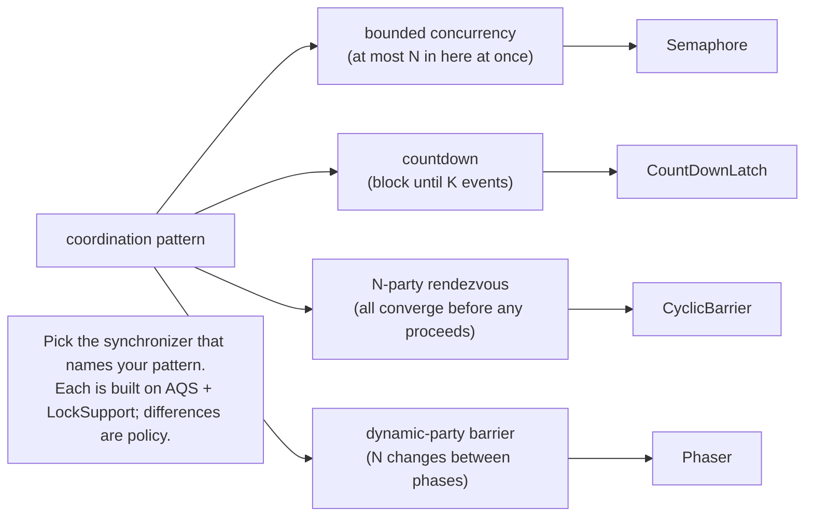
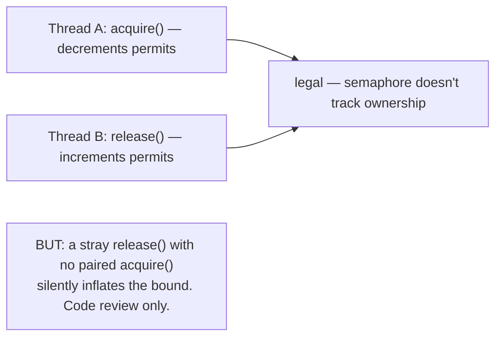
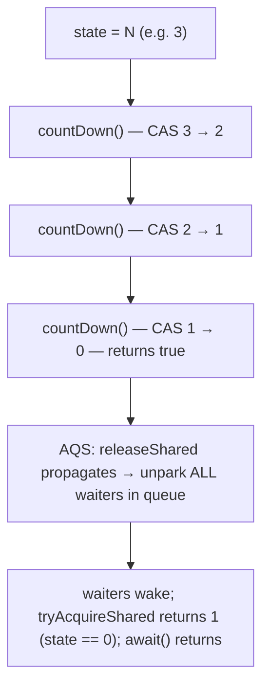
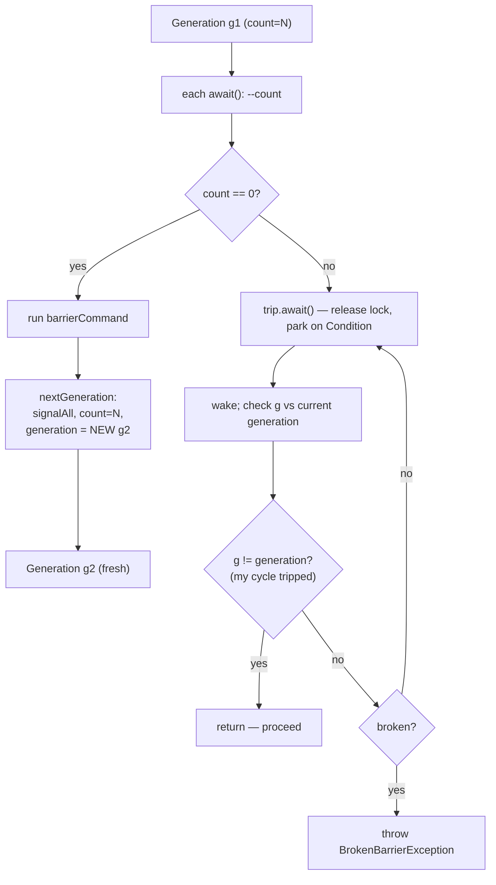
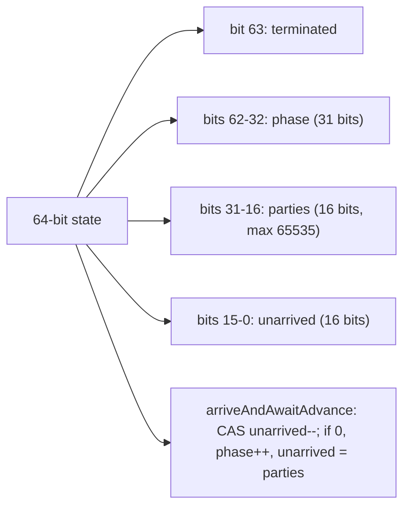
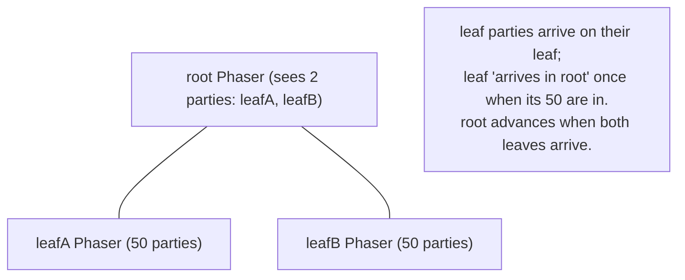
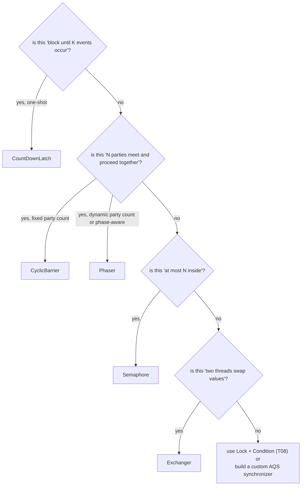

# Synchronizers (Semaphore, CountDownLatch, CyclicBarrier, Phaser)

`synchronized`, `wait`/`notify`, and `Lock`/`Condition` (T03/T04/T08) give you the *building blocks* — mutual exclusion plus condition signalling. Real concurrent programs need higher-level patterns built on those blocks: "let *N* threads in but not more" (bounded concurrency), "block until *K* events have happened" (countdown), "wait for *N* threads to converge here, then continue together" (rendezvous), "iterate in phases where the party count changes between phases" (dynamic barrier). The `java.util.concurrent` package, ca. 2004 (Doug Lea + JSR-166), supplies one synchronizer for each — `Semaphore`, `CountDownLatch`, `CyclicBarrier`, `Phaser` — and a fifth for two-party value exchange (`Exchanger`). Together they're the *coordination kit* every backend engineer reaches for when raw locks would be too low-level.

The depth-bar requirement isn't "use the right one." At the **language** layer, each synchronizer has a deliberately small API surface tuned to its coordination pattern — `Semaphore.acquire/release`, `CountDownLatch.countDown/await`, `CyclicBarrier.await`, `Phaser.register/arriveAndAwaitAdvance` — and the *choice* between them is the entire value: a `CountDownLatch` of `N` and a `CyclicBarrier(N)` superficially look identical but solve different problems (one-shot vs reusable; signal-many-from-one vs signal-among-N). At the **framework** layer, **three of the four are built directly on AQS** (T08) — `Semaphore`, `CountDownLatch`, `Phaser` use `AbstractQueuedSynchronizer`'s **shared mode** with a custom `tryAcquireShared`/`tryReleaseShared` pair, while `CyclicBarrier` is built on `ReentrantLock` + `Condition` plus a *generation* object that's swapped out on each cycle to atomically invalidate stale waiters. At the **state-encoding** layer, each synchronizer demonstrates a *different* meaning of AQS's single `volatile int state`: permits available, countdown remaining, packed (parties|unarrived|phase) for `Phaser`. At the **memory** layer, every synchronizer's success creates a JMM happens-before edge — every `countDown()` happens-before every `await()` return, every `barrier.await()` return happens-before every other party's same-cycle return, every `semaphore.release()` happens-before every paired `acquire()` return — so that *coordinated* code can rely on *all prior writes* by the signalling thread being visible. We will cover all four layers, dissect each synchronizer's source against the AQS template you learned in T08, and finish with the decision tree for which one to reach for.

> [!NOTE]
> Prerequisites: [Locks (ReentrantLock, ReadWriteLock, StampedLock)](./T08-locks-reentrantlock-readwritelock-stampedlock.md) (L3/C01/T08) — AQS shared mode, `tryAcquireShared`/`tryReleaseShared`, the CLH queue; [CompletableFuture & async composition](./T07-completablefuture-and-async-composition.md) (L3/C01/T07) — `LockSupport.park`-based waiter parking; [wait / notify / notifyAll](./T04-wait-notify-notifyall.md) (L3/C01/T04) — Mesa-monitor semantics `Condition` re-exposes; [synchronized, monitors & intrinsic locks](./T03-synchronized-monitors-and-intrinsic-locks.md) (L3/C01/T03) — the memory-ordering model.

## The Four — and What Each Is For



| Pattern | Synchronizer | One-shot or reusable | Threads that "wait" | Threads that "signal" |
|---------|--------------|---------------------|---------------------|----------------------|
| Bounded concurrency | `Semaphore` | reusable | acquirers | releasers (= same threads on return; or others) |
| Countdown / "wait for N events" | `CountDownLatch` | **one-shot** | waiters call `await()` | each event calls `countDown()` |
| All-parties-converge | `CyclicBarrier` | reusable | every party calls `await()` (both waits and signals) | n/a — every arriver is both signaller and waiter |
| Dynamic barrier with phases | `Phaser` | reusable | every party calls `arriveAndAwaitAdvance()` | n/a — same as barrier |

Plus a bonus:

| Pattern | Synchronizer | Use |
|---------|--------------|-----|
| Two-party value exchange | `Exchanger<V>` | rendezvous + atomic swap of one value each direction |

## `Semaphore` — Permit-Counting

A semaphore is a generalisation of a mutex. Where a mutex has *one* unit of access, a semaphore has *N* — at most *N* threads can be "inside" simultaneously, and a thread trying to enter when all permits are taken **blocks** until someone releases one.

```java
Semaphore sem = new Semaphore(10);            // 10 concurrent permits, unfair (default)
Semaphore fairSem = new Semaphore(10, true);  // fair: FCFS

sem.acquire();                                 // blocks if permits == 0; decrements on success
try {
    // critical section — at most 10 threads here simultaneously
} finally {
    sem.release();                              // increments permits; unparks one waiter
}
```

The methods:

```java
void acquire() throws InterruptedException;        // blocks for 1 permit
void acquire(int permits) throws InterruptedException;
boolean tryAcquire();                              // non-blocking; true if got it
boolean tryAcquire(long t, TimeUnit u) throws InterruptedException;
void release();                                    // returns 1 permit
void release(int permits);
int availablePermits();
int drainPermits();                                 // grabs all available, returns count
```

### Internals — AQS shared mode

`Semaphore` is one of the cleanest AQS examples. The state is the permit count:

```java
// NonfairSync (default) — abridged
final int nonfairTryAcquireShared(int acquires) {
    for (;;) {
        int available = getState();
        int remaining = available - acquires;
        if (remaining < 0 ||
            compareAndSetState(available, remaining))
            return remaining;                         // <0 = block; >=0 = got it
    }
}

protected final boolean tryReleaseShared(int releases) {
    for (;;) {
        int current = getState();
        int next = current + releases;
        if (next < current) throw new Error("max permits exceeded");
        if (compareAndSetState(current, next))
            return true;                              // tell AQS to propagate to all waiters
    }
}
```

Two key things:

1. **Shared mode.** Unlike a Lock (exclusive — one holder at a time), a `Semaphore` is *shared*: multiple permits can be outstanding, multiple threads can call `acquire` and proceed. AQS's `acquireShared`/`releaseShared` paths handle the queue management; the `Semaphore` only writes the permit-counting policy.
2. **The CAS loop in `tryAcquireShared`.** The classic optimistic loop: read current; compute remaining; if negative, return -1 (block); else CAS. Under contention, the loop retries; under no contention, one CAS succeeds.

Fair vs unfair: same as `ReentrantLock`. Fair `tryAcquireShared` calls `hasQueuedPredecessors()` first; unfair doesn't. Fair has FCFS guarantee; unfair is faster. **Default is unfair.**

### The crucial gotcha — permit ownership is *not* tracked

```java
Semaphore sem = new Semaphore(1);          // a binary semaphore (mutex-like)
sem.acquire();                              // thread A holds the permit
// ... in thread B, with no acquire ...
sem.release();                              // ✗ thread B "releases" — but it never held it
                                            //   no error; the permit count is now back to 1
                                            //   thread A still thinks it holds it!
```

Unlike `ReentrantLock.unlock` (which throws `IllegalMonitorStateException` if you don't hold it), `Semaphore.release` does *not* check identity — *any* thread can release *any* permit. This is by design: it's how the "signal-only" pattern works (one thread `release`s to wake another thread that `acquire`d earlier). But it makes coding bugs invisible: a stray `release()` without a paired `acquire()` silently inflates the permit count, breaking the bound. Code review must catch this; the runtime won't.



### Use case 1 — bounded concurrency limiter

```java
public class RateLimitedService {
    private final Semaphore inFlight = new Semaphore(50);
    public Result handle(Request r) throws InterruptedException {
        inFlight.acquire();
        try { return doWork(r); }
        finally { inFlight.release(); }
    }
}
```

At most 50 concurrent `handle` calls. The 51st waits. This is *the* canonical use: pre-Loom, it's how you cap concurrent downstream calls to a finite-resource service (a DB connection pool, an HTTP partner with rate limits, anything that can be saturated). Even post-Loom, with virtual threads being cheap, this is still how you bound *downstream* concurrency.

### Use case 2 — resource pool

```java
public class ConnectionPool {
    private final Semaphore permits;
    private final BlockingQueue<Connection> conns;

    public ConnectionPool(int size) {
        permits = new Semaphore(size);
        conns = new ArrayBlockingQueue<>(size);
        for (int i = 0; i < size; i++) conns.add(newConnection());
    }
    public Connection acquire() throws InterruptedException {
        permits.acquire();          // wait for a "slot"
        return conns.take();         // take an actual connection (never blocks — slot guarantee)
    }
    public void release(Connection c) {
        conns.add(c);
        permits.release();
    }
}
```

Permits gate access to a finite pool. The queue itself is unconditionally non-blocking because the semaphore already guaranteed availability. This pattern is used internally by HikariCP, JDBC pools, HTTP connection pools.

### Use case 3 — signal-only ("binary semaphore")

```java
Semaphore signal = new Semaphore(0);     // start with NO permits

new Thread(() -> {
    signal.acquire();                      // blocks until permits > 0
    doWorkAfterTrigger();
}).start();

// ... elsewhere ...
signal.release();                          // wake the waiter
```

A `Semaphore(0)` is a one-bit "go ahead" channel: the waiter `acquire`s (blocks on 0 permits), the producer `release`s (lifts to 1), the waiter wakes and consumes the permit (back to 0). It's a one-shot trigger — re-usable if you `release` again later. For more rigorous "this is a one-time event" semantics, `CountDownLatch(1)` is the better fit.

## `CountDownLatch` — One-Shot Countdown

A countdown latch starts at *N* and is decremented by `countDown()`. Threads calling `await()` block until the count reaches 0, then return; once 0, the latch is *permanently open* and future `await()` calls return immediately. **One-shot.** Cannot be reset.

```java
CountDownLatch ready = new CountDownLatch(3);     // wait for 3 events
new Thread(() -> { initA(); ready.countDown(); }).start();
new Thread(() -> { initB(); ready.countDown(); }).start();
new Thread(() -> { initC(); ready.countDown(); }).start();
ready.await();                                     // returns when all 3 have countDown'd
startWork();
```

The methods:

```java
void await() throws InterruptedException;
boolean await(long t, TimeUnit u) throws InterruptedException;
void countDown();
long getCount();
```

### Internals — Sync subclass

```java
// CountDownLatch.Sync — abridged
Sync(int count) { setState(count); }

protected int tryAcquireShared(int acquires) {
    return (getState() == 0) ? 1 : -1;          // 1 = "go"; -1 = "block"
}

protected boolean tryReleaseShared(int releases) {
    for (;;) {
        int c = getState();
        if (c == 0) return false;                 // already at 0 — nothing to do
        int nextc = c - 1;
        if (compareAndSetState(c, nextc))
            return nextc == 0;                    // true = propagate wakeup to all waiters
    }
}
```

Three things to notice:

1. **`tryAcquireShared` returns 1 or -1, never 0.** AQS's shared-mode protocol uses the return value: `<0` = block, `≥0` = acquired. Returning 1 means "got it, and there's more capacity" — for a latch, that's exactly right (every waiter "gets it" the moment the count hits 0).
2. **`tryReleaseShared` returns true only on the 0-transition.** That return value tells AQS's `releaseShared` to *propagate* the wake — walking the queue and unparking *every* waiter, not just one. This is the broadcast-on-zero pattern: countdown reaches 0, *all* awaiting threads wake.
3. **The state is monotonic.** Once 0, stays 0. `countDown` on an already-zero latch is a no-op. There's no `reset`; that's the explicit one-shot design.



### The two canonical patterns

**Pattern A — "wait for N events to occur":**

```java
CountDownLatch done = new CountDownLatch(workers.size());
for (var w : workers)
    pool.submit(() -> { try { w.run(); } finally { done.countDown(); } });
done.await();                                       // proceed when all done
```

The main thread awaits *N* workers. Each worker counts down once it's finished. Equivalent to `CompletableFuture.allOf(futures)` but lighter-weight and synchronous-friendly. The `finally` ensures even a failing worker counts down (preventing main-thread hang on exception).

**Pattern B — "service initialization barrier":**

```java
CountDownLatch ready = new CountDownLatch(1);      // 1 = "system ready"
// in init code:
initializeAll();
ready.countDown();                                  // open the latch

// in worker code:
public void serve(Request r) throws InterruptedException {
    ready.await();                                  // first request blocks until ready
    actuallyServe(r);
}
```

The latch is the "is the service up?" flag. Once `countDown`'d (once), all subsequent `await()`s return immediately — *the latch is now a free pass forever*. Cheap; correct; the standard way to gate service handlers behind initialization.

### CountDownLatch vs CyclicBarrier — when each fits

| Aspect | `CountDownLatch` | `CyclicBarrier` |
|--------|------------------|-----------------|
| One-shot or reusable | **one-shot** | **reusable** (cycles) |
| Threads' roles | distinct: signallers (`countDown`) and waiters (`await`) | symmetric: every party both arrives and waits |
| Count value | initial N, monotonically decreasing to 0 | initial N reset to N at each cycle |
| State after "fired" | permanently zero; future `await()` returns immediately | resets to count = N; waits again |
| Optional action on fire | none | `Runnable` barrier action |

The decision rule: are the signaller and waiter roles **distinct** (different threads do different things) and do you need it **once**? Latch. Are the roles **symmetric** (each party calls `await` itself) and do you cycle through phases? Barrier.

## `CyclicBarrier` — Reusable Rendezvous

A `CyclicBarrier(N)` is a meeting point: every party calls `await()`; the first `N-1` block; the `N`th unblocks everyone, optionally runs a barrier action, then *resets* the barrier so the next cycle can begin. Used for parallel iterative algorithms — at each iteration's end, all workers converge before any starts the next iteration.

```java
CyclicBarrier barrier = new CyclicBarrier(N, () -> log.info("phase complete"));   // N parties + action

// in each worker:
for (int iter = 0; iter < 100; iter++) {
    doWorkForIteration(iter);
    barrier.await();                                 // wait for the other N-1 workers
    // once all N reach here, the barrier action ran, and all proceed together
}
```

The methods:

```java
int await() throws InterruptedException, BrokenBarrierException;
int await(long t, TimeUnit u) throws InterruptedException, BrokenBarrierException, TimeoutException;
int getParties();
int getNumberWaiting();
boolean isBroken();
void reset();
```

`await()` returns the arrival index — 0 for the last arriver, `N-1` for the first. Useful for "designate one party to take a special action after rendezvous" without a separate barrier action.

### Internals — NOT direct AQS; uses Lock + Condition

Unlike the other three synchronizers, `CyclicBarrier` is **not built directly on AQS**. It uses a `ReentrantLock` plus one `Condition`, plus a *generation* object that tracks the current cycle:

```java
private final ReentrantLock lock = new ReentrantLock();
private final Condition trip = lock.newCondition();
private final int parties;
private Runnable barrierCommand;
private Generation generation = new Generation();   // current cycle
private int count;                                  // remaining arrivers in this cycle

private static class Generation {
    Generation() {}
    boolean broken;
}
```

The Generation object is the trick: when the barrier *trips* (all N have arrived) or is *broken* (a party fails), the current generation is discarded and replaced with a new one. Waiters check whether their generation is still current; if not, they throw `BrokenBarrierException`.

```java
public int await() throws ... {
    lock.lock();
    try {
        final Generation g = generation;
        if (g.broken) throw new BrokenBarrierException();
        if (Thread.interrupted()) { breakBarrier(); throw new InterruptedException(); }

        int index = --count;
        if (index == 0) {                            // last to arrive
            try {
                if (barrierCommand != null) barrierCommand.run();
                nextGeneration();                     // signal trip, reset count, new Generation
                return 0;
            } catch (Throwable t) {
                breakBarrier();
                throw t;
            }
        }

        // not last — wait
        for (;;) {
            try { trip.await(); }                   // releases lock, parks on Condition
            catch (InterruptedException ie) {
                if (g == generation && !g.broken) { breakBarrier(); throw ie; }
                Thread.currentThread().interrupt();
            }
            if (g.broken) throw new BrokenBarrierException();
            if (g != generation) return index;       // new generation = barrier tripped; we got out
        }
    } finally {
        lock.unlock();
    }
}

private void nextGeneration() {
    trip.signalAll();                                // wake every waiter
    count = parties;
    generation = new Generation();                    // fresh generation
}

private void breakBarrier() {
    generation.broken = true;
    count = parties;
    trip.signalAll();
}
```

The key insight is the **generation object**: each waiter captures `Generation g = generation` on entry. After waking, it checks `g != generation` — if true, the cycle this thread was part of has tripped (the `g` object is now stale), and the thread proceeds. If `g == generation` and `g.broken`, the cycle was broken; throw. Otherwise, spurious wakeup — re-wait.

This is essentially a hand-rolled "epoch" mechanism — same idea as `StampedLock`'s generation counter, but with object identity instead of a number. The atomic replacement (the new Generation is created before signalAll) ensures every existing waiter sees the change.



### The broken state

A `CyclicBarrier` enters the **broken** state when:

- Any waiter is interrupted while waiting (`InterruptedException` thrown).
- Any waiter's timed `await(t, u)` times out.
- The barrier action throws.
- An explicit `reset()` is called.

Once broken, all current and future arrivers throw `BrokenBarrierException`. The barrier cannot be used again until `reset()` is called, which itself breaks any current cycle and starts a fresh generation. So `reset()` is destructive — call it only when you know no party is mid-await, or accept that mid-await parties will see `BrokenBarrierException`.

> [!WARNING]
> **One interruption breaks the entire barrier.** If you `interrupt()` one of the *N* threads waiting on a barrier, that thread throws `InterruptedException` *and* the barrier transitions to broken — every other waiter then throws `BrokenBarrierException`. Useful for graceful shutdown ("interrupt one, all bail out"); painful when you didn't expect cascading failure. Use `Phaser` if you need a more flexible "drop out without breaking" model.

### Use case — parallel iterative algorithm

```java
double[][] matrix = ...;
int numWorkers = Runtime.getRuntime().availableProcessors();
CyclicBarrier sync = new CyclicBarrier(numWorkers, () -> {
    swapBuffers();                                   // safe: all workers paused here
});

for (int w = 0; w < numWorkers; w++) {
    final int rowStart = w * rowsPerWorker;
    pool.submit(() -> {
        for (int iter = 0; iter < 1000; iter++) {
            computeRows(rowStart, rowStart + rowsPerWorker, iter);
            try { sync.await(); }                    // wait for siblings
            catch (Exception e) { return; }
        }
    });
}
```

Each worker computes its slice for iteration *i*, then `await`s. When the last worker arrives, the barrier action (here, `swapBuffers`) runs in safety because *no worker is currently computing*. Then all workers proceed to iteration *i+1*. The barrier action is *the* place to do any work that requires exclusive access to shared state — it executes with all workers paused.

## `Phaser` — Dynamic-Party Barrier

`Phaser` (JDK 7) is the *flexible* barrier — `CyclicBarrier`'s superset with three extra capabilities:

1. **Dynamic registration.** Parties can `register()` mid-execution, joining the current phase; they can `arriveAndDeregister()` to leave the party count.
2. **Phase tracking.** The phase number (an `int`) advances monotonically with each rendezvous; you can query the current phase, await a specific future phase, etc.
3. **Hierarchical phasers.** Multiple `Phaser`s can be arranged in a parent/child tree; the child registers as one party in the parent on its first registration, transparently aggregating the child's parties into the parent's barrier. Scales to thousands of parties without single-state-cache-line contention.

The trade-off: it's more complex. For a fixed-party cycle, `CyclicBarrier` is simpler and slightly faster. Reach for `Phaser` when you need dynamic party count, the phase number itself, or hierarchical organization.

```java
Phaser phaser = new Phaser(N);                       // start with N registered parties
// or:
Phaser phaser = new Phaser();                         // 0 parties, register dynamically
phaser.register();                                    // add a party

// in each party:
for (int p = 0; p < phases; p++) {
    doWorkInPhase(p);
    phaser.arriveAndAwaitAdvance();                  // arrive + wait for others
}
phaser.arriveAndDeregister();                         // drop out
```

The methods:

```java
int register();                                       // returns the current phase
int bulkRegister(int parties);
int arrive();                                          // arrive without waiting
int arriveAndDeregister();                             // arrive AND drop out
int arriveAndAwaitAdvance();                            // arrive AND wait — the common one
int awaitAdvance(int phase);                            // wait for a specific phase to advance
int getPhase();
int getRegisteredParties();
int getArrivedParties();
int getUnarrivedParties();
boolean isTerminated();
void forceTermination();
```

### The 64-bit state packing — sign-bit + 31-bit phase + 16-bit parties + 16-bit unarrived

This is the most aggressive bit-packing in `java.util.concurrent`:

```java
private volatile long state;

// state layout (64 bits):
//   bit 63 (sign):  termination flag (1 if terminated)
//   bits 62-32:     current phase (31 bits — wraps around at MAX)
//   bits 31-16:     parties (16 bits — max 65535)
//   bits 15-0:      unarrived count (16 bits)
```

Why pack all four into one long? **One CAS** atomically updates phase, parties, and unarrived count when a party arrives or registers. Without the packing, separate fields would need a lock or multi-step CAS for any state transition that touched more than one of them. The packing makes every state change a single 64-bit CAS — the same lock-free pattern AQS uses for its 32-bit state, generalized to 64 bits for the richer Phaser model.



### `onAdvance` — the customization hook

```java
Phaser phaser = new Phaser(N) {
    @Override
    protected boolean onAdvance(int phase, int registeredParties) {
        // runs once per phase, after all parties arrive, before any are released
        log.info("phase {} complete with {} parties", phase, registeredParties);
        return phase >= 10 || registeredParties == 0;   // return true to TERMINATE
    }
};
```

`onAdvance` is `CyclicBarrier`'s barrier-action equivalent + termination control. Override to:

- Log or instrument phase transitions.
- Decide when to terminate the phaser (return `true` to permanently terminate; all `arriveAndAwaitAdvance` returns immediately afterwards).
- Default behaviour: terminate when `registeredParties == 0`.

### Hierarchical phasers — scaling past 65,535 parties

For workloads with thousands of parties, a single phaser's state-field cache line becomes contended. The fix: organize phasers in a tree, with each phaser registering as one party in its parent:

```java
Phaser root = new Phaser();
Phaser leafA = new Phaser(root, 50);    // 50 leaf-A parties, leafA registers in root
Phaser leafB = new Phaser(root, 50);
// root sees 2 registered parties (leafA, leafB);
// each leaf sees its own 50.
// When leafA's 50 all arrive, leafA arrives in root once.
// When leafB's 50 all arrive, leafB arrives in root once.
// root's phase advances; all 100 leaves proceed.
```

The constructor `new Phaser(parent, parties)` does both jobs: register in the parent (once, on first leaf-party registration) and pre-register `parties` at the leaf. The tree's depth lets you scale to thousands of parties with each leaf's state cache line contended only by ~50 nearby threads, while the root cache line is contended only by leaf-aggregations.



This is the same hierarchical-aggregation pattern as `ForkJoinPool`'s work queues (T13) — divide contention spatially across multiple cache lines.

## `Exchanger` — Two-Party Value Swap

A `Exchanger<V>` is a rendezvous for **exactly two** threads that swap values:

```java
Exchanger<String> ex = new Exchanger<>();

new Thread(() -> {
    String mine = "I am thread A";
    String yours = ex.exchange(mine);             // blocks until B arrives
    System.out.println("A received: " + yours);   // "I am thread B"
}).start();

new Thread(() -> {
    String mine = "I am thread B";
    String yours = ex.exchange(mine);             // blocks until A arrives
    System.out.println("B received: " + yours);   // "I am thread A"
}).start();
```

Both calls block until *both* have arrived; then each receives the other's argument. Symmetric — neither thread "leads."

Use cases are narrow: pipeline stages that exchange buffers, double-buffered I/O patterns, simulations. The implementation uses a Treiber-stack-like data structure of "slots" — first arrival posts its value and parks; second arrival CAS's into the slot, takes the value, returns. If you find yourself wanting `Exchanger`, the modern alternatives (`SynchronousQueue`, `BlockingQueue`, `LinkedTransferQueue`) are usually more flexible.

## Memory Ordering — Every Synchronizer Creates a Happens-Before Edge

The JMM rules for each:

- **`Semaphore.release()`** happens-before every paired `Semaphore.acquire()`'s return (acquire-release on the AQS state CAS).
- **`CountDownLatch.countDown()`** happens-before every `await()` return that the countdown unblocks.
- **`CyclicBarrier.await()`** completion happens-before every other party's same-cycle `await()` return — so writes done *before* one party's await are visible after every other party's await returns.
- **`Phaser.arriveAndAwaitAdvance()`** completion happens-before every other party's same-phase advance return — same as barrier.
- **`Exchanger.exchange(v)`** completion (each side) happens-before the other side's return (each side sees writes the other did pre-exchange).

The mechanism is the same in every case: the AQS state CAS on release/countDown/arrive is a release-store; the CAS or read on acquire/await is an acquire-load. The pair publishes all writes done before the release to all readers after the acquire — exactly the JMM monitor-lock rule (T03), generalized to AQS's state field.

So you can rely on: any thread that *finished* its share of work and called `latch.countDown()` has *published* every write it did before that call to every thread waking from `latch.await()`. No `volatile` needed on individual fields. The synchronizer's success *is* the publication.

## Virtual Threads — All Synchronizers Are VT-Friendly

Every synchronizer parks via `LockSupport.park` (either directly through AQS or, for `CyclicBarrier`, indirectly through `Condition.await`). `LockSupport.park` is the primitive Loom intercepts to *unmount* virtual threads (T14). Therefore:

- A virtual thread `Semaphore.acquire()`ing into a full semaphore releases its carrier; ~hundreds of bytes of continuation heap; runs on resume.
- A virtual thread `CountDownLatch.await()`ing for a long-running event releases its carrier.
- A virtual thread `CyclicBarrier.await()` — even though it uses a `ReentrantLock` + `Condition` internally — also releases its carrier (`Lock` has always been VT-friendly per T08).
- A virtual thread `Phaser.arriveAndAwaitAdvance()` releases its carrier.

So **none of the synchronizers needed JEP 491 (the JDK 24 `synchronized` fix)** — they've all been VT-compatible since JDK 21. The 2021-2023 "use `Lock` not `synchronized` for VT" rule applies to user-code locks; the JDK's synchronizers have always used the VT-friendly machinery.

## Choosing the Right Synchronizer — Decision Tree



In sentences:

- **Need to block until K things have happened?** `CountDownLatch(K)`. One-shot; can't reset; signaller and waiter are distinct roles.
- **Need N threads to converge and proceed together, cyclically, with fixed party count?** `CyclicBarrier(N [, action])`. Reusable; each party calls `await`.
- **Same as barrier, but party count changes between phases or you need the phase number?** `Phaser`. More overhead; more flexible.
- **Need to limit concurrency to N?** `Semaphore(N)`. Bounded entries; ownership not tracked; useful for resource pools.
- **Two threads need to swap a single value at a rendezvous?** `Exchanger<V>`. Rare but elegant.
- **None of the above?** Roll your own with `Lock` + `Condition` (T08) — or subclass `AbstractQueuedSynchronizer` for the most demanding cases.

## Common Mistakes

### Treating `CountDownLatch` as resettable

```java
CountDownLatch latch = new CountDownLatch(3);
latch.countDown(); latch.countDown(); latch.countDown();
latch.await();
// later... try to "reuse" the latch — countDown is now a no-op; await returns immediately
```

`CountDownLatch` is one-shot. For reuse, allocate a fresh one or use `CyclicBarrier`/`Phaser`.

### Forgetting `finally { sem.release(); }`

```java
sem.acquire();
doWork();         // ✗ if doWork() throws, permit is leaked forever
sem.release();
```

Same discipline as `Lock` (T08). Always release in a `finally`.

### Releasing more permits than acquired

```java
Semaphore sem = new Semaphore(10);
// thread A:
sem.acquire(); doWork(); sem.release(); sem.release();   // ✗ extra release — permits inflate
```

Semaphore doesn't track ownership; the count can climb past the initial `10`. Code review only catches this; the runtime doesn't.

### Using `CyclicBarrier` and surprising yourself with `BrokenBarrierException`

If any party can fail (timeout, interrupt, throw), every other party gets `BrokenBarrierException`. Either accept this (the cascade is the point in shutdown scenarios) or move to `Phaser` whose `arriveAndDeregister` is non-disruptive.

### Forgetting to `arriveAndDeregister` from a `Phaser`

```java
Phaser phaser = new Phaser();
phaser.register();
// ... work for some phases ...
return;       // ✗ never deregisters; phaser's party count stays inflated; other parties wait forever
```

Always `arriveAndDeregister` (or wrap in try/finally) when a party exits.

### Mixing `CountDownLatch` and `submit` exception handling

```java
CountDownLatch done = new CountDownLatch(N);
for (int i = 0; i < N; i++)
    pool.submit(() -> { work(); done.countDown(); });   // ✗ if work() throws, countDown is skipped

done.await();    // hangs forever
```

Wrap in try/finally: `try { work(); } finally { done.countDown(); }`. Otherwise a single failure permanently hangs the awaiter.

### Confusing `Semaphore` permit count with concurrency limit when permits != 1

A `Semaphore(N, false).acquire(2)` requires *2* permits in one go — if only 1 is available, blocks. Confusing if the rest of the code uses `acquire()` (= `acquire(1)`).

### Calling `barrier.await()` from outside a worker

If only one party calls `await` and `parties == N`, the barrier hangs forever. Make sure the number of *actually-calling* parties matches `parties`.

### Using a single shared `Phaser` across thousands of parties

State cache-line contention dominates at high party counts. Switch to hierarchical phasers (constructor `new Phaser(parent, parties)`) to scale.

## Observability

### Thread dumps

A `Semaphore.acquire()` waiter:

```text
"worker-3" ... java.lang.Thread.State: WAITING (parking)
   at jdk.internal.misc.Unsafe.park(Native Method)
   - parking to wait for <0x000000071ab2> (a j.u.c.Semaphore$NonfairSync)
   at j.u.c.locks.LockSupport.park
   at j.u.c.locks.AbstractQueuedSynchronizer.acquireShared
   at j.u.c.Semaphore.acquire
```

A `CountDownLatch.await()`:

```text
   - parking to wait for <0x...> (a j.u.c.CountDownLatch$Sync)
   at j.u.c.locks.AbstractQueuedSynchronizer.acquireSharedInterruptibly
   at j.u.c.CountDownLatch.await
```

A `CyclicBarrier.await()`:

```text
   - parking to wait for <0x...> (a j.u.c.locks.AbstractQueuedSynchronizer$ConditionObject)
   at j.u.c.locks.AbstractQueuedSynchronizer$ConditionObject.await
   at j.u.c.CyclicBarrier.dowait
```

The synchronizer class is named (`Semaphore$NonfairSync`, `CountDownLatch$Sync`, `CyclicBarrier`'s inner Condition), making the source of blocking clear at a glance. Filter dumps to find which synchronizer dominates wait time.

### JFR

`jdk.ThreadPark` events with `parkedClass` = `Semaphore$NonfairSync` / `CountDownLatch$Sync` / etc. cleanly aggregate per synchronizer. The exact API call frame is in the event's stack trace. Production-grade contention analysis on synchronizer waits.

> [!INTERVIEW]
> "What's the difference between `CountDownLatch` and `CyclicBarrier`?" — Senior answer:
>
> 1. **One-shot vs reusable.** Latch fires once and is permanently open; barrier resets after each cycle.
> 2. **Role asymmetry vs symmetry.** Latch separates signallers (`countDown`) from waiters (`await`); barrier has every party do both (`await` arrives + waits).
> 3. **Implementation.** Latch is direct AQS (`tryAcquireShared` returns 1 iff state == 0; `tryReleaseShared` decrements). Barrier uses `ReentrantLock` + `Condition` plus a *Generation* object that's replaced on trip/reset to invalidate stale waiters.
> 4. **Failure semantics.** Barrier breaks on any party's failure (cascading `BrokenBarrierException`); latch is robust to individual signaller failure if you've covered all `countDown`s with try/finally.

> [!INTERVIEW]
> Short Q&A:
>
> 1. **`Semaphore` ownership?** Not tracked. Any thread can release any permit. Useful for signal-only patterns, but means code review must enforce paired acquire/release.
> 2. **What's `Semaphore`'s state in AQS?** Available permit count.
> 3. **What's `CountDownLatch`'s state?** Remaining countdown.
> 4. **What's `Phaser`'s state?** 64-bit packed: terminated bit (1) | phase (31) | parties (16) | unarrived (16). One CAS updates all four.
> 5. **Why is `CyclicBarrier` not pure AQS?** It needs a one-shot-per-cycle waitset with reset capability; ReentrantLock+Condition+Generation is a cleaner fit than custom AQS shared-mode logic. Plus the optional barrier action runs while all parties are paused — easier under a held lock.
> 6. **What's the `Generation` pattern in `CyclicBarrier`?** A small inner-class object identifying the current cycle. Each waiter captures it on entry; after waking, compares with the current `generation` field — if different, the cycle tripped; if same and `broken`, throw. Same idea as `StampedLock`'s generation stamp.
> 7. **What's `arriveAndDeregister` for?** Phaser's way to leave the party set without breaking other parties (`CyclicBarrier` has no equivalent — interruption *breaks* the barrier).
> 8. **What's a hierarchical phaser?** A tree of phasers where each child registers as one party in its parent. Aggregates ~50–100 leaf parties per inner phaser to avoid single-state-cache-line contention at high party counts.
> 9. **What's the happens-before edge a `CountDownLatch` creates?** Each `countDown` happens-before any `await` return that the countdown unblocks — so all pre-countDown writes are visible to post-await reads.
> 10. **What's the difference between `Semaphore.tryAcquire()` and `tryAcquire(0, MILLISECONDS)`?** Both non-blocking; first uses unfair fast-path (CAS attempt); second goes through the full timed-acquire path. Prefer `tryAcquire()` for "available now or not."
> 11. **Why is `CountDownLatch` one-shot?** Its `tryAcquireShared` returns 1 once state == 0; future `await`s return immediately. There's no way to "re-arm" without a state change protocol the JDK chose not to expose. Use `CyclicBarrier` for reuse.
> 12. **What happens if one party in a `CyclicBarrier` doesn't arrive?** Other parties wait forever (the awaiter that calls `await(t, u)` will throw `TimeoutException`, breaking the barrier — then the others throw `BrokenBarrierException`).
> 13. **What's `onAdvance` for in `Phaser`?** Override to run code at each phase boundary (like a barrier action) and to control termination (return `true` to terminate). Default terminates when `registeredParties == 0`.
> 14. **What's `Exchanger.exchange` for?** Two-party value swap at rendezvous. Each thread passes a value; each receives the other's. Less common than the other four; consider `SynchronousQueue` or `LinkedTransferQueue` first.
> 15. **In 2026, virtual-thread compatibility?** All four synchronizers (Sem/CDL/CB/Phaser) use `LockSupport.park` and have been VT-friendly since JDK 21 — they never needed JEP 491.

## Practice

1. **`Semaphore` bounded-concurrency.** Build a "rate-limited downloader" with `Semaphore(10)`. Spin 100 producer threads. Verify with a counter that at most 10 are inside `doDownload()` at any time.
2. **`Semaphore` for resource pool.** Implement `ConnectionPool(5)` exactly as in the use-case example. Verify the 6th concurrent borrower blocks until a release.
3. **Permit-leak.** Write a `Semaphore`-using method that has a `release` *outside* a `try/finally`. Trigger an exception in `doWork`; show the permit is leaked. Fix with proper `try/finally`.
4. **`CountDownLatch` for service start.** `CountDownLatch ready = new CountDownLatch(1)`. Main does init then `countDown`. Worker threads do `await` before serving. Verify the first worker to handle a request blocks if init is slow.
5. **`CountDownLatch` for wait-N-done.** Submit 20 tasks; main does `done.await()`. Confirm completion order is non-deterministic but main proceeds only when all 20 have counted down.
6. **`CyclicBarrier` parallel iteration.** Use the matrix-iteration example. Verify the barrier action runs between iterations and that all workers proceed together.
7. **`CyclicBarrier` brokenness cascade.** With 3 workers and a 1-second `await(1, SECONDS)` timeout, intentionally have one worker sleep 2 s. Confirm the slow worker throws `TimeoutException` *and* the other two throw `BrokenBarrierException`.
8. **`Phaser` dynamic registration.** Start a `Phaser` with 0 parties. Launch 5 worker threads, each `register`-ing on start and `arriveAndDeregister`-ing on exit. Verify the phase advances cleanly through 100 phases with parties joining/leaving mid-execution.
9. **`Phaser` hierarchical.** Build a parent phaser with 4 children, each with 25 parties (100 leaves total). Compare contention/throughput vs a single flat `Phaser(100)`. Plot results.
10. **`Phaser` `onAdvance` termination.** Override `onAdvance` to terminate after phase 10. Confirm `arriveAndAwaitAdvance` after that returns immediately and `isTerminated()` is true.
11. **`Exchanger` double-buffered I/O.** Two threads: producer fills buffer A while consumer drains buffer B; at rendezvous, swap. Verify with timestamps that production and consumption overlap.
12. **AQS state inspection.** Subclass each of Semaphore/CountDownLatch and use reflection (or a custom synchronizer) to print AQS state during operations. Confirm the state mappings.

## Recap

You should now be able to:

- Recognize the **four coordination patterns** and match each to its synchronizer: bounded concurrency → `Semaphore`; one-shot countdown → `CountDownLatch`; reusable N-party rendezvous → `CyclicBarrier`; dynamic-party / phase-aware → `Phaser`.
- Explain that **three of the four are direct AQS shared-mode synchronizers** (state = permits / countdown / packed-Phaser-state, with custom `tryAcquireShared`/`tryReleaseShared` hooks), while **`CyclicBarrier` uses `ReentrantLock` + `Condition` + a `Generation` object** (cleaner fit for one-shot-per-cycle waitsets with reset capability).
- Use **`Semaphore`** correctly: permits are *not* owned by the acquirer (any thread can release any permit — signal-only patterns rely on this, but invisible bugs result from stray releases); default unfair; `try/finally`-discipline same as `Lock`.
- Use **`CountDownLatch`** correctly: monotonic countdown; one-shot; future `await`s return immediately once at 0; the AQS pattern is "block while state > 0; release-shared decrements and broadcasts on 0-transition"; pair with `try/finally` to ensure failing workers still count down.
- Use **`CyclicBarrier`** correctly: each party calls `await`; the last arriver runs the optional barrier action *before* releasing the others (so the action sees stable state); the `Generation` object is replaced on trip and on reset to invalidate stale waiters; **one party's failure (timeout, interrupt, throw, reset) breaks the entire barrier** — cascading `BrokenBarrierException` is by design.
- Use **`Phaser`** correctly: `register`/`arriveAndAwaitAdvance`/`arriveAndDeregister`; the 64-bit packed state (1 termination bit + 31 phase + 16 parties + 16 unarrived); `onAdvance(phase, parties)` hook for barrier-action equivalent and termination; **hierarchical phasers** scale to thousands of parties by aggregating leaf phasers under a root.
- State the **happens-before edge** every synchronizer creates: `release`/`countDown`/last-arriver-`await`/`signal` happens-before subsequent paired acquires — so all pre-release writes are visible post-acquire. Same JMM rule as monitor exit/enter (T03), built on the AQS state CAS.
- Reach for **`Exchanger<V>`** only for genuine two-party value swap; prefer `SynchronousQueue`/`LinkedTransferQueue` (T10) for richer patterns.
- Apply the **decision tree**: latch for one-shot K-event countdown; barrier for fixed-party reusable rendezvous; phaser for dynamic or phase-aware; semaphore for bounded concurrency / resource pool / signal-only; exchanger for two-party swap; raw `Lock` + `Condition` (T08) for everything else.
- Recognize all four are **virtual-thread-friendly since JDK 21** — they park via `LockSupport`, which Loom unmounts cleanly. None needed JEP 491.
- Avoid the **eight common bugs**: treating `CountDownLatch` as resettable; missing `try/finally` on `Semaphore.release`; releasing more permits than acquired; `BrokenBarrierException` cascade surprise; missing `Phaser.arriveAndDeregister` on early exit; missing `countDown` in `submit` exception paths; `acquire(n)` blocking on partial availability; running a phaser at thousands of parties without hierarchy.
- Use **thread dumps** to identify which synchronizer is contended (`Semaphore$NonfairSync`, `CountDownLatch$Sync`, `Phaser`, or `CyclicBarrier`'s `ConditionObject`) and **JFR `jdk.ThreadPark`** events for production-grade aggregation.

## Next

Continue to [Concurrent collections](./T10-concurrent-collections.md) — the thread-safe data-structure layer above the synchronizers. We'll dissect `ConcurrentHashMap` (per-bucket locks + CAS + tree-bin promotion for hot buckets), `ConcurrentLinkedQueue` (the Michael–Scott non-blocking queue), `CopyOnWriteArrayList` (write-amplification trade-off), the `BlockingQueue` family (`ArrayBlockingQueue`, `LinkedBlockingQueue`, `SynchronousQueue`, `LinkedTransferQueue`) that `ThreadPoolExecutor` runs on (T05), and the `ConcurrentSkipListMap` (an O(log n) lock-free sorted map). Every one of them is built on the locks and synchronizers you now understand at the bit level.
