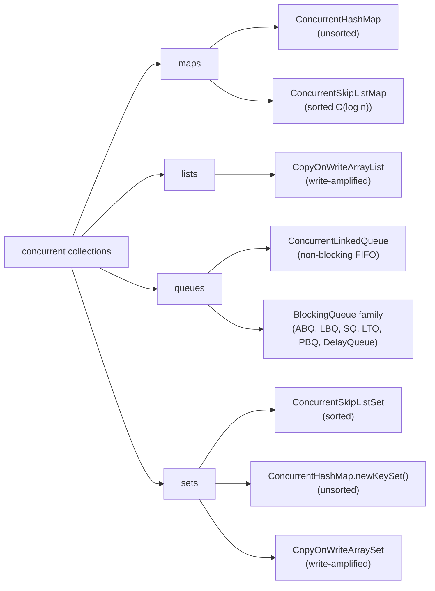
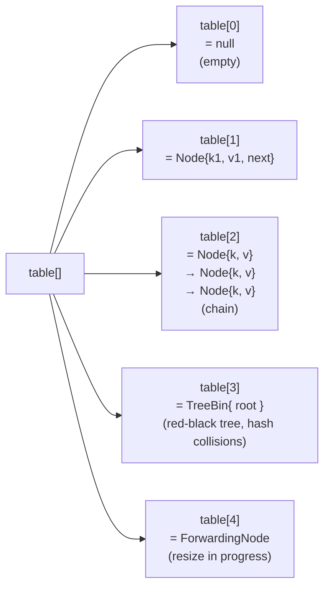
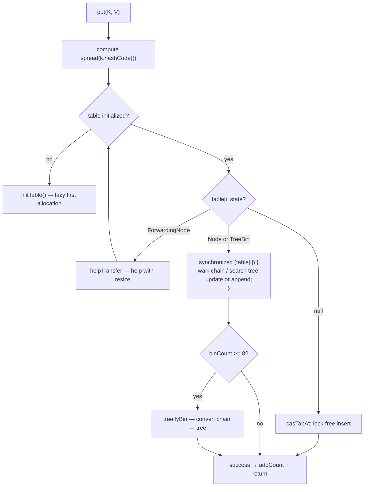
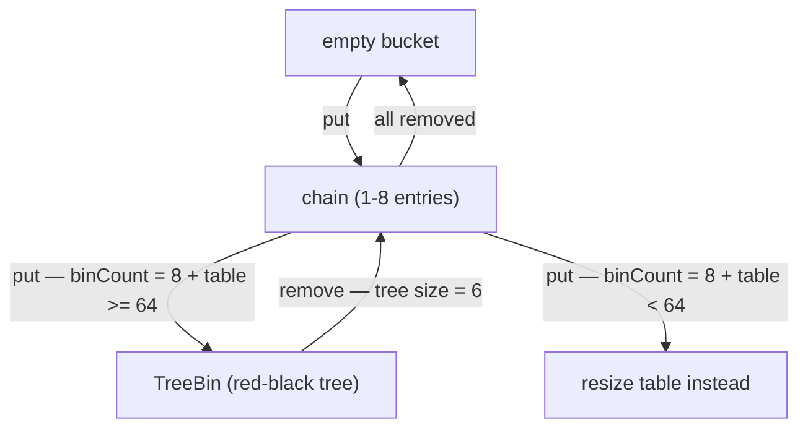
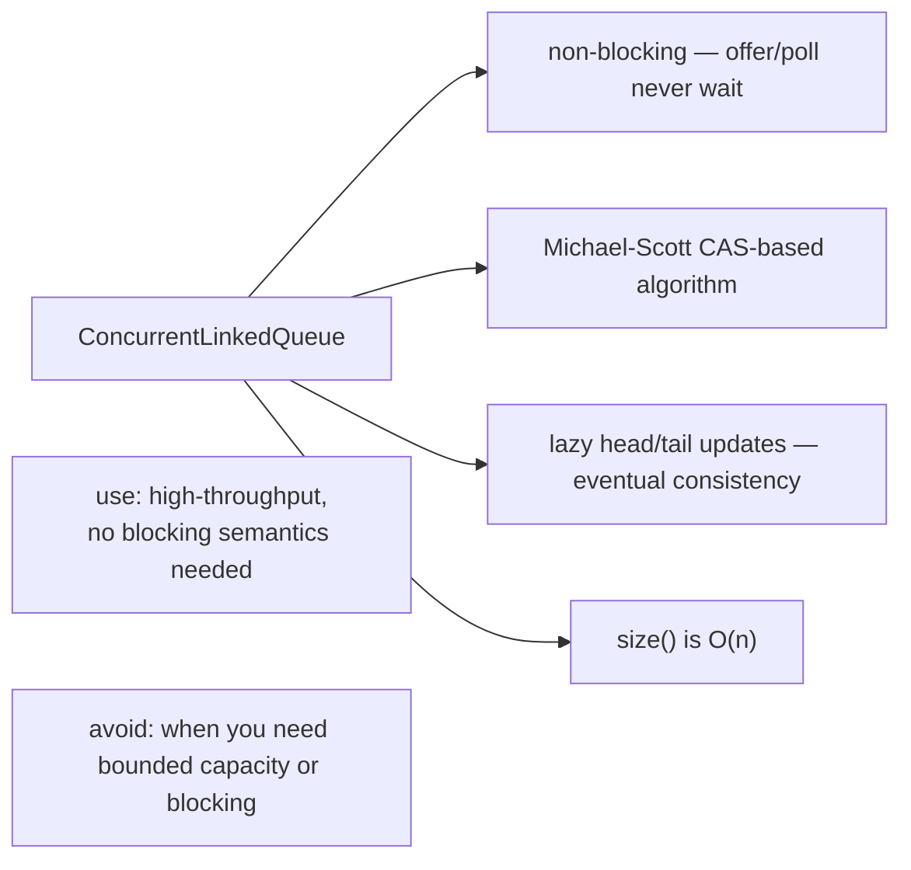

# Concurrent Collections

`java.util` is single-threaded by contract — `HashMap`, `ArrayList`, `LinkedList`, `TreeMap` make no atomicity or visibility guarantees, and using them across threads without external synchronization corrupts state silently (or worse, via the *infamous* `HashMap.put` infinite-loop pre-JDK-8). `java.util.concurrent` ships a parallel hierarchy of **thread-safe collections** designed for high concurrency: `ConcurrentHashMap`, `ConcurrentSkipListMap`, `CopyOnWriteArrayList`, `ConcurrentLinkedQueue`, the `BlockingQueue` family, and a handful of others. Together they're how modern Java code shares data across threads without writing a single lock yourself.

The depth-bar requirement isn't "use `ConcurrentHashMap` instead of `HashMap`." At the **language** layer, each concurrent collection has a specialized contract — atomic compound operations (`putIfAbsent`, `computeIfAbsent`, `merge`), weakly-consistent iterators, bulk parallel operations — that goes well beyond "thread-safe" and into "expressively concurrent." At the **algorithm** layer, `ConcurrentHashMap` (since JDK 8) uses **per-bucket locking via the bucket head Node as the synchronization monitor**, plus CAS for the empty-bucket case, plus **tree-bin promotion** (chain → red-black tree at 8 entries) for hash-degenerate buckets, plus **cooperative resize** (multiple threads each claim a stride of buckets to transfer) — making point operations near lock-free under typical workloads. At the **structural** layer, `ConcurrentSkipListMap` is a fully lock-free O(log n) sorted map (CAS-only pointer updates on a probabilistic skip-list structure), `ConcurrentLinkedQueue` is the **Michael–Scott 1996 non-blocking FIFO** (two-pointer + lazy tail-update), and `CopyOnWriteArrayList` is the *write-amplification* primitive (every mutation copies the whole array; reads are a single volatile load). At the **policy** layer, the **`BlockingQueue` family** — `ArrayBlockingQueue` (single-lock-2-Conditions), `LinkedBlockingQueue` (two-locks, head and tail), `SynchronousQueue` (dual-stack/dual-queue handoff), `LinkedTransferQueue` (blocking + lock-free) — are the back-pressure primitives `ThreadPoolExecutor` (T05) and every async pipeline runs on. We will cover all four layers, with the JDK source as ground truth for the headline players.

> [!NOTE]
> Prerequisites: [Synchronizers](./T09-synchronizers-semaphore-countdownlatch-cyclicbarrier-phaser.md) (L3/C01/T09) — the AQS shared-mode pattern these collections build on; [Locks](./T08-locks-reentrantlock-readwritelock-stampedlock.md) (L3/C01/T08) — `ReentrantLock`+`Condition` underneath `ArrayBlockingQueue`/`LinkedBlockingQueue`; [wait / notify / notifyAll](./T04-wait-notify-notifyall.md) (L3/C01/T04) — blocking queues' producer/consumer pattern; [synchronized, monitors & intrinsic locks](./T03-synchronized-monitors-and-intrinsic-locks.md) (L3/C01/T03) — `synchronized` on the bucket head is `ConcurrentHashMap`'s per-bucket lock.

## The Taxonomy



Six categories of choice:

- **Map, unsorted, high concurrency** → `ConcurrentHashMap`. The default for shared mutable mapping.
- **Map, sorted, concurrent** → `ConcurrentSkipListMap`. When iteration order matters *and* contention is real.
- **List, reads >>> writes** → `CopyOnWriteArrayList`. Event listeners, observer patterns, infrequent-write configuration.
- **Queue, FIFO, non-blocking** → `ConcurrentLinkedQueue`. Pure work-stealing queues without blocking.
- **Queue, with blocking semantics** → `BlockingQueue` family (see below). The primitives every producer-consumer pipeline uses.
- **Set, sorted or unsorted** → `ConcurrentSkipListSet` (sorted) or `ConcurrentHashMap.newKeySet()` (unsorted). `CopyOnWriteArraySet` wraps a `CopyOnWriteArrayList` for the same read-heavy case.

## `ConcurrentHashMap` — the Headline

`ConcurrentHashMap` (CHM) is *the* most-used concurrent collection in the JVM ecosystem — every cache, every metric registry, every connection pool, every config-store implementation reaches for it. Since JDK 8 it's been a **substantial rewrite** from the original JDK 5 segmented design, and the JDK 8+ internals are the version every senior engineer needs to understand.

### The contract — what CHM guarantees

- **Thread-safe** without external synchronization.
- **No null keys or values.** Throws `NullPointerException` on either. This is by design — distinguishes "absent" from "present with null" in `get()`/`putIfAbsent`/`compute`.
- **Atomic compound operations.** `putIfAbsent`, `computeIfAbsent`, `computeIfPresent`, `compute`, `merge`, `replace` — all atomic *as a whole*.
- **Weakly consistent iterators.** Never throw `ConcurrentModificationException`; reflect state at *some* point during iteration; may or may not see writes that happen after iterator creation.
- **`size()` is approximate** during heavy concurrent updates (computed by summing striped counter cells).
- **No locking on the public API** — reads (`get`, `containsKey`) are fully lock-free; only writes that hit a non-empty bucket use synchronization (and only on *that* bucket's head).

### Structure — the `Node<K,V>[] table`

The backing array is a power-of-two sized table of `Node<K,V>` references. Each slot is a **bucket** that can hold one of six states:

| Bucket state | Marker | Meaning |
|--------------|--------|---------|
| `null` | absent | empty bucket |
| `Node<K,V>` | hash ≥ 0 | one or more entries (a chain) |
| `TreeBin<K,V>` | hash = -2 | the bucket has been promoted to a red-black tree |
| `ForwardingNode` | hash = -1 | resize is in progress; consult `nextTable` |
| `ReservationNode` | hash = -3 | `computeIfAbsent` is computing; bucket is reserved |
| (head node of chain) | normal | locked via `synchronized (head)` for chain mutation |



### The `put` walkthrough — CAS for empty, lock for non-empty

```java
// abridged ConcurrentHashMap.putVal
final V putVal(K key, V value, boolean onlyIfAbsent) {
    if (key == null || value == null) throw new NullPointerException();
    int hash = spread(key.hashCode());
    int binCount = 0;
    for (Node<K,V>[] tab = table;;) {
        Node<K,V> f; int n, i, fh;
        if (tab == null || (n = tab.length) == 0)
            tab = initTable();                            // lazy first-use init
        else if ((f = tabAt(tab, i = (n - 1) & hash)) == null) {
            // empty bucket — try CAS-insert, lock-free
            if (casTabAt(tab, i, null, new Node<>(hash, key, value)))
                break;                                     // success
            // CAS failed → loop and retry
        } else if ((fh = f.hash) == MOVED) {
            // resize in progress; help with the transfer
            tab = helpTransfer(tab, f);
        } else {
            V oldVal = null;
            synchronized (f) {                            // ← LOCK the bucket head
                if (tabAt(tab, i) == f) {                  // verify still head (no concurrent rehash)
                    if (fh >= 0) {
                        // chain — walk and update or append
                        binCount = 1;
                        for (Node<K,V> e = f;; ++binCount) {
                            K ek;
                            if (e.hash == hash && ((ek = e.key) == key || key.equals(ek))) {
                                oldVal = e.val;
                                if (!onlyIfAbsent) e.val = value;
                                break;
                            }
                            Node<K,V> pred = e;
                            if ((e = e.next) == null) {
                                pred.next = new Node<>(hash, key, value);
                                break;
                            }
                        }
                    } else if (f instanceof TreeBin) {
                        // red-black tree — O(log n) insert
                        ...
                    }
                }
            }
            if (binCount != 0) {
                if (binCount >= TREEIFY_THRESHOLD) treeifyBin(tab, i);    // 8 → tree
                if (oldVal != null) return oldVal;
                break;
            }
        }
    }
    addCount(1L, binCount);                                // striped counter update + maybe resize
    return null;
}
```

Three key things happen here:

1. **Empty bucket: lock-free CAS.** `casTabAt(tab, i, null, newNode)` is a single CAS on the array slot. No lock, no queueing, no waiting. The vast majority of `put`s into a non-degenerate map hit empty buckets — and they're *all* lock-free.
2. **Non-empty bucket: `synchronized (head)`.** The bucket's first node serves as the lock object. Only threads touching *this* bucket contend; threads touching *other* buckets run in parallel without any interaction. This is the per-bucket-locking model.
3. **Resize cooperation.** If the bucket's head is a `ForwardingNode` (hash = -1), the put discovers the map is being resized and **helps** by calling `helpTransfer` — taking on a stride of buckets to move. This turns the resize from a stop-the-world operation into a cooperative, multi-thread one.



### The `get` walkthrough — fully lock-free

```java
public V get(Object key) {
    int h = spread(key.hashCode());
    Node<K,V>[] tab = table;
    if (tab != null && tab.length > 0) {
        Node<K,V> e = tabAt(tab, (tab.length - 1) & h);
        for (; e != null; e = e.next) {
            if (e.hash == h && ((K) e.key).equals(key))
                return e.val;
        }
    }
    return null;
}
```

No `synchronized`. No CAS. Just a volatile read of the table slot and a traversal of the chain (or a tree walk). Every read is a **single volatile load** plus a small chain walk — making CHM reads ~10-30 ns. This is what makes CHM viable as a *cache*: read-heavy workloads pay essentially zero synchronization cost.

The `Node` fields are `volatile`:

```java
static class Node<K,V> implements Map.Entry<K,V> {
    final int hash;
    final K key;
    volatile V val;           // CAS-updateable value
    volatile Node<K,V> next;   // CAS-updateable chain pointer
    ...
}
```

So a reader sees consistent value/next pointers without locking — every write inside the bucket lock's synchronized region is published via the bucket head's monitor exit (T03), and the volatile fields ensure point-wise visibility.

### Tree-bin promotion — surviving hash-collision attacks

```java
static final int TREEIFY_THRESHOLD     = 8;       // chain length → promote to tree
static final int UNTREEIFY_THRESHOLD   = 6;       // tree size → demote to chain
static final int MIN_TREEIFY_CAPACITY  = 64;      // don't promote unless table.length >= 64
```

Why? Without protection, a degenerate workload — say, an attacker poisoning string hash collisions in a web-facing HashMap — would put thousands of entries in one bucket, turning O(1) into O(n) and crippling the map. JDK 8+ promotes long chains to red-black trees:

1. Each bucket counts its chain length on put.
2. At **`TREEIFY_THRESHOLD = 8`** entries: if `table.length < MIN_TREEIFY_CAPACITY (64)`, resize the table instead (probably less degenerate post-resize). If table is big enough, convert the chain to a `TreeBin` containing a red-black tree.
3. The tree's lookup is O(log n) — bounding worst-case lookup to ~30 comparisons even for millions of collisions.
4. At **`UNTREEIFY_THRESHOLD = 6`** entries on remove: convert the tree back to a chain (chains are cheaper for small populations).

The **6/8 asymmetry** is intentional — hysteresis preventing flapping between tree and chain when the count oscillates around the threshold.



### Cooperative resize — many threads help transfer

When the table grows past the load-factor threshold (default 0.75 × capacity), CHM doubles the table size and transfers all entries to the new table. *In a single-threaded resize, this is O(n) on one thread* — fine for small tables, terrible for large ones. CHM's solution: **multi-threaded cooperative resize**.

The mechanism:

- A field **`sizeCtl`** is the resize control word (negative when resizing — encodes generation and worker count).
- A field **`nextTable`** is the new table being populated.
- A field **`transferIndex`** is the next bucket index to transfer (workers decrement this to claim a stride).
- When resize starts, threads doing put/remove notice (via `sizeCtl < 0`) and call `helpTransfer`, claiming a stride of buckets (default 16) and migrating them.
- Each migrated bucket has its head replaced by a `ForwardingNode` pointing at `nextTable`; subsequent operations see the marker and look in `nextTable`.
- When `transferIndex` reaches 0 and all workers have finished their strides, `table = nextTable` and the resize is complete.

This turns a O(n) single-thread operation into a O(n / workers) cooperative one — and the workers are *threads that were going to be touching the map anyway*. Resize is amortized into normal traffic.

```mermaid
sequenceDiagram
  participant T1 as thread 1 (initiator)
  participant T2 as thread 2 (helper)
  participant T3 as thread 3 (helper)
  T1->>T1: detects size > threshold; CAS sizeCtl to "resizing"
  T1->>T1: allocates nextTable (2× size)
  T2->>T2: put() encounters ForwardingNode; calls helpTransfer
  T3->>T3: put() encounters ForwardingNode; calls helpTransfer
  Note over T1,T3: each thread claims a stride of buckets to migrate
  T1->>T1: transfer buckets [n-16, n-1)
  T2->>T2: transfer buckets [n-32, n-16)
  T3->>T3: transfer buckets [n-48, n-32)
  Note over T1,T3: when transferIndex reaches 0,<br/>resize is complete, table = nextTable
```

### `addCount` — striped counter for size()

If `size()` were a single `AtomicLong` incremented on every put/remove, that one cache line would be the *single biggest* contention point in the entire map. CHM uses a **LongAdder-style striped counter**:

```java
private transient volatile long baseCount;
private transient volatile CounterCell[] counterCells;

static final class CounterCell {
    volatile long value;
    @Contended         // pad to cache-line size
    CounterCell(long x) { value = x; }
}

final void addCount(long x, int check) {
    CounterCell[] as; long b, s;
    if ((as = counterCells) != null ||
        !U.compareAndSetLong(this, BASECOUNT, b = baseCount, s = b + x)) {
        // base contended; fall back to per-thread cell
        ...
        // hash the current thread to a cell; CAS that cell
    }
    ...
}

public int size() {
    long n = sumCount();      // base + sum(all cells)
    return (n < 0L) ? 0 : (n > Integer.MAX_VALUE) ? Integer.MAX_VALUE : (int) n;
}
```

The pattern:

- A single `baseCount` for the uncontended case (one CAS, fast).
- An array of `CounterCell`s, each cache-line-aligned (`@Contended`), keyed by `Thread.threadLocalRandomProbe`. Each thread hashes to its own cell and CAS's just that cell.
- `size()` walks both: `baseCount + sum(cells)`. O(cells) — typically 4-16 cells, so ~50-100 ns.

The trade-off: `size()` becomes O(cells), but every increment becomes contention-free (each thread touches its own cache line). On a hot map with hundreds of threads `put`/`remove`-ing, this is a 100× throughput improvement over a single shared counter.

> [!IMPORTANT]
> **`size()` is approximate during heavy concurrent updates.** The sum is computed by walking the cells; between cells, other threads may be incrementing. There's no atomic snapshot. If you need an exact size for control flow, you cannot use CHM `size()` — you'd need to guard the increment+check with your own lock. In practice, the approximation is fine; "is the map large enough to evict?" doesn't need to be exact.

### Atomic compound operations

The most-loved CHM feature:

```java
// "get or compute"
String value = map.computeIfAbsent(key, k -> expensiveCompute(k));

// "increment counter"
map.merge(key, 1L, Long::sum);

// "modify with current"
map.compute(key, (k, v) -> v == null ? "first" : v + "_more");
```

All of these are **atomic** — the lambda runs while the bucket is locked. No race between "check absent" and "put." Two consequences:

1. **The lambda must be fast.** It runs under the bucket lock; other threads touching the same bucket wait.
2. **The lambda must NOT modify the same map.** Specifically not the same key. Behavior is documented as "may give unexpected results" — in practice, can deadlock (the bucket is already locked by us) or behave inconsistently.

```java
// ✗ DON'T:
map.computeIfAbsent(key, k -> {
    map.put(otherKey, value);   // ✗ may deadlock if otherKey hashes to same bucket
    return computeFor(k);
});
```

This is *the* rule senior code reviewers enforce on CHM usage. The compound operations are a sharp tool; lambdas inside them should be referentially transparent.

### Bulk parallel operations

CHM offers parallel bulk ops via `ForkJoinPool.commonPool()`:

```java
map.forEach(parallelismThreshold, (k, v) -> println(k, v));
Long total = map.reduceValues(parallelismThreshold, Long::sum);
String result = map.search(parallelismThreshold, (k, v) -> v.startsWith("X") ? k : null);
```

`parallelismThreshold` is the minimum size to parallelize at — below it, sequential; above, split across cores. Useful for large maps where iteration dominates time; redundant for small maps.

### Weakly consistent iterators

```java
for (Map.Entry<K, V> e : map.entrySet()) {
    // see SOME state during iteration;
    // may not see entries inserted after iterator creation;
    // never throws ConcurrentModificationException
}
```

The iterator captures the table reference at creation. Subsequent puts/removes that hit the same bucket may or may not be visible; iterator sees consistent point-state per bucket but not across buckets. This is **weakly consistent** semantics — the CHM contract.

Compare to `HashMap`'s **fail-fast** iterator that throws `ConcurrentModificationException` on any concurrent modification: CHM never throws; the trade-off is "you may see a slightly inconsistent snapshot."

### Performance numbers

| Op | Uncontended | Same-bucket contention | Different-bucket parallel |
|----|-------------|-----------------------|---------------------------|
| `get` | ~10–30 ns (volatile load + chain walk) | same (no lock) | same |
| `put` (empty bucket) | ~50-100 ns (one CAS + counter update) | unaffected | scales linearly with cores |
| `put` (non-empty bucket) | ~80-150 ns (lock + walk) | bucket lock serializes | scales linearly with cores |
| `size()` | ~50-100 ns (baseCount + cells sum) | scales O(cells) | scales O(cells) |
| `computeIfAbsent` (absent) | ~100-200 ns (atomic put + reservation) | same-key serializes | parallel across keys |
| Resize | amortized into traffic | n/a | cooperative |

The ~10–30 ns `get` is *the* number that makes CHM the universal cache. A modern x86 core can do ~30 million CHM reads per second per thread, scaling near-linearly with cores for different-bucket reads.

## `ConcurrentSkipListMap` — Sorted, Lock-Free, O(log n)

When you need a sorted concurrent map, the choice is between:

- **`Collections.synchronizedSortedMap(new TreeMap<>())`** — single global lock; obsolete except for low-concurrency cases.
- **`ConcurrentSkipListMap`** — lock-free, O(log n) ops, scales with concurrency.

CHM doesn't keep entries sorted; it gives O(1) amortized point ops by hashing. `ConcurrentSkipListMap` (CSLM) trades O(1) for **sorted iteration + O(log n) operations**, with the bonus of being **fully lock-free** (no locks anywhere; pure CAS).

### Skip list structure

A skip list (Pugh 1990) is a sorted linked list with multiple **levels** of forward pointers. Each node has a random level (geometrically distributed); level *k* pointers skip over more nodes than level *k-1*. Search starts at the highest level and drops down, halving the search space at each step — exactly the O(log n) behavior of a balanced tree, but with simpler concurrent updates (no rotations).

```text
level 3:  HEAD ──────────────────────────────→ N5 ──────────────────→ TAIL
level 2:  HEAD ──────────→ N2 ────────────→ N5 ──────────→ N9 ──────→ TAIL
level 1:  HEAD ────→ N1 → N2 ────→ N4 → N5 → N6 ────→ N8 → N9 ──────→ TAIL
level 0:  HEAD → N1 → N2 → N3 → N4 → N5 → N6 → N7 → N8 → N9 → N10 → TAIL
```

Search for N6 from level 3: HEAD → N5 (level 3 skip), N5 → level 2, N5 → N9 (overshoot), N5 → level 1, N5 → N6. Five hops vs walking the full list at 6 nodes — but for n = 10^6, it's ~20 hops vs 10^6.

### Why lock-free is feasible

The skip list's hierarchical structure means an inserter/deleter only touches *adjacent* nodes at each level — and each insertion/deletion is a small sequence of pointer CAS's. No global rotation, no parent/child reshuffling like a red-black tree. The lock-free algorithm (Fraser/Harris 2007, refined by Doug Lea) handles concurrent insertions and deletions correctly using a **marker node** technique: a deleter inserts a "marker" between the to-be-deleted node and its successor before unlinking, so inserters can detect concurrent deletion and retry.

The implementation is one of the more impressive things in the JDK. Performance: O(log n) per operation; concurrent throughput scales near-linearly with cores until the cache-line ping-pong on hot levels becomes the bottleneck.

### When to use CSLM

- Need sorted iteration (`firstKey`, `lastKey`, `headMap`, `subMap`, `tailMap`) over shared data.
- Need range queries — "all entries with key < X" — efficiently.
- Want lock-free concurrency where read-heavy CHM doesn't apply because order matters.

When *not* to use it:

- Don't need sorting: CHM is ~10× faster for point ops.
- Single-threaded: `TreeMap` is faster.

## `CopyOnWriteArrayList` — Reads at Volatile-Read Speed

```java
List<Listener> listeners = new CopyOnWriteArrayList<>();
// thread A — reader
for (Listener l : listeners) l.fire(event);    // safe, lock-free, snapshot
// thread B — writer
listeners.add(newListener);                     // copies the entire array
```

The contract:

- **Every mutation copies the entire backing array.** `add`, `remove`, `set` allocate a new array, copy, mutate, and CAS the array reference.
- **Reads are a single volatile read.** `get(i)` reads the volatile array reference, then indexes it.
- **Iterators capture the array at iterator-creation time.** They see a *snapshot*; concurrent modifications are invisible; **never throw `ConcurrentModificationException`**.

```java
private transient volatile Object[] array;     // volatile reference

public boolean add(E e) {
    synchronized (lock) {                       // mutator-only lock
        Object[] elements = getArray();
        int len = elements.length;
        Object[] newElements = Arrays.copyOf(elements, len + 1);
        newElements[len] = e;
        setArray(newElements);                  // volatile store of new array
        return true;
    }
}

public E get(int index) {
    return (E) getArray()[index];                // volatile load of array; index access
}
```

### Use cases

**Event listener lists.** Listeners register at startup; events fire constantly; deregistration is rare. Reads dominate writes by 1000:1+. COWAL is *the* canonical fit — Swing/AWT's `EventListenerList` is essentially this pattern.

**Configuration snapshots.** Hot-reloaded config that's read by every request and written rarely (every few seconds at most). COWAL gives request handlers consistent point-in-time views without any locking.

**Cache invalidation lists.** A list of "things to invalidate" written infrequently, scanned often.

### Anti-cases

- Frequent writes: O(n) copy cost per write kills throughput. On a 10k-element list, every `add` allocates 80 KB. With per-second writes from many threads, the allocator and GC swamp.
- Large lists: even a single 1M-element list's COW copy is 8 MB — measurable.
- Need write-visibility-during-iteration: iterators are *snapshots*; you'll never see writes made after `iterator()` was called. Often surprising.

### Performance

| Op | Cost |
|----|------|
| `get` | ~5 ns (volatile load + index access) |
| `iterator()` | ~5 ns (volatile load of array) |
| `add` (size n) | O(n) — array copy |
| `remove(i)` (size n) | O(n) — array copy |
| `clear` | O(1) (replace with empty array) |

Read latency is *better than `ArrayList`* (the volatile load is cheap; no bounds-check overhead difference). Write latency is *catastrophic* for large lists. Pick by read/write ratio.

## `ConcurrentLinkedQueue` — Michael–Scott Non-Blocking FIFO

A lock-free FIFO queue (Michael & Scott, 1996 — the canonical paper). No locks; everything via CAS. Pure speed; the price is the API: `offer(e)` to add at tail, `poll()` to remove from head, both non-blocking (return null on empty for `poll`).

### Structure

```text
head ──→ Node{dummy, next=N1}
N1   ──→ Node{e1, next=N2}
N2   ──→ Node{e2, next=N3}
N3   ──→ Node{e3, next=null}
tail ──→ N3 (or sometimes N2 — see lazy update below)
```

Two volatile pointers — `head` and `tail`. The head is a dummy (similar to AQS — keeps unlinking cheap). Each `Node` has volatile `item` and volatile `next`.

### Enqueue — the Michael–Scott two-step

```java
public boolean offer(E e) {
    final Node<E> newNode = new Node<>(e);
    for (Node<E> t = tail, p = t;;) {
        Node<E> q = p.next;
        if (q == null) {
            // p is the actual tail; try to append
            if (NEXT.compareAndSet(p, null, newNode)) {
                // CAS appended; now try to advance tail (best-effort)
                if (p != t) TAIL.compareAndSet(this, t, newNode);
                return true;
            }
            // CAS failed → loop and re-read p.next
        } else if (p == q) {
            // p was self-linked (after dequeue); restart from tail
            p = (t != (t = tail)) ? t : head;
        } else {
            // p is not at tail; advance toward tail
            p = (p != t && t != (t = tail)) ? t : q;
        }
    }
}
```

The genius of Michael–Scott is the **lazy tail update**: the enqueue CAS's the new node into the actual tail's `next`, *then* tries to CAS-advance the `tail` pointer — but it's okay if that second CAS fails or if `tail` is left "behind" by one node. Future operations will see `tail.next != null` and walk forward, helping advance `tail` lazily.

Result: most enqueues are *one CAS* (the next pointer); the tail-update is best-effort. Under contention, two threads can each enqueue successfully without ever blocking — the algorithm is *non-blocking* and *wait-free for enqueue*.

### Dequeue

```java
public E poll() {
    restartFromHead: for (;;) {
        for (Node<E> h = head, p = h, q;;) {
            E item = p.item;
            if (item != null && ITEM.compareAndSet(p, item, null)) {
                // CAS item to null (logical delete); now advance head (best-effort)
                if (p != h) updateHead(h, ((q = p.next) != null) ? q : p);
                return item;
            }
            else if ((q = p.next) == null) {
                updateHead(h, p);
                return null;
            }
            else if (p == q) continue restartFromHead;
            else p = q;
        }
    }
}
```

The dequeue similarly uses lazy head update: CAS `item` to null (logical delete); advance `head` best-effort. A polled node is "self-linked" (its `next` points to itself) to indicate it's been removed — readers walking through self-linked nodes restart from `head`.

### Trade-offs

- **No blocking.** `poll()` returns null on empty; you cannot `take()` and block. For blocking semantics, use `BlockingQueue` family.
- **`size()` is O(n).** Walks the chain. Cache the size externally if needed; don't rely on `size()` for performance-critical decisions.
- **Best for high-throughput producer-consumer where blocking is a positive anti-feature.** E.g., work-stealing patterns where consumers should *fail fast* and try another queue rather than wait.



## `BlockingQueue` Family — Review

The `BlockingQueue` family (introduced briefly in T05) provides queues with *blocking* semantics — `put` waits if full, `take` waits if empty. These are the queues `ThreadPoolExecutor` uses to feed workers (T05) and the primitives every producer-consumer pipeline rides on.

| Queue | Capacity | Internal locks | Best for |
|-------|----------|----------------|----------|
| **`ArrayBlockingQueue`** | bounded array | 1 `ReentrantLock` + 2 `Condition`s | bounded, moderate concurrency, cache-friendly |
| **`LinkedBlockingQueue`** | bounded *or* unbounded linked-list | **2 `ReentrantLock`s** (head + tail) | high producer-consumer concurrency |
| **`SynchronousQueue`** | **zero** (direct handoff) | dual-stack (unfair) or dual-queue (fair) | hand-off-only patterns; `newCachedThreadPool`'s queue |
| **`LinkedTransferQueue`** | unbounded | lock-free + transfer support | "wait until consumer takes" semantics; lock-free under low contention |
| **`PriorityBlockingQueue`** | unbounded (heap) | 1 lock | priority-ordered scheduling |
| **`DelayQueue`** | unbounded (heap by due) | 1 lock | scheduled tasks; `ScheduledThreadPoolExecutor`'s queue |

The two-lock design of `LinkedBlockingQueue` (one `ReentrantLock` for the head, one for the tail) lets producers and consumers operate at opposite ends without contending — dramatically higher throughput than `ArrayBlockingQueue`'s single lock under heavy concurrency. The trade-off: linked-list nodes are not cache-contiguous, so `LinkedBlockingQueue` has worse cache behavior on iteration.

`SynchronousQueue` is the most exotic. Capacity zero — every `put` must hand directly to a `take`, and vice versa. Under the hood it's a **dual-stack** (unfair, LIFO; default) or **dual-queue** (fair, FIFO) — a single data structure that holds *either* waiting putters *or* waiting takers but never both, with arrivals on the opposite side directly handing off to the head waiter. This is the queue underneath `Executors.newCachedThreadPool()` — every task either hands to a waiting worker or triggers a new worker spawn.

`LinkedTransferQueue` (LTQ) is the modern hybrid: lock-free CAS-based enqueue/dequeue when uncontended; blocking `take()` parks on the next available item; and `transfer(e)` blocks until *some* consumer takes the element (unlike `put` which may queue). LTQ is generally the best-performing blocking queue for moderate-to-high concurrency.

Full mechanics of each are covered in T05 — refer back when picking the queue for a `ThreadPoolExecutor`.

## Comparison — Hashtable vs synchronizedMap vs HashMap vs ConcurrentHashMap

| Map | Thread-safe? | Null keys/values | Iterator behavior | Lock granularity |
|-----|:-----------:|:----------------:|-------------------|------------------|
| `HashMap` | **NO** | both allowed | fail-fast (throws CME) | none — corruption under concurrent modification |
| `Hashtable` | **YES** (obsolete) | neither allowed | fail-fast | single global lock — useless for concurrency |
| `Collections.synchronizedMap` | **YES** | depends on wrapped map | fail-fast (must synchronize iteration externally) | single global lock |
| `ConcurrentHashMap` | **YES** | neither allowed | weakly consistent (never throws CME) | per-bucket + CAS for empty |

The takeaway: **on JDK 5+ there is no reason to use `Hashtable` or `Collections.synchronizedMap` for new code.** `Hashtable` is API-compatible with `Map` but uses one global lock — making it strictly inferior to CHM for any concurrent workload. `synchronizedMap` has the same problem plus the iteration-needs-external-synchronization footgun. CHM is strictly better in every dimension.

## Virtual Threads — All Friendly

Every concurrent collection covered here is virtual-thread compatible since JDK 21:

- **CHM, CSLM, CLQ, COWAL** — these use no `synchronized` for *waiting*; CHM's `synchronized` on bucket heads is purely for mutation (and never blocks long enough to pin meaningfully).
- **`BlockingQueue` family** — all built on `LockSupport.park` via `Condition.await`, which Loom unmounts cleanly.

So all these collections "just work" with virtual threads; no rewrites needed for Loom adoption.

## Common Mistakes

### Treating `size()` as exact

```java
if (map.size() == 100) doSomething();    // ✗ size is approximate during concurrent updates
```

CHM `size()` is the sum of a striped counter; between cell reads, other threads may increment/decrement. For exact size, lock the entire map (which defeats the point of CHM). Production code should treat `size()` as a metric, not a control-flow predicate.

### Non-atomic check-then-act

```java
if (!map.containsKey(k))           // ✗ another thread may put(k) between these
    map.put(k, computeFor(k));
```

Use `putIfAbsent(k, v)` or `computeIfAbsent(k, fn)` — both atomic. The naïve check-then-put is a textbook race.

### Modifying the map inside a `compute` lambda

```java
map.computeIfAbsent(k, key -> {
    map.put(otherKey, val);        // ✗ may deadlock if otherKey hashes to same bucket
    return computeFor(key);
});
```

The lambda runs under the bucket's lock; another touch of the same bucket from inside is undefined. Keep `compute` lambdas pure.

### Iterating `synchronizedMap` without external sync

```java
Map<K, V> m = Collections.synchronizedMap(new HashMap<>());
for (var e : m.entrySet()) { ... }   // ✗ throws CME if any thread modifies m concurrently
```

`synchronizedMap` synchronizes individual method calls but not iteration. Wrap iteration in `synchronized (m) { for (...) ... }` or switch to CHM.

### `CopyOnWriteArrayList` for write-heavy data

Every mutation is O(n). For 10k elements + 1 write/s, that's 80 KB allocated per second — manageable. For 1M elements or 1k writes/s, the allocator and GC are crushed. Profile and switch to a different structure.

### `ConcurrentLinkedQueue.size()` in a hot loop

```java
while (queue.size() > 0) {              // ✗ size() is O(n); walks the queue each call
    process(queue.poll());
}
```

`size()` is O(n). Use `isEmpty()` (O(1)) or just `Object e = queue.poll(); if (e == null) break;`.

### Expecting `CopyOnWriteArrayList` iterators to see updates

```java
List<String> list = new CopyOnWriteArrayList<>();
list.add("a");
Iterator<String> it = list.iterator();
list.add("b");
while (it.hasNext()) println(it.next());    // prints only "a" — iterator is snapshot
```

COW iterators are snapshots from creation time. For live iteration, allocate the iterator after the writes.

### Storing `null` in a CHM

```java
chm.put(k, null);    // ✗ NullPointerException
```

CHM rejects null keys and values. This is by design — distinguishes "not present" from "present with null" in `get()` and the compound ops. If you need nullable values, wrap in `Optional` or a sentinel.

### Using a non-blocking queue when you need backpressure

`ConcurrentLinkedQueue` accepts unbounded; under producer-faster-than-consumer overload, the heap fills until OOM. Use a `BlockingQueue` with a bound + a rejection policy (via `ThreadPoolExecutor`, T05) for production back-pressure.

## Observability

### Heap inspection

`jcmd <pid> GC.class_histogram` shows `ConcurrentHashMap$Node`/`TreeNode`/`ForwardingNode` counts — useful for finding maps that have grown unexpectedly large or hash-degraded into tree bins.

### JFR

`jdk.ThreadPark` events on `j.u.c.locks.AbstractQueuedSynchronizer$ConditionObject` from blocking-queue waits identify producer/consumer bottlenecks. `jdk.JavaMonitorEnter` from bucket-head `synchronized` blocks identifies CHM hot buckets (rare in practice — most CHM contention is invisible in JFR because per-bucket synchronization rarely blocks long enough to record).

### Hot-bucket detection

For pathological CHM workloads, check tree-bin counts (`jcmd ... GC.class_histogram | grep TreeNode`). If TreeNodes are a significant fraction of total nodes, you have hash-degenerate buckets — likely a hash-collision attack vector or a bad `hashCode` implementation. Profile and consider per-shard maps (one CHM per key prefix) for better distribution.

> [!INTERVIEW]
> "Explain `ConcurrentHashMap`'s JDK 8+ design." — Senior answer:
>
> 1. **Per-bucket locking, not segmented.** Each table slot is independently lockable. Pre-JDK-8 used 16 `Segment`s each a `ReentrantLock`; JDK 8 replaced that with `synchronized` on the bucket head node.
> 2. **CAS for empty buckets.** Empty slot? CAS-insert a new Node. No lock, no queueing. The fast path for fresh keys.
> 3. **`synchronized (head)` for non-empty.** Bucket's first node serves as the monitor; only threads touching *this bucket* contend.
> 4. **Tree-bin promotion.** Chain ≥ 8 entries → red-black tree (`TreeBin`), capping worst-case lookup to O(log n) even under hash-collision attacks. Demotion at ≤ 6.
> 5. **Cooperative resize.** When growing, multiple threads claim strides of buckets to transfer in parallel via `ForwardingNode` markers and `sizeCtl` coordination.
> 6. **Striped counter for size().** `LongAdder`-style cells avoid single-cache-line contention on increments.
> 7. **Atomic compound ops.** `computeIfAbsent`, `merge`, `compute` — lambdas run under the bucket lock; must be fast and not modify the same map.
> 8. **No null keys/values.** Distinguishes absent vs present-with-null for `get()` and compound ops.
> 9. **Weakly consistent iterators.** Never throw CME; reflect some-point state per bucket.

> [!INTERVIEW]
> Short Q&A:
>
> 1. **Why no null keys/values in CHM?** Distinguishes absent from present-with-null; required by atomic compound op contracts.
> 2. **What's the tree-bin threshold and why?** 8 (promote) / 6 (demote). Bounds worst-case lookup to O(log n) under hash collisions; 6/8 asymmetry is hysteresis.
> 3. **What's MIN_TREEIFY_CAPACITY?** 64 — don't tree-promote unless the table is at least this big; otherwise just resize the table.
> 4. **How does CHM handle resize?** Cooperative: workers that touch the map during resize each claim a stride of buckets to transfer. `ForwardingNode` markers route lookups to `nextTable`.
> 5. **Why striped counter for size?** Single AtomicLong increment is cache-line-contended; LongAdder-style cells let each thread CAS its own cell.
> 6. **What's the lock granularity in CHM puts?** Per bucket. The bucket's head Node is the synchronized monitor (or CAS if bucket is empty).
> 7. **What's a weakly consistent iterator?** Reflects some-point state during iteration; never throws CME; may or may not see concurrent updates.
> 8. **`computeIfAbsent` vs `putIfAbsent`?** Both atomic. `computeIfAbsent` runs a supplier only if absent (lazy); `putIfAbsent` requires the value already constructed.
> 9. **`ConcurrentSkipListMap`'s O(log n)?** Skip-list — multiple levels of pointers, geometric distribution. CAS-based pointer updates. Pugh 1990; lock-free since Doug Lea.
> 10. **`CopyOnWriteArrayList` trade-off?** Every mutation copies the array (O(n)); reads are a volatile load (O(1)); iterators are snapshots. Good for reads >> writes (event listeners); bad otherwise.
> 11. **`ConcurrentLinkedQueue`'s algorithm?** Michael-Scott (1996). Two volatile pointers, lazy tail-update — most enqueues are one CAS on `next`, then a best-effort CAS to advance tail.
> 12. **Why is CLQ's `size()` O(n)?** Pointer-walking the chain; no atomic size counter. Use `isEmpty()` instead.
> 13. **`LinkedBlockingQueue` vs `ArrayBlockingQueue`?** LBQ has two locks (head + tail) → higher concurrent throughput; ABQ has one lock + cache-friendly array. LBQ scales better; ABQ has lower base latency.
> 14. **`SynchronousQueue`?** Zero-capacity hand-off queue; `put` blocks until a `take` rendezvous (and vice versa). Underneath: dual-stack (unfair) or dual-queue (fair).
> 15. **Why is `Hashtable` obsolete?** Single global lock; useless concurrency. Strictly worse than CHM. Same for `Collections.synchronizedMap`.

## Practice

1. **Reproduce HashMap corruption.** Two threads, each `put`-ing 100k entries into the same `HashMap`. Repeat 1000 times; observe sporadic infinite loops or NullPointerExceptions (pre-JDK-8) or just incorrect size/structure (JDK 8+). Switch to `ConcurrentHashMap`; observe correctness.
2. **CHM `computeIfAbsent` vs check-then-put race.** Two threads racing to put-if-absent the same key with expensive computation. Confirm `computeIfAbsent` calls the supplier once; the naïve `if (!containsKey) put(compute())` calls it twice (the race).
3. **CHM hot bucket.** Force hash collisions (use keys whose `hashCode()` returns a constant). Insert 100 entries; verify the bucket has become a TreeBin (`jcmd ... GC.class_histogram | grep TreeNode`). Measure lookup time vs random-hash keys.
4. **Cooperative resize.** Insert 1M entries into a CHM from a single thread, then again from 16 threads. Time both; verify the multi-threaded case is faster (each thread helps with resize).
5. **CSLM range query.** Build a `ConcurrentSkipListMap<Integer, String>` with 100k entries. Run `subMap(50000, 51000)` from one thread while other threads are inserting. Verify no exception; verify the iterator covers the range correctly.
6. **COWAL read latency.** Build a `CopyOnWriteArrayList` of 1000 elements. Time 1M `get(500)` calls. Compare to `ArrayList` with `Collections.synchronizedList`. Confirm COWAL is ~equivalent for reads.
7. **COWAL write cost.** Same list, now add an element per ms from a writer thread. Profile heap allocation; observe ~8 KB per write (1000 × 8 bytes pointer + array header).
8. **CLQ vs LBQ throughput.** Producer-consumer benchmark: 4 producers + 4 consumers, 1M items each. Compare `ConcurrentLinkedQueue` (non-blocking) to `LinkedBlockingQueue`. CLQ should be ~2-3× faster (no parking).
9. **CLQ with backpressure.** Show what happens when CLQ producer outpaces consumer — heap grows until OOM. Switch to a bounded `LinkedBlockingQueue`; observe the producer blocks instead.
10. **CHM bulk parallel reduce.** Build a CHM of 1M entries with random Long values. Sum via `map.values().stream().reduce(0L, Long::sum)` (sequential) and `map.reduceValues(1000, Long::sum)` (parallel). Measure speedup at increasing core counts.
11. **CHM weakly consistent iteration.** Iterate a CHM while another thread inserts new keys. Confirm no CME; the iterator may or may not see the new keys. Then iterate a `synchronizedMap` the same way; observe CME (or hang).
12. **The `null` rule.** Try `chm.put("k", null)` and `chm.put(null, "v")`; confirm NPE for both. Then try with `HashMap`; confirm both work.

## Recap

You should now be able to:

- Pick the **right concurrent collection** for the pattern: unsorted map → `ConcurrentHashMap`; sorted map → `ConcurrentSkipListMap`; reads >> writes list → `CopyOnWriteArrayList`; non-blocking FIFO → `ConcurrentLinkedQueue`; blocking pipeline → `BlockingQueue` family.
- Walk through **CHM's JDK 8+ design**: per-bucket `synchronized` on the head Node + CAS for empty buckets + tree-bin promotion at 8 entries (table.length ≥ 64) + UNTREEIFY at 6 + cooperative resize via `ForwardingNode` markers + LongAdder-style striped counter for size().
- Recite the **six bucket states** in CHM: `null` (empty), `Node` (chain head), `TreeBin` (red-black tree head), `ForwardingNode` (resize in progress, look in `nextTable`), `ReservationNode` (`computeIfAbsent` reservation), and "locked head" (mutation in progress under `synchronized`).
- Use **atomic compound operations** (`putIfAbsent`, `computeIfAbsent`, `compute`, `merge`) correctly: the lambda runs under the bucket lock; keep it fast; **never modify the same map** from inside.
- Distinguish **weakly consistent iterators** (CHM, COWAL, CLQ — never throw CME) from **fail-fast iterators** (HashMap, synchronizedMap — throw CME on concurrent modification).
- Understand why **CHM has no null keys/values**: distinguishes absent vs present-with-null in `get()` and `computeIfAbsent`, which would otherwise be ambiguous.
- State the **performance numbers**: CHM `get` ~10-30 ns, `put` ~50-150 ns; CSLM ops O(log n) lock-free; COWAL `get` ~5 ns + `add` O(n); CLQ `offer`/`poll` ~30-60 ns lock-free.
- Walk through **`ConcurrentSkipListMap`**: probabilistic skip-list (Pugh 1990) with multiple level-pointers; lock-free CAS-based updates with marker-node deletion; O(log n) operations; the *sorted* alternative to CHM.
- Use **`CopyOnWriteArrayList`** correctly: every mutation copies the entire array (O(n) write cost); reads are volatile-load-and-index (O(1)); iterators are snapshots from creation time; best for reads >>> writes (event listeners, config).
- Walk through **`ConcurrentLinkedQueue`'s Michael–Scott algorithm**: two volatile pointers (`head`, `tail`) with lazy updates; enqueue is one CAS on `next` + best-effort tail advance; dequeue is CAS `item` to null + best-effort head advance; size() is O(n) (use `isEmpty()`).
- Distinguish the **`BlockingQueue` family**: `ArrayBlockingQueue` (one lock + two Conditions, cache-friendly array); `LinkedBlockingQueue` (two locks at head/tail, higher concurrency); `SynchronousQueue` (zero capacity, dual-stack/dual-queue handoff); `LinkedTransferQueue` (lock-free + transfer support); `PriorityBlockingQueue` (heap); `DelayQueue` (heap by due time).
- Reject **`Hashtable` and `Collections.synchronizedMap`** for new code — single global lock; strictly worse than CHM.
- State the **virtual-thread compatibility**: every concurrent collection works with VTs since JDK 21; their internal synchronization either doesn't block (CHM bucket sync) or uses VT-friendly `LockSupport.park` (BlockingQueue waits).
- Avoid the **nine common bugs**: treating `size()` as exact; non-atomic check-then-act; modifying the map in `compute` lambdas; iterating `synchronizedMap` without external sync; COWAL for write-heavy data; CLQ `size()` in hot loops; COWAL iterator expecting updates; null in CHM; non-blocking queue without backpressure.
- Diagnose with **`jcmd GC.class_histogram`** (Node/TreeNode counts for CHM health) and **JFR `jdk.ThreadPark`** events (BlockingQueue contention).

## Next

Continue to [Atomic variables](./T11-atomic-variables.md) — the lowest layer of the concurrency stack. We'll dissect `AtomicInteger`, `AtomicLong`, `AtomicReference`, `AtomicLongFieldUpdater`, and the modern accumulators (`LongAdder`, `LongAccumulator`); the underlying `VarHandle` API and `Unsafe` primitives; the CAS-loop idiom and the ABA problem; weak vs strong CAS; the memory ordering modes (`getOpaque`, `getAcquire`, `getVolatile`); and the bit-packing tricks that let `ConcurrentHashMap.sizeCtl` and `Phaser.state` cram multiple counters into one CAS-updateable word.
