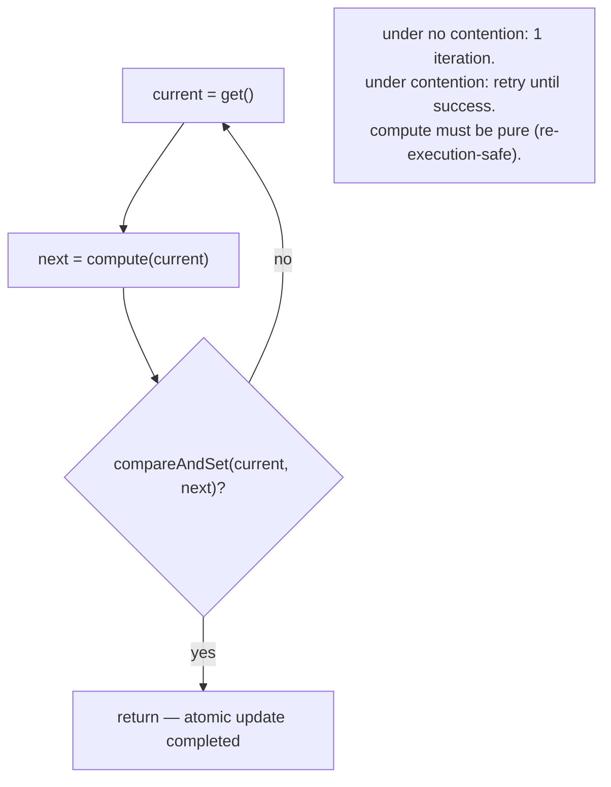
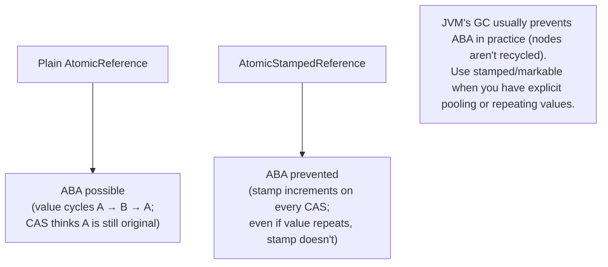
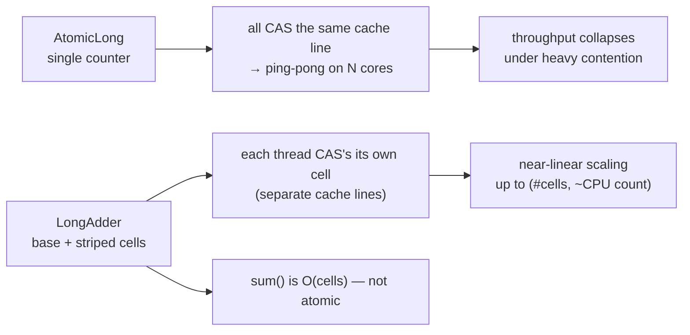
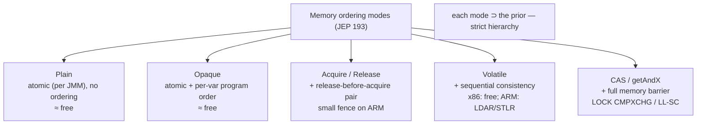

# Atomic Variables

`synchronized` (T03), `Lock` (T08), and the synchronizers (T09) all rely — at the deepest level — on **one** hardware primitive: an atomic *read-modify-write* instruction that lets a single thread perform "read this word, decide based on the value, write a new value" *as one indivisible operation no other thread can observe halfway through*. On every modern CPU that primitive is **compare-and-swap** (CAS): "atomically, if memory[addr] == expected, write memory[addr] = newValue; return whether the write happened." From CAS alone, plus a tight retry loop, you can build *every* concurrent primitive without ever calling a lock — counter increments, lock-free stacks, AQS state CAS, FutureTask result publication, ConcurrentHashMap bucket insertion, monitor inflation. The `java.util.concurrent.atomic` package is Java's surfacing of CAS as an API — `AtomicInteger`, `AtomicLong`, `AtomicReference`, plus a dozen more — and the JDK 9+ `VarHandle` is the modern unified replacement.

The depth-bar requirement isn't "use `AtomicInteger` instead of `synchronized` for counters." At the **language** layer, the atomic classes expose **`get`/`set`/`compareAndSet`/`getAndAdd`/`updateAndGet`** plus variants over the same `volatile`-backed value, organized as a small zoo (scalars `Atomic{Int,Long,Boolean,Reference}`, arrays `Atomic*Array`, field updaters `Atomic*FieldUpdater`, the modern accumulators `LongAdder`/`LongAccumulator`/`DoubleAdder`/`DoubleAccumulator`) plus the *ABA-safe* pair (`AtomicStampedReference`, `AtomicMarkableReference`). At the **mechanism** layer, the canonical **CAS-loop idiom** — `for(;;) { v = get(); n = f(v); if (compareAndSet(v, n)) return n; }` — is the fundamental lock-free update pattern; every `updateAndGet`/`accumulateAndGet`/`getAndIncrement` compiles to it. At the **hardware** layer, the CAS itself is *one instruction* on x86 (`LOCK CMPXCHG`, ~20–40 cycles, full memory barrier) and an LL/SC pair on ARM64 (`LDAXR`/`STLXR` retry loop, or a single `CASAL` under ARMv8.1+ LSE), and the *memory-ordering* modes exposed via `VarHandle` (Plain / Opaque / Acquire-Release / Volatile per JEP 193) map directly to the CPU's fence inventory. At the **scaling** layer, `LongAdder` solves the cache-line ping-pong problem of `AtomicLong`-under-contention by striping the counter across `@Contended`-padded cells indexed by thread probe — a 100× throughput improvement under heavy concurrent increments at the cost of O(cells) `sum()`. We will cover all four layers, finishing with the lock-free Treiber-stack pattern that the JDK uses internally in CompletableFuture, FutureTask, and AQS itself.

> [!NOTE]
> Prerequisites: [Concurrent collections](./T10-concurrent-collections.md) (L3/C01/T10) — CHM uses CAS for empty buckets, LongAdder for size(); [Synchronizers](./T09-synchronizers-semaphore-countdownlatch-cyclicbarrier-phaser.md) (L3/C01/T09) — AQS state CAS; [Locks](./T08-locks-reentrantlock-readwritelock-stampedlock.md) (L3/C01/T08) — every `tryAcquire` is a CAS; [synchronized, monitors & intrinsic locks](./T03-synchronized-monitors-and-intrinsic-locks.md) (L3/C01/T03) — `LOCK CMPXCHG` and the hardware CAS instruction; [How Computers Run Programs](../../L0-foundations/C01-cs-foundations/T01-how-computers-run-programs-cpu-memory-binary.md) (L0/C01/T01) — CPU instructions, atomic operations.

## Why Atomic Variables — `volatile` Is Not Enough

`volatile` (T12) gives you **visibility**: any thread reading a `volatile int` sees the latest write any other thread made. But it does *not* give you **atomicity over read-modify-write** sequences. The classic broken pattern:

```java
volatile int counter;
// thread A and thread B both run:
counter = counter + 1;          // ✗ three steps: read, add, write — interleaved → lost updates
```

Even though every read sees the latest write, between *this* thread's read and write *another* thread can interleave its own write. The increment is not atomic — it's a read, an add, and a write. Two threads doing `counter++` 1 million times each yield a count somewhere between *1 million* (every other increment lost) and *2 million* — the "lost update" problem.

The fix is either a lock (T08) — heavyweight for a single counter — or **CAS**: read the value, compute the new value, *atomically* write the new value only if the old value is still there.

```java
AtomicInteger counter = new AtomicInteger();
counter.incrementAndGet();      // ✓ atomic — uses CAS internally
```

Inside `incrementAndGet`, the JVM emits a CAS-loop that retries until success. From the outside, the operation looks atomic.

## CAS — Compare-and-Swap

The hardware primitive every atomic class is built on. Conceptually:

```java
// atomic — no other thread can observe an intermediate state
boolean compareAndSet(int* addr, int expected, int newValue) {
    if (*addr == expected) {
        *addr = newValue;
        return true;
    }
    return false;
}
```

On x86, this is one instruction:

```asm
lock cmpxchg [addr], rcx     ; if [addr]==rax then [addr]=rcx, ZF=1; else rax=[addr], ZF=0
```

`LOCK CMPXCHG` is atomic (no other core observes a torn intermediate), serves as a **full memory barrier**, and costs ~20-40 cycles. On a modern Skylake-or-later core, that's ~5-10 ns of wall time — comparable to a single L1 cache miss. This is *the* primitive that makes lock-free concurrency feasible on commodity hardware.

On ARM64 (a weakly-ordered architecture), CAS is an **LL/SC** (load-link/store-conditional) pair:

```asm
retry:
   ldaxr   x3, [x0]         ; load-acquire-exclusive
   cmp     x3, x1            ; compare to expected
   b.ne    fail
   stlxr   w4, x2, [x0]      ; store-release-exclusive (fails if line was touched)
   cbnz    w4, retry         ; retry on failure
```

ARMv8.1+ added the `CASAL`/`CASA`/`CASL` family — single-instruction CAS with various memory-ordering options. HotSpot uses these under `-XX:+UseLSE` when supported, dropping the LL/SC retry loop.

> [!IMPORTANT]
> **Every lock-free primitive in the JDK reduces to CAS.** AQS state transitions, CHM bucket inserts, ObjectMonitor inflations, FutureTask result publications, CompletableFuture stack pushes — all are CAS at the bottom. The hardware instruction is the absolute floor of concurrent programming on commodity CPUs.

## The CAS-Loop Idiom

The fundamental lock-free update pattern. Every operation more complex than "atomically set this value" uses it:

```java
public final int getAndAdd(int delta) {
    for (;;) {
        int current = get();                              // read
        int next    = current + delta;                    // compute
        if (compareAndSet(current, next)) return current; // atomic-write-if-unchanged
        // CAS failed → another thread updated — loop and retry
    }
}
```

Three steps: **read**, **compute**, **CAS**. Under no contention, the loop runs once. Under contention, the CAS fails (because another thread's CAS got there first), and we re-read and recompute. Eventually some thread wins; on average, in light contention, the expected number of retries is bounded by the number of contending threads.

Three things to internalize:

1. **The compute step must be pure (no side effects).** It can re-execute many times on retry.
2. **The loop is wait-free under no contention, lock-free overall.** No thread ever blocks; eventually, *some* thread always succeeds.
3. **Under high contention, throughput degrades.** Threads spin in the retry loop wasting CPU. This is why `LongAdder` (below) exists — to spread contention across cells.



## `AtomicInteger`, `AtomicLong`, `AtomicBoolean` — Scalar Atomics

The API surface — all three look essentially the same (substitute the type):

```java
AtomicInteger ai = new AtomicInteger(0);

// reads
int v = ai.get();                       // volatile load — atomic, ordered
int v = ai.getOpaque();                  // atomic, NO ordering (JDK 9+)
int v = ai.getAcquire();                 // acquire-mode load (JDK 9+)
int v = ai.getPlain();                   // plain read — no atomic guarantees (JDK 9+)

// writes
ai.set(v);                               // volatile store — atomic, ordered
ai.lazySet(v);                           // release-mode store — equivalent to setRelease (JDK 9+)
ai.setOpaque(v); ai.setRelease(v); ai.setPlain(v);

// CAS operations
boolean ok = ai.compareAndSet(expect, update);          // strong CAS
boolean ok = ai.weakCompareAndSet(expect, update);     // weak CAS (may spuriously fail)
int prev   = ai.compareAndExchange(expect, update);     // returns the witnessed value (JDK 9+)

// CAS-loop helpers
int prev = ai.getAndIncrement();         // ++
int next = ai.incrementAndGet();
int prev = ai.getAndDecrement();
int next = ai.decrementAndGet();
int prev = ai.getAndAdd(delta);
int next = ai.addAndGet(delta);
int prev = ai.getAndSet(v);              // returns prior value

// functional CAS-loop helpers (JDK 8+)
int next = ai.updateAndGet(x -> x * 2);                       // CAS-loop with unary fn
int prev = ai.getAndUpdate(x -> x * 2);
int next = ai.accumulateAndGet(delta, (a, b) -> a + b);       // CAS-loop with binary fn
int prev = ai.getAndAccumulate(delta, (a, b) -> a + b);
```

Three things worth knowing:

- **`get()` is a volatile load** — same cost as reading any `volatile int` (≈1 ns on modern hardware; effectively free). No CAS, no fence beyond the implicit volatile-load ordering.
- **`lazySet(v)`** stores with *release* semantics but *no* full fence — useful for "publish but don't synchronize" patterns (most commonly: zero out a reference to help GC). Negligibly faster than `set()`, but the JIT can sometimes elide more.
- **`updateAndGet(fn)`** is the modern way to write a CAS loop. Pass a pure function; the implementation does the loop for you. Avoid hand-writing CAS loops when this exists.

### `AtomicInteger.value` is `volatile int`

Under the hood, all the atomic classes wrap a single `volatile` field:

```java
public class AtomicInteger {
    private static final VarHandle VALUE;       // JDK 9+ — was Unsafe before
    static { VALUE = MethodHandles.lookup().findVarHandle(AtomicInteger.class, "value", int.class); }

    private volatile int value;                  // the actual storage

    public final int get() { return value; }
    public final boolean compareAndSet(int expect, int update) {
        return VALUE.compareAndSet(this, expect, update);
    }
    public final int incrementAndGet() {
        return VALUE.getAndAdd(this, 1) + 1;
    }
    // ...
}
```

The wrapper exists for one reason: to expose CAS-style operations on a `volatile` field. The JIT compiles `compareAndSet` directly to `LOCK CMPXCHG` (x86) or LL/SC (ARM) — no method-call overhead in hot code.

## `AtomicReference<V>` — and Lock-Free Data Structures

```java
AtomicReference<Node> head = new AtomicReference<>();

// Treiber stack push (lock-free LIFO)
void push(V value) {
    Node newNode = new Node(value);
    for (;;) {
        Node oldHead = head.get();
        newNode.next = oldHead;
        if (head.compareAndSet(oldHead, newNode)) return;
    }
}

// Treiber stack pop
V pop() {
    for (;;) {
        Node oldHead = head.get();
        if (oldHead == null) return null;
        Node newHead = oldHead.next;
        if (head.compareAndSet(oldHead, newHead)) return oldHead.value;
    }
}
```

This is **Treiber's stack** (R.K. Treiber, 1986) — the simplest lock-free data structure. The same CAS-loop idiom applied to a head pointer. Every push and pop is a single CAS on the head; collisions retry. CompletableFuture's completion stack (T07), FutureTask's waiter stack (T06), ObjectMonitor's cxq (T03) all use this pattern.

### The ABA Problem — When CAS Lies

Treiber's stack has a subtle bug that only matters when nodes are recycled:

1. Thread A reads `head = NodeX`.
2. Thread A about to CAS `head: NodeX → NodeY`.
3. Thread B pops NodeX (head = NodeX.next).
4. Thread B pops more.
5. Thread B pushes NodeX (recycled from a pool) — head = NodeX again.
6. Thread A's CAS sees `head == NodeX` → **succeeds**! But the stack is now in a corrupted state.

The CAS could not distinguish "the original NodeX is still here" from "a recycled NodeX happens to be here now with completely different siblings." This is the **ABA problem**: value goes A → B → A; CAS treats the second A as the first A.

In Java, ABA is rare in practice because the GC keeps nodes alive while there's still a reference (so they can't be recycled mid-CAS). It bites when:

- You implement an explicit node pool (recycling Nodes to avoid GC pressure).
- You use `Atomic*FieldUpdater` over a long-lived field where stamps matter.
- You implement lock-free algorithms over arrays of integers or longs where values genuinely repeat.

### `AtomicStampedReference` and `AtomicMarkableReference` — ABA defeated

The fix: pair the reference with a counter (stamp) or a bit (mark), and CAS *both atomically*. Any change increments the stamp; ABA is impossible because the stamp differs.

```java
AtomicStampedReference<Node> stamped = new AtomicStampedReference<>(initial, 0);

// push (with stamp increment)
void push(V v) {
    int[] stampHolder = new int[1];
    for (;;) {
        Node oldHead = stamped.get(stampHolder);
        int oldStamp = stampHolder[0];
        Node newNode = new Node(v, oldHead);
        if (stamped.compareAndSet(oldHead, newNode, oldStamp, oldStamp + 1)) return;
    }
}
```

Every CAS bumps the stamp by 1. Even if the reference value returns to a prior state, the stamp doesn't — so the CAS will fail. The cost: each operation is now two CAS'd values atomically, which on most hardware means it's implemented via a *double-width* CAS (16 bytes on 64-bit) or via an auxiliary wrapper object that's CAS-replaced. Either way, slightly more expensive than the plain `AtomicReference` — but ABA-safe.

`AtomicMarkableReference` is the same idea with a boolean mark instead of an int stamp — for cases where you only need to record "logically deleted" status alongside the pointer.



## `Atomic*FieldUpdater` — Avoiding the Per-Instance Object Cost

Every `AtomicInteger` is a **separate object** — at least 16 bytes of object header + 4 bytes of value + padding = 24 bytes on a 64-bit JVM. Wrapping every per-instance counter inflates memory dramatically in objects with many concurrent fields.

The fix: a *static* `Atomic*FieldUpdater` that operates on a regular `volatile` field of any instance via reflection.

```java
class Node {
    volatile int sequence;                                  // regular volatile field
    static final AtomicIntegerFieldUpdater<Node> SEQUENCE =
        AtomicIntegerFieldUpdater.newUpdater(Node.class, "sequence");

    void incrementSequence() {
        SEQUENCE.incrementAndGet(this);                      // CAS the field of THIS instance
    }
}
```

The `Updater` is a static singleton; each `Node` has only a `volatile int` (4 bytes), not a 24-byte `AtomicInteger`. JDK 9+ replaced the underlying mechanism with `VarHandle`, but the API surface is unchanged.

When to use updaters:

- You have *many* objects with per-instance CAS-updateable fields (e.g., nodes in a lock-free data structure).
- Memory matters more than the small reflective lookup overhead.

When *not* to use updaters:

- Small number of instances → just use `AtomicInteger`.
- The field's name might be obfuscated/refactored → reflection-based lookup is brittle to renames.

Modern code prefers `VarHandle` directly (next section), which `Atomic*FieldUpdater` is implemented on internally. New code rarely needs `Updater` types except for compatibility with pre-JDK-9 patterns.

## `LongAdder` and `LongAccumulator` — Striped Counters for Hot Increments

`AtomicLong.incrementAndGet()` is fast — uncontended, ~10 ns. Under *contention* from many threads, it becomes pathological: every increment CAS's the same word, every CAS pulls the cache line exclusive on *some* core, and the line ping-pongs across cores. With 32 threads incrementing one counter, throughput can drop to ~1 increment per microsecond — 30× slower than a single thread.

`LongAdder` (JDK 8) fixes this with **striped cells**:

```java
public class LongAdder {
    private transient volatile long base;
    private transient volatile Cell[] cells;

    @jdk.internal.vm.annotation.Contended           // pad to cache-line size
    static final class Cell {
        volatile long value;
    }

    public void add(long x) {
        Cell[] as; long b, v; int m; Cell a;
        if ((as = cells) != null || !casBase(b = base, b + x)) {
            // base contended; use a cell
            boolean uncontended = true;
            if (as == null || (m = as.length - 1) < 0 ||
                (a = as[getProbe() & m]) == null ||             // hash this thread to a cell
                !(uncontended = a.cas(v = a.value, v + x))) {
                longAccumulate(x, null, uncontended);            // grow cells or retry
            }
        }
    }

    public long sum() {
        long sum = base;
        Cell[] as = cells;
        if (as != null) for (Cell a : as) if (a != null) sum += a.value;
        return sum;
    }
}
```

The pattern:

- **Base counter** for the uncontended fast path (single CAS).
- **Cell array** indexed by a per-thread probe (`Thread.threadLocalRandomProbe`). Each thread hashes to a cell and CAS's *just that cell*.
- **`@Contended` padding** ensures each cell sits in its own cache line — no false sharing.
- **`sum()`** walks `base + Σ cells`. **O(cells)** — typically 4-16 cells, so ~50-100 ns.



### When LongAdder beats AtomicLong (and when it doesn't)

- **Write-heavy / read-rare**: LongAdder dominates. Stats counters, metrics, throughput meters, CHM size — all use LongAdder internally.
- **Read-heavy / write-rare**: AtomicLong wins. `get()` is O(1) and you rarely pay the cost of incrementing.
- **Strict atomicity required**: AtomicLong. `LongAdder.sum()` is not atomic — it's the sum of point-in-time reads, so two threads each reading `sum()` between increments may see different values.

### `LongAccumulator` — generalized LongAdder

`LongAdder` is hardcoded to sum (`(a, b) → a + b`). `LongAccumulator` takes a `LongBinaryOperator`:

```java
LongAccumulator max = new LongAccumulator(Math::max, Long.MIN_VALUE);
max.accumulate(42);
max.accumulate(17);
max.accumulate(99);
long m = max.get();              // 99
```

Useful for non-sum aggregations: max, min, multiplication, custom reduction. Same striping behaviour, same `O(cells)` `get()`.

> [!INTERVIEW]
> "Why is `LongAdder` faster than `AtomicLong` under contention?" — Senior answer: **AtomicLong concentrates all increments onto one cache line; under N concurrent writers, the line ping-pongs across cores via the cache coherence protocol (MESI invalidate-and-reacquire), serializing throughput. LongAdder stripes the counter across `@Contended`-padded cells indexed by a per-thread probe, so each thread CAS's its own cache line. Cost: `sum()` is O(cells), not O(1). Use LongAdder when increments are hot and reads are rare; AtomicLong when reads are hot and increments are rare.**

## `VarHandle` — the Modern Unified API (JDK 9+)

Before JDK 9, all atomic operations were implemented via `sun.misc.Unsafe` — an internal, unstable, dangerous API the JDK never officially exposed. The atomic classes (`AtomicInteger`, etc.) and `Atomic*FieldUpdater` were the *only* sanctioned ways to perform atomic operations.

JDK 9 (JEP 193) introduced `VarHandle` — a typed, safe, unified API for atomic memory access, with explicit memory-ordering control. Now:

- `AtomicInteger.compareAndSet` is implemented via a static `VarHandle` to `value`.
- `Atomic*FieldUpdater` is implemented via `MethodHandles.privateLookupIn(...)` + `VarHandle`.
- User code can directly use `VarHandle` for custom atomic patterns without the per-instance object cost or the reflective updater overhead.

### `VarHandle` example

```java
class Node {
    volatile Object value;
    static final VarHandle VALUE;
    static {
        try {
            VALUE = MethodHandles.lookup().findVarHandle(Node.class, "value", Object.class);
        } catch (Exception e) { throw new ExceptionInInitializerError(e); }
    }

    void update() {
        Object oldVal, newVal;
        do {
            oldVal = VALUE.getVolatile(this);
            newVal = compute(oldVal);
        } while (!VALUE.compareAndSet(this, oldVal, newVal));
    }
}
```

`MethodHandles.lookup().findVarHandle(class, name, type)` builds a static VarHandle bound to the named field. The VarHandle exposes:

- **Reads:** `getVolatile`, `getAcquire`, `getOpaque`, `get` (plain — JDK 9+; rarely used).
- **Writes:** `setVolatile`, `setRelease`, `setOpaque`, `set`.
- **CAS:** `compareAndSet` (strong), `weakCompareAndSet`, `weakCompareAndSetAcquire`, `weakCompareAndSetRelease`, `weakCompareAndSetPlain`.
- **Compare-and-exchange:** `compareAndExchange`, `compareAndExchangeAcquire`, `compareAndExchangeRelease` — return the witnessed value, useful when you want the *old* value regardless of CAS success.
- **Atomic update helpers:** `getAndSet`, `getAndAdd`, `getAndAddAcquire`, `getAndAddRelease`.

### Memory-ordering modes — JEP 193's full hierarchy

JEP 193 codified five memory-access modes, each defining a precise contract:

| Mode | Atomicity | Ordering | Cost |
|------|:---------:|----------|------|
| **Plain** (`get`/`set`) | atomic for `int`/`long`/`reference` (per JMM) | no inter-thread ordering | ~free (just a memory read/write) |
| **Opaque** (`getOpaque`/`setOpaque`) | atomic + per-variable program order | no cross-variable ordering | ~free |
| **Acquire / Release** (`getAcquire`/`setRelease`) | atomic + acquire/release semantics | release-before-acquire ordering on this var | small fence on weakly-ordered CPUs |
| **Volatile** (`getVolatile`/`setVolatile`) | atomic + sequential consistency over volatile vars | full ordering | x86: free; ARM: `LDAR`/`STLR` + `DMB ISH` |
| **CAS / GetAndX** | atomic + full ordering | full memory barrier | one `LOCK CMPXCHG` (x86) or LL/SC (ARM) |

The semantics are a strict hierarchy: each mode includes the guarantees of the modes above it (Plain ⊂ Opaque ⊂ Acquire/Release ⊂ Volatile ⊂ CAS).

The two practical takeaways:

1. **On x86**, the cost differences are minor — TSO makes plain stores/loads behave like acquire/release for free, and `LOCK CMPXCHG` is the only "expensive" instruction. Most code can use `volatile` (the default for `AtomicInteger.get`/`set`) without measurable penalty.
2. **On ARM**, the differences are real — explicit fences (`DMB ISH`) cost cycles, and using `Opaque` / `Acquire`-`Release` modes where appropriate can give meaningful speedups in hot lock-free code. Modern HotSpot generates the right fence per mode.



## Weak vs Strong CAS

```java
boolean ok = vh.compareAndSet(this, expected, newValue);          // STRONG
boolean ok = vh.weakCompareAndSet(this, expected, newValue);     // WEAK
```

Both *atomically* check-and-swap. The difference:

- **Strong CAS** is guaranteed to fail *only* when the value mismatched. If the value matched, the swap *will* succeed.
- **Weak CAS** *may spuriously fail* even when the value matched. This happens on ARM when the LL/SC monitor is "lost" for unrelated reasons (cache-line contention from any nearby memory access, even reads). On x86, weak and strong CAS compile to the same instruction (`LOCK CMPXCHG`) — there's no difference.

The rationale: ARM's LL/SC reservation can be invalidated by *any* event touching the cache line — including loads from other cores. A strong CAS would have to retry the LL/SC pair internally on spurious failures; a weak CAS lets the *caller* handle retries explicitly. Since most CAS callers are already in a retry loop, weak CAS lets the loop be the retry mechanism — no double-retry inside the strong CAS.

```java
// in a CAS loop — weak is fine; the loop is already retrying
for (;;) {
    int v = get();
    if (weakCompareAndSet(v, v + 1)) break;       // ✓ weak is fine in a loop
}

// outside a loop — strong is needed
if (compareAndSet(0, 1)) {                         // ✓ strong; must not spuriously fail
    initialize();                                    // critical: only one thread should do this
}
```

The performance difference is meaningful on ARM (avoiding the strong CAS's internal retry); on x86 it's nothing. Modern code mostly uses strong CAS for safety; weak appears in lock-free hot loops where every cycle counts.

## Performance — the Numbers

| Op | Uncontended | Contended (N threads on same word) |
|----|------------:|-----------------------------------:|
| `AtomicInteger.get()` | ~1 ns (volatile load) | ~1 ns (reads scale) |
| `AtomicInteger.set(v)` | ~1 ns (volatile store) | scales, no CAS |
| `AtomicInteger.compareAndSet` (x86) | ~10-20 ns (`LOCK CMPXCHG`) | retry × N; throughput ~1/N |
| `AtomicInteger.compareAndSet` (ARM64) | ~15-30 ns (LL/SC or CAS) | similar scaling |
| `AtomicInteger.incrementAndGet` | ~10-20 ns | throughput collapses to ~1 inc / cache-line latency |
| `LongAdder.increment` | ~10-20 ns | **near-linear scaling** — ~100× faster than AtomicLong under heavy contention |
| `LongAdder.sum()` | ~50-100 ns | O(cells) — moderate scaling |
| `AtomicReference.compareAndSet` | ~15-30 ns | same as int |
| `VarHandle.compareAndSet` | identical to AtomicX (same machine code) | same |

The pattern: **uncontended is fast; contended on the same word is slow; contended across separate cache lines (LongAdder) is fast again.** The key insight: it's not the CAS itself that's slow, it's the **cache line ping-pong** under contention. Avoid contention on a single word and you have lock-free at full speed.

### False sharing — the silent CAS killer

```java
class Stats {
    AtomicLong reads = new AtomicLong();
    AtomicLong writes = new AtomicLong();      // adjacent in memory to reads
}
```

`reads` and `writes` may share an L1 cache line (64 bytes). Even though they're independent counters, *every* CAS on one invalidates the other's cache line on every core. Performance hit identical to genuinely contending on one word — **false sharing**.

The fix: `@Contended`:

```java
class Stats {
    @jdk.internal.vm.annotation.Contended AtomicLong reads = new AtomicLong();
    @jdk.internal.vm.annotation.Contended AtomicLong writes = new AtomicLong();
}
```

`@Contended` is JVM-internal (requires `-XX:-RestrictContended` for application code, or use of `sun.misc.Contended` reflectively). It pads the annotated field to occupy its own cache line. `LongAdder.Cell` uses this internally; application code rarely needs it unless extreme contention has been measured.

## Lock-Free Patterns

### Treiber stack (shown above) — push and pop at head

The hello-world of lock-free. CAS on the head pointer.

### Michael-Scott queue (T10) — two pointers

CAS on tail.next and head.next. Each pointer's update is one CAS; coordination via lazy updates of head/tail.

### Atomic accumulator pattern

```java
// thread-safe maximum
AtomicLong max = new AtomicLong(Long.MIN_VALUE);
void recordMax(long v) {
    long cur;
    while ((cur = max.get()) < v && !max.compareAndSet(cur, v));
}
```

CAS-loop with a condition. Works for any monotonic update (min, max, etc.).

### Single-writer race-free publication

```java
volatile Config currentConfig;
VarHandle CONFIG = ...;

void publish(Config newConfig) {
    CONFIG.setRelease(this, newConfig);              // publish with release semantics
}

Config read() {
    return (Config) CONFIG.getAcquire(this);          // read with acquire semantics
}
```

The release/acquire pair gives ordering: every write inside `newConfig` (before `publish`) is visible to threads reading after `getAcquire`. No lock; no CAS; just a one-way fence on each side. Used in configuration hot-reload, snapshot publication.

## Common Mistakes

### Treating `++` on a volatile as atomic

```java
volatile int counter;
counter++;     // ✗ NOT ATOMIC — reads, adds, writes (3 separate steps)
```

Use `AtomicInteger.incrementAndGet()` or `LongAdder.increment()`.

### CAS-looping when atomicity must span multiple variables

```java
AtomicInteger a = new AtomicInteger();
AtomicInteger b = new AtomicInteger();
// trying to atomically update both:
a.set(...); b.set(...);     // ✗ NOT atomic across both
```

Two independent CAS's cannot be atomic together. Either pack into one CAS-able value, use a lock, or design so they don't need to be atomic together. STM (software transactional memory) exists but is rarely a good fit.

### Forgetting ABA on recycled pointers

```java
// pool of nodes — recycled
class Pool { Node take() {...} void put(Node n) {...} }
// CAS-based stack using pooled nodes:
// → ABA possible because Node references can repeat
```

Use `AtomicStampedReference` or don't pool. JDK GC usually prevents this in non-pooled code; if you're pooling, you're now responsible for the ABA prevention.

### Using LongAdder where you need an exact snapshot

```java
LongAdder counter = new LongAdder();
// ...
if (counter.sum() == 100) doSomething();     // ✗ sum is point-in-time approximate
```

`sum()` is the sum of point-in-time reads — between cells, other threads may increment. Don't use it for control flow that needs exactness. For exact, use `AtomicLong` with the contention cost.

### `lazySet` for synchronization

```java
AtomicReference<X> ref;
ref.lazySet(newValue);
// other thread does ref.get() expecting newValue
```

`lazySet` is *release-only*; the get on the other thread must use *acquire* (which `get()` does — it's volatile-load). This works, but the *intent* is unclear. Prefer `setRelease` (JDK 9+ VarHandle) which names the semantics.

### Spinning forever on a contended CAS

```java
while (!atomic.compareAndSet(expect, update));   // ✗ infinite loop if expect never matches
```

A CAS-loop must have a way to make progress. If your `expect` value depends on what you read, re-read inside the loop; if it's invariant, re-design.

### Calling `compareAndSet` where `set` would do

```java
if (atomic.compareAndSet(0, 1)) initialize();   // ✓ correct for "first one wins"
atomic.compareAndSet(atomic.get(), newVal);     // ✗ pointless — race between get and CAS
```

`atomic.set(newVal)` would have the same effect with one volatile store. CAS is for "only if value is X" semantics.

### Using `Atomic*FieldUpdater` on a non-volatile field

```java
class Node { int seq; static final ATOM = ... AtomicIntegerFieldUpdater.newUpdater(...,"seq"); }
                  // ✗ "seq" is not volatile → newUpdater throws IllegalArgumentException at class init
```

Updaters require the target field to be `volatile`. The check is at static init time; you'll get an exception when the class loads.

### Boxing in CAS loops

```java
AtomicReference<Integer> count = new AtomicReference<>(0);
count.updateAndGet(x -> x + 1);     // ✗ allocates a new Integer per increment
```

Reference CAS-loops on boxed types allocate per increment. Use `AtomicInteger` for primitive ints. Or `LongAccumulator` for hot non-sum cases.

## Observability

### Cycle counting

For hot lock-free code, count actual CAS retries. Use `-XX:+UnlockDiagnosticVMOptions -XX:+PrintAssembly` (with hsdis) and check that your CAS loop emits one `LOCK CMPXCHG` per iteration. Use JMH to measure throughput vs core count — if throughput doesn't scale linearly, you have contention or false sharing.

### `@Contended` impact

To confirm false sharing is killing performance, profile with `perf c2c` (Linux) — it reports cache-line contention. After applying `@Contended` to the hot atomic fields, re-run; the contention line should disappear.

### JFR

`jdk.LockSamples` and the CPU-sampling events don't directly capture CAS contention — CAS retries look like normal CPU work. To find lock-free contention, the *only* tool is throughput measurement under increasing thread counts: if you see sub-linear scaling, contention is the cause.

> [!INTERVIEW]
> "Walk me through what `AtomicInteger.incrementAndGet()` does." — Senior answer:
>
> 1. **API.** Returns `incrementAndGet()` — increment the value by 1, return the new value.
> 2. **JIT lowering.** Compiled to a CAS loop: read the volatile field, compute +1, attempt `compareAndSet(old, old+1)`, retry on failure.
> 3. **Hardware.** On x86: each CAS is one `LOCK CMPXCHG` instruction, atomic + full memory barrier, ~20-40 cycles. On ARM64: an `LDAXR`/`STLXR` pair (or a single `CASAL` under LSE), ~30-50 cycles, ARM's weak memory model requires explicit fences for ordering.
> 4. **Contention behavior.** Under heavy contention, the cache line ping-pongs between cores via MESI; throughput collapses to ~1 increment per cache-line latency. Use `LongAdder` instead — stripes across `@Contended`-padded cells.

> [!INTERVIEW]
> Short Q&A:
>
> 1. **Why isn't `volatile` enough for `counter++`?** It's three steps (read, add, write); other threads can interleave. Use atomic CAS.
> 2. **What's CAS?** Compare-and-swap: atomically, if memory == expected, write newValue. Hardware: `LOCK CMPXCHG` (x86) or LL/SC (ARM).
> 3. **What's the CAS-loop idiom?** `for(;;) { v = get(); n = f(v); if (cas(v, n)) break; }`. Pure read-compute-CAS, retry on failure.
> 4. **What's the ABA problem?** Value changes A → B → A; CAS sees A and thinks nothing changed, but state did. Solution: `AtomicStampedReference` (pair value with a stamp; bump stamp on every CAS).
> 5. **`AtomicLong` vs `LongAdder`?** AtomicLong concentrates writes on one cache line — contention bottleneck. LongAdder stripes across `@Contended`-padded cells indexed by per-thread probe — near-linear scaling. Cost: `sum()` is O(cells).
> 6. **Weak vs strong CAS?** Strong is guaranteed to fail only on value mismatch. Weak may spuriously fail (ARM LL/SC reservation lost). In a CAS loop, weak is fine (loop is the retry); outside, use strong.
> 7. **What is `VarHandle`?** JDK 9+ API for atomic memory access with explicit memory-ordering modes. Replaces `sun.misc.Unsafe` for safe code and is the underlying implementation of `AtomicInteger` and `Atomic*FieldUpdater`.
> 8. **Five memory-ordering modes (JEP 193)?** Plain (no ordering, just atomic), Opaque (per-variable order), Acquire/Release (one-way fence pair), Volatile (sequential consistency), CAS (full barrier). Strict hierarchy.
> 9. **Why is `lazySet` faster than `set`?** Release-only semantics (no full memory barrier). The reader's volatile-load provides the acquire. Slightly faster on weakly-ordered hardware.
> 10. **What's false sharing?** Two unrelated atomic fields in adjacent memory share an L1 cache line; updates to one invalidate the line for cores accessing the other. Fix: `@Contended` padding.
> 11. **`Atomic*FieldUpdater` — when and why?** When you have many objects each needing a CAS-updateable field, and per-instance `AtomicInteger` overhead (~24 bytes) is too much. The updater is a static singleton; each object has only a `volatile int` (4 bytes).
> 12. **Treiber stack?** Lock-free LIFO using one `AtomicReference` to the head. `push`: CAS-replace head with new node. `pop`: CAS-advance head to next.
> 13. **Why does CAS work with `volatile` semantics for free on x86?** TSO (Total Store Order) — x86's memory model already orders almost everything; the only reordering it allows is store-to-load forwarding, which `LOCK`-prefixed instructions block. So CAS gives full ordering as a free side-effect.
> 14. **Why doesn't `LongAdder.sum()` give an atomic snapshot?** It walks cells one at a time; between cells, other threads can increment. The "sum" is approximate.
> 15. **Are atomic variables virtual-thread-friendly?** Completely — they're CPU instructions, no parking, no carrier interaction. Always fine.

## Practice

1. **Counter increment race.** Two threads each increment a `volatile int` 1M times. Measure the final count (should be < 2M). Replace with `AtomicInteger.incrementAndGet`; confirm 2M exactly.
2. **CAS-loop implementation.** Implement `incrementAndGet` yourself with `get` + `compareAndSet` in a loop. Confirm it works identically to the built-in.
3. **ABA reproduction (with a pool).** Build a Treiber stack with an explicit node pool (recycle popped nodes). Construct an ABA sequence using sleeps. Observe corruption. Switch to `AtomicStampedReference`; verify ABA is defeated.
4. **`AtomicLong` cache-line contention.** Build a counter incremented 1M times from N threads (N = 1, 2, 4, 8, 16). Plot throughput. Confirm collapse beyond ~4 threads.
5. **`LongAdder` scaling.** Same setup as (4) but with `LongAdder`. Confirm near-linear scaling up to physical core count.
6. **`LongAdder.sum()` cost.** Measure `sum()` time vs cell count. Confirm O(cells).
7. **False sharing.** Build two `AtomicLong` fields side-by-side; have two threads each hammer one. Measure throughput. Then add 64-byte padding between them (or `@Contended`); re-measure. Confirm 5-10× speedup.
8. **`VarHandle` direct use.** Without using `AtomicInteger`, build a thread-safe counter using `VarHandle` directly. Compare performance to `AtomicInteger`; confirm equivalent.
9. **Memory-ordering modes.** Build a benchmark that publishes a `Map` reference via `setRelease`/`getAcquire`. Compare cost to `setVolatile`/`getVolatile`. On ARM, observe the release/acquire pair is faster.
10. **Treiber stack benchmark.** Implement Treiber's stack with `AtomicReference`. Compare push/pop throughput vs `ConcurrentLinkedDeque` and `Collections.synchronizedList(LinkedList)`.
11. **Weak vs strong CAS in a loop.** Build a CAS loop with both `compareAndSet` and `weakCompareAndSet`. On ARM, measure throughput difference; on x86, confirm they're identical.
12. **`AtomicReferenceFieldUpdater` memory savings.** Build 1M nodes, each with an atomic counter via (a) embedded `AtomicLong`, (b) `volatile long` + static `LongFieldUpdater`. Measure heap. Confirm (b) is ~5× smaller.

## Recap

You should now be able to:

- State **why volatile alone isn't enough**: `counter++` is read-modify-write (three steps); other threads can interleave. CAS provides atomicity over the whole read-modify-write.
- Explain **the CAS hardware primitive**: `LOCK CMPXCHG` on x86 (one instruction, full barrier, ~20-40 cycles); LL/SC pair (`LDAXR`/`STLXR`) on ARM64, with ARMv8.1 `CASAL` as the single-instruction alternative. Every atomic class is built on this.
- Write the **canonical CAS-loop idiom**: `for(;;) { v = get(); n = f(v); if (cas(v, n)) break; }`. The compute function must be pure (re-execution-safe); the loop is wait-free under no contention and lock-free overall.
- Use **the scalar atomics** (`AtomicInteger`, `AtomicLong`, `AtomicBoolean`, `AtomicReference`) for their respective types; pick CAS variants (`compareAndSet` / `weakCompareAndSet` / `compareAndExchange`) by need; prefer the *functional* helpers (`updateAndGet`, `accumulateAndGet`) over hand-written CAS loops.
- Build **lock-free data structures** using `AtomicReference` + CAS-loop — Treiber stack as the canonical example; Michael-Scott queue (T10) as the FIFO equivalent.
- Recognize and defeat the **ABA problem**: value cycles A → B → A; CAS thinks nothing changed. Fix: `AtomicStampedReference` (pair value with stamp; bump on every update). Mostly relevant when you pool/recycle nodes; JDK GC usually prevents ABA in non-pooled code.
- Use **`Atomic*FieldUpdater`** to avoid per-instance `AtomicInteger` (~24-byte) overhead when you have many objects each needing a CAS-updateable field; understand that the underlying mechanism since JDK 9 is `VarHandle`.
- Distinguish **`AtomicLong`** (cache-line ping-pong under contention; ~1 inc per line-latency under heavy load) from **`LongAdder`** (striped `@Contended`-padded cells indexed by per-thread probe; near-linear scaling). `LongAdder.sum()` is O(cells) and not an atomic snapshot. Use LongAdder for write-heavy counters; AtomicLong for read-heavy.
- Generalize via **`LongAccumulator`** to non-sum aggregations (max, min, custom `LongBinaryOperator`) with the same striping behaviour.
- Use **`VarHandle`** (JDK 9+) as the modern atomic-memory-access API; understand it underlies `AtomicInteger` and `Atomic*FieldUpdater`; pick **memory-ordering modes** (Plain ⊂ Opaque ⊂ Acquire/Release ⊂ Volatile ⊂ CAS per JEP 193) per need — on x86 the cost difference is negligible, on ARM the differences are real.
- Choose **weak vs strong CAS**: strong is guaranteed to fail only on value mismatch; weak may spuriously fail (ARM LL/SC reservation lost). In a CAS loop, weak is fine; outside, use strong.
- Quote the **performance numbers**: uncontended CAS ~10-30 ns; under heavy single-word contention, throughput collapses to ~1 op per cache-line latency; LongAdder restores near-linear scaling; `get()` on AtomicX is volatile-load-fast (~1 ns).
- Defeat **false sharing** with `@Contended` padding when two unrelated atomic fields share a cache line.
- Avoid the **ten common bugs**: treating `++` on volatile as atomic; CAS-looping across multiple variables; ABA on recycled pointers; using `LongAdder.sum()` for exact-control flow; `lazySet` semantic confusion; infinite-spin CAS loops with stale `expect`; pointless CAS where `set` suffices; updaters on non-volatile fields; boxing in CAS loops; mis-applying `@Contended` (it's restricted to JDK internals unless `-XX:-RestrictContended`).
- State the **virtual-thread compatibility**: atomic operations are CPU instructions, no parking, no carrier interaction — fully VT-friendly always.

## Next

Continue to [Java Memory Model (happens-before, volatile)](./T12-java-memory-model-happens-before-volatile.md) — the *specification* underneath every concurrency primitive we've covered. We'll dissect the JMM's *happens-before* relation (the formal definition + the eight enumerated rules: program order, monitor lock, volatile, thread start/join, transitive closure, etc.), the precise semantics of `volatile` (atomic load/store of 32/64-bit values, no out-of-order reads through the variable), `final` field initialization guarantees, the *as-if-serial* compiler-reordering rules, and how the JIT realises the JMM on x86's TSO vs ARM's weakly-ordered model. T11's atomic operations are the *implementations*; T12 is the *spec* they implement to.
