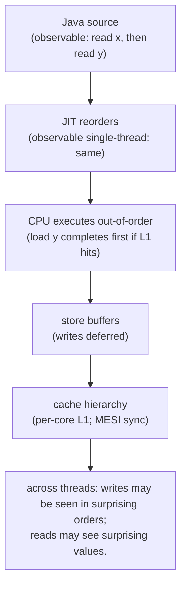
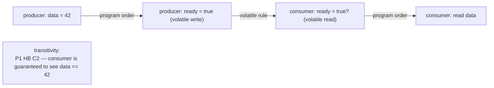
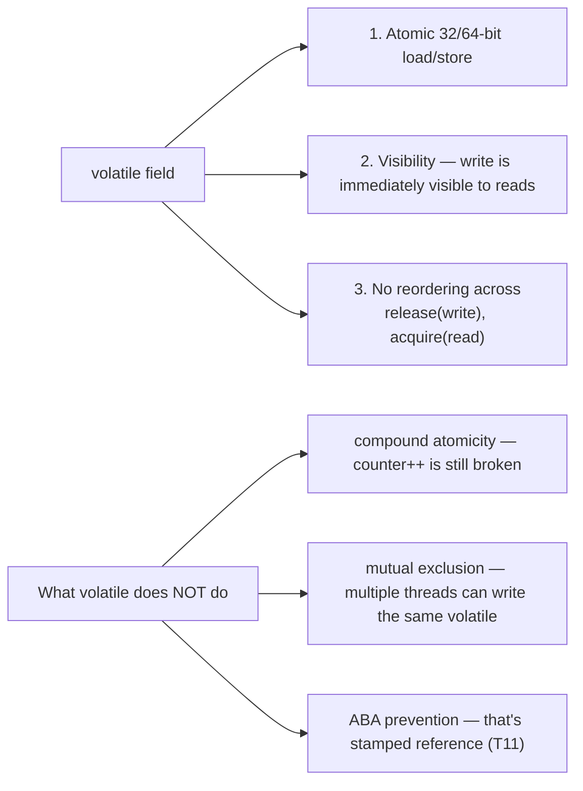
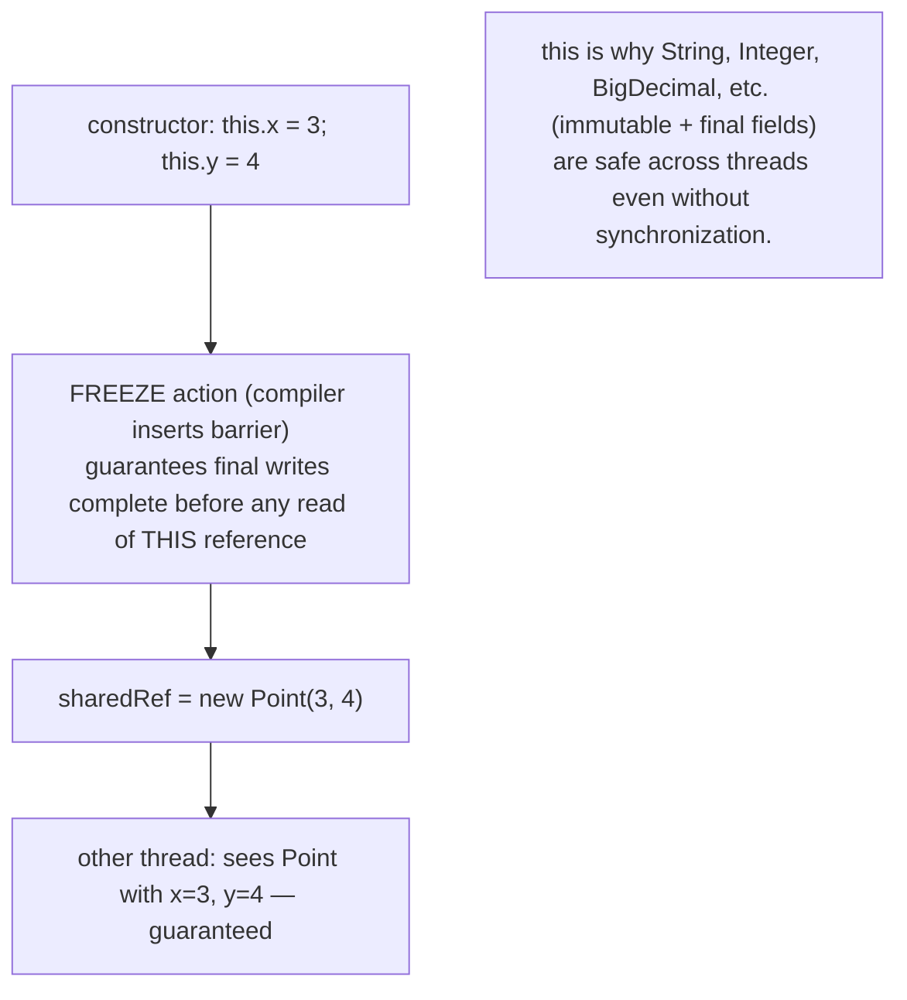
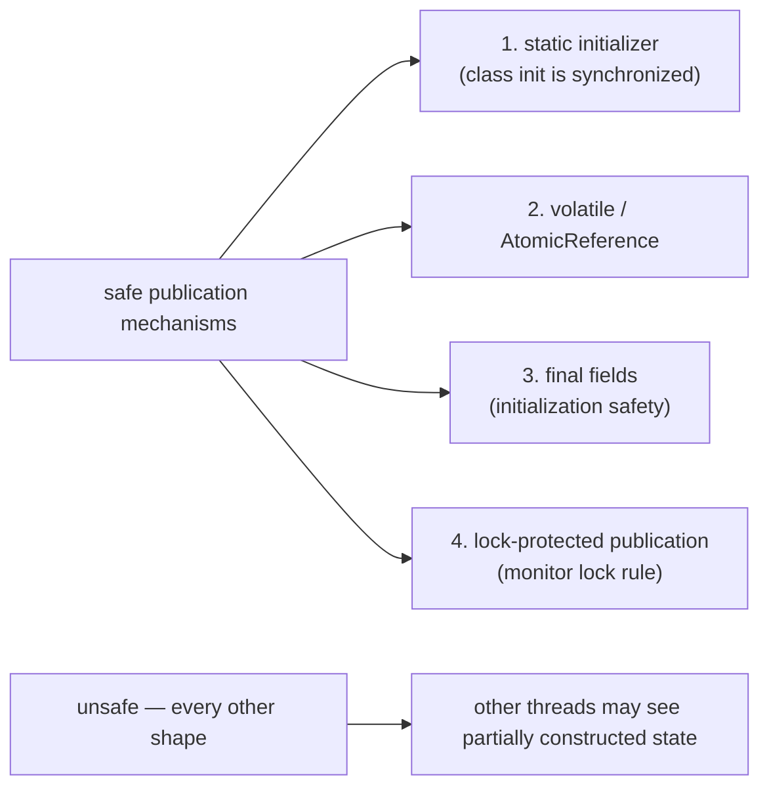
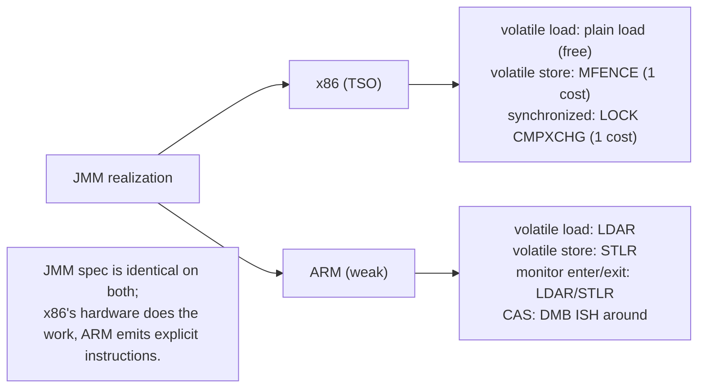

# Java Memory Model (happens-before, volatile)

Every concurrency primitive we have built — `synchronized` (T03), `wait`/`notify` (T04), `Lock`/`Condition` (T08), synchronizers (T09), atomic ops (T11), concurrent collections (T10) — *implements* the Java Memory Model. The JMM is the **formal contract** between the Java programmer and the JVM-plus-hardware: it specifies what writes one thread is *guaranteed* to see from another, when, and under what conditions. Without it, programs that work on one CPU could silently break on another (different cache architecture, different reorder buffer), the JIT couldn't safely optimize, and "thread-safe" would be undefinable. The JMM (JLS §17.4) is one of the most precisely-formalized parts of the JLS — and arguably the deepest of all Java specifications.

The depth-bar requirement isn't "use `volatile` for cross-thread flags." At the **specification** layer, the JMM defines the **happens-before** relation — a partial order over actions that an executing program's threads perform — and *eight* specific rules (program order, monitor lock, volatile, thread start, thread join, interruption, finalizer, transitivity) that build up the relation. If action A *happens-before* action B, then B sees all of A's effects; if no such edge exists, anything goes — the *racy* program may produce any output the JMM permits, which is "almost anything," including values that look impossible. At the **mechanism** layer, **`volatile`** is the cheapest primitive that creates cross-thread happens-before edges: every write to a `volatile` field happens-before every subsequent read, achieving visibility without locking. At the **hardware** layer, the JMM's abstract guarantees map differently to **x86's Total Store Order** (most guarantees free; only store-load reorderings need an `MFENCE`) and **ARM's weakly-ordered model** (explicit fences everywhere — `LDAR`/`STLR` for volatile, `DMB ISH` for locks). At the **safe-publication** layer, the JMM defines exactly **four mechanisms** that safely make a fully-constructed object visible to other threads — and any other publication leaves a window where threads may see partially constructed state, the root cause of *the* canonical bug in `Double-Checked Locking` and a generation of singleton implementations. We will cover all four layers.

> [!NOTE]
> Prerequisites: [Atomic variables](./T11-atomic-variables.md) (L3/C01/T11) — atomic ops are the *implementations*; this topic is the *spec*; [Concurrent collections](./T10-concurrent-collections.md) (L3/C01/T10) — every CHM `get` relies on the volatile-load happens-before edge; [Locks](./T08-locks-reentrantlock-readwritelock-stampedlock.md) (L3/C01/T08) — `synchronized` and `Lock`'s memory edge is the monitor-lock rule; [synchronized, monitors & intrinsic locks](./T03-synchronized-monitors-and-intrinsic-locks.md) (L3/C01/T03) — the acquire/release semantics of monitor enter/exit; [Source to bytecode](../../L0-foundations/C01-cs-foundations/T04-source-to-bytecode-to-jvm-to-machine-code.md) (L0/C01/T04) — JIT compilation can reorder; [How Computers Run Programs](../../L0-foundations/C01-cs-foundations/T01-how-computers-run-programs-cpu-memory-binary.md) (L0/C01/T01) — caches, memory hierarchy.

## Why a Memory Model — Because the Hardware Lies

Every modern CPU lies about what your program does. Not maliciously — for performance:

1. **Compiler reordering.** The JIT reorders bytecodes for register pressure, instruction scheduling, dead-code elimination. As long as a single thread's *observable* behavior is unchanged, the JIT is free to reorder.
2. **CPU out-of-order execution.** Modern cores execute instructions in dataflow order, not program order. An L2-missing load doesn't stall a later add; the add runs immediately if its inputs are ready. Hundreds of in-flight instructions at any time.
3. **Store buffers.** Writes don't reach the cache immediately — they sit in a per-core store buffer, posted to the cache hierarchy lazily. A read from another core may see the *old* value of the cache line until the store buffer drains and the cache-coherence protocol delivers the update.
4. **Cache coherence delays.** Even with MESI keeping caches coherent, the protocol takes cycles — a write on core 0 may take 30-100 cycles to be visible on core 1.
5. **Memory hierarchy.** Register > L1 > L2 > L3 > RAM. Different cores see different "snapshots" depending on what's in their L1 vs the shared L3.



The JMM is what makes this manageable: it tells you *exactly* which reorderings the JIT and CPU may perform, *exactly* what guarantees `synchronized`/`volatile`/`final` give you, and exactly what bugs are possible in *racy* programs (programs without the right synchronization). It does *not* tell you which reorderings will actually happen on your CPU — that's hardware-and-version-specific. It tells you what the spec *permits*.

## As-If-Serial — the Single-Thread Property

The JMM's single-thread guarantee:

> **The JVM and the CPU may freely reorder operations within a single thread as long as the *observable* effects in that thread's program order are preserved.**

So `x = 5; y = 10; z = x + y;` may execute as "compute z first by speculation" or "issue x = 5 and y = 10 in parallel" — but every read in the thread *must* see the value as if the writes happened in source order. The reordering is invisible *to that thread*.

This is why a single-threaded program "just works" — the JMM gives you sequential consistency *within* a thread. The trouble begins *across* threads.

## The Cross-Thread Problem — and Why It's Worse Than You Think

```java
// shared:
int x = 0, y = 0;

// thread A
x = 1;
int r1 = y;

// thread B
y = 1;
int r2 = x;
```

What are the possible values of `(r1, r2)` after both threads complete? *Naïve* sequential reasoning gives three cases:

- A runs first, then B: `r1 = 0, r2 = 1`.
- B runs first, then A: `r1 = 1, r2 = 0`.
- Interleaved: `r1 = 0, r2 = 0` or `r1 = 1, r2 = 1`.

But under the JMM (and on real hardware), **`(0, 0)` is also legal** — even though no sequentially consistent interleaving allows it. Why? Both writes can sit in their respective store buffers; both reads can complete before the stores drain. Each thread sees its own store but not the other's. This is the *Dekker's algorithm violation* — the canonical example of a non-sequentially-consistent memory model.

The fix: declare `x` and `y` `volatile`. The JMM's volatile rule (below) then prohibits this specific reordering — `volatile` writes drain the store buffer, and `volatile` reads pull from main memory. `(0, 0)` becomes impossible.

> [!IMPORTANT]
> **Without proper synchronization, you cannot reason about cross-thread behavior using sequential thinking.** Reads can see "stale" values; writes can be "reordered" relative to each other; values that "couldn't happen" in any interleaving *can* happen on real hardware. The JMM gives you the tools (`synchronized`, `volatile`, `final`, atomics) to *create* the sequential reasoning where you need it.

## The Happens-Before Relation

The JMM defines a partial order over a program's actions called **happens-before** (HB). It's the formal foundation:

> **If action A *happens-before* action B, then:**
> - **All effects of A are visible to B** (writes A made are visible to reads B does).
> - **A is ordered before B** (no observed execution can have B appear to precede A).

HB is **partial** — most pairs of actions in a multithreaded program are *not* ordered by HB, and those pairs can race. HB is **transitive** — if A → B and B → C, then A → C.

If two actions are *not* ordered by HB, they're called a **race**, and the JMM says virtually nothing about what one thread sees of the other's writes. Racy programs can exhibit *any* JMM-permitted behavior — including values that look impossible.

## The Eight Happens-Before Rules (JLS §17.4.5)

The JMM defines HB via *synchronization actions* — specific things that create HB edges across threads. Eight rules, in their canonical form:

### 1. Program order rule

Within a single thread, each action happens-before every action that comes later in program order.

```java
// thread T:
x = 1;       // (a)
y = 2;       // (b) — (a) happens-before (b)
z = x + y;   // (c) — (b) happens-before (c); transitively (a) hb (c)
```

This is the within-thread guarantee from the as-if-serial rule.

### 2. Monitor lock rule

An unlock of monitor M happens-before every subsequent lock of M.

```java
// thread A
synchronized (m) { x = 1; }   // unlock happens-before...

// thread B (later)
synchronized (m) { print(x); } // ...this lock → prints 1 (guaranteed)
```

The release/acquire pair on the same monitor publishes everything A wrote inside its synchronized region.

### 3. Volatile variable rule

A write to volatile field V happens-before every subsequent read of V (that returns the written value).

```java
volatile boolean ready;
int data;

// thread A
data = 42;       // (a)
ready = true;    // (b) — volatile write — (a) HB (b) by program order

// thread B
while (!ready); // volatile read
print(data);     // sees 42 — (b) HB read(ready), and transitively (a) HB print(data)
```

This is what makes `volatile` the cheapest synchronization. The write-then-read of the volatile is the only cross-thread edge, but it carries with it all writes that happened-before it in the writer thread.

### 4. Thread start rule

A call to `Thread.start()` happens-before any action in the started thread.

```java
int x;

// thread A
x = 5;
Thread t = new Thread(() -> print(x));  // (start) — A's prior writes HB any t action
t.start();
```

The new thread sees everything the starter wrote before `start()`. This is how thread launch is correct without explicit synchronization — `start()` is itself a synchronization action.

### 5. Thread termination rule

All actions in a thread happen-before any other thread successfully returns from a `join()` on that thread.

```java
int result;

Thread t = new Thread(() -> { result = compute(); });
t.start();
t.join();           // returns
print(result);      // sees the result — all of t's writes HB this read
```

Same as start, but for the end. Combined with start, this gives you the classic "fan out, fan in" pattern correctness for free.

### 6. Interruption rule

A call to `Thread.interrupt()` happens-before the interrupted thread detects the interrupt (via `InterruptedException` or `isInterrupted()`).

```java
// thread A: t.interrupt();   // (a)
// thread t: catches InterruptedException from sleep
// (a) happens-before the catch
```

Practical consequence: anything A wrote before calling `interrupt()` is visible in the catch block.

### 7. Finalizer rule

The end of an object's constructor happens-before the start of its `finalize()` method.

Rarely useful — finalizers are deprecated in JDK 9+. Listed for completeness.

### 8. Transitivity

If A happens-before B and B happens-before C, then A happens-before C.

This is the unsung hero — every realistic program relies on chaining HB edges. Producer writes data, sets a volatile flag → consumer reads volatile flag, reads data. The consumer sees the data only because of transitivity: producer's data write HB producer's volatile write (program order) HB consumer's volatile read (volatile rule) HB consumer's data read (program order).



## Volatile — the Cheapest Synchronization

`volatile` (Java keyword, declared on a field) gives three guarantees over plain access:

1. **Atomic load/store of 32- and 64-bit values.** On a 32-bit JVM, plain `long` and `double` reads/writes may be **torn** — the JLS permits the JVM to split them into two 32-bit operations, so a reader can see half of the new value and half of the old. `volatile long`/`double` is *guaranteed* atomic. (On a 64-bit JVM, the JVM typically gives atomic 64-bit anyway, but the language guarantee depends on `volatile`.)

2. **Visibility.** Every write to a `volatile` field is *immediately visible* to subsequent reads of the same field on any other thread. No staleness; no buffered-store delay.

3. **No reordering across.** Prior loads/stores can't be moved *after* a volatile write (release semantics); subsequent loads/stores can't be moved *before* a volatile read (acquire semantics). This is what enables the happens-before edge.



### What `volatile` does *not* give you

The most common bug: assuming `volatile` makes compound operations atomic.

```java
volatile int counter;
counter++;       // ✗ STILL BROKEN — reads, adds, writes (3 steps); other threads can interleave
```

`volatile` makes each individual read and write atomic and visible. The `counter++` is *three* operations, not one. For atomicity over read-modify-write, use `AtomicInteger.incrementAndGet()` (T11).

The rule of thumb:

- **Single writer, multiple readers**: `volatile` is sufficient.
- **Multiple writers**: `volatile` won't help — you need locks or atomic CAS.

### Idiomatic uses of `volatile`

```java
// A thread-safe "shutdown flag"
volatile boolean shutdown;
public void shutdown() { shutdown = true; }
public void run() { while (!shutdown) doWork(); }

// A "publication" field for an immutable value
volatile Config config;
public void publish(Config newConfig) { config = newConfig; }      // releases
public Config current() { return config; }                          // acquires

// Double-checked locking with volatile (below)
private volatile Singleton instance;
```

The common pattern: *single* writer (or atomic CAS for multiple writers); many readers; the field's value is either a primitive flag or an immutable object reference.

## Final Field Semantics — Initialization Safety

`final` fields have *special* JMM treatment. The JMM guarantees:

> **Any thread that observes a fully-constructed object via any safe publication mechanism sees the *correctly-initialized* values of all `final` fields, and any objects those finals transitively reference.**

This is *initialization safety* (JLS §17.5). Why it matters:

```java
public final class Point {
    public final int x;
    public final int y;
    public Point(int x, int y) { this.x = x; this.y = y; }
}

// thread A
sharedRef = new Point(3, 4);     // unsafe publication! no volatile, no lock

// thread B
Point p = sharedRef;
print(p.x, p.y);
```

Without final-field semantics, thread B could see `sharedRef` as the new Point but see `p.x = 0` or `p.y = 0` (the default values before the constructor ran). The constructor's writes are "out of order" relative to the assignment of `sharedRef`.

With `final` fields, the JVM emits a **freeze action** at the end of the constructor that prevents the constructor's final-field writes from being reordered with the publication of the object reference. So any thread that sees `sharedRef` is guaranteed to see `x = 3, y = 4`.



### The `this`-escape caveat

Initialization safety only applies if the constructor doesn't let `this` escape — i.e., publish a reference to the partially-constructed object before the constructor finishes. The classic violation:

```java
public final class Listener {
    public final int id;
    public Listener(EventBus bus, int id) {
        this.id = id;
        bus.register(this);       // ✗ this escaped before constructor finished!
                                   //   another thread may see this with id == 0
    }
}
```

If the constructor's body publishes `this` before returning, the freeze action hasn't happened yet, and other threads can see partially-initialized state. Rule: never publish `this` from a constructor (use a static factory or two-step init).

## Safe Publication — The Four Mechanisms

A fully-constructed object is **safely published** if any of these four conditions hold (other threads observing the reference are guaranteed to see fully-constructed state):

1. **Static initializer.** A reference stored in a `static` field initialized by the class's static initializer is safely published — the JLS guarantees class initialization is synchronized.

   ```java
   class Holder {
       static final Singleton INSTANCE = new Singleton();   // safe — static init
   }
   ```

2. **Volatile or atomic reference.** Storing the reference in a `volatile` field (or via `AtomicReference.set`) creates a happens-before edge from the store to any subsequent read.

   ```java
   volatile Singleton instance;
   instance = new Singleton();     // safe — volatile rule
   ```

3. **Final fields.** Storing the reference in a `final` field and publishing the *enclosing* object — initialization safety covers the entire chain.

   ```java
   class Container {
       final Map<String,String> data;
       Container() { data = new HashMap<>(); }   // safe — Container's final ref propagates
   }
   ```

4. **Lock-protected publication.** Storing the reference inside a `synchronized` block (or under a `Lock`) — the monitor-lock rule edge publishes it.

   ```java
   synchronized (lock) { instance = new Singleton(); }    // safe — monitor lock rule
   ```

Anything else is **unsafe publication**: simple assignment to a non-volatile shared field. Other threads may see the reference *before* the constructor's writes are visible.



## Double-Checked Locking — the Canonical Bug and Its Fix

The classic optimization to make singleton initialization cheap after the first call:

```java
public class Singleton {
    private static Singleton instance;
    public static Singleton getInstance() {
        if (instance == null) {                 // first check (no lock)
            synchronized (Singleton.class) {
                if (instance == null) {          // second check (under lock)
                    instance = new Singleton();
                }
            }
        }
        return instance;
    }
}
```

The idea: the lock is only acquired on the first call (when `instance` is null); subsequent calls skip the lock. Should be cheap... but it's **broken pre-JDK 5** and *still broken in JDK 5+* without `volatile`:

The bug: `instance = new Singleton()` is **not atomic**. At the bytecode level, it's:

1. Allocate memory for the new Singleton.
2. Run the constructor (assign fields).
3. Assign the reference to `instance`.

The compiler is free to reorder steps 2 and 3 (allocate, *assign reference*, run constructor). On JIT'd code, this reordering is common. A racing thread enters `getInstance()`, sees `instance != null` (the reference was assigned), and returns a **partially-constructed** Singleton with default field values.

### The fix — `volatile`

Declaring `instance` `volatile` prevents the reordering:

```java
public class Singleton {
    private static volatile Singleton instance;    // ← volatile is the fix
    public static Singleton getInstance() {
        Singleton local = instance;                 // volatile read — acquire
        if (local == null) {
            synchronized (Singleton.class) {
                local = instance;
                if (local == null) {
                    instance = local = new Singleton();   // volatile write — release
                }
            }
        }
        return local;
    }
}
```

The volatile-write acts as a *release barrier*: all writes inside the constructor must complete before the volatile write of `instance` becomes visible. The volatile-read on the fast path is the corresponding *acquire*. The DCL pattern is now correct.

In practice, **prefer the "holder class" idiom** for singletons:

```java
public class Singleton {
    private Singleton() {}
    private static class Holder { static final Singleton INSTANCE = new Singleton(); }
    public static Singleton getInstance() { return Holder.INSTANCE; }
}
```

The JLS guarantees class init is lazy *and* synchronized, giving safe publication via mechanism (1) above. No `volatile`, no locks in the hot path, no DCL — and correct by language guarantee. The DCL pattern survives mostly in libraries that pre-date this idiom or in cases where the singleton class isn't free to introduce a holder.

## x86 — Total Store Order (TSO)

x86 has a remarkably strong memory model — **Total Store Order**:

- All stores from any single core are observed by all cores in the same order.
- Loads are not reordered with loads.
- Stores are not reordered with stores.
- **The only reordering allowed**: a store may be reordered after a later load (the *store-load* reordering). Same core can see its own pending store in the buffer (store-to-load forwarding); other cores haven't seen it yet.

This means most JMM rules are **free on x86**:

- Volatile loads: just a plain load. The acquire semantics come for free from TSO.
- Volatile stores: usually a plain store, but the JIT emits an **`MFENCE`** (or uses a `LOCK`-prefixed RMW) *after* a volatile write to prevent the store-load reordering. This is the only non-free fence on x86.
- `synchronized`: the `LOCK CMPXCHG` for monitor enter is *also* a full barrier (T03), free.

```text
volatile write on x86:
   mov [addr], rax       ; the store
   mfence                 ; full barrier prevents store-load reorder
```

Or, when combined with an immediate CAS:

```text
   lock cmpxchg [addr], rcx     ; both atomic AND full barrier
```

The bottom line on x86: **volatile is cheap, synchronized is cheap, CAS is cheap**. Memory-model concerns rarely surface as performance problems.

## ARM — Weakly Ordered

ARM (and POWER) have **weakly-ordered** memory models — almost everything can be reordered by default. The compiler must emit explicit fences for every JMM guarantee.

ARMv8 provides:

- `LDAR` (load-acquire) and `STLR` (store-release) — one-way fences embedded in load/store.
- `DMB ISH` — full data memory barrier (inner shareable domain).
- `DSB ISH` — data synchronization barrier (full sync; rarely needed).

The JIT emits:

- Volatile load: `LDAR` (no separate fence needed).
- Volatile store: `STLR` (release semantics).
- Around a volatile-write-then-volatile-read pattern (the store-load case): explicit `DMB ISH` may be needed for full sequential consistency.
- `synchronized`: `LDAR` on monitor enter (acquire), `STLR` on monitor exit (release), `DMB ISH` for the CAS portion.

The cost: ARM-specific microbenchmarks show 10-30% overhead vs x86 for heavily synchronized code, purely due to the explicit fences. The JMM is the *same* on both architectures; the realization differs.



## Memory Barriers — Informal Vocabulary

The JMM spec talks about happens-before. The implementation talks about **memory barriers** (fences) — instructions that constrain reordering. Four orthogonal types:

| Barrier | Prevents | Example uses |
|---------|----------|-------------|
| **LoadLoad** | later loads from being reordered before earlier loads | acquire semantics |
| **StoreStore** | later stores from being reordered before earlier stores | release semantics (preserves write order) |
| **LoadStore** | later stores from being reordered before earlier loads | (rare; partial of release) |
| **StoreLoad** | later loads from being reordered before earlier stores | full barrier (most expensive) |

On x86, only StoreLoad needs an explicit fence (`MFENCE`); the rest are implicit in TSO. On ARM, *every* barrier type has a corresponding `DMB` variant.

The most important one: **StoreLoad**. It's what's needed at the end of a release (volatile store) to prevent the next load (a subsequent volatile read) from being moved up. It's the most expensive because it must drain the store buffer to the cache *and* prevent the cache from serving stale loads.

## The `synchronized` → Happens-Before Bridge

T03 showed how `synchronized` realizes the monitor-lock rule. Concretely:

```java
synchronized (m) {
    a = 1;       // ... releases on } below ...
}
// release of m

// other thread later:
synchronized (m) {
    print(a);     // acquires; sees a == 1
}
```

The release is `monitorexit` (T03's bytecode). It does:

- On x86: `LOCK CMPXCHG` to clear the lock state — also a full barrier.
- On ARM: `STLR` to clear the lock state.

The acquire is `monitorenter`:

- On x86: `LOCK CMPXCHG` to grab the lock — full barrier.
- On ARM: `LDAR` on the lock state, plus AQS-style coordination.

The HB edge — release of m HB acquire of m — is built directly into these hardware operations. *The JMM is realized by the lock implementation*.

## Out-of-Thin-Air Values — the Subtle Edge

The JMM also forbids "out-of-thin-air" values — a *causal cycle* where a value justifies its own existence in a race:

```java
// shared:
int x = 0, y = 0;

// thread A
int r1 = x;
y = r1;          // (a)

// thread B
int r2 = y;
x = r2;          // (b)
```

If we squint: A reads x = 0, writes y = 0. B reads y = 0, writes x = 0. Final: x = 0, y = 0. Boring.

But can we have `r1 = r2 = 42`? In some pathological reasoning: A speculates y = 42, writes y = 42, gets r1 = 42. B reads y = 42, writes x = 42, gets r2 = 42. A's speculation is "justified" by B's write — but B's read justified A's speculation. Circular causality — *out of thin air*.

The JMM explicitly forbids this. The JLS's full formal definition includes a *causality constraint* preventing such cycles. In practice, you'll never encounter it directly — it's a constraint on what the spec is allowed to permit, not a daily concern. But it's why the JMM's formal definition is so subtle (and famously took the JSR-133 expert group multiple years to nail down).

## Common Mistakes

### Forgetting `volatile` on a flag

```java
boolean shutdown;                 // ✗ not volatile
while (!shutdown) doWork();       // JIT may hoist this read out of the loop → infinite loop
```

Without `volatile`, the JIT sees `shutdown` is not modified inside the loop and *hoists* the read above the loop, evaluating once. The loop never sees the update. Add `volatile`.

### Using `volatile` for compound operations

```java
volatile int counter;
counter++;                         // ✗ still 3 steps; race
```

Use `AtomicInteger`.

### Reading without lock when writer holds lock

```java
synchronized (lock) { data = newValue; }    // writer
int v = data;                                // reader — no lock → no HB edge
```

No happens-before edge between the writer's write and the reader's read. The reader may see stale data forever. Both must use the same lock.

### Double-checked locking without volatile

```java
private Singleton instance;       // ✗ not volatile
public Singleton get() {
    if (instance == null) synchronized (...) { if (instance == null) instance = new Singleton(); }
    return instance;
}
```

Pre-JDK-5: always broken. JDK 5+: still broken without `volatile`. Either make `instance` volatile or switch to the holder-class idiom.

### Letting `this` escape from a constructor

```java
class X {
    X() { eventBus.register(this); }      // ✗ this escaped before construction finished
}
```

Listeners may see partially-constructed state. Use a factory method that constructs then registers.

### Assuming `synchronized` orders unrelated variables

```java
synchronized (m) { x = 1; }                 // thread A
synchronized (n) { print(x); }              // thread B — DIFFERENT monitor
```

The monitor-lock rule requires the *same* monitor. Different monitors create no HB edge. Use the same lock object for related operations.

### Using `volatile` for the producer-consumer queue

```java
volatile Object[] queue;                    // ✗ no atomicity for multi-step queue operations
```

A queue is a multi-field structure; `volatile` on the array reference doesn't make `enqueue/dequeue` atomic. Use a proper concurrent queue (T10).

### Relying on `Thread.sleep` for synchronization

```java
sharedState = 1;
Thread.sleep(100);                          // ✗ doesn't synchronize anything
otherThread.access(sharedState);            // may see 0
```

`sleep` is a hint to the scheduler; it doesn't create any HB edges. Use `volatile`, locks, or atomics.

### Caching JIT'd code in a non-thread-safe way

JIT'd compiled methods are themselves shared mutable state. The JVM publishes them safely; user code that tries to "cache" callable references with similar performance hacks is rarely safe and rarely worth it.

## Testing for Memory Model Bugs

The JMM permits *more* reorderings than your specific CPU performs. A program that's racy may work fine on x86 (TSO hides most reorderings) and break on ARM. The right testing tool:

**jcstress** — Doug Lea's Java Concurrency Stress test framework. Writes tiny *litmus tests* and runs them millions of times under different JIT settings, printing observed outcomes. Verifies that the *only* observed outcomes are JMM-permitted, and catches surprises where the JMM permits more than your code assumes.

```java
// jcstress test for the Dekker-style example
@JCStressTest
@Outcome(id = "0, 0", expect = ACCEPTABLE_INTERESTING, desc = "TSO-violation possible")
@Outcome(id = "1, 0", expect = ACCEPTABLE, desc = "A first then B")
@Outcome(id = "0, 1", expect = ACCEPTABLE, desc = "B first then A")
@Outcome(id = "1, 1", expect = ACCEPTABLE, desc = "interleaved")
public class DekkerTest {
    int x, y;
    @Actor public void actorA(IntResult2 r) { x = 1; r.r1 = y; }
    @Actor public void actorB(IntResult2 r) { y = 1; r.r2 = x; }
}
```

Run on ARM and you'll see `(0, 0)` appear. Run on x86 and it never does — but the JMM *permits* it, so if you targeted x86 and shipped to ARM, you have a bug. jcstress catches it before shipping.

## Virtual Threads — JMM Unchanged

The JMM applies *exactly the same* to virtual threads (T14). Happens-before edges work; volatile works; final fields work; the eight rules apply.

The only nuance: virtual threads run on carrier threads, but the JVM treats them as their own thread for JMM purposes — `Thread.start()`/`join()` create HB edges for virtual threads as they do for platform threads. Code that reasoned correctly about JMM pre-Loom continues to reason correctly post-Loom.

> [!INTERVIEW]
> "What is the Java Memory Model?" — Senior answer:
>
> 1. **Purpose.** The JMM is the formal contract specifying what writes one thread is guaranteed to see from another, accounting for CPU reordering, store buffers, and cache coherence delays.
> 2. **Core relation.** The *happens-before* relation orders actions across threads. If A happens-before B, then B sees A's effects.
> 3. **Eight rules** (JLS 17.4.5): program order, monitor lock (unlock HB subsequent lock), volatile (write HB subsequent read), thread start (start HB any action in new thread), thread join (all of t's actions HB join), interruption, finalizer, transitivity.
> 4. **Implementations.** `synchronized`, `volatile`, `final`, `Lock` create HB edges. Atomics + VarHandle let you pick precise memory-ordering modes per JEP 193.
> 5. **Hardware realization.** x86 TSO realizes most JMM guarantees nearly free (only StoreLoad needs MFENCE); ARM weakly-ordered emits explicit LDAR/STLR/DMB fences.

> [!INTERVIEW]
> Short Q&A:
>
> 1. **Why isn't `counter++` atomic with `volatile`?** It's three steps: read, add, write. `volatile` makes each step atomic + visible, but doesn't atomicize the sequence.
> 2. **What is happens-before?** Partial order on actions; A HB B means A's effects are visible to B and A is ordered before B.
> 3. **List the 8 happens-before rules.** Program order, monitor lock, volatile, thread start, thread termination/join, interruption, finalizer, transitivity.
> 4. **What does volatile guarantee?** Atomic 32/64-bit load/store; visibility (write immediately visible to subsequent reads); no reordering across (release+acquire).
> 5. **Why do final fields have special JMM treatment?** Initialization safety — a freeze action at constructor end ensures any thread that sees the fully-constructed object via safe publication sees the correct final-field values.
> 6. **Four safe publication mechanisms?** Static initializer; volatile/atomic reference; final fields; lock-protected publication.
> 7. **Why is double-checked locking broken without volatile?** `instance = new Singleton()` is not atomic — the JIT can publish the reference before the constructor finishes. Another thread sees the reference but reads default field values.
> 8. **What is the `this`-escape rule?** Don't let `this` leave the constructor before construction finishes — otherwise other threads may see partially-initialized state.
> 9. **What is x86 Total Store Order?** Hardware memory model where most reorderings are forbidden; only store-load reordering is possible. Makes most JMM guarantees free on x86.
> 10. **What does ARM need that x86 doesn't?** Explicit memory barriers — `LDAR`/`STLR` for volatile, `DMB ISH` for full sequential consistency. ARM is weakly ordered.
> 11. **What's the difference between visibility and atomicity?** Visibility: one thread sees what another wrote. Atomicity: an operation is indivisible. `volatile` gives visibility; CAS gives both.
> 12. **What's a race condition?** Two actions not ordered by happens-before, at least one a write. JMM says little about racy programs — values become "undefined" within JMM constraints.
> 13. **Why is the JMM hard to formalize?** Out-of-thin-air values, causality cycles, and the interaction of multiple synchronization actions. The 2005 JSR-133 redesign was a multi-year effort.
> 14. **What is jcstress?** Doug Lea's concurrency-stress test framework — runs litmus tests millions of times and verifies only JMM-permitted outcomes are observed.
> 15. **Does the JMM change with virtual threads?** No — virtual threads honor all the same rules. Thread.start() and join() create HB edges identically for both kinds of threads.

## Practice

1. **Reproduce the volatile-flag bug.** Write a loop that exits when `shutdown` becomes true, but `shutdown` is plain (not volatile). From another thread set it true. Observe the loop spinning forever. Add volatile; observe immediate exit.
2. **Reproduce torn long reads.** On a 32-bit JVM (or with `-XX:-UseAtomicLongOnX86`), have one thread write a long alternating between `0x0000FFFFFFFF` and `0xFFFF00000000`; another thread reads and prints. Without volatile, observe torn values. Add volatile; observe atomicity.
3. **DCL broken vs fixed.** Implement DCL without volatile; race many threads through `getInstance()`. Use a `SharedState` field in the Singleton; observe partially-constructed reads (rare on x86; easier on ARM). Fix with volatile; verify.
4. **The `this`-escape race.** Implement a `Listener` that registers itself in the constructor. From another thread, fire events during construction. Observe reads of default field values. Refactor to factory method; observe correctness.
5. **Safe vs unsafe publication.** Build an immutable `Config(int x, int y)`. Publish via unsafe assignment to a shared field; race readers. Observe partial reads. Publish via volatile; observe consistency.
6. **The monitor-lock rule.** One thread writes to a field under `synchronized(m)`. Another reads it under `synchronized(m)`. Verify the read sees the write. Then change the writer to `synchronized(n)` (different monitor); observe potentially stale reads.
7. **Program-order matters for HB chains.** Write `a = 1; vol = true; b = 2;`. Reader: `if (vol) print(a, b);`. Verify `a == 1` always (program order before vol write HB through vol rule). What about `b`? — `b` is NOT in the HB chain (it's written after the volatile write); reader may see `b == 0`.
8. **jcstress on the Dekker example.** Install jcstress. Run the Dekker test on x86 and (if available) ARM. On x86, never see (0,0). On ARM, occasionally see it. Confirm `volatile` on x and y eliminates the (0,0) outcome.
9. **`final` field guarantee.** Construct an immutable `Pair(int a, int b)`. Publish it via unsafe assignment. From another thread, repeatedly read and assert both fields are correct. With `final` fields, never see default values; without, you may.
10. **Synchronized vs Lock memory-edge equivalence.** Write the same publish-then-consume pattern with `synchronized` and with `ReentrantLock`. Verify both create the HB edge equally; verify the JIT lowers them to similar code.
11. **VarHandle memory-mode comparison.** Build a benchmark that publishes a config via `setVolatile`, `setRelease`, `setOpaque`, `set` (plain). Measure throughput. On x86, observe small differences; on ARM, larger differences.
12. **The lazy field-write reorder.** Write `data = 42; ready = true;` *without* volatile. Reader: `if (ready) print(data);`. Test for hours on ARM; observe occasional `data = 0`. Add `volatile` to `ready`; observe correctness.

## Recap

You should now be able to:

- State **why a memory model is necessary**: compiler reordering, CPU out-of-order execution, store buffers, cache coherence delays — all mean across-thread observable behavior diverges from program order unless explicitly synchronized.
- Define the **happens-before relation** — partial order over actions where A HB B implies A's effects are visible to B *and* A is ordered before B; transitive; the foundation of the JMM.
- Recite the **eight happens-before rules** (JLS §17.4.5): program order, monitor lock (unlock HB subsequent lock on same monitor), volatile (write HB subsequent read), thread start (start HB new thread's actions), thread termination/join (target's actions HB join), interruption, finalizer, transitivity.
- Use **`volatile`** correctly: atomic 32/64-bit load/store, immediate visibility, no-reordering-across (release on write + acquire on read). Recognize it does *not* atomize compound operations like `counter++`.
- Apply **final-field semantics**: a freeze action at constructor end guarantees any thread that sees the fully-constructed object via safe publication sees correct final-field values. Don't let `this` escape from the constructor — that nullifies the guarantee.
- Identify the **four safe publication mechanisms** (static initializer, volatile/atomic reference, final fields, lock-protected) and reject **unsafe publication** (plain assignment to a shared field).
- Walk through **double-checked locking**: pre-JDK-5 always broken, post-JDK-5 broken *without* `volatile`, fixed with `volatile`. Recommend the **holder-class idiom** as the more idiomatic singleton.
- Understand **x86 Total Store Order** — most JMM guarantees come free; only store-load reordering is allowed, fixed by `MFENCE` after volatile writes — vs **ARM's weakly-ordered model** with explicit `LDAR`/`STLR`/`DMB` fences. Same JMM, different realizations.
- Distinguish **visibility** (one thread sees what another wrote — gives by volatile + monitor exit) from **atomicity** (an operation is indivisible — needs CAS or lock) from **ordering** (operations execute in source order — preserved by volatile + lock).
- Name the four **informal memory barriers** — LoadLoad, StoreStore, LoadStore, StoreLoad — and recognize StoreLoad as the only one requiring an explicit instruction on x86.
- Reject the **eight common bugs**: missing `volatile` on flags; compound ops on volatile; unlocked reads against locked writes; DCL without volatile; `this` escape; cross-monitor reads expecting HB; volatile-array as a queue substitute; sleep-as-synchronization.
- Use **`jcstress`** to verify your code against the JMM under reorderings the spec permits but the local CPU may not exhibit.
- State that **virtual threads do not change the JMM** — every rule applies identically.

## Next

Continue to [Fork/Join framework](./T13-fork-join-framework.md) — the lock-free, work-stealing parallel-computation engine introduced in JDK 7. We'll dissect `ForkJoinPool`'s per-worker double-ended deques, the work-stealing algorithm (steal from the *opposite* end of another worker's deque to minimize false sharing), how `RecursiveTask`/`RecursiveAction`/`CountedCompleter` map divide-and-conquer onto the pool, the `commonPool` we glanced at in T07 (CompletableFuture), and the parallel-streams machinery that rides on top of it.
