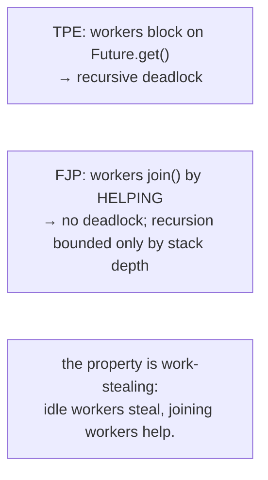
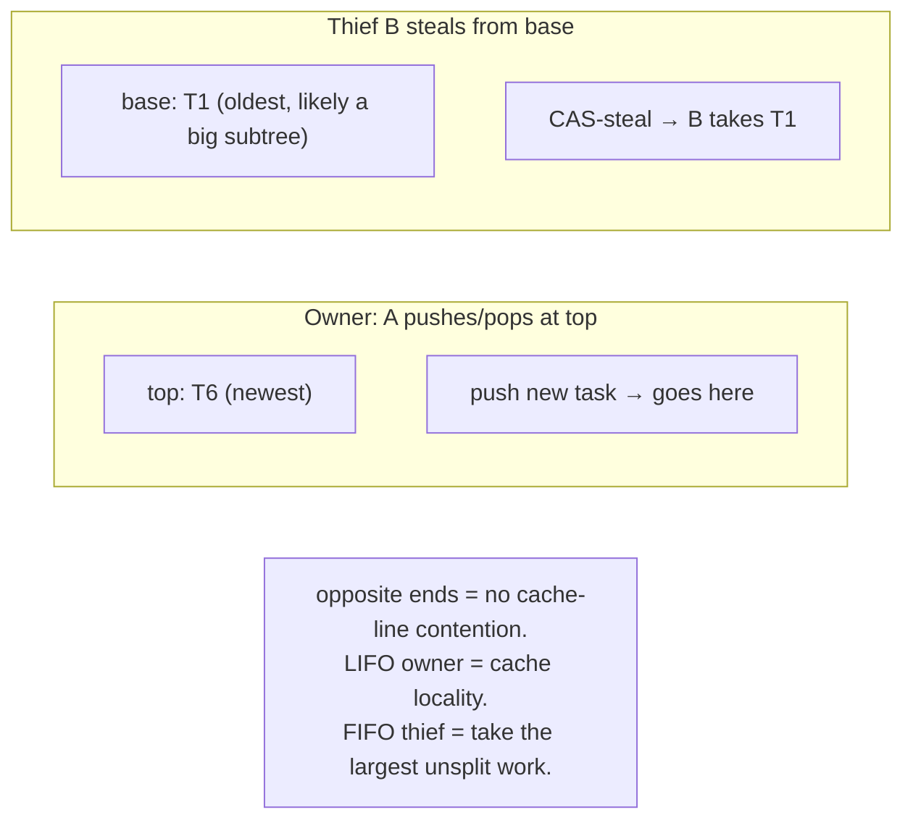
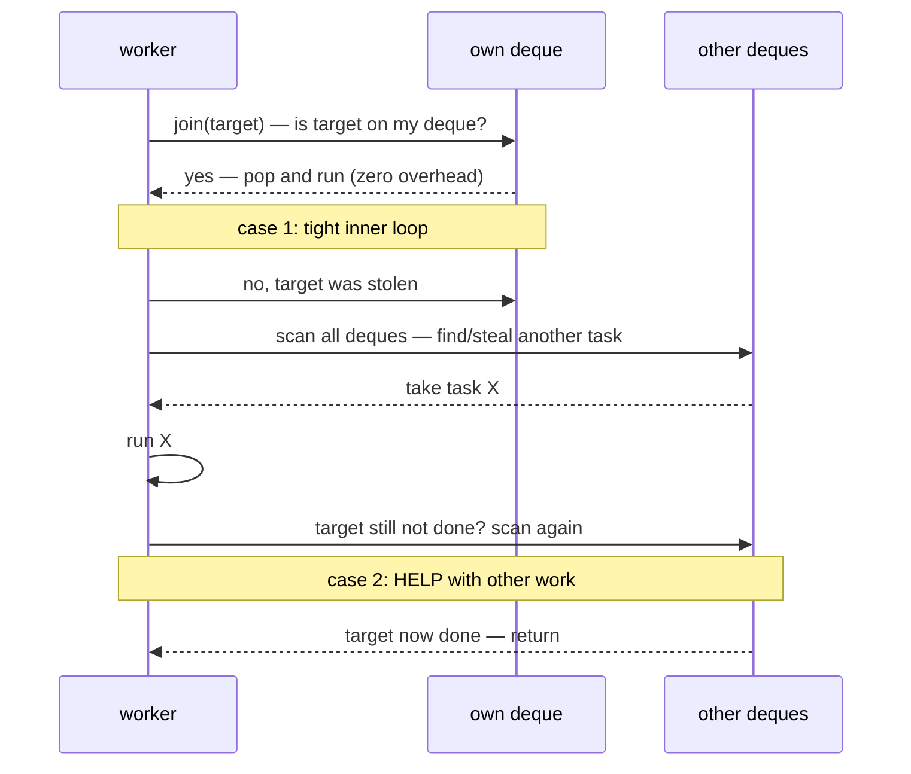

# Fork/Join Framework

`ThreadPoolExecutor` (T05) is the universal "thread pool" — but it has *one* failure mode it cannot escape: **tasks that wait for results of subtasks deadlock the pool when all workers are blocked on subtasks that have nowhere to run** (T05 — pool deadlock). Divide-and-conquer algorithms — parallel mergesort, recursive matrix multiplication, tree reductions, parallel-stream's split-and-collect — *inherently* fork subtasks and join their results, and on a TPE with `N` workers, a recursion deeper than `N` levels deadlocks the pool. `ForkJoinPool` (JSR-166, JDK 7) is Doug Lea's answer: a thread pool *specifically designed* for divide-and-conquer, with each worker maintaining its own **double-ended deque** and a **work-stealing algorithm** that lets idle workers steal from busy ones — and lets joining workers *help with other tasks* rather than blocking, eliminating the deadlock entirely.

The depth-bar requirement isn't "use `ForkJoinPool` for parallel work." At the **algorithmic** layer, work-stealing turns "fork a task per recursion level" from a deadlock risk into a load-balancing feature: each worker pushes to and pops from the *top* of its own deque (LIFO — recently-forked task is hot in cache) while idle thieves *steal* from the *base* (FIFO — oldest task, most likely the largest unsplit subtree). The opposite-end design keeps owner and thieves on different cache lines, minimizing contention. At the **API** layer, `RecursiveTask<V>` and `RecursiveAction` formalize the divide-and-conquer recursion — override `compute()`, decide threshold, `fork()` subtasks, `join()` their results — while `CountedCompleter` (JDK 8) is the alternative for non-tree completion patterns used internally by `parallelStream`. At the **pool** layer, the **common pool** (`ForkJoinPool.commonPool()`, sized to `availableProcessors() - 1`, shared JVM-wide) is the default for `CompletableFuture.*Async`, `Stream.parallel`, and `ForkJoinTask.invoke` — and exhibits the *exact* common-pool footgun we covered in T07: blocking I/O starves every library. At the **theoretical** layer, work-stealing comes from MIT's Cilk (1995), with provable bounds: T_p ≈ T_∞ + T_1/p (parallel time ≈ critical-path time + total-work / processors) — the *gold standard* for parallel scheduling. We will cover all four layers, walking the JDK source as ground truth, and finish with how parallel streams ride on the same infrastructure.

> [!NOTE]
> Prerequisites: [Java Memory Model](./T12-java-memory-model-happens-before-volatile.md) (L3/C01/T12) — fork/join are synchronization actions creating happens-before edges; [Atomic variables](./T11-atomic-variables.md) (L3/C01/T11) — the deque base/top are CAS-updated; [Concurrent collections](./T10-concurrent-collections.md) (L3/C01/T10) — `ConcurrentLinkedDeque`'s Michael-Scott pattern, same shape; [Locks](./T08-locks-reentrantlock-readwritelock-stampedlock.md) (L3/C01/T08) — `ManagedBlocker` integrates with `AbstractQueuedSynchronizer.acquireInterruptibly`; [CompletableFuture](./T07-completablefuture-and-async-composition.md) (L3/C01/T07) — the common-pool footgun; [Executors & thread pools](./T05-executors-and-thread-pools.md) (L3/C01/T05) — the pool-deadlock failure mode this framework fixes.

## Why Fork/Join — the Recursive Pool Deadlock

A canonical divide-and-conquer mergesort on a `ThreadPoolExecutor`:

```java
ExecutorService pool = Executors.newFixedThreadPool(4);

class MergeSortTask implements Callable<int[]> {
    int[] arr;
    public int[] call() {
        if (arr.length < 100) { Arrays.sort(arr); return arr; }
        int mid = arr.length / 2;
        Future<int[]> left  = pool.submit(new MergeSortTask(arr, 0, mid));
        Future<int[]> right = pool.submit(new MergeSortTask(arr, mid, arr.length));
        return merge(left.get(), right.get());      // ⚠ BLOCKS the worker on subtasks
    }
}

pool.submit(new MergeSortTask(input)).get();
```

With a 4-worker pool sorting a 1M-element array: 4 root tasks → 4 workers occupied → each forks 2 subtasks → 8 subtasks queued, *but all 4 workers are blocked in `Future.get()` waiting for these subtasks*. **No worker is available to run the subtasks**. **Deadlock.**

The fix on TPE: spawn more workers than recursion levels (impossible to bound), or change the algorithm. Fork/Join's fix: when a worker calls `join()`, it doesn't block on a `Future` — it **actively runs other tasks** from its own queue or steals from neighbors until the target task completes. *The pool never has all workers blocked waiting.*



## The Work-Stealing Deque

Each `ForkJoinPool` worker has its own **`WorkQueue`** — a double-ended deque of tasks. The deque has two independently-indexed ends:

- **Top (owner end).** The owning worker `push`es here and `pop`s here. LIFO. Recently-pushed tasks (likely cache-warm) get popped first.
- **Base (thief end).** Idle workers from *other* threads `steal` from here. FIFO. The oldest tasks (often the largest unsplit subtrees) get stolen first.

```text
Worker A's deque:

      base (thieves steal here)               top (owner pushes/pops here)
   ┌──→ ┬─────┬─────┬─────┬─────┬─────┬─────┬ ←──┐
        │ T1  │ T2  │ T3  │ T4  │ T5  │ T6  │
   ◄──  └─────┴─────┴─────┴─────┴─────┴─────┘ ──►
         FIFO (oldest)                          LIFO (newest)
```

The owner pushes new tasks on the right (top) and pops the most recent (T6 next). Thieves grab from the left (base — T1 next). Owner and thief touch **different cache lines** in the deque array, minimizing cache-coherence ping-pong.

### Why LIFO for owner, FIFO for thieves?

Two reasons, both crucial:

1. **Cache locality.** The owner's just-forked task is most likely cache-warm (its operand data is in L1). Popping LIFO from top hits that data. Stealing FIFO from base takes a "cold" task — but the thief is going to suffer a cache miss anyway (the task wasn't in *their* L1), so taking the oldest is no worse.
2. **Work distribution.** The oldest task at the base of A's deque is most likely the largest unsplit subtree (a recently-forked task is a *smaller* piece of an already-split problem). Stealing the *root* of an unsplit subtree gives the thief a lot of work to do — fewer steals needed overall to keep all workers busy.



### Lock-free implementation — CAS at base, plain at top

The deque has `volatile int base` and `volatile int top` indices and an array of `ForkJoinTask` slots. Operations:

- **Owner push:** plain write to `array[top++]`. Owner is the only writer to `top`, no CAS needed.
- **Owner pop:** plain read of `array[--top]`. Same — owner-only.
- **Thief steal:** CAS the `base` from `b` to `b+1`. Multiple thieves may race; only one succeeds; the rest retry on another worker.

The owner's pushes and pops are essentially free (no synchronization beyond a volatile write to `top`). Thieves pay a CAS — but they only do it when they have nothing else to do. So the *common* operation (owner work) is fast; the *rare* operation (stealing) is moderately expensive.

When the deque is *nearly empty* and an owner and a thief race on the last task, both CAS — the JDK uses careful "synchronized base read" patterns to avoid corruption. Read `ForkJoinPool.WorkQueue.poll()` in the JDK source for the full lock-free dance.

## The Work-Stealing Algorithm

A worker's main loop:

```java
runWorker(WorkQueue myQueue) {
    while (!shouldExit()) {
        ForkJoinTask t = myQueue.pop();               // try my own deque first (LIFO)
        if (t == null) t = scanAndSteal();             // try to steal from others
        if (t == null) park();                          // nothing to do; park
        else t.doExec();                                // run it
    }
}

ForkJoinTask scanAndSteal() {
    for (int spins = 0; spins < SCAN_RETRIES; spins++) {
        int victim = pickRandomVictim();                // random index into worker array
        WorkQueue victimQueue = workers[victim];
        if (victimQueue != null) {
            ForkJoinTask stolen = victimQueue.poll();   // CAS-steal from victim's base
            if (stolen != null) return stolen;
        }
    }
    return null;                                          // give up; park
}
```

Three properties:

1. **Random victim selection.** A worker doesn't preferentially steal from a specific other worker; randomness spreads load. Hot spots (one busy worker, all others stealing from it) are broken up because each thief independently rolls a random victim.
2. **No coordination between thieves.** Each thief independently scans + CAS-steals. Two thieves may CAS the same `base`; one wins, the other retries.
3. **Park on exhaustion.** If no work is found after multiple scans, the thief parks (via `LockSupport.park`). When a task is pushed somewhere, the pool's `signalWork` wakes one parked worker.

### Submission queues — external vs internal

External code calling `pool.submit(...)` or `pool.invoke(...)` from a non-FJP thread goes into a **submission queue**, separate from the worker deques. Workers also steal from submission queues.

```text
ForkJoinPool:

  WorkQueues:
    workers[0]: ─────deque (owner T0)
    workers[1]: ─────deque (owner T1)
    workers[2]: ─────deque (owner T2)
    workers[3]: ─────deque (owner T3)

  Submission queues:
    workers[0] (submission slot): ──tasks submitted by external threads, no owner
    workers[8] (submission slot): ──tasks submitted by external threads, no owner

  External submits → round-robin to a submission slot.
  Worker scan: own deque → submission slots → steal from other deques.
```

This separation prevents external submitters from contending with workers' own task queues — submissions go to dedicated slots, workers prefer their own work.

## `RecursiveTask` and `RecursiveAction`

The user-facing API for divide-and-conquer:

```java
public abstract class RecursiveTask<V> extends ForkJoinTask<V> {
    protected abstract V compute();
    public final V getRawResult() { return result; }
    protected final void setRawResult(V v) { result = v; }
    protected final boolean exec() { result = compute(); return true; }
}

public abstract class RecursiveAction extends ForkJoinTask<Void> {
    protected abstract void compute();
    public final Void getRawResult() { return null; }
    // ...
}
```

Pick one based on whether the task returns a value:

- `RecursiveAction` for void (mutating an array in-place, side-effect-only computation).
- `RecursiveTask<V>` for returning a result (sum, max, count, sorted output).

Inside `compute()`, the standard pattern:

```java
class ParallelSum extends RecursiveTask<Long> {
    long[] arr;
    int lo, hi;
    static final int THRESHOLD = 1000;

    ParallelSum(long[] arr, int lo, int hi) { this.arr = arr; this.lo = lo; this.hi = hi; }

    protected Long compute() {
        if (hi - lo < THRESHOLD) {
            // small enough — compute sequentially
            long sum = 0;
            for (int i = lo; i < hi; i++) sum += arr[i];
            return sum;
        }
        int mid = (lo + hi) >>> 1;
        ParallelSum left  = new ParallelSum(arr, lo, mid);
        ParallelSum right = new ParallelSum(arr, mid, hi);
        left.fork();                            // push left to own deque
        long rightResult = right.compute();      // run right inline (avoid one push)
        long leftResult  = left.join();          // wait for left (helping if needed)
        return leftResult + rightResult;
    }
}

ForkJoinPool pool = ForkJoinPool.commonPool();
long sum = pool.invoke(new ParallelSum(myArr, 0, myArr.length));
```

Three idioms in this snippet:

1. **Threshold check.** Below a size, do it sequentially. The threshold is the *granularity* knob — too small, fork overhead dominates; too large, load balancing suffers.
2. **Run one inline.** Instead of `left.fork(); right.fork(); join(); join();`, run *one* recursively and only fork the other. Saves a push/pop pair per recursion level.
3. **Fork the left, compute the right, join the left.** Stays balanced; the right-side computation has work to do while the left waits to be stolen or popped.

### `invokeAll` — the optimized fork-many-join-many

```java
invokeAll(task1, task2, task3, task4);   // fork all but one, run the last directly, join the rest
```

Equivalent to:

```java
task2.fork(); task3.fork(); task4.fork();
task1.invoke();      // run task1 directly
task2.join(); task3.join(); task4.join();
```

The optimization: one task is always run directly (no fork overhead); the rest are queued. Useful when you have a fixed number of subtasks (e.g., a 4-way split).

## `fork()` and `join()` Semantics

```java
public final ForkJoinTask<V> fork() {
    if (Thread.currentThread() instanceof ForkJoinWorkerThread t)
        t.workQueue.push(this);                            // push to own deque
    else
        ForkJoinPool.common.externalPush(this);            // external submission
    return this;
}

public final V join() {
    int s;
    if ((s = doJoin() & DONE_MASK) != NORMAL) reportException(s);
    return getRawResult();
}
```

The crucial part is `doJoin()`. Instead of `LockSupport.park`-ing on the task's completion (which is what `Future.get()` does on a regular ExecutorService — and what causes pool deadlock), `doJoin()`:

1. Checks if the task is already done. If yes, return.
2. Checks if the task is at the top of *my own* deque. If yes, pop it and run it inline (zero overhead).
3. Tries to find the task in *any* deque and execute it.
4. Tries to steal *any* other task from any deque and run it (helping).
5. Only after exhausting helping opportunities — `LockSupport.park`.

The active helping is what makes Fork/Join correct under recursion. A worker calling `join` is *making progress on other tasks* while waiting for its target. The pool is never fully idle while there's work to do.



## `CountedCompleter` — the Non-Tree Completion Pattern

`RecursiveTask` works when every subtask has a single parent — a tree shape. But many problems have shapes that aren't trees:

- A reduction where multiple subtasks contribute to one result without a clean parent-child hierarchy.
- A map-reduce where the "combine" step needs to be triggered when all of an arbitrary set of subtasks complete.
- The `parallelStream` collect pipeline.

`CountedCompleter` (JDK 8) generalizes the model. Each task has:

- A *completer* — its parent in a completion chain (not necessarily a tree).
- A *pending count* — the number of children that must complete before this task's `onCompletion` callback fires.

```java
public abstract class CountedCompleter<T> extends ForkJoinTask<T> {
    final CountedCompleter<?> completer;
    volatile int pending;

    public abstract void compute();
    public void onCompletion(CountedCompleter<?> caller) {}
    public boolean onExceptionalCompletion(Throwable ex, CountedCompleter<?> caller) { return true; }
    public final void tryComplete() {
        // decrement pending; if 0, fire onCompletion and propagate to completer
    }
    public final void addToPendingCount(int delta) { ... }
}
```

The lifecycle:

1. Subtasks are forked, each with a *completer* pointing to a shared "combiner" task.
2. The combiner's `pending` is set to the number of subtasks.
3. Each subtask, on completion, calls `tryComplete()` on its completer, decrementing the pending count.
4. When pending reaches 0, the combiner's `onCompletion(...)` fires.
5. The completer chain propagates up — onCompletion may itself decrement *its* completer's pending count.

The flexibility: the completion graph can be any DAG, not just a tree. Used internally by:

- **`Arrays.parallelSort`** — split-sort-merge with CountedCompleter combiners.
- **`Collectors.toMap` parallel mode** — the merge phase.
- **`ConcurrentHashMap`'s bulk parallel ops** — `forEach`, `search`, `reduce`.

User code rarely needs `CountedCompleter` directly — `RecursiveTask` covers most cases. Reach for it when the structure isn't a tree.

## The Common Pool

`ForkJoinPool.commonPool()` is a singleton, lazily created on first access, sized to `Runtime.availableProcessors() - 1`. It's the *default* execution context for:

- **`CompletableFuture.*Async`** without an explicit executor (T07).
- **`Stream.parallel()`** (parallel streams).
- **`ForkJoinTask.invoke()`** when called from a non-FJP thread.
- **`Arrays.parallelSort`** internally.

The footgun is the same as T07's: this pool is **shared JVM-wide**, sized for **CPU-bound** work, and *every library in the JVM that uses parallel streams or async-without-executor competes for those workers*. Blocking I/O on the common pool starves everyone.

### Custom pools

For workloads that need isolation or sizing different from CPU count, construct your own:

```java
ForkJoinPool dedicated = new ForkJoinPool(
    16,                                                                // parallelism
    ForkJoinPool.defaultForkJoinWorkerThreadFactory,
    (thread, ex) -> log.error("FJP uncaught", ex),                     // exception handler
    false                                                               // FIFO mode (default LIFO)
);
```

Custom pools should be used when:

- You need to isolate a parallel-stream workload from common pool starvation.
- You have non-default sizing requirements (CPU-bound with `parallelism = cores`, or modest blocking with `parallelism > cores`).
- You need the *async FIFO mode* — tasks dequeued FIFO instead of LIFO (rare; used for fairness in long-running task systems).

## `ManagedBlocker` — Blocking Without Starving the Pool

Sometimes a worker in an FJP needs to block on something — a `Lock.lockInterruptibly`, a database query, an I/O operation. If it just blocks, the pool loses a worker; if too many workers block, the pool starves.

`ManagedBlocker` lets the pool *compensate* — spawn a temporary extra thread to keep parallelism up while the original worker is blocked:

```java
public interface ManagedBlocker {
    boolean block() throws InterruptedException;   // do the actual blocking
    boolean isReleasable();                         // can we proceed without blocking?
}

ForkJoinPool.managedBlock(new ManagedBlocker() {
    @Override public boolean block() throws InterruptedException { obj.wait(); return true; }
    @Override public boolean isReleasable() { return obj.condition; }
});
```

The pool checks `isReleasable()`; if true, no actual block needed. Otherwise, it may spawn a *compensating thread* (incrementing parallelism temporarily) and call `block()`. After `block()` returns, the compensating thread is decommissioned and the original worker resumes.

`Object.wait`, `Lock.lockInterruptibly`, and `Phaser.arriveAndAwaitAdvance` (when called from an FJP worker) internally use `ManagedBlocker` to keep the pool healthy. User code rarely needs to write `ManagedBlocker` directly — but recognize the name when you see it in a thread dump (`ForkJoinPool.managedBlock` in the stack).

## Parallel Streams

Parallel streams ride on the common ForkJoinPool. The mechanism:

1. **Source split.** The stream's `Spliterator` recursively splits the source until each piece is below an estimated threshold.
2. **Per-split task.** Each split becomes a `CountedCompleter` or `RecursiveTask`.
3. **Bottom-up combine.** As leaf tasks complete, their results combine via the `Collector`'s `combiner` (or the `Stream`'s reduction `BinaryOperator`).
4. **Final result.** The root task's result is the answer.

```java
long sum = IntStream.range(0, 1_000_000_000).parallel().sum();
// internally:
// 1. Spliterator splits the range into N chunks (N ~ parallelism)
// 2. Each chunk is a RecursiveTask summing its piece
// 3. Pairs of completed tasks combine via Long::sum
// 4. Final result returned
```

The parallelism / sequential trade-off rule of thumb:

- **Pure CPU work, large dataset (millions of elements)**: parallel often wins by 4-8× on an 8-core box.
- **IO-bound, small dataset, or large per-element work**: usually loses (the split + combine overhead dominates).
- **Side effects in the lambda**: just don't (race conditions; lost updates).

> [!WARNING]
> **`parallelStream()` uses the common pool.** Every parallel stream in the JVM contends for the same ~7 (on 8-core) workers. If your library does parallel streams internally and another library does CompletableFuture async work, they fight. For an isolated workload, run via a custom FJP: `myPool.submit(() -> stream.parallel().sum()).join()`.

## Performance Characteristics

| Op | Approximate cost |
|----|-----------------|
| `fork()` (own deque push) | ~50-100 ns |
| `join()` (target on own deque, popped + run) | overhead-free |
| `join()` (target stolen, helping pattern) | scales with helping work |
| `join()` (no other work, must park) | ~1-3 µs (futex park) |
| Steal (CAS from another deque's base) | ~100-300 ns |
| Submission queue insertion | ~100-200 ns |

**Sweet spot**: tasks of size **1-100 µs** of compute time. Below this, fork overhead dominates (millions of forks/s amounts to seconds of overhead per second of work). Above, load balancing suffers (one heavy task blocks all parallelism).

**Tuning the threshold** is the single most important knob:

```java
// PARALLEL_SORT_THRESHOLD = 8192 (default for Arrays.parallelSort)
// PARALLEL_SUM_THRESHOLD  = a few thousand elements is typical
```

Measure under realistic workloads; pick the threshold where overhead is < ~10% of work time per task.

## Memory Model

`ForkJoinTask` is a synchronization point — fork's push and join's pop/help-and-wait create happens-before edges:

- **Fork HB child's first action.** The forking thread's prior writes are visible to the child task. (Standard "thread start" rule.)
- **Child's actions HB join's return.** The joining thread sees everything the child wrote. (Standard "thread termination" rule.)

So data passed *to* a child task (via the task object's fields) is visible to the child; data *from* the child (via the task's result field) is visible to the joiner. No explicit `volatile` needed on per-task fields — the fork/join boundaries supply the memory ordering.

## Fork/Join vs ThreadPoolExecutor

| Aspect | `ThreadPoolExecutor` (T05) | `ForkJoinPool` |
|--------|---------------------------|----------------|
| Task queue | one shared queue (`BlockingQueue`) | per-worker deque + submission queues |
| Worker behavior | FIFO consume from shared queue | LIFO own deque + steal others' base |
| Recursive task safety | **deadlock-prone** (Future.get blocks) | safe — join helps |
| Common-pool exposure | n/a (each TPE is its own pool) | `ForkJoinPool.commonPool()` is JVM-shared |
| Best for | IO-bound or generic concurrency | **CPU-bound divide-and-conquer** |

The decision rule:

- **Recursive divide-and-conquer with subtasks that wait for each other** → FJP. Always.
- **Generic concurrent work, IO-bound, request handling** → TPE (T05). Or virtual threads (T14).
- **Both**: use FJP for the compute pieces, dispatch from a TPE or virtual thread that calls FJP.

## Theoretical Roots — Cilk

Fork/Join is Doug Lea's port of MIT's **Cilk** (1995). Cilk introduced work-stealing with provable bounds:

> **T_p ≤ T_1 / p + T_∞ + O(steals)**

where:

- **T_p** = parallel time on p processors
- **T_1** = sequential time (total work)
- **T_∞** = critical path (longest dependency chain)
- **p** = number of processors

The bound says: parallel time is *at most* the work divided by processors (the ideal speedup) plus the critical path (unavoidable) plus an overhead linear in the number of steals. Crucially, the number of steals is bounded by O(p × T_∞), and *each steal does useful work* — so the overhead is amortized.

This is *the* gold standard for parallel scheduling theory. Java's adaptation (with explicit `fork`/`join` calls) loses some compile-time optimization Cilk had with its custom language but keeps the algorithmic core.

## Common Mistakes

### Calling `Future.get()` from inside `compute()`

```java
class BadTask extends RecursiveTask<Integer> {
    protected Integer compute() {
        Future<Integer> f = otherPool.submit(...);
        return f.get();                          // ✗ blocks the FJP worker, defeats work-stealing
    }
}
```

Use `ManagedBlocker` if you must block, or restructure to fork/join exclusively.

### Forgetting to call `join()`

```java
left.fork(); right.fork();
// missing left.join() and right.join() — task may not have run yet
return left.getRawResult() + right.getRawResult();    // returns potentially-uncomputed values
```

`fork` enqueues; `join` ensures completion. Always join after fork.

### Threshold too low

```java
if (hi - lo < 10) sequential();   // ✗ 10-element task is way below fork overhead — overhead dominates
```

Pick threshold above ~1 µs of work. For typical sums, that's 1000-10000 elements.

### Blocking I/O inside `compute()`

```java
protected Integer compute() {
    return httpClient.get(url);   // ✗ blocks an FJP worker for 100s of ms
}
```

FJP isn't designed for IO. Use virtual threads (T14) for IO-heavy workloads.

### Mutating shared state from `compute()`

```java
static List<Integer> results = new ArrayList<>();
protected void compute() {
    if (small) results.addAll(myWork());          // ✗ unsynchronized; corruption
}
```

Use thread-safe accumulation (atomic, concurrent collection) or return results up the tree (RecursiveTask).

### Using common pool for blocking work

```java
CompletableFuture.supplyAsync(() -> blockingDbCall());   // ✗ uses common pool
```

Pass an explicit executor (T07). Common pool is for CPU-bound work only.

### Forgetting the right balance in fork-compute-join

```java
left.fork(); right.fork(); return left.join() + right.join();   // ✗ extra fork overhead
```

Run one inline: `left.fork(); int r = right.compute(); int l = left.join(); return l + r;`. Saves a fork.

### Sharing tasks across pools

```java
RecursiveTask task = ...;
poolA.submit(task);
poolB.submit(task);    // ✗ same task, two pools — undefined behavior
```

Each task instance is owned by exactly one pool. Reuse by constructing fresh tasks.

## Observability

### Thread dumps

FJP workers appear as `ForkJoinPool.commonPool-worker-N`. A typical idle worker:

```text
"ForkJoinPool.commonPool-worker-3" #15 ... java.lang.Thread.State: WAITING (parking)
   at jdk.internal.misc.Unsafe.park(Native Method)
   at j.u.c.locks.LockSupport.park
   at j.u.c.ForkJoinPool.runWorker
```

A worker mid-help inside `join()`:

```text
"...common-worker-2" ... RUNNABLE
   at MyTask.compute(...)
   at j.u.c.RecursiveTask.exec(...)
   at j.u.c.ForkJoinTask.doExec(...)
   at j.u.c.ForkJoinTask.awaitDone(...)
   at j.u.c.ForkJoinTask.doJoin(...)
   at j.u.c.ForkJoinTask.join(...)
   ...
```

The `doJoin → awaitDone → doExec` chain visible in the stack tells you "this worker is calling join, and is helping run *another* task while waiting" — exactly the work-stealing behavior.

### JFR

`jdk.ForkJoinPoolStatistics` events (when enabled) record:

- Steal counts per worker.
- Number of workers.
- Queue sizes.
- Idle time.

Aggregate over a session to see whether your common pool is saturated, idle, or stealing heavily. Hot patterns:

- Very high steal rate + low queue sizes → ideal load balancing.
- High steal failures + workers parked → exhausted work, sleep periods.
- Workers blocked in non-FJP frames → ManagedBlocker compensation in action.

> [!INTERVIEW]
> "How does Fork/Join avoid the pool-deadlock that ThreadPoolExecutor has?" — Senior answer:
>
> 1. **Work-stealing pool.** Each worker has its own double-ended deque. Owner pushes/pops LIFO at top; thieves CAS-steal FIFO at base — opposite ends minimize cache contention.
> 2. **`join()` helps, doesn't just block.** When a worker calls `join` on a subtask, instead of `LockSupport.park`-ing on a Future, it actively runs other tasks (from its own deque or by stealing) until the target completes. The pool is never idle while there's work to do.
> 3. **Recursion is bounded by stack depth**, not by pool size. With `compute()` calling itself recursively (via fork/join), the deepest recursion fits in one worker's stack while the parallel work spreads across all workers.
> 4. **The deadlock failure mode (workers blocked on subtasks with no available worker) cannot occur** because the blocked workers don't actually block — they help.

> [!INTERVIEW]
> Short Q&A:
>
> 1. **Why work-stealing?** Idle workers steal from busy ones — automatic load balancing without central coordination.
> 2. **Why LIFO for owner, FIFO for thief?** Owner: cache locality (recent task is warm). Thief: take the oldest task (most likely a large unsplit subtree, gives the thief lots of work).
> 3. **Why opposite ends of the deque?** Owner and thieves touch different cache lines — no cache-coherence ping-pong.
> 4. **What does `join()` do differently from `Future.get()`?** Instead of blocking, it actively runs other tasks (helping) until the target completes.
> 5. **What's the common pool?** `ForkJoinPool.commonPool()` — singleton, sized to cores−1, shared by Stream.parallel, CompletableFuture *Async, etc.
> 6. **The common-pool footgun?** Blocking I/O on it starves every library that uses parallel streams or async. Pass an explicit executor (T07).
> 7. **`RecursiveTask` vs `RecursiveAction`?** Task returns a value; Action is void.
> 8. **What's the divide-and-conquer threshold for?** Above threshold, fork; below, compute sequentially. Too low → overhead dominates; too high → poor load balance. Sweet spot: ~1-100 µs of work per task.
> 9. **`fork()` semantics?** Push the task to the current worker's deque; return immediately (the task hasn't run yet).
> 10. **`invokeAll(t1, t2, t3)`?** Forks t2, t3; runs t1 inline; joins t2 and t3. One less fork than naïvely forking all.
> 11. **`ManagedBlocker`?** Wraps a blocking operation so the FJP can spawn a compensating thread to keep parallelism up.
> 12. **`CountedCompleter`?** Alternative to RecursiveTask for non-tree completion graphs. Used internally by parallelStream's collect.
> 13. **Parallel streams?** Use `ForkJoinPool.commonPool()`. Splits via `Spliterator`; combines via `Collector.combiner` or `BinaryOperator`. Worth it for CPU-bound work on large data; usually loses for IO-bound or small datasets.
> 14. **Cilk roots?** MIT 1995. Work-stealing bound: T_p ≤ T_1/p + T_∞ + O(steals). Proven optimal scheduling for fork-join parallelism.
> 15. **Are virtual threads built on FJP?** The virtual-thread carrier pool is itself a `ForkJoinPool` sized to CPU cores. So FJP underlies Loom too.

## Practice

1. **Parallel sum benchmark.** Sum a 100M-element `long[]` (a) sequentially, (b) via parallel stream, (c) via `RecursiveTask` with threshold 10000. Measure each; confirm parallel is faster on a multi-core machine.
2. **Threshold sweep.** Run the parallel sum with thresholds 100, 1000, 10000, 100000. Plot throughput. Identify the sweet spot.
3. **Reproduce pool deadlock on TPE.** Implement parallel mergesort on a 2-worker `ThreadPoolExecutor` using `Future.get()`. Sort 1M elements; observe deadlock. Same with `ForkJoinPool`; observe completion.
4. **`fork()` then `compute()` then `join()`.** Implement parallel sum with this idiom (run one inline) vs the naïve `fork(); fork(); join(); join();` for the same threshold. Compare throughput.
5. **Steal observation.** Instrument a `RecursiveTask` to log when a worker takes its own task vs steals from another. With heavy contention, count the fraction of steals.
6. **Common-pool starvation.** Submit 100 1-second `CompletableFuture.supplyAsync` tasks (blocking sleep). Concurrently run a `parallelStream` sum. Confirm the parallel stream stalls. Switch the CFs to a dedicated pool; observe recovery.
7. **`CountedCompleter` for a non-tree pattern.** Build a "map-then-combine" pipeline where N independent map tasks contribute to one accumulator. Use `CountedCompleter` with `pending = N` on the accumulator.
8. **`ManagedBlocker` in action.** Inside a `RecursiveTask.compute()`, briefly block via `obj.wait()`. With JFR, observe a "compensating thread" being spawned. Then remove the block; observe the FJP returning to its base parallelism.
9. **Async / FIFO mode.** Create a `ForkJoinPool` with `asyncMode = true` (FIFO). Compare task ordering vs default LIFO.
10. **Spliterator inspection.** Print the `Spliterator` of a parallel stream on a `List` source; observe the `trySplit` calls and the chunk sizes. Then on an unsplittable source (e.g., a `BufferedReader` line stream); observe parallel stream falls back to sequential.
11. **`Arrays.parallelSort` source dive.** Read `Arrays.parallelSort` for `int[]`. Identify the `CountedCompleter`-based split-sort-merge structure and the `MIN_ARRAY_SORT_GRAN = 8192` threshold.
12. **Thread dump during recursion.** Sort a large array via Fork/Join; from another thread, take a thread dump. Identify FJP workers in `RUNNABLE` (executing) vs `WAITING (parking)` (idle); count workers in `doJoin`/helping vs `doExec`.

## Recap

You should now be able to:

- State **why Fork/Join exists**: divide-and-conquer algorithms recursively `fork` subtasks and `join` their results; on a standard `ThreadPoolExecutor`, workers blocked on `Future.get()` for subtasks deadlock the pool when recursion exceeds worker count. FJP fixes this by making `join()` *help with other work* instead of blocking.
- Explain the **per-worker double-ended deque**: owner pushes/pops LIFO at top (cache locality), thieves CAS-steal FIFO at base (oldest = largest unsplit subtree). Opposite ends minimize cache-line contention.
- Walk through the **work-stealing algorithm**: worker pops own deque LIFO → if empty, scans random other workers + CAS-steals from their base → if all empty, parks via `LockSupport`. Submission queues separate external submissions from worker deques.
- Use **`RecursiveTask<V>`** (returns value) and **`RecursiveAction`** (void) for divide-and-conquer; structure `compute()` with a *threshold check* (sequential below, recursive above) and the *fork-compute-join* idiom (fork one, compute other inline, join the forked one).
- Choose `invokeAll(t1, t2, t3)` over hand-coded fork/fork/join/join when you have a fixed number of subtasks — one inline, the rest forked.
- Explain how **`join()` helps**: tries own deque first (pop and run); then scans/steals; only parks when no work to do. The pool never has all workers blocked while work exists.
- Use **`CountedCompleter`** for non-tree completion graphs (multiple subtasks merging into one accumulator). Used internally by `parallelStream` and `ConcurrentHashMap`'s parallel bulk ops.
- Recognize the **common pool** (`ForkJoinPool.commonPool()`, sized to cores−1, JVM-shared) and the **common-pool footgun**: blocking I/O on it starves Stream.parallel, CompletableFuture async, and every other library. Always pass an explicit executor for blocking work.
- Use **`ManagedBlocker`** when a worker must block (database call, lock acquisition) — the pool compensates by spawning a temporary extra thread.
- Apply **parallel streams** judiciously: CPU-bound work on large datasets (millions of elements) wins; IO-bound or small datasets lose. Side effects in the lambda are bugs.
- Recite the **performance characteristics**: ~50-100 ns fork overhead; sweet-spot task size 1-100 µs of work; deeper recursion bounded by stack depth, not pool size.
- State the **memory model**: fork is a synchronization action (HB to child's first action); join is one (HB from child's actions to joiner's continuation). No explicit volatile needed on per-task fields.
- Choose between **FJP and TPE**: FJP for recursive divide-and-conquer; TPE for IO-bound or generic concurrency; virtual threads (T14) increasingly preferred for IO-bound.
- Cite the **Cilk theoretical roots** (MIT 1995): work-stealing bound `T_p ≤ T_1/p + T_∞ + O(steals)`, provably optimal for fork-join parallelism.
- Avoid the **eight common bugs**: blocking I/O on the common pool, forgetting `join()`, threshold-too-low, blocking I/O in `compute()`, shared mutable state, common-pool blocking, missing fork-compute-join optimization, sharing tasks across pools.
- Diagnose via **thread dumps** showing `doJoin → awaitDone → doExec` (active helping) vs `runWorker → park` (idle) and **JFR `jdk.ForkJoinPoolStatistics`** for steal/idle/parallelism metrics.

## Next

Continue to [Virtual threads (Project Loom)](./T14-virtual-threads-project-loom.md) — the JDK 21+ "lightweight thread" that finally makes "one thread per task" cheap for IO-bound workloads. We'll dissect the virtual-thread state machine (the ~19 internal states `VirtualThread` maintains, collapsed to 6 public `Thread.State`s in T02), the continuation-freeze mechanism (stack frames frozen onto the heap on park; unfrozen on resume), the carrier-pool ForkJoinPool (sized to cores; T13's machinery underneath), the pinning conditions (native frames at park time, `synchronized` pre-JEP-491), JEP 491 (JDK 24) lifting the `synchronized` pinning, and the structured-concurrency `StructuredTaskScope` (JEP 462) that's the canonical post-Loom way to fan out + join.
