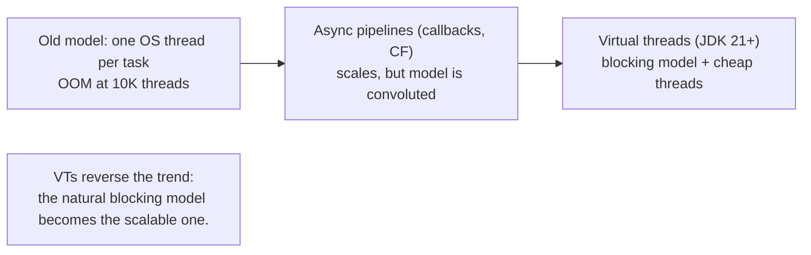
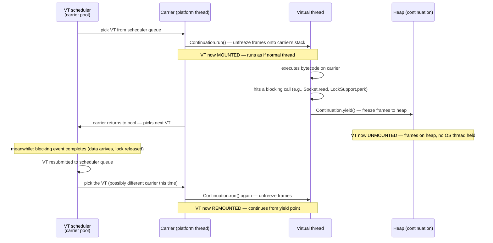
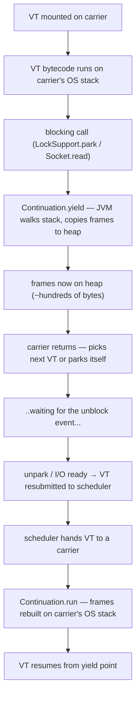
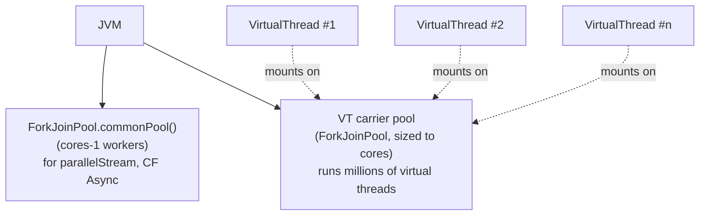
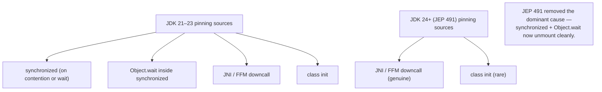

# Virtual Threads (Project Loom)

A platform thread costs ~1 MB of stack reservation and ~50–100 µs to create (T01). A modern OS caps you at a few thousand concurrent threads. Modern servers handle hundreds of thousands of concurrent connections. The math has been broken for two decades: backend Java code can't have one thread per request — it must multiplex requests over a small pool of platform threads, hand-coding async pipelines via `CompletableFuture` (T07), reactive streams, and async APIs. **Project Loom** (JEP 444, JDK 21) reverses this. A **virtual thread** is a JVM-managed thread costing ~200–1000 bytes of heap — *thousands of times cheaper* than a platform thread — designed so the JDK can host **millions** of them concurrently. The slogan: **"one thread per task" is cheap again**, and *every blocking API call you know* (`Thread.sleep`, `Socket.read`, `Lock.lock`, `Object.wait`) unmounts the virtual thread from its carrier so the carrier is freed to run another.

The depth-bar requirement isn't "use `Thread.ofVirtual().start(...)`." At the **language** layer, virtual threads are *just* `Thread` instances — `java.lang.Thread` returns one whose `isVirtual()` is `true`, all the existing `Thread`/`InterruptedException`/`InterruptedException` APIs apply unchanged — but with special memory and scheduling properties that the JVM enforces invisibly. At the **mechanism** layer, a virtual thread runs by **mounting** on a *carrier* (a real platform thread from a dedicated `ForkJoinPool`): it executes normal bytecode on the carrier's OS stack until it hits a blocking operation (`LockSupport.park`, `Socket.read`, etc.), at which point its stack frames are *frozen* onto the heap via `jdk.internal.vm.Continuation.yield`, the carrier is freed, and when the blocking event completes the virtual thread is **resubmitted** to the scheduler to be picked up by (possibly a different) carrier where its frames are unfrozen back onto an OS stack. At the **state** layer, internally a `VirtualThread` runs a ~19-state machine (`NEW`, `STARTED`, `RUNNING`, `PARKING`, `PARKED`, `PINNED`, `TIMED_PARKING`, `TIMED_PARKED`, `TIMED_PINNED`, `UNPARKED`, `YIELDING`, `YIELDED`, `BLOCKING`, `BLOCKED`, `WAITING`, `WAIT`, `TIMED_WAITING`, `TIMED_WAIT`, `TERMINATED`) collapsed to the six public `Thread.State` values from T02. At the **failure-mode** layer, **pinning** — when a virtual thread cannot unmount because of a native (JNI/FFM) stack frame or, *pre-JDK 24*, a `synchronized` block — holds its carrier hostage; the JDK 21–23 advice "use `ReentrantLock` instead of `synchronized` for hot blocking paths" came from this, and **JEP 491 (JDK 24)** fixed it by making `ObjectMonitor::enter` virtual-thread-aware. We will cover all four layers and finish with **scoped values** (JEP 446) and **structured concurrency** (JEP 462) — the Loom-era replacements for `ThreadLocal` and `CompletableFuture`-chains.

> [!NOTE]
> Prerequisites: [Fork/Join framework](./T13-fork-join-framework.md) (L3/C01/T13) — the carrier pool *is* a `ForkJoinPool`; [Java Memory Model](./T12-java-memory-model-happens-before-volatile.md) (L3/C01/T12) — JMM unchanged for VTs; [Locks](./T08-locks-reentrantlock-readwritelock-stampedlock.md) (L3/C01/T08) — `LockSupport.park` is *the* unmount hook; [wait/notify](./T04-wait-notify-notifyall.md) (L3/C01/T04) — pinning fix in JEP 491; [synchronized](./T03-synchronized-monitors-and-intrinsic-locks.md) (L3/C01/T03) — `ObjectMonitor::enter` is now VT-aware (JDK 24+); [Thread lifecycle & states](./T02-thread-lifecycle-and-states.md) (L3/C01/T02) — `Thread.State` six-values collapsed from internal ~19; [Threads & Runnable](./T01-threads-and-runnable.md) (L3/C01/T01) — platform thread cost ladder this fixes.

## The Problem — "One Thread Per Task" Was Too Expensive

A server's natural shape is one logical task per concurrent request — handle, await DB, await partner API, respond. The natural code is *blocking*: `db.query(...)` returns the result; control flow is sequential and trivial to read. But a platform thread per request hits two walls:

1. **Memory.** ~1 MB stack per thread. 10,000 requests = ~10 GB of stack reservation. At 100,000, you're out of address space.
2. **OS limit.** Linux's default `nproc` cap is in the thousands per user; even with tuning, the kernel scheduler thrashes at high thread counts.

The industry response since ~2010 was *asynchronous programming*: split the request into "before the await" and "after the await" callbacks; the OS thread runs many requests in interleaved fashion; the kernel's IO multiplexing (`epoll`, `kqueue`) wakes the right callback when data arrives. This works — Netty, Vert.x, Spring WebFlux, the whole reactive-streams ecosystem — but it *changes the programming model*. Sequential blocking code becomes a graph of CompletableFuture chains; exceptions become harder to reason about; debugging stack traces lose the conceptual call hierarchy.

Virtual threads make the cost of "one thread per task" *not matter*. The runtime maps **many virtual threads** onto **a small number of platform threads** (the carriers), but to the application code, each virtual thread *is* a thread — same API, same semantics, same blocking calls. You write sequential blocking code; the runtime makes it scale.



## What a Virtual Thread Is

```java
Thread vt = Thread.ofVirtual().start(() -> {
    System.out.println(Thread.currentThread().isVirtual());   // true
    Thread.sleep(1000);                                          // unmounts; carrier freed
    System.out.println("done");
});
vt.join();
```

A virtual thread is:

- **A `Thread` instance.** `Thread.ofVirtual().start(...)` returns a `java.lang.Thread` (specifically a `VirtualThread` subclass). All Thread APIs work.
- **JVM-managed.** No OS thread per VT. The JVM schedules them onto a small pool of *carrier* platform threads.
- **Cheap.** ~200–1000 bytes of heap for the VT object + continuation + small initial stack. 1 million VTs ≈ 1 GB of heap.
- **Always daemon.** Cannot keep the JVM alive (the `setDaemon(false)` setter is a no-op).
- **Always normal priority.** `setPriority(...)` is a no-op.
- **Identified by `isVirtual()`.** `Thread.currentThread().isVirtual()` distinguishes VTs from platform threads.

```java
Thread.currentThread().isVirtual();              // false on a regular thread; true inside a VT
```

## The Mount / Unmount Lifecycle

The core mechanism. A virtual thread "runs" by **mounting** on a carrier platform thread:



Three things to internalize:

1. **The VT's stack is sometimes on the OS stack (mounted), sometimes on the heap (unmounted).** Move between them is the freeze/unfreeze.
2. **The carrier may change across mounts.** The VT doesn't have affinity to a specific carrier. Don't rely on `Thread.currentThread()` identity remaining stable across blocks (it does at the *Thread* level — the VT identity is stable — but the *carrier* identity is not).
3. **Unmounting is what makes scaling possible.** A million parked VTs hold *zero* OS threads; the carrier pool stays small.

## Continuations — the Underlying Mechanism

The `jdk.internal.vm.Continuation` class is the *actual* mechanism. A `Continuation` captures the call-stack state at a `yield` point and resumes it on the next `run`:

```java
// pseudo-API — internal, JEP 444 specific
class Continuation {
    Continuation(ContinuationScope scope, Runnable body) { ... }
    void run();                          // start or resume — pushes frames onto current OS stack
    static boolean yield(ContinuationScope scope);   // suspend — freeze frames to heap
}
```

The VT internals:

```java
class VirtualThread {
    private final Continuation cont;
    private volatile int state;             // ~19-state machine
    private Thread carrierThread;            // the platform thread currently running this VT (or null)

    void run() {
        // called by the carrier
        cont.run();                          // runs until the body completes or yields
        if (cont.isDone()) {
            state = TERMINATED;
        } else {
            // yielded — already enqueued elsewhere via park()
        }
    }
}
```

When the VT's code calls `LockSupport.park`, the VM detects we're inside a Continuation and `yield`s instead of parking the OS thread:

- `LockSupport.park(blocker)` → `VirtualThread.park()` → `Continuation.yield(VT_SCOPE)` → frames frozen → carrier returns to scheduler.

When the parker wakes (via `LockSupport.unpark(vt)`), the VT is enqueued back into the scheduler. A carrier picks it up and calls `cont.run()`; the frames are unfrozen and execution continues just past the yield point.

The freezing/unfreezing is implemented by **stack walking**: the JVM walks the carrier's OS stack from the VT's entry point, copying each frame's state (locals, operand stack, return address) into heap-allocated frame objects. Unfreezing reverses: rebuild OS-stack frames from heap frames.

The cost: **~100-500 ns per mount/unmount** (depending on stack depth). The frozen stack is typically a few hundred bytes to a few kilobytes. Compare with the ~1 µs futex park + the 1 MB platform-thread stack — the VT is dramatically cheaper.



## The Carrier Pool

The default scheduler for virtual threads is a dedicated **`ForkJoinPool`** sized to `Runtime.availableProcessors()`. Configurable via:

- `-Djdk.virtualThreadScheduler.parallelism=N` — default carrier count.
- `-Djdk.virtualThreadScheduler.maxPoolSize=N` — upper bound (default 256).
- `-Djdk.virtualThreadScheduler.minRunnable=N` — min runnable carriers.

This carrier pool is *separate* from `ForkJoinPool.commonPool()`. The two coexist:

- **Common pool**: serves `Stream.parallel`, `CompletableFuture.*Async`, etc.
- **Virtual-thread carrier pool**: serves all virtual threads.



A given carrier runs many VTs over its lifetime — mount one, it parks, mount another, it parks, etc. The carrier itself is a regular `Thread` named like `ForkJoinPool-2-worker-N` and visible in thread dumps.

## The State Machine

T02 introduced the 6 public `Thread.State` values. A `VirtualThread` runs a richer ~19-state internal machine, collapsed to those six for `getState()`:

| Internal VT state | Public `Thread.State` |
|-------------------|-----------------------|
| `NEW`, `STARTED` | `RUNNABLE` (until mounted) |
| `RUNNING` (mounted), `UNPARKED`, transitions | `RUNNABLE` |
| `YIELDING`, `YIELDED` | `RUNNABLE` |
| `PARKING`, `PARKED` | `WAITING` |
| `TIMED_PARKING`, `TIMED_PARKED` | `TIMED_WAITING` |
| `PINNED`, `TIMED_PINNED` | `WAITING` / `TIMED_WAITING` |
| `BLOCKING`, `BLOCKED` | `BLOCKED` |
| `WAIT`, `TIMED_WAIT` | `WAITING` / `TIMED_WAITING` |
| `TERMINATED` | `TERMINATED` |

The extra internal states are for *scheduler optimization*: knowing that a VT is "about to park" vs "fully parked" vs "pinned" lets the runtime decide whether to compensate, whether to unpark prematurely, whether to break the carrier free.

The public API only exposes the 6 values to keep existing code working unchanged — a thread dump on a JVM full of VTs reads the same as one on platform threads.

## Pinning — When a Virtual Thread Cannot Unmount

A VT is **pinned** when the JVM cannot safely freeze its stack. The carrier is then held hostage for the duration of the block — defeating the whole point of virtual threads.

The pinning conditions:

1. **Native (JNI) frames on the stack at the moment of park.** The JVM can't move native C/C++ frames to the heap — they're tied to the OS thread's stack. If a VT calls into JNI and the JNI code itself blocks (or makes a callback to Java that blocks), the carrier is pinned for the duration.

2. **FFM (Foreign Function & Memory) downcalls (JEP 454).** Same problem — FFM downcalls go through native code; if blocking happens with one on the stack, pin.

3. **Class initialization (`<clinit>`).** The JVM holds an initialization lock during the static initializer; a VT mid-static-init pins.

4. **`synchronized` block — pre-JEP-491 (JDK 21–23).** The pre-JEP-491 `ObjectMonitor::enter` parked the *carrier* on contention rather than the VT, holding the carrier captive. This was *the* dominant pinning source pre-JDK 24 and the reason the recommendation was "swap synchronized for ReentrantLock on hot virtual-thread blocking paths."

### JEP 491 (JDK 24) — the synchronized pinning fix

JEP 491 reworked the HotSpot monitor implementation so a VT blocked in `synchronized` *unmounts* cleanly:

- `ObjectMonitor::enter` detects a virtual-thread caller.
- Instead of parking the carrier directly, it freezes the VT's continuation onto the heap (same path as `LockSupport.park`).
- The carrier is released to run other VTs.
- On lock release, the waiting VT is resubmitted to the scheduler.
- The fix extends to `Object.wait` (T04) similarly.

Post-JDK-24, the *remaining* pinning conditions are:

- **Native/JNI frames** (genuine ABI limitation).
- **FFM downcalls** (same).
- **Class init** (initialization lock — a JVM internal).

These are all *rare* in normal application code. Most user code is now pinning-free on JDK 24+.



### Observing pinning

- **JDK 21–23**: `-Djdk.tracePinnedThreads=full` (or `short`) — JVM flag that logged every pin event with a stack trace.
- **JDK 24+**: The flag was *removed*. Use **JFR**: enable `jdk.VirtualThreadPinned` (default-on in profile config). Each pin event records the reason and stack.

```bash
jcmd <pid> JFR.start duration=60s settings=profile
# ... after the recording, open in JMC ...
# look for jdk.VirtualThreadPinned events
```

A few pinned events per second is acceptable. Hundreds or thousands per second indicate a genuine code-shape problem (native frames in a hot blocking path, or pre-JDK-24 synchronized in a contended loop).

## Creating Virtual Threads — the Full API

```java
// 1. Builder API
Thread vt = Thread.ofVirtual()
    .name("my-vt")
    .uncaughtExceptionHandler((t, e) -> log.error("vt failed", e))
    .start(() -> doWork());

// 2. Unstarted (configure, then start)
Thread vt = Thread.ofVirtual().unstarted(() -> doWork());
// ... configure ...
vt.start();

// 3. Convenience shortcut
Thread vt = Thread.startVirtualThread(() -> doWork());

// 4. ExecutorService — every submit creates a fresh VT
try (var executor = Executors.newVirtualThreadPerTaskExecutor()) {
    for (var req : requests) executor.submit(() -> handle(req));
}

// 5. VirtualThread factory for legacy code
ThreadFactory factory = Thread.ofVirtual().factory();
new ThreadPoolExecutor(0, Integer.MAX_VALUE, ..., factory);   // ⚠ DON'T pool VTs (next section)
```

**The recommended modern shape**: `Executors.newVirtualThreadPerTaskExecutor()`. Every `submit`/`execute` spawns a fresh virtual thread; no pooling, no queueing, no rejection — every task gets its own thread. The underlying carrier pool handles the actual execution.

## "Don't Pool Virtual Threads"

The single most important guideline:

> [!IMPORTANT]
> **Virtual threads are throw-away. Don't pool them.** They cost ~200–1000 bytes; creating one is essentially free; pooling them is a performance *anti-optimization* (you'd be adding queueing latency and contention for no benefit).
>
> For **concurrency limiting** (limiting downstream calls), use a **`Semaphore`** (T09) around the work, not a thread-pool size. The semaphore allows N concurrent tasks; the rest park on the semaphore (which itself unmounts cleanly).

```java
// ✗ DON'T:
ExecutorService pool = Executors.newFixedThreadPool(50, Thread.ofVirtual().factory());

// ✓ DO:
ExecutorService pool = Executors.newVirtualThreadPerTaskExecutor();
Semaphore dbLimit = new Semaphore(20);

pool.submit(() -> {
    dbLimit.acquire();
    try { db.query(...); } finally { dbLimit.release(); }
});
```

The semaphore bounds *downstream concurrency* (database connections, partner API rate limits). Virtual threads handle the *upstream concurrency* (number of in-flight tasks). Two orthogonal bounds, decoupled.

## ThreadLocal in the Virtual-Thread Era

`ThreadLocal` works with virtual threads — but a million virtual threads with `ThreadLocal` entries is a million entries in the thread-local map. Plus, the "carrier-affinity" expectation many ThreadLocal users have is broken (a VT may resume on a different carrier).

The Loom-era replacement: **`ScopedValue`** (JEP 446, preview JDK 21–24, expected to standardize):

```java
// declare a scoped value
static final ScopedValue<User> CURRENT_USER = ScopedValue.newInstance();

// bind for the duration of a scope
ScopedValue.where(CURRENT_USER, alice).run(() -> {
    // inside this scope, CURRENT_USER.get() returns alice
    handle(req);
});

// inside handle:
User u = CURRENT_USER.get();
```

Three differences from `ThreadLocal`:

1. **Lexically scoped**: bound only for the duration of the `run`/`call` lambda; auto-cleared when the lambda returns.
2. **Immutable**: cannot be set after binding; cannot be modified.
3. **Cheaper**: stored in a per-thread (or per-VT) linked list of scopes, not a hash map.

Use ScopedValue for request context (current user, trace ID, MDC) where ThreadLocal would have leaked or required manual cleanup. ThreadLocal still works for backward compatibility.

## Structured Concurrency Preview — JEP 462

T15 covers this fully. The headline:

```java
try (var scope = new StructuredTaskScope.ShutdownOnFailure()) {
    Supplier<User>       userF  = scope.fork(() -> fetchUser(id));
    Supplier<List<Order>> ordF  = scope.fork(() -> fetchOrders(id));
    scope.join();                 // wait for both — any failure cancels the other
    scope.throwIfFailed();        // propagate the exception
    return render(userF.get(), ordF.get());
}
```

The try-with-resources scope:

- Forks subtasks (each a new virtual thread).
- `join()` waits for all.
- If any fails, `ShutdownOnFailure` cancels the rest.
- `close()` (auto via try-with-resources) cancels any still-running tasks.

This is the *correct* way to fan out + join with virtual threads. It replaces `CompletableFuture.allOf` chains with lexical scope + standard exception propagation. T15 has the full mechanics.

## Performance Numbers

| Op | Approximate cost |
|----|-----------------|
| Virtual thread creation | ~1 µs (heap allocation + scheduler enqueue) |
| Mount (continuation.run) | ~100-300 ns + frame unfreeze |
| Unmount (continuation.yield) | ~100-500 ns + frame freeze |
| `Thread.sleep` (1 ms wake) | ~1 µs + ~1 ms wall |
| `Socket.read` (server response) | latency-bound; CPU cost ~0 (parked the whole time) |
| Memory per parked VT | ~200-1000 bytes (heap continuation) |
| Memory per parked platform thread | ~1 MB (OS stack reservation) |

The headline: **10,000 virtual threads cost ~10 MB; 10,000 platform threads cost ~10 GB.** Three orders of magnitude.

## Comparison with Other Languages

| Language | Model | Mount/unmount |
|----------|-------|--------------|
| Java VT | M:N (virtual on carrier) | yes — Continuation freeze/unfreeze |
| Go (goroutine) | M:N (goroutine on M=kernel-thread) | yes — runtime manages |
| Kotlin coroutine | suspend functions (language-level) | yes — compiled state machine |
| Erlang process | M:N (BEAM-managed) | yes — own scheduler |
| Python asyncio | single-thread event loop (no thread switch) | no — await is cooperative |
| Rust async/await | event loop or thread pool | no — futures are state machines |

Java virtual threads are most similar to Go goroutines — same M:N model, same fundamental mount/unmount mechanism. The key difference: Java VTs are *transparent* — existing thread-based code "just works"; Go goroutines required a language redesign.

## Adoption Story

| JDK | Status | Recommendation |
|-----|--------|----------------|
| Pre-21 | not available | use platform threads + async pipelines (CF, reactive) |
| 21 (initial release) | preview → final | use VTs for IO-bound work; audit `synchronized` for pinning |
| 22 | unchanged | same |
| 23 | unchanged | same |
| 24 (JEP 491) | `synchronized` pinning fixed | **all blocking code works pinning-free except native/FFM** |

The migration in 2026:

- **Replace `Executors.newFixedThreadPool(N)` with `Executors.newVirtualThreadPerTaskExecutor()`** for IO-bound workloads.
- **Remove artificial concurrency caps** that existed only because platform threads were expensive.
- **Audit ThreadLocal** for memory growth at high VT counts; migrate to ScopedValue where appropriate.
- **Profile for pinning** on JDK 24+ via JFR; ensure rate is bounded.
- **Adopt StructuredTaskScope** for fan-out patterns instead of CompletableFuture chains.

## Common Mistakes

### Pooling virtual threads

```java
Executors.newFixedThreadPool(100, Thread.ofVirtual().factory());   // ✗ pointless
```

VTs aren't expensive to create. Use `newVirtualThreadPerTaskExecutor()`. For concurrency limiting, use a `Semaphore` (T09).

### Pinning blindness on hot blocking paths

```java
synchronized (lock) {
    httpClient.get(url);     // ✗ pre-JDK-24: pins carrier through HTTP latency
}
```

Pre-JDK 24: the synchronized pinned the carrier. JDK 24+: this code is fine. If you're on JDK 21–23, refactor to ReentrantLock or upgrade to JDK 24.

### `ThreadLocal` per-VT growth

```java
static final ThreadLocal<MyContext> CTX = new ThreadLocal<>();
// in each of 1 million VTs:
CTX.set(new MyContext(...));   // ✗ 1 million entries in the thread-local map
```

Use `ScopedValue` (JEP 446) for request context; auto-cleared when scope ends.

### Setting daemon / priority

```java
Thread.ofVirtual().start(...).setDaemon(false);   // ✗ no-op; VTs are always daemon
Thread.ofVirtual().start(...).setPriority(MAX);    // ✗ no-op
```

These setters silently do nothing on VTs.

### Expecting a specific carrier

```java
Object obj = ...;
// thread-local cache: relies on "same thread" identity
// but a VT may resume on a different carrier
```

The VT identity (`Thread.currentThread()`) is stable. The *carrier* identity is not — don't rely on it.

### Heavy CPU-bound work in virtual threads

```java
try (var pool = Executors.newVirtualThreadPerTaskExecutor()) {
    pool.submit(() -> heavyMatrixMultiply());      // ✗ no benefit; CPU work doesn't unmount
}
```

Virtual threads excel at blocking I/O. For CPU-bound work, use platform threads or Fork/Join (T13). The carrier pool will be saturated and you'll get no advantage.

### Mixing VT with `synchronized` on JDK 21-23 hot paths

The pinning starves your carrier pool. Either upgrade to JDK 24 or use ReentrantLock for hot paths.

### `Thread.sleep(0)` to "yield" — VT-meaningless

`Thread.sleep(0)` yields the platform-thread scheduler — for a VT, it's mostly a no-op. Use `Thread.yield()` if you genuinely want to yield (also rare).

### Class init in hot paths

A class with an expensive static initializer is loaded; thousands of VTs hit it simultaneously; all pin on the init lock for the duration. Initialize warm classes at startup (`Class.forName(...)`) before high-traffic code runs.

### Spinning waits in VTs

```java
while (!ready) { /* tight loop */ }     // ✗ doesn't yield; carrier stuck
```

VTs only unmount at blocking calls. A tight CPU loop pins the carrier just like a platform thread. Use `Thread.onSpinWait()` for *very brief* spins (microseconds); otherwise use a proper blocking primitive.

## Observability

### Thread dumps

`jstack` and `jcmd Thread.print` work for platform threads. For VTs, the modern command is:

```bash
jcmd <pid> Thread.dump_to_file -format=json /tmp/dump.json
```

This produces a *grouped* dump — VTs are organized by their `StructuredTaskScope` parent (if any), and the JSON format scales to millions of threads. Plain `jstack` would print one entry per VT and be unreadable.

The dump shows each VT's state, stack, and (if structured-concurrency) scope membership. Use this to find pinning, runaway VTs, or scope hierarchy bugs.

### JFR events

- `jdk.VirtualThreadStart`, `jdk.VirtualThreadEnd` — lifecycle.
- `jdk.VirtualThreadPinned` — pin events, with the reason and stack.
- `jdk.VirtualThreadSubmitFailed` — scheduler back-pressure.

Aggregate over a session to see pinning hotspots, throughput, and lifecycle patterns.

### Monitoring carrier saturation

```java
ForkJoinPool fjp = (ForkJoinPool) /* the carrier pool — via reflection */;
int active = fjp.getActiveThreadCount();
int parallelism = fjp.getParallelism();
```

If active consistently equals parallelism, carriers are saturated — investigate pinning or true CPU saturation. Healthy VT-heavy IO-bound code shows low active count (most carriers idle, waiting for VTs to unpark).

> [!INTERVIEW]
> "Walk me through what happens when a virtual thread calls `Thread.sleep(1000)`." — Senior answer:
>
> 1. **`Thread.sleep` is intercepted.** The JVM detects we're inside a virtual thread (the calling Thread is a `VirtualThread`).
> 2. **Continuation.yield.** The VM walks the carrier's OS stack from the VT's entry frame; each frame's state (locals, operand stack) is copied into a heap-allocated frame object.
> 3. **Carrier released.** The carrier's `runWorker` loop continues, picking the next runnable VT from the scheduler queue.
> 4. **VT is enqueued for delayed wake.** A timer is scheduled to mark the VT runnable after 1000 ms.
> 5. **Wake.** The timer fires; the VT is resubmitted to the scheduler.
> 6. **Remount.** A carrier (possibly different from the original) picks up the VT, calls `Continuation.run`, the heap frames are walked and rebuilt on the carrier's OS stack.
> 7. **Resume.** Execution continues just past the `Thread.sleep` call.

> [!INTERVIEW]
> Short Q&A:
>
> 1. **What's a virtual thread?** JVM-managed thread costing ~200–1000 bytes (vs ~1 MB for a platform thread). Implemented via continuations that can be frozen onto the heap and resumed on any carrier.
> 2. **What's the carrier pool?** A `ForkJoinPool` sized to `Runtime.availableProcessors()` that runs virtual threads. Separate from `ForkJoinPool.commonPool()`.
> 3. **What's mount/unmount?** Mount: VT runs on a carrier's OS stack via Continuation.run. Unmount: VT's frames are frozen to the heap via Continuation.yield; carrier is freed.
> 4. **What's pinning?** A VT that cannot unmount, holding its carrier hostage. Causes: JNI/FFM frames, pre-JDK-24 synchronized, class init.
> 5. **What did JEP 491 (JDK 24) fix?** `ObjectMonitor::enter` is now VT-aware — `synchronized` blocked VTs unmount cleanly. Same for `Object.wait`.
> 6. **How do you create a virtual thread?** `Thread.ofVirtual().start(r)`, `Thread.startVirtualThread(r)`, or `Executors.newVirtualThreadPerTaskExecutor().submit(r)`.
> 7. **Why "don't pool virtual threads"?** They're throw-away (~1 µs to create). Pooling adds latency and contention for no benefit. For concurrency limits, use a Semaphore.
> 8. **What's `ScopedValue`?** Lexically-scoped immutable per-thread value; the Loom-era replacement for ThreadLocal that's cheaper and auto-cleared. JEP 446.
> 9. **What's `StructuredTaskScope`?** Fork-and-join scope for virtual threads; ShutdownOnFailure cancels remaining on first failure. JEP 462. The structured-concurrency way to do "fan out + join."
> 10. **How do VT thread dumps differ?** `jcmd ... Thread.dump_to_file -format=json` produces grouped JSON dumps that scale to millions of VTs. Plain `jstack` would be unreadable.
> 11. **How is pinning observed?** Pre-JDK-24: `-Djdk.tracePinnedThreads`. JDK 24+: JFR `jdk.VirtualThreadPinned` event.
> 12. **VT vs CPU-bound work?** Don't use VTs for CPU-bound — no unmount benefit, just overhead. Use platform threads or Fork/Join.
> 13. **VT vs goroutine?** Same M:N model, same continuation mechanism, different developer surface. Java's VT API is transparent (existing code "just works"); Go required a language redesign.
> 14. **What stays the same with VTs?** JMM, happens-before, synchronization primitives, blocking API semantics. Existing concurrent code works correctly.
> 15. **VT in 2026 — when to migrate?** IO-bound workloads on JDK 21+: replace fixed pools with `newVirtualThreadPerTaskExecutor()`. JDK 24+: no more synchronized-pinning concerns; almost any blocking code is VT-friendly.

## Practice

1. **Spawn a million VTs.** Use `Executors.newVirtualThreadPerTaskExecutor()` to spawn 1M VTs, each sleeping 1 s. Measure peak memory; confirm ~1-2 GB heap. Repeat with 1M platform threads; observe OOM.
2. **Carrier saturation.** Spin a VT in a tight CPU loop. Confirm one carrier is pinned at 100% CPU. Spawn carriers count + 1 such VTs; observe extra VTs never get to run.
3. **Mount/unmount latency.** Benchmark `Thread.sleep(1)` from 100 platform threads vs 100 VTs. Measure mount/unmount overhead in the VT case.
4. **Pinning observation (JDK 21–23).** Run with `-Djdk.tracePinnedThreads=full`. Have a VT enter a `synchronized` block and call `Thread.sleep(100)`. Observe the pin event with stack.
5. **JEP 491 verification (JDK 24+).** Same scenario as (4); confirm no pin event. Add a native (JNI) call inside the synchronized block; observe pin re-appears.
6. **`Semaphore` for concurrency limiting.** With 10,000 VTs, gate them through a `Semaphore(50)` around a "DB call" sleep. Observe at most 50 carriers' VTs in the "DB call" at any moment.
7. **`ScopedValue` vs `ThreadLocal`.** Build the same per-request context with both. Run 1M VTs; measure heap. Confirm ScopedValue is lower.
8. **`StructuredTaskScope` fork-join.** Use `ShutdownOnFailure` to fork three concurrent calls; one throws. Confirm the others are cancelled and the throw propagates.
9. **`Thread.dump_to_file` format=json.** Generate a JSON thread dump of a JVM with 10,000 VTs. Parse it; group VTs by scope; identify any pinned ones.
10. **JFR pinning events.** Run a benchmark with `jcmd JFR.start settings=profile`. Trigger pinning (e.g., synchronized + sleep on JDK 21). Examine the JFR file in JMC for `jdk.VirtualThreadPinned` events with stack traces.
11. **Migration from `newFixedThreadPool`.** Take an existing benchmark using `newFixedThreadPool(200)` for IO-bound tasks. Replace with `newVirtualThreadPerTaskExecutor()`. Measure throughput; observe substantial improvement.
12. **Carrier count tuning.** Set `-Djdk.virtualThreadScheduler.parallelism=4` (vs default 8 on 8-core). Run an IO-bound workload. Compare throughput; observe diminishing returns past CPU count for IO-bound work.

## Recap

You should now be able to:

- Defend **why virtual threads exist**: platform threads cost ~1 MB + ~50-100 µs each, capping JVMs at thousands of concurrent threads; modern servers need millions of concurrent in-flight tasks; virtual threads make "one thread per task" cheap again.
- Describe **what a virtual thread is**: a `java.lang.Thread` (specifically a `VirtualThread`) whose `isVirtual()` is `true`; JVM-managed; ~200-1000 bytes; always daemon; always normal priority.
- Walk through the **mount/unmount lifecycle**: mount = `Continuation.run` rebuilds frames on the carrier's OS stack; execution runs as normal thread until blocking call (`LockSupport.park`, `Socket.read`, etc.); unmount = `Continuation.yield` walks the stack and freezes frames to heap; carrier released; on wake, VT resubmitted to scheduler; possibly different carrier picks it up and `Continuation.run`s it again.
- Identify the **carrier pool** (a `ForkJoinPool` sized to `Runtime.availableProcessors()`, configurable via `-Djdk.virtualThreadScheduler.parallelism`), distinct from `ForkJoinPool.commonPool()`.
- Map the **~19 internal VT states** to the **6 public `Thread.State`** values from T02; recognize the extra internal states are for scheduler optimization.
- Identify the **pinning conditions**: native (JNI/FFM) frames on stack at park time, pre-JEP-491 `synchronized` and `Object.wait`, class initialization. State that **JEP 491 (JDK 24)** fixed the `synchronized`/`wait` pinning by making `ObjectMonitor::enter` VT-aware.
- Create virtual threads correctly: `Thread.ofVirtual().start(...)`, `Thread.startVirtualThread(...)`, or `Executors.newVirtualThreadPerTaskExecutor()`. **Never pool virtual threads** — use a `Semaphore` for concurrency limiting instead.
- Use **`ScopedValue`** (JEP 446, preview) for per-request context instead of `ThreadLocal` to avoid heap growth at high VT counts.
- Preview **`StructuredTaskScope`** (JEP 462) for fan-out + join patterns: lexical scope, `ShutdownOnFailure` cancels remaining on first failure, replaces `CompletableFuture.allOf` chains.
- State the **performance numbers**: VT creation ~1 µs; mount/unmount ~100-500 ns; memory per parked VT ~200-1000 bytes; throughput in IO-bound workloads scales to millions of VTs per JVM.
- Recognize VT is **not** for CPU-bound work (no unmount benefit; use Fork/Join or platform pool) — only for IO-bound or blocking work.
- Diagnose VT issues via **`jcmd Thread.dump_to_file -format=json`** for grouped thread dumps, **JFR `jdk.VirtualThreadPinned`** events on JDK 24+, and **`-Djdk.tracePinnedThreads`** pre-JDK 24.
- Apply the **2026 migration**: replace `Executors.newFixedThreadPool(N)` with `Executors.newVirtualThreadPerTaskExecutor()`; remove artificial concurrency caps; audit `ThreadLocal` for high-VT-count growth; profile for pinning on JDK 24+; adopt `StructuredTaskScope` for fan-out.
- Avoid the **ten common bugs**: pooling VTs; pinning blindness on hot blocking paths; ThreadLocal per-VT growth; setting daemon/priority; expecting specific carrier; heavy CPU work in VTs; pre-JDK-24 hot synchronized; sleep(0) as yield; class init in hot paths; tight spin loops.
- Compare with **other languages**: Go goroutines (similar M:N + continuation model); Kotlin coroutines (language-level suspend); Python asyncio (single-threaded event loop, fundamentally different); Erlang processes (BEAM-managed, similar lightweight model).

## Next

Continue to [Structured concurrency](./T15-structured-concurrency.md) — the JEP 462 (preview) API designed for virtual threads: `StructuredTaskScope.ShutdownOnFailure` for "all-or-nothing" fan-out; `ShutdownOnSuccess` for "first-wins"; custom `Subtask` policies; scope inheritance for hierarchical cancellation; the relationship to `CompletableFuture.allOf`/`anyOf` (T07) and `invokeAll`/`invokeAny` (T05); and why "structured" — every forked task's lifetime is bounded by a lexical scope, just like try-with-resources and try/finally — is the most important programming-model shift in concurrent Java since the JDK 5 `java.util.concurrent` package.
