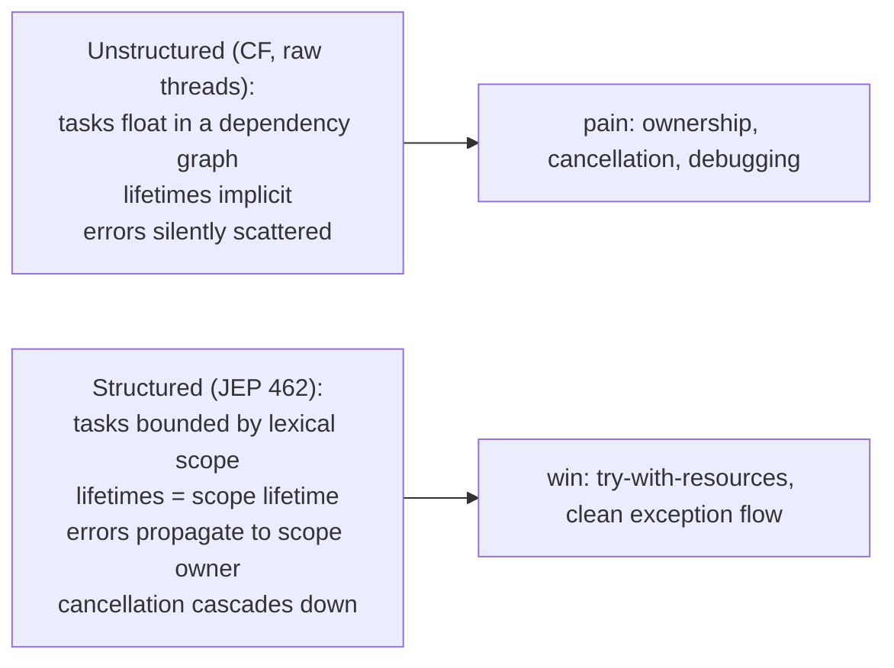
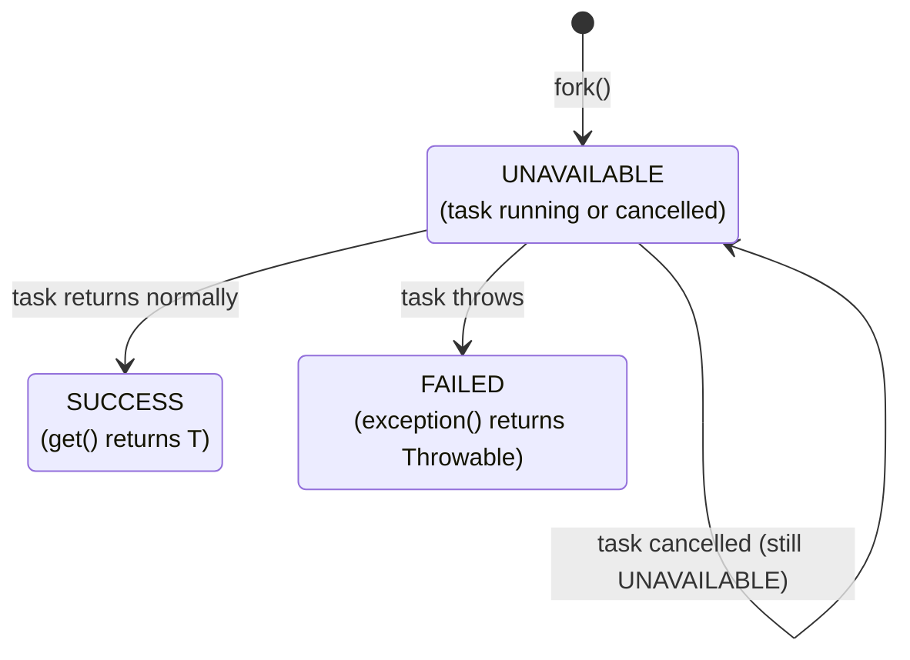

# Structured Concurrency

`CompletableFuture` (T07), `invokeAll` (T05/T06), and the raw `Thread.start()`/`join()` pair (T01) all let you launch concurrent work and wait for it — but none of them *enforces* that the launched tasks' lifetimes are bounded. A `CompletableFuture` chain can outlive the method that created it; a forked thread can run forever even after its parent returns; an exception in one of `invokeAll`'s tasks doesn't automatically cancel the rest. The result is the *unstructured concurrency* problem: tasks with unclear ownership, exceptions silently swallowed, cancellation that doesn't cascade, resource cleanup that depends on developer discipline. **Structured concurrency** (JEP 462, preview JDK 21–24+, by analogy to structured programming's replacement of `goto` with block scopes) makes the lifetime of concurrent subtasks *lexically* bounded by a parent scope — just like try-with-resources bounds a `Closeable`'s lifetime — so launching, joining, and cancellation all happen in one place, statically visible in the code.

The depth-bar requirement isn't "use `StructuredTaskScope`." At the **principle** layer, the structured-concurrency rule (Nathaniel Smith, 2018) says: *"If a task splits into concurrent subtasks, all subtasks return to the same place."* The scope is the *meeting point*. At the **API** layer, **`StructuredTaskScope`** is a `try-with-resources` resource: `fork()` spawns subtasks (typically virtual threads, T14), `join()` waits for all of them to complete, `close()` is guaranteed to cancel any remaining (which propagates `Thread.interrupt()` into each subtask's cooperative cancellation). At the **policy** layer, two built-in variants implement the most common patterns — **`ShutdownOnFailure`** (all-or-nothing: first failure cancels the rest, `throwIfFailed()` propagates the exception) and **`ShutdownOnSuccess`** (first-wins: first success cancels the rest, `result()` returns the winner) — plus a customization hook (`handleComplete` override) for arbitrary policies. At the **integration** layer, **`ScopedValue`** (JEP 446, T14) inherits across `fork` boundaries (unlike `ThreadLocal`), so per-request context propagates correctly through the structured-concurrency tree, replacing `InheritableThreadLocal` for the Loom era. We will cover all four layers, with the JDK 21–24 API as the ground truth and a brief note on the preview status (the API may shift slightly before standardization).

> [!NOTE]
> Prerequisites: [Virtual threads](./T14-virtual-threads-project-loom.md) (L3/C01/T14) — `fork()` typically spawns a virtual thread, the whole pattern requires cheap thread creation; [Fork/Join framework](./T13-fork-join-framework.md) (L3/C01/T13) — similar fork/join shape but with lexical bounds; [CompletableFuture & async composition](./T07-completablefuture-and-async-composition.md) (L3/C01/T07) — the unstructured alternative this replaces; [Callable & Future](./T06-callable-and-future.md) (L3/C01/T06) — `Subtask` plays a Future-like role; [Executors & thread pools](./T05-executors-and-thread-pools.md) (L3/C01/T05) — `invokeAll`/`invokeAny` are the closest existing equivalents; [Thread lifecycle & states](./T02-thread-lifecycle-and-states.md) (L3/C01/T02) — cancellation works via cooperative interrupt.

## The Problem — Unstructured Concurrency Loses Ownership

A typical fan-out with `CompletableFuture`:

```java
public Result handle(Request r) {
    var userF   = CompletableFuture.supplyAsync(() -> fetchUser(r.userId), pool);
    var ordersF = CompletableFuture.supplyAsync(() -> fetchOrders(r.userId), pool);
    var statsF  = CompletableFuture.supplyAsync(() -> fetchStats(r.userId), pool);

    return CompletableFuture
        .allOf(userF, ordersF, statsF)
        .thenApply(_v -> new Result(userF.join(), ordersF.join(), statsF.join()))
        .get();          // blocks current thread
}
```

Three implicit problems:

1. **No cancellation cascade.** If `fetchOrders` throws, `fetchUser` and `fetchStats` keep running — wasting downstream resources (DB connections, partner API calls) for results that will be discarded. `allOf` waits for all to finish; only `cancel(true)` on each future cancels them, and you have to write that code yourself.
2. **No lifetime bound.** Nothing prevents `userF` from being captured into a long-lived field and used after `handle` returns. The handler's "scope" is conceptual, not enforced.
3. **Exception loss.** A single `.get()` at the end captures *one* exception (the first non-cancelled); the others are silently lost or wrapped opaquely in `CompletionException`.

The `CompletableFuture` API encourages *unstructured* concurrency — tasks float in a graph of dependencies, lifetimes are implicit, errors are hard to route. For *one-off* async work it's fine; for the every-handler fan-out + join pattern it's overcomplicated and bug-prone.



## The Principle — One Place to Return To

The structured-concurrency rule, from Nathaniel Smith's [original Trio Python library essay](https://vorpus.org/blog/notes-on-structured-concurrency-or-go-statement-considered-harmful/) (2018):

> **If a task splits into concurrent subtasks, all subtasks return to the same place — the point that spawned them.**

The analogy: structured programming replaced `goto` with block scopes (`if`, `while`, `for`). Just as `goto` allowed control flow to leap anywhere — losing the lexical structure that makes code reasonable — *unstructured* concurrency allows task lifetimes to outlive their lexical scope. Structured concurrency restores the lexical bound: every concurrent subtask returns to the scope that forked it, just like every nested-block local variable expires at its scope's `}`.

Kotlin's `coroutineScope`, Trio (Python), and JEP 462 all implement the same idea. Java's API uses the existing `try-with-resources` mechanism to express the scope:

```java
try (var scope = new StructuredTaskScope.ShutdownOnFailure()) {
    Subtask<User>       userS  = scope.fork(() -> fetchUser(id));
    Subtask<List<Order>> ordS  = scope.fork(() -> fetchOrders(id));
    Subtask<Stats>      statsS = scope.fork(() -> fetchStats(id));

    scope.join();                    // wait for all (or first failure)
    scope.throwIfFailed();           // rethrow if any failed

    return new Result(userS.get(), ordS.get(), statsS.get());
}    // scope.close() — auto-cancels any still-running, guarantees no leaks
```

Every subtask was forked from this scope; every subtask is *done* (success, failure, or cancelled) before the scope closes; any failure propagates as a regular exception that the caller catches naturally. Try-with-resources guarantees `scope.close()` runs even on exception.

## `StructuredTaskScope.ShutdownOnFailure` — All-or-Nothing

The most common pattern. All subtasks run concurrently; if *any* fails, the rest are cancelled and the failure propagates to the scope owner:

```java
public Result handle(Request r) throws InterruptedException, Exception {
    try (var scope = new StructuredTaskScope.ShutdownOnFailure()) {
        Subtask<User>       userS  = scope.fork(() -> fetchUser(r.userId));
        Subtask<List<Order>> ordS  = scope.fork(() -> fetchOrders(r.userId));
        Subtask<Stats>      statsS = scope.fork(() -> fetchStats(r.userId));

        scope.join();             // returns when all done OR first failure
        scope.throwIfFailed();    // rethrows the first failure if any

        // All three succeeded
        return new Result(userS.get(), ordS.get(), statsS.get());
    }
}
```

The lifecycle:

1. **fork()** spawns a virtual thread for each task; the thread runs the lambda; the returned `Subtask<X>` is a handle.
2. **join()** blocks the scope owner until either (a) all subtasks complete or (b) any subtask fails — whichever first.
3. **On first failure**, `ShutdownOnFailure` calls `scope.shutdown()`, which interrupts all still-running subtasks (T02 — interrupt is cooperative).
4. **throwIfFailed()** rethrows the *first* failure observed (wrapped in `ExecutionException`).
5. **close()** (try-with-resources auto-invocation) runs `shutdown()` again and waits for all subtasks to actually exit (handling tasks that took a while to respond to interrupt).

```mermaid
sequenceDiagram
  participant Scope as StructuredTaskScope
  participant U as fetchUser VT
  participant O as fetchOrders VT
  participant S as fetchStats VT
  Note over Scope: try (var scope = new ShutdownOnFailure())
  Scope->>U: fork — spawns virtual thread
  Scope->>O: fork
  Scope->>S: fork
  Note over Scope,S: scope.join() — block until all done or one fails
  U-->>Scope: success — User result stored
  S-->>Scope: success — Stats stored
  O-->>Scope: failure! IOException thrown
  Scope->>U: shutdown — interrupt (already done; no effect)
  Scope->>S: shutdown — interrupt (already done; no effect)
  Note over Scope: scope.throwIfFailed() — IOException rethrown
  Note over Scope: scope auto-closed by try-with-resources
```

## `StructuredTaskScope.ShutdownOnSuccess` — First-Wins Race

The "ask several providers; take the fastest answer" pattern:

```java
public Quote bestQuote(Symbol s) throws InterruptedException, ExecutionException {
    try (var scope = new StructuredTaskScope.ShutdownOnSuccess<Quote>()) {
        scope.fork(() -> bloomberg.quote(s));
        scope.fork(() -> refinitiv.quote(s));
        scope.fork(() -> internal.quote(s));

        return scope.join().result();      // returns first success; cancels rest
    }
}
```

`ShutdownOnSuccess<T>`:

1. Spawns all subtasks.
2. On the *first* successful completion, calls `shutdown()` to cancel the others.
3. `result()` returns the winner's result.
4. If *all* fail (no successes), `result()` throws `ExecutionException` wrapping the last failure.

This is `invokeAny` (T05) reborn — with proper structured-cancellation of the losers, exception aggregation, and lexical scope.

## Custom Scopes — Arbitrary Policies

For policies neither built-in covers — "collect all, ignore failures," "first 3 to succeed, ignore the rest," "any 2 of 3" — subclass `StructuredTaskScope<T>` and override `handleComplete(Subtask<? extends T>)`:

```java
class CollectAllResults<T> extends StructuredTaskScope<T> {
    private final List<T> results = Collections.synchronizedList(new ArrayList<>());

    @Override
    protected void handleComplete(Subtask<? extends T> subtask) {
        if (subtask.state() == Subtask.State.SUCCESS) {
            results.add(subtask.get());
        }
        // on FAILED: ignore; collect what we can
    }

    public List<T> results() {
        ensureOwnerAndJoined();
        return List.copyOf(results);
    }
}

try (var scope = new CollectAllResults<Quote>()) {
    scope.fork(() -> bloomberg.quote(s));
    scope.fork(() -> refinitiv.quote(s));
    scope.fork(() -> internal.quote(s));
    scope.join();
    List<Quote> all = scope.results();
    return aggregate(all);
}
```

`handleComplete` is called *once per subtask* as each one finishes (success or failure). You can record results, count, decide to shutdown early, etc. The scope's own shutdown logic is whatever you implement — `ShutdownOnFailure` calls `shutdown()` on first failure; `ShutdownOnSuccess` calls it on first success; your scope can do neither, both, or something else.

## The `Subtask` State Machine

`fork()` returns a `Subtask<T>` — a Future-like handle to the forked task:

```java
sealed interface Subtask<T> {
    enum State { UNAVAILABLE, SUCCESS, FAILED }
    State state();
    T get();                     // result on SUCCESS; IllegalStateException otherwise
    Throwable exception();       // throwable on FAILED; IllegalStateException otherwise
}
```

Three states:

- **`UNAVAILABLE`**: task is still running (or was cancelled before completing).
- **`SUCCESS`**: task completed normally; `get()` returns the result.
- **`FAILED`**: task threw; `exception()` returns the throwable.

`Subtask.get()` and `Subtask.exception()` *must* be called only after `scope.join()` — otherwise they throw `IllegalStateException`. This is a deliberate restriction: subtask results have meaning only at the scope's meeting point, not while tasks are still running. Trying to read a result early is a bug.



## Scope Inheritance and Cancellation

Scopes can nest naturally. A subtask can open its *own* scope, fork its own children, and the inner scope's lifetime is bounded by the outer scope's. Cancellation cascades:

```java
try (var outer = new StructuredTaskScope.ShutdownOnFailure()) {
    outer.fork(() -> {
        try (var inner = new StructuredTaskScope.ShutdownOnFailure()) {
            inner.fork(() -> stepA());
            inner.fork(() -> stepB());
            inner.join();
            inner.throwIfFailed();
            return combine();
        }
    });
    outer.fork(() -> otherWork());
    outer.join();
    outer.throwIfFailed();
}
```

If `otherWork` fails, the outer scope shuts down → the inner scope's owning thread is interrupted → the inner scope's `join()` propagates the interrupt → the inner scope's tasks (`stepA`, `stepB`) are also interrupted via `inner.close()`. The interrupt propagates *through the lexical hierarchy*.

This is structured concurrency's headline benefit: **cancellation is reliably tree-shaped**. A timeout, a shutdown signal, or a failure anywhere in the tree cascades through the nested scopes cleanly.

## `ScopedValue` Integration — Context Propagation Across Forks

`ScopedValue` (JEP 446, introduced in T14) inherits across `fork` boundaries. Pre-Loom, request context was passed via `ThreadLocal` and `InheritableThreadLocal`:

- `ThreadLocal`: each thread has its own; doesn't propagate to forked threads.
- `InheritableThreadLocal`: child threads inherit the parent's value at creation, but later changes don't propagate, and the inherited value is *captured* not shared.

With structured concurrency + virtual threads, the *right* tool is `ScopedValue`:

```java
static final ScopedValue<User> CURRENT_USER = ScopedValue.newInstance();
static final ScopedValue<String> TRACE_ID  = ScopedValue.newInstance();

public Response handle(Request r) {
    ScopedValue.where(CURRENT_USER, r.user)
               .where(TRACE_ID, r.traceId)
               .call(() -> {
                   try (var scope = new StructuredTaskScope.ShutdownOnFailure()) {
                       var dataS  = scope.fork(() -> fetchData(r));
                       var enrichS = scope.fork(() -> enrichData(r));
                       scope.join();
                       scope.throwIfFailed();
                       return new Response(dataS.get(), enrichS.get());
                   }
               });
}

// inside fetchData, on whatever virtual thread it runs on:
User u = CURRENT_USER.get();           // ✓ visible — inherited via structured concurrency
String tid = TRACE_ID.get();            // ✓ visible
```

The scoped values are visible in the forked virtual threads because structured concurrency *carries the binding through fork*. The values are *immutable for the duration of the scope* — every forked subtask sees the same `User` and `TRACE_ID`. When the scope closes, the bindings are released.

This is the Loom-era replacement for the (now-discouraged) `InheritableThreadLocal` pattern. `ScopedValue` is cheaper (no thread-local-map allocation), inherently scoped (auto-cleared), and integrates with structured-concurrency forks.

## Comparison with `CompletableFuture.allOf` / `anyOf`

| Aspect | `CompletableFuture` | `StructuredTaskScope` |
|--------|---------------------|----------------------|
| Lifetime bound | implicit (any time) | **lexical** (try-with-resources scope) |
| Cancellation on failure | none — must `cancel(true)` each future | **automatic** via shutdown-on-failure |
| Exception propagation | wrapped in `CompletionException`; complex | regular exception; `throwIfFailed` rethrows |
| Composition | any DAG | scope tree (nested scopes) |
| Inheriting context | manual via `Executor` + context capture | **automatic via `ScopedValue`** |
| Idiomatic for | async pipelines, callback chains | fan-out + join, request handling |
| Maturity (2026) | JDK 8+, stable, well-known | JEP 462 preview; may shift |

For fan-out-and-join — the canonical web-handler pattern — `StructuredTaskScope` is *strictly better*: no need to remember `cancel(true)`, no exception-wrapping complications, automatic resource cleanup. `CompletableFuture` remains the right tool for async pipelines (sequential `thenApply`/`thenCompose` chains) and for bridging callback-style APIs.

## Comparison with `invokeAll` / `invokeAny`

| Aspect | `ExecutorService.invokeAll` (T05/T06) | `StructuredTaskScope.ShutdownOnFailure` |
|--------|--------------------------------------|----------------------------------------|
| Cancellation on failure | none — collects all results regardless | yes — first failure cancels rest |
| Threads | pool's threads | virtual threads (default) |
| Scope | no — can be called anywhere | lexical try-with-resources |
| Context inheritance | none | ScopedValue auto-inherits |
| Return shape | `List<Future<T>>` | typed `Subtask<T>` per fork |

`invokeAll` is the JDK 5 equivalent. It works but doesn't enforce structure: failures don't cascade, tasks can leak past the calling method, and integration with virtual threads requires manual `Thread.ofVirtual().factory()` plumbing. In 2026 code, `StructuredTaskScope` is the preferred replacement.

## The Exception Story

Three exception paths to know:

1. **`join()` throws `InterruptedException`** if the scope owner is interrupted while waiting. Standard interrupt handling applies.
2. **`throwIfFailed()` rethrows** the *first* observed failure (wrapped in `ExecutionException`). Override with `throwIfFailed(Function<Throwable, X>)` to wrap into a custom exception type.
3. **`scope.close()` is auto-called by try-with-resources** — it `shutdown()`s and waits for remaining tasks. Suppresses exceptions from the body's failure (standard try-with-resources suppression).

```java
try (var scope = new ShutdownOnFailure()) {
    scope.fork(() -> { throw new IOException("net"); });
    scope.fork(() -> { throw new SQLException("db"); });   // ← may be cancelled before throwing
    scope.join();
    scope.throwIfFailed(e -> new ServiceException("fail", e));   // wraps the first failure
}
```

If both tasks fail almost simultaneously, only the *first* observed failure is rethrown (`ShutdownOnFailure` policy). Other failures are visible via individual `Subtask.exception()` if you need them.

## The Cancellation Story

`StructuredTaskScope.shutdown()` cancels all running subtasks. The mechanism:

1. Marks the scope as shut down.
2. **Interrupts** each running subtask's virtual thread (T02 — cooperative interrupt).
3. The subtasks must check `Thread.interrupted()` or be in an interruptible blocking call (`Thread.sleep`, `Lock.lockInterruptibly`, etc.) to actually stop.
4. `scope.close()` waits for all subtasks to actually exit — so even tasks that take time to respond to the interrupt are accounted for.

The same cooperative-cancellation rule from T02 applies: a task with a tight CPU loop that doesn't check `Thread.interrupted()` will *not* be stopped by `scope.shutdown()`. Write cancellation-friendly tasks (check the interrupt flag periodically, use interruptible APIs).

## Real-World Example — Web Handler

```java
public Response handleProfile(Request r) throws Exception {
    return ScopedValue.where(USER, r.user).where(TRACE, r.traceId).call(() -> {
        try (var scope = new StructuredTaskScope.ShutdownOnFailure()) {
            var profileS  = scope.fork(() -> profileSvc.fetch(r.userId));
            var ordersS   = scope.fork(() -> orderSvc.fetch(r.userId));
            var prefsS    = scope.fork(() -> prefSvc.fetch(r.userId));

            scope.joinUntil(Instant.now().plusSeconds(2));    // 2s deadline for the whole fan-out
            scope.throwIfFailed();

            return new Response(profileS.get(), ordersS.get(), prefsS.get());
        }
    });
}
```

This handler:

- Inherits `USER` and `TRACE` from the request context into all three downstream calls.
- Fans out 3 parallel fetches, each on its own virtual thread.
- Bounds the total time to 2 seconds (`joinUntil`).
- Cancels remaining fetches if any one fails or the deadline elapses.
- Auto-cleans up via try-with-resources.

Compare to a `CompletableFuture` equivalent — same logic, ~3× the code, manual cancellation, opaque exception wrapping. Structured concurrency is the strictly better idiom for this pattern.

## Configuration — `StructuredTaskScope.open()`

JDK 23+ added a more flexible factory:

```java
try (var scope = StructuredTaskScope.open(
        new StructuredTaskScope.Joiner.OnSuccess<Quote>(),     // joiner = policy
        cfg -> cfg.withName("quote-fetch")                      // configuration
                  .withThreadFactory(Thread.ofVirtual().factory())
)) {
    ...
}
```

The `Joiner` abstraction is the policy (default: `ShutdownOnFailure` etc.), and the `cfg` lambda configures the scope (name for diagnostics, thread factory). Use `withThreadFactory` if you specifically need *platform* threads for the subtasks (rare — VTs are almost always the right answer).

Note: the exact API surface is evolving across previews. Pin your JDK version when adopting; expect minor signature changes before standardization.

## Nested Scopes — Hierarchical Fan-Out

Scopes nest by lexical containment:

```java
try (var outer = new ShutdownOnFailure()) {
    outer.fork(() -> {
        try (var inner = new ShutdownOnFailure()) {
            inner.fork(() -> stepA());
            inner.fork(() -> stepB());
            inner.join();
            inner.throwIfFailed();
            return combine();
        }
    });
    outer.fork(() -> otherWork());
    outer.join();
    outer.throwIfFailed();
}
```

The inner scope's owning thread is the *outer scope's forked virtual thread*. If the outer scope shuts down (due to a failure in `otherWork`), the inner scope's thread is interrupted; the inner `join()` returns with interrupt; the inner `close()` cascades the cancellation to `stepA` and `stepB`.

This is the cancellation tree in action: a failure anywhere in the tree propagates to *all* descendants. The lexical nesting matches the runtime nesting matches the cancellation propagation. **The structure is reflected in every aspect of the system.**

## Performance

| Op | Approximate cost |
|----|-----------------|
| Scope creation | ~1 µs (heap allocation + initialization) |
| `fork()` | ~1-2 µs (spawn virtual thread + Subtask) |
| `join()` (all done) | minimal — just waits |
| `join()` (waiting on slowest) | latency-bound; no CPU |
| `shutdown()` | ~1 µs + interrupt costs per running task |
| `close()` | waits for actual exit; usually quick post-shutdown |

For typical fan-out (3-10 forks of operations taking milliseconds each), the scope overhead is well under 1% of total time. For sub-microsecond tasks, the overhead may dominate; in that case, the structured-concurrency abstraction isn't the right level — just compute sequentially.

## Theoretical Roots

The structured-concurrency idea was named and popularized by **Nathaniel Smith**'s 2018 [Trio Python library](https://github.com/python-trio/trio) and the accompanying essay *Notes on structured concurrency, or: Go statement considered harmful*. The argument: just as `goto` undermines the lexical structure of code, *unstructured* concurrency primitives (Go's `go`, Java's `Thread.start()`, `CompletableFuture.supplyAsync`) allow tasks to escape the lexical scope of the code that spawned them, breaking the reasoning power that *structured programming* (Dijkstra 1968) brought to single-threaded code.

The principle has been adopted independently in:

- **Kotlin coroutines** — `coroutineScope { }` block.
- **Swift** — `TaskGroup`.
- **C# task wait patterns** — informal use of `using`.
- **Java JEP 462** — `StructuredTaskScope`.

The shared design: tasks are bounded by a lexical scope, fan-out and fan-in happen at scope boundaries, errors propagate up, cancellation propagates down.

## JEP Evolution

| JEP | JDK | Status |
|-----|-----|--------|
| 428 | 19 | incubator (`jdk.incubator.concurrent`) |
| 437 | 20 | incubator |
| 453 | 21 | **preview** (`java.util.concurrent`) |
| 462 | 22 | preview |
| 480 | 23 | preview (refined API: `Joiner`, etc.) |
| 499 | 24 | preview |
| (standardize) | 25+ | expected final |

As of JDK 24, structured concurrency is still preview — meaning the API surface may change before final. Production adopters pin a specific JDK and the corresponding API; the *concept* is stable but the *signatures* aren't yet.

## Common Mistakes

### Forgetting `throwIfFailed()`

```java
try (var scope = new ShutdownOnFailure()) {
    scope.fork(() -> mightThrow());
    scope.join();
    return result.get();      // ✗ if fork threw, get() throws IllegalStateException
}
```

Always call `throwIfFailed()` after `join()` if you're using `ShutdownOnFailure`. It's the explicit "propagate the failure" call.

### Reading `Subtask.get()` before `join()`

```java
Subtask<X> s = scope.fork(...);
X x = s.get();             // ✗ IllegalStateException — task not joined
scope.join();
```

`Subtask.get()` only makes sense after the scope has joined. Always join first.

### Forking outside the scope

```java
StructuredTaskScope scope = new ShutdownOnFailure();
otherCode.callSometime(scope::fork);    // ✗ scope might close before fork happens
```

The scope owner (current thread) is the only thread allowed to fork. The pattern enforces lexical use; sneaking the scope into a callback breaks the contract.

### Not using try-with-resources

```java
var scope = new ShutdownOnFailure();
scope.fork(...);
scope.join();
// ✗ no close() — running tasks may leak if join() failed or threw
```

Always use try-with-resources. The close() guarantees no leaked tasks.

### Long-running scopes

```java
try (var scope = new ShutdownOnFailure()) {
    while (true) {
        scope.fork(() -> handleOneRequest());
        // never join
    }
}    // ✗ scope holds the world hostage; defeats lexical bound
```

Scopes are meant for *bounded* fan-out + join. For long-running concurrent work (servers, daemons), use virtual threads directly without a scope.

### Mixing fork between two scopes

```java
try (var scopeA = new ShutdownOnFailure()) {
    try (var scopeB = new ShutdownOnFailure()) {
        scopeA.fork(...);    // ✗ may not be permitted in some preview versions
    }
}
```

Each scope owns its own forks. Don't mix.

### Catching `InterruptedException` inside a subtask without re-checking

```java
scope.fork(() -> {
    try { return work(); }
    catch (InterruptedException e) {
        // ✗ silently swallowed — shutdown won't actually stop this task
        return null;
    }
});
```

Same cooperative-cancellation rule from T02 — restore the flag, propagate, or stop.

### Expecting `Subtask.get()` to wait

`Subtask.get()` does *not* block. It returns the already-set result or throws if the task isn't yet done. Use `scope.join()` to wait.

## Observability

### Thread dumps with structured concurrency

`jcmd <pid> Thread.dump_to_file -format=json` (T14) produces a dump where virtual threads are grouped by their owning structured-concurrency scope. The JSON output shows the scope tree:

```json
{
  "container": "StructuredTaskScope-1",
  "threads": [
    { "name": "fetch-user", "state": "WAITING", "stack": [...] },
    { "name": "fetch-orders", "state": "WAITING", "stack": [...] }
  ],
  "containers": [
    { "container": "inner-scope-1", "threads": [...] }
  ]
}
```

This is the canonical way to inspect a live JVM with structured concurrency — the dump *reflects the scope hierarchy*, not just a flat list of threads.

### JFR events

Standard `jdk.VirtualThreadStart`/`End` events fire for each forked subtask. Additional JFR events for scope-level operations are evolving across preview versions; check the current JFR catalog for your JDK.

> [!INTERVIEW]
> "Walk me through `StructuredTaskScope.ShutdownOnFailure`." — Senior answer:
>
> 1. **Lexical scope.** `try (var scope = new ShutdownOnFailure())` opens a scope as a try-with-resources resource.
> 2. **fork() spawns a virtual thread** per task; returns a `Subtask<T>` handle.
> 3. **join() blocks** until either all subtasks complete or any one fails.
> 4. **On first failure**, the scope calls `shutdown()`, which interrupts the still-running subtasks (cooperative cancellation, T02).
> 5. **throwIfFailed()** rethrows the first failure.
> 6. **close() (auto via try-with-resources)** runs `shutdown()` once more and waits for actual exit, guaranteeing no leaks.
> 7. **Together**: every forked task is accounted for at scope exit; cancellation cascades through nested scopes; ScopedValue context is inherited automatically.

> [!INTERVIEW]
> Short Q&A:
>
> 1. **What's structured concurrency?** Tasks have lexical scopes that bound their lifetimes; errors propagate up; cancellation propagates down. Replaces unstructured `Thread.start`/`CompletableFuture.supplyAsync` for fan-out patterns.
> 2. **Where did the concept come from?** Nathaniel Smith's Trio Python library (2018); now in Kotlin, Swift, Java JEP 462.
> 3. **What's the relationship to virtual threads?** Subtasks are typically virtual threads; structured concurrency makes "fork lots of cheap threads, join them all" tractable.
> 4. **`ShutdownOnFailure` vs `ShutdownOnSuccess`?** Failure cancels on first failure (all-or-nothing); Success cancels on first success (first-wins race).
> 5. **What's a `Subtask`?** Future-like handle returned by `fork()`. Three states: UNAVAILABLE, SUCCESS, FAILED. Read via `get()`/`exception()` only after `join()`.
> 6. **How does cancellation work?** `scope.shutdown()` interrupts running subtasks (cooperative). Subtasks must check `Thread.interrupted()` or use interruptible APIs.
> 7. **How does context propagate?** Via `ScopedValue` (JEP 446) — values bound via `ScopedValue.where().run()` are visible in all subtasks forked inside.
> 8. **vs `CompletableFuture.allOf`?** SC has automatic cancellation, lexical scope, ScopedValue inheritance, cleaner exception flow. CF has more flexible composition for non-fan-out patterns.
> 9. **vs `invokeAll`?** SC's failure cascade vs invokeAll's no-cascade. SC uses virtual threads by default.
> 10. **What does `close()` do?** Calls `shutdown()` and waits for all subtasks to actually exit. Guarantees no leaks.
> 11. **What if I fork from a different thread?** Not permitted — the scope owner is the only thread allowed to fork. This is enforced.
> 12. **Can scopes nest?** Yes. Outer cancellation propagates inward; inner's owning thread is interrupted; inner's tasks are then interrupted too.
> 13. **What's the preview status in 2026?** Still preview as of JDK 24 (JEP 499). API may shift before standardization. Pin your JDK.
> 14. **Performance overhead?** Scope ~1 µs; fork ~1-2 µs. Negligible for typical fan-out patterns; only matters for sub-microsecond tasks.
> 15. **When NOT to use SC?** Long-running daemon-style concurrency (servers, scheduler); use plain virtual threads. SC is for bounded fan-out + join.

## Practice

1. **Basic ShutdownOnFailure.** Implement a handler that fetches `User`, `Orders`, `Stats` in parallel via SC. Have one fail; verify the others are cancelled.
2. **First-wins via ShutdownOnSuccess.** Query 3 quote providers; return the fastest. Verify the slower 2 are cancelled by tracking their interrupt response.
3. **Custom scope — collect all.** Implement `CollectAllResults` that gathers successes and ignores failures. Test with mixed success/failure tasks.
4. **Nested scopes + cancellation.** Outer SC forks 2 inner SCs. One inner fails; verify the other inner's tasks are interrupted.
5. **ScopedValue across forks.** Bind a `ScopedValue` outside SC; verify all forked subtasks read the same value. Try modifying it inside (should fail — immutable).
6. **Timeout via joinUntil.** Fork 3 slow tasks (1 s each); `joinUntil(Instant.now().plusMillis(500))`. Verify TimeoutException-equivalent + cancellation.
7. **Migration from CompletableFuture.** Take an existing CF-based fan-out and rewrite with SC. Compare LOC, exception handling, cancellation behavior.
8. **Cooperative cancellation.** Write a subtask that ignores interrupts (no check, no interruptible call). Trigger shutdown; verify the task runs to completion despite shutdown, but the scope still closes after.
9. **Forking lots of subtasks.** Fork 10,000 subtasks (each a 100 ms sleep). Measure scope creation + fork overhead; should be ~10-30 ms total.
10. **Exception mapper.** Use `throwIfFailed(t -> new ServiceException("wrapped", t))` to wrap failures. Verify the original is preserved as `getCause()`.
11. **Subtask state inspection.** Fork 5 tasks; some succeed, some fail. After `join()`, inspect each Subtask's `state()` and route via `switch`.
12. **Live thread dump.** Run a long-living SC fan-out. Take `jcmd Thread.dump_to_file -format=json`. Identify the scope hierarchy.

## Recap

You should now be able to:

- State the **structured-concurrency principle** (Nathaniel Smith, 2018): if a task splits into concurrent subtasks, all subtasks return to the same place — the scope that forked them. Just as block scopes structure single-threaded control flow, structured concurrency structures concurrent task lifetimes.
- Identify the **problems with unstructured concurrency** (CompletableFuture, raw threads): no lifetime bound, no cancellation cascade, complex exception flow, fragile resource cleanup.
- Use **`StructuredTaskScope`** as a try-with-resources resource: `fork()` spawns virtual threads (typically), `join()` waits, `close()` cancels remaining + waits for actual exit.
- Apply **`ShutdownOnFailure`** for all-or-nothing fan-out (first failure cancels the rest, `throwIfFailed()` propagates) and **`ShutdownOnSuccess<T>`** for first-wins races (first success cancels rest, `result()` returns winner).
- Implement **custom scopes** by subclassing `StructuredTaskScope<T>` and overriding `handleComplete(Subtask)` for arbitrary policies (collect-all, ignore-failures, any-N-of-M).
- Recite the **`Subtask` state machine**: UNAVAILABLE (running or cancelled) → SUCCESS (`get()` returns) / FAILED (`exception()` returns). Read after `join()` only — pre-join calls throw IllegalStateException.
- Understand **scope inheritance**: nested scopes mean nested cancellation; outer shutdown interrupts the outer-forked thread, propagating to its inner scope's tasks.
- Use **`ScopedValue`** (JEP 446) for context propagation: bound values are visible in all subtasks forked inside, replacing `InheritableThreadLocal` for the Loom era.
- Compare with **`CompletableFuture`** (better for async pipelines and callback bridges; SC better for fan-out + join), **`invokeAll`/`invokeAny`** (legacy; SC is the modern replacement with cancellation + scope), and raw `Thread.start()` (unstructured; SC is the structured replacement).
- Apply the **cooperative cancellation rule** (T02): `scope.shutdown()` interrupts; tasks must check `Thread.interrupted()` or use interruptible APIs to actually stop.
- Choose **performance scale**: scope+fork overhead ~1-2 µs; negligible for typical fan-out patterns; structured concurrency isn't the right level for sub-microsecond tasks.
- Recognize the **theoretical roots**: Trio Python (Nathaniel Smith 2018), adopted by Kotlin coroutines, Swift task groups, JEP 462.
- Track the **JEP evolution**: 428 (incubator JDK 19) → 437 → 453 → 462 → 480 → 499 (preview JDK 24); standardization expected JDK 25+. Pin your JDK version; expect API refinements.
- Diagnose via **`jcmd Thread.dump_to_file -format=json`** for scope-grouped dumps and JFR events for VT-level lifecycle.
- Avoid the **eight common bugs**: missing `throwIfFailed`, premature `Subtask.get()`, forking outside the scope owner, missing try-with-resources, long-running scopes, fork mixing across scopes, swallowed `InterruptedException` in subtasks, expecting `Subtask.get()` to wait.

## Next

Continue to [Concurrency pitfalls (deadlock, livelock, starvation, races)](./T16-concurrency-pitfalls-deadlock-livelock-starvation-races.md) — the failure modes that haunt every concurrent program. We'll dissect the classic four: **deadlock** (two threads each waiting for what the other holds — Coffman conditions, cycle detection, ordered acquisition prevention); **livelock** (threads actively work but make no progress — retry-and-yield loops, randomized backoff fix); **starvation** (some thread never gets a turn — unfair locks, priority inversion); and **race conditions** (results depend on interleaving — check-then-act, read-modify-write, publication races). We'll cover detection via thread dumps, deadlock-finding (`jcmd Thread.print` auto-reports monitor cycles), and the design patterns that prevent each (ordered locks, timeouts, lock-free algorithms, immutable shared state).
