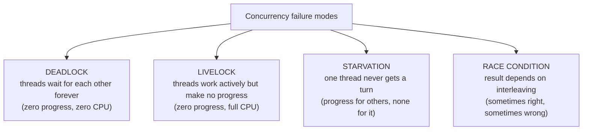
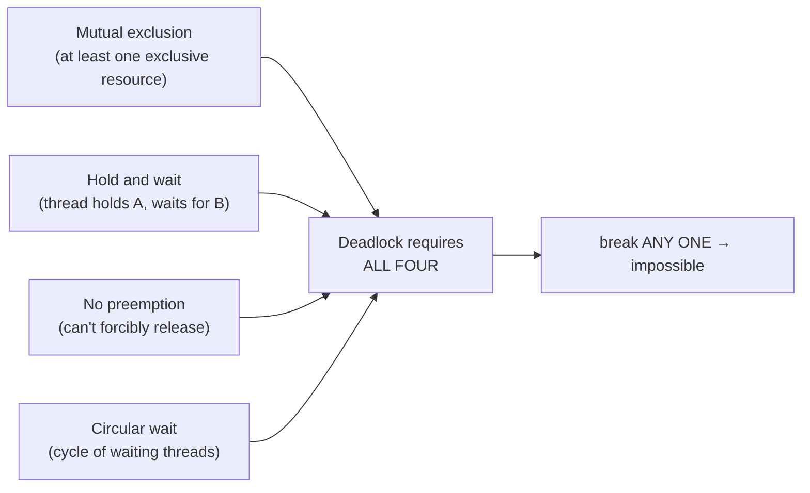
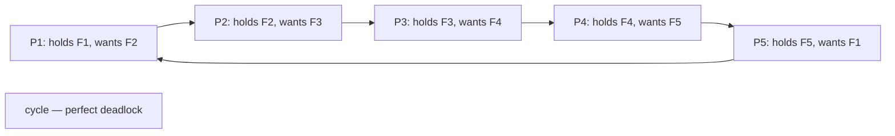
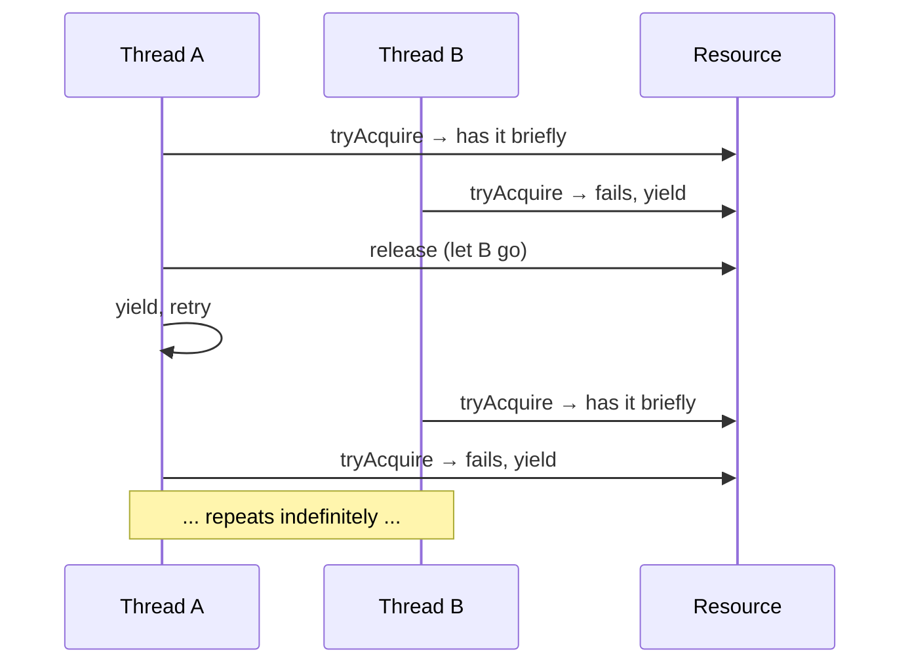
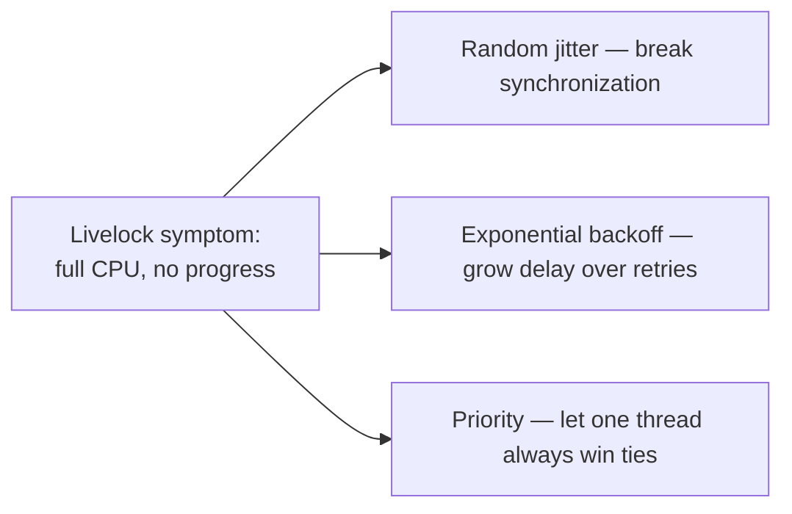

# Concurrency Pitfalls (deadlock, livelock, starvation, races)

Every concurrent Java program inherits four classic failure modes from the underlying execution model — and *every* senior engineer should be able to recognize the shape, the cause, and the cure of each on sight. **Deadlock** (threads waiting for each other forever), **livelock** (threads actively working but making no progress), **starvation** (some thread never gets a turn), and **race conditions** (results depend on interleaving). Together they cover essentially every concurrency bug you'll ever debug — and the same patterns appear at every layer: locks, atomic CAS loops, lock-free data structures, distributed systems, database transactions.

The depth-bar requirement isn't "use ordered lock acquisition." At the **theoretical** layer, **Coffman et al. (1971)** identified four *necessary* conditions for deadlock — mutual exclusion, hold-and-wait, no preemption, circular wait — and *every* deadlock-prevention strategy breaks at least one of them. At the **detection** layer, the JVM auto-detects monitor cycles and emits "Found one Java-level deadlock" in thread dumps (`jstack`, `jcmd Thread.print`); for non-monitor primitives (Lock, Semaphore), detection requires reading the dump's `parking to wait for` lines and tracing held-vs-waited resources manually. At the **prevention** layer, the canonical fixes are **ordered lock acquisition** (acquire by a globally-agreed order — id, name, hash — so a cycle is impossible), **timeouts** (`tryLock(t, u)` breaks out after a deadline), **open calls** (release locks before calling unknown code), and **lock-free / atomic structures** (CAS can spin, livelock, even starve — but never deadlock). At the **race** layer, three shapes cover ~95% of real races — **check-then-act** (use atomic compound ops), **read-modify-write** (use atomic CAS), **publication race** (use volatile/final/safe-publication) — plus the **TOCTOU** security variant where the interleaving lets an attacker squeeze in privilege escalation between check and use. We will cover all four pitfalls in depth, with detection mechanisms, prevention idioms, and the canonical real-world examples (dining philosophers, the Mars Pathfinder priority inversion, the double-checked locking publication race).

> [!NOTE]
> Prerequisites: [Structured concurrency](./T15-structured-concurrency.md) (L3/C01/T15) — scope-based cancellation prevents some classic races; [Virtual threads](./T14-virtual-threads-project-loom.md) (L3/C01/T14) — VT cheap creation eliminates "pool deadlock" T05/T13 talked about; [Java Memory Model](./T12-java-memory-model-happens-before-volatile.md) (L3/C01/T12) — publication races and visibility; [Atomic variables](./T11-atomic-variables.md) (L3/C01/T11) — CAS-based fixes for check-then-act and read-modify-write; [Locks](./T08-locks-reentrantlock-readwritelock-stampedlock.md) (L3/C01/T08) — `tryLock(timeout)` as the universal deadlock escape valve; [synchronized](./T03-synchronized-monitors-and-intrinsic-locks.md) (L3/C01/T03) — monitor cycles detected by the JVM.

## The Four Failure Modes — One-Line Summaries



| Failure | Symptom | Root cause | Canonical cure |
|---------|---------|-----------|----------------|
| Deadlock | Threads stuck in WAITING; zero CPU | Circular wait for resources | Ordered lock acquisition + timeouts |
| Livelock | Full CPU, no work done | Threads keep yielding to each other | Randomized backoff |
| Starvation | One thread never progresses | Unfairness, priority inversion | Fair locks, priority inheritance |
| Race condition | Intermittent wrong results | Unsynchronized access to shared state | Atomic ops, locks, immutability |

## DEADLOCK — the Coffman Conditions

In 1971, Coffman, Elphick, and Shoshani identified the four conditions that must *all* hold for deadlock:

1. **Mutual exclusion** — at least one resource is held exclusively (only one thread can use it at a time).
2. **Hold and wait** — a thread holds at least one resource while waiting for additional ones.
3. **No preemption** — resources can only be released voluntarily by the holding thread; they can't be forcibly taken back.
4. **Circular wait** — there exists a cycle of threads, each waiting for a resource the next holds.

All four must be true. Break any one and deadlock is impossible.



Every deadlock-prevention strategy targets at least one condition:

- **Lock-free algorithms** break *mutual exclusion* (no exclusive resources).
- **Acquire all locks atomically** (single critical section) breaks *hold and wait*.
- **Timeouts** simulate *preemption* (the timer takes the lock back).
- **Ordered acquisition** breaks *circular wait* (no cycle possible).

The most-used in practice: **ordered acquisition + timeouts**.

### The Classic Two-Lock Deadlock

```java
class Account {
    final Object lock = new Object();
    int balance;
}

void transfer(Account from, Account to, int amount) {
    synchronized (from.lock) {
        synchronized (to.lock) {
            from.balance -= amount;
            to.balance += amount;
        }
    }
}

// Thread 1: transfer(A, B, 100)        Thread 2: transfer(B, A, 50)
//   acquires from.lock = A.lock           acquires from.lock = B.lock
//   tries to acquire to.lock = B.lock     tries to acquire to.lock = A.lock
//   ↓ BLOCKED — Thread 2 holds B          ↓ BLOCKED — Thread 1 holds A
//   ⛔ DEADLOCK
```

All four Coffman conditions hold: locks are exclusive (1), each thread holds one while waiting for the other (2), `synchronized` can't be preempted (3), and the wait cycle is T1→B→T2→A→T1 (4).

### The Dining Philosophers

Dijkstra's classic illustration: 5 philosophers sit around a table; between each pair of adjacent philosophers is one fork; each needs *both* adjacent forks to eat. The naïve algorithm — "pick up left fork, then right" — deadlocks if all 5 simultaneously pick up their left fork: each waits for the right fork the next is holding.



Fixes:

- **Asymmetric** — one philosopher (say P5) picks up *right* fork first. Breaks symmetry → breaks cycle.
- **Ordered** — every philosopher picks up the *lower-numbered* fork first. Forces a consistent ordering.
- **Coordinator** — a waiter (semaphore) limits to 4 simultaneous eaters; one is always idle, breaking the cycle.

The ordered fix maps directly to ordered lock acquisition — the universal Java idiom.

## Detecting Deadlock — `jstack` Auto-Detection

The JVM detects *monitor* cycles automatically and prints them at the bottom of thread dumps:

```text
Found one Java-level deadlock:
=============================
"Thread-1":
  waiting to lock monitor 0x00007fc4a8 (object 0x00000007155, a Account),
  which is held by "Thread-0"
"Thread-0":
  waiting to lock monitor 0x00007fc4d0 (object 0x00000007156, a Account),
  which is held by "Thread-1"

Java stack information for the threads listed above:
===================================================
"Thread-1":
  at com.x.Bank.transfer(Bank.java:42)
  ...
"Thread-0":
  at com.x.Bank.transfer(Bank.java:42)
  ...
```

The report shows:

- Which threads are involved.
- Which monitors each holds vs. waits for.
- The stack traces at the lock acquisition points.

**Caveat**: auto-detection only works for **intrinsic monitors** (`synchronized`). For `ReentrantLock`, `Semaphore`, or other AQS-based primitives, the dump shows `parking to wait for <0x...>` lines — but the JVM doesn't compose them into a cycle. You must trace manually:

```text
"Thread-A" ... WAITING (parking)
  - parking to wait for <0x000000071a> (a java.util.concurrent.locks.ReentrantLock$NonfairSync)

"Thread-B" ... WAITING (parking)
  - parking to wait for <0x000000071b> (a ...ReentrantLock$NonfairSync)
  - locked <0x000000071a> (a ...ReentrantLock$NonfairSync)     ← B holds what A waits for
```

To make Lock-based deadlocks detectable, some teams use `-Djava.util.concurrent.lock.detection=true` (JFR-based, JDK 21+) or instrument with a custom Lock wrapper.

> [!TIP]
> Take **two thread dumps a few seconds apart**. Threads stuck at the same stack frames across both are genuinely deadlocked (or starved). Threads that move between dumps are still making progress.

## Prevention 1 — Ordered Lock Acquisition

Define a *globally consistent* order over all lockable resources. Always acquire locks in that order. Cycles become impossible because no thread can ever wait for a resource ordered *before* one it holds.

```java
void transfer(Account from, Account to, int amount) {
    Account first  = (from.id < to.id) ? from : to;
    Account second = (from.id < to.id) ? to : from;
    synchronized (first.lock) {
        synchronized (second.lock) {
            from.balance -= amount;
            to.balance   += amount;
        }
    }
}
```

By acquiring in `id`-order, Thread 1 (`transfer(A, B)`) and Thread 2 (`transfer(B, A)`) both start with `min(A, B)` = `A`. One blocks waiting for `A`, the other proceeds with both locks, finishes, releases. No cycle.

### What if the resources don't have a natural order?

Use `System.identityHashCode(obj)` as the ordering key, with a tiebreaker lock for the rare equal-hash collisions:

```java
final Object TIE_LOCK = new Object();

void transfer(Account from, Account to) {
    int h1 = System.identityHashCode(from);
    int h2 = System.identityHashCode(to);
    if (h1 < h2) acquireAndTransfer(from, to);
    else if (h2 < h1) acquireAndTransfer(to, from);
    else {
        // hash collision — extremely rare
        synchronized (TIE_LOCK) { acquireAndTransfer(from, to); }
    }
}
```

Goetz's *Java Concurrency in Practice* (Section 10.1.2) is the canonical reference.

## Prevention 2 — Lock Timeouts (the Universal Escape Valve)

`Lock.tryLock(timeout, unit)` lets a thread give up after a deadline and try another approach:

```java
boolean ok = false;
try {
    if (lockA.tryLock(2, SECONDS)) {
        try {
            if (lockB.tryLock(2, SECONDS)) {
                try { /* critical section */ ok = true; }
                finally { lockB.unlock(); }
            }
            // else: couldn't get B; release A and retry later
        } finally { lockA.unlock(); }
    }
} catch (InterruptedException ie) { Thread.currentThread().interrupt(); }
return ok;
```

Two things happen:

- The thread gives up on timeout instead of waiting forever, simulating *preemption* (Coffman condition #3 broken).
- The caller decides what to do — retry, abort, log — instead of deadlocking.

Timeouts are the *universal* answer when ordering isn't feasible: deeply nested locking with dynamic resource sets, third-party code that holds unknown locks, distributed locking.

## Prevention 3 — Open Calls and Listener Hygiene

**Holding a lock while calling unknown code** is a major deadlock vector. The unknown code may itself try to acquire locks in an arbitrary order:

```java
void notifyListeners(Event e) {
    synchronized (listenersLock) {
        for (var listener : listeners) {
            listener.onEvent(e);      // ✗ unknown code under our lock
        }
    }
}
```

If a listener tries to acquire any lock we already hold (directly or transitively), or if it calls back into us with a different lock acquisition order, deadlock. The fix is the **open call**: release the lock before the callback.

```java
void notifyListeners(Event e) {
    List<Listener> copy;
    synchronized (listenersLock) { copy = new ArrayList<>(listeners); }   // snapshot under lock
    for (var listener : copy) listener.onEvent(e);                         // unlocked
}
```

Snapshot the relevant state under the lock; release; act. Same idea for `removeListener` etc. — synchronize the *bookkeeping*, not the *callback execution*.

## Prevention 4 — Lock-Free / Single Lock

Two structural fixes:

- **Lock-free algorithms** (T11 — CAS, AtomicReference, Treiber stack, Michael-Scott queue). No locks → no deadlock. Can still livelock or starve.
- **Single global lock** that protects everything. No cycle is possible with one lock. Gives up all parallelism — only suitable for low-traffic or low-contention scenarios.

The decision: prefer ordered acquisition for the typical case; reach for lock-free for hot paths; use single-lock only when the simplicity outweighs the parallelism loss.

## Real-World Deadlocks

### Spring transaction nesting

```java
@Transactional
public void transferA(int from, int to) {
    accountSvc.update(from, -100);          // holds row lock on row `from`
    transferB(to, from);                    // calls another @Transactional method
}

@Transactional
public void transferB(int from, int to) {
    accountSvc.update(from, +100);          // tries to lock row `from` (originally `to`)
    accountSvc.update(to, -100);             // ✗ if called by transferA, this `to` is the row `from` already held
}
```

Two concurrent calls — `transferA(1, 2)` and `transferA(2, 1)` — produce a row-lock cycle in the database, detected and resolved by the database (one transaction rolls back).

### Connection pool exhaustion

```java
DataSource pool = HikariDataSource(maxConnections=10);
@Transactional public void process(...) {
    try (Connection c1 = pool.getConnection()) {
        // ... compute ...
        process2();    // recursive call
    }
}
@Transactional public void process2() {
    try (Connection c2 = pool.getConnection()) {     // ✗ each thread needs 2 conns
        // ...
    }
}
```

With 10 concurrent calls each needing 2 connections, the pool runs out — all 10 hold 1 conn and wait for the 11th. Classic resource-exhaustion deadlock. Fix: pool size > 2× expected concurrency, or eliminate the nested transaction.

### Logging framework re-entry

Some logging frameworks acquire a lock while constructing log messages. If the message construction itself triggers logging (via a `toString()` that logs), the same lock is acquired twice from the same thread. With reentrant locks (`synchronized`, `ReentrantLock`), this is fine. With non-reentrant locks (`StampedLock` — T08), this is a self-deadlock.

## LIVELOCK — Active Yet Stuck

Livelock is the more subtle cousin. Threads aren't blocked — they're actively running — but they keep undoing each other's progress, like two people meeting in a hallway who each step to the same side to let the other pass.

```java
// Two threads each:
while (!acquired) {
    if (resource.tryAcquire()) { acquired = true; }
    else { Thread.yield(); /* let the other go */ }
}
```

If two threads run this in lockstep, both `tryAcquire` and fail (because the other has it briefly), both `yield`. The pattern repeats indefinitely — full CPU, zero progress.



### Cure — Randomized Backoff

Add randomness so the threads don't stay perfectly synchronized:

```java
while (!acquired) {
    if (resource.tryAcquire()) { acquired = true; }
    else {
        long jitter = ThreadLocalRandom.current().nextInt(0, 100);
        Thread.sleep(jitter);    // 0-100 ms random pause
    }
}
```

Now if two threads collide, the random sleeps differ — one wakes earlier, grabs the resource, proceeds. The other's later wake-up finds the resource available.

### Exponential Backoff

For repeated failure (TCP retransmission, database transaction conflicts), the backoff grows exponentially:

```java
int attempt = 0;
while (!acquired) {
    if (resource.tryAcquire()) { acquired = true; }
    else {
        long base = Math.min(MAX_BACKOFF_MS, (1L << attempt) * BASE_MS);
        long jitter = ThreadLocalRandom.current().nextLong(0, base);
        Thread.sleep(jitter);
        attempt++;
    }
}
```

Add jitter to prevent thundering herd. AWS, Google Cloud, every major distributed system uses this pattern.



## STARVATION — Never Getting a Turn

A thread is *starved* when it waits indefinitely while others make progress. Three classic causes:

### 1. Unfair Locks Under Continuous Contention

`ReentrantLock` (default unfair, T08) allows newcomers to *barge* — acquire ahead of waiting threads. Under continuous contention from many newcomers, a queued thread may wait forever.

The fix: `new ReentrantLock(true)` — fair locks guarantee FCFS at the cost of throughput.

### 2. Reader/Writer Imbalance

`ReentrantReadWriteLock` allows multiple concurrent readers; a writer waits for all readers to release. Under a steady stream of readers, a writer can wait forever (T08).

The fix: fair RWLock, or limit reader acquisition rate, or use `StampedLock` with optimistic reads.

### 3. Priority Inversion — the Mars Pathfinder Bug

In 1997, NASA's Mars Pathfinder rover started rebooting itself. The cause: classic priority inversion:

- **Low-priority thread (L)** held a lock.
- **High-priority thread (H)** waited for the lock.
- **Medium-priority thread (M)** preempted L (because M > L) → M ran while H "had higher priority than M but was waiting for L's lock."
- H was *effectively* starved by M.

The fix in real-time systems: **priority inheritance** — when H waits for L's lock, L temporarily inherits H's priority, so M can't preempt L. Pathfinder's bug was fixed by enabling VxWorks's priority inheritance feature (which had been disabled for performance).

> [!NOTE]
> **Standard Java has no priority inheritance.** `Thread.setPriority` is a hint to the OS scheduler; the JVM may or may not honor it. For real-time guarantees, use Java RTS or RTSJ (the Real-Time Specification for Java). For ordinary apps, *don't rely on thread priorities* — use proper concurrency primitives and avoid scenarios that need priority-based fairness.

### Lock-Free Starvation

CAS loops have their own starvation pattern: one thread's CAS keeps failing because others always win the race. Under extreme contention on a single word, an unlucky thread may retry indefinitely. Mitigations: `LongAdder` (T11 — stripe across cells), randomized backoff in the CAS loop, or switch to a fair lock if true FCFS is needed.

## RACE CONDITIONS — Three Shapes

A *race condition* is any bug where the result depends on the interleaving of threads. ~95% of races fit one of three shapes.

### Shape 1 — Check-Then-Act

```java
// ✗ broken
if (!map.containsKey(key)) {
    map.put(key, computedValue);
}
```

Between `containsKey` and `put`, another thread can put. Both threads then `put`, racing to be the "last" — one is silently overwritten. The check-then-act sequence is not atomic.

**Fix**: atomic compound operations on concurrent collections (T10):

```java
// ✓ atomic
map.putIfAbsent(key, computedValue);

// ✓ atomic with lazy computation
map.computeIfAbsent(key, k -> computedValue);
```

`putIfAbsent` and `computeIfAbsent` are atomic at the CHM bucket level; only one thread successfully puts; others observe the first put's result.

### Shape 2 — Read-Modify-Write

```java
// ✗ broken
counter = counter + 1;          // read counter, add 1, write counter — 3 steps
```

Three operations; another thread can interleave between them. Two concurrent `++` may both read 5, both write 6 — lost update.

**Fix**: atomic CAS (T11):

```java
// ✓ atomic
counter.incrementAndGet();       // AtomicInteger
counter.add(1);                  // LongAdder (faster under contention)
```

Or hold a lock for the entire compound operation:

```java
synchronized (this) { counter = counter + 1; }    // ✓ atomic via mutual exclusion
```

### Shape 3 — Publication Race

```java
// ✗ broken: thread A
sharedRef = new Big();           // construct + publish

// thread B
Big b = sharedRef;
b.use();                          // may see partially-constructed object
```

The publication of `sharedRef` and the writes inside the `Big` constructor can be reordered (T12). Another thread may see `sharedRef != null` but the fields uninitialized.

**Fix**: safe publication (T12) — one of:

- `volatile Big sharedRef;` — release/acquire barrier.
- `final` fields in `Big` — initialization safety covers them.
- `synchronized` around both publish and read.
- `AtomicReference<Big>` — same semantics as volatile.

### TOCTOU — the Security-Critical Race

**Time-of-check to time-of-use**: check a security condition; act later; condition changed between check and act:

```java
if (file.canRead()) {            // CHECK — security check
    // ... time passes ...
    String content = Files.readString(file);   // USE — actual access
}
```

An attacker can swap the file (via symlink, FS race) between check and use. The check passed; the use accesses a different file the attacker controls. Privilege escalation.

**Fix**: capability-based access — open the file once and operate on the handle, not the path. The check and use share the same handle, atomic from the attacker's perspective.

### Iteration Race

```java
List<String> list = Collections.synchronizedList(new ArrayList<>());
list.add("x");
list.add("y");
for (String s : list) {           // ✗ throws ConcurrentModificationException if any concurrent modify
    process(s);
}
```

`synchronizedList`'s individual methods are atomic, but iteration is not — the iterator can observe concurrent modifications and throw CME. Fix: synchronize iteration externally:

```java
synchronized (list) { for (String s : list) process(s); }
```

Or use a `CopyOnWriteArrayList` (T10) whose iterators are snapshots, never throw CME.

### Compound API Race

```java
// CHM is thread-safe, but this sequence is not:
if (map.containsKey(k)) {
    Integer v = map.get(k);
    map.put(k, v + 1);
}
```

Each individual call is atomic, but the *sequence* is not — another thread can put between `get` and `put`. The single-line fix:

```java
map.merge(k, 1, Integer::sum);        // ✓ atomic increment-or-put
```

Or `compute` for arbitrary update functions:

```java
map.compute(k, (key, val) -> (val == null) ? 1 : val + 1);
```

## Detection — Tools Worth Knowing

### Static Analysis

- **Error Prone** (Google) — Bazel plugin; detects many concurrency anti-patterns at compile time.
- **SpotBugs** — detects common races (e.g., `Math.random()` in a thread-unsafe class, unsynchronized access to mutable state).
- **IntelliJ inspections** — built-in; `@GuardedBy` annotation hints.
- **NullAway / Checker Framework** — additional pluggable type checkers.

### Stress Testing

- **jcstress** (Doug Lea) — runs litmus tests millions of times under different JIT settings; verifies only JMM-permitted outcomes are observed. **The** tool for memory-model bug detection (T12).
- **Standalone benchmarks** — JMH for throughput + load testing for race exposure.

### Runtime Detection

- **Thread dumps** — `jstack`, `jcmd Thread.print`; auto-detects monitor deadlocks.
- **JFR** — `jcmd JFR.start settings=profile`; records `jdk.JavaMonitorEnter`, `jdk.ThreadPark` for contention analysis.
- **Java Pathfinder (JPF)** — model checker; exhaustively explores interleavings. Research-grade; slow for large programs.

### Code Review Checklist

For any synchronized/locked code, ask:

- Is every access to the shared state properly synchronized?
- Is there a `try/finally` ensuring lock release?
- Are nested locks acquired in a consistent order?
- Are there `tryLock(timeout)` escape valves?
- Are callbacks invoked outside the lock (open calls)?
- Is shared state immutable where possible (T17)?

## Common Mistakes

### Holding a lock during a network call

```java
synchronized (lock) {
    httpClient.get(url);            // ✗ holds lock for 100s of ms; everyone else blocked
}
```

Snapshot or compute under lock; do I/O outside.

### Mixing `synchronized` with `Lock` on the same shared state

The two are independent — `synchronized(obj)` doesn't exclude a thread inside `lock.lock()` from accessing the same field. Pick one mechanism per shared resource.

### Forgetting `try/finally` on Lock

```java
lock.lock();
doWork();              // ✗ if doWork throws, lock leaks
lock.unlock();
```

Always use `try { ... } finally { lock.unlock(); }` (T08).

### Trust in `Thread.sleep` for fairness

`sleep` is a scheduler hint, not a synchronization primitive. Don't use it to "give other threads a turn"; use proper primitives.

### Volatile for compound atomicity

`volatile counter; counter++` is broken (T11). Use `AtomicInteger`.

### Database isolation level confusion

`READ_COMMITTED` doesn't prevent phantom reads; `REPEATABLE_READ` doesn't prevent write skew; `SERIALIZABLE` may abort transactions. Race vulnerability depends on the isolation level — code reviews must consider it.

### Cancellation-while-locked deadlock

```java
synchronized (lock) {
    while (!condition) lock.wait();          // wait releases the monitor
}
// from another thread:
synchronized (lock) { lock.notifyAll(); }     // ✓ this is fine
// but if cancellation also needs the lock... and uses notifyAll... a cycle is possible
```

Ensure cancellation paths don't require the same lock as the waiting paths if they're dependent.

### Pool deadlock (T05/T07)

Recursive task submission to a bounded pool. Fix: use `ForkJoinPool` (T13) or virtual threads (T14).

## Observability

### Find a deadlock via thread dump

```bash
jcmd <pid> Thread.print | grep -A 5 "Found one Java-level deadlock"
```

Or for Lock-based blocking:

```bash
jcmd <pid> Thread.print | grep -B 1 "parking to wait for"
# correlate with held locks on other threads
```

### Find a livelock — CPU monitoring

A livelocked process shows full CPU utilization but no forward progress. Take repeated thread dumps; if the same thread is repeatedly running the same code paths without state advancing, livelock.

### Find races — JFR allocation profiling

Repeated allocation of the "wrong-state" object suggests a race in object construction. JFR's `jdk.ObjectAllocationOutsideTLAB` events with stack traces can localize.

> [!INTERVIEW]
> "What are the four Coffman conditions for deadlock?" — Mutual exclusion, hold-and-wait, no preemption, circular wait. **All four must hold** for deadlock; breaking any one prevents it.

> [!INTERVIEW]
> Short Q&A:
>
> 1. **Difference between deadlock and livelock?** Deadlock: threads blocked, zero CPU. Livelock: threads run, full CPU, no progress.
> 2. **The four Coffman conditions?** Mutual exclusion, hold-and-wait, no preemption, circular wait.
> 3. **How does ordered lock acquisition prevent deadlock?** Breaks circular wait — no thread can ever wait for a lock ordered before one it holds.
> 4. **How do timeouts prevent deadlock?** Simulate preemption — the timer takes the lock back.
> 5. **What's an open call?** Releasing locks before calling unknown code (listeners, callbacks) to avoid deadlock with their lock acquisitions.
> 6. **What's priority inversion?** Low-priority thread holds a lock; high-priority waits; medium-priority preempts low. Effectively the high-priority thread waits for medium-priority. The Mars Pathfinder bug.
> 7. **Three race-condition shapes?** Check-then-act, read-modify-write, publication race.
> 8. **Fix for check-then-act?** Atomic compound ops — putIfAbsent, computeIfAbsent on concurrent collections.
> 9. **Fix for read-modify-write?** Atomic CAS — AtomicInteger.incrementAndGet, LongAdder.add, or lock the compound region.
> 10. **Fix for publication race?** Safe publication — volatile, final fields, synchronized, AtomicReference.
> 11. **What's TOCTOU?** Time-of-check time-of-use — a race where a check and a subsequent action can be split, letting another thread (or attacker) change state in between.
> 12. **Why doesn't volatile fix counter++?** counter++ is read-modify-write — three operations; another thread can interleave. Use AtomicInteger.
> 13. **What's the livelock cure?** Randomized backoff — add jitter so threads don't stay synchronized.
> 14. **How does jstack help with deadlocks?** Prints "Found one Java-level deadlock" for monitor cycles; for Lock-based blocking, you trace held-vs-waited resources manually.
> 15. **What about CHM and races?** CHM operations are individually atomic, but sequences of operations aren't — use merge/compute/computeIfAbsent for compound atomic ops.

## Practice

1. **Reproduce two-lock deadlock.** Implement the bank transfer example; race transfer(A, B) and transfer(B, A); observe deadlock via jstack.
2. **Fix with ordered acquisition.** Modify to acquire by account.id; verify no deadlock occurs.
3. **Fix with timeouts.** Use `tryLock(1, SECONDS)`; verify the deadlock breaks and one transfer aborts.
4. **Dining philosophers.** Implement with 5 philosophers and naïve "left then right" → deadlock. Then implement asymmetric solution; verify no deadlock.
5. **jstack auto-detection.** With your two-lock deadlock running, run `jcmd <pid> Thread.print`. Confirm the auto-detected report.
6. **Reproduce livelock.** Two threads each tryAcquire + Thread.yield in a loop. Observe full CPU, no progress. Add randomized backoff; observe correct progress.
7. **Reproduce starvation with unfair locks.** With 1 fair-waiting thread and 50 barging newcomers continuously CAS'ing ReentrantLock, measure the fair thread's wait time. Observe starvation. Switch to ReentrantLock(true); verify FCFS.
8. **Check-then-act race.** Implement a "register if absent" using HashMap with check-then-act. Race 10 threads; observe duplicates. Switch to ConcurrentHashMap.putIfAbsent; verify atomicity.
9. **Counter race.** Two threads each `counter++` 1M times on volatile int. Print final; observe < 2M. Switch to AtomicInteger; verify 2M.
10. **Publication race.** Publish a non-volatile reference to a freshly-constructed object; thread reads fields; observe occasional 0 (partially constructed). Add volatile or final; verify always-correct.
11. **TOCTOU.** Simulate the file-symlink swap race using a slow user-interaction simulation. Show how capability-based open() bypasses it.
12. **Open call.** Implement an event bus that holds a lock through listener notify; race with listeners that try to remove themselves; observe deadlock. Refactor to open call; verify no deadlock.

## Recap

You should now be able to:

- State the **Coffman four conditions** for deadlock (mutual exclusion, hold-and-wait, no preemption, circular wait) — all must hold; breaking any one prevents deadlock.
- Implement the **two canonical deadlock prevention strategies**: ordered lock acquisition (breaks circular wait) and lock timeouts (`tryLock(t, u)` — simulates preemption).
- Apply the **other deadlock cures**: open calls (release locks before calling unknown code), lock-free algorithms (no mutex), single global lock (no cycle possible).
- Recognize **dining philosophers** as the canonical deadlock illustration; understand asymmetric/ordered/coordinator solutions map to lock-ordering strategies.
- Read **thread dump deadlock reports** ("Found one Java-level deadlock") for monitor cycles; manually trace Lock-based deadlocks via held-vs-waited resources.
- Identify **livelock** (active CPU, no progress) by symptom; fix via **randomized/exponential backoff with jitter**.
- Diagnose **starvation** (some thread never progresses) by cause: unfair locks → fair locks; priority inversion → priority inheritance (only in real-time systems); reader/writer imbalance → fair RWLock or StampedLock; lock-free CAS hot spots → LongAdder striping.
- Recognize the **three race shapes**: check-then-act (fix: atomic compound op), read-modify-write (fix: CAS atomic), publication race (fix: safe publication).
- Spot **TOCTOU** as the security-relevant race; fix via capability-based access (operate on handles, not paths).
- Avoid the **iteration race** (use `CopyOnWriteArrayList` or externally synchronize iteration) and the **compound API race** (use CHM.merge/compute for sequence atomicity).
- Use **detection tools**: thread dumps (deadlock), JFR (contention), jcstress (memory model), Error Prone/SpotBugs (static analysis), repeated dumps (livelock).
- Avoid **practical pitfalls**: locks across I/O, mixing synchronized + Lock, missing try/finally on lock, volatile for compound ops, sleep-as-synchronization, recursive task pool deadlock.
- Connect to **real-world cases**: Mars Pathfinder priority inversion (1997), Spring transaction nesting, connection pool exhaustion, listener callback deadlock.

## Next

Continue to [Thread-safety patterns](./T17-thread-safety-patterns.md) — the *design* patterns that *prevent* the failure modes from T16. We'll cover **immutability** (the simplest correctness — no shared mutable state to race on), **confinement** (each thread owns its data; ThreadLocal, request-scoped objects), **safe publication** (volatile/final/synchronized/static-init — the four mechanisms from T12), **lock objects vs synchronized blocks** (encapsulation, private final Object lock = new Object()), **monitor patterns** (uniform synchronization style), **defensive copying** (immutable views over mutable data), **single-writer principle** (one thread mutates, many read), **stamp-based optimistic patterns** (T08's StampedLock idiom), and **the @GuardedBy annotation** for compile-time-checked synchronization contracts. T17 closes C01 — the concurrency chapter is then complete.
